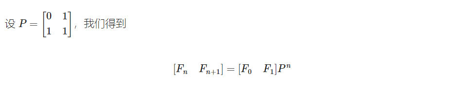
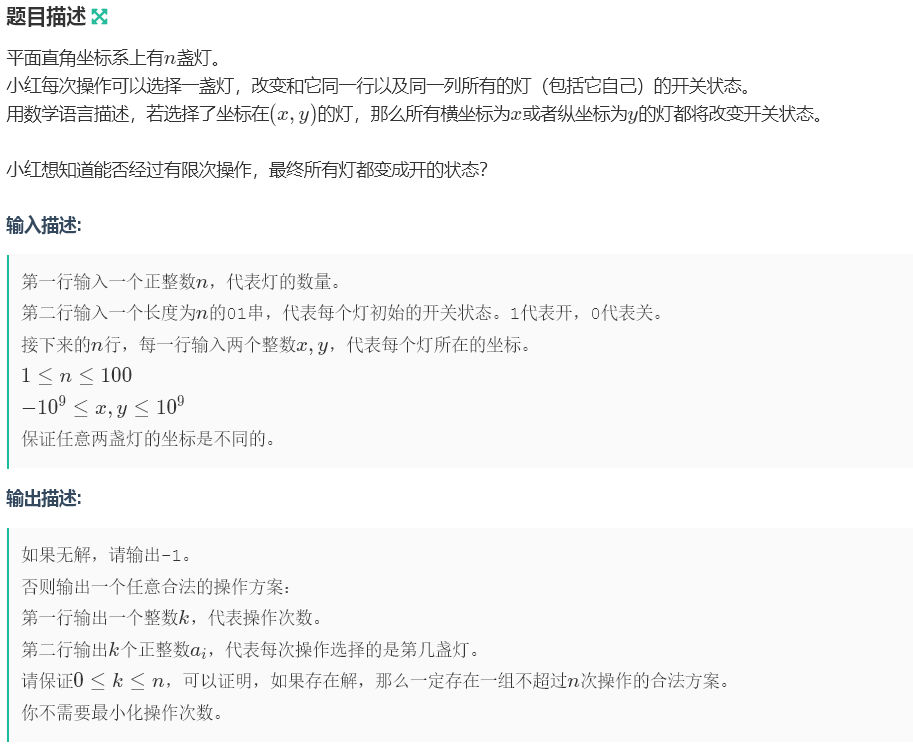
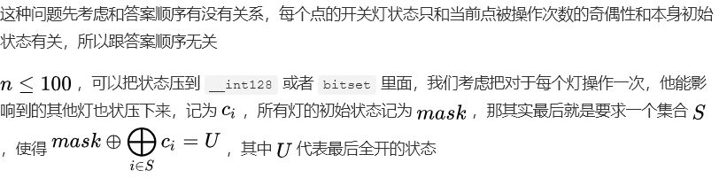
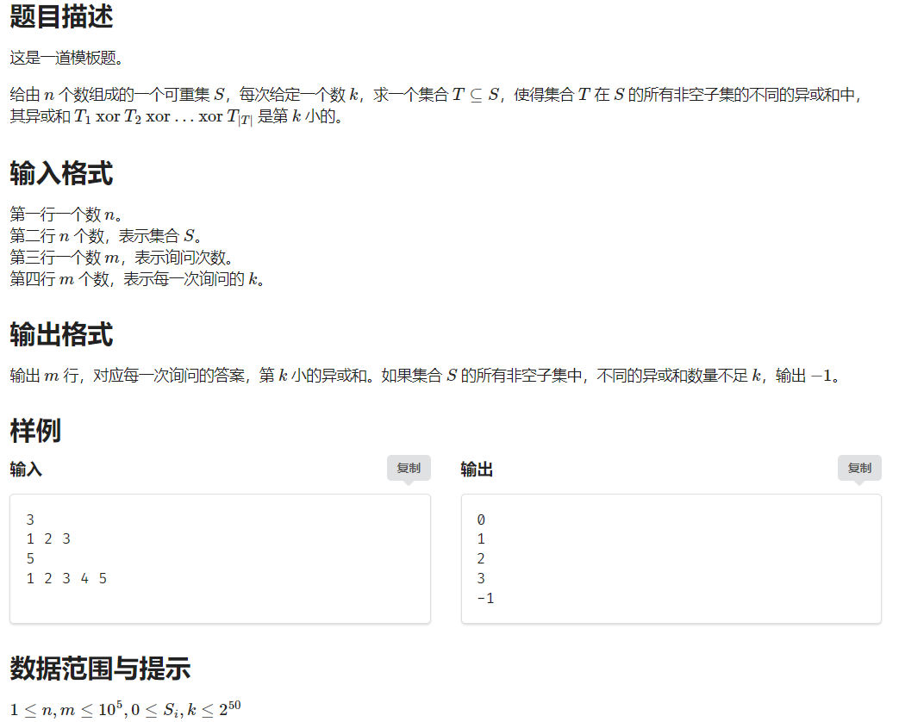
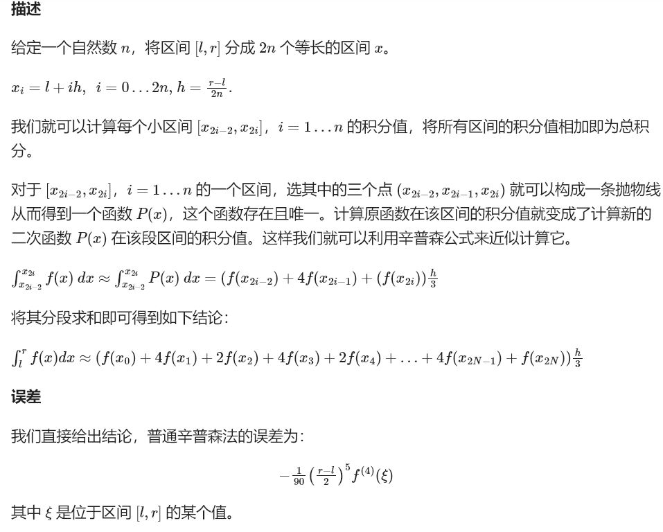
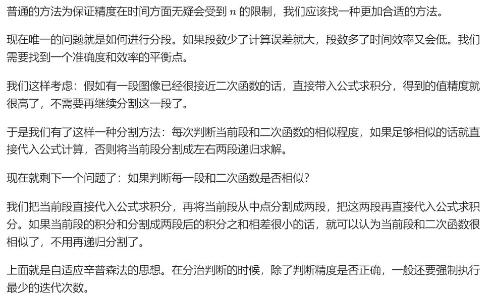

# 数论

## 杜教筛

杜教筛被用于处理一类数论函数的前缀和问题。对于数论函数 $f$，杜教筛可以在低于线性时间的复杂度内计算 $S(n)=\sum_{i=1}^{n}f(i)$。

我们想办法构造一个 $S(n)$ 关于 $S\left(\left\lfloor\frac{n}{i}\right\rfloor\right)$ 的递推式。

对于任意一个数论函数 $g$，必满足：

$$
\begin{aligned}
    \sum_{i=1}^{n}(f * g)(i) & =\sum_{i=1}^{n}\sum_{d \mid i}g(d)f\left(\frac{i}{d}\right)           \\
                             & =\sum_{i=1}^{n}g(i)S\left(\left\lfloor\frac{n}{i}\right\rfloor\right)
\end{aligned}
$$

其中 $f*g$ 为数论函数 $f$ 和 $g$ 的 [狄利克雷卷积](../poly/dgf.md#dirichlet-%E5%8D%B7%E7%A7%AF)。
$$
    \begin{aligned}
        \sum_{i=1}^n\sum_{d \mid i}g(d)f\left(\frac{i}{d}\right) & =\sum_{i=1}^n\sum_{j=1}^{\left\lfloor n/i \right\rfloor}g(i)f(j) \\
                                                                 & =\sum_{i=1}^ng(i)\sum_{j=1}^{\left\lfloor n/i \right\rfloor}f(j) \\
                                                                 & =\sum_{i=1}^ng(i)S\left(\left\lfloor\frac{n}{i}\right\rfloor\right)
    \end{aligned}
    $$

那么可以得到递推式：

$$
\begin{aligned}
    g(1)S(n) & = \sum_{i=1}^n g(i)S\left(\left\lfloor\frac{n}{i}\right\rfloor\right) - \sum_{i=2}^n g(i)S\left(\left\lfloor\frac{n}{i}\right\rfloor\right) \\
             & = \sum_{i=1}^n (f * g)(i) - \sum_{i=2}^n g(i)S\left(\left\lfloor\frac{n}{i}\right\rfloor\right)
\end{aligned}
$$

假如我们可以构造恰当的数论函数 $g$ 使得：

1.  可以快速计算 $\sum_{i=1}^n(f * g)(i)$；
2.  可以快速计算 $g$ 的前缀和，以用数论分块求解 $\sum_{i=2}^ng(i)S\left(\left\lfloor\dfrac{n}{i}\right\rfloor\right)$。

则我们可以在较短时间内求得 $g(1)S(n)$。

## 数论分块

数论分块可以快速计算一些含有除法向下取整的和式（即形如 $\sum_{i=1}^nf(i)g(\left\lfloor\dfrac ni\right\rfloor)$ 的和式）。当可以在 $O(1)$ 内计算 $f(r)-f(l)$ 或已经预处理出 $f$ 的前缀和时，数论分块就可以在 $O(\sqrt n)$ 的时间内计算上述和式的值。

它主要利用了富比尼定理（Fubini's theorem），将 $\left\lfloor\dfrac ni\right\rfloor$ 相同的数打包同时计算。


### 引理 1

$$
\forall a,b,c\in\mathbb{Z},\left\lfloor\frac{a}{bc}\right\rfloor=\left\lfloor\frac{\left\lfloor\frac{a}{b}\right\rfloor}{c}\right\rfloor
$$

### 引理 2

$$
\forall n \in \mathbb{N}_{+},  \left|\left\{ \lfloor \frac{n}{d} \rfloor \mid d \in \mathbb{N}_{+},d\leq n \right\}\right| \leq \lfloor 2\sqrt{n} \rfloor
$$

$|V|$ 表示集合 $V$ 的元素个数

### 数论分块结论

对于常数 $n$，使得式子

$$
\left\lfloor\dfrac ni\right\rfloor=\left\lfloor\dfrac nj\right\rfloor
$$

成立且满足 $i\leq j\leq n$ 的 $j$ 值最大为 $\left\lfloor\dfrac n{\lfloor\frac ni\rfloor}\right\rfloor$，即值 $\left\lfloor\dfrac ni\right\rfloor$ 所在块的右端点为 $\left\lfloor\dfrac n{\lfloor\frac ni\rfloor}\right\rfloor$。

### 过程

数论分块的过程大概如下：考虑和式

$\sum_{i=1}^nf(i)\left\lfloor\dfrac ni\right\rfloor$

那么由于我们可以知道 $\left\lfloor\dfrac ni\right\rfloor$ 的值成一个块状分布（就是同样的值都聚集在连续的块中），那么就可以用数论分块加速计算，降低时间复杂度。

利用上述结论，我们先求出 $f(i)$ 的 **前缀和**（记作 $s(i)=\sum_{j=1}^i f(j)$），然后每次以 $[l,r]=[l,\left\lfloor\dfrac n{\lfloor\frac ni\rfloor}\right\rfloor]$ 为一块，分块求出贡献累加到结果中即可。

伪代码如下：

$$
\begin{array}{ll}
1 & \text{Calculate $s(i)$, the prefix sum of $f(i)$.} \\
2 & l \gets 1\\
3 & r \gets 0\\
4 & \textit{result} \gets 0 \\
5 & \textbf{while } l \leq n \textbf{ do} : \\
6 & \qquad r \gets \left\lfloor \dfrac{n}{\lfloor n/l \rfloor} \right\rfloor\\
7 & \qquad \textit{result} \gets \textit{result} + [s(r)-s(l-1)] \times\left\lfloor \dfrac{n}{l} \right\rfloor\\
8 & \qquad l \gets r+1\\
9 & \textbf{end while }\\
\end{array}
$$

最终得到的 $result$ 即为所求的和式。

### 向上取整的数论分块

向上取整与前文所述的向下取整十分类似，但略有区别：

对于常数 $n$，使得式子

$$
\left\lceil\dfrac ni\right\rceil=\left\lceil\dfrac nj\right\rceil
$$

成立且满足 $i\leq j\leq n$ 的 $j$ 值最大为 $\left\lfloor\dfrac{n-1}{\lfloor\frac{n-1}i\rfloor}\right\rfloor$，即值 $\left\lceil\dfrac ni\right\rceil$ 所在块的右端点为 $\left\lfloor\dfrac{n-1}{\lfloor\frac{n-1}i\rfloor}\right\rfloor$。

$i=n$ 时，上式会出现分母为 $0$ 的错误，需要特殊处理。

### N 维数论分块

求含有 $\left\lfloor\dfrac {a_1}i\right\rfloor$、$\left\lfloor\dfrac {a_2}i\right\rfloor\cdots\left\lfloor\dfrac {a_n}i\right\rfloor$ 的和式时，数论分块右端点的表达式从一维的 $\left\lfloor\dfrac ni\right\rfloor$ 变为 $\min\limits_{j=1}^n\{\left\lfloor\dfrac {a_j}i\right\rfloor\}$，即对于每一个块的右端点取最小（最接近左端点）的那个作为整体的右端点。可以借助下图理解：

一般我们用的较多的是二维形式，此时可将代码中 `r = n / (n / i)` 替换成 `r = min(n / (n / i), m / (m / i))`。

### 数论分块扩展

以计算含有 $\left\lfloor\sqrt{\frac{n}{d}}\right\rfloor$ 的和式为例。考虑对于一个正整数 $n$，如何求出集合

$$
S=\left\{\left\lfloor\sqrt{\frac{n}{d}}\right\rfloor\mid d\in \mathbb{N}_{+}, d\leq n\right\}
$$

的所有值，以及对每一种值求出哪些 $d$ 会使其取到这个值。

结论是：使得式子

$$
\left\lfloor\sqrt{\frac{n}{p}}\right\rfloor=\left\lfloor\sqrt{\frac{n}{q}}\right\rfloor
$$

成立的最大的 $q$ 满足 $p\leq q\leq n$ 为

$$
\left\lfloor\frac{n}{\left\lfloor\sqrt{n/p}\right\rfloor^2}\right\rfloor
$$


## Dirichlet 卷积 （狄利克雷卷积）

### 定义

对于两个数论函数 $f(x)$ 和 $g(x)$，则它们的狄利克雷卷积得到的结果 $h(x)$ 定义为：

$$
h(x)=\sum_{d\mid x}{f(d)g\left(\dfrac xd \right)}=\sum_{ab=x}{f(a)g(b)}
$$

上式可以简记为：

$$
h=f*g
$$
狄利克雷卷积的单位元定义为 $\varepsilon$ ：
$$
\varepsilon (n)=
\begin{cases}
1&(n=1)\\
0&(n\ne 1)
\end{cases}
$$
### 性质

**交换律：** $f*g=g*f$。

**结合律：**$(f*g)*h=f*(g*h)$。

**分配律：**$(f+g)*h=f*h+g*h$。

**等式的性质：** $f=g$ 的充要条件是 $f*h=g*h$，其中数论函数 $h(x)$ 要满足 $h(1)\ne 0$。

如果 $f,g$ 均为积性函数，那么 $f*g$ 也是积性函数

**单位元：** 单位函数 $\varepsilon$ 是 Dirichlet 卷积运算中的单位元，即对于任何数论函数 $f$，都有 $f*\varepsilon=f$。

**逆元：** 对于任何一个满足 $f(x)\ne 0$ 的数论函数，如果有另一个数论函数 $g(x)$ 满足 $f*g=\varepsilon$，则称 $g(x)$ 是 $f(x)$ 的逆元。由 **等式的性质** 可知，逆元是唯一的。

容易构造出 $g(x)$ 的表达式为：

$$
g(x)=\dfrac {\varepsilon(x)-\sum_{d\mid x,d\ne 1}{f(d)g\left(\dfrac {x}{d} \right)}}{f(1)}
$$

### 重要结论

**两个积性函数的 Dirichlet 卷积也是积性函数** 

**积性函数的逆元也是积性函数**

## 莫比乌斯函数

### 定义

$\mu$ 为莫比乌斯函数，定义为

$$
\mu(n)=
\begin{cases}
1&n=1\\
0&n\text{ 含有平方因子}\\
(-1)^k&k\text{ 为 }n\text{ 的本质不同质因子个数}\\
\end{cases}
$$

详细解释一下：

令 $n=\prod_{i=1}^kp_i^{c_i}$，其中 $p_i$ 为质因子，$c_i\ge 1$。上述定义表示：

1.  $n=1$ 时，$\mu(n)=1$；
2.  对于 $n\not= 1$ 时：
    1.  当存在 $i\in [1,k]$，使得 $c_i > 1$ 时，$\mu(n)=0$，也就是说只要某个质因子出现的次数超过一次，$\mu(n)$ 就等于 $0$；
    2.  当任意 $i\in[1,k]$，都有 $c_i=1$ 时，$\mu(n)=(-1)^k$，也就是说每个质因子都仅仅只出现过一次时，即 $n=\prod_{i=1}^kp_i$，$\{p_i\}_{i=1}^k$ 中个元素唯一时，$\mu(n)$ 等于 $-1$ 的 $k$ 次幂，此处 $k$ 指的便是仅仅只出现过一次的质因子的总个数。

### 性质

莫比乌斯函数不仅是积性函数，还有如下性质：

$$
\sum_{d\mid n}\mu(d)=
\begin{cases}
1&n=1\\
0&n\neq 1\\
\end{cases}
$$

即 $\sum_{d\mid n}\mu(d)=\varepsilon(n)$，$\mu * 1 =\varepsilon$

### 线性筛求莫比乌斯函数

```cpp
vector<int> p;
bool flg[N];
int mu[N],pmu[N];
void getmu(int n) {
    mu[1] = 1;
    for (int i = 2; i <= n; i++) {
        if (!flg[i]) {
            p.push_back(i);
            mu[i] = -1;
        }
        for (int pj : p) {
            if (i * pj > n)
                break;
            flg[i * pj] = true;
            if (i % pj == 0) {
                mu[i * pj] = 0;
                break;
            }
            mu[i * pj] = -mu[i];
        }
    }
    for(int i = 1; i <= n; i++) {
        pmu[i] = pmu[i - 1] + mu[i];
    }
}
```

## 莫比乌斯变换

设 $f(n),g(n)$ 为两个数论函数。

形式一：如果有 $f(n)=\sum_{d\mid n}g(d)$，那么有 $g(n)=\sum_{d\mid n}\mu(d)f(\frac{n}{d})$。
形式二：如果有 $f(n)=\sum_{n|d}g(d)$，那么有 $g(n)=\sum_{n|d}\mu(\frac{d}{n})f(d)$。

### 结论

- $[\gcd(i,j)=1]=\sum_{d|\gcd(i,j)}\mu(d)$ 
- $[n=1]=\sum_{d|n}\mu(d)$
- 令 $g(T)=\sum_{d|T}f(d)\mu(\frac{T}{d})=f*u$ ，则有

$$
\sum^{n}_{i=1}\sum^{m}_{j=1}f(\gcd(i,j))(n\le m)=\sum^{n}_{T=1}g(T)\lfloor\frac{n}{T}\rfloor\lfloor\frac{m}{T}\rfloor
$$


## Beatty定理与Wythoff博弈

### Beatty定理


推论3
假设正无理数 $1<r<s$ 且$1/r+1/s=1$ ，有
		$(\mathcal{B}_r)_i = \operatorname{mex}\left\{ 0, (\mathcal{B}_r)_j, (\mathcal{B}_s)_j | j < i \right\}$ 
这里$\operatorname{mex}S$指的是取最小的没有在集合$S$中出现的非负整数。

### Wythoff博弈
Wythoff博弈的玩法是，有两堆石子，石子数分别为 $n,m$ 。两个玩家轮流进行，轮到一方的时候，该玩家可以做

- 从其中一堆石子中取走 $x>0$ 个（$x$  不能超过该堆的石子数）；
- 从两堆石子中同时取走 $x>0$ 个（$x$  不能超过任意一堆的石子数）。

如果轮到某方的时候，玩家无法操作，则该玩家输。


### k-Wythoff博弈
k-Wythoff博弈是Wythoff博弈的推广，其和Wythoff博弈唯一的区别是轮到某个玩家时，玩家可以：

- 从其中一堆石子中取走 $x>0$  个；
- 从两堆石子中分别取走 $x>0,y>0$个，满足 $|x−y|≤k$。


## 二次剩余


### 定义

令整数$a$， $p$满足$(a,p)=1$，若存在正整数使得
$x^2 \equiv a\ \ \ (\bmod\ p)$
则称$a$为模$p$的二次剩余，否则称$a$为模$p$的非二次剩余。（以下只讨论$p$为**奇素数**的情况）


### Euler 判别法


### 剩余系判别法


### Legendre 符号

 对奇素数$p$和整数$a$，定义 Legendre 符号如下：  

$$
\left(\frac{a}{p}\right)=\begin{cases}
 0, & p\mid a,\\
 1, & (p\nmid a) \land ((\exists x\in\mathbf{Z}),~~a\equiv x^2\pmod p),\\
 -1, & \text{otherwise}.\\
 \end{cases}
$$

#### 性质


#### 二次互反律


### 方程求解

对于方程$x^2 \equiv a\ \ \ (\bmod\ p)$，$p$为奇素数时的求解， 方程只有两个解，且它们互为相反数。  

#### 特殊情况算法


#### Cipolla 算法

```cpp
int cpxmod,ii;
struct cpx{
    ll real,imag;
    cpx(ll real=0,ll imag=0):real(real),imag(imag){};
    bool operator==(const cpx& o)const{
        return real==o.real && imag==o.imag;
    };
    cpx operator*(const cpx& o)const{
        return cpx((real*o.real+ii*imag%cpxmod*o.imag)%cpxmod,
        (imag*o.real+real*o.imag)%cpxmod);
    }
};
cpx qpow(cpx a,int b){
    cpx res=1;
    for(;b;b>>=1){
        if(b&1)
            res=res*a;
        a=a*a;
    }
    return res;
}
ll qpow(ll a,ll b,ll p){
    ll res=1;
    for(;b;b>>=1){
        if(b&1)
            res=res*a%p;
        a=a*a%p;
    }
    return res;
}
vector<int> cipolla(int a,int p){// x^2 === a (mod p) ^为次方，p为奇素数
    if(!a)//特判a==0
        return vector<int> {0};
    if(qpow(a,(p-1)/2,p)==p-1)//无解
        return vector<int>();
    cpxmod=p;
    ll r=rand()%p;
    while(true){
        r=rand()%p;
        ii=(r*r-a+p)%p;
        if(qpow(ii,(p-1)/2,p)==p-1)
            break;
    }
    int x0=qpow(cpx(r,1),(p+1)/2).real;
    int x1=p-x0;
    if(x0==x1)
        return vector<int> {x0};
    if(x0>x1)
        swap(x0,x1);
    return vector<int> {x0,x1};
}
```

例题


```cpp
#include"bits/stdc++.h"
#define ll long long
#define endl '\n'
using namespace std;
constexpr int N=1e5+10,inf=0X3F3F3F3F;
constexpr ll INF=0X3F3F3F3F3F3F3F3F;

int cpxmod,ii;
struct cpx{
    ll real,imag;
    cpx(ll real=0,ll imag=0):real(real),imag(imag){};
    bool operator==(const cpx& o)const{
        return real==o.real && imag==o.imag;
    };
    cpx operator*(const cpx& o)const{
        return cpx((real*o.real+ii*imag%cpxmod*o.imag)%cpxmod,
        (imag*o.real+real*o.imag)%cpxmod);
    }
};
cpx qpow(cpx a,int b){
    cpx res=1;
    for(;b;b>>=1){
        if(b&1)
            res=res*a;
        a=a*a;
    }
    return res;
}
ll qpow(ll a,ll b,ll p){
    ll res=1;
    for(;b;b>>=1){
        if(b&1)
            res=res*a%p;
        a=a*a%p;
    }
    return res;
}
vector<int> cipolla(int a,int p){// x^2 === a (mod p) ^为次方，p为奇素数
    if(!a)//特判a==0
        return vector<int> {0};
    if(qpow(a,(p-1)/2,p)==p-1)//无解
        return vector<int>();
    cpxmod=p;
    ll r=rand()%p;
    while(true){
        r=rand()%p;
        ii=(r*r-a+p)%p;
        if(qpow(ii,(p-1)/2,p)==p-1)
            break;
    }
    int x0=qpow(cpx(r,1),(p+1)/2).real;
    int x1=p-x0;
    if(x0==x1)
        return vector<int> {x0};
    if(x0>x1)
        swap(x0,x1);
    return vector<int> {x0,x1};
}
void solve(){
    int a,p;
    cin>>a>>p;
    vector<int> ans=cipolla(a,p);
    if(ans.empty()){
        cout<<"Hola!"<<endl;
    }else{
        for(auto x:ans)
            cout<<x<<' ';
        cout<<endl;
    }
}
signed main(){
    cin.tie(nullptr)->sync_with_stdio(0);
    int t;cin>>t;while(t--)
    solve();
    return 0;
}
```

## 离散对数


### 求一个离散对数

暴力求原根后运用大步小步算法即可得到一个离散对数
 `bsgs(priroot(m),a,m)`

```cpp
ll qpow(ll a,ll b,ll p){
    ll res=1%p;
    for(;b;b>>=1){
        if(b&1)
            res=res*a%p;
        a=a*a%p;
    }
    return res;
}
int priroot(int p){//求原根
    vector<int>fact;
    int phi=p-1,n=phi;
    for(int i=2;i<=n/i;i++){
        if(n%i==0){
            fact.push_back(i);
            while(n%i==0)
                n/=i;
        }
    }
    if(n>1)
        fact.push_back(n);
    for(int cur=1;;cur++){
        bool ok=true;
        for(auto x:fact){
            if(qpow(cur,phi/x,p)==1){
                ok=false;
                break;
            }
        }
        if(ok)
            return cur;

    }
    return -1;//无解
}
ll bsgs(ll a,ll b,ll p){//求解 a^x === b (mod p),^表示次方,a,b,p须正整数,gcd(a,p)==1.
    if(a%p==b%p)//这个时候 a 和 b 模 p 同余，那么 x = 1 应该是最小的整数解
        return 1;
    if(a%p==0&&b)//如果 a = 0 但是 b 不为 0，那么很显然无解
        return -1;

    ll sq=ceil(sqrt(p));
    ll tmp=qpow(a,sq,p);
    unordered_map<ll,ll>mp;

    for(int i=0;i<=sq;i++){//小步
        mp[b]=i;
        b=b*a%p;
    }

    b=1;
    for(int i=1;i<=sq;i++){//大步
        b=b*tmp%p;
        if(mp[b]){
            return i*sq-mp[b];
        }
    }
    return -1;//无解
}
```

### 进阶：高次同余方程（模数为质数）


```cpp
ll qpow(ll a,ll b,ll p){
    ll res=1%p;
    for(;b;b>>=1){
        if(b&1)
            res=res*a%p;
        a=a*a%p;
    }
    return res;
}
int priroot(int p){//求原根
    vector<int>fact;
    int phi=p-1,n=phi;
    for(int i=2;i<=n/i;i++){
        if(n%i==0){
            fact.push_back(i);
            while(n%i==0)
                n/=i;
        }
    }
    if(n>1)
        fact.push_back(n);
    for(int cur=1;;cur++){
        bool ok=true;
        for(auto x:fact){
            if(qpow(cur,phi/x,p)==1){
                ok=false;
                break;
            }
        }
        if(ok)
            return cur;

    }
    return -1;//无解
}
ll bsgs(ll a,ll b,ll p){//求解 a^x === b (mod p),^表示次方,a,b,p须正整数,gcd(a,p)==1.
    if(a%p==b%p)//这个时候 a 和 b 模 p 同余，那么 x = 1 应该是最小的整数解
        return 1;
    if(a%p==0&&b)//如果 a = 0 但是 b 不为 0，那么很显然无解
        return -1;

    ll sq=ceil(sqrt(p));
    ll tmp=qpow(a,sq,p);
    unordered_map<ll,ll>mp;

    for(int i=0;i<=sq;i++){//小步
        mp[b]=i;
        b=b*a%p;
    }

    b=1;
    for(int i=1;i<=sq;i++){//大步
        b=b*tmp%p;
        if(mp[b]){
            return i*sq-mp[b];
        }
    }
    return -1;//无解
}
vector<int> funall(int a,int b,int p){//求解 x^a === b (mod p),^表示次方,a,b须正整数,p须质数.
    int g=priroot(p);
    ll c=bsgs(qpow(g,a,p),b,p);
    // cerr<<c<<endl;
    if(c==-1){
        // return vector<int>(1,-1);
        return vector<int>();
    }
    int dlt=(p-1)/gcd(a,p-1);
    // cerr<<dlt<<endl;
    vector<int>ans;
    for(int cur=c%dlt;cur<p-1;cur+=dlt)
        ans.push_back(qpow(g,cur,p));//顺序不一定有序
    return ans;
}
```

## 大步小步算法

a与m必须互质

a与m必须互质

```cpp
ll qpow(ll a,ll b,ll p){
    ll res=1%p;
    for(;b;b>>=1){
        if(b&1)
            res=res*a%p;
        a=a*a%p;
    }
    return res;
}
ll bsgs(ll a,ll b,ll p){//求解 a^x === b (mod p),^表示次方,a,b,p须正整数,gcd(a,p)==1.
    if(a%p==b%p)//这个时候 a 和 b 模 p 同余，那么 x = 1 应该是最小的整数解
        return 1;
    if(a%p==0&&b)//如果 a = 0 但是 b 不为 0，那么很显然无解
        return -1;

    ll sq=ceil(sqrt(p));
    ll tmp=qpow(a,sq,p);
    unordered_map<ll,ll>mp;

    for(int i=0;i<=sq;i++){//小步
        mp[b]=i;
        b=b*a%p;
    }

    b=1;
    for(int i=1;i<=sq;i++){//大步
        b=b*tmp%p;
        if(mp[b])
            return i*sq-mp[b];
    }
    return -1;//无解
}
```

### 例题


```cpp
#include"bits/stdc++.h"
#define ll long long
#define endl '\n'
using namespace std;
constexpr int N=1e5+10,inf=0X3F3F3F3F;
constexpr ll INF=0X3F3F3F3F3F3F3F3F;
ll qpow(ll a,ll b,ll p){
    ll res=1%p;
    for(;b;b>>=1){
        if(b&1)
            res=res*a%p;
        a=a*a%p;
    }
    return res;
}
ll bsgs(ll a,ll b,ll p){//求解 a^x === b (mod p),^表示次方,a,b,p须正整数,gcd(a,p)==1.
    if(a%p==b%p)//这个时候 a 和 b 模 p 同余，那么 x = 1 应该是最小的整数解
        return 1;
    if(a%p==0&&b)//如果 a = 0 但是 b 不为 0，那么很显然无解
        return -1;

    ll sq=ceil(sqrt(p));
    ll tmp=qpow(a,sq,p);
    unordered_map<ll,ll>mp;

    for(int i=0;i<=sq;i++){//小步
        mp[b]=i;
        b=b*a%p;
    }

    b=1;
    for(int i=1;i<=sq;i++){//大步
        b=b*tmp%p;
        if(mp[b])
            return i*sq-mp[b];
    }
    return -1;//无解
}
void solve(){
    int p,b,n;
    cin>>p>>b>>n;
    ll tmp=bsgs(b,n,p);
    if(tmp!=-1){
        cout<<tmp<<endl;
    }else{
        cout<<"no solution"<<endl;
    }
}
signed main(){
    cin.tie(nullptr)->sync_with_stdio(0);
//    int t;cin>>t;while(t--)
    solve();
    return 0;
}
```

## 扩展大步小步算法


```cpp
ll qpow(ll a,ll b,ll p){
    ll res=1%p;
    for(;b;b>>=1){
        if(b&1)
            res=res*a%p;
        a=a*a%p;
    }
    return res;
}
ll exgcd(ll a,ll b,ll &x,ll &y){
    if(!b){
        x=1;
        y=0;
        return a;
    }
    ll d=exgcd(b,a%b,y,x);
    y-=a/b*x;
    return d;
}
ll bsgs(ll a,ll b,ll p){//求解 a^x === b (mod p),^表示次方,a,b,p须正整数,gcd(a,p)==1.返回最小整数解
    if(a%p==b%p)//这个时候 a 和 b 模 p 同余，那么 x = 1 应该是最小的整数解
        return 1;
    if(a%p==0&&b)//如果 a = 0 但是 b 不为 0，那么很显然无解
        return -1;
    ll sq=ceil(sqrt(p));
    ll tmp=qpow(a,sq,p);
    unordered_map<ll,ll>mp;
    for(int i=0;i<=sq;i++){//小步
        mp[b]=i;
        b=b*a%p;
    }
    b=1;
    for(int i=1;i<=sq;i++){//大步
        b=b*tmp%p;
        if(mp[b]){
            return i*sq-mp[b];
        }
    }
    return -1;//无解
}
ll exbsgs(ll a,ll b,ll p){//求解 a^x === b (mod p),^表示次方,a,b,p须正整数.返回最小整数解
    b=(b%p+p)%p;
    if(1%p==b%p)
        return 0;
    ll d,x,y,res;
    if((d=exgcd(a,p,x,y))!=1){
        if(b%d)
            return -1;
        exgcd(a/d,p/d,x,y);
        return ((res=exbsgs(a,b/d*x%(p/d),p/d))==-1?-1:res+1);
    }
    return bsgs(a,b,p);
}
```

### 例题

[https://www.luogu.com.cn/problem/P4195](https://www.luogu.com.cn/problem/P4195)


```cpp
#include"bits/stdc++.h"
#define ll long long
#define endl '\n'
using namespace std;
constexpr int N=1e5+10,inf=0X3F3F3F3F;
constexpr ll INF=0X3F3F3F3F3F3F3F3F;
ll qpow(ll a,ll b,ll p){
    ll res=1%p;
    for(;b;b>>=1){
        if(b&1)
            res=res*a%p;
        a=a*a%p;
    }
    return res;
}
ll exgcd(ll a,ll b,ll &x,ll &y){
    if(!b){
        x=1;
        y=0;
        return a;
    }
    ll d=exgcd(b,a%b,y,x);
    y-=a/b*x;
    return d;
}
ll bsgs(ll a,ll b,ll p){//求解 a^x === b (mod p),^表示次方,a,b,p须正整数,gcd(a,p)==1.返回最小整数解
    if(a%p==b%p)//这个时候 a 和 b 模 p 同余，那么 x = 1 应该是最小的整数解
        return 1;
    if(a%p==0&&b)//如果 a = 0 但是 b 不为 0，那么很显然无解
        return -1;
    ll sq=ceil(sqrt(p));
    ll tmp=qpow(a,sq,p);
    unordered_map<ll,ll>mp;
    for(int i=0;i<=sq;i++){//小步
        mp[b]=i;
        b=b*a%p;
    }
    b=1;
    for(int i=1;i<=sq;i++){//大步
        b=b*tmp%p;
        if(mp[b]){
            return i*sq-mp[b];
        }
    }
    return -1;//无解
}
ll exbsgs(ll a,ll b,ll p){//求解 a^x === b (mod p),^表示次方,a,b,p须正整数.返回最小整数解
    b=(b%p+p)%p;
    if(1%p==b%p)
        return 0;
    ll d,x,y,res;
    if((d=exgcd(a,p,x,y))!=1){
        if(b%d)
            return -1;
        exgcd(a/d,p/d,x,y);
        return ((res=exbsgs(a,b/d*x%(p/d),p/d))==-1?-1:res+1);
    }
    return bsgs(a,b,p);
}
void solve(){
    int a,b,p;
    while(cin>>a>>p>>b){
        if(!(a||b||p))
            return;
        ll ans=exbsgs(a,b,p);
        if(ans==-1)
            cout<<"No Solution"<<endl;
        else
            cout<<ans<<endl;
    }
}
signed main(){
    cin.tie(nullptr)->sync_with_stdio(0);
    // int t;cin>>t;while(t--)
    solve();
    return 0;
}
```

## 算数基本定理


### 推论

若正整数$N$被唯一分解成$N=p_{1}^{c_1}p_{2}^{c_2}\dots p_{m}^{c_m}$，其中$c_i$都是正整数，$p_i$都是质数，且满足$p_1<p_2<\dots <p_m$，则$N$的正约数集合可写作：
$\{p_{1}^{b_1}p_{2}^{b_2}\dots p_{m}^{b_m} \},其中0\leq b_i \leq c_i$
$N$的正约数个数为：
$(c_1+1)*(c_2+1)*\dots *(c_m+1)=\prod_{i=1}^{m}(c_i+1)$
$N$的所有正约数的和为：
$(1+p_1+p_1^2+\dots +p_1^{c_1})*\dots *(1+p_m+p_m^2+\dots +p_m^{c_m})=\prod_{i=1}^m\lgroup \sum_{j=0}^{c_i}(p_i)^j \rgroup$

## 卢卡斯定理


```cpp
long long Lucas(long long n, long long m, long long p) {
  if (m == 0) return 1;
  return (C(n % p, m % p, p) * Lucas(n / p, m / p, p)) % p;
}
```

## 伯特兰-切比雪夫定理

伯特兰—切比雪夫定理说明：若整数n＞3，则至少存在一个质数p，符合n＜p＜2n − 2。另一个稍弱说法是：对于所有大于1的整数n，至少存在一个质数p，符合n＜p＜2n。

## 原根


### 阶

#### 定义

由欧拉定理可知，对 $a \in \mathbf{Z},\ m\in \mathbf{N^*}$，若$(a,m)=1$，则$a^{\varphi(m)}\equiv 1\ (\bmod\ m)$.
 因此满足同余式$a^{n}\equiv 1\ (\bmod\ m)$的最小正整数$n$存在，这个$n$称作$a$模$m$的阶，记作$\delta _m{(a)}$或$ord _m{(a)}$.  

#### 性质

- $a,a^2,\dots,a^{\delta _m{(a)}}$模$m$两两不同余。  

- 若$a^{n}\equiv 1\ (\bmod\ m)$，则$\delta _m{(a)}\  |\  n$.  据此还可推出：若$a^{p}\equiv a^{q}\ (\bmod\ m)$，则有${p}\equiv {q}\ (\bmod\ \delta _m{(a)})$.

- 

- 
  

#### 求阶
  
  根据欧拉定理，显然$\delta _m{(a)}\  |\  \varphi(m)$，我们可以枚举约数求阶。
  单次显然是$O(\sqrt{n})$
  多次可以预处理1~n所有质数，利用质因子加速
  时间复杂度$O(n+T\ log^2\ n)$
  
  ```cpp
  struct Phi{
    vector<int>vis,prime,phi;
    //vis记录最小质因数，prime记录质数，phi记录欧拉函数
    const int n;
    Phi(const int& _n):n(_n),vis(_n+1),phi(_n+1){
        phi[1]=1;
        for(int i=2;i<=n;i++){
            if(!vis[i]){
                vis[i]=i;
                prime.push_back(i);
                phi[i]=i-1;
            }
            for(int j:prime){
                if(i*j>n)
                    break;
                vis[i*j]=j;
                if(i%j==0){
                    phi[i*j]=phi[i]*j;
                    break;
                }
                phi[i*j]=phi[i]*phi[j];
            }
        }
    }
  }pi(N);//预处理1~N的欧拉函数和质数
  ll qpow(ll a,ll b,ll p){
    ll res=1;
    for(;b;b>>=1){
        if(b&1)
            res=res*a%p;
        a=a*a%p;
    }
    return res;
  }
  int ord(int a,int m){// pow(a,ord) === 1 (mod m)
    int t=pi.phi[m],t1=t;
    for(auto val:pi.prime){
        if(val>t1/val)
            break;
        while(t%val==0&&qpow(a,t/val,m)==1)
            t/=val;
        while(t1%val==0)
            t1/=val;
    }
    if(t1>1&&qpow(a,t/t1,m)==1)
        t/=t1;
    return t;
  }
  ```
  
   
### 原根

  
  
  
  
  
  
  
  ```cpp
  ll qpow(ll a,ll b,ll p){
    ll res=1%p;
    for(;b;b>>=1){
        if(b&1)
            res=res*a%p;
        a=a*a%p;
    }
    return res;
  }
  int priroot(int p){//求原根
    vector<int>fact;
    int phi=p-1,n=phi;
    for(int i=2;i<=n/i;i++){
        if(n%i==0){
            fact.push_back(i);
            while(n%i==0)
                n/=i;
        }
    }
    if(n>1)
        fact.push_back(n);
    for(int cur=1;cur<p;cur++){
        bool ok=true;
        for(auto x:fact){
            if(qpow(cur,phi/x,p)==1){
                ok=false;
                break;
            }
        }
        if(ok)
            return cur;
  
    }
    return -1;//无解
  }
  ```

## 裴蜀定理


## 费马小定理


## 欧拉定理


## 扩展欧拉定理


## 威尔逊定理

若$p$为素数，则$p$可以整除$(p-1) \ !+1$。

- $((p-1) \ !+1)mod \ p=0$

- $(p-1) \ ! \  mod \ p=p-1$

- $(p-1) \ !=pq-1,q为正整数$

- $用同余表示为(p-1) \ ! \equiv -1(mod \ p)$

  
## 质数
  
### 埃氏筛
  
  ```cpp
  vector<int>primes;
  int is_prime[N];//当为0的时候为质数
  void getprimes(int n){
    for (int i = 2; i <= n ; ++i) {
        if (!is_prime[i]){
            primes.push_back(i);
            for (int j = i+i; j <= n ; j+=i)
                is_prime[j]=1;
        }
    }
  }
  ```
  
### 线性筛（欧拉筛）
  
  ```cpp
  vector<int> pri;
  bool not_prime[N];
  void pre(int n) {
    for (int i = 2; i <= n; ++i) {
        if (!not_prime[i]) {
            pri.push_back(i);
        }
        for (int pri_j : pri) {
            if (i * pri_j > n)
                break;
            not_prime[i * pri_j] = true;
            if (i % pri_j == 0) {
                // i % pri_j == 0
                // 换言之，i 之前被 pri_j 筛过了
                // 由于 pri 里面质数是从小到大的，所以 i 乘上其他的质数的结果一定会被
                // pri_j 的倍数筛掉，就不需要在这里先筛一次，所以这里直接 break
                // 掉就好了
                break;
            }
        }
    }
  }
  ```

#### 欧拉筛求约数个数

```cpp
vector<int> pri;
bool not_prime[N];
int d[N], num[N];

void pre(int n) {
  d[1] = 1;
  for (int i = 2; i <= n; ++i) {
    if (!not_prime[i]) {
      pri.push_back(i);
      d[i] = 2;
      num[i] = 1;
    }
    for (int pri_j : pri) {
      if (i * pri_j > n) break;
      not_prime[i * pri_j] = true;
      if (i % pri_j == 0) {
        num[i * pri_j] = num[i] + 1;
        d[i * pri_j] = d[i] / num[i * pri_j] * (num[i * pri_j] + 1);
        break;
      }
      num[i * pri_j] = 1;
      d[i * pri_j] = d[i] * 2;
    }
  }
}
```

#### 欧拉筛求约数和

```cpp
vector<int> pri;
bool not_prime[N];
int g[N], f[N];

void pre(int n) {
  g[1] = f[1] = 1;
  for (int i = 2; i <= n; ++i) {
    if (!not_prime[i]) {
      pri.push_back(i);
      g[i] = i + 1;
      f[i] = i + 1;
    }
    for (int pri_j : pri) {
      if (i * pri_j > n) break;
      not_prime[i * pri_j] = true;
      if (i % pri_j == 0) {
        g[i * pri_j] = g[i] * pri_j + 1;
        f[i * pri_j] = f[i] / g[i] * g[i * pri_j];
        break;
      }
      f[i * pri_j] = f[i] * f[pri_j];
      g[i * pri_j] = 1 + pri_j;
    }
  }
}
```

### Pollard Rho算法
在$O(n^{ \frac{1}{4} })$内求出一个数的一个非平凡因子的算法
```cpp
long long Pollard_Rho(long long x) {
  long long s = 0, t = 0;
  long long c = (long long)rand() % (x - 1) + 1;
  int step = 0, goal = 1;
  long long val = 1;
  for (goal = 1;; goal *= 2, s = t, val = 1) {  // 倍增优化
    for (step = 1; step <= goal; ++step) {
      t = ((__int128)t * t + c) % x;
      val = (__int128)val * abs(t - s) % x;
      if ((step % 127) == 0) {
        long long d = gcd(val, x);
        if (d > 1) return d;
      }
    }
    long long d = gcd(val, x);
    if (d > 1) return d;
  }
}
```

例题
[https://www.luogu.com.cn/problem/P4718](https://www.luogu.com.cn/problem/P4718)


```cpp
#include <bits/stdc++.h>

using namespace std;

typedef long long ll;

int t;
long long max_factor, n;

long long gcd(long long a, long long b) {
  if (b == 0) return a;
  return gcd(b, a % b);
}

long long quick_pow(long long x, long long p, long long mod) {  // 快速幂
  long long ans = 1;
  while (p) {
    if (p & 1) ans = (__int128)ans * x % mod;
    x = (__int128)x * x % mod;
    p >>= 1;
  }
  return ans;
}

bool Miller_Rabin(long long p) {  // 判断素数
  if (p < 2) return 0;
  if (p == 2) return 1;
  if (p == 3) return 1;
  long long d = p - 1, r = 0;
  while (!(d & 1)) ++r, d >>= 1;  // 将d处理为奇数
  for (long long k = 0; k < 10; ++k) {
    long long a = rand() % (p - 2) + 2;
    long long x = quick_pow(a, d, p);
    if (x == 1 || x == p - 1) continue;
    for (int i = 0; i < r - 1; ++i) {
      x = (__int128)x * x % p;
      if (x == p - 1) break;
    }
    if (x != p - 1) return 0;
  }
  return 1;
}

long long Pollard_Rho(long long x) {
  long long s = 0, t = 0;
  long long c = (long long)rand() % (x - 1) + 1;
  int step = 0, goal = 1;
  long long val = 1;
  for (goal = 1;; goal *= 2, s = t, val = 1) {  // 倍增优化
    for (step = 1; step <= goal; ++step) {
      t = ((__int128)t * t + c) % x;
      val = (__int128)val * abs(t - s) % x;
      if ((step % 127) == 0) {
        long long d = gcd(val, x);
        if (d > 1) return d;
      }
    }
    long long d = gcd(val, x);
    if (d > 1) return d;
  }
}

void fac(long long x) {
  if (x <= max_factor || x < 2) return;
  if (Miller_Rabin(x)) {              // 如果x为质数
    max_factor = max(max_factor, x);  // 更新答案
    return;
  }
  long long p = x;
  while (p >= x) p = Pollard_Rho(x);  // 使用该算法
  while ((x % p) == 0) x /= p;
  fac(x), fac(p);  // 继续向下分解x和p
}

int main() {
  scanf("%d", &t);
  while (t--) {
    srand((unsigned)time(NULL));
    max_factor = 0;
    scanf("%lld", &n);
    fac(n);
    if (max_factor == n)  // 最大的质因数即自己
      printf("Prime\n");
    else
      printf("%lld\n", max_factor);
  }
  return 0;
}
```

### Miller-Rabin素数检测

在不考虑乘法的复杂度时，对数 $n$ 进行 $k$ 轮测试的时间复杂度是 $O(k \ logn)$。Miller-Rabbin 素性测试常用于对高精度数进行测试，此时时间复杂度是$O(k \ log^3n)$

```cpp
long long quick_pow(long long x, long long p, long long mod) {  // 快速幂
  long long ans = 1;
  while (p) {
    if (p & 1) ans = (__int128)ans * x % mod;
    x = (__int128)x * x % mod;
    p >>= 1;
  }
  return ans;
}

bool Miller_Rabin(long long p) {  // 判断素数
  if (p < 2) return 0;
  if (p == 2) return 1;
  if (p == 3) return 1;
  long long d = p - 1, r = 0;
  while (!(d & 1)) ++r, d >>= 1;  // 将d处理为奇数
  for (long long k = 0; k < 10; ++k) {
    long long a = rand() % (p - 2) + 2;
    long long x = quick_pow(a, d, p);
    if (x == 1 || x == p - 1) continue;
    for (int i = 0; i < r - 1; ++i) {
      x = (__int128)x * x % p;
      if (x == p - 1) break;
    }
    if (x != p - 1) return 0;
  }
  return 1;
}
```

```cpp
ll Mult_Mod(ll a,ll b,ll m)
{//res=(a*b)%m 龟速乘
    a%=m;b%=m;
    ll res=0;
    while(b)
    {
        if(b&1)
        res=(res+a)% m;
        a=(a<<=1)%m;
        b>>=1;
    }
    return res%m;
}
ll Pow_Mod(ll a,ll b,ll m)
{//res=(a^b)%m
    ll res=1,k=a;
    while(b)
    {
        if((b&1))res=Mult_Mod(res,k,m)%m;
        k=Mult_Mod(k,k,m)%m;
        b>>=1;
    }
    return res%m;
}
bool Witness(ll a,ll n,ll x,ll sum)
{
    ll judge=Pow_Mod(a,x,n);
    if(judge==n-1||judge==1)
    return 1;
    while(sum--)
    {
        judge=Mult_Mod(judge,judge,n);
        if(judge==n-1)
        return 1;
    }
    return 0;
}
bool Miller_Rabin(ll n)
{
    if(n<2)return 0;
    if(n==2)return 1;
    if((n&1)==0)return 0;
    ll x=n-1;
    ll sum=0;
    while(x%2==0){x>>=1;sum++;}
    int times=20;
    for(ll i=1;i<=times;i++)
    {
        ll a=rand()%(n-1)+1;//取与 p 互质的整数 a
        if(!Witness(a,n,x,sum))//费马小定理的随机数检验
        return 0;
    }
    return 1;
}//记得开srond;
```

## 同余

### Garner算法


```cpp
for (int i = 0; i < k; ++i) {//先求rij，rij为pi在模pj意义上的逆
  x[i] = a[i];
  for (int j = 0; j < i; ++j) {
    x[i] = r[j][i] * (x[i] - x[j]);
    x[i] = x[i] % p[i];
    if (x[i] < 0) x[i] += p[i];
  }
}
```

### 中国剩余定理


```cpp
ll mul(ll x,ll y,ll p){//卡精度换成龟速乘，卡时间就用这个O1快速乘
    ll z=(long double)x/p*y;
    ll res=(unsigned ll)x*y-(unsigned ll)z*p;
    return (res+p)%p;
}
ll exgcd(ll a,ll b,ll& x,ll& y){
    if(b==0){
        x=1;
        y=0;
        return a;
    }
    ll d=exgcd(b,a%b,x,y);
    ll tmp=x;
    x=y;
    y=tmp-a/b*y;
    return d;
}
ll crt(int k,ll* a,ll* r){
    ll n=1,ans=0;
    for (int i=1;i<=k;i++) //所有模数的乘积不能超过ll
        n=n*r[i];
    for (int i=1;i<=k;i++){
        ll m=n/r[i],b,y;
        ll t=r[i]/exgcd(m,r[i],b,y);  // b * m mod r[i] = 1
        ll res=mul(mul(a[i],m,n),b,n);
        ans=(ans+res)%n;
    }
    return (ans%n+n)%n;
}
```

#### 扩展：模数不互质的情况


```cpp
ll mul(ll x,ll y,ll p){//卡精度换成龟速乘，卡时间就用这个O1快速乘
    ll z=(long double)x/p*y;
    ll res=(unsigned ll)x*y-(unsigned ll)z*p;
    return (res+p)%p;
}
ll exgcd(ll a,ll b,ll& x,ll& y){
    if(b==0){
        x=1;
        y=0;
        return a;
    }
    ll d=exgcd(b,a%b,x,y);
    ll tmp=x;
    x=y;
    y=tmp-a/b*y;
    return d;
}
ll crt(int k,ll* a,ll* r){
    ll n=1,ans=0;
    for (int i=1;i<=k;i++) 
        n=n*r[i];
    for (int i=1;i<=k;i++){
        ll m=n/r[i],b,y;
        ll t=r[i]/exgcd(m,r[i],b,y);  // b * m mod r[i] = 1
        ll res=mul(mul(a[i],m,n),b,n);
        ans=(ans+res)%n;
    }
    return (ans%n+n)%n;
}
ll excrt(int k,ll* a,ll* r){//所有模数的最小公倍数不能超过ll，模数可以不互质，返回最小非负整数解
    //x === a_i (mod r_i)
    ll A=a[1],M=r[1],x,y;
    for(int i=2;i<=k;i++){
        ll d=exgcd(M,r[i],x,y);
        ll t=r[i]/d,c=(a[i]-A%r[i]+r[i])%r[i];
        if(c%d!=0)
            return -1;//-1说明无解
        x=mul(x,c/d,t);
        A+=x*M;
        M*=t;
        A=(A%M+M)%M;
    }
    return (A%M+M)%M;
}
```

### 扩展中国剩余定理

```cpp
ll mul(ll x,ll y,ll p){//卡精度换成龟速乘，卡时间就用这个O1快速乘
    ll z=(long double)x/p*y;
    ll res=(unsigned ll)x*y-(unsigned ll)z*p;
    return (res+p)%p;
}
ll exgcd(ll a,ll b,ll& x,ll& y){
    if(b==0){
        x=1;
        y=0;
        return a;
    }
    ll d=exgcd(b,a%b,x,y);
    ll tmp=x;
    x=y;
    y=tmp-a/b*y;
    return d;
}
ll crt(int k,ll* a,ll* r){
    ll n=1,ans=0;
    for (int i=1;i<=k;i++) 
        n=n*r[i];
    for (int i=1;i<=k;i++){
        ll m=n/r[i],b,y;
        ll t=r[i]/exgcd(m,r[i],b,y);  // b * m mod r[i] = 1
        ll res=mul(mul(a[i],m,n),b,n);
        ans=(ans+res)%n;
    }
    return (ans%n+n)%n;
}
ll excrt(int k,ll* a,ll* r){//所有模数的最小公倍数不能超过ll，模数可以不互质，返回最小非负整数解
    //x === a_i (mod r_i)
    ll A=a[1],M=r[1],x,y;
    for(int i=2;i<=k;i++){
        ll d=exgcd(M,r[i],x,y);
        ll t=r[i]/d,c=(a[i]-A%r[i]+r[i])%r[i];
        if(c%d!=0)
            return -1;//-1说明无解
        x=mul(x,c/d,t);
        A+=x*M;
        M*=t;
        A=(A%M+M)%M;
    }
    return (A%M+M)%M;
}
```

### 线性同余方程


```cpp
int ex_gcd(int a, int b, int& x, int& y) {
  if (b == 0) {
    x = 1;
    y = 0;
    return a;
  }
  int d = ex_gcd(b, a % b, x, y);
  int temp = x;
  x = y;
  y = temp - a / b * y;
  return d;
}

bool liEu(int a, int b, int c, int& x, int& y) {
  int d = ex_gcd(a, b, x, y);
  if (c % d != 0) return 0;
  int k = c / d;
  x *= k;
  y *= k;
  return 1;
}
```

### 扩展欧几里得

```cpp
ll exgcd(ll a,ll b,ll &x,ll &y){
    if(!b){
        x=1;
        y=0;
        return a;
    }
    ll d=exgcd(b,a%b,y,x);
    y-=a/b*x;
    return d;
}
```

### 单个数求逆

#### 费马小定理

必须x与mod互质

```cpp
ll qpow(ll a,ll b,ll p){
    ll res=1%p;
    for(;b;b>>=1){
        if(b&1)
            res=res*a%p;
        a=a*a%p;
    }
    return res;
}
ll inv(ll x){
    return qpow(x,mod-2,mod);
}
```

#### 扩展欧几里得求逆

必须x与mod互质

```cpp
ll exgcd(ll a,ll b,ll &x,ll &y){
    if(!b){
        x=1;
        y=0;
        return a;
    }
    ll d=exgcd(b,a%b,y,x);
    y-=a/b*x;
    return d;
}
ll inv(ll a,ll m){//a为值，m为模数，求出a在m模意义下的逆元
    ll x,y;
    exgcd(a,m,x,y);
    return (x%m+m)%m;
}
```

### 线性求1~n的逆

```cpp
ll inv[N];
void init(){
    inv[1]=1;
    for(int i=2;i<N;i++)
        inv[i]=(mod-mod/i)*inv[mod%i]%mod;
}
```

## 欧拉函数

欧拉函数定义：设$n$是一个正整数，欧拉函数$\phi (n)$定义为不超过$n$且与$n$互素的正整数的个数。

$\phi (n)=\sum^{n}_{i=1} [gcd(i,n)=1]$

性质

- 欧拉函数是积性函数。

即对任意满足$gcd(a,b)=1$的正整数$a,b$，有$\phi(ab)=\phi(a)\phi(b)$。
 特别地，当$n$ 是奇数时$\phi(2n)=\phi(n)$。

- $n=\sum_{d|n}\phi(d)$。

- 若$n=p^k$，其中$p$是质数，那么$\phi(n)=p^k-p^{k-1}$。

- 由唯一分解定理，设$n=\prod^{s}_{i=1}p_i^{k_i}$，其中$p_i$为质数，有$\phi(n)=n\prod^{s}_{i=1}(1-\frac{1}{p_i})$。

- 对任意不全为$0$的整数$m,n$，$\phi(mn)\phi(gcd(m,n))=\phi(m)\phi(n)gcd(m,n)$。
  
### 求单个数欧拉函数
  
  
  
  ```cpp
  int euler_phi(int n) {
  int ans = n;
  for (int i = 2; i * i <= n; i++)
    if (n % i == 0) {
      ans = ans / i * (i - 1);
      while (n % i == 0) n /= i;
    }
  if (n > 1) ans = ans / n * (n - 1);
  return ans;
  }
  ```
  
### 筛法求欧拉函数
  
  给定一个正整数 n，求 1~n 中每个数的欧拉函数之和。
  
  ```cpp
  struct Phi{
    vector<int>vis,prime,phi;
    vector<long long>sum;
    //vis记录最小质因数，prime记录质数，phi记录欧拉函数，sum计算欧拉函数的和
    const int n;
    Phi(const int& _n):n(_n),vis(_n+1),phi(_n+1){
        phi[1]=1;
        for(int i=2;i<=n;i++){
            if(!vis[i]){
                vis[i]=i;
                prime.push_back(i);
                phi[i]=i-1;
            }
            for(int j:prime){
                if(i*j>n)
                    break;
                vis[i*j]=j;
                if(i%j==0){
                    phi[i*j]=phi[i]*j;
                    break;
                }
                phi[i*j]=phi[i]*phi[j];
            }
        }
    }
    void initsum(){//初始化sum
        sum.resize(n+1);
        for(int i=1;i<=n;i++)
            sum[i]=sum[i-1]+phi[i];
    }
  };
  ```


# 多项式与生成函数

## 快速沃尔什变换（FWT）

在算法竞赛中，FWT 是用于解决对下标进行位运算卷积问题的方法。
公式：$C_i=\sum_{i=j\oplus k}A_j B_k$ 。
只能解决 数组大小为2的幂级。

结论：对于fwtor只求全集的原始输入，有以下 $O(N)$ 做法。记 $f$ 为变换后的 $FWT$ 数组，$mask$ 为全集，则
$UFWT(f_{mask})= \sum_{i=0}^{mask} (-1)^{pop_cnt(i \oplus mask) \& 1 } \times f_i$      

```cpp
constexpr int mod = 998244353;
constexpr int inv2 = (mod + 1) / 2;
int n;//a.size
void gmod(int &x) {
  if (x >= mod)
    x -= mod;
  if (x < 0)
    x += mod;
}

// op:{1,-1}
void fwtor(int *a, int op) {
  for (int d = 1; d < n; d <<= 1) {
    int k = d << 1;
    for (int i = 0; i < n; i += k) {
      for (int j = 0; j < d; j++) {
        int np = i + j + d, p = i + j;
        a[np] += (op == 1 ? a[p] : -a[p]);
        gmod(a[np]);
      }
    }
  }
}

// op:{1,-1}
void fwtand(int *a, int op) {
  for (int d = 1; d < n; d <<= 1) {
    int k = d << 1;
    for (int i = 0; i < n; i += k) {
      for (int j = 0; j < d; j++) {
        int np = i + j + d, p = i + j;
        a[p] += (op == 1 ? a[np] : -a[np]);
        gmod(a[p]);
      }
    }
  }
}

// op:{1,inv2}
void fwtxor(int *a, int op) {
  for (int d = 1; d < n; d <<= 1) {
    int k = d << 1;
    for (int i = 0; i < n; i += k) {
      for (int j = 0; j < d; j++) {
        int np = i + j + d, p = i + j;
        int x = a[p], y = a[np];
        a[p] = x + y, gmod(a[p]);
        a[np] = x - y, gmod(a[np]);
        if (op != 1) {
          a[p] = ll(a[p]) * inv2 % mod;
          a[np] = ll(a[np]) * inv2 % mod;
        }
      }
    }
  }
}
```

### 模板题

给定长度为 $2^n$ 两个序列 $A,B$，设 

$$C_i=\sum_{j\oplus k = i}A_j \times B_k$$

分别当 $\oplus$ 是 or, and, xor 时求出 $C$。

```cpp
#include "bits/stdc++.h"
#define endl '\n'
// #define TESTS

using namespace std;
using ll = long long;

constexpr int N = 1e5 + 10;
constexpr int inf = 0X3F3F3F3F;
constexpr ll INF = 0X3F3F3F3F3F3F3F3F;

constexpr int mod = 998244353;
constexpr int inv2 = (mod + 1) / 2;
int n;
void gmod(int &x) {
  if (x >= mod)
    x -= mod;
  if (x < 0)
    x += mod;
}

// op:{1,-1}
void fwtor(int *a, int op) {
  for (int d = 1; d < n; d <<= 1) {
    int k = d << 1;
    for (int i = 0; i < n; i += k) {
      for (int j = 0; j < d; j++) {
        int np = i + j + d, p = i + j;
        a[np] += (op == 1 ? a[p] : -a[p]);
        gmod(a[np]);
      }
    }
  }
}

// op:{1,-1}
void fwtand(int *a, int op) {
  for (int d = 1; d < n; d <<= 1) {
    int k = d << 1;
    for (int i = 0; i < n; i += k) {
      for (int j = 0; j < d; j++) {
        int np = i + j + d, p = i + j;
        a[p] += (op == 1 ? a[np] : -a[np]);
        gmod(a[p]);
      }
    }
  }
}

// op:{1,inv2}
void fwtxor(int *a, int op) {
  for (int d = 1; d < n; d <<= 1) {
    int k = d << 1;
    for (int i = 0; i < n; i += k) {
      for (int j = 0; j < d; j++) {
        int np = i + j + d, p = i + j;
        int x = a[p], y = a[np];
        a[p] = x + y, gmod(a[p]);
        a[np] = x - y, gmod(a[np]);
        if (op != 1) {
          a[p] = ll(a[p]) * inv2 % mod;
          a[np] = ll(a[np]) * inv2 % mod;
        }
      }
    }
  }
}

int a[1 << 17], b[1 << 17], A[1 << 17], B[1 << 17], c[1 << 17];
void copy() {
  memcpy(a, A, sizeof A);
  memcpy(b, B, sizeof B);
}
void mul() {
  for (int i = 0; i < n; i++)
    c[i] = ll(a[i]) * b[i] % mod;
}
void out() {
  for (int i = 0; i < n; i++)
    cout << c[i] << ' ';
  cout << endl;
}
void solve() {
  int m;
  cin >> m;
  n = 1 << m;
  for (int i = 0; i < n; i++)
    cin >> A[i];
  for (int i = 0; i < n; i++)
    cin >> B[i];

  copy();
  fwtor(a, 1), fwtor(b, 1);
  mul();
  fwtor(c, -1);
  out();

  copy();
  fwtand(a, 1), fwtand(b, 1);
  mul();
  fwtand(c, -1);
  out();

  copy();
  fwtxor(a, 1), fwtxor(b, 1);
  mul();
  fwtxor(c, -1);
  out();
}

signed main() {
  cin.tie(nullptr)->sync_with_stdio(false);
  int _ = 1;
#ifdef TESTS
  cin >> _;
#endif
  while (_--)
    solve();
  return 0;
}
```

### fwt or ，只求全集原始输入

对一个数组进行fwtor变换即是sosdp求子集和。
对于fwtor只求全集的原始输入，有以下 $O(N)$ 做法。记 $f$ 为变换后的 $FWT$ 数组，$mask$ 为全集，则
$UFWT(f_{mask})= \sum_{i=0}^{mask} (-1)^{pop_cnt(i \oplus mask) \& 1 } \times f_i$      

给出一颗 n 个节点树，以及 m 条关键边，k 条树上路径，你需要从中选
出最少的路径使得所有关键边被经过，输出最少选几条和方案数。

```cpp
#include "bits/stdc++.h"
#define endl '\n'
// #define TESTS

using namespace std;
using ll = long long;

constexpr int N = 2e5 + 10;
constexpr int mod = 998244353;

vector<array<int, 2>> g[N];
int vis[N], d[N];
int n, m, k;
int f[1 << 22], nf[1 << 22];

void dfs(int u, int p) {
  for (auto [v, id] : g[u]) {
    if (v == p)
      continue;
    if (id != -1) {
      d[v] = d[u] | (1 << id);
    } else {
      d[v] = d[u];
    }
    dfs(v, u);
  }
}

ll qpow(ll a, ll b) {
  ll r = 1;
  for (; b; b >>= 1) {
    if (b & 1)
      r = r * a % mod;
    a = a * a % mod;
  }
  return r;
}

void gmod(int &x) {
  if (x >= mod)
    x -= mod;
  if (x < 0)
    x += mod;
}
void solve() {
  memset(vis, -1, sizeof vis);
  cin >> n >> m >> k;
  vector<array<int, 2>> tmp(n + 1);
  for (int i = 1; i < n; i++) {
    int u, v;
    cin >> u >> v;
    tmp[i] = {u, v};
  }
  for (int i = 0; i < m; i++) {
    int x;
    cin >> x;
    vis[x] = i;
  }
  for (int i = 1; i < n; i++) {
    auto &[u, v] = tmp[i];
    g[u].push_back({v, vis[i]});
    g[v].push_back({u, vis[i]});
  }
  dfs(1, 0);
  for (int i = 1; i <= k; i++) {
    int u, v;
    cin >> u >> v;
    int x = d[u] ^ d[v];
    f[x]++;
    // cerr << x << ' ' << u << ' ' << v << endl;
  }
  for (int i = 0; i < 1 << m; i++)
    nf[i] = 1;
  for (int j = 0; j < m; j++) {
    for (int i = 0; i < 1 << m; i++) {
      if (i >> j & 1)
        f[i] += f[i ^ (1 << j)], gmod(f[i]);
    }
  }

  int inv = 1, all = (1 << m) - 1;
  for (int k = 1; k <= m; k++) {
    inv = inv * qpow(k, mod - 2) % mod;

    for (int i = 0; i < 1 << m; i++)
      nf[i] = ll(nf[i]) * f[i] % mod;
	
	//ans为全集的逆变换
    int ans = 0;
    for (int i = 0; i < 1 << m; i++) {
      ans += (__builtin_parity(i ^ all)) ? -nf[i] : nf[i], gmod(ans);
    }
    if (ans) {
      cout << k << ' ' << (ll(ans) * inv % mod) << endl;
      return;
    }
  }
  cout << -1 << endl;
}

signed main() {
  cin.tie(nullptr)->sync_with_stdio(false);
  int _ = 1;
#ifdef TESTS
  cin >> _;
#endif
  while (_--)
    solve();
  return 0;
}
```

## 快速傅里叶变换（FFT）与数论变换（NTT）

快速傅里叶变换 ，能在 $O(nlogn)$ 的时间复杂度计算两个多项式的乘法。两个大整数相乘也可以看作多项式相乘，可以用来加速大整数相乘。

- 线性卷积 $C(k)=\sum^{n-1}_{i=0}A(k-i)B(i)$ 可以直接转换成多项式相乘形式。若A的定义域为$[-n+1,n-1]$ 那么将A的定义域变成 $[0,2n-2]$ 即加上n-1，就变成了求A和B线性卷积的 $[n-1,2n-2]$ 项。
- 循环卷积 $C(k)=\sum_{i,j}[(i+j)\bmod n==k]A(i)B(j)$ 。根据Bluestein's Algorithm 算法，只需要做一次线性卷积（2的整次幂大于等于2 * n），对于 $(0\leq i< n-1)$ 答案为 $c_i+c_{i+n}$ ，n-1的答案为 $c_{n-1}$ 。

大整数乘法：（FFT）

```cpp
#include "bits/stdc++.h"
#define endl '\n'
using ll = long long;
using namespace std;
constexpr int N = 2e5 + 10;
constexpr int inf = 0X3F3F3F3F;
constexpr ll INF = 0X3F3F3F3F3F3F3F3F;


// using namespace std::numbers;
const double pi=acos(-1.0);
struct comp {
  double x, y;
  comp(double _x = 0.0, double _y = 0.0) {
    x = _x;
    y = _y;
  }
  comp operator-(const comp &b) const {
    return comp(x - b.x, y - b.y);
  }
  comp operator+(const comp &b) const {
    return comp(x + b.x, y + b.y);
  }
  comp operator*(const comp &b) const {
    return comp(x * b.x - y * b.y, x * b.y + y * b.x);
  }
};
/*
 * 进行 FFT 和 IFFT 前的反置变换
 * 位置 i 和 i 的二进制反转后的位置互换
 *len 必须为 2 的幂
 */
void change(comp *y, int len) {
  for (int i = 1, j = len / 2,k; i < len - 1; i++) {
    if (i < j) std::swap(y[i], y[j]);
    // 交换互为小标反转的元素，i<j 保证交换一次
    // i 做正常的 + 1，j 做反转类型的 + 1，始终保持 i 和 j 是反转的
    k = len / 2;
    while (j >= k) {
      j = j - k;
      k = k / 2;
    }
    if (j < k) j += k;
  }
}
/*
 * 做 FFT
 *len 必须是 2^k 形式
 *on == 1 时是 DFT，on == -1 时是 IDFT
 */
void fft(comp *y, int len, int on) {
  change(y, len);
  for (int h = 2; h <= len; h <<= 1) {
    comp wn(cos(2 * pi / h), sin(on * 2 * pi / h));
    for (int j = 0; j < len; j += h) {
      comp w(1, 0);
      for (int k = j; k < j + h / 2; k++) {
        comp u = y[k];
        comp t = w * y[k + h / 2];
        y[k] = u + t;
        y[k + h / 2] = u - t;
        w = w * wn;
      }
    }
  }
  if (on == -1) {
    for (int i = 0; i < len; i++) {
      y[i].x /= len;
    }
  }
}

char s1[N],s2[N];
comp a[N],b[N];
int sum[N];
void solve() {
  while(cin>>s1>>s2){
    int l1=strlen(s1),l2=strlen(s2);
    int len=1;
    while(len<(l1<<1)||len<(l2<<1))
      len<<=1;
    for(int i=0;i<l1;i++)
      a[i]=comp(s1[l1-1-i]-'0',0);
    for(int i=0;i<l2;i++)
      b[i]=comp(s2[l2-1-i]-'0',0);
    for(int i=l1;i<len;i++)
      a[i]=comp(0,0);
    for(int i=l2;i<len;i++)
      b[i]=comp(0,0);
    fft(a,len,1);
    fft(b,len,1);
    for(int i=0;i<len;i++)
      a[i]=a[i]*b[i];
    
    fft(a,len,-1);
    for(int i=0;i<len;i++)
      sum[i]=int(a[i].x+0.5);
    for(int i=0;i<len;i++){
      // cout<<"val: "<<sum[i]<<endl;
      sum[i+1]+=sum[i]/10;
      sum[i]%=10;
    }
    len=l1+l2-1;
    // cout<<"len"<<len<<endl;
    while(sum[len]==0&&len>0)
      len--;
    for(int i=len;i>=0;i--)
      cout<<char(sum[i]+'0');
    cout<<endl;
  }
}
signed main() {
  cin.tie(nullptr)->sync_with_stdio(false);
  // int _=1;cin>>_;while(_--)
  solve();
  return 0;
}
```

大整数乘法（NTT）

```cpp
#include "bits/stdc++.h"
#define endl '\n'
#define int ll
using ll = long long;
using namespace std;
constexpr int N = 2e5 + 10;
constexpr int inf = 0X3F3F3F3F;
constexpr ll INF = 0X3F3F3F3F3F3F3F3F;


constexpr int mod=998244353;
int qpow(int a,int b=mod-2){
    int r=1;
    for(;b;b>>=1){
        if(b&1)
            r=1ll*r*a%mod;
        a=1ll*a*a%mod;
    }
    return r;
}
/*
 * 进行 FFT 和 IFFT 前的反置变换
 * 位置 i 和 i 的二进制反转后的位置互换
 *len 必须为 2 的幂
 */
void change(int *y, int len) {
  for (int i = 1, j = len / 2,k; i < len - 1; i++) {
    if (i < j) std::swap(y[i], y[j]);
    // 交换互为小标反转的元素，i<j 保证交换一次
    // i 做正常的 + 1，j 做反转类型的 + 1，始终保持 i 和 j 是反转的
    k = len / 2;
    while (j >= k) {
      j = j - k;
      k = k / 2;
    }
    if (j < k) j += k;
  }
}
/*
 * 做 FFT
 *len 必须是 2^k 形式
 *on == 1 时是 DFT，on == -1 时是 IDFT
 */
void ntt(int *y, int len, int on) {
  change(y, len);
  for (int h = 2; h <= len; h <<= 1) {
    int gn=qpow(3,(mod-1)/h);
    for (int j = 0; j < len; j += h) {
      int g=1;
      for (int k = j; k < j + h / 2; k++) {
        int u = y[k];
        int t = ll(g) * y[k + h / 2]%mod;
        y[k] = (u + t)%mod;
        y[k + h / 2] = (u - t+mod)%mod;
        g = ll(g) * gn%mod;
      }
    }
  }
  if (on == -1) {
    reverse(y+1,y+len);
    for (int i = 0; i < len; i++) {
      y[i]=ll(y[i])*qpow(len)%mod;
    }
  }
}

char s1[N],s2[N];
int a[N],b[N];
int sum[N];
void solve() {
  while(cin>>s1>>s2){
    int l1=strlen(s1),l2=strlen(s2);
    int len=1;
    while(len<(l1<<1)||len<(l2<<1))
      len<<=1;
    for(int i=0;i<l1;i++)
      a[i]=(s1[l1-1-i]-'0');
    for(int i=0;i<l2;i++)
      b[i]=(s2[l2-1-i]-'0');
    for(int i=l1;i<len;i++)
      a[i]=0;
    for(int i=l2;i<len;i++)
      b[i]=0;
    ntt(a,len,1);
    ntt(b,len,1);
    for(int i=0;i<len;i++)
      a[i]=a[i]*b[i]%mod;
    
    ntt(a,len,-1);
    for(int i=0;i<len;i++)
      sum[i]=int(a[i]);
    for(int i=0;i<len;i++){
      sum[i+1]+=sum[i]/10;
      sum[i]%=10;
    }
    len=l1+l2-1;
    while(sum[len]==0&&len>0)
      len--;
    for(int i=len;i>=0;i--)
      cout<<char(sum[i]+'0');
    cout<<endl;
  }
}
signed main() {
  cin.tie(nullptr)->sync_with_stdio(false);
  // int _=1;cin>>_;while(_--)
  solve();
  return 0;
}
```

循环卷积（NTT）
原题需要反转后再循环卷积。

```cpp
#include"bits/stdc++.h"
#define endl '\n'
#define int ll
using ll=long long;
using namespace std;
constexpr int N=2e5+10;
constexpr int inf=0X3F3F3F3F;
constexpr ll INF=0X3F3F3F3F3F3F3F3F;

constexpr int mod=998244353;
int qpow(int a,int b=mod-2){
    int r=1;
    for(;b;b>>=1){
        if(b&1)
            r=1ll*r*a%mod;
        a=1ll*a*a%mod;
    }
    return r;
}
void change(int *y, int len) {
  for (int i = 1, j = len / 2,k; i < len - 1; i++) {
    if (i < j) std::swap(y[i], y[j]);
    k = len / 2;
    while (j >= k) {
      j = j - k;
      k = k / 2;
    }
    if (j < k) j += k;
  }
}
void ntt(int *y, int len, int on) {
  change(y, len);
  for (int h = 2; h <= len; h <<= 1) {
    int gn=qpow(3,(mod-1)/h);
    for (int j = 0; j < len; j += h) {
      int g=1;
      for (int k = j; k < j + h / 2; k++) {
        int u = y[k];
        int t = ll(g) * y[k + h / 2]%mod;
        y[k] = (u + t)%mod;
        y[k + h / 2] = (u - t+mod)%mod;
        g = ll(g) * gn%mod;
      }
    }
  }
  if (on == -1) {
    reverse(y+1,y+len);
    for (int i = 0; i < len; i++) {
      y[i]=ll(y[i])*qpow(len)%mod;
    }
  }
}
int a[(1<<20)+4],b[(1<<20)+4];
int cnt[N],h[N];
int p[10]={1,0,0,0,1,0,1,0,2,1};
void solve(){
    int n,m;
    cin>>n>>m;
    for(int i=0;i<m;i++){
        string s=to_string(i);
        for(auto c:s)
            h[i]+=p[c-'0'];
    }
    for(int i=0;i<n;i++){
        int v;
        cin>>v;
        cnt[v]++;
    }
    for(int i=0;i<m;i++){
        a[i]=cnt[i];
        b[i]=h[i];
    }
    reverse(a,a+m);
    int len=1;
    while(len<m*2)
        len<<=1;
    ntt(a,len,1),ntt(b,len,1);
    for(int i=0;i<len;i++)
        a[i]=ll(a[i])*b[i]%mod;
    ntt(a,len,-1);
    ll ans=0;
    for(int i=0;i<m;i++){
        ll v=(a[i]+a[i+m])%mod;
        ans=max(ans,v);
    }
    cout<<ans<<endl;
}
signed main(){
    cin.tie(nullptr)->sync_with_stdio(false);
    // int _=1;cin>>_;while(_--)
    solve();
    return 0;
}
```

# 组合数学

## 基础概念

### 引入

排列组合是组合数学中的基础。排列就是指从给定个数的元素中取出指定个数的元素进行排序；组合则是指从给定个数的元素中仅仅取出指定个数的元素，不考虑排序。排列组合的中心问题是研究给定要求的排列和组合可能出现的情况总数。排列组合与古典概率论关系密切。

在高中初等数学中，排列组合多是利用列表、枚举等方法解题。

### 加法 & 乘法原理

#### 加法原理

完成一个工程可以有 $n$ 类办法，$a_i(1 \le i \le n)$ 代表第 $i$ 类方法的数目。那么完成这件事共有 $S=a_1+a_2+\cdots +a_n$ 种不同的方法。

#### 乘法原理

完成一个工程需要分 $n$ 个步骤，$a_i(1 \le i \le n)$ 代表第 $i$ 个步骤的不同方法数目。那么完成这件事共有 $S = a_1 \times a_2 \times \cdots \times a_n$ 种不同的方法。

### 排列与组合基础

#### 排列数

从 $n$ 个不同元素中，任取 $m$（$m\leq n$，$m$ 与 $n$ 均为自然数，下同）个元素按照一定的顺序排成一列，叫做从 $n$ 个不同元素中取出 $m$ 个元素的一个排列；从 $n$ 个不同元素中取出 $m$($m\leq n$) 个元素的所有排列的个数，叫做从 $n$ 个不同元素中取出 $m$ 个元素的排列数，用符号 $\mathrm A_n^m$（或者是 $\mathrm P_n^m$）表示。

排列的计算公式如下：

$$
\mathrm A_n^m = n(n-1)(n-2) \cdots (n-m+1) = \frac{n!}{(n - m)!}
$$

$n!$ 代表 $n$ 的阶乘，即 $6! = 1 \times 2 \times 3 \times 4 \times 5 \times 6$。

公式可以这样理解：$n$ 个人选 $m$ 个来排队 ($m \le n$)。第一个位置可以选 $n$ 个，第二位置可以选 $n-1$ 个，以此类推，第 $m$ 个（最后一个）可以选 $n-m+1$ 个，得：

$$
\mathrm A_n^m = n(n-1)(n-2) \cdots (n-m+1) = \frac{n!}{(n - m)!}
$$

#### 组合数

从 $n$ 个不同元素中，任取 $m \leq n$ 个元素组成一个集合，叫做从 $n$ 个不同元素中取出 $m$ 个元素的一个组合；从 $n$ 个不同元素中取出 $m \leq n$ 个元素的所有组合的个数，叫做从 $n$ 个不同元素中取出 $m$ 个元素的组合数，用符号 $\binom{n}{m}$  来表示，读作「$n$ 选 $m$」。

组合数计算公式

$$
\binom{n}{m} = \frac{\mathrm A_n^m}{m!} = \frac{n!}{m!(n - m)!}
$$

组合数也常用 $\mathrm C_n^m$ 表示，即 $\displaystyle \mathrm C_n^m=\binom{n}{m}$。

特别地，规定当 $m>n$ 时，$\mathrm A_n^m=\binom{n}{m}=0$。

### 插板法

插板法（Stars and bars）是用于求一类给相同元素分组的方案数的一种技巧，也可以用于求一类线性不定方程的解的组数。

#### 正整数和的数目

问题一：现有 $n$ 个 **完全相同** 的元素，要求将其分为 $k$ 组，保证每组至少有一个元素，一共有多少种分法？

考虑拿 $k - 1$ 块板子插入到 $n$ 个元素两两形成的 $n - 1$ 个空里面。

因为元素是完全相同的，所以答案就是 $\binom{n - 1}{k - 1}$。

本质是求 $x_1+x_2+\cdots+x_k=n$ 的正整数解的组数。

#### 非负整数和的数目

问题二：如果问题变化一下，每组允许为空呢？

显然此时没法直接插板了，因为有可能出现很多块板子插到一个空里面的情况，非常不好计算。

我们考虑创造条件转化成有限制的问题一，先借 $k$ 个元素过来，在这 $n + k$ 个元素形成的 $n + k - 1$ 个空里面插板，答案为

$$
\binom{n + k - 1}{k - 1} = \binom{n + k - 1}{n}
$$

虽然不是直接求的原问题，但这个式子就是原问题的答案，可以这么理解：

开头我们借来了 $k$ 个元素，用于保证每组至少有一个元素，插完板之后再把这 $k$ 个借来的元素从 $k$ 组里面拿走。因为元素是相同的，所以转化过的情况和转化前的情况可以一一对应，答案也就是相等的。

由此可以推导出插板法的公式：$\binom{n + k - 1}{n}$。

本质是求 $x_1+x_2+\cdots+x_k=n$ 的非负整数解的组数（即要求 $x_i \ge 0$）。

#### 不同下界整数和的数目

问题三：如果再扩展一步，要求对于第 $i$ 组，至少要分到 $a_i,\sum a_i \le n$ 个元素呢？

本质是求 $x_1+x_2+\cdots+x_k=n$ 的解的数目，其中 $x_i \ge a_i$。

类比无限制的情况，我们借 $\sum a_i$ 个元素过来，保证第 $i$ 组至少能分到 $a_i$ 个。也就是令

$$
x_i^{\prime}=x_i-a_i
$$

得到新方程：

$$
\begin{aligned}
(x_1^{\prime}+a_1)+(x_2^{\prime}+a_2)+\cdots+(x_k^{\prime}+a_k)&=n\\
x_1^{\prime}+x_2^{\prime}+\cdots+x_k^{\prime}&=n-a_1-a_2-\cdots-a_k\\
x_1^{\prime}+x_2^{\prime}+\cdots+x_k^{\prime}&=n-\sum a_i
\end{aligned}
$$

其中

$$
x_i^{\prime}\ge 0
$$

然后问题三就转化成了问题二，直接用插板法公式得到答案为

$$
\binom{n - \sum a_i + k - 1}{n - \sum a_i}
$$

#### 不相邻的排列

$1 \sim n$ 这 $n$ 个自然数中选 $k$ 个，这 $k$ 个数中任何两个数都不相邻的组合有 $\binom {n-k+1}{k}$ 种。


## 二项式定理

$$
(a+b)^n=\sum_{i=0}^n\binom{n}{i}a^{n-i}b^i
$$


## 组合数性质


$$
\binom{n}{m}=\binom{n}{n-m}\tag{1}
$$

相当于将选出的集合对全集取补集，故数值不变。（对称性）

$$
\binom{n}{k} = \frac{n}{k} \binom{n-1}{k-1}\tag{2}
$$

由定义导出的递推式。

$$
\binom{n}{m}=\binom{n-1}{m}+\binom{n-1}{m-1}\tag{3}
$$

组合数的递推式（杨辉三角的公式表达）。我们可以利用这个式子，在 $O(n^2)$ 的复杂度下推导组合数。

$$
\binom{n}{0}+\binom{n}{1}+\cdots+\binom{n}{n}=\sum_{i=0}^n\binom{n}{i}=2^n\tag{4}
$$

这是二项式定理的特殊情况。取 $a=b=1$ 就得到上式。

$$
\sum_{i=0}^n(-1)^i\binom{n}{i}=[n=0]\tag{5}
$$

二项式定理的另一种特殊情况，可取 $a=1, b=-1$。式子的特殊情况是取 $n=0$ 时答案为 $1$。

$$
\sum_{i=0}^m \binom{n}{i}\binom{m}{k-i} = \binom{m+n}{k}\tag{6}
$$

拆组合数的式子，在处理某些数据结构题时会用到。被称为 [范德蒙恒等式](https://en.wikipedia.org/wiki/Vandermonde%27s_identity)。

$$
\sum_{i=0}^n\binom{n}{i}^2=\binom{2n}{n}\tag{7}
$$

这是 $(6)$ 的特殊情况，取 $n=k=m$ 即可。

$$
\sum_{i=0}^ni\binom{n}{i}=n2^{n-1}\tag{8}
$$

带权和的一个式子，通过对 $(3)$ 对应的多项式函数求导可以得证。

$$
\sum_{i=0}^ni^2\binom{n}{i}=n(n+1)2^{n-2}\tag{9}
$$

与上式类似，可以通过对多项式函数求导证明。

$$
\sum_{l=0}^n\binom{l}{k} = \binom{n+1}{k+1}\tag{10}
$$

通过组合分析一一考虑 $S=\{a_1, a_2, \cdots, a_{n+1}\}$ 的 $k+1$ 子集数可以得证，在恒等式证明中比较常用。被称为 [朱世杰恒等式](https://en.wikipedia.org/wiki/Hockey-stick_identity)。

$$
\binom{n}{r}\binom{r}{k} = \binom{n}{k}\binom{n-k}{r-k}\tag{11}
$$

通过定义可以证明。

$$
\sum_{i=0}^n\binom{n-i}{i}=F_{n+1}\tag{12}
$$

其中 $F$ 是斐波那契数列。

$$
\binom{n+k}{k}^2=\sum_{j=0}^k\binom{k}{j}^2\binom{n+2k-j}{2k}\tag{13}
$$

通过 $(6)$ 可以证明。被称为 [李善兰恒等式](https://en.wikipedia.org/wiki/Li_Shanlan_identity)。

（14）
$\binom{n}{m}$ 是奇数当且仅当 $n \& m=m$ 。即二进制下m是n的子集

## 二项式反演

记 $f_n$ 表示恰好使用 $n$ 个不同元素形成特定结构的方案数，$g_n$ 表示从 $n$ 个不同元素中选出 $i \geq 0$ 个元素形成特定结构的总方案数。

若已知 $f_n$ 求 $g_n$，那么显然有：

$$
g_n = \sum_{i = 0}^{n} \binom{n}{i} f_i
$$

若已知 $g_n$ 求 $f_n$，那么：

$$
f_n = \sum_{i = 0}^{n} \binom{n}{i} (-1)^{n-i} g_i
$$

上述已知 $g_n$ 求 $f_n$ 的过程，就称为 **二项式反演**。

## 容斥原理

### 定义

设 U 中元素有 n 种不同的属性，而第 i 种属性称为 $P_i$，拥有属性 $P_i$ 的元素构成集合 $S_i$，那么

$$
\begin{aligned}
\left|\bigcup_{i=1}^{n}S_i\right|=&\sum_{i}|S_i|-\sum_{i<j}|S_i\cap S_j|+\sum_{i<j<k}|S_i\cap S_j\cap S_k|-\cdots\\
&+(-1)^{m-1}\sum_{a_i<a_{i+1} }\left|\bigcap_{i=1}^{m}S_{a_i}\right|+\cdots+(-1)^{n-1}|S_1\cap\cdots\cap S_n|
\end{aligned}
$$

即

$$
\left|\bigcup_{i=1}^{n}S_i\right|=\sum_{m=1}^n(-1)^{m-1}\sum_{a_i<a_{i+1} }\left|\bigcap_{i=1}^mS_{a_i}\right|
$$

(这里 $a$ 数组为子集数组)
#### 补集

对于全集 U 下的 **集合的并** 可以使用容斥原理计算，而集合的交则用全集减去 **补集的并集** 求得：

$$
\left|\bigcap_{i=1}^{n}S_i\right|=|U|-\left|\bigcup_{i=1}^n\overline{S_i}\right|
$$

右边使用容斥即可。

### 不定方程非负整数解计数


给出不定方程 $\sum_{i=1}^nx_i=m$ 和 $n$ 个限制条件 $x_i\leq b_i$，其中 $m,b_i \in \mathbb{N}$. 求方程的非负整数解的个数。

结论：
$$
\sum_{i=1}^nx_i=m-\sum_{i=1}^k(b_{a_i}+1)
$$
**没有限制时**

如果没有 $x_i<b_i$ 的限制，那么不定方程 $\sum_{i=1}^nx_i=m$ 的非负整数解的数目为 $\binom{m+n-1}{n-1}$.

略证：插板法。

相当于你有 $m$ 个球要分给 $n$ 个盒子，允许某个盒子是空的。这个问题不能直接用组合数解决。

于是我们再加入 $n-1$ 个球，于是问题就变成了在一个长度为 $m+n-1$ 的球序列中选择 $n-1$ 个球，然后这个 $n-1$ 个球把这个序列隔成了 $n$ 份，恰好可以一一对应放到 $n$ 个盒子中。那么在 $m+n-1$ 个球中选择 $n-1$ 个球的方案数就是 $\binom{m+n-1}{n-1}$。

**容斥模型**

接着我们尝试抽象出容斥原理的模型：

1.  全集 U：不定方程 $\sum_{i=1}^nx_i=m$ 的非负整数解
2.  元素：变量 $x_i$.
3.  属性：$x_i$ 的属性即 $x_i$ 满足的条件，即 $x_i\leq b_i$ 的条件

目标：所有变量满足对应属性时集合的大小，即 $|\bigcap_{i=1}^nS_i|$.

这个东西可以用 $\left|\bigcap_{i=1}^{n}S_i\right|=|U|-\left|\bigcup_{i=1}^n\overline{S_i}\right|$ 求解。$|U|$ 可以用组合数计算，后半部分自然使用容斥原理展开。

那么问题变成，对于一些 $\overline{S_{a_i}}$ 的交集求大小。考虑 $\overline{S_{a_i} }$ 的含义，表示 $x_{a_i}\geq b_{a_i}+1$ 的解的数目。而交集表示同时满足这些条件。因此这个交集对应的不定方程中，有些变量有 **下界限制**，而有些则没有限制。

能否消除这些下界限制呢？既然要求的是非负整数解，而有些变量的下界又大于 $0$，那么我们直接 **把这个下界减掉**，就可以使得这些变量的下界变成 $0$，即没有下界啦。因此对于

$$
\left|\bigcap_{a_i<a_{i+1} }^{1\leq i\leq k}S_{a_i}\right|
$$

的不定方程形式为

$$
\sum_{i=1}^nx_i=m-\sum_{i=1}^k(b_{a_i}+1)
$$

于是这个也可以组合数计算啦。这个长度为 $k$ 的 $a$ 数组相当于在枚举子集。

#### 例题

**HAOI2008 硬币购物**
    4 种面值的硬币，第 i 种的面值是 $C_i$。$n$ 次询问，每次询问给出每种硬币的数量 $D_i$ 和一个价格 $S$，问付款方式。
    
    $n\leq 10^3,S\leq 10^5$.

如果用背包做的话复杂度是 $O(4nS)$，无法承受。这道题最明显的特点就是硬币一共只有四种。抽象模型，其实就是让我们求方程 $\sum_{i=1}^4C_ix_i=S,x_i\leq D_i$ 的非负整数解的个数。

采用同样的容斥方式，$x_i$ 的属性为 $x_i\leq D_i$. 套用容斥原理的公式，最后我们要求解

$$
\sum_{i=1}^4C_ix_i=S-\sum_{i=1}^kC_{a_i}(D_{a_i}+1)
$$

也就是无限背包问题。这个问题可以预处理，算上询问，总复杂度 $O(4S+2^4n)$。

```cpp
#include"bits/stdc++.h"
#define endl '\n'
using ll=long long;
using namespace std;
constexpr int N=1e5+10,inf=0X3F3F3F3F;
constexpr ll INF=0X3F3F3F3F3F3F3F3F;
ll f[N];//f[i]记录要求为i时没有限制的方案数
void solve(){
    int n;
    vector<int>c(4),d(4);
    cin>>c[0]>>c[1]>>c[2]>>c[3]>>n;

    f[0]=1;
    for(int i=0;i<4;i++){
        for(int j=1;j<N;j++){
            if(j-c[i]>=0)
                f[j]+=f[j-c[i]];//完全背包
        }
    }

    while(n--){
        for(int i=0;i<4;i++)
            cin>>d[i];
        int s;
        cin>>s;

        ll ans=0;
        for(int t=1;t<16;t++){//状态压缩
            int cnt=0;//记录子集大小
            ll m=s;
            for(int bt=0;bt<4;bt++){
                if(t>>bt&1){
                    cnt++;
                    m-=c[bt]*(d[bt]+1ll);//利用结论
                }
            }
            if(m>=0)
                ans+=( (cnt&1) ? 1 : -1)*f[m];//统计答案，ans为补集大小
        }
        cout<<f[s]-ans<<endl;//求答案，为全集减去补集
    }
}
signed main(){
    cin.tie(nullptr)->sync_with_stdio(0);
//	int t;cin>>t;while(t--)
    solve();
    return 0;
}
```


## 错位排列

### 定义

错位排列（derangement）是没有任何元素出现在其有序位置的排列。即，对于 $1\sim n$ 的排列 $P$，如果满足 $P_i\neq i$，则称 $P$ 是 $n$ 的错位排列。

例如，三元错位排列有 $\{2,3,1\}$ 和 $\{3,1,2\}$。四元错位排列有 $\{2,1,4,3\}$、$\{2,3,4,1\}$、$\{2,4,1,3\}$、$\{3,1,4,2\}$、$\{3,4,1,2\}$、$\{3,4,2,1\}$、$\{4,1,2,3\}$、$\{4,3,1,2\}$ 和 $\{4,3,2,1\}$。错位排列是没有不动点的排列，即没有长度为 1 的循环。

### 通项公式

$n$ 的错位排列数为：

$$
D_n=n!-n!\sum_{k=1}^n\frac{(-1)^{k-1} }{k!}=n!\sum_{k=0}^n\frac{(-1)^k}{k!}
$$

错位排列数列的前几项为 $0,1,2,9,44,265$（[OEIS A000166](http://oeis.org/A000166)）。

### 递推的计算

错位排列数满足递推关系：

$$
D_n=(n-1)(D_{n-1}+D_{n-2})
$$

这里也给出另一个递推关系：

$$
D_n=nD_{n-1}+{(-1)}^n
$$

### 其他关系

错位排列数有一个简单的取整表达式，增长速度与阶乘仅相差常数：

$$
D_n=\begin{cases}
    \left\lceil\frac{n!}{\mathrm{e}}\right\rceil, & \text{if }n\text{ is even}, \\
    \left\lfloor\frac{n!}{\mathrm{e}}\right\rfloor,            & \text{if }n\text{ is odd}.
\end{cases}
$$

随着元素数量的增加，形成错位排列的概率 P 接近：

$$
P=\lim_{n\to\infty}\frac{D_n}{n!}=\frac{1}{\mathrm{e}}
$$

## 斐波那契数列

斐波那契数列（The Fibonacci sequence，[OEIS A000045](http://oeis.org/A000045)）的定义如下：

$$
F_0 = 0, F_1 = 1, F_n = F_{n-1} + F_{n-2}
$$

该数列的前几项如下：

$$
0, 1, 1, 2, 3, 5, 8, 13, 21, 34, 55, 89, \dots
$$

### 卢卡斯数列

卢卡斯数列（The Lucas sequence，[OEIS A000032](http://oeis.org/A000032)）的定义如下：

$$
L_0 = 2, L_1 = 1, L_n = L_{n-1} + L_{n-2}
$$

该数列的前几项如下：

$$
2, 1, 3, 4, 7, 11, 18, 29, 47, 76, 123, 199, \dots
$$

研究斐波那契数列，很多时候需要借助卢卡斯数列为工具。

### 斐波那契数列通项公式

第 $n$ 个斐波那契数可以在 $\Theta (n)$ 的时间内使用递推公式计算。但我们仍有更快速的方法计算。

#### 解析解

解析解即公式解。我们有斐波那契数列的通项公式（Binet's Formula）：

$$
F_n = \frac{\left(\frac{1 + \sqrt{5}}{2}\right)^n - \left(\frac{1 - \sqrt{5}}{2}\right)^n}{\sqrt{5}}
$$

这个公式可以很容易地用归纳法证明，当然也可以通过生成函数的概念推导，或者解一个方程得到。

当然你可能发现，这个公式分子的第二项总是小于 $1$，并且它以指数级的速度减小。因此我们可以把这个公式写成

$$
F_n = \left[\frac{\left(\frac{1 + \sqrt{5}}{2}\right)^n}{\sqrt{5}}\right]
$$

这里的中括号表示取离它最近的整数。

这两个公式在计算的时候要求极高的精确度，因此在实践中很少用到。但是请不要忽视！结合模意义下二次剩余和逆元的概念，在 OI 中使用这个公式仍是有用的。

#### 卢卡斯数列通项公式

我们有卢卡斯数列的通项公式：

$$
L_n = \left(\frac{1 + \sqrt{5}}{2}\right)^n + \left(\frac{1 - \sqrt{5}}{2}\right)^n
$$

与斐波那契数列非常相似。事实上有：

$$
\frac{L_n + F_n\sqrt{5}}{2} = \left(\frac{1 + \sqrt{5}}{2}\right)^n
$$

也就是说，$L_n$ 和 $F_n$ 恰好构成 $\left(\frac{1 + \sqrt{5}}{2}\right)^n$ 二项式展开再合并同类项后的分子系数。也就是说，Pell 方程

$$
x^2-5y^2=-4
$$

的全体解，恰好是

$$
\frac{x_n + y_n\sqrt{5}}{2} = \frac{L_n + F_n\sqrt{5}}{2}
$$

恰好是卢卡斯数列和斐波那契数列。因此有

$$
{L_n}^2-5{F_n}^2=-4
$$

#### 矩阵形式

斐波那契数列的递推可以用矩阵乘法的形式表达：



于是我们可以用矩阵乘法在 $\Theta(\log n)$ 的时间内计算斐波那契数列。此外，前一节讲述的公式也可通过矩阵对角化的技巧来得到。

#### 快速倍增法

使用上面的方法我们可以得到以下等式：

$$
\begin{aligned}
F_{2k} &= F_k (2 F_{k+1} - F_{k}) \\
F_{2k+1} &= F_{k+1}^2 + F_{k}^2
\end{aligned}
$$

于是可以通过这样的方法快速计算两个相邻的斐波那契数（常数比矩乘小）。代码如下，返回值是一个二元组 $(F_n,F_{n+1})$。

```cpp
pair<int, int> fib(int n) {
  if (n == 0) return {0, 1};
  auto p = fib(n >> 1);
  int c = p.first * (2 * p.second - p.first);
  int d = p.first * p.first + p.second * p.second;
  if (n & 1)
    return {d, c + d};
  else
    return {c, d};
}
```

### 性质

斐波那契数列拥有许多有趣的性质，这里列举出一部分简单的性质：

1.  卡西尼性质（Cassini's identity）：$F_{n-1} F_{n+1} - F_n^2 = (-1)^n$。
2.  附加性质：$F_{n+k} = F_k F_{n+1} + F_{k-1} F_n$。
3.  取上一条性质中 $k = n$，我们得到 $F_{2n} = F_n (F_{n+1} + F_{n-1})$。
4.  由上一条性质可以归纳证明，$\forall k\in \mathbb{N},F_n|F_{nk}$。
5.  上述性质可逆，即 $\forall F_a|F_b,a|b$。
6.  GCD 性质：$(F_m, F_n) = F_{(m, n)}$。
7.  以斐波那契数列相邻两项作为输入会使欧几里德算法达到最坏复杂度（具体参见 [维基 - 拉梅](https://en.wikipedia.org/wiki/Gabriel_Lam%C3%A9)）。

#### 斐波那契数列与卢卡斯数列的关系

不难发现，关于卢卡斯数列与斐波那契数列的等式，与三角函数公式具有很高的相似性。比如：

$$
\frac{L_n + F_n\sqrt{5}}{2} = \left(\frac{1 + \sqrt{5}}{2}\right)^n
$$

与

$$
\cos nx + i\sin nx = \left(\cos x + i\sin x\right)^n
$$

很像。以及

$$
{L_n}^2-5{F_n}^2=-4
$$

与

$$
\cos^2 x + \sin^2 x = 1
$$

很像。因此，卢卡斯数列与余弦函数很像，而斐波那契数列与正弦函数很像。比如，根据

$$
\left(\frac{1 + \sqrt{5}}{2}\right)^m\left(\frac{1 + \sqrt{5}}{2}\right)^n = \left(\frac{1 + \sqrt{5}}{2}\right)^{m+n}
$$

可以得到两下标之和的等式：

$$
2L_{m+n}=5F_mF_n+L_mL_n
$$

$$
2F_{m+n}=F_mL_n+L_mF_n
$$

于是推论就有二倍下标的等式：

$$
L_{2n}={L_n}^2-2{\left(-1\right)}^n
$$

$$
F_{2n}=F_nL_n
$$

这也是一种快速倍增下标的办法。同样地，也可以仿照三角函数的公式，比如奇偶性、和差化积、积化和差、半角、万能代换等等，推理出更多有关卢卡斯数列与斐波那契数列的相应等式。

### 斐波那契编码

我们可以利用斐波那契数列为正整数编码。根据 [齐肯多夫定理](https://zh.wikipedia.org/wiki/%E9%BD%8A%E8%82%AF%E5%A4%9A%E5%A4%AB%E5%AE%9A%E7%90%86)，任何自然数 $n$ 可以被唯一地表示成一些斐波那契数的和：

$$
N = F_{k_1} + F_{k_2} + \ldots + F_{k_r}
$$

并且 $k_1 \ge k_2 + 2,\ k_2 \ge k_3 + 2,\  \ldots,\  k_r \ge 2$（即不能使用两个相邻的斐波那契数）

于是我们可以用 $d_0 d_1 d_2 \dots d_s 1$ 的编码表示一个正整数，其中 $d_i=1$ 则表示 $F_{i+2}$ 被使用。编码末位我们强制给它加一个 1（这样会出现两个相邻的 1），表示这一串编码结束。举几个例子：

$$
\begin{aligned}
1 &=& 1 &=& F_2 &=& (11)_F \\
2 &=& 2 &=& F_3 &=& (011)_F \\
6 &=& 5 + 1 &=& F_5 + F_2 &=& (10011)_F \\
8 &=& 8 &=& F_6 &=& (000011)_F \\
9 &=& 8 + 1 &=& F_6 + F_2 &=& (100011)_F \\
19 &=& 13 + 5 + 1 &=& F_7 + F_5 + F_2 &=& (1001011)_F
\end{aligned}
$$

给 $n$ 编码的过程可以使用贪心算法解决：

1.  从大到小枚举斐波那契数 $F_i$，直到 $F_i\le n$。
2.  把 $n$ 减掉 $F_i$，在编码的 $i-2$ 的位置上放一个 1（编码从左到右以 0 为起点）。
3.  如果 $n$ 为正，回到步骤 1。
4.  最后在编码末位添加一个 1，表示编码的结束位置。

解码过程同理，先删掉末位的 1，对于编码为 1 的位置 $i$（编码从左到右以 0 为起点），累加一个 $F_{i+2}$ 到答案。最后的答案就是原数字。

### 模意义下周期性

考虑模 $p$ 意义下的斐波那契数列，可以容易地使用抽屉原理证明，该数列是有周期性的。考虑模意义下前 $p^2+1$ 个斐波那契数对（两个相邻数配对）：

$$
(F_1,\ F_2),\ (F_2,\ F_3),\ \ldots,\ (F_{p^2 + 1},\ F_{p^2 + 2})
$$

$p$ 的剩余系大小为 $p$，意味着在前 $p^2+1$ 个数对中必有两个相同的数对，于是这两个数对可以往后生成相同的斐波那契数列，那么他们就是周期性的。

#### 皮萨诺周期

模 $m$ 意义下斐波那契数列的最小正周期被称为 [皮萨诺周期](https://en.wikipedia.org/wiki/Pisano_period)（Pisano periods,[OEIS A001175](http://oeis.org/A001175)）。

皮萨诺周期总是不超过 $6m$，且只有在满足 $m=2\times 5^k$ 的形式时才取到等号。

当需要计算第 $n$ 项斐波那契数模 $m$ 的值的时候，如果 $n$ 非常大，就需要计算斐波那契数模 $m$ 的周期。当然，只需要计算周期，不一定是最小正周期。

容易验证，斐波那契数模 $2$ 的最小正周期是 $3$，模 $5$ 的最小正周期是 $20$。

显然，如果 $a$ 与 $b$ 互素，$ab$ 的皮萨诺周期就是 $a$ 的皮萨诺周期与 $b$ 的皮萨诺周期的最小公倍数。

计算周期还需要以下结论：

结论 1：对于奇素数 $p\equiv 1,4 \pmod 5$，$p-1$ 是斐波那契数模 $p$ 的周期。即，奇素数 $p$ 的皮萨诺周期整除 $p-1$。

证明：

此时 $5^\frac{p-1}{2} \equiv 1\pmod p$。

由二项式展开：

$$
F_p=\frac{2}{2^p\sqrt{5}}\left(\binom{p}{1}\sqrt{5}+\binom{p}{3}\sqrt{5}^3+\ldots+\binom{p}{p}\sqrt{5}^p\right)\equiv\sqrt{5}^{p-1}\equiv 1\pmod p
$$

$$
F_{p+1}=\frac{2}{2^{p+1}\sqrt{5}}\left(\binom{p+1}{1}\sqrt{5}+\binom{p+1}{3}\sqrt{5}^3+\ldots+\binom{p+1}{p}\sqrt{5}^p\right)\equiv\frac{1}{2}\left(1+\sqrt{5}^{p-1}\right)\equiv 1\pmod p
$$

因为 $F_p$ 和 $F_{p+1}$ 两项都同余于 $1$，与 $F_1$ 和 $F_2$ 一致，所以 $p-1$ 是周期。

结论 2：对于奇素数 $p\equiv 2,3 \pmod 5$，$2p+2$ 是斐波那契数模 $p$ 的周期。即，奇素数 $p$ 的皮萨诺周期整除 $2p+2$。

证明：

此时 $5^\frac{p-1}{2} \equiv -1\pmod p$。

由二项式展开：

$$
F_{2p}=\frac{2}{2^{2p}\sqrt{5}}\left(\binom{2p}{1}\sqrt{5}+\binom{2p}{3}\sqrt{5}^3+\ldots+\binom{2p}{2p-1}\sqrt{5}^{2p-1}\right)
$$

$$
F_{2p+1}=\frac{2}{2^{2p+1}\sqrt{5}}\left(\binom{2p+1}{1}\sqrt{5}+\binom{2p+1}{3}\sqrt{5}^3+\ldots+\binom{2p+1}{2p+1}\sqrt{5}^{2p+1}\right)
$$

模 $p$ 之后，在 $F_{2p}$ 式中，只有 $\binom{2p}{p}\equiv 2 \pmod p$ 项留了下来；在 $F_{2p+1}$ 式中，有 $\binom{2p+1}{1}\equiv 1 \pmod p$、$\binom{2p+1}{p}\equiv 2 \pmod p$、$\binom{2p+1}{2p+1}\equiv 1 \pmod p$，三项留了下来。

$$
F_{2p}\equiv\frac{1}{2}\binom{2p}{p}\sqrt{5}^{p-1}\equiv -1 \pmod p
$$

$$
F_{2p+1}\equiv\frac{1}{4}\left(\binom{2p+1}{1}+\binom{2p+1}{p}\sqrt{5}^{p-1}+\binom{2p+1}{2p+1}\sqrt{5}^{2p}\right)\equiv\frac{1}{4}\left(1-2+5\right)\equiv 1 \pmod p
$$

于是 $F_{2p}$ 和 $F_{2p+1}$ 两项与 $F_{-2}$ 和 $F_{-1}$ 一致，所以 $2p+2$ 是周期。

结论 3：对于素数 $p$，$M$ 是斐波那契数模 $p^{k-1}$ 的周期，等价于 $Mp$ 是斐波那契数模 $p^k$ 的周期。特别地，$M$ 是模 $p^{k-1}$ 的皮萨诺周期，等价于 $Mp$ 是模 $p^k$ 的皮萨诺周期。

证明：

这里的证明需要把 $\frac{1+\sqrt{5}}{2}$ 看作一个整体。

由于：

$$
F_M=\frac{1}{\sqrt{5}}\left(\left(\frac{1+\sqrt{5}}{2}\right)^M-\left(\frac{1-\sqrt{5}}{2}\right)^M\right)\equiv 0\pmod {p^{k-1}}
$$

$$
F_{M+1}=\frac{1}{\sqrt{5}}\left(\left(\frac{1+\sqrt{5}}{2}\right)^{M+1}-\left(\frac{1-\sqrt{5}}{2}\right)^{M+1}\right)\equiv 1\pmod {p^{k-1}}
$$

因此：

$$
\left(\frac{1+\sqrt{5}}{2}\right)^M \equiv \left(\frac{1-\sqrt{5}}{2}\right)^M\pmod {p^{k-1}}
$$

$$
1\equiv\frac{1}{\sqrt{5}}\left(\frac{1+\sqrt{5}}{2}\right)^M\left(\left(\frac{1+\sqrt{5}}{2}\right)-\left(\frac{1-\sqrt{5}}{2}\right)\right)=\left(\frac{1+\sqrt{5}}{2}\right)^M\pmod {p^{k-1}}
$$

因为反方向也可以推导，所以 $M$ 是斐波那契数模 $p^{k-1}$ 的周期，等价于：

$$
\left(\frac{1+\sqrt{5}}{2}\right)^M \equiv \left(\frac{1-\sqrt{5}}{2}\right)^M\equiv 1\pmod {p^{k-1}}
$$

当 $p$ 是奇素数时，由 [升幂引理](../number-theory/lift-the-exponent.md)，有：

$$
v_p\left(a^t-1\right)=v_p\left(a-1\right)+v_p(t)
$$

当 $p=2$ 时，由 [升幂引理](../number-theory/lift-the-exponent.md)，有：

$$
v_2\left(a^t-1\right)=v_2\left(a-1\right)+v_2\left(a+1\right)+v_2(t)-1
$$

代入 $a$ 为 $\left(\frac{1+\sqrt{5}}{2}\right)$ 和 $\left(\frac{1-\sqrt{5}}{2}\right)$，$t$ 为 $M$ 和 $Mp$，上述条件也就等价于：

$$
\left(\frac{1+\sqrt{5}}{2}\right)^{Mp} \equiv \left(\frac{1-\sqrt{5}}{2}\right)^{Mp}\equiv 1\pmod {p^k}
$$

因此也等价于 $Mp$ 是斐波那契数模 $p^k$ 的周期。

因为周期等价，所以最小正周期也等价。

三个结论证完。据此可以写出代码：

```cpp
struct prime {
  unsigned long long p;
  int times;
};

struct prime pp[2048];
int pptop;

unsigned long long get_cycle_from_mod(
    unsigned long long mod)  // 这里求解的只是周期，不一定是最小正周期
{
  pptop = 0;
  srand(time(nullptr));
  while (n != 1) {
    __int128_t factor = (__int128_t)10000000000 * 10000000000;
    min_factor(mod, &factor);  // 计算最小素因数
    struct prime temp;
    temp.p = factor;
    for (temp.times = 0; mod % factor == 0; temp.times++) {
      mod /= factor;
    }
    pp[pptop] = temp;
    pptop++;
  }
  unsigned long long m = 1;
  for (int i = 0; i < pptop; ++i) {
    int g;
    if (pp[i].p == 2) {
      g = 3;
    } else if (pp[i].p == 5) {
      g = 20;
    } else if (pp[i].p % 5 == 1 || pp[i].p % 5 == 4) {
      g = pp[i].p - 1;
    } else {
      g = (pp[i].p + 1) << 1;
    }
    m = lcm(m, g * qpow(pp[i].p, pp[i].times - 1));
  }
  return m;
}
```


## 斯特林数

 ### 第二类斯特林数（Stirling Number）

**第二类斯特林数**（斯特林子集数）$\begin{Bmatrix}n\\ k\end{Bmatrix}$，也可记做 $S(n,k)$，表示将 $n$ 个两两不同的元素，划分为 $k$ 个互不区分的非空子集的方案数。
#### 递推式

$$
\begin{Bmatrix}n\\ k\end{Bmatrix}=\begin{Bmatrix}n-1\\ k-1\end{Bmatrix}+k\begin{Bmatrix}n-1\\ k\end{Bmatrix}
$$

边界是 $\begin{Bmatrix}n\\ 0\end{Bmatrix}=[n=0]$。

#### 通项公式

$$
\begin{Bmatrix}n\\m\end{Bmatrix}=\sum\limits_{i=0}^m\dfrac{(-1)^{m-i}i^n}{i!(m-i)!}
$$

### 第一类斯特林数（Stirling Number）

**第一类斯特林数**（斯特林轮换数）$\begin{bmatrix}n\\ k\end{bmatrix}$，也可记做 $s(n,k)$，表示将 $n$ 个两两不同的元素，划分为 $k$ 个互不区分的非空轮换的方案数。

一个轮换就是一个首尾相接的环形排列。我们可以写出一个轮换 $[A,B,C,D]$，并且我们认为 $[A,B,C,D]=[B,C,D,A]=[C,D,A,B]=[D,A,B,C]$，即，两个可以通过旋转而互相得到的轮换是等价的。注意，我们不认为两个可以通过翻转而相互得到的轮换等价，即 $[A,B,C,D]\neq[D,C,B,A]$。

#### 递推式

$$
\begin{bmatrix}n\\ k\end{bmatrix}=\begin{bmatrix}n-1\\ k-1\end{bmatrix}+(n-1)\begin{bmatrix}n-1\\ k\end{bmatrix}
$$

边界是 $\begin{bmatrix}n\\ 0\end{bmatrix}=[n=0]$。

## Catalan 数列（卡特兰数）

Catalan 数列 $H_n$ 可以应用于以下问题：

1.  有 $2n$ 个人排成一行进入剧场。入场费 5 元。其中只有 $n$ 个人有一张 5 元钞票，另外 $n$ 人只有 10 元钞票，剧院无其它钞票，问有多少种方法使得只要有 10 元的人买票，售票处就有 5 元的钞票找零？
2.  有一个大小为 $n\times n$ 的方格图左下角为 $(0, 0)$ 右上角为 $(n, n)$，从左下角开始每次都只能向右或者向上走一单位，不走到对角线 $y=x$ 上方（但可以触碰）的情况下到达右上角有多少可能的路径？
3.  在圆上选择 $2n$ 个点，将这些点成对连接起来使得所得到的 $n$ 条线段不相交的方法数？
4.  对角线不相交的情况下，将一个凸多边形区域分成三角形区域的方法数？
5.  一个栈（无穷大）的进栈序列为 $1,2,3, \cdots ,n$ 有多少个不同的出栈序列？
6.  $n$ 个结点可构造多少个不同的二叉树？
7.  由 $n$ 个 $+1$ 和 $n$ 个 $-1$ 组成的 $2n$ 个数 $a_1,a_2, \cdots ,a_{2n}$，其部分和满足 $a_1+a_2+ \cdots +a_k \geq 0~(k=1,2,3, \cdots ,2n)$，有多少个满足条件的数列？

其对应的序列为：

| $H_0$ | $H_1$ | $H_2$ | $H_3$ | $H_4$ | $H_5$ | $H_6$ | ... |
| :---: | :---: | :---: | :---: | :---: | :---: | :---: | :-: |
|   1   |   1   |   2   |   5   |   14  |   42  |  132  | ... |

### 递推式

该递推关系的解为：

$$
H_n = \frac{\binom{2n}{n}}{n+1}(n \geq 2, n \in \mathbf{N_{+}})
$$

关于 Catalan 数的常见公式：

$$
H_n = \begin{cases}
    \sum_{i=1}^{n} H_{i-1} H_{n-i} & n \geq 2, n \in \mathbf{N_{+}}\\
    1 & n = 0, 1
\end{cases}
$$

$$
H_n = \frac{H_{n-1} (4n-2)}{n+1}
$$

$$
H_n = \binom{2n}{n} - \binom{2n}{n-1}
$$


## 分拆数

分拆：将自然数 $n$ 写成递降正整数和的表示。
分拆数：自然数 $n$ 的分拆方法数。

### k 部分拆数

将 $n$ 分成恰有 $k$ 个部分的分拆，称为 $k$ 部分拆数，记作 $p(n,k)$。

可以证明：

$$
p(n,k)=p(n-1,k-1)+p(n-k,k)
$$
时间复杂度 $O(nk)$ 

```cpp
#include "bits/stdc++.h"
#define endl '\n'
using namespace std;
using ll = long long;
constexpr int mod = 998244353;

signed main() {
  cin.tie(nullptr)->sync_with_stdio(false);

  int n,k;
  cin >> n>>k;
  vector p(n + 1, vector<int>(k + 1));
  p[0][0] = 1;
  for (int i = 1; i <= n; i++) {
    for (int j = 1; j <= min(i, k); j++) {
      p[i][j] = (p[i - j][j] + p[i - 1][j - 1]) % mod;
    }
  }

  return 0;
}
```

### 互异分拆数

互异分拆数：$pd_n$。自然数 $n$ 的各部分互不相同的分拆方法数。（Different）

同样地，定义互异 $k$ 部分拆数 $pd(n,k)$，表示最大拆出 $k$ 个部分的互异分拆，是这个方程的解数：

$$
n=r_1+r_2+\ldots+r_k\quad r_1>r_2>\ldots>r_k\ge 1
$$

可以证明：

$$
pd(n,k)=pd(n-k,k-1)+pd(n-k,k)
$$

时间复杂度 $O(n\sqrt n)$ 

```cpp
#include "bits/stdc++.h"
#define endl '\n'
using namespace std;
using ll = long long;
constexpr int mod = 998244353;

signed main() {
  cin.tie(nullptr)->sync_with_stdio(false);

  int n;
  cin >> n;
  int k = 1;
  while (k * (k + 1) / 2 < n)
    k++;
  vector pd(n + 1, vector<int>(k + 1));
  pd[0][0] = 1;
  for (int i = 1; i <= n; i++) {
    for (int j = 1; j <= min(i, k); j++) {
      pd[i][j] = (pd[i - j][j] + pd[i - j][j - 1]) % mod;
    }
  }

  return 0;
}
```

## 各种情况下小球放盒子的方案数


## 排列组合
  
### 杨辉三角求组合数
  
  $O(n^2)$
  
```cpp
C[0][0]=1%mod;
for(int i=1;i<=n;i++){
    C[i][0]=1%mod;
    for(int j=1;j<=i;j++){
        C[i][j]=(C[i-1][j-1]+C[i-1][j]+mod)%mod;
	}
}
```
  
### 线性求1~n的任意组合数
  
  mod必须是大质数,mod必须大于n
  
```cpp
ll fact[N],inv[N];
ll qpow(ll a,ll b,ll p){
    a%=p;
    ll ans=1%p;
    for(;b;b>>=1){
        if(b&1)
            ans=ans*a%p;
        a=a*a%p;
    }
    return ans;
}
void init(){
    fact[0]=1;
    inv[0]=1;
    for(int i=1;i<N;i++)
        fact[i]=(i*fact[i-1])%mod;
    inv[N-1]=qpow(fact[N-1],mod-2,mod);
    for(int i=N-2;i>=1;i--){
        inv[i]=inv[i+1]*(i+1)%mod;
    }
}
ll C(ll n,ll r){
    if(r>n||r<0)
        return 0;
    if(n==r||r==0)
        return 1;
    return (fact[n]*inv[r]%mod*inv[n-r]%mod);
}
```
  
### nlog求1~N的组合数
  
  ```cpp
  ll fact[N],inv[N];
  ll qpow(ll a,ll b,ll p){
    a%=p;
    ll ans=1%p;
    for(;b;b>>=1){
        if(b&1)
            ans=ans*a%p;
        a=a*a%p;
    }
    return ans;
  }
  void init(ll p){
    // memset(fact,0,sizeof fact);
    // memset(inv,0,sizeof inv);
    fact[0]=1;
    inv[0]=1;
    for(int i=1;i<N;i++)
        fact[i]=(i*fact[i-1])%p;
    // inv[N-1]=qpow(fact[N-1],p-2,p);
    // cerr<<"fact"<<fact[N-1]<<endl;
    for(int i=N-1;i>=1;i--){
        // inv[i]=inv[i+1]*(i+1)%p;
        inv[i]=qpow(fact[i],p-2,p);
    }
  }
  ll C(ll n,ll r,ll p){
    if(r>n||r<0)
        return 0;
    if(n==r||r==0)
        return 1;
    return (fact[n]*inv[r]%p*inv[n-r]%p);
  }
  ```


# 线性代数

## 矩阵

```cpp
using namespace std;
using ll = long long;
constexpr int mod = 1e9 + 7;

template<size_t N, size_t M> 
using mat = array<array<int, M>, N>;

template<size_t N, size_t K, size_t M>
mat<N, M> operator*(const mat<N, K> &a, const mat<K, M> &b) {
  mat<N, M> r{};
  for (size_t i = 0; i < N; ++i) {
    for (size_t j = 0; j < M; ++j) {
      for (size_t k = 0; k < K; ++k) {
        r[i][j] = (r[i][j] + ll(a[i][k]) * b[k][j])%mod;
      }
    }
  }
  return r;
}

template<typename T, size_t N>
mat<N, N> qpow(mat<N, N> a,T b){
  mat<N, N> r{};
  for(size_t i = 0; i < N; i++) {
    r[i][i] = 1;
  }
  for(; b; b >>= 1){
    if(b & 1)
      r = r * a;
    a = a * a;
  }
  return r;
}

template<size_t N, size_t M>
void print(const mat<N, M> &a){
  for(size_t i = 0; i < N; i++) {
    for(size_t j = 0; j < M; j++) {
      cout << a[i][j] << ' ';
    }
    cout << endl;
  }
}
```

```cpp
struct mat{
    int x,y;
    vector<vector<int>> v;
    mat(){};
    mat(int _x,int _y):x(_x),y(_y){
        v.resize(x,vector<int>(y));
    };
    mat& operator=(const mat &o){
        x=o.x;
        y=o.y;
        v=o.v;
        return *this;
    };
    void resize(int _x,int _y){
        x=_x,y=_y;
        v.resize(x,vector<int>(y));
    };
    void zero(){
        for(int i=0;i<x;i++)
            for(int j=0;j<y;j++)
                v[i][j]=0;
    };
    void ones(){
        for(int i=0;i<x;i++)
            v[i][i]=1;
    };
    mat operator*(const mat &o)const{
        mat res(x,o.y);
        int a=x,b=y,c=o.y;
        for(int i=0;i<a;i++)
            for(int j=0;j<c;j++)
                for(int k=0;k<b;k++)
                    res.v[i][j]=(res.v[i][j]+(long long)v[i][k]*o.v[k][j]%mod)%mod;
        return res;
    }
    void show(){
        for(int i=0;i<x;i++)
            for(int j=0;j<y;j++)
                cout<<v[i][j]<<" \n"[j==y-1];
    }
};
mat qpow(mat a,ll b){
    mat res(a.x,a.y);
    res.ones();
    for(;b;b>>=1){
        if(b&1)
            res=res*a;
        a=a*a;
    }
    return res;
}
```

```cpp
struct mat{
    int x,y,v[130][130]={};
    mat(){};
    mat(int _x,int _y):x(_x),y(_y){};
    void zero(){
        for(int i=0;i<x;i++)
            for(int j=0;j<y;j++)
                v[i][j]=0;
    };
    void ones(){
        for(int i=0;i<x;i++)
            v[i][i]=1;
    };
    mat operator*(const mat &o)const{
        mat res(x,o.y);
        int a=x,b=y,c=o.y;
        for(int i=0;i<a;i++)
            for(int j=0;j<c;j++)
                for(int k=0;k<b;k++)
                    res.v[i][j]=(res.v[i][j]+(long long)v[i][k]*o.v[k][j]%mod)%mod;
        return res;
    }
    void show(){
        for(int i=0;i<x;i++){
            for(int j=0;j<y;j++){
                cerr<<v[i][j]<<' ';
            }
            cerr<<endl;
        }
    }
};
mat qpow(mat a,ll b){
    mat res(a.x,a.y);
    res.ones();
    for(;b;b>>=1){
        if(b&1)
            res=res*a;
        a=a*a;
    }
    return res;
}
```

在用矩阵加速动态规划时，可以把矩阵乘的乘法改成相加，加法改成取max，就可以加速取max和相加的动态规划（取min同理）

## 矩阵快速幂
  
  ```cpp
  struct Mat {
   int v[130][130] = { 0 };
   int x, y;
   Mat() {}
   Mat(int _x, int _y) { x = _x, y = _y; }
   // 清空
   void zero() {
      memset(v, 0, sizeof(v));
      x = y = 0;
   }
   // 单位矩阵化
   void ones() {
      memset(v, 0, sizeof(v));
      for (int i = 0; i <= x; i++) {
         v[i][i] = 1;
      }
   }
   // 乘法
   void Mul(Mat a, Mat b) {
      zero();
      x = a.x, y = b.y;
      int c = a.y;
      for (int i = 0; i <= x; ++i) {
         for (int j = 0; j <= y; ++j) {
            for (int k = 0; k <= c; ++k) {
               v[i][j] += (long long)a.v[i][k] * b.v[k][j] % mod;
               v[i][j] %= mod;
            }
         }
      }
      return;
   }
   // 打印
   void show() {
      for (int i = 0; i <= x; i++) {
         for (int j = 0; j <= y; j++) {
            cout << v[i][j] << " ";
         }
         cout << '\n';
      }
   }
  };
  Mat operator*(const Mat &x, const Mat &y) {
   Mat res;
   res.Mul(x, y);
   return res;
  }
  Mat ksm(Mat a, long long b) {
   Mat x = a;
   x.ones();
   while (b) {
      if (b & 1)
         x = x * a;
      b >>= 1;
      a = a * a;
   }
   return x;
  }
  ```

## 前缀异或线性基

前缀线性基允许对于序列的每个前缀，都维护该前缀的所有后缀的线性基，这样就可以支持查询每个区间的线性基。
如果需要在线询问，也可以用 $O(nm)$  (m是二进制位数）的空间将每个前缀处的前缀线性基都存下来再查询，这可以看作是一种「可持久化」线性基。

### 区间异或第k大（允许空集）

链接：[https://ac.nowcoder.com/acm/contest/110308/A](https://ac.nowcoder.com/acm/contest/110308/A)  
来源：牛客网  
  
小X有一个大小为n的非负数组a，他想求一下，任取元素进行异或（包括不选），能异或出的所有数字中第k大的是谁。  
  
  
小Y说你这太简单了，建议加一个区间询问：现在有q次询问，每次询问a数组下标位于区间[l,r]内的数字，任取元素进行异或（包括不选），能异或出的所有数字中第k大的是谁。如果不存在第k大请输出-1。

```cpp
#include "bits/stdc++.h"
#define endl '\n'
#define int ll
using ll = long long;
using namespace std;
constexpr int N = 1e6 + 10;
constexpr int inf = 0X3F3F3F3F;
constexpr ll INF = 0X3F3F3F3F3F3F3F3F;
class LinearBasis {
  static constexpr int K = 60;
  std::array<ll, K> a;
  std::array<int, K> t;

public:
  LinearBasis() : a{}, t{} {}

  // Insert vector x at time i.
  void insert(ll x, int i) {
    for (int k = K - 1; ~k && x; --k) {
      if (((x >> k) & 1)) {
        if (i > t[k]) {
          std::swap(a[k], x);
          std::swap(t[k], i);
        }
        x ^= a[k];
      }
    }
  }

  // Find max xor of subsets of elements from time i till now.
  ll query(int i) const {
    ll res = 0;
    for (int k = K - 1; ~k; --k) {
      if (t[k] >= i && (res ^ a[k]) > res) {
        res ^= a[k];
      }
    }
    return res;
  }

  // 求从时间i到现在的第x小，允许空集
  ll querykthmin(ll x, int i) const {
    int cnt = 0;
    for (int k = K - 1; ~k; k--) {
      cnt += t[k] >= i;
    }
    if (x <= 0 || x > (1ll << cnt))
      return -1;
    x--;
    ll res = 0;
    int len = cnt - 1;
    for (int k = K - 1; ~k; k--) {
      if (t[k] >= i) {
        res ^= (((x >> len & 1) ^ (res >> k & 1)) ? a[k] : 0);
        len--;
      }
    }
    return res;
  }

  // 求从时间i到现在的第x大，允许空集
  ll querykthmax(ll x, int i) const {
    int cnt = 0;
    for (int k = K - 1; ~k; k--) {
      cnt += t[k] >= i;
    }
    return querykthmin((1ll << cnt) - x + 1, i);
  }
};
vector<array<ll, 3>> qr[N];
void solve() {
  int n, q;
  cin >> n >> q;
  vector<ll> a(n + 1);
  for (int i = 1; i <= n; i++) {
    cin >> a[i];
  }
  for (int i = 1; i <= q; i++) {
    ll l, r, k;
    cin >> l >> r >> k;
    qr[r].push_back({l, k, i});
  }

  LinearBasis lb;
  vector<ll> ans(q + 1);
  for (int i = 1; i <= n; i++) {
    lb.insert(a[i], i);
    for (auto [j, k, id] : qr[i]) {
      ans[id] = lb.querykthmax(k, j);
    }
  }
  for (int i = 1; i <= q; i++)
    cout << ans[i] << endl;
}
signed main() {
  cin.tie(nullptr)->sync_with_stdio(false);
  solve();
  return 0;
}
```

## 异或线性基


以异或线性基为例，我们可以根据给定的一组布尔序列 $\{x_1,\dots,x_m\}$ 构造出一组异或线性基 $B=\{b_1,\dots,b_n\}$，这组基有如下性质：

1.  $B$ 中任意非空子集的异或和不为 $0$；
2.  对 $X$ 中的任意元素 $x$，都可在 $B$ 中取出若干元素使其异或和为 $x$；
3.  对任意满足上两条的集合 $B'$，其元素个数不会小于 $B$ 的元素个数。

我们可以利用异或线性基实现：

1.  判断一个数能否表示成某数集子集的异或和；
2.  求一个数表示成某数集子集异或和的方案数；
3.  求某数集子集的最大/最小/第 $k$ 大/第 $k$ 小异或和；
4.  求一个数在某数集子集异或和中的排名。

### 模板

```cpp
template<typename T>
struct basis{
    static constexpr int B=numeric_limits<T>::digits;
    array<T,B>p{};
    bool zero=false;//允许空集初始化为真，否则初始化为假
    int cnt=-1;
    basis<T> operator|(const basis<T> &o)const{
        basis res=*this;
        for(int i=B-1;~i;i--){
            if(o.p[i])
                res.insert(o.p[i]);
        }
        res.size();
        return res;
    };
    basis<T> operator&(const basis<T> &o)const{
        basis<T> res;
        array<T,B>c=p,b{};
        for(int i=B-1;~i;i--){
            int x=o.p[i],y=x;
            for(int j=i;~j&&x;j--){
                if(x>>j&1){
                    if(!c[j]){
                        c[j]=x;
                        b[j]=y;
                    }
                    x^=c[j];
                    y^=b[j];
                }
            }
            res.insert(y);
        }
        res.size();
        return res;
    };
    void insert(T x){
        for(int i=B-1;~i;i--){
            if(x>>i){
                if(!p[i]){
                    p[i]=x;
                    return;
                }
                x^=p[i];
            }
        }
        zero=true;
    }
    int size(){
        int res=0;
        for(int i=B-1;~i;i--)
            res+=p[i]>0;
        return cnt=res;
    }
    T querymax(T res=0)const{
        for(int i=B-1;~i;i--)
            res=max(res,res^p[i]);
        return res;
    }
    bool contains(T x){
        if(!x)
            return zero;
        for(int i=B-1;~i;i--){
            if(x>>i&1)
                x^=p[i];
        }
        return x==0;
    }
    T querykthmin(T k){
        if(cnt==-1)
            size();
        if(k<1||k>(T(1)<<cnt))
            return -1;
        k-=zero;
        T res=0;
        int j=cnt-1;
        for(int i=B-1;~i;i--){
            if(p[i]&&((k>>(j--)&1)^(res>>i&1))){
                res^=p[i];
            }
        }
        return res;
    }
    T querykthmax(T k){
        if(cnt==-1)
            size();
        return querykthmin((T(1)<<cnt)-k+1);
    }
};
```
  
### 贪心法
  
  ```cpp
  ll P[64];
  bool zero;
  void insert(ll x){
    for(int i=63;~i;i--){
        if(x>>i&1){
            if(!P[i]){
                P[i]=x;
                return;
            }
            x^=P[i];
        }
    }
    zero=1;
  }//zero为真表示异或会出现0，线性基存于P
  ```
  
  [P3812 【模板】线性基](https://www.luogu.com.cn/problem/P3812)
  给定 _n_ 个整数（数字可能重复），求在这些数中选取任意个，使得他们的异或和最大。
  
  ```cpp
  #include<bits/stdc++.h>
  using namespace std;
  #define ll long long
  #define endl '\n'
  constexpr ll mod=998244353,N=1e6+10;
  ll P[64];
  bool zero;
  void insert(ll x){
    for(int i=63;~i;i--){
        if(x>>i&1){
            if(!P[i]){
                P[i]=x;
                return;
            }
            x^=P[i];
        }
    }
    zero=1;
  }
  void solve(){
    ll n;
    cin>>n;
    for(int i=0;i<n;i++){
        ll a;
        cin>>a;
        insert(a);
    }
    ll ans=0;
    for(int i=63;~i;i--)
        ans=max(ans,ans^P[i]);
    cout<<ans<<endl;
  }
  signed main(){
    ios::sync_with_stdio(0),cin.tie(0),cout.tie(0);
  //    int t=1;cin>>t;while(t--)
        solve();
    return 0;
  }
  ```

### 高斯消元法

例题[XOR hdu3949](https://acm.hdu.edu.cn/showproblem.php?pid=3949)
输入n个数，q个查询，第k个查询表示查询第k小异或和

```cpp
//用高斯消元求线性基 
#include<bits/stdc++.h>
#define N 10100
using namespace std;
typedef long long ll;
int n;
bool zero;                 //消元后是否产生全0的行
ll a[N];
void Gauss(){              //高斯消元求线性基
    int i,k=1;             //k标记当前第几行
    ll j = (ll)1<<62;      //注意不是63
    for(;j;j>>=1){
        for(i=k;i<=n;i++)
            if(a[i]&j)  break;      //找到第j位是1的a[]
        if(i > n)     continue;      //没有第j位是1的a[]
        swap(a[i],a[k]);             //把这一行换到上面
        for(i=1;i<=n;i++)            //生成简化阶梯矩阵
            if(i != k && a[i]&j)     a[i]^=a[k];
        k++;
    }
    k--;
    if(k!=n)  zero = true;
    else      zero = false;
    n = k;                           //线性基中元素的个数
}
ll Query(ll k){          //第k小异或和
    ll ans=0;
    if(zero) k--;
    if(!k)   return 0;
    for(int i=n;i;i--){
        if(k&1) ans^=a[i];
        k >>= 1;
    }
    if(k) return -1;
    return ans;
}
int main(){
    int cnt=0;
    int T; cin>>T;
    while(T--){
        printf("Case #%d:\n",++cnt);
        cin>>n;
        for(int i=1;i<=n;i++)     scanf("%lld",&a[i]);
        Gauss();
        int q; cin>>q;
        while(q--){
            ll k;  scanf("%lld",&k);
            printf("%lld\n", Query(k) );
        }
    }
}
```

### 判断一个数能否表示成某数集子集的异或和

basis为线性基数组

对于一个数 `target`，从高位到低位：

对于每一位 `i` 在 `target` 中为1：

- 如果 `basis[i]` 存在，则 `target ^= basis[i]`。
- 如果 `basis[i]` 不存在，则 `target` 无法表示。

如果最终 `target` 变为0，则可以表示；否则不能。

```cpp
ll P[64];
bool zero;
void init(){
    zero=false;
    memset(P,0,sizeof P);
}
void insert(ll x){
    for(int i=62;~i;i--){
        if(x>>i&1){
            if(!P[i]){
                P[i]=x;
                return;
            }
            x^=P[i];
        }
    }
    zero=true;
}//zero为真表示异或会出现0，线性基存于P
bool query(ll x){//询问是否有非空子集异或和等于x
    if(!x)
        return zero;
    for(int i=62;~i;i--){
        if(x>>i&1){
            x^=P[i];
        }
    }
    return !x;
}
```

### 求一个数表示成某数集子集异或和的方案

  


此题需要看每个灯影响的其他灯的集合，这些集合形成的总的集合。这个总集合的子集就是到达某些状态的解。



```cpp
#include"bits/stdc++.h"
#define bs bitset<N>
#define endl '\n'
using ll=long long;
using namespace std;
constexpr int N=100;
bs a[N],b[N];
void insert(bs x,int ind){//插入数和对应下标
    bs y;
    y[ind]=1;
    for(int i=N-1;i>=0;i--){
        if(x[i]){
            if(a[i].count()==0){
                a[i]=x;//第i位对应的线性基
                b[i]=y;//第i位线性基对应的集合
                return;
            }else{
                x^=a[i];
                y^=b[i];
            }
        }
    }
}
bs query(bs x){//询问构成数为x的方案
    bs res;
    for(int i=N-1;i>=0;i--){
        if(x[i]){
            x^=a[i];
            res^=b[i];
        }
    }
    if(x.count())//x有剩余说明不行
        res.reset();
    return res;//如果方案全为0则不行，否则为方案压位的数
}
array<int,2> c[N];
void solve(){
    map<int,vector<int>>tx,ty;
    int n;
    cin>>n;
    string s;
    cin>>s;
    bs rs;//构建初始状态的补集
    for(int i=0;i<n;i++){
        if(s[i]=='0')
            rs[i]=1;
    }
    for(int i=0;i<n;i++){
        int x,y;
        cin>>x>>y;
        tx[x].push_back(i);
        ty[y].push_back(i);
        c[i]={x,y};
    }
    for(int i=0;i<n;i++){
        auto [x,y]=c[i];
        bs cur;//第i个灯能影响的灯集
        for(auto i:tx[x])
            cur[i]=1;
        for(auto i:ty[y])
            cur[i]=1;
        insert(cur,i);//插入构造线性基
    }
    bs ans=query(rs);//询问是否存在子集构造出rs，即初始状态的补集
    if(ans.count()){
        cout<<ans.count()<<endl;
        for(int i=0;i<n;i++)
            if(ans[i])
                cout<<i+1<<' ';
        cout<<endl;
    }else{
        cout<<-1<<endl;
    }
}
signed main(){
    cin.tie(nullptr)->sync_with_stdio(0);
    // srand((unsigned int)(time(0)));
//	int t;cin>>t;while(t--)
    solve();
    return 0;
}
```

### 求某数集子集的最大/最小/第 $k$ 大/第 $k$ 小异或和



```cpp
#include"bits/stdc++.h"
#define bs bitset<N>
#define endl '\n'
using ll=long long;
using namespace std;
constexpr int N=100;
ll P[51],tot;
bool zero;
void insert(ll x){
    for(int i=50;~i;i--){
        if(x>>i&1){
            if(!P[i]){
                P[i]=x;
                tot++;
                return;
            }else{
                x^=P[i];
            }
        }
    }
    zero=1;//判断是否存在异或和为0的方案，值为1为存在
}
void prework(){
    for(int i=1;i<=50;i++){
        for(int j=0;j<i;j++){
            if(P[i]>>j&1){
                P[i]^=P[j];//把线性基转化成高斯消元的形式，即只有第i位有1
            }
        }
    }
}
ll getkth(ll k){
    if(k>(1ll<<tot))//k多于能造成的所有答案则不行
        return -1;
    if(zero)//有0的话k-1
    k--;
    ll res=0;
    for(int i=0;i<=50;i++){
        if(P[i]){
            if(k&1)
                res^=P[i];
            k>>=1;
        }
    }
    return res;
}
void solve(){
    int n;
    cin>>n;
    vector<ll>S(n);
    for(int i=0;i<n;i++){
        cin>>S[i];
        insert(S[i]);
    }
    prework();
    int m;
    cin>>m;
    vector<ll>Q(m);
    for(int i=0;i<m;i++){
        cin>>Q[i];
        cout<<getkth(Q[i])<<endl;
    }
    
}
signed main(){
    cin.tie(nullptr)->sync_with_stdio(0);
    // srand((unsigned int)(time(0)));
//	int t;cin>>t;while(t--)
    solve();
    return 0;
}
```

## 高斯消元

![[b55b8f24340a48b28fb9e621f0012fbb_MD5.gif]]

```cpp
const int N = 110;
constexpr double eps = 1e-6;
int n;
double a[N][N];
int gauss() {
    int c, r;
    for (c = 0, r = 0; c < n; c++) {
        int t = r;
        for (int i = r; i < n; ++i)
            if (fabs(a[i][c]) > fabs(a[t][c]))
                t = i;
        if (fabs(a[t][c]) < eps)continue;
        for (int i = c; i <= n; ++i) swap(a[t][i], a[r][i]);
        for (int i = n; i >= c ; --i) a[r][i] /= a[r][c];
        for (int i = r + 1; i < n; ++i)
            if (fabs(a[i][c]) > eps)
                for (int j = n; j >= c; --j)
                    a[i][j] -= a[r][j] * a[i][c];
        r++;
    }
    if (r < n) {
        for (int i = r; i < n; ++i)
            if (fabs(a[i][n]) > eps)
                return 2;//唯一解
        return 1;//无穷解
    }
    for (int i = n - 1; i >= 0; --i)
        for (int j = i + 1; j < n; ++j)
            a[i][n] -= a[i][j] * a[j][n];
    return 0;//有一解
}
```


# 线性规划


# 群论


# 概率论


## 结论

- $E(X)=\sum_{i=1}^{\infty}P(X\ge i)$  

## 条件概率和独立性

### 概述

当某事件已经发生时，一些随机事件的概率会因为已知信息的增加发生变化。例如在手游抽卡时，我们可能会认为单次抽卡出六星与不出六星是等概率的，但随着我们连抽 $50$ 发一个六星都没有，再固执地认为「出六星与不出六星等概率」就显得不是那么明智。

总之，研究在某些已知条件下事件发生的概率是必要的。

### 条件概率

#### 定义

若已知事件 $A$ 发生，在此条件下事件 $B$ 发生的概率称为 **条件概率**，记作 $P(B|A)$。

在概率空间 $(\Omega, \mathcal{F}, P)$ 中，若事件 $A \in \mathcal{F}$ 满足 $P(A) > 0$，则条件概率 $P(\cdot|A)$ 定义为

$$
P(B|A) = \frac{P(AB)}{P(A)} \quad \forall B \in \mathcal{F}
$$

可以验证根据上式定义出的 $P(\cdot|A)$ 是 $(\Omega, \mathcal{F})$ 上的概率函数。

根据条件概率的定义可以直接推出下面两个等式：

-   **概率乘法公式**：在概率空间 $(\Omega, \mathcal{F}, P)$ 中，若 $P(A) > 0$，则对任意事件 $B$ 都有

$$
P(AB) = P(A)P(B|A)
$$

-   **全概率公式**：在概率空间 $(\Omega, \mathcal{F}, P)$ 中，若一组事件 $A_1, \cdots, A_n$ 两两不交且和为 $\Omega$，则对任意事件 $B$ 都有

$$
P(B) = \sum_{i=1}^{n} P(A_i)P(B|A_i)
$$

#### Bayes 公式

一般来说，设可能导致事件 $B$ 发生的原因为 $A_1, A_2, \cdots, A_n$，则在 $P(A_i)$ 和 $P(B|A_i)$ 已知时可以通过全概率公式计算事件 $B$ 发生的概率。但在很多情况下，我们需要根据「事件 $B$ 发生」这一结果反推其各个原因事件的发生概率。于是有

$$
P(A_i|B) = \frac{P(A_iB)}{P(B)} = \frac{P(A_i)P(B|A_i)}{\sum_{j=1}^{n} P(A_j)P(B|A_j)}
$$

上式即 Bayes 公式。

### 事件的独立性

在研究条件概率的过程中，可能会出现 $P(B|A) = P(B)$ 的情况。从直观上讲就是事件 $B$ 是否发生并不会告诉我们关于事件 $A$ 的任何信息，即事件 $B$ 与事件 $A$「无关」。于是我们就有了下面的定义

#### 定义

若同一概率空间中的事件 $A$,$B$ 满足

$$
P(AB) = P(A)P(B)
$$

则称 $A$,$B$  **独立**。对于多个事件 $A_1, A_2, \cdots, A_n$，我们称其独立，当且仅当对任意一组事件 $\{ A_{i_k} : 1 \leq i_1 < i_2 < \cdots < i_k \leq n \}$ 都有

$$
P( A_{i_1}A_{i_2} \cdots A_{i_r} ) = \prod_{k=1}^{r} P(A_{i_k})
$$

#### 多个事件的独立性

对于多个事件，一般不能从两两独立推出这些事件独立。考虑以下反例：

有一个正四面体骰子，其中三面被分别涂成红色、绿色、蓝色，另一面则三色皆有。现在扔一次该骰子，令事件 $A$,$B$,$C$ 分别表示与桌面接触的一面包含红色、绿色、蓝色。

不难计算 $P(A) = P(B) = P(C) = \frac{1}{2}$，而 $P(AB) = P(BC) = P(CA) = P(ABC) = \frac{1}{4}$。

显然 $A, B, C$ 两两独立，但由于 $P(ABC) \neq P(A)P(B)P(C)$，故 $A, B, C$ 不独立。

## 随机变量

### 相关概念

#### 随机变量

给定概率空间 $(\Omega, \mathcal{F}, P)$，定义在样本空间 $\Omega$ 上的函数 $X : \Omega \to \mathbb{R}$ 若满足：对任意 $t \in \mathbb{R}$ 都有

$$
\{ \omega \in \Omega : X(\omega) \le t \} \in \mathcal{F}
$$

则称 $X$ 为 **随机变量**。

#### 示性函数

对于样本空间 $\Omega$ 上的事件 $A$，定义随机变量

$$
I_A(\omega) = \begin{cases}
    1, & \omega \in A \\
    0, & \omega \notin A
\end{cases}
$$

称 $I_A$ 是事件 $A$ 的 **示性函数**。

#### 分布函数

对于随机变量 $X$，称函数

$$
F(x) = P( X \leq x )
$$

为随机变量 $X$ 的 **分布函数**。记作 $X \sim F(x)$。

分布函数具有以下性质：

-   **右连续性**：$F(x) = F(x + 0)$
-   **单调性**：在 $\mathbb{R}$ 上单调递增（非严格）
-   $F(-\infty) = 0$,$F(+\infty) = 1$

同时我们可以证明，满足上述要求的函数都是某个随机变量的分布函数。因此，分布函数与随机变量之间一一对应。

### 随机变量的分类

随机变量按其值域（根据定义，随机变量是一个函数）是否可数分为 **离散型** 和 **连续型** 两种。

#### 离散型随机变量

设 $X$ 为离散型随机变量，其所有可能的取值为 $x_1, x_2, \cdots$，则我们可以用一系列形如 $P\{ X = x_i \} = p_i$ 的等式来描述 $X$。这就是我们在高中课本中学过的 **分布列**。

#### 连续型随机变量

设 $X$ 为连续型随机变量，考察 $P\{ X = x \}$ 往往是无意义的（因为这一概率很可能是 $0$）。

另一方面，设 $X \sim F(x)$，则

$$
P( l < x \leq l + \Delta x ) = F(l + \Delta x) - F(l)
$$

一个自然的想法是用极限 $\lim\limits_{\Delta x \to 0^+} \frac{F(l + \Delta x) - F(l)}{\Delta x}$ 来描述 $X$ 取值为 $l$ 的可能性。

这个式子就是我们熟知的导数，于是问题转化为寻找一个非负函数 $f(x)$ 使得

$$
F(x) = \int_{-\infty}^{x} f(x) \text{d} x
$$

若这样的 $f(x)$ 存在，则称之为 $X$ 的 **密度函数**。

### 随机变量的独立性

前面讨论了随机事件的独立性。由于随机变量和随机事件紧密联系，我们还可以类似地给出随机变量独立性的定义。

#### 定义

若随机变量 $X, Y$ 满足对任意的 $x, y \in \mathbb{R}$ 都有

$$
P( X \leq x, Y \leq y ) = P( X \leq x ) P( Y \leq y )
$$

则称随机变量 $X, Y$  **独立**。

#### 性质

若随机变量 $X$,$Y$ 相互独立，则对于任意函数 $f, g$，随机变量 $f(X)$ 与 $g(Y)$ 相互独立。


## 随机变量的数字特征
本文将介绍随机变量的期望、方差等数字特征。

### 期望

#### 定义

##### 离散型随机变量

设离散型随机变量 $X$ 的概率分布为 $p_i = P\{ X = x_i \}$，若和式

$$
\sum x_i p_i
$$

绝对收敛，则称其值为 $X$ 的 **期望**，记作 $EX$。

##### 连续型随机变量

设连续型随机变量 $X$ 的密度函数为 $f(x)$。若积分

$$
\int_{\mathbb{R}} xf(x) \text{d} x
$$

绝对收敛，则称其值为 $X$ 的 **期望**，记作 $EX$。

##### 统一定义

设随机变量 $X$ 的分布函数为 $F(x)$，若 [Stieltjes 积分](https://en.wikipedia.org/wiki/Riemann%E2%80%93Stieltjes_integral)

$$
\int_{\mathbb{R}} x \text{d} F(x)
$$

绝对收敛，则称其值为 $X$ 的 **期望**，记作 $EX$。


#### 期望的性质

##### 线性性

若随机变量 $X, Y$ 的期望存在，则

-   对任意实数 $a, b$，有 $E(aX + b) = a \cdot EX + b$。
-   $E(X + Y) = EX + EY$。

##### 随机变量乘积的期望

若随机变量 $X$,$Y$ 的期望存在且 $X$,$Y$ 相互独立，则有

$$
E(XY) = EX \cdot EY
$$

注意：上述性质中的独立性 **并非** 必要条件。

#### 期望与概率的转化

对于随机事件 $A$，考虑其示性函数 $I_A$：

$$
I_A(\omega) = \begin{cases}
    1, & \omega \in A \\
    0, & \omega \notin A
\end{cases}
$$

根据定义可以求得其期望 $EI_A = P(A)$。这一转化在实际应用中非常常见。

### 条件分布与条件期望

我们之前研究过条件概率，类似的也可以提出所谓条件期望的概念。

#### 定义

对于两个随机变量 $X$,$Y$，在已知 $Y = y$ 的条件下 $X$ 的概率分布（密度函数）称之为 **条件概率分布（条件概率密度）**，分别记作

$$
P( X = x_i | Y = y ) \qquad f_{X|Y}(x|y)
$$

在此条件下，$X$ 的期望称为 **条件期望**，记作 $E[X|Y=y]$。

#### 条件期望的性质

条件期望的诸多性质可由条件概率推知，在此不做赘述。

值得一提的是 $E[X | Y]$ 一般是随机变量 $Y$ 的函数，且这个函数通常不是线性的。但实际上有

$$
E[E[X|Y]] = EX
$$

上式称作 **全期望公式**。

### 方差

#### 定义

设随机变量 $X$ 的期望 $EX$ 存在且期望

$$
E(X - EX)^2
$$

也存在，则称上式的值为随机变量 $X$ 的 **方差**，记作 $DX$ 或 $Var(x)$。方差的算术平方根称为 **标准差**，记作 $\sigma(X) = \sqrt{DX}$。

#### 方差的性质

若随机变量 $X$ 的方差存在，则

-   对任意常数 $a, b$ 都有 $D(aX + b) = a^2 \cdot DX$
-   $DX = E(X^2) - (EX)^2$

### 协方差与相关系数

一般来说，等式 $D(X + Y) = DX + DY$ 并不成立，我们自然会提出两个问题：

-   $D(X + Y)$ 与 $DX + DY$ 之间相差的部分到底是什么。
-   $D(X + Y)$ 与 $DX + DY$ 在什么情况下相等。

对于第一个问题，我们引入协方差作为解答。

#### 协方差的定义

对于随机变量 $X, Y$，称

$$
E((X - EX)(Y - EY))
$$

为 $X$ 与 $Y$ 的 **协方差**，记作 $\operatorname{Cov}(X, Y)$。

#### 协方差的性质

对于随机变量 $X, Y, Z$，有

-   $\operatorname{Cov}(X, Y) = \operatorname{Cov}(Y, X)$
-   对任意常数 $a, b$，有 $\operatorname{Cov}(aX + bY, Z) = a \cdot \operatorname{Cov}(X, Z) + b \cdot \operatorname{Cov}(Y, Z)$

同时协方差与方差也有如下联系：

-   $DX = \operatorname{Cov}(X, X)$
-   $D(X + Y) = DX + 2 \operatorname{Cov}(X, Y) + DY$


对于刚才提出的第二个问题，不难看出 $D(X + Y) = DX + DY$ 当且仅当 $\operatorname{Cov}(X, Y) = 0$。一个直观的必要条件是 $X$ 与 $Y$ 独立，因为此时有

$$
\operatorname{Cov}(X, Y) = E((X - EX)(Y - EY)) = E(X - EX) E(Y - EY) = 0
$$

但这个条件并不是充分的。为了描述满足 $\operatorname{Cov}(X, Y) = 0$ 的随机变量 $X$,$Y$ 之间的关系，我们引入相关系数

#### 相关系数

对于随机变量 $X, Y$，称

$$
\frac{ \operatorname{Cov}(X, Y)}{ \sigma(X)\sigma(Y) }
$$

为 $X$ 与 $Y$ 的 **Pearson 相关系数**，记作 $\rho_{X,Y}$。

Pearson 相关系数描述了两个随机变量之间线性关联的紧密程度。$|\rho_{X,Y}|$ 越大，则 $X$ 与 $Y$ 之间的线性关联程度越强。不难证明 $|\rho_{X,Y}| \leq 1$，且 $|\rho_{X,Y}| = 1$ 仅可能出现在以下两种情况

-   当存在实数 $a$ 和正实数 $b$ 使得 $P(X = a + bY) = 1$ 时，有 $\rho_{X,Y} = 1$；
-   当存在实数 $a$ 和负实数 $b$ 使得 $P(X = a + bY) = 1$ 时，有 $\rho_{X,Y} = -1$。

当 $\rho_{X,Y} = 0$ 时我们称随机变量 $X$ 与 $Y$  **不相关**，此时 $X$ 和 $Y$ 之间不存在线性关系。


对于这一小节开头提到的第二个问题，我们给出结论：$\operatorname{Cov}(X, Y) = 0$ 的充要条件就是 $X$,$Y$ 中的某一个以概率 $1$ 取常值，或 $X, Y$ 不相关。

## 概率不等式

算法竞赛中有时会用到 [随机化算法](../../misc/rand-technique.md)，这些算法的正确性与时空复杂度通常依赖于「某些随机事件发生的概率很小」这一前提。例如，快速排序的复杂度依赖于「所选的 `pivot` 元素几乎是最小或最大元素」这一事件较少发生。

本文将简要介绍一些用于分析随机化算法的工具并给出几个简单应用的例子。

### Union Bound

记 $A_1, \cdots, A_m$ 为随机事件，则

$$
P\left\{ \bigcup_{i=1}^m A_i \right\} \leq \sum_{i=1}^m P\{A_i\}
$$

即：一组事件中至少一个发生的概率，不超过每一个的发生概率之和。

实际上，这一结论还可以稍作加强：

-   一组事件中至少一者发生的概率，**不小于** 每一个的发生概率之和，减掉每两个同时发生的概率之和。
-   一组事件中至少一者发生的概率，**不超过** 每一个的发生概率之和，减掉每两个同时发生的概率之和，加上每三个同时发生的概率之和。
-   ……

随着层数越来越多，交替出现的上界和下界也越来越紧。这一系列结论形式上类似容斥原理，证明过程也和容斥类似，这里略去。

### Markov 不等式

设 $X$ 是一个取值非负的随机变量，则对任意正实数 $a$ 有

$$
P\{ X \geq a \} \leq \frac{EX}{a}
$$

事实上，由于 Markov 不等式本身并没有用到随机变量除期望外的与分布有关的任何信息，因此直接应用这个不等式得到的约束通常很松。

### Chebyshev 不等式

设 $X$ 是一随机变量，则对任意的 $a > 0$ 都有

$$
P \{ |X - EX| \geq a \} \leq \frac{DX}{a^2}
$$

特别地，当 $a$ 取 $k\sigma$ 时有

$$
P \{ |X - EX| \geq k\sigma \} \leq \frac{1}{k^2}
$$

其中 $\sigma$ 是 $X$ 的标准差。

### Chernoff 不等式

一般的 Chernoff 不等式可以从直接对随机变量 $\mathrm{e}^{tX}$ 应用 Markov 不等式得出：

设 $X$ 是一随机变量，则对任意的 $t > 0$ 都有

$$
P\{ X \geq a \} = P\{ \mathrm{e}^{tX} > \mathrm{e}^{ta} \} \leq \frac{E \mathrm{e}^{tX}}{\mathrm{e}^{ta}}
$$

类似地，当 $t < 0$ 时有

$$
P\{ X \leq a \} = P\{ \mathrm{e}^{tX} > \mathrm{e}^{ta} \} \leq \frac{E \mathrm{e}^{tX}}{\mathrm{e}^{ta}}
$$

#### Poisson 试验之和的 Chernoff 不等式

算法竞赛中涉及的随机变量通常没有那么「一般」，我们可以用概率论中的 Poisson 试验对其进行描述。

所谓 Poisson 试验，是指在只有两种可能结果的随机试验。

一次的 Poisson 试验的结果可以用一个取值为 $0$ 或 $1$ 的随机变量 $X$ 进行刻画，其概率分布为

$$
P\{ X = i \} = \begin{cases}
    p_i, & i = 1 \\
    1 - p_1, & i = 0
\end{cases}
$$

对于 Poisson 试验，我们有如下结论：

对于 $n$ 个独立的 Poisson 试验 $X_1, X_2, \cdots, X_n$，记 $X = \sum_{i=1}^{n} X_i$ 以及 $\mu = EX$，则对任意 $0 < \epsilon < 1$ 有

$$
P\left\{ |X - \mu| \geq \epsilon \mu \right\} \leq 2 \exp\left( - \frac{1}{3} \mu \epsilon^2 \right)
$$

### Hoeffding 不等式

若 $X_1, \cdots, X_n$ 为互相独立的实随机变量且 $X_i\in [a_i,b_i]$，记随机变量 $X=\sum\limits_{i=1}^n X_i$，则

$$
P\{ |X - EX| \geq \epsilon \} \leq 2\exp \left( \frac {-2\epsilon^2}{\sum\limits_{i=1}^n (b_i-a_i)^2} \right)
$$

Chernoff 不等式和 Hoeffding 不等式都限制了随机变量偏离其期望值的程度。这两个不等式的证明过程较为冗长，有兴趣的同学可以查阅 Probability and Computing 一书中的相关章节。

从经验上讲，如果 $EX$ 不太接近 $a_1+\cdots+a_n$，则该不等式给出的界往往相对比较紧；如果非常接近的话（例如在 [UOJ #72 全新做法](https://matthew99.blog.uoj.ac/blog/5511) 中），给出的界则往往很松，此时更好的选择是使用 Chernoff 不等式。


# 博弈论

## Nim游戏

Nim游戏指有n堆石子，两人交替进行，每回合可以拿某堆正整数个的石子。求最佳策略的必胜条件。

若异或和不为0，则先手必胜，否则后手必胜。

设异或和为x。先手可以在第 $i$ 堆石子里拿取 $a_i - (a_i \oplus x) >0$ 个石子使得剩下 $a_i \ xor \ x$  个石子，这样使得异或和变成0。

当异或和为0时，先手可以拿取1个石子强迫后手也拿1个石子。条件为：设拿取的这堆石子数有x个。那么所有其他堆的石子数 $a_j$ 的 $lowbit(x)$ 位为1时， $lowbit(a_j)$  必须等于  $lowbit(x)$ ；此位为0时，不做要求。

## 公平组合博弈

公平组合游戏（Impartial Game）的定义如下：

- 游戏有两个人参与，二者轮流做出决策，双方均知道游戏的完整信息；
- 任意一个游戏者在某一确定状态可以作出的决策集合只与当前的状态有关，而与游戏者无关；
- 游戏中的同一个状态不可能多次抵达，游戏以玩家无法行动为结束，且游戏一定会在有限步后以非平局结束。


例题


```cpp
#include"bits/stdc++.h"
#define ll long long
#define endl '\n'
using namespace std;
constexpr int N=1e5+10,inf=0X3F3F3F3F;
constexpr ll INF=0X3F3F3F3F3F3F3F3F;
vector<int>f(101,-1);
int sg(int x){
    if(f[x]!=-1)
        return f[x];
    set<int>s;
    for(int i=1;i<=x;i++)
        s.insert(sg(x-i));
    for(int i=1;i<=x;i++){
        for(int j=1;j<=x;j++){
            if(x-i-j>0){
                s.insert(sg(i)^sg(j)^sg(x-i-j));
            }
        }
    }
    for(int i=0;;i++)
        if(!s.count(i))
            return f[x]=i;
}
void solve(){
    int n;
    cin>>n;
    vector<int>a(n+1);
    ll ans=0;
    for(int i=1;i<=n;i++){
        cin>>a[i];
        ans^=sg(a[i]);
    }
    if(!ans){
        cout<<"W win"<<endl;
    }else
        cout<<"w win"<<endl;
}
signed main(){
    cin.tie(nullptr)->sync_with_stdio(0);
//    int t;cin>>t;while(t--)
    solve();
    return 0;
}
```

## 非公平组合博弈

 非公平组合游戏（Partizan Game）与公平组合游戏的区别在于在非公平组合游戏中，游戏者在某一确定状态可以做出的决策集合与游戏者有关。大部分的棋类游戏都 **不是** 公平组合游戏，如国际象棋、中国象棋、围棋、五子棋等（因为双方都不能使用对方的棋子）。  

智慧博弈，没有通用解法（

## 威佐夫博弈

 有两堆石子，两个顶尖聪明的人在玩游戏，每次每个人可以从任意一堆石子中取任意多的石子或者从两堆石子中取同样多的石子，不能取得人输，分析谁会获得胜利  
人们通过对上述性质的探索，同时结合[Betty定理](https://baike.baidu.com/item/%E8%B4%9D%E8%92%82%E5%AE%9A%E7%90%86/2677437?fr=aladdin)，给出了威佐夫博弈的重要结论
 假设两堆石子为$(x,y)$（其中$x<y$）
那么先手必败，当且仅当$(y-x)*(\sqrt{5}+1)/2=x$
其中的$(\sqrt{5}+1)/2$实际就是1.618，黄金分割数！  
```cpp
void solve(){
    ll a,b;
    cin>>a>>b;
    if(a>b)
        swap(a,b);
    if((ll)((b-a)*(((sqrtl(5)+1)/2)))==a)
        cout<<0<<endl;
    else
        cout<<1<<endl;
}
```

不存在精度误差的写法（太多了没看懂）[https://www.luogu.com.cn/article/1j2yn7zo](https://www.luogu.com.cn/article/1j2yn7zo)

```cpp
#include<cstdio>
using namespace std;
long long x,y,t,f[100]={0,1,1},s[100]={0,0,1},g[100]={0,1},i,num1,num2;
main()
{
    scanf("%lld%lld",&x,&y);
    if(x>y)
    {
        t=x;
        x=y;
        y=t;
    }
    for(i=3;i<=50;i++)
    {
        f[i]=f[i-1]+f[i-2];
        s[i]=s[i-1]+s[i-2];
        g[i]=g[i-1]+g[i-2];
    }
    if(y==0)
    printf("0");
    else if(x==0)
    printf("1");
    else
    {
        for(i=1;i<=50;i=i+2)
        if(f[i]+f[i+1]>x)
        break;
        for(;i>=3;i=i-2)
        {
            if(x>=f[i]&&x<f[i]*2)
            {
                num1=num1+s[i];
                x=x-f[i];
            }
            else if(x>=f[i]*2)
            {
                num1=num1+s[i]+s[i-1];
                x=x-f[i]-f[i-1];
            }
        }
        if(x==0)
        {
            printf("1");
            return 0;
        }
        for(i=1;i<=50;i=i+2)
        if(f[i]+f[i+1]>y)
        break;
        for(;i>=3;i=i-2)
        {
            if(y>=f[i]&&y<f[i]*2)
            {
                num2=num2+g[i];
                y=y-f[i];
            }
            else if(y>=f[i]*2)
            {
                num2=num2+g[i]+g[i-1];
                y=y-f[i]-f[i-1];
            }
        }
        if(y==1||num1!=num2-1)
        printf("1");
        else
        printf("0");
    }
}
```

## 反常游戏

 反常游戏（Misère Game）按照传统的游戏规则进行游戏，但是其胜者为第一个无法行动的玩家。以 Nim 游戏为例，Nim 游戏中取走最后一颗石子的为胜者，而反常 Nim 游戏中取走最后一刻石子的为败者。  


# 数值算法

## 插值

### 拉格朗日插值

对于 $n$ 个点 $(x_i,y_i)$，如果满足 $\forall i\neq j, x_i\neq x_j$，那么经过这 $n$ 个点可以唯一地确定一个 $n-1$ 次多项式 $y = f(x)$。

现在，给定这样 $n$ 个点，请你确定这个 $n-1$ 次多项式，并求出 $f(k) \bmod 998244353$ 的值。

注意，无法求出多项式系数形式的每个系数，只能 $O(n^2)$ 求出一个 $f(k)$ 。

拉格朗日的插值形式是：
$$f(x)=\sum_{i=1}^n y_i \cdot \prod_{j\ne i} \frac{x-x_j}{x_i-x_j}$$

```cpp
#include "bits/stdc++.h"
#define endl '\n'

using namespace std;
using ll = long long;

constexpr int mod = 998244353;

ll qpow(ll a, ll b) {
  ll r = 1;
  for (; b; b >>= 1) {
    if (b & 1)
      r = r * a % mod;
    a = a * a % mod;
  }
  return r;
}

int main() {
  cin.tie(nullptr)->sync_with_stdio(false);

  int n, k;
  cin >> n >> k;
  vector<int> x(n), y(n);
  for (int i = 0; i < n; i++) {
    cin >> x[i] >> y[i];
  }

  ll ans = 0;
  for (int i = 0; i < n; i++) {
    ll p = y[i], q = 1;
    for (int j = 0; j < n; j++) {
      if (i == j)
        continue;
      (p *= (k - x[j])) %= mod;
      (q *= (x[i] - x[j])) %= mod;
    }
    (ans += p * qpow(q, mod - 2)) %= mod;
  }
  cout << (ans + mod) % mod << endl;

  return 0;
}
```

#### 横坐标是连续整数的 Lagrange 插值
如果已知点的横坐标是连续整数，我们可以做到 $O(n)$ 插值。

设要求 $n$ 次多项式为 $f(x)$，我们已知 $f(1),\cdots,f(n+1)$（$1\le i\le n+1$），考虑代入上面的插值公式：

$$
\begin{aligned}
f(x)&=\sum\limits_{i=1}^{n+1}y_i\prod\limits_{j\ne i}\frac{x-x_j}{x_i-x_j}\\
&=\sum\limits_{i=1}^{n+1}y_i\prod\limits_{j\ne i}\frac{x-j}{i-j}
\end{aligned}
$$

后面的累乘可以分子分母分别考虑，不难得到分子为：

$$
\dfrac{\prod\limits_{j=1}^{n+1}(x-j)}{x-i}
$$

分母的 $i-j$ 累乘可以拆成两段阶乘来算：

$$
(-1)^{n+1-i}\cdot(i-1)!\cdot(n+1-i)!
$$

于是横坐标为 $1,\cdots,n+1$ 的插值公式：

$$
f(x)=\sum\limits_{i=1}^{n+1}(-1)^{n+1-i}y_i\cdot\frac{\prod\limits_{j=1}^{n+1}(x-j)}{(i-1)!(n+1-i)!(x-i)}
$$

预处理 $(x-i)$ 前后缀积、阶乘阶乘逆，然后代入这个式子，复杂度为 $O(n)$.

例题：给出 $n,k$，求 $\sum\limits_{i=1}^ni^k$ 对 $10^9+7$ 取模的值。
解析：原式可以当作最高次幂为 k+1 的多项式，然后求f(n)。那么需要对 $\{(i,\sum_{j=1}^i j^k)\  | \ i\in [1,k+2]\}$ 点集进行插值。

```cpp
#include "bits/stdc++.h"
#define endl '\n'
// #define int ll
// #define TESTS

using namespace std;
using ll = long long;

constexpr int mod = 1e9 + 7;

ll qpow(ll a, ll b) {
  ll r = 1;
  for (; b; b >>= 1) {
    if (b & 1)
      r = r * a % mod;
    a = a * a % mod;
  }
  return r;
}
ll inv(ll a) { return qpow(a, mod - 2); }
void solve() {
  ll x;
  int k;
  cin >> x >> k;

  int n = k + 1;
  vector<int> y(n + 2);
  for (int i = 1; i <= n + 1; i++) {
    y[i] = (y[i - 1] + qpow(i, k)) % mod;
  }

  vector<int> F(n + 2), IF(n + 2);
  F[0] = IF[0] = 1;
  for (int i = 1; i <= n + 1; i++) {
    F[i] = F[i - 1] * ll(i) % mod;
  }
  IF[n + 1] = inv(F[n + 1]);
  for (int i = n; i >= 1; i--) {
    IF[i] = IF[i + 1] * ll(i + 1) % mod;
  }

  vector<int> pre(n + 2, 1), suf(n + 3, 1);
  pre[1] = (x - 1);
  for (int i = 2; i <= n + 1; i++)
    pre[i] = pre[i - 1] * (x - i + mod) % mod;
  suf[n + 1] = (x - (n + 1) + mod) % mod;
  for (int i = n; i >= 1; i--)
    suf[i] = suf[i + 1] * (x - i + mod) % mod;

  ll ans = 0;
  for (int i = 1; i <= n + 1; i++) {
    ll tp = (n + 1 - i) & 1 ? -1 : 1;
    ans += (tp * y[i] + mod) % mod * pre[i - 1] % mod * suf[i + 1] % mod *
           IF[i - 1] % mod * IF[n + 1 - i] % mod;
    ans %= mod;
  }
  cout << ans << endl;
}

signed main() {
  cin.tie(nullptr)->sync_with_stdio(false);
  int _ = 1;
#ifdef TESTS
  cin >> _;
#endif
  while (_--)
    solve();
  return 0;
}
```

## 数值积分

利用辛普森方法求出函数积分的近似值

### 普通辛普森



```cpp
constexpr int N = 1000 * 1000;

double simpson_integration(double a, double b) {
  double h = (b - a) / N;
  double s = f(a) + f(b);
  for (int i = 1; i <= N - 1; ++i) {
    double x = a + h * i;
    s += f(x) * ((i & 1) ? 4 : 2);
  }
  s *= h / 3;
  return s;
}
```

### 自适应辛普森法



```cpp
double simpson(double l, double r) {
  double mid = (l + r) / 2;
  return (r - l) * (f(l) + 4 * f(mid) + f(r)) / 6;  // 辛普森公式
}

double asr(double l, double r, double eps, double ans, int step) {
  double mid = (l + r) / 2;
  double fl = simpson(l, mid), fr = simpson(mid, r);
  if (abs(fl + fr - ans) <= 15 * eps && step < 0)
    return fl + fr + (fl + fr - ans) / 15;  // 足够相似的话就直接返回
  return asr(l, mid, eps / 2, fl, step - 1) +
         asr(mid, r, eps / 2, fr, step - 1);  // 否则分割成两段递归求解
}

double calc(double l, double r, double eps) {
  return asr(l, r, eps, simpson(l, r), 12);
}
```

# 序理论


## Dilworth 定理

 狄尔沃斯定理亦称偏序集分解定理，该定理断言：对于任意有限偏序集，其最大反链中元素的数目必等于最小链划分中链的数目。此定理的对偶形式亦真，它断言：对于任意有限偏序集，其最长链中元素的数目必等于其最小反链划分中反链的数目。  
