# 基础算法

## 二分

### 二分符合条件的第一个数

```cpp
int l=0,r=inf;
while(l<r){
	int mid=l+r>>1;
	if(check(mid))
		r=mid;
	else
		l=mid+1;
}
```

### 二分符合条件的最后一个数

```cpp
int l=0,r=inf;
while(l<r){
	int mid=l+r+1>>1;
	if(check(mid))
		l=mid;
	else
		r=mid-1;
}
```

### 二分找无序序列的中位数

序列为1-index，定义中位数为排序后第 $\lfloor(n+1)/2 \rfloor$ 个数。

```cpp
vector<int>a(n+1);
int l=0,r=inf;
auto check=[&](int x){
	int cnt=0;
	for(int i=1;i<=n;i++){
		if(a[i]<x)
			cnt--;
		else
			cnt++;
	}
	return cnt>0;
};
while(l<r){
	int mid=l+r+1>>1;
	if(check(mid))
		l=mid;
	else
		r=mid-1;
}
```

## 三分

### 整数

单峰函数求最小
```cpp
ll l=0,r=1'000'000'000;
while(r-l>2){
    ll mid1=l+(r-l)/3;
    ll mid2=r-(r-l)/3;
    if(f(mid1)<f(mid2))
        r=mid2;
    else
        l=mid1;
}
// ll ans=2*INF;
// for(int i=l;i<=r;i++)
//     ans=min(ans,f(i));
```
单峰函数求最大
```cpp
ll l=0,r=1'000'000'000;
while(r-l>2){
    ll mid1=l+(r-l)/3;
    ll mid2=r-(r-l)/3;
    if(f(mid1)>f(mid2))
        r=mid2;
    else
        l=mid1;
}
```

### 浮点数

```cpp
while (r - l > eps) {
  mid = (l + r) / 3;
  lmid = l+mid;
  rmid = r-mid;
  if (f(lmid) < f(rmid))
    r = mid;
  else
    l = mid;
}
```

## 快速幕模板

```cpp
ll qpow(ll a,ll b,ll p){
    ll res=1;
    a%=p;
    for(;b;b>>=1){
		if(b&1)
			res=res*a%p;
		a=a*a%p;
	}
    return res;
}
```

## 龟速乘模板

```cpp
ll mul(ll a,ll b,ll p){
    ll res=0;
    a%=p;
    for(;b;b>>=1){
		if(b&1)
			res=(res+a)%p;
		a=(a+a)%p;
	}
    return res;
}
```

## 快速乘（O1）

可以处理相乘ll的乘法
```cpp
ll mul(ll x,ll y,ll p){
	ll z=(long double)x/p*y;
	ll res=(ull)x*y-(ull)z*p;
	return (res+p)%p;
}
```
不能处理相乘爆ll的乘法
```cpp
ll mul(ll x, ll y, ll P){
    ll L=x*(y>>25)%P*(1<<25)%P;
    ll R=x*(y&((1<<25)-1))%P;
    return (L+R)%P;
}
```

## 前缀和与差分

### 二维前缀和

#### 原理

求区域(x1,y1)到(x2,y2)的和,为
`sum=s[x2][y2]-s[x1-1][y2]-s[x2][y1-1]+s[x1-1][y1-1]`

#### 构建

`s[i][j]=s[i-1][j]+s[i][j-1]-s[i-1][j-1]+a[i][j]`

### 二维差分

差分相当于前缀和的逆运算,改变下标为i的差分数组的值会影响到i之后(包括i)所有数组的值.查询需要遍历差分数组求前缀和,即为原数组

- 定义新数组求前缀和,求出原数组
`a[i][j]=a[i-1][j]+a[i][j-1]-a[i-1][j-1]+b[i][j]`
- 改变差分数组求前缀和,求出原数组
`b[i][j]+=b[i-1][j]+b[i][j-1]-b[i-1][j-1]`

#### 建立与修改

建立就相当于只包括一个点的修改;
以下为**修改**代码
```cpp
void insert(int x1,int y1,int x2,int y2,int c){
	b[x1][y1]+=c;
	b[x2+1][y1]-=c;
	b[x1][y2+1]-=c;
	b[x2+1][y2+1]+=c;
}
```
**建立**操作:
`insert(i,j,i,j,a[i][j])`

### 三维前缀和

```cpp
for(int i=1;i<=n;i++){
    for(int j=1;j<=n;j++){
        for(int k=1;k<=n;k++){
            s[i][j][k]=s[i-1][j][k]+s[i][j-1][k]+s[i][j][k-1] \
            -s[i][j-1][k-1]-s[i-1][j][k-1]-s[i-1][j-1][k] \
            +s[i-1][j-1][k-1] \
            +a[i][j][k];
        }
    }
}
```

# 排序

## 归并排序求逆序对

```cpp
constexpr int N=2e6+10,mod=1e9+7;
int a[N],b[N],ans=0;//a[N]排序数组，b[N]辅助数组 ans=逆序对数
void magesort(int l,int r){
    if(l==r) return;
    int mid=(l+r)/2;
    magesort(l,mid);
    magesort(mid+1,r);
    int i=l,j=mid+1,k=l;
    for( ;i<=mid&&j<=r; ){
        if(a[i]>a[j])    b[k]=a[j],    j++, ans+=mid-i+1;
        else    b[k]=a[i],i++;
        k++;
    }
    while(i<=mid) b[k++]=a[i++];
    while(j<=r)    b[k++]=a[j++];
    for(int op=l;op<=r;op++) a[op]=b[op],b[op]=0;
}

```

# 字符串

## 杂

## 子序列查找

```cpp
int n,nex[N][26];//n字符串长度 nex[i][j] 从i开始第一个字符j出现的位置
string s;
void init(){
    for(int i=n+1;i>=1;i--){
        for(int j=0;j<=25;j++){
            if(i==n+1) nex[i][j]=n+1;
            else nex[i][j]=nex[i+1][j];
        }
        nex[i][s[i]-'A']=i;
    }
}
int find(int x,string ss){//找到字符串s中从第x个位置开始，出现的第一个子序列ss出现的位置
    int first=1;
    for(auto i:ss){
        if(first) x=nex[x][i-'A'];
        else    x=nex[x+1][i-'A'];
        first=0;
        if(x==n+1) return x;
    }
    return x;
}

```

## 最小表示法

时间复杂度 $O(n)$ 

### 模板（字符串）

```cpp
// smallest_cyclic_string
string min_cyclic_string(string s) {
  s += s;
  int n = s.size();
  int i = 0, ans = 0;
  while (i < n / 2) {
    ans = i;
    int j = i + 1, k = i;
    while (j < n && s[k] <= s[j]) {
      if (s[k] < s[j])
        k = i;
      else
        k++;
      j++;
    }
    while (i <= k) i += j - k;
  }
  return s.substr(ans, n / 2);
}
```

### 序列最小表示法

```cpp
vector<int> getmin(vector<int>s){
	int si=s.size();
	for(int i=0;i<si;i++){
		s.push_back(s[i]);
	}
	int i=0,j=1,k=0;
	while(i<si&&j<si){
		for(k=0;k<si-1&&s[i+k]==s[j+k];k++);
		s[i+k]>s[j+k]?i=i+k+1 : j=j+k+1;
		if(i==j) j++;
	}
	vector<int>op;
	for(int v=min(i,j);v<min(i,j)+si;v++){
		op.push_back(s[v]);
	}
	return op;
}
```

## kmp算法

实例
[KMP字符串匹配【模板】](https://ac.nowcoder.com/acm/problem/232778)
 链接：[https://ac.nowcoder.com/acm/problem/232778](https://ac.nowcoder.com/acm/problem/232778)
来源：牛客网
给出两个只含大写英文字母的字符串 s1s_1s1 和 s2s_2s2，若 s1s1s1 的区间[l,r][l,r][l,r]子串与 s2s_2s2 完全相同，则称s2s_2s2在 s1s_1s1 中出现了，其出现位置为lll。
现在请你求出 s2s_2s2在 s1s_1s1 中所有出现的位置。
定义一个字符串 sss 的 border 为 sss 的一个**非**sss**本身**的子串ttt，满足 ttt 既是 sss 的前缀，又是 sss 的后缀。
对于 s2s_2s2，你还需要求出对于其每个前缀 s′s's′ 的最长 border t′t't′ 的长度。  
```cpp
#include<bits/stdc++.h>
using namespace std;
#define ll long long
#define ull unsigned ll
#define endl '\n'
constexpr ll mod=1e9+7,N=1e6+10;
constexpr ull P=31;
void solve();

int main(){
	ios::sync_with_stdio(0),cin.tie(0),cout.tie(0);
//	int t=1;cin>>t;while(t--)
	solve();
	return 0;
}

string s,p;
int nx[N];

void gnx(string p,int len){
	nx[0]=nx[1]=0;
	for(int i=1;i<len;i++){
		int j=nx[i];
		while(j&&p[i]!=p[j])
			j=nx[j];
		if(p[i]==p[j])
			nx[i+1]=j+1;
		else
			nx[i+1]=0;
	}
}

void solve(){
	cin>>s>>p;
	int pl=p.size(),sl=s.size();
	gnx(p,pl);
	int j=0;
	for(int i=0;i<sl;i++){
		while(j&&s[i]!=p[j])
			j=nx[j];
		if(s[i]==p[j])
			j++;
		if(j==pl){
			cout<<i-pl+2<<endl;
		}
	}
	for(int i=0;i<pl;i++)
		cout<<nx[i+1]<<' ';
}
```

## Z函数（扩展kmp）

对于一个长度为 $n$ 的字符串 $s$，定义函数 $z[i]$ 表示 $s$ 和 $s[i,n-1]$（即以 $s[i]$ 开头的后缀）的最长公共前缀（LCP）的长度，则 $z$ 被称为 $s$ 的 **Z 函数**。特别地，$z[0] = 0$。

国外一般将计算该数组的算法称为 **Z Algorithm**，而国内则称其为 **扩展 KMP**。

### 模板

时间复杂度 $O(n)$ 

```cpp
vector<int>zfunc(const string &s){//求出Z函数,(0-index)
    int n=s.size();
    vector<int>z(n);
    for(int i=1,l=0,r=0;i<n;i++){
        if(i<=r&&z[i-l]<r-i+1)
            z[i]=z[i-l];
        else{
            z[i]=max(0,r-i+1);
            while(i+z[i]<n&&s[z[i]]==s[i+z[i]])
                z[i]++;
        }
        if(i+z[i]-1>r)
            l=i,r=i+z[i]-1;
    }
    return z;
}
```

### 匹配所有子串

为了避免混淆，我们将 $t$ 称作 **文本**，将 $p$ 称作 **模式**。所给出的问题是：寻找在文本 $t$ 中模式 $p$ 的所有出现（occurrence）。

为了解决该问题，我们构造一个新的字符串 $s = p + \diamond + t$，也即我们将 $p$ 和 $t$ 连接在一起，但是在中间放置了一个分割字符 $\diamond$（我们将如此选取 $\diamond$ 使得其必定不出现在 $p$ 和 $t$ 中）。

首先计算 $s$ 的 Z 函数。接下来，对于在区间 $[0,|t| - 1]$ 中的任意 $i$，我们考虑以 $t[i]$ 为开头的后缀在 $s$ 中的 Z 函数值 $k = z[i + |p| + 1]$。如果 $k = |p|$，那么我们知道有一个 $p$ 的出现位于 $t$ 的第 $i$ 个位置，否则没有 $p$ 的出现位于 $t$ 的第 $i$ 个位置。

其时间复杂度（同时也是其空间复杂度）为 $O(|t| + |p|)$。

例题：给定一行模式串p，给定多行文本串，每次输出三个数，第几个文本串，文本串被匹配的左端点，文本串被匹配的右端点

```cpp
#include"bits/stdc++.h"
#define endl '\n'
using ll=long long;
using namespace std;
constexpr int N=1e5+10,inf=0X3F3F3F3F;
constexpr ll INF=0X3F3F3F3F3F3F3F3F;
vector<int>zfunc(string &s){//求出Z函数,(0-index)
    int n=s.size();
    vector<int>z(n);
    for(int i=1,l=0,r=0;i<n;i++){
        if(i<=r&&z[i-l]<r-i+1)
            z[i]=z[i-l];
        else{
            z[i]=max(0,r-i+1);
            while(i+z[i]<n&&s[z[i]]==s[i+z[i]])
                z[i]++;
        }
        if(i+z[i]-1>r)
            l=i,r=i+z[i]-1;
    }
    return z;
}
void solve(){
    string t,p;
    getline(cin,p);
    // string cur;
    int tot=0;
    while(getline(cin,t)){
        tot++;
        string s=p+'_'+t;
        vector<int>z=zfunc(s);
        for(int i=0;i<t.size();i++){
            if(z[i+p.size()+1]==p.size()){
                // tot++;
                cout<<tot<<' '<<i+1<<' '<<i+p.size()<<endl;
            }
        }

    }
    //     t+=cur;
    // cout<<t<<endl;
    
}
signed main(){
    cin.tie(nullptr)->sync_with_stdio(0);
//	int t;cin>>t;while(t--)
    solve();
    return 0;
}
```

### 字符串整周期

给定一个长度为 $n$ 的字符串 $s$，找到其最短的整周期，即寻找一个最短的字符串 $t$，使得 $s$ 可以被若干个 $t$ 拼接而成的字符串表示。

考虑计算 $s$ 的 Z 函数，则其整周期的长度为最小的 $n$ 的因数 $i$，满足 $i+z[i]=n$。

```cpp
#include"bits/stdc++.h"
#define endl '\n'
using ll=long long;
using namespace std;
constexpr int N=1e5+10,inf=0X3F3F3F3F;
constexpr ll INF=0X3F3F3F3F3F3F3F3F;
vector<int>zfunc(string &s){//求出Z函数,(0-index)
    int n=s.size();
    vector<int>z(n);
    for(int i=1,l=0,r=0;i<n;i++){
        if(i<=r&&z[i-l]<r-i+1)
            z[i]=z[i-l];
        else{
            z[i]=max(0,r-i+1);
            while(i+z[i]<n&&s[z[i]]==s[i+z[i]])
                z[i]++;
        }
        if(i+z[i]-1>r)
            l=i,r=i+z[i]-1;
    }
    return z;
}
void solve(){
    string s;
    cin>>s;
    int n=s.size();
    vector<int>z=zfunc(s);
    int ans=n;
    // cout<<z[3]<<endl;
    for(int i=1;i<=n/i;i++){
        if(n%i==0){
            if(i+z[i]==n)
                ans=min(ans,i);
            if(n/i+z[n/i]==n)
                ans=min(ans,n/i);
        }
    }
    cout<<ans<<endl;
}
signed main(){
    cin.tie(nullptr)->sync_with_stdio(0);
//	int t;cin>>t;while(t--)
    solve();
    return 0;
}
```

## manacher算法

给定字符串s求子回文串的长度
```cpp
vector<int> manacher(string s){//会生成形如&.A.B.A.!的t串，给出p,p[i]-1为回文串长度
    string t="&.";
    for(auto c:s){
        t+=c;
        t+='.';
    }
    t+='!';
    int n=t.size();
    vector<int>p(n);
    int r=0,c=0;
    for(int i=1;i<n-1;i++){
        if(i<r)
            p[i]=min(p[c*2-i],p[c]+c-i);
        else
            p[i]=1;
        while(t[i-p[i]]==t[i+p[i]])
            p[i]++;
        if(p[i]+i>r){
            c=i;
            r=p[i]+i;
        }
    }
    return p;
}
```

##  Lyndon 分解

Lyndon 串：对于字符串 $s$，如果 $s$ 的字典序严格小于 $s$ 的所有后缀的字典序，我们称 $s$ 是简单串，或者 **Lyndon 串**。举一些例子，`a`,`b`,`ab`,`aab`,`abb`,`ababb`,`abcd` 都是 Lyndon 串。当且仅当 $s$ 的字典序严格小于它的所有非平凡的（非平凡：非空且不同于自身）循环同构串时，$s$ 才是 Lyndon 串。

Lyndon 分解：串 $s$ 的 Lyndon 分解记为 $s=w_1w_2\cdots w_k$，其中所有 $w_i$ 为简单串，并且他们的字典序按照非严格单减排序，即 $w_1\ge w_2\ge\cdots\ge w_k$。可以发现，这样的分解存在且唯一。

### Duval算法（Lyndon 分解）

时间复杂度 $O(n)$ 

```cpp
vector<string> duval(const string &s){//(0-index)
    int n=s.size(),i=0;
    vector<string>tmp;
    while(i<n){
        int j=i+1,k=i;
        while(j<n&&s[k]<=s[j]){
            if(s[k]<s[j])
                k=i;
            else
                k++;
            j++;
        }
        while(i<=k){
            tmp.push_back(s.substr(i,j-k));
            i+=j-k;
        }
    }
    return tmp;
}
```

### 最小表示法

时间复杂度 $O(n)$ 

```cpp
string min_cyclic_string(string s){//0-index
    s+=s;
    int n=s.size();
    int i=0,ans=0;
    while(i<n/2){
        ans=i;
        int j=i+1,k=i;
        while(j<n&&s[k]<=s[j]){
            if(s[k]<s[j])
                k = i;
            else
                k++;
            j++;
        }
        while(i<=k)
            i+=j-k;
    }
    return s.substr(ans,n/2);
}
```

## 字符串哈希

### 自然溢出哈希

[白兔的字符串](https://ac.nowcoder.com/acm/problem/15253)
 链接：[https://ac.nowcoder.com/acm/problem/15253](https://ac.nowcoder.com/acm/problem/15253)
来源：牛客网
白兔有一个字符串T。白云有若干个字符串S1,S2..Sn。 
白兔想知道，对于白云的每一个字符串，它有多少个子串是和T循环同构的。 
提示：对于一个字符串a，每次把a的第一个字符移动到最后一个，如果操作若干次后能够得到字符串b，则a和b循环同构。 
所有字符都是小写英文字母
```cpp
#include<bits/stdc++.h>
using namespace std;
#define ll long long
#define ull unsigned ll
#define endl '\n'
constexpr ll mod=1e9+7,N=1e6+10,P=31;
void solve();

int main(){
    ios::sync_with_stdio(0),cin.tie(0),cout.tie(0);
//    int t=1;cin>>t;while(t--)
    solve();
    return 0;
}
ull p[N],h[N];
ull find(int l,int r){
    return h[r]-h[l-1]*p[r-l+1];
}
unordered_map<ull,int>r;
void solve(){
    p[0]=1;
    for(int i=1;i<=1e6;i++)
        p[i]=p[i-1]*P;

    string s;
    cin>>s;
    string ss=' '+s+s;
    int l1=2*s.size();
    for(int i=1;i<=l1;i++)
        h[i]=h[i-1]*P+ss[i];
    l1/=2;
    for(int i=1;i<=l1;i++)
        r[find(i,i+l1-1)]++;

    int n;
    cin>>n;
    while(n--){
        int co=0;
        cin>>s;
        int l2=s.size();
        ss=' '+s;
        for(int i=1;i<=l2;i++)
            h[i]=h[i-1]*P+ss[i];    
        for(int i=1;i<=l2-l1+1;i++)
            if(r[find(i,i+l1-1)])
                co++;
        cout<<co<<endl;
    }
}
```

### 双哈希

```cpp
typedef array<int,2> hx;
constexpr ll mod1=1e9+7,mod2=99999989;
hx operator+(hx a,hx b){
	hx c={a[0]+b[0],a[1]+b[1]};
	if(c[0]>=mod1)
		c[0]-=mod1;
	if(c[1]>=mod2)
		c[1]-=mod2;
	return c;
}
hx operator-(hx a,hx b){
	hx c={a[0]-b[0],a[1]-b[1]};
	if(c[0]<0)
		c[0]+=mod1;
	if(c[1]<0)
		c[1]+=mod2;
	return c;
}
hx operator*(hx a,hx b){
	return {int(1ll*a[0]*b[0]%mod1),int(1ll*a[1]*b[1]%mod2)};
}
hx operator*(hx a,int b){
    return {int(1ll*a[0]*b%mod1),int(1ll*a[1]*b%mod2)};
}
hx base={131,233},pw[N];
hx get(int l,int r,hx *s){
    return s[r]-s[l-1]*pw[r-l+1];
}
hx get(int l,int r,vector<hx> &s){
    return s[r]-s[l-1]*pw[r-l+1];
}
vector<hx> makev(string &s){
    vector<hx>v(s.size()+1);
    for(int i=0;i<s.size();i++)
        v[i+1]=v[i]*base+hx{s[i],s[i]};
    return v;
}
hx make(string &s){
    hx v={0,0};
    for(auto c:s)
        v=v*base+hx{c,c};
    return v;
}
void init(){
	pw[0]={1,1};
	for(int i=1;i<N;i++)
		pw[i]=pw[i-1]*base;
}
```
[P3370 【模板】字符串哈希](https://www.luogu.com.cn/problem/P3370)
如题，给定 _N_ 个字符串（第 _i_ 个字符串长度为_Mi_，字符串内包含数字、大小写字母，大小写敏感），请求出 _N_ 个字符串中共有多少个不同的字符串。
```cpp
#include"bits/stdc++.h"
#define ll long long
#define endl '\n'
using namespace std;
constexpr int N=1e3+10;

typedef array<int,2> hx;
constexpr ll mod1=1e9+7,mod2=99999989;
hx operator+(hx a,hx b){
	hx c={a[0]+b[0],a[1]+b[1]};
	if(c[0]>=mod1)
		c[0]-=mod1;
	if(c[1]>=mod2)
		c[1]-=mod2;
	return c;
}
hx operator-(hx a,hx b){
	hx c={a[0]-b[0],a[1]-b[1]};
	if(c[0]<0)
		c[0]+=mod1;
	if(c[1]<0)
		c[1]+=mod2;
	return c;
}
hx operator*(hx a,hx b){
	return {int(1ll*a[0]*b[0]%mod1),int(1ll*a[1]*b[1]%mod2)};
}
hx operator*(hx a,int b){
    return {int(1ll*a[0]*b%mod1),int(1ll*a[1]*b%mod2)};
}
hx base={131,233},pw[N];
hx get(int l,int r,hx s[]){
    return s[r]-s[l-1]*pw[r-l+1];
}

signed main(){
	cin.tie(nullptr)->sync_with_stdio(0);
    pw[0]={1,1};
    for(int i=1;i<N;i++)
        pw[i]=pw[i-1]*base;
	int n;
    cin>>n;
    set<hx>se;
    while(n--){
        string s;
        cin>>s;
        int sz=s.size();
        s=' '+s;
        hx t={0,0};
        for(int i=1;i<=sz;i++)
            t=t*base+hx({s[i],s[i]});
        se.insert(t);
    }
    cout<<se.size();
	return 0;
}
```

### 二维哈希

```cpp
// #include"bits/stdc++.h"
#define ll long long
#define ull unsigned ll
#define endl '\n'
using namespace std;
constexpr int N=1e3+10,inf=0X3F3F3F3F,base1=131,base2=233;
constexpr ll INF=0X3F3F3F3F3F3F3F3F;
char mp[N][N];
ull h[N][N],p1[N],p2[N];
ull gethash(int x1,int y1,int x2,int y2){
    return h[x2][y2]-h[x2][y1-1]*p1[y2-y1+1]\
    -h[x1-1][y2]*p2[x2-x1+1]\
    +h[x1-1][y1-1]*p1[y2-y1+1]*p2[x2-x1+1];
}
void init(int n,int m){
    p1[0]=p2[0]=1;
    for(int i=1;i<=max(n,m);i++){
        p1[i]=p1[i-1]*base1;
        p2[i]=p2[i-1]*base2;
    }
    for(int i=1;i<=n;i++){
        for(int j=1;j<=m;j++){
            h[i][j]=h[i][j-1]*base1+mp[i][j];
        }
    }
    for(int i=1;i<=n;i++){
        for(int j=1;j<=m;j++){
            h[i][j]+=h[i-1][j]*base2;
        }
    }
}
```

## Trie树

### 字典树

问题陈述
对于字符串 $x$ 和 $y$ ，请按如下方式定义 $f(x, y)$ ：

- $f(x, y)$ 是 $x$ 和 $y$ 的最长公共前缀的长度。

您将得到由小写英文字母组成的 $N$ 字符串 $(S_1, \ldots, S_N)$ 。求以下表达式的值：$\displaystyle \sum_{i=1}^{N-1}\sum_{j=i+1}^N f(S_i,S_j)$ .
```cpp
#include"bits/stdc++.h"
#define ll long long
#define endl '\n'
using namespace std;
constexpr int N=3e5+10,inf=0X3F3F3F3F;
constexpr ll INF=0X3F3F3F3F3F3F3F3F;
struct node{
    bool repeat;
    int son[26];
    int num;
    bool isend;
}t[N];
int cnt=1;
void insert(string s){
    int now=0;
    for(int i=0;i<s.size();i++){
        int v=s[i]-'a';
        if(t[now].son[v]==0)
            t[now].son[v]=cnt++;
        now=t[now].son[v];
        t[now].num++;
        if(i==s.size()-1)
            t[now].isend=true;
    }
}
int find(string s){
    ll tot=0;
    int now=0;
    for(int i=0;i<s.size();i++){
        int v=s[i]-'a';
        if(t[now].son[v]==0)
            break;
        now=t[now].son[v];
        tot+=t[now].num-1;
    }
    return tot;
}
void solve(){
    int n;
    cin>>n;
    vector<string>s(n+1);
    ll ans=0;
    for(int i=1;i<=n;i++){
        cin>>s[i];
        insert(s[i]);
        ans+=find(s[i]);
    }
    cout<<ans<<endl;
}
signed main(){
    cin.tie(nullptr)->sync_with_stdio(0);
//  int t;cin>>t;while(t--)
    solve();
    return 0;
}
```

### 利用01tire求最大异或和

在a1~an中，求任意两个数的最大异或（构建前缀和数组转换就好）
```cpp
#include <bits/stdc++.h>
using namespace std;
const int N = 3e6 + 10;
int a[N];
int tr[N][2], id;
void insert(int x)
{
    int p = 0; //根节点
    for (int i = 30; i >= 0; i--)//将a[i]的二进制数建树
    {
        int u = x >> i & 1;
        if (!tr[p][u])
            tr[p][u] = ++id;//如果插入中发现没有该子节点,开出这条路
        p = tr[p][u];//指针指向下一层
    }
}
int sh(int x)
{
    int res = 0;//返回十进制数，二进制下为1则需要×2+1，否则x2
    int p = 0;
    for (int i = 30; i >= 0; i--)///从最大位开始找
    {
        int u = x >> i & 1;
        if (tr[p][!u])//存在与x对应位不同的数二进制下为1
        {
            res = res * 2 + 1;
            p = tr[p][!u];
        }
        else
        {
            res = res * 2;
            p = tr[p][u];
        }
    }
    return res;
}
int main()
{
    int n;
    cin >> n;
    for (int i = 1; i <= n; i++)
    {
        cin >> a[i];
        insert(a[i]);//建树
    }
    int res = 0;
    for (int i = 1; i <= n; i++)
        res = max(res, sh(a[i]));//sh(a[i])查找的是a[i]值的最大异或值
    cout << res;
    return 0;
}
```

## AC自动机

AC 自动机是 **以 Trie 的结构为基础**，结合 **KMP 的思想** 建立的自动机，用于解决多模式匹配等任务。（在一个文本串中寻找多个模式串的出现）

AC 自动机本质上是 Trie 上的自动机。

时间复杂度：定义 $|s_i|$ 是模板串的长度，$|S|$ 是文本串的长度，$|\Sigma|$ 是字符集的大小（常数，一般为 26）。如果连了 trie 图，时间复杂度就是 $O(\sum|s_i|+n|\Sigma|+|S|)$，其中 $n$ 是 AC 自动机中结点的数目，并且最大可以达到 $O(\sum|s_i|)$。如果不连 trie 图，并且在构建 fail 指针的时候避免遍历到空儿子，时间复杂度就是 $O(\sum|s_i|+|S|)$。

### 模板

- 先insert所有模式串
- 然后build
- 再query匹配串
- 最后topo

```cpp
struct ac{
    struct node{
        int son[26];
        int fail,ind,ans;
    };//son[i]是当前节点通过i字母链接的下一个节点,fail是最长后缀的指向的节点,ind为对应第几个模式串,ans为topu时记录答案
    queue<int>q;
    int tot;//tot是当前字典树的节点标号
    vector<int>in,cnt,rev;//in入度数组,cnt为每个模式串对应匹配成功次数,rev是反映射
    vector<node>tr;//字典树(图)
    ac(int n){//传入所有模式串长度之和
        tot=1;
        tr.resize(n);
        in.resize(n);
        cnt.resize(n);
        rev.resize(n);
    };
    void insert(string &s,int num){//s是模式串(0-index),num是第几个模式串
        int u=1;
        for(auto c:s){
            int v=c-'a';
            if(!tr[u].son[v]){
                tot++;
                tr[u].son[v]=tot;
            }
            u=tr[u].son[v];
        }
        if(!tr[u].ind)
            tr[u].ind=num;
        rev[num]=tr[u].ind;
    };
    void build(){
        for(int i=0;i<26;i++)
            tr[0].son[i]=1;
        q.push(1);
        tr[1].fail=0;
        while(!q.empty()){
            int u=q.front();
            q.pop();
            int nfail=tr[u].fail;
            for(int i=0;i<26;i++){
                int v=tr[u].son[i];
                if(!v){
                    tr[u].son[i]=tr[nfail].son[i];
                    continue;
                }
                tr[v].fail=tr[nfail].son[i];
                in[tr[nfail].son[i]]++;
                q.push(v);
            }
        }
    };
    void query(string &t){//t是文本串(0-index)
        int u=1;
        for(auto c:t){
            int v=c-'a';
            u=tr[u].son[v];
            tr[u].ans++;
        }
    };
    void topo(){
        for(int i=1;i<=tot;i++)
            if(!in[i])
                q.push(i);
        while(!q.empty()){
            int u=q.front();
            q.pop();
            cnt[tr[u].ind]=tr[u].ans;
            int v=tr[u].fail;
            tr[v].ans+=tr[u].ans;
            in[v]--;
            if(!in[v])
                q.push(v);
        }
    };
    int ans(int ind){//返回第ind模式串的匹配成功次数(1-index)
        return cnt[rev[ind]];
    };
};
```

### 例题

给你一个文本串 $S$ 和 $n$ 个模式串 $T_{1 \sim n}$，请你分别求出每个模式串 $T_i$ 在 $S$ 中出现的次数。

```cpp
// Code by rickyxrc | https://www.luogu.com.cn/record/115706921
#include <bits/stdc++.h>
#define maxn 8000001
using namespace std;
char s[maxn];
int n, cnt, vis[maxn], rev[maxn], indeg[maxn], ans;

struct trie_node {
  int son[27];
  int fail;
  int flag;
  int ans;

  void init() {
    memset(son, 0, sizeof(son));
    fail = flag = 0;
  }
} trie[maxn];

queue<int> q;

void init() {
  for (int i = 0; i <= cnt; i++) trie[i].init();
  for (int i = 1; i <= n; i++) vis[i] = 0;
  cnt = 1;
  ans = 0;
}

void insert(char *s, int num) {
  int u = 1, len = strlen(s);
  for (int i = 0; i < len; i++) {
    int v = s[i] - 'a';
    if (!trie[u].son[v]) trie[u].son[v] = ++cnt;
    u = trie[u].son[v];
  }
  if (!trie[u].flag) trie[u].flag = num;
  rev[num] = trie[u].flag;
  return;
}

void getfail(void) {
  for (int i = 0; i < 26; i++) trie[0].son[i] = 1;
  q.push(1);
  trie[1].fail = 0;
  while (!q.empty()) {
    int u = q.front();
    q.pop();
    int Fail = trie[u].fail;
    for (int i = 0; i < 26; i++) {
      int v = trie[u].son[i];
      if (!v) {
        trie[u].son[i] = trie[Fail].son[i];
        continue;
      }
      trie[v].fail = trie[Fail].son[i];
      indeg[trie[Fail].son[i]]++;
      q.push(v);
    }
  }
}

void topu() {
  for (int i = 1; i <= cnt; i++)
    if (!indeg[i]) q.push(i);
  while (!q.empty()) {
    int fr = q.front();
    q.pop();
    vis[trie[fr].flag] = trie[fr].ans;
    int u = trie[fr].fail;
    trie[u].ans += trie[fr].ans;
    if (!(--indeg[u])) q.push(u);
  }
}

void query(char *s) {
  int u = 1, len = strlen(s);
  for (int i = 0; i < len; i++) u = trie[u].son[s[i] - 'a'], trie[u].ans++;
}

int main() {
  scanf("%d", &n);
  init();
  for (int i = 1; i <= n; i++) scanf("%s", s), insert(s, i);
  getfail();
  scanf("%s", s);
  query(s);
  topu();
  for (int i = 1; i <= n; i++) cout << vis[rev[i]] << std::endl;
  return 0;
}
```

```cpp
#include"bits/stdc++.h"
#define endl '\n'
using ll=long long;
using namespace std;
constexpr int N=2e5+10,inf=0X3F3F3F3F;
constexpr ll INF=0X3F3F3F3F3F3F3F3F;
struct ac{//N是所有模式串长度之和
    struct node{
        int son[26];
        int fail,ind,ans;
    }tr[N];//son[i]是当前节点通过i字母链接的下一个节点,fail是最长后缀的指向的节点,ind为对应第几个模式串,ans为topu时记录答案
    queue<int>q;
    int tot;//tot是当前字典树的节点标号
    int in[N],cnt[N],rev[N];//in入度数组,cnt为每个模式串对应匹配成功次数,rev是反映射
    // node tr[N*26];//字典树(图)
    ac(){
        tot=1;
    };
    void insert(string &s,int num){//s是模式串(0-index),num是第几个模式串
        int u=1;
        for(auto c:s){
            int v=c-'a';
            if(!tr[u].son[v]){
                tot++;
                tr[u].son[v]=tot;
            }
            u=tr[u].son[v];
        }
        if(!tr[u].ind)
            tr[u].ind=num;
        rev[num]=tr[u].ind;
    };
    void build(){
        for(int i=0;i<26;i++)
            tr[0].son[i]=1;
        q.push(1);
        tr[1].fail=0;
        while(!q.empty()){
            int u=q.front();
            q.pop();
            int nfail=tr[u].fail;
            for(int i=0;i<26;i++){
                int v=tr[u].son[i];
                if(!v){
                    tr[u].son[i]=tr[nfail].son[i];
                    continue;
                }
                tr[v].fail=tr[nfail].son[i];
                in[tr[nfail].son[i]]++;
                q.push(v);
            }
        }
    };
    void query(string &t){//t是文本串(0-index)
        int u=1;
        for(auto c:t){
            int v=c-'a';
            u=tr[u].son[v];
            tr[u].ans++;
        }
    };
    void topo(){
        for(int i=1;i<=tot;i++)
            if(!in[i])
                q.push(i);
        while(!q.empty()){
            int u=q.front();
            q.pop();
            cnt[tr[u].ind]=tr[u].ans;
            int v=tr[u].fail;
            tr[v].ans+=tr[u].ans;
            in[v]--;
            if(!in[v])
                q.push(v);
        }
    }
    int ans(int ind){
        return cnt[rev[ind]];
    };
}cur;
void solve(){
    int n;
    cin>>n;
    for(int i=1;i<=n;i++){
        string s;
        cin>>s;
        cur.insert(s,i);
    }
    cur.build();
    string t;
    cin>>t;
    cur.query(t);
    cur.topo();
    for(int i=1;i<=n;i++)
        cout<<cur.ans(i)<<endl;
}
signed main(){
    cin.tie(nullptr)->sync_with_stdio(0);
//	int t;cin>>t;while(t--)
    solve();
    return 0;
}
```

## 回文自动机

求**本质不同回文子串个数**和**回文子串出现次数**

### 模板

```cpp
struct pam{//初始化时最多有(字符串长度+2)个节点,_n应该传(字符串长度+2)
    int sz,tot,last;
    vector<int>cnt,len,fail;//len存回文子串长度,cnt存回文子串出现次数
    vector<array<int,26>>ch;
    vector<char>s;

    pam(int _n){
        cnt.resize(_n);
        len.resize(_n);
        fail.resize(_n);
        ch.resize(_n);
        s.resize(_n);
    }

    void clear(){//初始化
        sz=-1;
        last=tot=0;
        s[tot]='_';
        node(0);//偶数回文串根
        node(-1);//奇数回文串根
        fail[0]=1;
    }

    int node(int l){//新建长度为l的节点
        sz++;
        fill(ch[sz].begin(),ch[sz].end(),0);
        len[sz]=l;
        fail[sz]=cnt[sz]=0;
        return sz;
    }

    int getfail(int x){//找后缀回文
        while(s[tot-len[x]-1]!=s[tot])
            x=fail[x];
        return x;
    }

    void insert(char c){//建树
        int i=c-'a';
        tot++;
        s[tot]=c;
        int now=getfail(last);
        if(!ch[now][i]){
            int x=node(len[now]+2);
            fail[x]=ch[getfail(fail[now])][i];
            ch[now][i]=x;
        }
        last=ch[now][i];
        cnt[last]++;
    }

    void solve(){
        ll ans=0;
        for(int i=sz;i>=0;i--)
            cnt[fail[i]]+=cnt[i];
        //do something
    }
};
```


```cpp
#include"bits/stdc++.h"
#define endl '\n'
using ll=long long;
using namespace std;
constexpr int N=5e5+10,inf=0X3F3F3F3F,mod=1e9+7;
constexpr ll INF=0X3F3F3F3F3F3F3F3F;
struct pam{//初始化时最多有（字符串长度+2）个节点
    int sz,tot,last;
    // int cnt[N],ch[N][26],len[N],fail[N];
    // char s[N];
    vector<int>cnt,len,fail;
    vector<array<int,26>>ch;
    vector<char>s;

    pam(int _n){
        cnt.resize(_n);
        len.resize(_n);
        fail.resize(_n);
        ch.resize(_n);
        s.resize(_n);
    }

    void clear(){//初始化
        sz=-1;
        last=tot=0;
        s[tot]='_';
        node(0);
        node(-1);
        fail[0]=1;
    }

    int node(int l){//新建长度为l的节点
        sz++;
        fill(ch[sz].begin(),ch[sz].end(),0);
        len[sz]=l;
        fail[sz]=cnt[sz]=0;
        return sz;
    }

    int getfail(int x){//找后缀回文
        while(s[tot-len[x]-1]!=s[tot])
            x=fail[x];
        return x;
    }

    void insert(char c){//建树
        int i=c-'a';
        tot++;
        s[tot]=c;
        int now=getfail(last);
        if(!ch[now][i]){
            int x=node(len[now]+2);
            fail[x]=ch[getfail(fail[now])][i];
            ch[now][i]=x;
        }
        last=ch[now][i];
        cnt[last]=cnt[fail[last]]+1;
    }

    void solve(){
        ll ans=0;
        for(int i=sz;i>=0;i--)
            cnt[fail[i]]+=cnt[i];
        //do something
    }
};
void solve(){
    string s;
    cin>>s;
    int n=s.size();
    s=' '+s;
    pam sb(s.size()+1);
    sb.clear();
    int k=0;
    sb.insert(s[1]);
    k=sb.cnt[sb.last];
    cout<<k<<' ';
    for(int i=2;i<=n;i++){
        char c=(s[i]-97+k)%26+97;
        sb.insert(c);
        k=sb.cnt[sb.last];
        cout<<k<<' ';
    }
}
signed main(){
    cin.tie(nullptr)->sync_with_stdio(0);
//	int t;cin>>t;while(t--)
    solve();
    return 0;
}
```

## 后缀数组

后缀数组（Suffix Array）主要关系到两个数组：$sa$ 和 $rk$。

其中，$sa[i]$ 表示将所有后缀排序后第 $i$ 小的后缀的编号，也是所说的后缀数组，后文也称编号数组 $sa$；

$rk[i]$ 表示后缀 $i$ 的排名，是重要的辅助数组，后文也称排名数组 $rk$。

这两个数组满足性质：$sa[rk[i]]=rk[sa[i]]=i$。

```cpp
struct suffixarray{
    int n;
    vector<int>sa,rk,ht;//0-index，ht[0]=0,ht[i]=lcp(sa[i],sa[i-1])
    suffixarray(const string &s){
        n=s.size();
        sa.resize(n);
        ht.resize(n);
        rk.resize(n);
        iota(sa.begin(),sa.end(),0);
        sort(sa.begin(),sa.end(),[&](int a,int b){
            return s[a]<s[b];
        });
        rk[sa[0]]=0;
        for(int i=1;i<n;i++)
            rk[sa[i]]=rk[sa[i-1]]+(s[sa[i]]!=s[sa[i-1]]);
        int k=1;
        vector<int>tmp,cnt(n);
        tmp.reserve(n);
        while(rk[sa[n-1]]<n-1){
            tmp.clear();
            for(int i=0;i<k;i++)
                tmp.push_back(n-k+i);
            for(auto i:sa)
                if(i>=k)
                    tmp.push_back(i-k);
            fill(cnt.begin(),cnt.end(),0);
            for(int i=0;i<n;i++)
                ++cnt[rk[i]];
            for(int i=1;i<n;i++)
                cnt[i]+=cnt[i-1];
            for(int i=n-1;i>=0;i--)
                sa[--cnt[rk[tmp[i]]]]=tmp[i];
            swap(rk,tmp);
            rk[sa[0]]=0;
            for(int i=1;i<n;i++)
                rk[sa[i]]=rk[sa[i-1]]+
                    (tmp[sa[i-1]]<tmp[sa[i]]||
                    sa[i-1]+k==n||
                    tmp[sa[i-1]+k]<tmp[sa[i]+k]);
            k*=2;
        }
        for(int i=0,j=0;i<n;i++){
            if(rk[i]==0){
                j=0;
            }else{
                for(j-=j>0;i+j<n&&sa[rk[i]-1]+j<n&&s[i+j]==s[sa[rk[i]-1]+j];)
                    j++;
                ht[rk[i]]=j;
            }
        }
    }
};
```

### 构建

时间复杂度 $O(nlogn)$ 

1-index，构建出sa数组和rk数组

```cpp
#include <algorithm>
#include <cstdio>
#include <cstring>
#include <iostream>

using namespace std;

const int N = 1000010;

char s[N];
int n;
int m, p, rk[N * 2], oldrk[N], sa[N * 2], id[N], cnt[N];

int main() {
  scanf("%s", s + 1);
  n = strlen(s + 1);
  m = 128;

  for (int i = 1; i <= n; i++) cnt[rk[i] = s[i]]++;
  for (int i = 1; i <= m; i++) cnt[i] += cnt[i - 1];
  for (int i = n; i >= 1; i--) sa[cnt[rk[i]]--] = i;

  for (int w = 1;; w <<= 1, m = p) {  // m = p 即为值域优化
    int cur = 0;
    for (int i = n - w + 1; i <= n; i++) id[++cur] = i;
    for (int i = 1; i <= n; i++)
      if (sa[i] > w) id[++cur] = sa[i] - w;

    memset(cnt, 0, sizeof(cnt));
    for (int i = 1; i <= n; i++) cnt[rk[i]]++;
    for (int i = 1; i <= m; i++) cnt[i] += cnt[i - 1];
    for (int i = n; i >= 1; i--) sa[cnt[rk[id[i]]]--] = id[i];

    p = 0;
    memcpy(oldrk, rk, sizeof(oldrk));
    for (int i = 1; i <= n; i++) {
      if (oldrk[sa[i]] == oldrk[sa[i - 1]] &&
          oldrk[sa[i] + w] == oldrk[sa[i - 1] + w])
        rk[sa[i]] = p;
      else
        rk[sa[i]] = ++p;
    }

    if (p == n) break;  // p = n 时无需再排序
  }

  for (int i = 1; i <= n; i++) printf("%d ", sa[i]);

  return 0;
}
```

jiangly模板0-index

```cpp
struct SuffixArray {
	int n;
    //sa[i]：排名第i的后缀的开始下标
    //rk[i]：开始下标为i的后缀的排名
    //lc[i]：height数组
    std::vector<int> sa, rk, lc;
    SuffixArray(const std::string &s) {
    	n = s.length();
        sa.resize(n);
        lc.resize(n - 1);
        rk.resize(n);
        //从0开始递增赋值
        std::iota(sa.begin(), sa.end(), 0);
        //长度为1的情况，直接根据字符串大小对sa排序
        std::sort(sa.begin(), sa.end(), [&](int a, int b) {return s[a] < s[b];});
        //由sa算出rk数组
        rk[sa[0]] = 0;
        for (int i = 1; i < n; ++i)//如果sa[i]!=sa[i-1]，sa[i]必然比sa[i-1]大，
            //这时候排名要比前一个多1
            rk[sa[i]] = rk[sa[i - 1]] + (s[sa[i]] != s[sa[i - 1]]);
        int k = 1;
        std::vector<int> tmp, cnt(n);
        tmp.reserve(n);
        //当rk[sa[n-1]]==n-1的时候代表排序完成
        //或者当前长度已经全都不相同了，就没必要继续了
        while (rk[sa[n - 1]] < n - 1) {
            tmp.clear();
            //优化了对第二关键字的计数排序，tmp[i]记录的是排名为i的[[长度为2k的后缀]的第二关键字起始位置]
            for (int i = 0; i < k; ++i)
                tmp.push_back(n - k + i);
            for (auto i : sa)
                if (i >= k)
                    tmp.push_back(i - k);
            std::fill(cnt.begin(), cnt.end(), 0);
            //对第一关键字计数排序，tmp靠后的在sa中也靠后
            for (int i = 0; i < n; ++i)
                ++cnt[rk[i]];
            for (int i = 1; i < n; ++i)
                cnt[i] += cnt[i - 1];
            for (int i = n - 1; i >= 0; --i)
                sa[--cnt[rk[tmp[i]]]] = tmp[i];
            std::swap(rk, tmp);
            //根据sa求出rk，上面详解过这里
            rk[sa[0]] = 0;
            for (int i = 1; i < n; ++i)
                rk[sa[i]] = rk[sa[i - 1]] + (tmp[sa[i - 1]] < tmp[sa[i]] || sa[i - 
1] + k == n || tmp[sa[i - 1] + k] < tmp[sa[i] + k]);
            //倍增
            k *= 2;
        }
        //这里求height数组
        for (int i = 0, j = 0; i < n; ++i) {
            if (rk[i] == 0) {
                j = 0;
            } else {
                for (j -= j > 0; i + j < n && sa[rk[i] - 1] + j < n && s[i + j] == 
s[sa[rk[i] - 1] + j]; )
                    ++j;
                lc[rk[i] - 1] = j;
            }
        }
    }
};
```

### 寻找最小的循环移动位置

将字符串 $S$ 复制一份变成 $SS$ 就转化成了后缀排序问题。

例题：给定字符串，字符串循环同构串按字典序排序后每个输出最后一个字符

```cpp
#include"bits/stdc++.h"
#define endl '\n'
using ll=long long;
using namespace std;
constexpr int N=1e5+10,inf=0X3F3F3F3F;
constexpr ll INF=0X3F3F3F3F3F3F3F3F;
struct SuffixArray {
	int n;
    //sa[i]：排名第i的后缀的开始下标
    //rk[i]：开始下标为i的后缀的排名
    //lc[i]：height数组
    std::vector<int> sa, rk, lc;
    SuffixArray(const std::string &s) {
    	n = s.length();
        sa.resize(n);
        lc.resize(n - 1);
        rk.resize(n);
        //从0开始递增赋值
        std::iota(sa.begin(), sa.end(), 0);
        //长度为1的情况，直接根据字符串大小对sa排序
        std::sort(sa.begin(), sa.end(), [&](int a, int b) {return s[a] < s[b];});
        //由sa算出rk数组
        rk[sa[0]] = 0;
        for (int i = 1; i < n; ++i)//如果sa[i]!=sa[i-1]，sa[i]必然比sa[i-1]大，
            //这时候排名要比前一个多1
            rk[sa[i]] = rk[sa[i - 1]] + (s[sa[i]] != s[sa[i - 1]]);
        int k = 1;
        std::vector<int> tmp, cnt(n);
        tmp.reserve(n);
        //当rk[sa[n-1]]==n-1的时候代表排序完成
        //或者当前长度已经全都不相同了，就没必要继续了
        while (rk[sa[n - 1]] < n - 1) {
            tmp.clear();
            //优化了对第二关键字的计数排序，tmp[i]记录的是排名为i的[[长度为2k的后缀]的第二关键字起始位置]
            for (int i = 0; i < k; ++i)
                tmp.push_back(n - k + i);
            for (auto i : sa)
                if (i >= k)
                    tmp.push_back(i - k);
            std::fill(cnt.begin(), cnt.end(), 0);
            //对第一关键字计数排序，tmp靠后的在sa中也靠后
            for (int i = 0; i < n; ++i)
                ++cnt[rk[i]];
            for (int i = 1; i < n; ++i)
                cnt[i] += cnt[i - 1];
            for (int i = n - 1; i >= 0; --i)
                sa[--cnt[rk[tmp[i]]]] = tmp[i];
            std::swap(rk, tmp);
            //根据sa求出rk，上面详解过这里
            rk[sa[0]] = 0;
            for (int i = 1; i < n; ++i)
                rk[sa[i]] = rk[sa[i - 1]] + (tmp[sa[i - 1]] < tmp[sa[i]] || sa[i - 
1] + k == n || tmp[sa[i - 1] + k] < tmp[sa[i] + k]);
            //倍增
            k *= 2;
        }
        //这里求height数组
        for (int i = 0, j = 0; i < n; ++i) {
            if (rk[i] == 0) {
                j = 0;
            } else {
                for (j -= j > 0; i + j < n && sa[rk[i] - 1] + j < n && s[i + j] == 
s[sa[rk[i] - 1] + j]; )
                    ++j;
                lc[rk[i] - 1] = j;
            }
        }
    }
};
signed main(){
    cin.tie(nullptr)->sync_with_stdio(0);
    string s;
    cin>>s;
    int n=s.size();
    s+=s;//倍增
    SuffixArray x(s);
    for(int i=0;i<2*n;i++){//按后缀排序顺序
        if(x.sa[i]<n){//如果开头是前一半，说明是合法串
            cout<<s[x.sa[i]+n-1];
        }
    }
    return 0;
}
```

### 从字符串首尾取字符最小化字典序

暴力做法就是每次最坏 $O(n)$ 地判断当前应该取首还是尾（即比较取首得到的字符串与取尾得到的反串的大小），只需优化这一判断过程即可。

由于需要在原串后缀与反串后缀构成的集合内比较大小，可以将反串拼接在原串后，并在中间加上一个没出现过的字符（如 `#`，代码中可以直接使用空字符），求后缀数组，即可 $O(1)$ 完成这一判断。

```cpp
#include"bits/stdc++.h"
#define endl '\n'
using ll=long long;
using namespace std;
constexpr int N=1e5+10,inf=0X3F3F3F3F;
constexpr ll INF=0X3F3F3F3F3F3F3F3F;
struct SuffixArray {
	int n;
    //sa[i]：排名第i的后缀的开始下标
    //rk[i]：开始下标为i的后缀的排名
    //lc[i]：height数组
    std::vector<int> sa, rk, lc;
    SuffixArray(const std::string &s) {
    	n = s.length();
        sa.resize(n);
        lc.resize(n - 1);
        rk.resize(n);
        //从0开始递增赋值
        std::iota(sa.begin(), sa.end(), 0);
        //长度为1的情况，直接根据字符串大小对sa排序
        std::sort(sa.begin(), sa.end(), [&](int a, int b) {return s[a] < s[b];});
        //由sa算出rk数组
        rk[sa[0]] = 0;
        for (int i = 1; i < n; ++i)//如果sa[i]!=sa[i-1]，sa[i]必然比sa[i-1]大，
            //这时候排名要比前一个多1
            rk[sa[i]] = rk[sa[i - 1]] + (s[sa[i]] != s[sa[i - 1]]);
        int k = 1;
        std::vector<int> tmp, cnt(n);
        tmp.reserve(n);
        //当rk[sa[n-1]]==n-1的时候代表排序完成
        //或者当前长度已经全都不相同了，就没必要继续了
        while (rk[sa[n - 1]] < n - 1) {
            tmp.clear();
            //优化了对第二关键字的计数排序，tmp[i]记录的是排名为i的[[长度为2k的后缀]的第二关键字起始位置]
            for (int i = 0; i < k; ++i)
                tmp.push_back(n - k + i);
            for (auto i : sa)
                if (i >= k)
                    tmp.push_back(i - k);
            std::fill(cnt.begin(), cnt.end(), 0);
            //对第一关键字计数排序，tmp靠后的在sa中也靠后
            for (int i = 0; i < n; ++i)
                ++cnt[rk[i]];
            for (int i = 1; i < n; ++i)
                cnt[i] += cnt[i - 1];
            for (int i = n - 1; i >= 0; --i)
                sa[--cnt[rk[tmp[i]]]] = tmp[i];
            std::swap(rk, tmp);
            //根据sa求出rk，上面详解过这里
            rk[sa[0]] = 0;
            for (int i = 1; i < n; ++i)
                rk[sa[i]] = rk[sa[i - 1]] + (tmp[sa[i - 1]] < tmp[sa[i]] || sa[i - 
1] + k == n || tmp[sa[i - 1] + k] < tmp[sa[i] + k]);
            //倍增
            k *= 2;
        }
        //这里求height数组
        for (int i = 0, j = 0; i < n; ++i) {
            if (rk[i] == 0) {
                j = 0;
            } else {
                for (j -= j > 0; i + j < n && sa[rk[i] - 1] + j < n && s[i + j] == 
s[sa[rk[i] - 1] + j]; )
                    ++j;
                lc[rk[i] - 1] = j;
            }
        }
    }
};
signed main(){
    cin.tie(nullptr)->sync_with_stdio(0);
    int n=6;
    cin>>n;
    string s;
    for(int i=0;i<n;i++){
        char c;
        cin>>c;
        s+=c;
    }
    string s1=s;
    reverse(s1.begin(),s1.end());
    string t=s+' '+s1;//构建字符串，原串加空白加反串
    SuffixArray x(t);
    string ans;
    for(int i=0,j=n+1,sp=0;sp<n;sp++){
        if(x.rk[i]<x.rk[j]){//比较放入首还是尾
            ans+=s[i];//首
            i++;
        }else{
            ans+=s[2*n-j];//尾
            j++;
        }
    }
    for(int i=0;i<ans.size();i++){
        cout<<ans[i];
        if(i%80==79)
            cout<<endl;
    }
    return 0;
}
```

### height数组

#### LCP（最长公共前缀）

两个字符串 $S$ 和 $T$ 的 LCP 就是最大的 $x$($x\le \min(|S|, |T|)$) 使得 $S_i=T_i\ (\forall\ 1\le i\le x)$。

下文中以 $lcp(i,j)$ 表示后缀 $i$ 和后缀 $j$ 的最长公共前缀（的长度）。

#### height 数组的定义

$height[i]=lcp(sa[i],sa[i-1])$，即第 $i$ 名的后缀与它前一名的后缀的最长公共前缀。

$height[1]$ 可以视作 $0$。

#### O(n) 求 height 数组需要的一个引理

$height[rk[i]]\ge height[rk[i-1]]-1$

### O(n) 求 height 数组的代码实现

利用上面这个引理暴力求即可：

```cpp
for (i = 1, k = 0; i <= n; ++i) {
  if (rk[i] == 0) continue;
  if (k) --k;
  while (s[i + k] == s[sa[rk[i] - 1] + k]) ++k;
  height[rk[i]] = k;
}
```

### 两子串最长公共前缀

$lcp(sa[i],sa[j])=\min\{height[i+1..j]\}$

感性理解：如果 $height$ 一直大于某个数，前这么多位就一直没变过；反之，由于后缀已经排好序了，不可能变了之后变回来。

严格证明可以参考[\[2004\] 后缀数组 by. 许智磊][1]。

有了这个定理，求两子串最长公共前缀就转化为了 [RMQ 问题](../topic/rmq.md)。

### 比较一个字符串的两个子串的大小关系

假设需要比较的是 $A=S[a..b]$ 和 $B=S[c..d]$ 的大小关系。

若 $lcp(a, c)\ge\min(|A|, |B|)$，$A<B\iff |A|<|B|$。

否则，$A<B\iff rk[a]< rk[c]$。

### 不同子串的数目

子串就是后缀的前缀，所以可以枚举每个后缀，计算前缀总数，再减掉重复。

「前缀总数」其实就是子串个数，为 $n(n+1)/2$。

如果按后缀排序的顺序枚举后缀，每次新增的子串就是除了与上一个后缀的 LCP 剩下的前缀。这些前缀一定是新增的，否则会破坏 $lcp(sa[i],sa[j])=\min\{height[i+1..j]\}$ 的性质。只有这些前缀是新增的，因为 LCP 部分在枚举上一个前缀时计算过了。

所以答案为：

$\frac{n(n+1)}{2}-\sum\limits_{i=2}^nheight[i]$

```cpp
#include"bits/stdc++.h"
#define endl '\n'
using ll=long long;
using namespace std;
constexpr int N=1e5+10,inf=0X3F3F3F3F;
constexpr ll INF=0X3F3F3F3F3F3F3F3F;
struct suffixarray{
    int n;
    vector<int>sa,rk,ht;
    suffixarray(const string &s){
        n=s.size();
        sa.resize(n);
        ht.resize(n);
        rk.resize(n);
        iota(sa.begin(),sa.end(),0);
        sort(sa.begin(),sa.end(),[&](int a,int b){
            return s[a]<s[b];
        });
        rk[sa[0]]=0;
        for(int i=1;i<n;i++)
            rk[sa[i]]=rk[sa[i-1]]+(s[sa[i]]!=s[sa[i-1]]);
        int k=1;
        vector<int>tmp,cnt(n);
        tmp.reserve(n);
        while(rk[sa[n-1]]<n-1){
            tmp.clear();
            for(int i=0;i<k;i++)
                tmp.push_back(n-k+i);
            for(auto i:sa)
                if(i>=k)
                    tmp.push_back(i-k);
            fill(cnt.begin(),cnt.end(),0);
            for(int i=0;i<n;i++)
                ++cnt[rk[i]];
            for(int i=1;i<n;i++)
                cnt[i]+=cnt[i-1];
            for(int i=n-1;i>=0;i--)
                sa[--cnt[rk[tmp[i]]]]=tmp[i];
            swap(rk,tmp);
            rk[sa[0]]=0;
            for(int i=1;i<n;i++)
                rk[sa[i]]=rk[sa[i-1]]+
                    (tmp[sa[i-1]]<tmp[sa[i]]||
                    sa[i-1]+k==n||
                    tmp[sa[i-1]+k]<tmp[sa[i]+k]);
            k*=2;
        }
        for(int i=0,j=0;i<n;i++){
            if(rk[i]==0){
                j=0;
            }else{
                for(j-=j>0;i+j<n&&sa[rk[i]-1]+j<n&&s[i+j]==s[sa[rk[i]-1]+j];)
                    j++;
                ht[rk[i]]=j;
            }
        }
    }
};
void solve(){
    int n;
    cin>>n;
    string s;
    cin>>s;
    suffixarray o(s);
    ll ans=n*(n+1ll)/2;
    ll sum=0;
    auto &ht=o.ht;
    for(int i=1;i<n;i++)
        sum+=ht[i];
    cout<<ans-sum<<endl;
}
signed main(){
    cin.tie(nullptr)->sync_with_stdio(0);
//	int t;cin>>t;while(t--)
    solve();
    return 0;
}
```

### 出现至少 k 次的子串的最大长度

例题：[「USACO06DEC」Milk Patterns](https://www.luogu.com.cn/problem/P2852)。

农夫 John 发现他的奶牛产奶的质量一直在变动。经过细致的调查，他发现：虽然他不能预见明天产奶的质量，但连续的若干天的质量有很多重叠。我们称之为一个“模式”。 John 的牛奶按质量可以被赋予一个 $0$ 到 $1000000$ 之间的数。并且 John 记录了 $N$（$1 \le N \le 2 \times 10 ^ 4$）天的牛奶质量值。他想知道最长的出现了至少 $K$（$2 \le K \le N$）次的模式的长度。比如 `1 2 3 2 3 2 3 1` 中 `2 3 2 3` 出现了两次。当 $K = 2$ 时，这个长度为 $4$。

出现至少 $k$ 次意味着后缀排序后有至少连续 $k$ 个后缀以这个子串作为公共前缀。所以，求出每相邻 $k-1$ 个 $height$ 的最小值，再求这些最小值的最大值就是答案。可以使用单调队列 $O(n)$ 解决，但使用其它方式也足以 AC。

```cpp
#include <cstring>
#include <iostream>
#include <set>

using namespace std;

const int N = 40010;

int n, k, a[N], sa[N], rk[N], oldrk[N], id[N], px[N], cnt[1000010], ht[N], ans;
multiset<int> t;  // multiset 是最好写的实现方式

bool cmp(int x, int y, int w) {
  return oldrk[x] == oldrk[y] && oldrk[x + w] == oldrk[y + w];
}

int main() {
  cin.tie(nullptr)->sync_with_stdio(false);
  int i, j, w, p, m = 1000000;

  cin >> n >> k;
  --k;

  for (i = 1; i <= n; ++i) cin >> a[i];  // 求后缀数组
  for (i = 1; i <= n; ++i) ++cnt[rk[i] = a[i]];
  for (i = 1; i <= m; ++i) cnt[i] += cnt[i - 1];
  for (i = n; i >= 1; --i) sa[cnt[rk[i]]--] = i;

  for (w = 1; w < n; w <<= 1, m = p) {
    for (p = 0, i = n; i > n - w; --i) id[++p] = i;
    for (i = 1; i <= n; ++i)
      if (sa[i] > w) id[++p] = sa[i] - w;
    memset(cnt, 0, sizeof(cnt));
    for (i = 1; i <= n; ++i) ++cnt[px[i] = rk[id[i]]];
    for (i = 1; i <= m; ++i) cnt[i] += cnt[i - 1];
    for (i = n; i >= 1; --i) sa[cnt[px[i]]--] = id[i];
    memcpy(oldrk, rk, sizeof(rk));
    for (p = 0, i = 1; i <= n; ++i)
      rk[sa[i]] = cmp(sa[i], sa[i - 1], w) ? p : ++p;
  }

  for (i = 1, j = 0; i <= n; ++i) {  // 求 height
    if (j) --j;
    while (a[i + j] == a[sa[rk[i] - 1] + j]) ++j;
    ht[rk[i]] = j;
  }

  for (i = 1; i <= n; ++i) {  // 求所有最小值的最大值
    t.insert(ht[i]);
    if (i > k) t.erase(t.find(ht[i - k]));
    ans = max(ans, *t.begin());
  }

  cout << ans;

  return 0;
}
```

### 是否有某字符串在文本串中至少不重叠地出现了两次

可以二分目标串的长度 $|s|$，将 $h$ 数组划分成若干个连续 LCP 大于等于 $|s|$ 的段，利用 RMQ 对每个段求其中出现的数中最大和最小的下标，若这两个下标的距离满足条件，则一定有长度为 $|s|$ 的字符串不重叠地出现了两次。

### 连续的若干个相同子串

我们可以枚举连续串的长度 $|s|$，按照 $|s|$ 对整个串进行分块，对相邻两块的块首进行 LCP 与 LCS 查询，具体可见[\[2009\] 后缀数组——处理字符串的有力工具][2]。

例题：[「NOI2016」优秀的拆分](https://loj.ac/p/2083)。

# 数据结构


## 线段树

### 区间取反+查询区间和（数组值只有01）

```cpp
#define ls p<<1
#define rs p<<1|1
bool a[N];
struct node{
    int sum;
    bool tag;
    int l,r;
}tr[N<<2];
void pushup(int p){
    tr[p].sum=tr[p<<1].sum+tr[p<<1|1].sum;
}
void pushdown(int p){
    if(tr[p].tag){
        tr[ls].sum=tr[ls].r-tr[ls].l+1-tr[ls].sum;
        tr[rs].sum=tr[rs].r-tr[rs].l+1-tr[rs].sum;
        tr[ls].tag^=1;
        tr[rs].tag^=1;
        tr[p].tag=0;
    }
}
void build(int l,int r,int p=1){
    tr[p].l=l,tr[p].r=r;
    if(l==r){
        tr[p].sum=a[l];
        return;
    }
    int mid=l+r>>1;
    build(l,mid,p<<1);
    build(mid+1,r,p<<1|1);
    pushup(p);
}
int query(int l,int r,int p=1){
    if(l<=tr[p].l&&tr[p].r<=r)
        return tr[p].sum;
    pushdown(p);
    int mid=tr[p].l+tr[p].r>>1;
    int res=0;
    if(l<=mid)
        res+=query(l,r,p<<1);
    if(mid<r)
        res+=query(l,r,p<<1|1);
    return res;
}
void update(int l,int r,int p=1){
    if(l<=tr[p].l&&tr[p].r<=r){
        tr[p].tag^=1;
        tr[p].sum=tr[p].r-tr[p].l+1-tr[p].sum;
        return;
    }
    pushdown(p);
    int mid=tr[p].l+tr[p].r>>1;
    if(l<=mid)
        update(l,r,p<<1);
    if(mid<r)
        update(l,r,p<<1|1);
    pushup(p);
}
#undef ls
#undef rs
```


- 给定 $n$ 个数的序列 $a$。$m$ 次操作，操作有两种：
   1. 求 $\displaystyle\sum_{i=l}^r a_i$。
   2. 把 $a_l\sim a_r$ 异或上 $x$。
- $1\le n\le 10^5$，$1\le m\le 5\times 10^4$，$0\le a_i\le 10^6$，$1\le x\le 10^6$。
解析：开20个线段树对每位分别考虑。如果x此位为1，那么相当于区间取反，此位为0则相当于不操作

```cpp
#include"bits/stdc++.h"
#define endl '\n'
using ll=long long;
using namespace std;
constexpr int N=1e5+10,inf=0X3F3F3F3F;
constexpr ll INF=0X3F3F3F3F3F3F3F3F;

struct seg{
    #define ls p<<1
    #define rs p<<1|1
    bool a[N];
    struct node{
        int sum;
        bool tag;
        int l,r;
    }tr[N<<2];
    void pushup(int p){
        tr[p].sum=tr[p<<1].sum+tr[p<<1|1].sum;
    }
    void pushdown(int p){
        if(tr[p].tag){
            tr[ls].sum=tr[ls].r-tr[ls].l+1-tr[ls].sum;
            tr[rs].sum=tr[rs].r-tr[rs].l+1-tr[rs].sum;
            tr[ls].tag^=1;
            tr[rs].tag^=1;
            tr[p].tag=0;
        }
    }
    void build(int l,int r,int p=1){
        tr[p].l=l,tr[p].r=r;
        if(l==r){
            tr[p].sum=a[l];
            return;
        }
        int mid=l+r>>1;
        build(l,mid,p<<1);
        build(mid+1,r,p<<1|1);
        pushup(p);
    }
    int query(int l,int r,int p=1){
        if(l<=tr[p].l&&tr[p].r<=r)
            return tr[p].sum;
        pushdown(p);
        int mid=tr[p].l+tr[p].r>>1;
        int res=0;
        if(l<=mid)
            res+=query(l,r,p<<1);
        if(mid<r)
            res+=query(l,r,p<<1|1);
        return res;
    }
    void update(int l,int r,int p=1){
        if(l<=tr[p].l&&tr[p].r<=r){
            tr[p].tag^=1;
            tr[p].sum=tr[p].r-tr[p].l+1-tr[p].sum;
            return;
        }
        pushdown(p);
        int mid=tr[p].l+tr[p].r>>1;
        if(l<=mid)
            update(l,r,p<<1);
        if(mid<r)
            update(l,r,p<<1|1);
        pushup(p);
    }
    #undef ls
    #undef rs
}t[20];

void solve(){
    int n;
    cin>>n;
    vector<int>a(n+1);
    for(int i=1;i<=n;i++){
        cin>>a[i];
        for(int bt=0;bt<20;bt++)
            t[bt].a[i]=a[i]>>bt&1;
    }
    for(int bt=0;bt<20;bt++)
        t[bt].build(1,n);
    int m;
    cin>>m;
    while(m--){
        int op;
        cin>>op;
        if(op==1){
            int l,r;
            cin>>l>>r;
            ll ans=0;
            for(int bt=0;bt<20;bt++){
                ans+=(1ll<<bt)*t[bt].query(l,r);
            }
            cout<<ans<<endl;
        }else{
            int l,r,x;
            cin>>l>>r>>x;
            for(int bt=0;bt<20;bt++){
                if(x>>bt&1)
                    t[bt].update(l,r);
            }
        }
    }
}
signed main(){
    cin.tie(nullptr)->sync_with_stdio(0);
	// int t;cin>>t;while(t--)
    solve();
    return 0;
}
```

### 区间加+区间乘+查询区间和


如题，已知一个数列，你需要进行下面三种操作：

- 将某区间每一个数乘上 $x$；
- 将某区间每一个数加上 $x$；
- 求出某区间每一个数的和。


第一行包含三个整数 $n,q,m$，分别表示该数列数字的个数、操作的总个数和模数。

第二行包含 $n$ 个用空格分隔的整数，其中第 $i$ 个数字表示数列第 $i$ 项的初始值。

接下来 $q$ 行每行包含若干个整数，表示一个操作，具体如下：

操作 $1$： 格式：`1 x y k`  含义：将区间 $[x,y]$ 内每个数乘上 $k$

操作 $2$： 格式：`2 x y k`  含义：将区间 $[x,y]$ 内每个数加上 $k$

操作 $3$： 格式：`3 x y`  含义：输出区间 $[x,y]$ 内每个数的和对 $m$ 取模所得的结果


```cpp
#include"bits/stdc++.h"
#define endl '\n'
using ll=long long;
using namespace std;
constexpr int N=1e5+10,inf=0X3F3F3F3F;
constexpr ll INF=0X3F3F3F3F3F3F3F3F;

int mod;
#define seg
#ifdef seg
    #define ls p<<1
    #define rs p<<1|1
int a[N];
struct node{
    ll sum,tagp,tagt;
    int l,r;
}tr[N<<2];

void pushup(int p){
    tr[p].sum=(tr[p<<1].sum+tr[p<<1|1].sum)%mod;
}

void pushdown(int p){
    tr[ls].sum=(tr[ls].sum*tr[p].tagt%mod+tr[p].tagp*(tr[ls].r-tr[ls].l+1)%mod)%mod;
    tr[rs].sum=(tr[rs].sum*tr[p].tagt%mod+tr[p].tagp*(tr[rs].r-tr[rs].l+1)%mod)%mod;

    tr[ls].tagt=tr[ls].tagt*tr[p].tagt%mod;
    tr[rs].tagt=tr[rs].tagt*tr[p].tagt%mod;

    tr[ls].tagp=(tr[ls].tagp*tr[p].tagt%mod+tr[p].tagp)%mod;
    tr[rs].tagp=(tr[rs].tagp*tr[p].tagt%mod+tr[p].tagp)%mod;

    tr[p].tagt=1;
    tr[p].tagp=0;
}

void build(int l,int r,int p=1){
    tr[p].l=l,tr[p].r=r;
    tr[p].tagp=0,tr[p].tagt=1;
    if(l==r){
        tr[p].sum=a[l];
        return;
    }
    int mid=l+r>>1;
    build(l,mid,p<<1);
    build(mid+1,r,p<<1|1);
    pushup(p);
}

ll query(int l,int r,int p=1){
    if(l<=tr[p].l&&tr[p].r<=r)
       return tr[p].sum;
    pushdown(p);
    int mid=tr[p].l+tr[p].r>>1;
    ll res=0;
    if(l<=mid)
        res+=query(l,r,p<<1);
    if(mid<r)
        res+=query(l,r,p<<1|1);
    return res;
}

void update(int op,int l,int r,ll c,int p=1){
    if(l<=tr[p].l&&tr[p].r<=r){
        if(op==2){
            tr[p].tagp=(tr[p].tagp+c)%mod;
            tr[p].sum=(tr[p].sum+c%mod*(tr[p].r-tr[p].l+1)%mod)%mod;
        }else{
            tr[p].tagp=tr[p].tagp*(c%mod)%mod;
            tr[p].tagt=tr[p].tagt*(c%mod)%mod;
            tr[p].sum=(tr[p].sum*(c%mod))%mod;
        }
        return;
    }
    pushdown(p);
    int mid=tr[p].l+tr[p].r>>1;
    if(l<=mid)
        update(op,l,r,c,p<<1);
    if(mid<r)
        update(op,l,r,c,p<<1|1);
    pushup(p);
}
#endif

void solve(){
    int n,q,m;
    cin>>n>>q>>m;
    mod=m;
    for(int i=1;i<=n;i++)
        cin>>a[i];
    build(1,n);
    while(q--){
        int op;
        cin>>op;
        if(op<3){
            int x,y;
            ll k;
            cin>>x>>y>>k;
            update(op,x,y,k);
        }else{
            int x,y;
            cin>>x>>y;
            cout<<query(x,y)%m<<endl;
        }
        // for(int i=1;i<=n;i++)
        //     cerr<<query(i,i)<<' ';
        // cerr<<endl;
    }
}
signed main(){
    cin.tie(nullptr)->sync_with_stdio(0);
//	int t;cin>>t;while(t--)
    solve();
    return 0;
}
```

### 区间修改+区间查询区间和

```cpp
int a[N];
struct node{
    ll sum,tag;
    int l,r;
}tr[N<<2];

void pushup(int p){
    tr[p].sum=tr[p<<1].sum+tr[p<<1|1].sum;
}

void pushdown(int p){
    if(tr[p].tag){
        tr[p<<1].tag+=tr[p].tag;
        tr[p<<1|1].tag+=tr[p].tag;
        tr[p<<1].sum+=tr[p].tag*(tr[p<<1].r-tr[p<<1].l+1);
        tr[p<<1|1].sum+=tr[p].tag*(tr[p<<1|1].r-tr[p<<1|1].l+1);
        tr[p].tag=0;
    }
}

void build(int l,int r,int p=1){
    tr[p].l=l,tr[p].r=r;
    if(l==r){
        tr[p].sum=a[l];
        return;
    }
    int mid=l+r>>1;
    build(l,mid,p<<1);
    build(mid+1,r,p<<1|1);
    pushup(p);
}

ll query(int l,int r,int p=1){
    if(l<=tr[p].l&&tr[p].r<=r)
       return tr[p].sum;
    pushdown(p);
    int mid=tr[p].l+tr[p].r>>1;
    ll res=0;
    if(l<=mid)
        res+=query(l,r,p<<1);
    if(mid<r)
        res+=query(l,r,p<<1|1);
    return res;
}

void update(int l,int r,int c,int p=1){
    if(l<=tr[p].l&&tr[p].r<=r){
        tr[p].tag+=c;
        tr[p].sum+=1ll*c*(tr[p].r-tr[p].l+1);
        return;
    }
    pushdown(p);
    int mid=tr[p].l+tr[p].r>>1;
    if(l<=mid)
        update(l,r,c,p<<1);
    if(mid<r)
        update(l,r,c,p<<1|1);
    pushup(p);
}
```

### 单点修改+区间查询最大值

```cpp
struct node{
    ll mx,tag;
    int l,r;
}tr[N<<2];

void pushup(int p){
    tr[p].mx=max(tr[p<<1].mx,tr[p<<1|1].mx);
}

void build(int l,int r,int p=1){
    tr[p].l=l,tr[p].r=r;
    if(l==r){
        tr[p].mx=-INF;
        return;
    }
    int mid=(l+r)>>1;
    build(l,mid,p<<1);
    build(mid+1,r,p<<1|1);
    pushup(p);
}

ll query(int l,int r,int p=1){
    if(l<=tr[p].l&&tr[p].r<=r)
        return tr[p].mx;
    int mid=(tr[p].l+tr[p].r)>>1;
    ll res=-INF;
    if(l<=mid)
        res=max(res,query(l,r,p<<1));
    if(mid<r)
        res=max(res,query(l,r,p<<1|1));
    return res;
}

void update(int l,int r,ll c,int p=1){
    if(l<=tr[p].l&&tr[p].r<=r){
        tr[p].mx=max(tr[p].mx,c);
        return;
    }
    int mid=(tr[p].l+tr[p].r)>>1;
    if(l<=mid)
        update(l,r,c,p<<1);
    if(mid<r)
        update(l,r,c,p<<1|1);
    pushup(p);
}
```

### 权值线段树+线段树合并

```cpp
struct tree{
    int l,r;
    int val;
}tr[N<<2];
int idx;
void pushup(int p){
    tr[p].val=tr[tr[p].l].val+tr[tr[p].r].val;
}
void add(int l,int r,int pos,int &p){
    if(p==0)
        p=++idx;
    if(l==r){
        tr[p].val++;
        return;
    }
    int mid=l+r>>1;
    if(pos<=mid)
        add(l,mid,pos,tr[p].l);
    else
        add(mid+1,r,pos,tr[p].r);
    pushup(p);
}
int merge(int l,int r,int pl,int pr){
    if(!pl||!pr)
        return pl+pr;
    if(l==r){
        tr[pl].val+=tr[pr].val;
        return pl;
    }
    int mid=l+r>>1;
    tr[pl].l=merge(l,mid,tr[pl].l,tr[pr].l);
    tr[pl].r=merge(mid+1,r,tr[pl].r,tr[pr].r);
    pushup(pl);
    return pl;
}
int query(int l,int r,int k,int p){//求第k小的数是什么
    if(l==r)
        return l;
    int mid=l+r>>1;
    if(tr[tr[p].l].val>=k)
        return query(l,mid,k,tr[p].l);
    else
        return query(mid+1,r,k-tr[tr[p].l].val,tr[p].r);
}
```

### 线段树分治


```cpp
#pragma GCC optimize("O3")
#pragma G++ optimize("O3")
#pragma GCC optimize("Ofast")
#pragma GCC optimize("Ofast,unroll-loops")
#include"bits/stdc++.h"
#define ll long long
#define endl '\n'
using namespace std;
constexpr int N=6e5+10,inf=0X3F3F3F3F;
constexpr ll INF=0X3F3F3F3F3F3F3F3F;

ll tag[N];
vector<int>p,siz,op;
void init(int n){
    p.resize(n+1);
    siz.resize(n+1);
    iota(p.begin(),p.end(),0);
    fill(siz.begin(),siz.end(),1);
}
int find(int x){
    return p[x]==x?x:find(p[x]);
}
bool same(int u,int v){
    return find(u)==find(v);
}
bool merge(int u,int v){
    int x=find(u),y=find(v);
    if(x==y)
        return false;
    if(siz[x]<siz[y])
        swap(x,y);
    siz[x]+=siz[y];
    tag[y]-=tag[x];
    p[y]=x;
    op.push_back(y);
    return true;
}
void rollback(int tmp){
    if(tmp>op.size()||tmp<0)
        return;
    while(op.size()>tmp){
        int y=op.back(),x=p[y];
        op.pop_back();
        siz[x]-=siz[y];
        tag[y]+=tag[x];
        p[y]=y;
    }
}

struct node{
    int l,r;
    vector<pair<int,int>>vec;
    // node():l(0),r(0){};
}tr[N<<2];
#define ls p<<1
#define rs p<<1|1
void build(int l,int r,int p=1){
    tr[p].l=l,tr[p].r=r;
    if(l==r){
        return;
    }
    int mid=l+r>>1;
    build(l,mid,ls);
    build(mid+1,r,rs);
}
void update(int x,int y,int l,int r,int p=1){
    if(l<=tr[p].l&&tr[p].r<=r){
        tr[p].vec.push_back({x,y});
        return;
    }
    int mid=tr[p].l+tr[p].r>>1;
    if(l<=mid)
        update(x,y,l,r,ls);
    if(mid<r)
        update(x,y,l,r,rs);

}
void calc(int l,int r,int p=1){
    int tmp=op.size();
    for(auto [x,y]:tr[p].vec)
        merge(x,y);
    if(l==r){
        tag[find(1)]+=l;
        rollback(tmp);
        return;
    }
    int mid=l+r>>1;
    calc(l,mid,ls);
    calc(mid+1,r,rs);
    rollback(tmp);
}
#undef ls
#undef rs

void solve(){
    init(N);
    int n,m;
    cin>>n>>m;
    build(1,n);
    for(int i=1;i<=m;i++){
        int a,b,l,r;
        cin>>a>>b>>l>>r;
        update(a,b,l,r);
    }
    calc(1,n);
    ll ans=0;
    for(int i=1;i<=n;i++)
        ans^=tag[i];
    cout<<ans<<endl;
}
signed main(){
    // freopen("input.in","r",stdin);
    // freopen("output.out","w",stdout);
    cin.tie(nullptr)->sync_with_stdio(0);
//	int t;cin>>t;while(t--)
    solve();
    return 0;
}
```

## 权值线段树

## 单点修改+区间查询

```cpp
struct tree{
    int l,r;//l,r为左右儿子对应节点
    int val;//维护区间和
}tr[N<<4];
int idx;
void pushup(int p){
    tr[p].val=tr[tr[p].l].val+tr[tr[p].r].val;
}
void update(int l,int r,int pos,int c,int &p){//update(down,up,pos,c,root)
    if(p==0)
        p=++idx;
    if(l==r){
        tr[p].val+=c;
        return;
    }
    int mid=l+r>>1;
    if(pos<=mid)
        update(l,mid,pos,c,tr[p].l);
    else
        update(mid+1,r,pos,c,tr[p].r);
    pushup(p);
}
int query(int l,int r,int L,int R,int p){//query(down,up,ql,qr,root)
    if(!p)
        return 0;
    if(L<=l&&r<=R)
        return tr[p].val;
    int mid=l+r>>1;
    int res=0;
    if(mid>=L)
        res+=query(l,mid,L,R,tr[p].l);
    if(mid<R)
        res+=query(mid+1,r,L,R,tr[p].r);
    return res;
}
```

逆序对

```cpp
#include"bits/stdc++.h"
#define endl '\n'
using ll=long long;
using namespace std;
constexpr int N=5e5+10,inf=0X3F3F3F3F;
constexpr ll INF=0X3F3F3F3F3F3F3F3F;
// #define int ll
struct tree{
    int l,r;//l,r为左右儿子对应节点
    int val;//维护区间和
}tr[N<<4];
int idx;
void pushup(int p){
    tr[p].val=tr[tr[p].l].val+tr[tr[p].r].val;
}
void update(int l,int r,int pos,int c,int &p){//update(down,up,pos,c,root)
    if(p==0)
        p=++idx;
    if(l==r){
        tr[p].val+=c;
        return;
    }
    int mid=l+r>>1;
    if(pos<=mid)
        update(l,mid,pos,c,tr[p].l);
    else
        update(mid+1,r,pos,c,tr[p].r);
    pushup(p);
}
int query(int l,int r,int L,int R,int p){//query(down,up,ql,qr,root)
    if(!p)
        return 0;
    if(L<=l&&r<=R)
        return tr[p].val;
    int mid=l+r>>1;
    int res=0;
    if(mid>=L)
        res+=query(l,mid,L,R,tr[p].l);
    if(mid<R)
        res+=query(mid+1,r,L,R,tr[p].r);
    return res;
}

void solve(){
    int n;
    cin>>n;
    vector<int>a(n+1);
    for(int i=1;i<=n;i++)
        cin>>a[i];
    int root=0;
    ll ans=0;
    for(int i=n;i>=1;i--){
        ans+=query(-inf,inf,-inf,a[i]-1,root);
        update(-inf,inf,a[i],1,root);
    }
    cout<<ans<<endl;    
}
signed main(){
    cin.tie(nullptr)->sync_with_stdio(0);
	// int t;cin>>t;while(t--)
    solve();
    return 0;
}
```

## 可持久化线段树

### 查询区间第k小

```cpp
constexpr int N=2e5+10,M=1e6+10;
struct node{
    int sum=0;
    int l=0,r=0;
}tr[M*30];
#define ls(x) (tr[x].l)
#define rs(x) (tr[x].r)
#define sum(x) tr[x].sum
int tot=1;
int root[N],a[N],n,m;
void pushup(int x){
    sum(x)=sum(ls(x))+sum(rs(x));
}
void update(int last,int now,int pos,int k,int l,int r){
    //过去的节点 现在的节点 修改的位置，k ，当前节点表示的区间[l,r]
    if(l==r){
        sum(now)=sum(last)+k;
    }else{
        ls(now)=ls(last);
        rs(now)=rs(last);
        int mid=(l+r-1)/2;
        if(pos<=mid){
            ls(now)=++tot;
            update(ls(last),ls(now),pos,k,l,mid);
        }else{
            rs(now)=++tot;
            update(rs(last),rs(now),pos,k,mid+1,r);
        }
        pushup(now);
    }
}
constexpr int up=1e9+5,down=-1e9-5;
void update(int last,int now,int pos,int k){
    update(last,now,pos,k,down,up);
}
int kth(int last,int now,int k,int l,int r){
    if(l==r)
        return l;
    int mid=(l+r-1)/2;
    int val=sum(ls(now))-sum(ls(last));
    if(val>=k)
        return kth(ls(last),ls(now),k,l,mid);
    else
        return kth(rs(last),rs(now),k-val,mid+1,r);
}
int kth(int last,int now,int k){//root[l-1],root[r],k查询[l,r]区间的第k小
    return kth(last,now,k,down,up);
}


void solve(){
    int n,m;
    cin>>n>>m;
    for(int i=1;i<=n;i++){
        cin>>a[i];
        root[i]=++tot;
        update(root[i-1],root[i],a[i],1);
    }
    while(m--){
        int l,r,k;
        cin>>l>>r>>k;
        cout<<kth(root[l-1],root[r],k)<<endl;
    }
}
```

### 区间查询小于等于k的数量与大于k的数量

```cpp
constexpr int N=2e5+10,M=1e6+10;
struct node{
    int sum=0;
    int l=0,r=0;
}tr[M*30];
#define ls(x) (tr[x].l)
#define rs(x) (tr[x].r)
#define sum(x) tr[x].sum
int tot=1;
int root[N],a[N],n,m;
void pushup(int x){
    sum(x)=sum(ls(x))+sum(rs(x));
}
void update(int last,int now,int pos,int k,int l,int r){
    //过去的节点 现在的节点 修改的位置，k ，当前节点表示的区间[l,r]
    if(l==r){
        sum(now)=sum(last)+k;
    }else{
        ls(now)=ls(last);
        rs(now)=rs(last);
        int mid=(l+r-1)/2;
        if(pos<=mid){
            ls(now)=++tot;
            update(ls(last),ls(now),pos,k,l,mid);
        }else{
            rs(now)=++tot;
            update(rs(last),rs(now),pos,k,mid+1,r);
        }
        pushup(now);
    }
}
constexpr int up=1e9+5,down=-1e9-5;
void update(int last,int now,int pos,int k){
    update(last,now,pos,k,down,up);
}
int kth(int last,int now,int k,int l,int r){
    if(l==r)
        return l;
    int mid=(l+r-1)/2;
    int val=sum(ls(now))-sum(ls(last));
    if(val>=k)
        return kth(ls(last),ls(now),k,l,mid);
    else
        return kth(rs(last),rs(now),k-val,mid+1,r);
}
int kth(int last,int now,int k){//root[l-1],root[r],k,查询[l,r]区间的第k小
    return kth(last,now,k,down,up);
}
int query(int last,int now,int k,int l,int r){
    if(l==r)
        return sum(now)-sum(last);
    int mid=(l+r-1)/2;
    int val=sum(ls(now))-sum(ls(last));
    int res=0;
    if(k<=mid)
        res+=query(ls(last),ls(now),k,l,mid);
    else{
        res+=val;
        res+=query(rs(last),rs(now),k,mid+1,r);
    }
    return res;
}
int upperk(int l,int r,int k){//l,r,k,查询[l,r]区间的大于k的数量
    return r-l+1-query(root[l-1],root[r],k,down,up);
}
int lesseqk(int l,int r,int k){//l,r,k,查询[l,r]区间的小于等于k的数量
    return query(root[l-1],root[r],k,down,up);
}
```

## 并查集

1.将两个集合合并
2.询问两个元素是否在一个集合当中

### 路径压缩并查集

```cpp
struct dsu{
    vector<int>p;
    dsu(int _n):p(_n+1){
        iota(p.begin(),p.end(),0);
    }
    void init(int n){
        p.resize(n+1);
        iota(p.begin(),p.end(),0);
    }
    int find(int x){
        return p[x]==x?x:p[x]=find(p[x]);
    }
    bool same(int u,int v){
        return find(u)==find(v);
    }
    bool merge(int u,int v){
        int x=find(u),y=find(v);
        if(x==y)
            return false;
        p[y]=x;
        return true;
    }
};
```

### 启发式合并并查集

```cpp
struct dsu{
    vector<int>p,siz;
    dsu(int _n):p(_n+1),siz(_n+1){
        iota(p.begin(),p.end(),0);
        fill(siz.begin(),siz.end(),1);
    }
    void init(int n){
        p.resize(n+1);
        siz.resize(n+1);
        iota(p.begin(),p.end(),0);
        fill(siz.begin(),siz.end(),1);
    }
    int find(int x){
        return p[x]==x?x:find(p[x]);
    }
    bool same(int u,int v){
        return find(u)==find(v);
    }
    bool merge(int u,int v){
        int x=find(u),y=find(v);
        if(x==y)
            return false;
        if(siz[x]<siz[y])
            swap(x,y);
        siz[x]+=siz[y];
        p[y]=x;
        return true;
    }
    int size(int x){
        return siz[find(x)];
    }

};
```

### 可撤销并查集

```cpp
struct rollingdsu{
    vector<int>p,siz,op;
    rollingdsu(int _n):p(_n+1),siz(_n+1){
        iota(p.begin(),p.end(),0);
        fill(siz.begin(),siz.end(),1);
    }
    void init(int n){
        p.resize(n+1);
        siz.resize(n+1);
        iota(p.begin(),p.end(),0);
        fill(siz.begin(),siz.end(),1);
    }
    int find(int x){
        return p[x]==x?x:find(p[x]);
    }
    bool same(int u,int v){
        return find(u)==find(v);
    }
    bool merge(int u,int v){
        int x=find(u),y=find(v);
        if(x==y)
            return false;
        if(siz[x]<siz[y])
            swap(x,y);
        siz[x]+=siz[y];
        p[y]=x;
		op.push_back(y);
        return true;
    }
    void rollback(int tmp){
        if(tmp>op.size()||tmp<0)
            return;
        while(op.size()>tmp){
            int y=op.back(),x=p[y];
            op.pop_back();
            siz[x]-=siz[y];
            p[y]=y;
        }
    }
};
```

### 按秩合并

```cpp
void union(int x,int y)
{
    x=find(x);							//寻找 x的代表元
    y=find(y);							//寻找 y的代表元
    if(x==y) return ;					//如果 x和 y的代表元一致，说明他们共属同一集合，则不需要合并，直接返回；否则，执行下面的逻辑
    if(rank[x]>rank[y]) pre[y]=x;		//如果 x的高度大于 y，则令 y的上级为 x
    else								//否则
    {
        if(rank[x]==rank[y]) rank[y]++;	//如果 x的高度和 y的高度相同，则令 y的高度加1
        pre[x]=y;						//让 x的上级为 y
    }
}
```

## ST 表

```cpp
template<typename T>
class st{
	using functype=function<T(const T&,const T&)>;

	vector<vector<T>>ST;

	static T func(const T& x,const T& y){
		return max(x,y);
	}

	functype op=func;

public:
	st(const vector<T>& v){
		int len=v.size(),l1=ceil(log2(len))+1;
		ST.assign(len,vector<T>(l1,0));
		for(int i=0;i<len;i++)
			ST[i][0]=v[i];
		for(int j=1;j<l1;j++){
			int pj=(1<<(j-1));
			for(int i=0;i+pj<len;i++){
				ST[i][j]=op(ST[i][j-1],ST[i+(1<<(j-1))][j-1]);
			}
		}
	}

	T query(int l,int r){
		int q=floor(log2(r-l+1));
		return op(ST[l][q],ST[r-(1<<q)+1][q]);
	}
};
```

## 最近公共祖先lca

### **树链剖分求lca**

[【模板】最近公共祖先](https://www.luogu.com.cn/problem/P3379)
```cpp
int idx;
vector<int>g[N];
int fa[N],dep[N],son[N],sz[N],top[N],L[N],R[N];
void dfs1(int u,int p){
    ++idx;
    L[u]=idx;
    fa[u]=p;
    dep[u]=dep[p]+1;
    sz[u]=1;
    for (auto v:g[u]){
        if (v==p)
            continue;
        dfs1(v,u);
        sz[u]+=sz[v];
        if (sz[son[u]]<sz[v])
            son[u]=v;
    }
    R[u]=idx;
}
void dfs2(int u,int t){
    top[u]=t;
    if (!son[u])
        return;
        dfs2(son[u],t);
    for (auto v : g[u]){
        if (v==fa[u]||v==son[u])
            continue;
        dfs2(v,v);
    }
}
int lca(int u,int v){
    while(top[u]!=top[v]){
        if(dep[top[u]]<dep[top[v]])
            swap(u,v);
        u=fa[top[u]];
    }
    return dep[u]<dep[v]?u:v;
}
```

---


### 倍增法求lca

#### 板子

```cpp
struct binaryListing_lca{
	vector<int> g[N];
	int d[N]={},fa[N][32]={};
	void dfs(int u,int pa){
		d[u]=d[pa]+1;
		fa[u][0]=pa;
		for(int i=1;(1<<i)<=d[u];i++)
			fa[u][i]=fa[fa[u][i-1]][i-1];
		for(auto v:g[u])
			if(v!=pa)
				dfs(v,u);
	};
	int lca(int x,int y){
		if(d[x]<d[y])
			swap(x,y);
		for(int i=30;~i;i--)
			if(d[x]-(1<<i)>=d[y])
				x=fa[x][i];
		if(x==y)
			return x;
		for(int i=30;~i;i--)
			if(fa[x][i]!=fa[y][i]){
				x=fa[x][i];
				y=fa[y][i];
			}
		return fa[x][0];
	};
	int dist(int x,int y){
		return d[x]+d[y]-2*d[lca(x,y)];	
	};
};
```

#### 例题

[P3379 【模板】最近公共祖先（LCA）](https://www.luogu.com.cn/problem/P3379)
如题，给定一棵有根多叉树，请求出指定两个点直接最近的公共祖先。
输入格式
第一行包含三个正整数 _N_,_M_,_S_，分别表示树的结点个数、询问的个数和树根结点的序号。
接下来 _N_−1 行每行包含两个正整数 _x_,_y_，表示 _x_ 结点和_y_ 结点之间有一条直接连接的边（数据保证可以构成树）。
接下来 _M_ 行每行包含两个正整数 _a_,_b_，表示询问 _a_ 结点和 _b_ 结点的最近公共祖先。
输出格式
输出包含 _M_ 行，每行包含一个正整数，依次为每一个询问的结果。

```cpp
#include<bits/stdc++.h>
#define endl '\n'
#define ll long long
using namespace std;
const int N=5e5+10;
struct binaryListing_lca{
	vector<int> g[N];
	int d[N]={},fa[N][32]={};
	void dfs(int u,int pa){
		d[u]=d[pa]+1;
		fa[u][0]=pa;
		for(int i=1;(1<<i)<=d[u];i++)
			fa[u][i]=fa[fa[u][i-1]][i-1];
		for(auto v:g[u])
			if(v!=pa)
				dfs(v,u);
	};
	int lca(int x,int y){
		if(d[x]<d[y])
			swap(x,y);
		for(int i=30;~i;i--)
			if(d[x]-(1<<i)>=d[y])
				x=fa[x][i];
		if(x==y)
			return x;
		for(int i=30;~i;i--)
			if(fa[x][i]!=fa[y][i]){
				x=fa[x][i];
				y=fa[y][i];
			}
		return fa[x][0];
	};
	int dist(int x,int y){
		return d[x]+d[y]-2*d[lca(x,y)];	
	};
}lca;
void IMSB(){
	int n,m,s;
	cin>>n>>m>>s;
	for(int i=1;i<n;i++){
		int u,v;
		cin>>u>>v;
		lca.g[u].push_back(v);
		lca.g[v].push_back(u);
	}
	lca.dfs(s,0);
	while(m--){
		int a,b;
		cin>>a>>b;
		cout<<lca.lca(a,b)<<endl;
	}
}
signed main(){
	ios::sync_with_stdio(0),cin.tie(nullptr),cout.tie(nullptr);
//	int t;cin>>t;while(t--)
	IMSB();
	return 0;
}
```

### tarjan求lca

[https://www.luogu.com.cn/problem/P3379](https://www.luogu.com.cn/problem/P3379)
题目描述
如题，给定一棵有根多叉树，请求出指定两个点直接最近的公共祖先。
输入格式
第一行包含三个正整数 $N,M,S$，分别表示树的结点个数、询问的个数和树根结点的序号。
接下来 $N-1$ 行每行包含两个正整数 $x, y$，表示 $x$ 结点和 $y$ 结点之间有一条直接连接的边（数据保证可以构成树）。
接下来 $M$ 行每行包含两个正整数 $a, b$，表示询问 $a$ 结点和 $b$ 结点的最近公共祖先。
输出格式
输出包含 $M$ 行，每行包含一个正整数，依次为每一个询问的结果。
```cpp
// #define TY09
#include"bits/stdc++.h"
#define ll long long
#define endl '\n'
using namespace std;
constexpr int N=500000+10,inf=0X3F3F3F3F,mod=1000000007;
vector<int>g[N];
vector<array<int,2>>qry[N];
int fa[N];
bool vis[N];
int ans[N];
int find(int x){
	return fa[x]==x?x:fa[x]=find(fa[x]);
}
void tarjan(int u){
	vis[u]=1;
	for(auto v:g[u]){
		if(!vis[v]){
			tarjan(v);
			fa[v]=u;
		}
	}
	for(auto [v,ind]:qry[u]){
		if(vis[v]){
			ans[ind]=find(v);
		}
	}
}
void IMSB(){
	int n,m,s;
	cin>>n>>m>>s;
	for(int i=1;i<=n;i++)
		fa[i]=i;
	for(int i=1;i<n;i++){
		int u,v;
		cin>>u>>v;
		g[u].push_back(v);
		g[v].push_back(u);
	}
	for(int i=1;i<=m;i++){
		int u,v;
		cin>>u>>v;
		qry[u].push_back({v,i});
		qry[v].push_back({u,i});
	}
	tarjan(s);
	for(int i=1;i<=m;i++){
		cout<<ans[i]<<endl;
	}
}
signed main(){
	cin.tie(nullptr)->sync_with_stdio(0);
//	int t;cin>>t;while(t--)
	IMSB();
	return 0;
}
/* It's time to go home although where I don't know. */
```

## 树状数组

`#define lowbit(x) ((x)&(-x))`

### 普通树状数组

单点修改，区间查询区间和

#### 模板

```cpp
struct fenwick{
    int tr[N];
    int lowbit(int x){
        return ((x)&(-x));
    }
    void update(int x,int c){
        while(x<N){
            tr[x]+=c;
            x+=lowbit(x);
        }
    }
    int sum(int x){
        int res=0;
        while(x>0){
            res+=tr[x];
            x-=lowbit(x);
        }
        return res;
    }
    void init(int n,auto a){
        for(int i=1;i<=n;i++){
            update(i,a[i]);
        }
    }
};
```

[P3374 【模板】树状数组 1](https://www.luogu.com.cn/problem/P3374)
如题，已知一个数列，你需要进行下面两种操作：

- 将某一个数加上 _x_
- 求出某区间每一个数的和

第一行包含两个正整数 _n_,_m_，分别表示该数列数字的个数和操作的总个数。
第二行包含 _n_ 个用空格分隔的整数，其中第 _i_ 个数字表示数列第 _i_ 项的初始值。
接下来 _m_ 行每行包含 33 个整数，表示一个操作，具体如下：

- 1 x k 含义：将第 _x_ 个数加上 _k_
- 2 x y 含义：输出区间 [_x_,_y_] 内每个数的和

输出包含若干行整数，即为所有操作 22 的结果。
```cpp
#include"bits/stdc++.h"
#define TY09
#define ll long long
#define endl '\n'
using namespace std;
constexpr int N=5e5+10;
struct fenwick{
    int tr[N];
    int lowbit(int x){
        return ((x)&(-x));
    }
    void update(int x,int c){
        while(x<=N){
            tr[x]+=c;
            x+=lowbit(x);
        }
    }
    int sum(int x){
        int res=0;
        while(x>0){
            res+=tr[x];
            x-=lowbit(x);
        }
        return res;
    }
    void init(int n,auto a){
        for(int i=1;i<=n;i++){
            update(i,a[i]);
        }
    }
}t;
void IMSB(){
	int n,m;
    cin>>n>>m;
    vector<int>a(n+1);
    for(int i=1;i<=n;i++)
        cin>>a[i];
    t.init(n,a);
    while(m--){
        int op,x,y;
        cin>>op>>x>>y;
        if(op==1){
            t.update(x,y);
        }else{
            if(x>y)
                swap(x,y);
            cout<<t.sum(y)-t.sum(x-1)<<endl;
        }
    }
}
signed main(){
	ios::sync_with_stdio(0),cin.tie(nullptr),cout.tie(nullptr);
	// int t;cin>>t;while(t--)
		IMSB();
	return 0;
}
```

### 树状数组求逆序对数

[P1908 逆序对](https://www.luogu.com.cn/problem/P1908)
给定序列，求逆序对个数
```cpp
#include"bits/stdc++.h"
#define TY09
#define ll long long
#define endl '\n'
using namespace std;
#define int ll
constexpr int N=5e5+10;
// struct fenwick{
    int tr[N];
    int lowbit(int x){
        return ((x)&(-x));
    }
    void update(int x,int c){
        while(x<=N){
            tr[x]+=c;
            x+=lowbit(x);
        }
    }
    int sum(int x){
        int res=0;
        while(x>0){
            res+=tr[x];
            x-=lowbit(x);
        }
        return res;
    }
    void init(int n,auto a){
        for(int i=1;i<=n;i++){
            update(i,a[i]);
        }
    }
// }t;
void IMSB(){
	int n;
    cin>>n;
    vector<int>a(n+1);
    for(int i=1;i<=n;i++)
        cin>>a[i];
    vector<int>b=a;
    sort(b.begin()+1,b.end());
    for(int i=1;i<=n;i++)
        a[i]=lower_bound(b.begin()+1,b.end(),a[i])-b.begin();
    int cnt=0;
    for(int i=n;i;i--){
        update(a[i],1);
        cnt+=sum(a[i]-1);
    }
    cout<<cnt<<endl;
}
signed main(){
	ios::sync_with_stdio(0),cin.tie(nullptr),cout.tie(nullptr);
	// int t;cin>>t;while(t--)
		IMSB();
	return 0;
}
```

### 树状数组求区间最值

```cpp
int tr[N],a[N];
int n;
int lowbit(int x){
    return (x)&(-x);
}
void update(int x,int c){
    while(x<=n){
        tr[x]=c;
        for(int i=1;i<lowbit(x);i<<=1)
            tr[x]=max(tr[x],tr[x-i]);
        x+=lowbit(x);
    }
}
int ask(int l,int r){
    int res=0;
    while(r>=l){
        res=max(res,a[r]);
        r--;
        while(r-l>=lowbit(r)){
            res=max(res,tr[r]);
            r-=lowbit(r);
        }
    }
    return res;
}
```

## 莫队

### 普通莫队

[https://ac.nowcoder.com/acm/problem/260786](https://ac.nowcoder.com/acm/problem/260786)
给定一个长度为 n的序列 a，序列 a 的第 i 个数为 ai。
给定 m 次询问，每次询问给出一个区间，其中第 k 个区间是
$[l_k,r_k]$,
$每次询问\sum^{r_k}_{i=l_k}\sum^{r_k}_{j=l_k}|a_i-a_j|$
```cpp
// #define TY09
#include"bits/stdc++.h"
#define ll long long
#define endl '\n'
using namespace std;
constexpr int N=1e5+10,inf=0X3F3F3F3F;

int a[N],pos[N];
ll tr[2][N],ans[N];
ll res;
int lowbit(int x){
	return (x)&(-x);
}
void update(int ind,int x,ll c){
	while(x<N){
		tr[ind][x]+=c;
		x+=lowbit(x);
	}
}
ll sum(int ind,int x){
	ll res=0;
	while(x>0){
		res+=tr[ind][x];
		x-=lowbit(x);
	}
	return res;
}
struct node{
	int l,r,k;
}qry[N];
bool cmp(node a,node b){
	if(pos[a.l]!=pos[b.l])
		return pos[a.l]<pos[b.l];
	if(pos[a.l]&1)
		return a.r>b.r;
	return a.r<b.r;
}
void add(int x){
	update(0,a[x],1);
	update(1,a[x],a[x]);
	res+=sum(0,a[x]-1)*a[x]-sum(1,a[x]-1)-(sum(0,N-10)-sum(0,a[x]))*a[x]+(sum(1,N-10)-sum(1,a[x]));
}
void del(int x){
	res-=sum(0,a[x]-1)*a[x]-sum(1,a[x]-1)-(sum(0,N-10)-sum(0,a[x]))*a[x]+(sum(1,N-10)-sum(1,a[x]));
	update(0,a[x],-1);
	update(1,a[x],-a[x]);
}

void IMSB(){
	int n,m;
	cin>>n>>m;
	int bk=sqrt(n);
	for(int i=1;i<=n;i++){
		cin>>a[i];
		pos[i]=(i+bk-1)/bk;
	}
	for(int i=1;i<=m;i++){
		cin>>qry[i].l>>qry[i].r;
		qry[i].k=i;
	}
	sort(qry+1,qry+1+m,cmp);
	int l=1,r=0;
	for(int i=1;i<=m;i++){
		while(l<qry[i].l)
			del(l++);
		while(r>qry[i].r)
			del(r--);
		while(l>qry[i].l)
			add(--l);
		while(r<qry[i].r)
			add(++r);
		ans[qry[i].k]=res;
	}
	for(int i=1;i<=m;i++)
		cout<<2*ans[i]<<endl;
}
signed main(){
	cin.tie(nullptr)->sync_with_stdio(0);
//	int t;cin>>t;while(t--)
	IMSB();
	return 0;
}
/* It's time to go home although where I don't know. */
```


## splay树

[https://www.luogu.com.cn/problem/P3369](https://www.luogu.com.cn/problem/P3369)
> 【模板】普通平衡树

题目描述


您需要写一种数据结构（可参考题目标题），来维护一些数，其中需要提供以下操作：

1. 插入一个数 $x$。
2. 删除一个数 $x$（若有多个相同的数，应只删除一个）。
3. 定义**排名**为比当前数小的数的个数 $+1$。查询 $x$ 的排名。
4. 查询数据结构中排名为 $x$ 的数。
5. 求 $x$ 的前驱（前驱定义为小于 $x$，且最大的数）。
6. 求 $x$ 的后继（后继定义为大于 $x$，且最小的数）。

对于操作 3,5,6，**不保证**当前数据结构中存在数 $x$。
输入格式


第一行为 $n$，表示操作的个数,下面 $n$ 行每行有两个数 $\text{opt}$ 和 $x$，$\text{opt}$ 表示操作的序号（ $1 \leq \text{opt} \leq 6$）
输出格式


对于操作 $3,4,5,6$ 每行输出一个数，表示对应答案。
```cpp
#include"bits/stdc++.h"
#define ll long long
#define endl '\n'
using namespace std;
constexpr int N=1e5+10,inf=(1<<30)+1;
constexpr ll INF=0X3F3F3F3F3F3F3F3F;

#define ls(x) tr[x].s[0]
#define rs(x) tr[x].s[1]
struct node{
    int s[2];//儿子
    int p;//父亲
    int v;//权值
    int sz;//子树大小
    int cnt;//出现次数
    void init(int p1,int v1){
        p=p1;
        v=v1;
        sz=cnt=1;
    }
}tr[N];
int root,tot;//根，节点个数
void pushup(int x){//上传
    tr[x].sz=tr[ls(x)].sz+tr[rs(x)].sz+tr[x].cnt;
}
void rotate(int x){//旋转
    int y=tr[x].p,z=tr[y].p;
    int k=(tr[y].s[1]==x);//y的右儿子是x

    tr[z].s[tr[z].s[1]==y]=x;//z是x的父亲，x是z的儿子
    tr[x].p=z;

    tr[y].s[k]=tr[x].s[k^1];//y的儿是x的异儿,x的异儿的父是y
    tr[tr[x].s[k^1]].p=y;

    tr[x].s[k^1]=y;//x的异儿是y,y的父是x
    tr[y].p=x;

    pushup(y);//自底向上push
    pushup(x);
}
void splay(int x,int k){//伸展，x节点为k节点的儿子
    while(tr[x].p!=k){//折线转xx,直线转yx
        int y=tr[x].p,z=tr[y].p;
        if(z!=k){
            if((ls(y)==x)^(ls(z)==y))
                rotate(x);
            else
                rotate(y);
        }
        rotate(x);
    }
    if(!k)//k=0时,x转到根
        root=x;
}
void insert(int v){//插入
    int x=root,p=0;
    while(x&&tr[x].v!=v){//x走到空节点或走到目标点结束
        p=x;
        x=tr[x].s[v>tr[x].v];
    }
    if(x)//目标点
        tr[x].cnt++;
    else{//空节点
        x=++tot;
        tr[p].s[v>tr[p].v]=x;
        tr[x].init(p,v);
    }
    splay(x,0);
}
void find(int v){//找到v并且转到根
    int x=root;
    while(tr[x].s[v>tr[x].v]&&v!=tr[x].v)
        x=tr[x].s[v>tr[x].v];
    splay(x,0);
}
int getpre(int v){//找到前驱
    find(v);
    int x=root;
    if(tr[x].v<v)
        return x;
    x=ls(x);
    while(rs(x))
        x=rs(x);
    splay(x,0);
    return x;
}
int getsuc(int v){//找到后继
    find(v);
    int x=root;
    if(tr[x].v>v)
        return x;
    x=rs(x);
    while(ls(x))
        x=ls(x);
    splay(x,0);
    return x;
}
void del(int v){//删除
    int pre=getpre(v);
    int suc=getsuc(v);
    splay(pre,0);
    splay(suc,pre);
    int del=tr[suc].s[0];
    if(tr[del].cnt>1){
        tr[del].cnt--;
        splay(del,0);
    }else{
        tr[suc].s[0]=0;
        splay(suc,0);
    }
}
int getrank(int v){//排名
    insert(v);
    int res=tr[tr[root].s[0]].sz;
    del(v);
    return res;
}
int getval(int k){//数值
    int x=root;
    while(true){
        if(k<=tr[ls(x)].sz)
            x=ls(x);
        else if(k<=tr[ls(x)].sz+tr[x].cnt)
            break;
        else{
            k-=tr[ls(x)].sz+tr[x].cnt;
            x=rs(x);
        }
    }
    splay(x,0);
    return tr[x].v;
}

void solve(){
    insert(-inf),insert(inf);//哨兵
    int n;
    cin>>n;
    for(int i=0;i<n;i++){
        int op,x;
        cin>>op>>x;
        if(op==1)
            insert(x);
        else if(op==2)
            del(x);
        else if(op==3)
            cout<<getrank(x)<<endl;
        else if(op==4)
            cout<<getval(x+1)<<endl;
        else if(op==5)
            cout<<tr[getpre(x)].v<<endl;
        else if(op==6)
            cout<<tr[getsuc(x)].v<<endl;
    }
}
signed main(){
    cin.tie(nullptr)->sync_with_stdio(0);
//  int t;cin>>t;while(t--)
    solve();
    return 0;
}
```

## 树上启发式合并

```cpp
vector<int>g[N];
int siz[N],son[N];
void dfs0(int u,int p){//维护重儿子
    siz[u]=1;
    for(auto v:g[u]){
        if(v==p)
            continue;
        dfs0(v,u);
        siz[u]+=siz[v];
        if(siz[son[u]]<siz[v])
            son[u]=v;
    }
}
void dfs1(int u,int p,bool keep){//dsu on tree
    for(auto v:g[u]){
        if(v==p||v==son[u])
            continue;
        dfs1(v,u,false);
    }
    if(son[u])
        dfs1(son[u],u,true);

    for(auto v:g[u]){
        if(v==p||v==son[u])
            continue;

		/*计算轻儿子的贡献、暴力合并*/
    }
    
	/*继承重儿子的贡献，计算当前节点的贡献，合并当前节点*/
    if(keep==false){
        
		/*删除轻儿子所在子树*/
	}
}
```
 给一棵根为 $1$ 的有根树，点 $i$具有一个权值$A_i$。
定义一个点对的值$f(u,v)=max(A_u,A_v)×|A_u−A_v|$。
你需要对于每个节点 $i$ ，计算 $ans_i=∑_{u∈subtree(i),v∈subtree(i)}f(u,v)$，其中 $subtree(i)$ 表示 $i$ 的子树。
请你输出$⊕(ans_i\ mod\ 2^{64})$ ，其中$⊕$表示 XOR。  
```cpp
#include"bits/stdc++.h"
#define ll long long
#define endl '\n'
using namespace std;
constexpr int N=5e5+10,inf=0X3F3F3F3F;
constexpr ll INF=0X3F3F3F3F3F3F3F3F;
#define ull unsigned ll
vector<int>g[N];
ull s[N],t[N],a[N];
int siz[N],son[N];
struct fenwick{
    ull tr[1000010];
    int lowbit(int x){
        return ((x)&(-x));
    }
    void update(int x,ull c){
        while(x<1000010){
            tr[x]+=c;
            x+=lowbit(x);
        }
    }
    ull sum(int x){
        ull res=0;
        while(x>0){
            res+=tr[x];
            x-=lowbit(x);
        }
        return res;
    }
}tc,tkk;

void dfs0(int u,int p){
    s[u]=a[u];
    siz[u]=1;
    for(auto v:g[u]){
        if(v==p)
            continue;
        dfs0(v,u);
        s[u]+=s[v];
        siz[u]+=siz[v];
        if(siz[son[u]]<siz[v])
            son[u]=v;
    }
}

void change(int u,int p,int val){
    tc.update(a[u],val);
    tkk.update(a[u],val*a[u]*a[u]);
    for(auto v:g[u]){
        if(v==p)
            continue;
        change(v,u,val);
    }
}
void calc(int u,int p,int rt){
    t[rt]+=2ull*(tc.sum(a[u]))*a[u]*a[u]+2ull*(tkk.sum(1000001)-tkk.sum(a[u]));
    for(auto v:g[u]){
        if(v==p)
            continue;
        calc(v,u,rt);
    }
}
void dfs1(int u,int p,bool keep){
    for(auto v:g[u]){
        if(v==p||v==son[u])
            continue;
        dfs1(v,u,false);
    }
    if(son[u])
        dfs1(son[u],u,true);

    for(auto v:g[u]){
        if(v==p||v==son[u])
            continue;
        t[u]+=t[v];
        calc(v,u,u);
        change(v,u,1);
    }

    t[u]+=t[son[u]];
    t[u]+=2ull*(tc.sum(a[u]))*a[u]*a[u]+a[u]*a[u]+2ull*(tkk.sum(1000001)-tkk.sum(a[u]));
    tc.update(a[u],1);
    tkk.update(a[u],a[u]*a[u]);

    if(keep==false)
        change(u,p,-1);
}
void solve(){
    int n;
    cin>>n;
    for(int i=1;i<n;i++){
        int u,v;
        cin>>u>>v;
        g[u].push_back(v);
        g[v].push_back(u);
    }
    for(int i=1;i<=n;i++)
        cin>>a[i];

    dfs0(1,0);
    dfs1(1,0,false);

    ull res=0;
    for(int i=1;i<=n;i++)
        res^=(t[i]-s[i]*s[i]);
    cout<<res<<endl;
}
signed main(){
    cin.tie(nullptr)->sync_with_stdio(0);
//	int t;cin>>t;while(t--)
    solve();
    return 0;
}
```


# 数论


## Beatty定理与Wythoff博弈

### Beatty定理


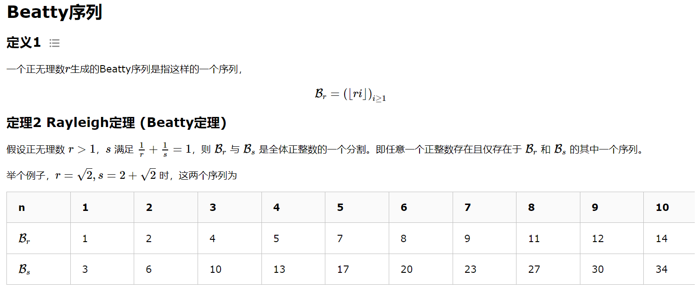
推论3
假设正无理数 $1<r<s$ 且$1/r+1/s=1$ ，有
		$(\mathcal{B}_r)_i = \operatorname{mex}\left\{ 0, (\mathcal{B}_r)_j, (\mathcal{B}_s)_j | j < i \right\}$ 
这里$\operatorname{mex}S$指的是取最小的没有在集合$S$中出现的非负整数。

### Wythoff博弈
Wythoff博弈的玩法是，有两堆石子，石子数分别为 $n,m$ 。两个玩家轮流进行，轮到一方的时候，该玩家可以做

- 从其中一堆石子中取走 $x>0$ 个（$x$  不能超过该堆的石子数）；
- 从两堆石子中同时取走 $x>0$ 个（$x$  不能超过任意一堆的石子数）。

如果轮到某方的时候，玩家无法操作，则该玩家输。
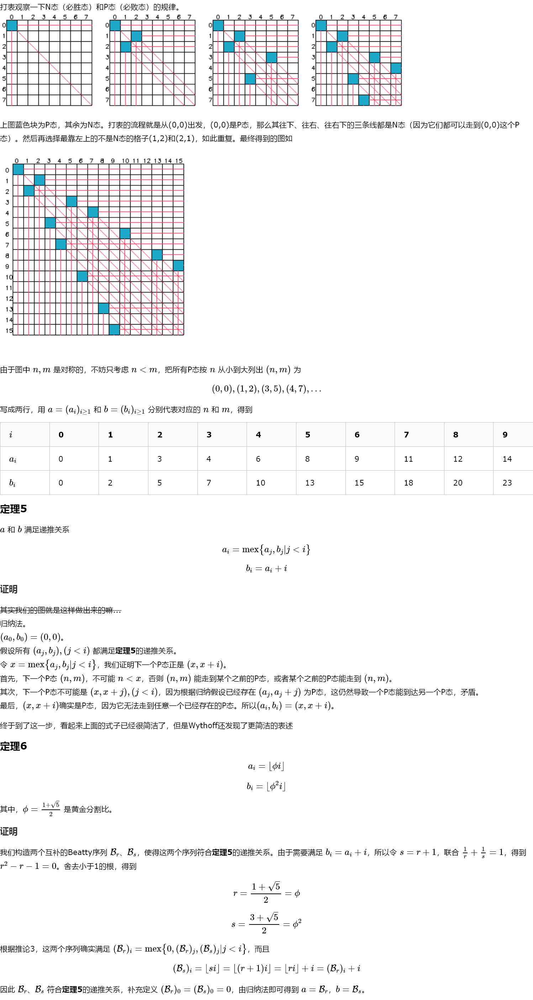


### k-Wythoff博弈
k-Wythoff博弈是Wythoff博弈的推广，其和Wythoff博弈唯一的区别是轮到某个玩家时，玩家可以：

- 从其中一堆石子中取走 $x>0$  个；
- 从两堆石子中分别取走 $x>0,y>0$个，满足 $|x−y|≤k$。
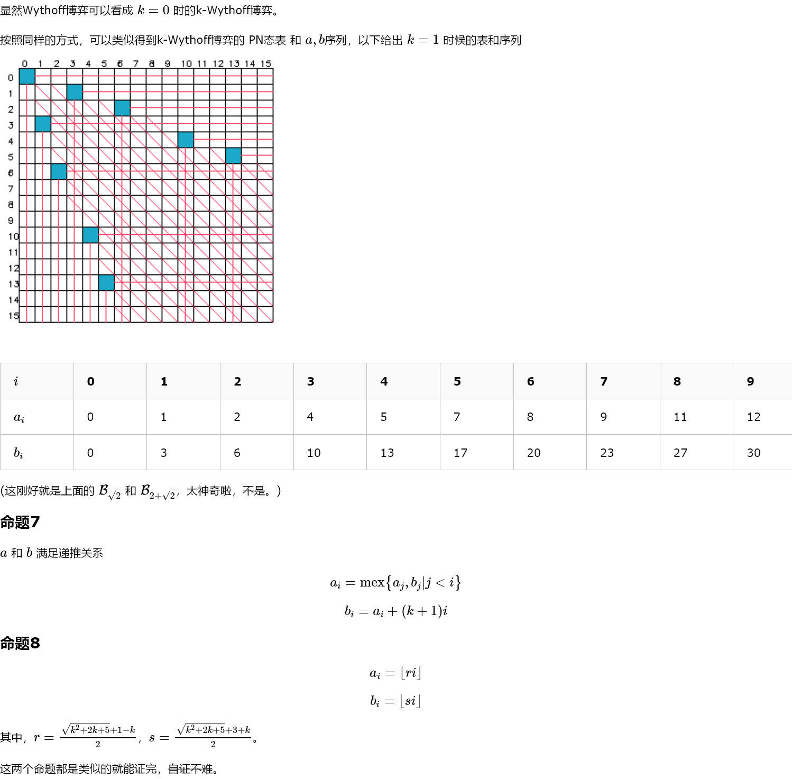


## 二次剩余


### 定义

令整数$a$， $p$满足$(a,p)=1$，若存在正整数使得
$x^2 \equiv a\ \ \ (\bmod\ p)$
则称$a$为模$p$的二次剩余，否则称$a$为模$p$的非二次剩余。（以下只讨论$p$为**奇素数**的情况）


### Euler 判别法

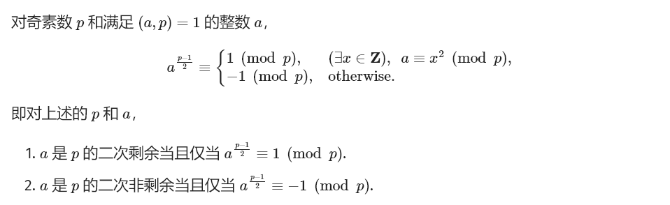

### 剩余系判别法

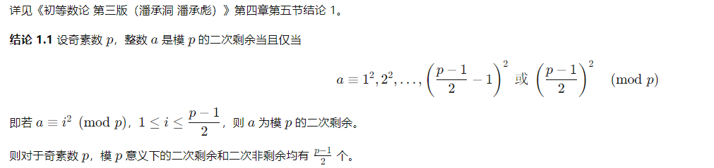

### Legendre 符号

 对奇素数$p$和整数$a$，定义 Legendre 符号如下：  

$$
\left(\frac{a}{p}\right)=\begin{cases}
 0, & p\mid a,\\
 1, & (p\nmid a) \land ((\exists x\in\mathbf{Z}),~~a\equiv x^2\pmod p),\\
 -1, & \text{otherwise}.\\
 \end{cases}
$$

#### 性质

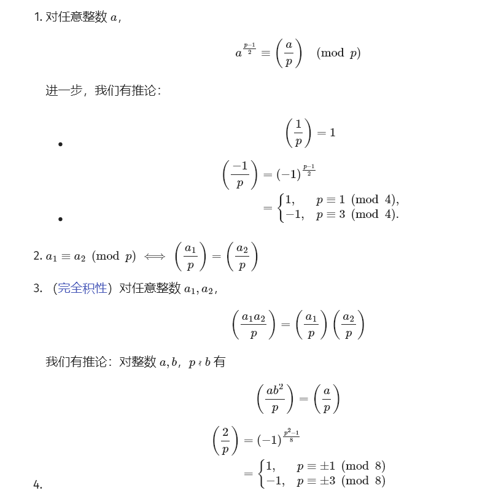

#### 二次互反律

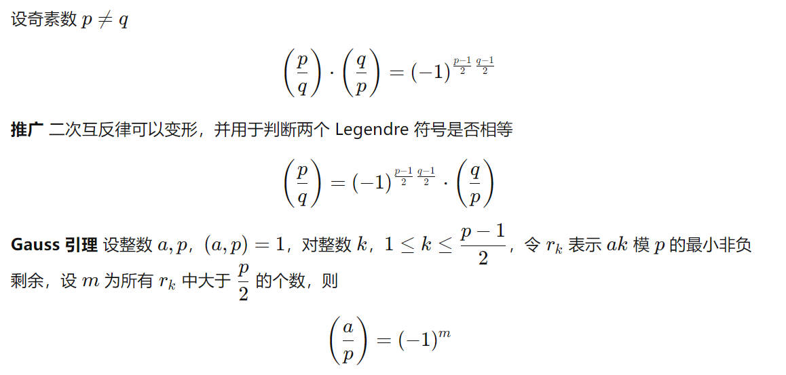

### 方程求解

对于方程$x^2 \equiv a\ \ \ (\bmod\ p)$，$p$为奇素数时的求解， 方程只有两个解，且它们互为相反数。  

#### 特殊情况算法

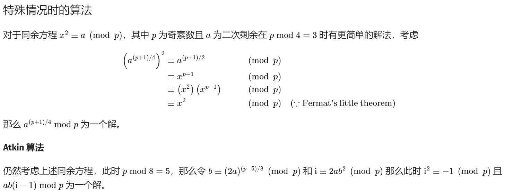

#### Cipolla 算法

```cpp
int cpxmod,ii;
struct cpx{
    ll real,imag;
    cpx(ll real=0,ll imag=0):real(real),imag(imag){};
    bool operator==(const cpx& o)const{
        return real==o.real && imag==o.imag;
    };
    cpx operator*(const cpx& o)const{
        return cpx((real*o.real+ii*imag%cpxmod*o.imag)%cpxmod,
        (imag*o.real+real*o.imag)%cpxmod);
    }
};
cpx qpow(cpx a,int b){
    cpx res=1;
    for(;b;b>>=1){
        if(b&1)
            res=res*a;
        a=a*a;
    }
    return res;
}
ll qpow(ll a,ll b,ll p){
    ll res=1;
    for(;b;b>>=1){
        if(b&1)
            res=res*a%p;
        a=a*a%p;
    }
    return res;
}
vector<int> cipolla(int a,int p){// x^2 === a (mod p) ^为次方，p为奇素数
    if(!a)//特判a==0
        return vector<int> {0};
    if(qpow(a,(p-1)/2,p)==p-1)//无解
        return vector<int>();
    cpxmod=p;
    ll r=rand()%p;
    while(true){
        r=rand()%p;
        ii=(r*r-a+p)%p;
        if(qpow(ii,(p-1)/2,p)==p-1)
            break;
    }
    int x0=qpow(cpx(r,1),(p+1)/2).real;
    int x1=p-x0;
    if(x0==x1)
        return vector<int> {x0};
    if(x0>x1)
        swap(x0,x1);
    return vector<int> {x0,x1};
}
```

例题
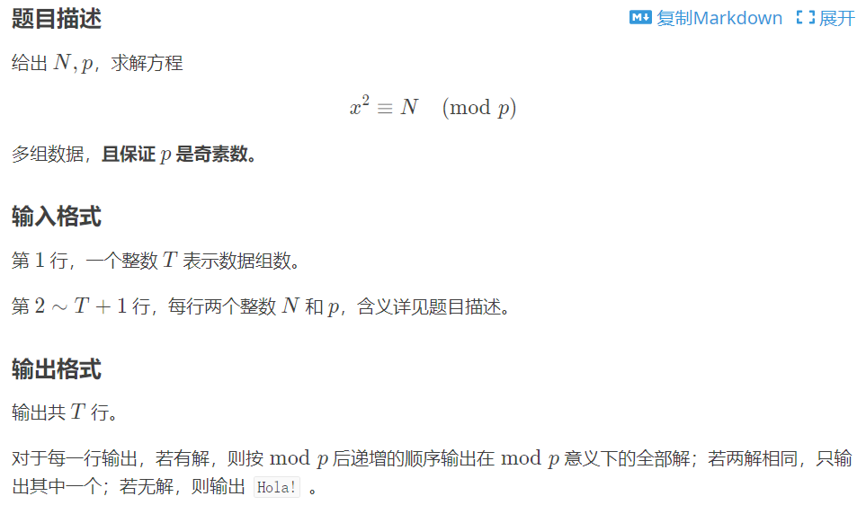

```cpp
#include"bits/stdc++.h"
#define ll long long
#define endl '\n'
using namespace std;
constexpr int N=1e5+10,inf=0X3F3F3F3F;
constexpr ll INF=0X3F3F3F3F3F3F3F3F;

int cpxmod,ii;
struct cpx{
    ll real,imag;
    cpx(ll real=0,ll imag=0):real(real),imag(imag){};
    bool operator==(const cpx& o)const{
        return real==o.real && imag==o.imag;
    };
    cpx operator*(const cpx& o)const{
        return cpx((real*o.real+ii*imag%cpxmod*o.imag)%cpxmod,
        (imag*o.real+real*o.imag)%cpxmod);
    }
};
cpx qpow(cpx a,int b){
    cpx res=1;
    for(;b;b>>=1){
        if(b&1)
            res=res*a;
        a=a*a;
    }
    return res;
}
ll qpow(ll a,ll b,ll p){
    ll res=1;
    for(;b;b>>=1){
        if(b&1)
            res=res*a%p;
        a=a*a%p;
    }
    return res;
}
vector<int> cipolla(int a,int p){// x^2 === a (mod p) ^为次方，p为奇素数
    if(!a)//特判a==0
        return vector<int> {0};
    if(qpow(a,(p-1)/2,p)==p-1)//无解
        return vector<int>();
    cpxmod=p;
    ll r=rand()%p;
    while(true){
        r=rand()%p;
        ii=(r*r-a+p)%p;
        if(qpow(ii,(p-1)/2,p)==p-1)
            break;
    }
    int x0=qpow(cpx(r,1),(p+1)/2).real;
    int x1=p-x0;
    if(x0==x1)
        return vector<int> {x0};
    if(x0>x1)
        swap(x0,x1);
    return vector<int> {x0,x1};
}
void solve(){
    int a,p;
    cin>>a>>p;
    vector<int> ans=cipolla(a,p);
    if(ans.empty()){
        cout<<"Hola!"<<endl;
    }else{
        for(auto x:ans)
            cout<<x<<' ';
        cout<<endl;
    }
}
signed main(){
    cin.tie(nullptr)->sync_with_stdio(0);
    int t;cin>>t;while(t--)
    solve();
    return 0;
}
```

## 离散对数

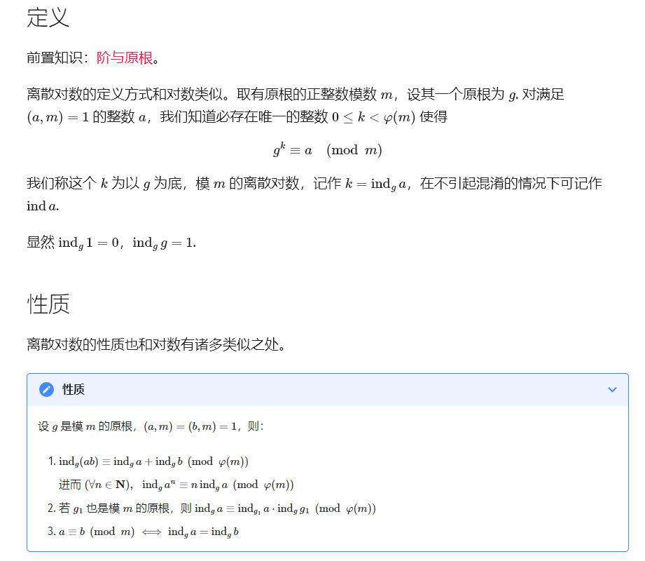

### 求一个离散对数

暴力求原根后运用大步小步算法即可得到一个离散对数
 `bsgs(priroot(m),a,m)`

```cpp
ll qpow(ll a,ll b,ll p){
    ll res=1%p;
    for(;b;b>>=1){
        if(b&1)
            res=res*a%p;
        a=a*a%p;
    }
    return res;
}
int priroot(int p){//求原根
    vector<int>fact;
    int phi=p-1,n=phi;
    for(int i=2;i<=n/i;i++){
        if(n%i==0){
            fact.push_back(i);
            while(n%i==0)
                n/=i;
        }
    }
    if(n>1)
        fact.push_back(n);
    for(int cur=1;;cur++){
        bool ok=true;
        for(auto x:fact){
            if(qpow(cur,phi/x,p)==1){
                ok=false;
                break;
            }
        }
        if(ok)
            return cur;

    }
    return -1;//无解
}
ll bsgs(ll a,ll b,ll p){//求解 a^x === b (mod p),^表示次方,a,b,p须正整数,gcd(a,p)==1.
    if(a%p==b%p)//这个时候 a 和 b 模 p 同余，那么 x = 1 应该是最小的整数解
        return 1;
    if(a%p==0&&b)//如果 a = 0 但是 b 不为 0，那么很显然无解
        return -1;

    ll sq=ceil(sqrt(p));
    ll tmp=qpow(a,sq,p);
    unordered_map<ll,ll>mp;

    for(int i=0;i<=sq;i++){//小步
        mp[b]=i;
        b=b*a%p;
    }

    b=1;
    for(int i=1;i<=sq;i++){//大步
        b=b*tmp%p;
        if(mp[b]){
            return i*sq-mp[b];
        }
    }
    return -1;//无解
}
```

### 进阶：高次同余方程（模数为质数）

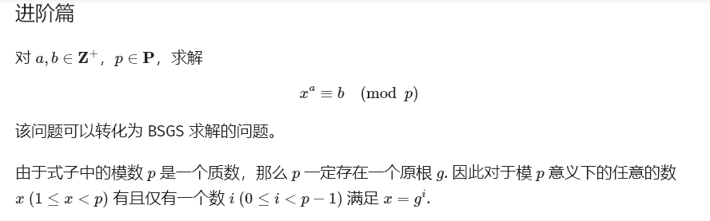

```cpp
ll qpow(ll a,ll b,ll p){
    ll res=1%p;
    for(;b;b>>=1){
        if(b&1)
            res=res*a%p;
        a=a*a%p;
    }
    return res;
}
int priroot(int p){//求原根
    vector<int>fact;
    int phi=p-1,n=phi;
    for(int i=2;i<=n/i;i++){
        if(n%i==0){
            fact.push_back(i);
            while(n%i==0)
                n/=i;
        }
    }
    if(n>1)
        fact.push_back(n);
    for(int cur=1;;cur++){
        bool ok=true;
        for(auto x:fact){
            if(qpow(cur,phi/x,p)==1){
                ok=false;
                break;
            }
        }
        if(ok)
            return cur;

    }
    return -1;//无解
}
ll bsgs(ll a,ll b,ll p){//求解 a^x === b (mod p),^表示次方,a,b,p须正整数,gcd(a,p)==1.
    if(a%p==b%p)//这个时候 a 和 b 模 p 同余，那么 x = 1 应该是最小的整数解
        return 1;
    if(a%p==0&&b)//如果 a = 0 但是 b 不为 0，那么很显然无解
        return -1;

    ll sq=ceil(sqrt(p));
    ll tmp=qpow(a,sq,p);
    unordered_map<ll,ll>mp;

    for(int i=0;i<=sq;i++){//小步
        mp[b]=i;
        b=b*a%p;
    }

    b=1;
    for(int i=1;i<=sq;i++){//大步
        b=b*tmp%p;
        if(mp[b]){
            return i*sq-mp[b];
        }
    }
    return -1;//无解
}
vector<int> funall(int a,int b,int p){//求解 x^a === b (mod p),^表示次方,a,b须正整数,p须质数.
    int g=priroot(p);
    ll c=bsgs(qpow(g,a,p),b,p);
    // cerr<<c<<endl;
    if(c==-1){
        // return vector<int>(1,-1);
        return vector<int>();
    }
    int dlt=(p-1)/gcd(a,p-1);
    // cerr<<dlt<<endl;
    vector<int>ans;
    for(int cur=c%dlt;cur<p-1;cur+=dlt)
        ans.push_back(qpow(g,cur,p));//顺序不一定有序
    return ans;
}
```

## 大步小步算法

a与m必须互质
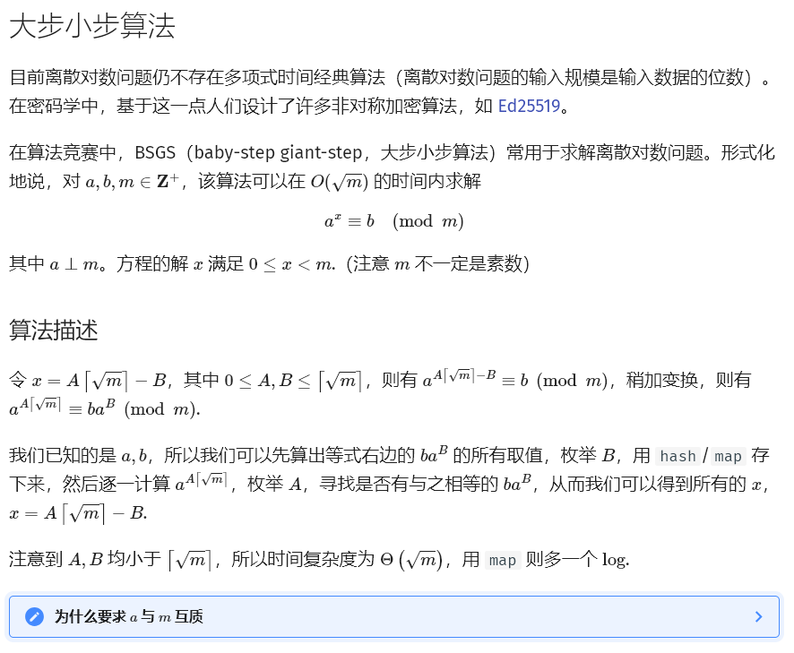
a与m必须互质

```cpp
ll qpow(ll a,ll b,ll p){
    ll res=1%p;
    for(;b;b>>=1){
        if(b&1)
            res=res*a%p;
        a=a*a%p;
    }
    return res;
}
ll bsgs(ll a,ll b,ll p){//求解 a^x === b (mod p),^表示次方,a,b,p须正整数,gcd(a,p)==1.
    if(a%p==b%p)//这个时候 a 和 b 模 p 同余，那么 x = 1 应该是最小的整数解
        return 1;
    if(a%p==0&&b)//如果 a = 0 但是 b 不为 0，那么很显然无解
        return -1;

    ll sq=ceil(sqrt(p));
    ll tmp=qpow(a,sq,p);
    unordered_map<ll,ll>mp;

    for(int i=0;i<=sq;i++){//小步
        mp[b]=i;
        b=b*a%p;
    }

    b=1;
    for(int i=1;i<=sq;i++){//大步
        b=b*tmp%p;
        if(mp[b])
            return i*sq-mp[b];
    }
    return -1;//无解
}
```

### 例题

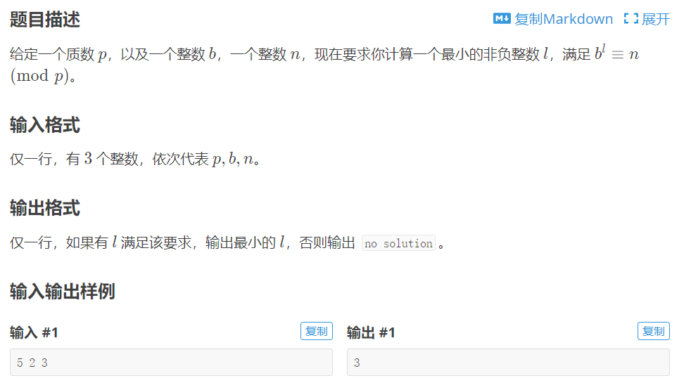

```cpp
#include"bits/stdc++.h"
#define ll long long
#define endl '\n'
using namespace std;
constexpr int N=1e5+10,inf=0X3F3F3F3F;
constexpr ll INF=0X3F3F3F3F3F3F3F3F;
ll qpow(ll a,ll b,ll p){
    ll res=1%p;
    for(;b;b>>=1){
        if(b&1)
            res=res*a%p;
        a=a*a%p;
    }
    return res;
}
ll bsgs(ll a,ll b,ll p){//求解 a^x === b (mod p),^表示次方,a,b,p须正整数,gcd(a,p)==1.
    if(a%p==b%p)//这个时候 a 和 b 模 p 同余，那么 x = 1 应该是最小的整数解
        return 1;
    if(a%p==0&&b)//如果 a = 0 但是 b 不为 0，那么很显然无解
        return -1;

    ll sq=ceil(sqrt(p));
    ll tmp=qpow(a,sq,p);
    unordered_map<ll,ll>mp;

    for(int i=0;i<=sq;i++){//小步
        mp[b]=i;
        b=b*a%p;
    }

    b=1;
    for(int i=1;i<=sq;i++){//大步
        b=b*tmp%p;
        if(mp[b])
            return i*sq-mp[b];
    }
    return -1;//无解
}
void solve(){
    int p,b,n;
    cin>>p>>b>>n;
    ll tmp=bsgs(b,n,p);
    if(tmp!=-1){
        cout<<tmp<<endl;
    }else{
        cout<<"no solution"<<endl;
    }
}
signed main(){
    cin.tie(nullptr)->sync_with_stdio(0);
//    int t;cin>>t;while(t--)
    solve();
    return 0;
}
```

## 扩展大步小步算法

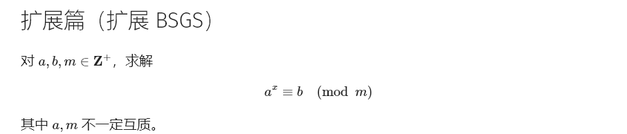

```cpp
ll qpow(ll a,ll b,ll p){
    ll res=1%p;
    for(;b;b>>=1){
        if(b&1)
            res=res*a%p;
        a=a*a%p;
    }
    return res;
}
ll exgcd(ll a,ll b,ll &x,ll &y){
    if(!b){
        x=1;
        y=0;
        return a;
    }
    ll d=exgcd(b,a%b,y,x);
    y-=a/b*x;
    return d;
}
ll bsgs(ll a,ll b,ll p){//求解 a^x === b (mod p),^表示次方,a,b,p须正整数,gcd(a,p)==1.返回最小整数解
    if(a%p==b%p)//这个时候 a 和 b 模 p 同余，那么 x = 1 应该是最小的整数解
        return 1;
    if(a%p==0&&b)//如果 a = 0 但是 b 不为 0，那么很显然无解
        return -1;
    ll sq=ceil(sqrt(p));
    ll tmp=qpow(a,sq,p);
    unordered_map<ll,ll>mp;
    for(int i=0;i<=sq;i++){//小步
        mp[b]=i;
        b=b*a%p;
    }
    b=1;
    for(int i=1;i<=sq;i++){//大步
        b=b*tmp%p;
        if(mp[b]){
            return i*sq-mp[b];
        }
    }
    return -1;//无解
}
ll exbsgs(ll a,ll b,ll p){//求解 a^x === b (mod p),^表示次方,a,b,p须正整数.返回最小整数解
    b=(b%p+p)%p;
    if(1%p==b%p)
        return 0;
    ll d,x,y,res;
    if((d=exgcd(a,p,x,y))!=1){
        if(b%d)
            return -1;
        exgcd(a/d,p/d,x,y);
        return ((res=exbsgs(a,b/d*x%(p/d),p/d))==-1?-1:res+1);
    }
    return bsgs(a,b,p);
}
```

### 例题

[https://www.luogu.com.cn/problem/P4195](https://www.luogu.com.cn/problem/P4195)
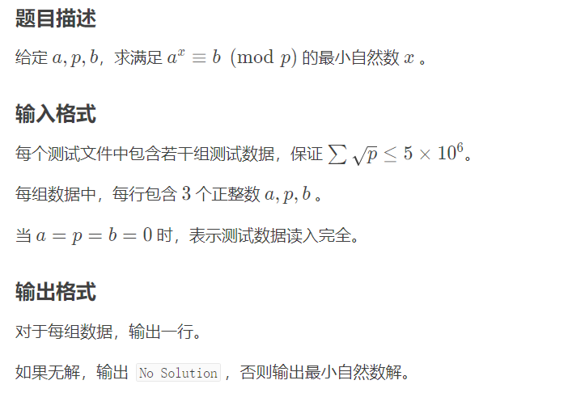

```cpp
#include"bits/stdc++.h"
#define ll long long
#define endl '\n'
using namespace std;
constexpr int N=1e5+10,inf=0X3F3F3F3F;
constexpr ll INF=0X3F3F3F3F3F3F3F3F;
ll qpow(ll a,ll b,ll p){
    ll res=1%p;
    for(;b;b>>=1){
        if(b&1)
            res=res*a%p;
        a=a*a%p;
    }
    return res;
}
ll exgcd(ll a,ll b,ll &x,ll &y){
    if(!b){
        x=1;
        y=0;
        return a;
    }
    ll d=exgcd(b,a%b,y,x);
    y-=a/b*x;
    return d;
}
ll bsgs(ll a,ll b,ll p){//求解 a^x === b (mod p),^表示次方,a,b,p须正整数,gcd(a,p)==1.返回最小整数解
    if(a%p==b%p)//这个时候 a 和 b 模 p 同余，那么 x = 1 应该是最小的整数解
        return 1;
    if(a%p==0&&b)//如果 a = 0 但是 b 不为 0，那么很显然无解
        return -1;
    ll sq=ceil(sqrt(p));
    ll tmp=qpow(a,sq,p);
    unordered_map<ll,ll>mp;
    for(int i=0;i<=sq;i++){//小步
        mp[b]=i;
        b=b*a%p;
    }
    b=1;
    for(int i=1;i<=sq;i++){//大步
        b=b*tmp%p;
        if(mp[b]){
            return i*sq-mp[b];
        }
    }
    return -1;//无解
}
ll exbsgs(ll a,ll b,ll p){//求解 a^x === b (mod p),^表示次方,a,b,p须正整数.返回最小整数解
    b=(b%p+p)%p;
    if(1%p==b%p)
        return 0;
    ll d,x,y,res;
    if((d=exgcd(a,p,x,y))!=1){
        if(b%d)
            return -1;
        exgcd(a/d,p/d,x,y);
        return ((res=exbsgs(a,b/d*x%(p/d),p/d))==-1?-1:res+1);
    }
    return bsgs(a,b,p);
}
void solve(){
    int a,b,p;
    while(cin>>a>>p>>b){
        if(!(a||b||p))
            return;
        ll ans=exbsgs(a,b,p);
        if(ans==-1)
            cout<<"No Solution"<<endl;
        else
            cout<<ans<<endl;
    }
}
signed main(){
    cin.tie(nullptr)->sync_with_stdio(0);
    // int t;cin>>t;while(t--)
    solve();
    return 0;
}
```

## 算数基本定理


### 推论

若正整数$N$被唯一分解成$N=p_{1}^{c_1}p_{2}^{c_2}\dots p_{m}^{c_m}$，其中$c_i$都是正整数，$p_i$都是质数，且满足$p_1<p_2<\dots <p_m$，则$N$的正约数集合可写作：
$\{p_{1}^{b_1}p_{2}^{b_2}\dots p_{m}^{b_m} \},其中0\leq b_i \leq c_i$
$N$的正约数个数为：
$(c_1+1)*(c_2+1)*\dots *(c_m+1)=\prod_{i=1}^{m}(c_i+1)$
$N$的所有正约数的和为：
$(1+p_1+p_1^2+\dots +p_1^{c_1})*\dots *(1+p_m+p_m^2+\dots +p_m^{c_m})=\prod_{i=1}^m\lgroup \sum_{j=0}^{c_i}(p_i)^j \rgroup$

## 卢卡斯定理

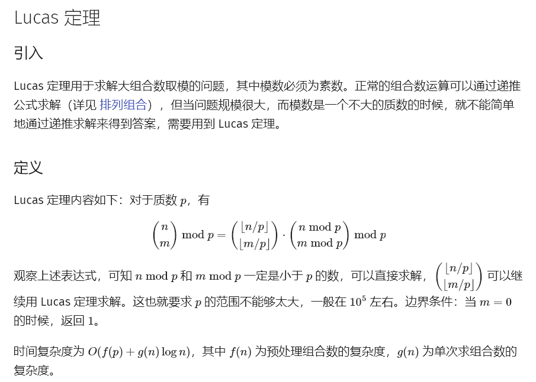

```cpp
long long Lucas(long long n, long long m, long long p) {
  if (m == 0) return 1;
  return (C(n % p, m % p, p) * Lucas(n / p, m / p, p)) % p;
}
```

## 伯特兰-切比雪夫定理

伯特兰—切比雪夫定理说明：若整数n＞3，则至少存在一个质数p，符合n＜p＜2n − 2。另一个稍弱说法是：对于所有大于1的整数n，至少存在一个质数p，符合n＜p＜2n。

## 原根


### 阶

#### 定义

由欧拉定理可知，对 $a \in \mathbf{Z},\ m\in \mathbf{N^*}$，若$(a,m)=1$，则$a^{\varphi(m)}\equiv 1\ (\bmod\ m)$.
 因此满足同余式$a^{n}\equiv 1\ (\bmod\ m)$的最小正整数$n$存在，这个$n$称作$a$模$m$的阶，记作$\delta _m{(a)}$或$ord _m{(a)}$.  

#### 性质

- $a,a^2,\dots,a^{\delta _m{(a)}}$模$m$两两不同余。  

- 若$a^{n}\equiv 1\ (\bmod\ m)$，则$\delta _m{(a)}\  |\  n$.  据此还可推出：若$a^{p}\equiv a^{q}\ (\bmod\ m)$，则有${p}\equiv {q}\ (\bmod\ \delta _m{(a)})$.

- 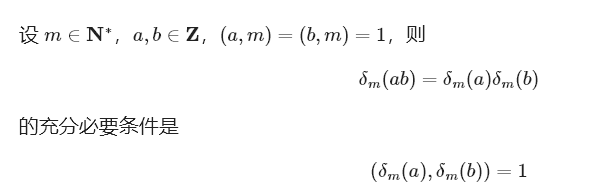

- 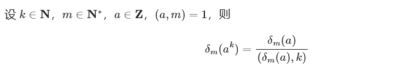
  

#### 求阶
  
  根据欧拉定理，显然$\delta _m{(a)}\  |\  \varphi(m)$，我们可以枚举约数求阶。
  单次显然是$O(\sqrt{n})$
  多次可以预处理1~n所有质数，利用质因子加速
  时间复杂度$O(n+T\ log^2\ n)$
  
  ```cpp
  struct Phi{
    vector<int>vis,prime,phi;
    //vis记录最小质因数，prime记录质数，phi记录欧拉函数
    const int n;
    Phi(const int& _n):n(_n),vis(_n+1),phi(_n+1){
        phi[1]=1;
        for(int i=2;i<=n;i++){
            if(!vis[i]){
                vis[i]=i;
                prime.push_back(i);
                phi[i]=i-1;
            }
            for(int j:prime){
                if(i*j>n)
                    break;
                vis[i*j]=j;
                if(i%j==0){
                    phi[i*j]=phi[i]*j;
                    break;
                }
                phi[i*j]=phi[i]*phi[j];
            }
        }
    }
  }pi(N);//预处理1~N的欧拉函数和质数
  ll qpow(ll a,ll b,ll p){
    ll res=1;
    for(;b;b>>=1){
        if(b&1)
            res=res*a%p;
        a=a*a%p;
    }
    return res;
  }
  int ord(int a,int m){// pow(a,ord) === 1 (mod m)
    int t=pi.phi[m],t1=t;
    for(auto val:pi.prime){
        if(val>t1/val)
            break;
        while(t%val==0&&qpow(a,t/val,m)==1)
            t/=val;
        while(t1%val==0)
            t1/=val;
    }
    if(t1>1&&qpow(a,t/t1,m)==1)
        t/=t1;
    return t;
  }
  ```
  
   
### 原根

  
  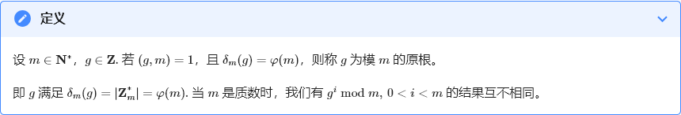
  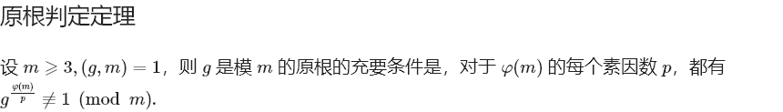
  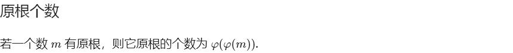
  
  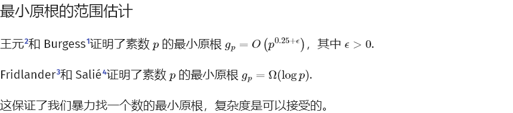
  
  ```cpp
  ll qpow(ll a,ll b,ll p){
    ll res=1%p;
    for(;b;b>>=1){
        if(b&1)
            res=res*a%p;
        a=a*a%p;
    }
    return res;
  }
  int priroot(int p){//求原根
    vector<int>fact;
    int phi=p-1,n=phi;
    for(int i=2;i<=n/i;i++){
        if(n%i==0){
            fact.push_back(i);
            while(n%i==0)
                n/=i;
        }
    }
    if(n>1)
        fact.push_back(n);
    for(int cur=1;cur<p;cur++){
        bool ok=true;
        for(auto x:fact){
            if(qpow(cur,phi/x,p)==1){
                ok=false;
                break;
            }
        }
        if(ok)
            return cur;
  
    }
    return -1;//无解
  }
  ```

## 裴蜀定理

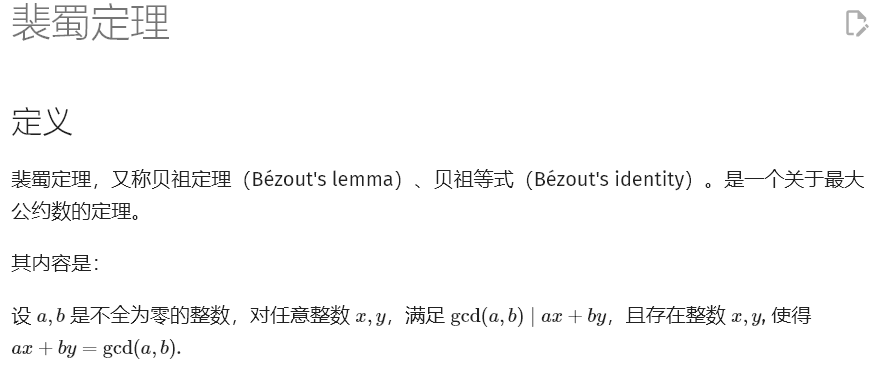

## 费马小定理

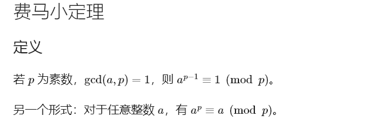

## 欧拉定理

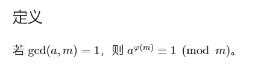

## 扩展欧拉定理

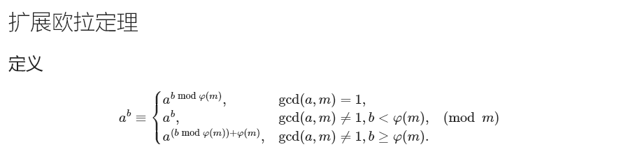

## 威尔逊定理

若$p$为素数，则$p$可以整除$(p-1) \ !+1$。

- $((p-1) \ !+1)mod \ p=0$

- $(p-1) \ ! \  mod \ p=p-1$

- $(p-1) \ !=pq-1,q为正整数$

- $用同余表示为(p-1) \ ! \equiv -1(mod \ p)$

  
## 质数
  
### 埃氏筛
  
  ```cpp
  vector<int>primes;
  int is_prime[N];//当为0的时候为质数
  void getprimes(int n){
    for (int i = 2; i <= n ; ++i) {
        if (!is_prime[i]){
            primes.push_back(i);
            for (int j = i+i; j <= n ; j+=i)
                is_prime[j]=1;
        }
    }
  }
  ```
  
### 线性筛（欧拉筛）
  
  ```cpp
  vector<int> pri;
  bool not_prime[N];
  void pre(int n) {
    for (int i = 2; i <= n; ++i) {
        if (!not_prime[i]) {
            pri.push_back(i);
        }
        for (int pri_j : pri) {
            if (i * pri_j > n)
                break;
            not_prime[i * pri_j] = true;
            if (i % pri_j == 0) {
                // i % pri_j == 0
                // 换言之，i 之前被 pri_j 筛过了
                // 由于 pri 里面质数是从小到大的，所以 i 乘上其他的质数的结果一定会被
                // pri_j 的倍数筛掉，就不需要在这里先筛一次，所以这里直接 break
                // 掉就好了
                break;
            }
        }
    }
  }
  ```


### Pollard Rho算法
在$O(n^{ \frac{1}{4} })$内求出一个数的一个非平凡因子的算法
```cpp
long long Pollard_Rho(long long x) {
  long long s = 0, t = 0;
  long long c = (long long)rand() % (x - 1) + 1;
  int step = 0, goal = 1;
  long long val = 1;
  for (goal = 1;; goal *= 2, s = t, val = 1) {  // 倍增优化
    for (step = 1; step <= goal; ++step) {
      t = ((__int128)t * t + c) % x;
      val = (__int128)val * abs(t - s) % x;
      if ((step % 127) == 0) {
        long long d = gcd(val, x);
        if (d > 1) return d;
      }
    }
    long long d = gcd(val, x);
    if (d > 1) return d;
  }
}
```

例题
[https://www.luogu.com.cn/problem/P4718](https://www.luogu.com.cn/problem/P4718)
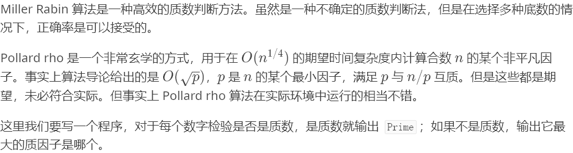

```cpp
#include <bits/stdc++.h>

using namespace std;

typedef long long ll;

int t;
long long max_factor, n;

long long gcd(long long a, long long b) {
  if (b == 0) return a;
  return gcd(b, a % b);
}

long long quick_pow(long long x, long long p, long long mod) {  // 快速幂
  long long ans = 1;
  while (p) {
    if (p & 1) ans = (__int128)ans * x % mod;
    x = (__int128)x * x % mod;
    p >>= 1;
  }
  return ans;
}

bool Miller_Rabin(long long p) {  // 判断素数
  if (p < 2) return 0;
  if (p == 2) return 1;
  if (p == 3) return 1;
  long long d = p - 1, r = 0;
  while (!(d & 1)) ++r, d >>= 1;  // 将d处理为奇数
  for (long long k = 0; k < 10; ++k) {
    long long a = rand() % (p - 2) + 2;
    long long x = quick_pow(a, d, p);
    if (x == 1 || x == p - 1) continue;
    for (int i = 0; i < r - 1; ++i) {
      x = (__int128)x * x % p;
      if (x == p - 1) break;
    }
    if (x != p - 1) return 0;
  }
  return 1;
}

long long Pollard_Rho(long long x) {
  long long s = 0, t = 0;
  long long c = (long long)rand() % (x - 1) + 1;
  int step = 0, goal = 1;
  long long val = 1;
  for (goal = 1;; goal *= 2, s = t, val = 1) {  // 倍增优化
    for (step = 1; step <= goal; ++step) {
      t = ((__int128)t * t + c) % x;
      val = (__int128)val * abs(t - s) % x;
      if ((step % 127) == 0) {
        long long d = gcd(val, x);
        if (d > 1) return d;
      }
    }
    long long d = gcd(val, x);
    if (d > 1) return d;
  }
}

void fac(long long x) {
  if (x <= max_factor || x < 2) return;
  if (Miller_Rabin(x)) {              // 如果x为质数
    max_factor = max(max_factor, x);  // 更新答案
    return;
  }
  long long p = x;
  while (p >= x) p = Pollard_Rho(x);  // 使用该算法
  while ((x % p) == 0) x /= p;
  fac(x), fac(p);  // 继续向下分解x和p
}

int main() {
  scanf("%d", &t);
  while (t--) {
    srand((unsigned)time(NULL));
    max_factor = 0;
    scanf("%lld", &n);
    fac(n);
    if (max_factor == n)  // 最大的质因数即自己
      printf("Prime\n");
    else
      printf("%lld\n", max_factor);
  }
  return 0;
}
```

### Miller-Rabin素数检测

在不考虑乘法的复杂度时，对数 $n$ 进行 $k$ 轮测试的时间复杂度是 $O(k \ logn)$。Miller-Rabbin 素性测试常用于对高精度数进行测试，此时时间复杂度是$O(k \ log^3n)$

```cpp
long long quick_pow(long long x, long long p, long long mod) {  // 快速幂
  long long ans = 1;
  while (p) {
    if (p & 1) ans = (__int128)ans * x % mod;
    x = (__int128)x * x % mod;
    p >>= 1;
  }
  return ans;
}

bool Miller_Rabin(long long p) {  // 判断素数
  if (p < 2) return 0;
  if (p == 2) return 1;
  if (p == 3) return 1;
  long long d = p - 1, r = 0;
  while (!(d & 1)) ++r, d >>= 1;  // 将d处理为奇数
  for (long long k = 0; k < 10; ++k) {
    long long a = rand() % (p - 2) + 2;
    long long x = quick_pow(a, d, p);
    if (x == 1 || x == p - 1) continue;
    for (int i = 0; i < r - 1; ++i) {
      x = (__int128)x * x % p;
      if (x == p - 1) break;
    }
    if (x != p - 1) return 0;
  }
  return 1;
}
```

```cpp
ll Mult_Mod(ll a,ll b,ll m)
{//res=(a*b)%m 龟速乘
    a%=m;b%=m;
    ll res=0;
    while(b)
    {
        if(b&1)
        res=(res+a)% m;
        a=(a<<=1)%m;
        b>>=1;
    }
    return res%m;
}
ll Pow_Mod(ll a,ll b,ll m)
{//res=(a^b)%m
    ll res=1,k=a;
    while(b)
    {
        if((b&1))res=Mult_Mod(res,k,m)%m;
        k=Mult_Mod(k,k,m)%m;
        b>>=1;
    }
    return res%m;
}
bool Witness(ll a,ll n,ll x,ll sum)
{
    ll judge=Pow_Mod(a,x,n);
    if(judge==n-1||judge==1)
    return 1;
    while(sum--)
    {
        judge=Mult_Mod(judge,judge,n);
        if(judge==n-1)
        return 1;
    }
    return 0;
}
bool Miller_Rabin(ll n)
{
    if(n<2)return 0;
    if(n==2)return 1;
    if((n&1)==0)return 0;
    ll x=n-1;
    ll sum=0;
    while(x%2==0){x>>=1;sum++;}
    int times=20;
    for(ll i=1;i<=times;i++)
    {
        ll a=rand()%(n-1)+1;//取与 p 互质的整数 a
        if(!Witness(a,n,x,sum))//费马小定理的随机数检验
        return 0;
    }
    return 1;
}//记得开srond;
```

## 同余

### Garner算法

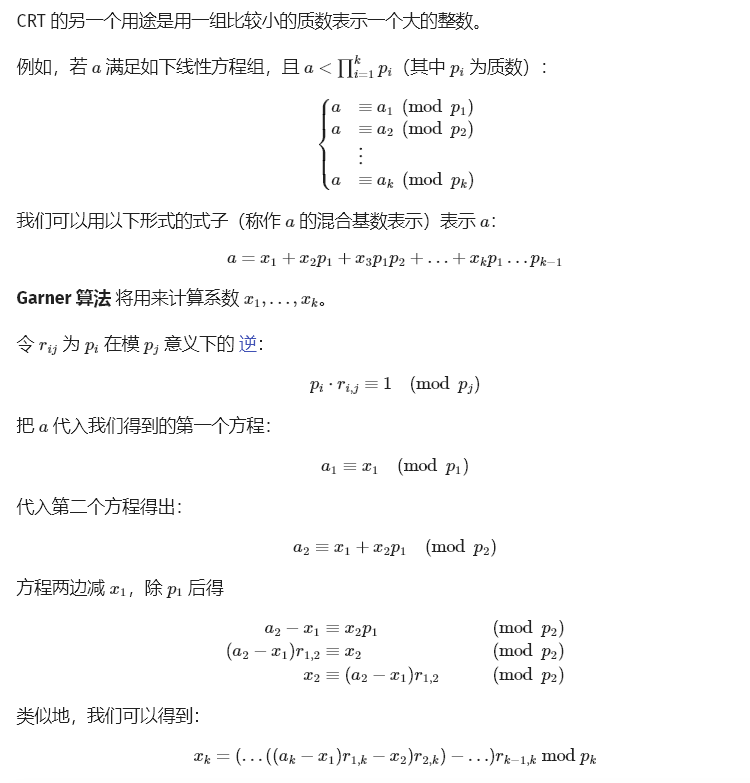

```cpp
for (int i = 0; i < k; ++i) {//先求rij，rij为pi在模pj意义上的逆
  x[i] = a[i];
  for (int j = 0; j < i; ++j) {
    x[i] = r[j][i] * (x[i] - x[j]);
    x[i] = x[i] % p[i];
    if (x[i] < 0) x[i] += p[i];
  }
}
```

### 中国剩余定理

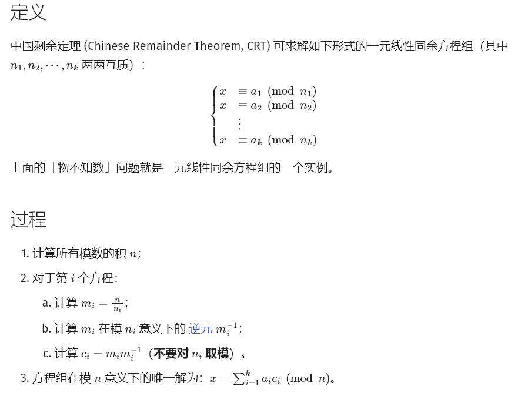

```cpp
ll mul(ll x,ll y,ll p){//卡精度换成龟速乘，卡时间就用这个O1快速乘
    ll z=(long double)x/p*y;
    ll res=(unsigned ll)x*y-(unsigned ll)z*p;
    return (res+p)%p;
}
ll exgcd(ll a,ll b,ll& x,ll& y){
    if(b==0){
        x=1;
        y=0;
        return a;
    }
    ll d=exgcd(b,a%b,x,y);
    ll tmp=x;
    x=y;
    y=tmp-a/b*y;
    return d;
}
ll crt(int k,ll* a,ll* r){
    ll n=1,ans=0;
    for (int i=1;i<=k;i++) //所有模数的乘积不能超过ll
        n=n*r[i];
    for (int i=1;i<=k;i++){
        ll m=n/r[i],b,y;
        ll t=r[i]/exgcd(m,r[i],b,y);  // b * m mod r[i] = 1
        ll res=mul(mul(a[i],m,n),b,n);
        ans=(ans+res)%n;
    }
    return (ans%n+n)%n;
}
```

#### 扩展：模数不互质的情况

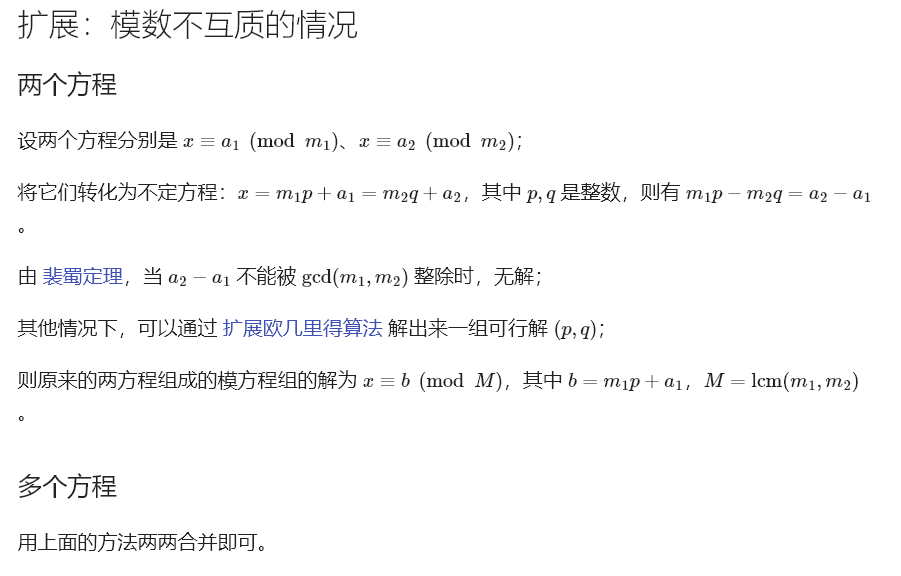

```cpp
ll mul(ll x,ll y,ll p){//卡精度换成龟速乘，卡时间就用这个O1快速乘
    ll z=(long double)x/p*y;
    ll res=(unsigned ll)x*y-(unsigned ll)z*p;
    return (res+p)%p;
}
ll exgcd(ll a,ll b,ll& x,ll& y){
    if(b==0){
        x=1;
        y=0;
        return a;
    }
    ll d=exgcd(b,a%b,x,y);
    ll tmp=x;
    x=y;
    y=tmp-a/b*y;
    return d;
}
ll crt(int k,ll* a,ll* r){
    ll n=1,ans=0;
    for (int i=1;i<=k;i++) 
        n=n*r[i];
    for (int i=1;i<=k;i++){
        ll m=n/r[i],b,y;
        ll t=r[i]/exgcd(m,r[i],b,y);  // b * m mod r[i] = 1
        ll res=mul(mul(a[i],m,n),b,n);
        ans=(ans+res)%n;
    }
    return (ans%n+n)%n;
}
ll excrt(int k,ll* a,ll* r){//所有模数的最小公倍数不能超过ll，模数可以不互质，返回最小非负整数解
    //x === a_i (mod r_i)
    ll A=a[1],M=r[1],x,y;
    for(int i=2;i<=k;i++){
        ll d=exgcd(M,r[i],x,y);
        ll t=r[i]/d,c=(a[i]-A%r[i]+r[i])%r[i];
        if(c%d!=0)
            return -1;//-1说明无解
        x=mul(x,c/d,t);
        A+=x*M;
        M*=t;
        A=(A%M+M)%M;
    }
    return (A%M+M)%M;
}
```

### 扩展中国剩余定理

```cpp
ll mul(ll x,ll y,ll p){//卡精度换成龟速乘，卡时间就用这个O1快速乘
    ll z=(long double)x/p*y;
    ll res=(unsigned ll)x*y-(unsigned ll)z*p;
    return (res+p)%p;
}
ll exgcd(ll a,ll b,ll& x,ll& y){
    if(b==0){
        x=1;
        y=0;
        return a;
    }
    ll d=exgcd(b,a%b,x,y);
    ll tmp=x;
    x=y;
    y=tmp-a/b*y;
    return d;
}
ll crt(int k,ll* a,ll* r){
    ll n=1,ans=0;
    for (int i=1;i<=k;i++) 
        n=n*r[i];
    for (int i=1;i<=k;i++){
        ll m=n/r[i],b,y;
        ll t=r[i]/exgcd(m,r[i],b,y);  // b * m mod r[i] = 1
        ll res=mul(mul(a[i],m,n),b,n);
        ans=(ans+res)%n;
    }
    return (ans%n+n)%n;
}
ll excrt(int k,ll* a,ll* r){//所有模数的最小公倍数不能超过ll，模数可以不互质，返回最小非负整数解
    //x === a_i (mod r_i)
    ll A=a[1],M=r[1],x,y;
    for(int i=2;i<=k;i++){
        ll d=exgcd(M,r[i],x,y);
        ll t=r[i]/d,c=(a[i]-A%r[i]+r[i])%r[i];
        if(c%d!=0)
            return -1;//-1说明无解
        x=mul(x,c/d,t);
        A+=x*M;
        M*=t;
        A=(A%M+M)%M;
    }
    return (A%M+M)%M;
}
```

### 线性同余方程

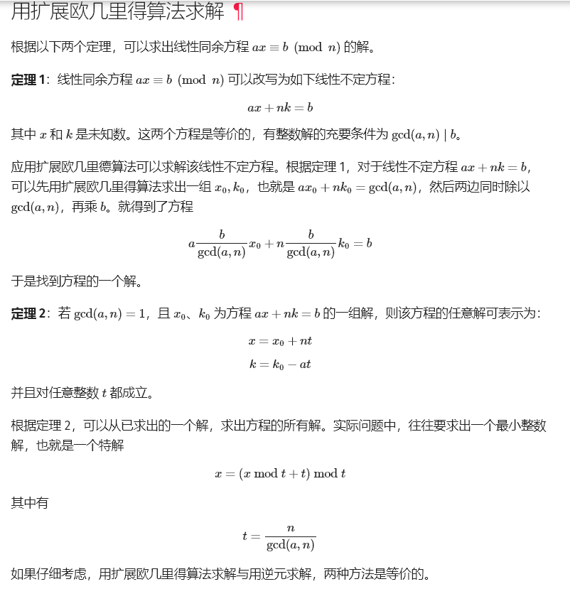

```cpp
int ex_gcd(int a, int b, int& x, int& y) {
  if (b == 0) {
    x = 1;
    y = 0;
    return a;
  }
  int d = ex_gcd(b, a % b, x, y);
  int temp = x;
  x = y;
  y = temp - a / b * y;
  return d;
}

bool liEu(int a, int b, int c, int& x, int& y) {
  int d = ex_gcd(a, b, x, y);
  if (c % d != 0) return 0;
  int k = c / d;
  x *= k;
  y *= k;
  return 1;
}
```

### 扩展欧几里得

```cpp
ll exgcd(ll a,ll b,ll &x,ll &y){
    if(!b){
        x=1;
        y=0;
        return a;
    }
    ll d=exgcd(b,a%b,y,x);
    y-=a/b*x;
    return d;
}
```

### 单个数求逆

#### 费马小定理

必须x与mod互质

```cpp
ll qpow(ll a,ll b,ll p){
    ll res=1%p;
    for(;b;b>>=1){
        if(b&1)
            res=res*a%p;
        a=a*a%p;
    }
    return res;
}
ll inv(ll x){
    return qpow(x,mod-2,mod);
}
```

#### 扩展欧几里得求逆

必须x与mod互质

```cpp
ll exgcd(ll a,ll b,ll &x,ll &y){
    if(!b){
        x=1;
        y=0;
        return a;
    }
    ll d=exgcd(b,a%b,y,x);
    y-=a/b*x;
    return d;
}
ll inv(ll a,ll m){//a为值，m为模数，求出a在m模意义下的逆元
    ll x,y;
    exgcd(a,m,x,y);
    return (x%m+m)%m;
}
```

### 线性求1~n的逆

```cpp
ll inv[N];
void init(){
    inv[1]=1;
    for(int i=2;i<N;i++)
        inv[i]=(mod-mod/i)*inv[mod%i]%mod;
}
```

## 欧拉函数

欧拉函数定义：设$n$是一个正整数，欧拉函数$\phi (n)$定义为不超过$n$且与$n$互素的正整数的个数。

$\phi (n)=\sum^{n}_{i=1} [gcd(i,n)=1]$

性质

- 欧拉函数是积性函数。

即对任意满足$gcd(a,b)=1$的正整数$a,b$，有$\phi(ab)=\phi(a)\phi(b)$。
 特别地，当$n$ 是奇数时$\phi(2n)=\phi(n)$。

- $n=\sum_{d|n}\phi(d)$。

- 若$n=p^k$，其中$p$是质数，那么$\phi(n)=p^k-p^{k-1}$。

- 由唯一分解定理，设$n=\prod^{s}_{i=1}p_i^{k_i}$，其中$p_i$为质数，有$\phi(n)=n\prod^{s}_{i=1}(1-\frac{1}{p_i})$。

- 对任意不全为$0$的整数$m,n$，$\phi(mn)\phi(gcd(m,n))=\phi(m)\phi(n)gcd(m,n)$。
  
### 求单个数欧拉函数
  
  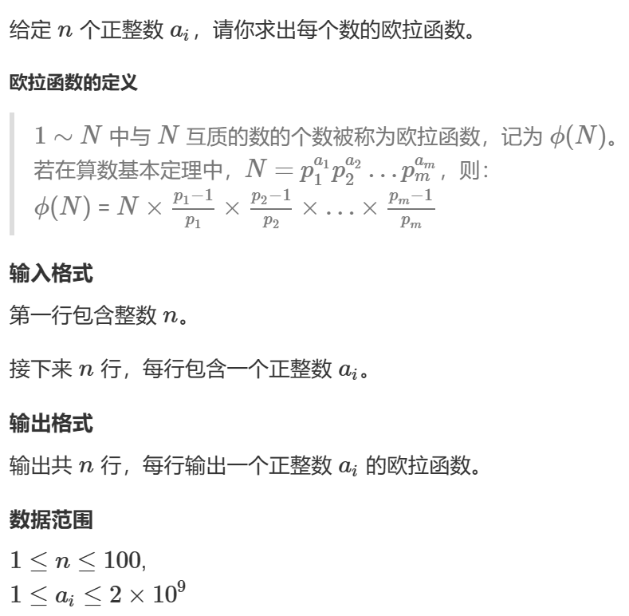
  
  ```cpp
  int euler_phi(int n) {
  int ans = n;
  for (int i = 2; i * i <= n; i++)
    if (n % i == 0) {
      ans = ans / i * (i - 1);
      while (n % i == 0) n /= i;
    }
  if (n > 1) ans = ans / n * (n - 1);
  return ans;
  }
  ```
  
### 筛法求欧拉函数
  
  给定一个正整数 n，求 1~n 中每个数的欧拉函数之和。
  
  ```cpp
  struct Phi{
    vector<int>vis,prime,phi;
    vector<long long>sum;
    //vis记录最小质因数，prime记录质数，phi记录欧拉函数，sum计算欧拉函数的和
    const int n;
    Phi(const int& _n):n(_n),vis(_n+1),phi(_n+1){
        phi[1]=1;
        for(int i=2;i<=n;i++){
            if(!vis[i]){
                vis[i]=i;
                prime.push_back(i);
                phi[i]=i-1;
            }
            for(int j:prime){
                if(i*j>n)
                    break;
                vis[i*j]=j;
                if(i%j==0){
                    phi[i*j]=phi[i]*j;
                    break;
                }
                phi[i*j]=phi[i]*phi[j];
            }
        }
    }
    void initsum(){//初始化sum
        sum.resize(n+1);
        for(int i=1;i<=n;i++)
            sum[i]=sum[i-1]+phi[i];
    }
  };
  ```


# 多项式与生成函数


# 组合数学

## 各种情况下小球放盒子的方案数
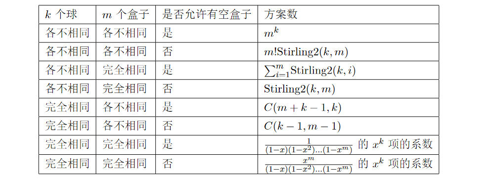

## 排列组合
  
### 杨辉三角求组合数
  
  $O(n^2)$
  
  ```cpp
  C[0][0]=1%mod;
  for(int i=1;i<=n;i++){
    C[i][0]=1%mod;
    for(int j=1;j<=i;j++){
        C[i][j]=(C[i-1][j-1]+C[i-1][j]+mod)%mod;
    }
  }
  ```
  
### 线性求1~n的任意组合数
  
  mod必须是大质数,mod必须大于n
  
  ```cpp
  ll fact[N],inv[N];
  ll qpow(ll a,ll b,ll p){
    a%=p;
    ll ans=1%p;
    for(;b;b>>=1){
        if(b&1)
            ans=ans*a%p;
        a=a*a%p;
    }
    return ans;
  }
  void init(){
    fact[0]=1;
    inv[0]=1;
    for(int i=1;i<N;i++)
        fact[i]=(i*fact[i-1])%mod;
    inv[N-1]=qpow(fact[N-1],mod-2,mod);
    for(int i=N-2;i>=1;i--){
        inv[i]=inv[i+1]*(i+1)%mod;
    }
  }
  ll C(ll n,ll r){
    if(r>n||r<0)
        return 0;
    if(n==r||r==0)
        return 1;
    return (fact[n]*inv[r]%mod*inv[n-r]%mod);
  }
  ```
  
### nlog求1~N的组合数
  
  ```cpp
  ll fact[N],inv[N];
  ll qpow(ll a,ll b,ll p){
    a%=p;
    ll ans=1%p;
    for(;b;b>>=1){
        if(b&1)
            ans=ans*a%p;
        a=a*a%p;
    }
    return ans;
  }
  void init(ll p){
    // memset(fact,0,sizeof fact);
    // memset(inv,0,sizeof inv);
    fact[0]=1;
    inv[0]=1;
    for(int i=1;i<N;i++)
        fact[i]=(i*fact[i-1])%p;
    // inv[N-1]=qpow(fact[N-1],p-2,p);
    // cerr<<"fact"<<fact[N-1]<<endl;
    for(int i=N-1;i>=1;i--){
        // inv[i]=inv[i+1]*(i+1)%p;
        inv[i]=qpow(fact[i],p-2,p);
    }
  }
  ll C(ll n,ll r,ll p){
    if(r>n||r<0)
        return 0;
    if(n==r||r==0)
        return 1;
    return (fact[n]*inv[r]%p*inv[n-r]%p);
  }
  ```


# 线性代数

## 矩阵

```cpp
struct mat{
    int x,y;
    vector<vector<int>> v;
    mat(){};
    mat(int _x,int _y):x(_x),y(_y){
        v.resize(x,vector<int>(y));
    };
    mat& operator=(const mat &o){
        x=o.x;
        y=o.y;
        v=o.v;
        return *this;
    };
    void resize(int _x,int _y){
        x=_x,y=_y;
        v.resize(x,vector<int>(y));
    };
    void zero(){
        for(int i=0;i<x;i++)
            for(int j=0;j<y;j++)
                v[i][j]=0;
    };
    void ones(){
        for(int i=0;i<x;i++)
            v[i][i]=1;
    };
    mat operator*(const mat &o)const{
        mat res(x,o.y);
        int a=x,b=y,c=o.y;
        for(int i=0;i<a;i++)
            for(int j=0;j<c;j++)
                for(int k=0;k<b;k++)
                    res.v[i][j]=(res.v[i][j]+(long long)v[i][k]*o.v[k][j]%mod)%mod;
        return res;
    }
    void show(){
        for(int i=0;i<x;i++)
            for(int j=0;j<y;j++)
                cout<<v[i][j]<<" \n"[j==y-1];
    }
};
mat qpow(mat a,ll b){
    mat res(a.x,a.y);
    res.ones();
    for(;b;b>>=1){
        if(b&1)
            res=res*a;
        a=a*a;
    }
    return res;
}
```

```cpp
struct mat{
    int x,y,v[130][130]={};
    mat(){};
    mat(int _x,int _y):x(_x),y(_y){};
    void zero(){
        for(int i=0;i<x;i++)
            for(int j=0;j<y;j++)
                v[i][j]=0;
    };
    void ones(){
        for(int i=0;i<x;i++)
            v[i][i]=1;
    };
    mat operator*(const mat &o)const{
        mat res(x,o.y);
        int a=x,b=y,c=o.y;
        for(int i=0;i<a;i++)
            for(int j=0;j<c;j++)
                for(int k=0;k<b;k++)
                    res.v[i][j]=(res.v[i][j]+(long long)v[i][k]*o.v[k][j]%mod)%mod;
        return res;
    }
    void show(){
        for(int i=0;i<x;i++){
            for(int j=0;j<y;j++){
                cerr<<v[i][j]<<' ';
            }
            cerr<<endl;
        }
    }
};
mat qpow(mat a,ll b){
    mat res(a.x,a.y);
    res.ones();
    for(;b;b>>=1){
        if(b&1)
            res=res*a;
        a=a*a;
    }
    return res;
}
```

## 矩阵快速幂
  
  ```cpp
  struct Mat {
   int v[130][130] = { 0 };
   int x, y;
   Mat() {}
   Mat(int _x, int _y) { x = _x, y = _y; }
   // 清空
   void zero() {
      memset(v, 0, sizeof(v));
      x = y = 0;
   }
   // 单位矩阵化
   void ones() {
      memset(v, 0, sizeof(v));
      for (int i = 0; i <= x; i++) {
         v[i][i] = 1;
      }
   }
   // 乘法
   void Mul(Mat a, Mat b) {
      zero();
      x = a.x, y = b.y;
      int c = a.y;
      for (int i = 0; i <= x; ++i) {
         for (int j = 0; j <= y; ++j) {
            for (int k = 0; k <= c; ++k) {
               v[i][j] += (long long)a.v[i][k] * b.v[k][j] % mod;
               v[i][j] %= mod;
            }
         }
      }
      return;
   }
   // 打印
   void show() {
      for (int i = 0; i <= x; i++) {
         for (int j = 0; j <= y; j++) {
            cout << v[i][j] << " ";
         }
         cout << '\n';
      }
   }
  };
  Mat operator*(const Mat &x, const Mat &y) {
   Mat res;
   res.Mul(x, y);
   return res;
  }
  Mat ksm(Mat a, long long b) {
   Mat x = a;
   x.ones();
   while (b) {
      if (b & 1)
         x = x * a;
      b >>= 1;
      a = a * a;
   }
   return x;
  }
  ```
  
## 线性基
  
### 贪心法
  
  ```cpp
  ll P[64];
  bool zero;
  void insert(ll x){
    for(int i=63;~i;i--){
        if(x>>i&1){
            if(!P[i]){
                P[i]=x;
                return;
            }
            x^=P[i];
        }
    }
    zero=1;
  }//zero为真表示异或会出现1，线性基存于P
  ```
  
  [P3812 【模板】线性基](https://www.luogu.com.cn/problem/P3812)
  给定 _n_ 个整数（数字可能重复），求在这些数中选取任意个，使得他们的异或和最大。
  
  ```cpp
  #include<bits/stdc++.h>
  using namespace std;
  #define ll long long
  #define endl '\n'
  constexpr ll mod=998244353,N=1e6+10;
  ll P[64];
  bool zero;
  void insert(ll x){
    for(int i=63;~i;i--){
        if(x>>i&1){
            if(!P[i]){
                P[i]=x;
                return;
            }
            x^=P[i];
        }
    }
    zero=1;
  }
  void solve(){
    ll n;
    cin>>n;
    for(int i=0;i<n;i++){
        ll a;
        cin>>a;
        insert(a);
    }
    ll ans=0;
    for(int i=63;~i;i--)
        ans=max(ans,ans^P[i]);
    cout<<ans<<endl;
  }
  signed main(){
    ios::sync_with_stdio(0),cin.tie(0),cout.tie(0);
  //    int t=1;cin>>t;while(t--)
        solve();
    return 0;
  }
  ```

### 高斯消元法

例题[XOR hdu3949](https://acm.hdu.edu.cn/showproblem.php?pid=3949)
输入n个数，q个查询，第k个查询表示查询第k小异或和

```cpp
//用高斯消元求线性基 
#include<bits/stdc++.h>
#define N 10100
using namespace std;
typedef long long ll;
int n;
bool zero;                 //消元后是否产生全0的行
ll a[N];
void Gauss(){              //高斯消元求线性基
    int i,k=1;             //k标记当前第几行
    ll j = (ll)1<<62;      //注意不是63
    for(;j;j>>=1){
        for(i=k;i<=n;i++)
            if(a[i]&j)  break;      //找到第j位是1的a[]
        if(i > n)     continue;      //没有第j位是1的a[]
        swap(a[i],a[k]);             //把这一行换到上面
        for(i=1;i<=n;i++)            //生成简化阶梯矩阵
            if(i != k && a[i]&j)     a[i]^=a[k];
        k++;
    }
    k--;
    if(k!=n)  zero = true;
    else      zero = false;
    n = k;                           //线性基中元素的个数
}
ll Query(ll k){          //第k小异或和
    ll ans=0;
    if(zero) k--;
    if(!k)   return 0;
    for(int i=n;i;i--){
        if(k&1) ans^=a[i];
        k >>= 1;
    }
    if(k) return -1;
    return ans;
}
int main(){
    int cnt=0;
    int T; cin>>T;
    while(T--){
        printf("Case #%d:\n",++cnt);
        cin>>n;
        for(int i=1;i<=n;i++)     scanf("%lld",&a[i]);
        Gauss();
        int q; cin>>q;
        while(q--){
            ll k;  scanf("%lld",&k);
            printf("%lld\n", Query(k) );
        }
    }
}
```

## 高斯消元

![[b55b8f24340a48b28fb9e621f0012fbb_MD5.gif]]

```cpp
const int N = 110;
constexpr double eps = 1e-6;
int n;
double a[N][N];
int gauss() {
    int c, r;
    for (c = 0, r = 0; c < n; c++) {
        int t = r;
        for (int i = r; i < n; ++i)
            if (fabs(a[i][c]) > fabs(a[t][c]))
                t = i;
        if (fabs(a[t][c]) < eps)continue;
        for (int i = c; i <= n; ++i) swap(a[t][i], a[r][i]);
        for (int i = n; i >= c ; --i) a[r][i] /= a[r][c];
        for (int i = r + 1; i < n; ++i)
            if (fabs(a[i][c]) > eps)
                for (int j = n; j >= c; --j)
                    a[i][j] -= a[r][j] * a[i][c];
        r++;
    }
    if (r < n) {
        for (int i = r; i < n; ++i)
            if (fabs(a[i][n]) > eps)
                return 2;//唯一解
        return 1;//无穷解
    }
    for (int i = n - 1; i >= 0; --i)
        for (int j = i + 1; j < n; ++j)
            a[i][n] -= a[i][j] * a[j][n];
    return 0;//有一解
}
```


# 线性规划


# 群论


# 概率论


## 结论

- $E(X)=\sum_{i=1}^{\infty}P(X\ge i)$  

## 条件概率和独立性

### 概述

当某事件已经发生时，一些随机事件的概率会因为已知信息的增加发生变化。例如在手游抽卡时，我们可能会认为单次抽卡出六星与不出六星是等概率的，但随着我们连抽 $50$ 发一个六星都没有，再固执地认为「出六星与不出六星等概率」就显得不是那么明智。

总之，研究在某些已知条件下事件发生的概率是必要的。

### 条件概率

#### 定义

若已知事件 $A$ 发生，在此条件下事件 $B$ 发生的概率称为 **条件概率**，记作 $P(B|A)$。

在概率空间 $(\Omega, \mathcal{F}, P)$ 中，若事件 $A \in \mathcal{F}$ 满足 $P(A) > 0$，则条件概率 $P(\cdot|A)$ 定义为

$$
P(B|A) = \frac{P(AB)}{P(A)} \quad \forall B \in \mathcal{F}
$$

可以验证根据上式定义出的 $P(\cdot|A)$ 是 $(\Omega, \mathcal{F})$ 上的概率函数。

根据条件概率的定义可以直接推出下面两个等式：

-   **概率乘法公式**：在概率空间 $(\Omega, \mathcal{F}, P)$ 中，若 $P(A) > 0$，则对任意事件 $B$ 都有

$$
P(AB) = P(A)P(B|A)
$$

-   **全概率公式**：在概率空间 $(\Omega, \mathcal{F}, P)$ 中，若一组事件 $A_1, \cdots, A_n$ 两两不交且和为 $\Omega$，则对任意事件 $B$ 都有

$$
P(B) = \sum_{i=1}^{n} P(A_i)P(B|A_i)
$$

#### Bayes 公式

一般来说，设可能导致事件 $B$ 发生的原因为 $A_1, A_2, \cdots, A_n$，则在 $P(A_i)$ 和 $P(B|A_i)$ 已知时可以通过全概率公式计算事件 $B$ 发生的概率。但在很多情况下，我们需要根据「事件 $B$ 发生」这一结果反推其各个原因事件的发生概率。于是有

$$
P(A_i|B) = \frac{P(A_iB)}{P(B)} = \frac{P(A_i)P(B|A_i)}{\sum_{j=1}^{n} P(A_j)P(B|A_j)}
$$

上式即 Bayes 公式。

### 事件的独立性

在研究条件概率的过程中，可能会出现 $P(B|A) = P(B)$ 的情况。从直观上讲就是事件 $B$ 是否发生并不会告诉我们关于事件 $A$ 的任何信息，即事件 $B$ 与事件 $A$「无关」。于是我们就有了下面的定义

#### 定义

若同一概率空间中的事件 $A$,$B$ 满足

$$
P(AB) = P(A)P(B)
$$

则称 $A$,$B$  **独立**。对于多个事件 $A_1, A_2, \cdots, A_n$，我们称其独立，当且仅当对任意一组事件 $\{ A_{i_k} : 1 \leq i_1 < i_2 < \cdots < i_k \leq n \}$ 都有

$$
P( A_{i_1}A_{i_2} \cdots A_{i_r} ) = \prod_{k=1}^{r} P(A_{i_k})
$$

#### 多个事件的独立性

对于多个事件，一般不能从两两独立推出这些事件独立。考虑以下反例：

有一个正四面体骰子，其中三面被分别涂成红色、绿色、蓝色，另一面则三色皆有。现在扔一次该骰子，令事件 $A$,$B$,$C$ 分别表示与桌面接触的一面包含红色、绿色、蓝色。

不难计算 $P(A) = P(B) = P(C) = \frac{1}{2}$，而 $P(AB) = P(BC) = P(CA) = P(ABC) = \frac{1}{4}$。

显然 $A, B, C$ 两两独立，但由于 $P(ABC) \neq P(A)P(B)P(C)$，故 $A, B, C$ 不独立。

## 随机变量

### 相关概念

#### 随机变量

给定概率空间 $(\Omega, \mathcal{F}, P)$，定义在样本空间 $\Omega$ 上的函数 $X : \Omega \to \mathbb{R}$ 若满足：对任意 $t \in \mathbb{R}$ 都有

$$
\{ \omega \in \Omega : X(\omega) \le t \} \in \mathcal{F}
$$

则称 $X$ 为 **随机变量**。

#### 示性函数

对于样本空间 $\Omega$ 上的事件 $A$，定义随机变量

$$
I_A(\omega) = \begin{cases}
    1, & \omega \in A \\
    0, & \omega \notin A
\end{cases}
$$

称 $I_A$ 是事件 $A$ 的 **示性函数**。

#### 分布函数

对于随机变量 $X$，称函数

$$
F(x) = P( X \leq x )
$$

为随机变量 $X$ 的 **分布函数**。记作 $X \sim F(x)$。

分布函数具有以下性质：

-   **右连续性**：$F(x) = F(x + 0)$
-   **单调性**：在 $\mathbb{R}$ 上单调递增（非严格）
-   $F(-\infty) = 0$,$F(+\infty) = 1$

同时我们可以证明，满足上述要求的函数都是某个随机变量的分布函数。因此，分布函数与随机变量之间一一对应。

### 随机变量的分类

随机变量按其值域（根据定义，随机变量是一个函数）是否可数分为 **离散型** 和 **连续型** 两种。

#### 离散型随机变量

设 $X$ 为离散型随机变量，其所有可能的取值为 $x_1, x_2, \cdots$，则我们可以用一系列形如 $P\{ X = x_i \} = p_i$ 的等式来描述 $X$。这就是我们在高中课本中学过的 **分布列**。

#### 连续型随机变量

设 $X$ 为连续型随机变量，考察 $P\{ X = x \}$ 往往是无意义的（因为这一概率很可能是 $0$）。

另一方面，设 $X \sim F(x)$，则

$$
P( l < x \leq l + \Delta x ) = F(l + \Delta x) - F(l)
$$

一个自然的想法是用极限 $\lim\limits_{\Delta x \to 0^+} \frac{F(l + \Delta x) - F(l)}{\Delta x}$ 来描述 $X$ 取值为 $l$ 的可能性。

这个式子就是我们熟知的导数，于是问题转化为寻找一个非负函数 $f(x)$ 使得

$$
F(x) = \int_{-\infty}^{x} f(x) \text{d} x
$$

若这样的 $f(x)$ 存在，则称之为 $X$ 的 **密度函数**。

### 随机变量的独立性

前面讨论了随机事件的独立性。由于随机变量和随机事件紧密联系，我们还可以类似地给出随机变量独立性的定义。

#### 定义

若随机变量 $X, Y$ 满足对任意的 $x, y \in \mathbb{R}$ 都有

$$
P( X \leq x, Y \leq y ) = P( X \leq x ) P( Y \leq y )
$$

则称随机变量 $X, Y$  **独立**。

#### 性质

若随机变量 $X$,$Y$ 相互独立，则对于任意函数 $f, g$，随机变量 $f(X)$ 与 $g(Y)$ 相互独立。


## 随机变量的数字特征
本文将介绍随机变量的期望、方差等数字特征。

### 期望

#### 定义

##### 离散型随机变量

设离散型随机变量 $X$ 的概率分布为 $p_i = P\{ X = x_i \}$，若和式

$$
\sum x_i p_i
$$

绝对收敛，则称其值为 $X$ 的 **期望**，记作 $EX$。

##### 连续型随机变量

设连续型随机变量 $X$ 的密度函数为 $f(x)$。若积分

$$
\int_{\mathbb{R}} xf(x) \text{d} x
$$

绝对收敛，则称其值为 $X$ 的 **期望**，记作 $EX$。

##### 统一定义

设随机变量 $X$ 的分布函数为 $F(x)$，若 [Stieltjes 积分](https://en.wikipedia.org/wiki/Riemann%E2%80%93Stieltjes_integral)

$$
\int_{\mathbb{R}} x \text{d} F(x)
$$

绝对收敛，则称其值为 $X$ 的 **期望**，记作 $EX$。


#### 期望的性质

##### 线性性

若随机变量 $X, Y$ 的期望存在，则

-   对任意实数 $a, b$，有 $E(aX + b) = a \cdot EX + b$。
-   $E(X + Y) = EX + EY$。

##### 随机变量乘积的期望

若随机变量 $X$,$Y$ 的期望存在且 $X$,$Y$ 相互独立，则有

$$
E(XY) = EX \cdot EY
$$

注意：上述性质中的独立性 **并非** 必要条件。

#### 期望与概率的转化

对于随机事件 $A$，考虑其示性函数 $I_A$：

$$
I_A(\omega) = \begin{cases}
    1, & \omega \in A \\
    0, & \omega \notin A
\end{cases}
$$

根据定义可以求得其期望 $EI_A = P(A)$。这一转化在实际应用中非常常见。

### 条件分布与条件期望

我们之前研究过条件概率，类似的也可以提出所谓条件期望的概念。

#### 定义

对于两个随机变量 $X$,$Y$，在已知 $Y = y$ 的条件下 $X$ 的概率分布（密度函数）称之为 **条件概率分布（条件概率密度）**，分别记作

$$
P( X = x_i | Y = y ) \qquad f_{X|Y}(x|y)
$$

在此条件下，$X$ 的期望称为 **条件期望**，记作 $E[X|Y=y]$。

#### 条件期望的性质

条件期望的诸多性质可由条件概率推知，在此不做赘述。

值得一提的是 $E[X | Y]$ 一般是随机变量 $Y$ 的函数，且这个函数通常不是线性的。但实际上有

$$
E[E[X|Y]] = EX
$$

上式称作 **全期望公式**。

### 方差

#### 定义

设随机变量 $X$ 的期望 $EX$ 存在且期望

$$
E(X - EX)^2
$$

也存在，则称上式的值为随机变量 $X$ 的 **方差**，记作 $DX$ 或 $Var(x)$。方差的算术平方根称为 **标准差**，记作 $\sigma(X) = \sqrt{DX}$。

#### 方差的性质

若随机变量 $X$ 的方差存在，则

-   对任意常数 $a, b$ 都有 $D(aX + b) = a^2 \cdot DX$
-   $DX = E(X^2) - (EX)^2$

### 协方差与相关系数

一般来说，等式 $D(X + Y) = DX + DY$ 并不成立，我们自然会提出两个问题：

-   $D(X + Y)$ 与 $DX + DY$ 之间相差的部分到底是什么。
-   $D(X + Y)$ 与 $DX + DY$ 在什么情况下相等。

对于第一个问题，我们引入协方差作为解答。

#### 协方差的定义

对于随机变量 $X, Y$，称

$$
E((X - EX)(Y - EY))
$$

为 $X$ 与 $Y$ 的 **协方差**，记作 $\operatorname{Cov}(X, Y)$。

#### 协方差的性质

对于随机变量 $X, Y, Z$，有

-   $\operatorname{Cov}(X, Y) = \operatorname{Cov}(Y, X)$
-   对任意常数 $a, b$，有 $\operatorname{Cov}(aX + bY, Z) = a \cdot \operatorname{Cov}(X, Z) + b \cdot \operatorname{Cov}(Y, Z)$

同时协方差与方差也有如下联系：

-   $DX = \operatorname{Cov}(X, X)$
-   $D(X + Y) = DX + 2 \operatorname{Cov}(X, Y) + DY$


对于刚才提出的第二个问题，不难看出 $D(X + Y) = DX + DY$ 当且仅当 $\operatorname{Cov}(X, Y) = 0$。一个直观的必要条件是 $X$ 与 $Y$ 独立，因为此时有

$$
\operatorname{Cov}(X, Y) = E((X - EX)(Y - EY)) = E(X - EX) E(Y - EY) = 0
$$

但这个条件并不是充分的。为了描述满足 $\operatorname{Cov}(X, Y) = 0$ 的随机变量 $X$,$Y$ 之间的关系，我们引入相关系数

#### 相关系数

对于随机变量 $X, Y$，称

$$
\frac{ \operatorname{Cov}(X, Y)}{ \sigma(X)\sigma(Y) }
$$

为 $X$ 与 $Y$ 的 **Pearson 相关系数**，记作 $\rho_{X,Y}$。

Pearson 相关系数描述了两个随机变量之间线性关联的紧密程度。$|\rho_{X,Y}|$ 越大，则 $X$ 与 $Y$ 之间的线性关联程度越强。不难证明 $|\rho_{X,Y}| \leq 1$，且 $|\rho_{X,Y}| = 1$ 仅可能出现在以下两种情况

-   当存在实数 $a$ 和正实数 $b$ 使得 $P(X = a + bY) = 1$ 时，有 $\rho_{X,Y} = 1$；
-   当存在实数 $a$ 和负实数 $b$ 使得 $P(X = a + bY) = 1$ 时，有 $\rho_{X,Y} = -1$。

当 $\rho_{X,Y} = 0$ 时我们称随机变量 $X$ 与 $Y$  **不相关**，此时 $X$ 和 $Y$ 之间不存在线性关系。


对于这一小节开头提到的第二个问题，我们给出结论：$\operatorname{Cov}(X, Y) = 0$ 的充要条件就是 $X$,$Y$ 中的某一个以概率 $1$ 取常值，或 $X, Y$ 不相关。

## 概率不等式

算法竞赛中有时会用到 [随机化算法](../../misc/rand-technique.md)，这些算法的正确性与时空复杂度通常依赖于「某些随机事件发生的概率很小」这一前提。例如，快速排序的复杂度依赖于「所选的 `pivot` 元素几乎是最小或最大元素」这一事件较少发生。

本文将简要介绍一些用于分析随机化算法的工具并给出几个简单应用的例子。

### Union Bound

记 $A_1, \cdots, A_m$ 为随机事件，则

$$
P\left\{ \bigcup_{i=1}^m A_i \right\} \leq \sum_{i=1}^m P\{A_i\}
$$

即：一组事件中至少一个发生的概率，不超过每一个的发生概率之和。

实际上，这一结论还可以稍作加强：

-   一组事件中至少一者发生的概率，**不小于** 每一个的发生概率之和，减掉每两个同时发生的概率之和。
-   一组事件中至少一者发生的概率，**不超过** 每一个的发生概率之和，减掉每两个同时发生的概率之和，加上每三个同时发生的概率之和。
-   ……

随着层数越来越多，交替出现的上界和下界也越来越紧。这一系列结论形式上类似容斥原理，证明过程也和容斥类似，这里略去。

### Markov 不等式

设 $X$ 是一个取值非负的随机变量，则对任意正实数 $a$ 有

$$
P\{ X \geq a \} \leq \frac{EX}{a}
$$

事实上，由于 Markov 不等式本身并没有用到随机变量除期望外的与分布有关的任何信息，因此直接应用这个不等式得到的约束通常很松。

### Chebyshev 不等式

设 $X$ 是一随机变量，则对任意的 $a > 0$ 都有

$$
P \{ |X - EX| \geq a \} \leq \frac{DX}{a^2}
$$

特别地，当 $a$ 取 $k\sigma$ 时有

$$
P \{ |X - EX| \geq k\sigma \} \leq \frac{1}{k^2}
$$

其中 $\sigma$ 是 $X$ 的标准差。

### Chernoff 不等式

一般的 Chernoff 不等式可以从直接对随机变量 $\mathrm{e}^{tX}$ 应用 Markov 不等式得出：

设 $X$ 是一随机变量，则对任意的 $t > 0$ 都有

$$
P\{ X \geq a \} = P\{ \mathrm{e}^{tX} > \mathrm{e}^{ta} \} \leq \frac{E \mathrm{e}^{tX}}{\mathrm{e}^{ta}}
$$

类似地，当 $t < 0$ 时有

$$
P\{ X \leq a \} = P\{ \mathrm{e}^{tX} > \mathrm{e}^{ta} \} \leq \frac{E \mathrm{e}^{tX}}{\mathrm{e}^{ta}}
$$

#### Poisson 试验之和的 Chernoff 不等式

算法竞赛中涉及的随机变量通常没有那么「一般」，我们可以用概率论中的 Poisson 试验对其进行描述。

所谓 Poisson 试验，是指在只有两种可能结果的随机试验。

一次的 Poisson 试验的结果可以用一个取值为 $0$ 或 $1$ 的随机变量 $X$ 进行刻画，其概率分布为

$$
P\{ X = i \} = \begin{cases}
    p_i, & i = 1 \\
    1 - p_1, & i = 0
\end{cases}
$$

对于 Poisson 试验，我们有如下结论：

对于 $n$ 个独立的 Poisson 试验 $X_1, X_2, \cdots, X_n$，记 $X = \sum_{i=1}^{n} X_i$ 以及 $\mu = EX$，则对任意 $0 < \epsilon < 1$ 有

$$
P\left\{ |X - \mu| \geq \epsilon \mu \right\} \leq 2 \exp\left( - \frac{1}{3} \mu \epsilon^2 \right)
$$

### Hoeffding 不等式

若 $X_1, \cdots, X_n$ 为互相独立的实随机变量且 $X_i\in [a_i,b_i]$，记随机变量 $X=\sum\limits_{i=1}^n X_i$，则

$$
P\{ |X - EX| \geq \epsilon \} \leq 2\exp \left( \frac {-2\epsilon^2}{\sum\limits_{i=1}^n (b_i-a_i)^2} \right)
$$

Chernoff 不等式和 Hoeffding 不等式都限制了随机变量偏离其期望值的程度。这两个不等式的证明过程较为冗长，有兴趣的同学可以查阅 Probability and Computing 一书中的相关章节。

从经验上讲，如果 $EX$ 不太接近 $a_1+\cdots+a_n$，则该不等式给出的界往往相对比较紧；如果非常接近的话（例如在 [UOJ #72 全新做法](https://matthew99.blog.uoj.ac/blog/5511) 中），给出的界则往往很松，此时更好的选择是使用 Chernoff 不等式。


# 博弈论


## 公平组合博弈

公平组合游戏（Impartial Game）的定义如下：

- 游戏有两个人参与，二者轮流做出决策，双方均知道游戏的完整信息；
- 任意一个游戏者在某一确定状态可以作出的决策集合只与当前的状态有关，而与游戏者无关；
- 游戏中的同一个状态不可能多次抵达，游戏以玩家无法行动为结束，且游戏一定会在有限步后以非平局结束。

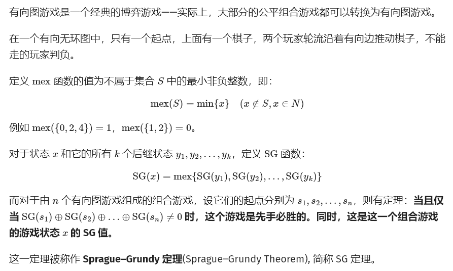
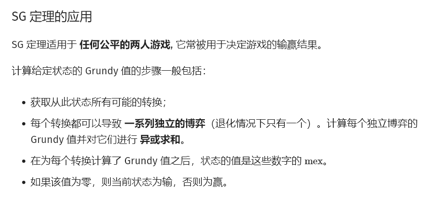
例题
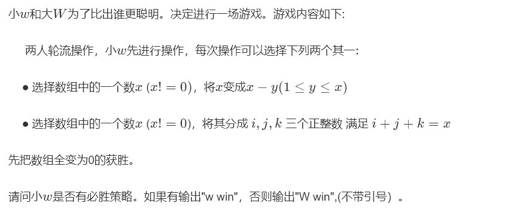

```cpp
#include"bits/stdc++.h"
#define ll long long
#define endl '\n'
using namespace std;
constexpr int N=1e5+10,inf=0X3F3F3F3F;
constexpr ll INF=0X3F3F3F3F3F3F3F3F;
vector<int>f(101,-1);
int sg(int x){
    if(f[x]!=-1)
        return f[x];
    set<int>s;
    for(int i=1;i<=x;i++)
        s.insert(sg(x-i));
    for(int i=1;i<=x;i++){
        for(int j=1;j<=x;j++){
            if(x-i-j>0){
                s.insert(sg(i)^sg(j)^sg(x-i-j));
            }
        }
    }
    for(int i=0;;i++)
        if(!s.count(i))
            return f[x]=i;
}
void solve(){
    int n;
    cin>>n;
    vector<int>a(n+1);
    ll ans=0;
    for(int i=1;i<=n;i++){
        cin>>a[i];
        ans^=sg(a[i]);
    }
    if(!ans){
        cout<<"W win"<<endl;
    }else
        cout<<"w win"<<endl;
}
signed main(){
    cin.tie(nullptr)->sync_with_stdio(0);
//    int t;cin>>t;while(t--)
    solve();
    return 0;
}
```

## 非公平组合博弈

 非公平组合游戏（Partizan Game）与公平组合游戏的区别在于在非公平组合游戏中，游戏者在某一确定状态可以做出的决策集合与游戏者有关。大部分的棋类游戏都 **不是** 公平组合游戏，如国际象棋、中国象棋、围棋、五子棋等（因为双方都不能使用对方的棋子）。  

智慧博弈，没有通用解法（

## 威佐夫博弈

 有两堆石子，两个顶尖聪明的人在玩游戏，每次每个人可以从任意一堆石子中取任意多的石子或者从两堆石子中取同样多的石子，不能取得人输，分析谁会获得胜利  
人们通过对上述性质的探索，同时结合[Betty定理](https://baike.baidu.com/item/%E8%B4%9D%E8%92%82%E5%AE%9A%E7%90%86/2677437?fr=aladdin)，给出了威佐夫博弈的重要结论
 假设两堆石子为$(x,y)$（其中$x<y$）
那么先手必败，当且仅当$(y-x)*(\sqrt{5}+1)/2=x$
其中的$(\sqrt{5}+1)/2$实际就是1.618，黄金分割数！  
```cpp
void solve(){
    ll a,b;
    cin>>a>>b;
    if(a>b)
        swap(a,b);
    if((ll)((b-a)*(((sqrtl(5)+1)/2)))==a)
        cout<<0<<endl;
    else
        cout<<1<<endl;
}
```

不存在精度误差的写法（太多了没看懂）[https://www.luogu.com.cn/article/1j2yn7zo](https://www.luogu.com.cn/article/1j2yn7zo)

```cpp
#include<cstdio>
using namespace std;
long long x,y,t,f[100]={0,1,1},s[100]={0,0,1},g[100]={0,1},i,num1,num2;
main()
{
    scanf("%lld%lld",&x,&y);
    if(x>y)
    {
        t=x;
        x=y;
        y=t;
    }
    for(i=3;i<=50;i++)
    {
        f[i]=f[i-1]+f[i-2];
        s[i]=s[i-1]+s[i-2];
        g[i]=g[i-1]+g[i-2];
    }
    if(y==0)
    printf("0");
    else if(x==0)
    printf("1");
    else
    {
        for(i=1;i<=50;i=i+2)
        if(f[i]+f[i+1]>x)
        break;
        for(;i>=3;i=i-2)
        {
            if(x>=f[i]&&x<f[i]*2)
            {
                num1=num1+s[i];
                x=x-f[i];
            }
            else if(x>=f[i]*2)
            {
                num1=num1+s[i]+s[i-1];
                x=x-f[i]-f[i-1];
            }
        }
        if(x==0)
        {
            printf("1");
            return 0;
        }
        for(i=1;i<=50;i=i+2)
        if(f[i]+f[i+1]>y)
        break;
        for(;i>=3;i=i-2)
        {
            if(y>=f[i]&&y<f[i]*2)
            {
                num2=num2+g[i];
                y=y-f[i];
            }
            else if(y>=f[i]*2)
            {
                num2=num2+g[i]+g[i-1];
                y=y-f[i]-f[i-1];
            }
        }
        if(y==1||num1!=num2-1)
        printf("1");
        else
        printf("0");
    }
}
```

## 反常游戏

 反常游戏（Misère Game）按照传统的游戏规则进行游戏，但是其胜者为第一个无法行动的玩家。以 Nim 游戏为例，Nim 游戏中取走最后一颗石子的为胜者，而反常 Nim 游戏中取走最后一刻石子的为败者。  
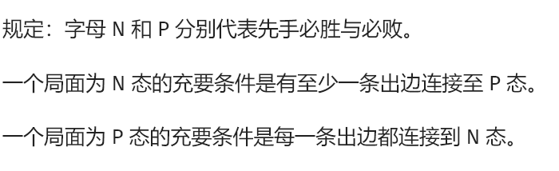
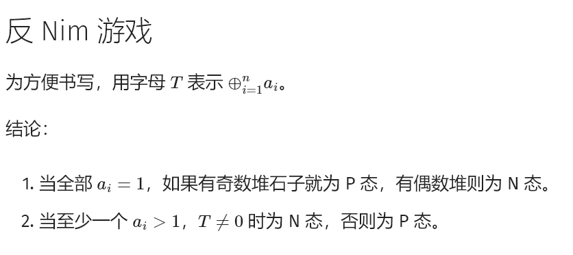


# 数值算法


# 序理论


## Dilworth 定理

 狄尔沃斯定理亦称偏序集分解定理，该定理断言：对于任意有限偏序集，其最大反链中元素的数目必等于最小链划分中链的数目。此定理的对偶形式亦真，它断言：对于任意有限偏序集，其最长链中元素的数目必等于其最小反链划分中反链的数目。  


# 计算几何

## 给定三个点求解圆心和半径

圆的一般方程为

需要注意，如果三个点共线，那么这三个点肯定无法形成圆，这一问题可通过上式的A来判定，A=0说明三点共线


```cpp
	long double x1=x[i],x2=x[j],x3=x[k];
	long double y1=y[i],y2=y[j],y3=y[k];
	long double A=x1*(y2-y3)-y1*(x2-x3)+x2*y3-x3*y2,
	B=(x1*x1+y1*y1)*(y3-y2)+(x2*x2+y2*y2)*(y1-y3)+(x3*x3+y3*y3)*(y2-y1),
	C=(x1*x1+y1*y1)*(x2-x3)+(x2*x2+y2*y2)*(x3-x1)+(x3*x3+y3*y3)*(x1-x2),
	D=(x1*x1+y1*y1)*(x3*y2-x2*y3)+(x2*x2+y2*y2)*(x1*y3-x3*y1)+(x3*x3+y3*y3)*(x2*y1-x1*y2);
	if(abs(A)<=eps)
		continue;
	long double ox=-B/(2*A),oy=-C/(2*A),r=sqrtl((powl(B,2)+powl(C,2)-4*A*D)/(4*powl(A,2)));
```

# 动态规划

## 数位dp

```cpp
int dfs(bool lim,bool lead,int pos,int cur){
    if(pos==-1)
        return cur>=30;
    if(!lim&&!lead&&f[pos][cur]!=-1)
        return  f[pos][cur];

    int res=0;
    int up=(lim==1)?a[pos]:1;
    for(int i=0;i<=up;i++){
        res+=dfs(lim&(a[pos]==i),lead&(i==0),pos-1,cur+(i==0?(lead?0:1):-1));
    }
    if(!lim&&!lead)
        return f[pos][cur]=res;
    return res;
}
```
如果一个正整数的二进制表示中，0 的数目不小于 1 的数目，那么它就被称为「圆数」。
例如，9 的二进制表示为 1001，其中有 2 个 0 与 2 个 1。因此，9 是一个「圆数」。
请你计算，区间 [l,r] 中有多少个「圆数」。
```cpp
#include"bits/stdc++.h"
#define ll long long
#define endl '\n'
using namespace std;
constexpr int N=1e5+10,inf=0X3F3F3F3F;
constexpr ll INF=0X3F3F3F3F3F3F3F3F;
int a[32];
int f[32][100];
int dfs(bool lim,bool lead,int pos,int cur){
    if(pos==-1)
        return cur>=30;
    if(!lim&&!lead&&f[pos][cur]!=-1)
        return  f[pos][cur];

    int res=0;
    int up=(lim==1)?a[pos]:1;
    for(int i=0;i<=up;i++){
        res+=dfs(lim&(a[pos]==i),lead&(i==0),pos-1,cur+(i==0?(lead?0:1):-1));
    }
    if(!lim&&!lead)
        return f[pos][cur]=res;
    return res;
}
int trans(int x){
    int k=0;
    while(x){
        a[k]=x%2;
        x/=2;
        k++;
    }
    return dfs(1,1,k-1,30);
}
void solve(){
    int l,r;
    cin>>l>>r;
    // for(int i=0;i<32;i++)
    //     for(int j=0;j<100;j++)
    //         f[i][j]=-1;
    memset(f,-1,sizeof f);
    cout<<trans(r)-trans(l-1)<<endl;
}
signed main(){
    cin.tie(nullptr)->sync_with_stdio(0);
//	int t;cin>>t;while(t--)
    solve();
    return 0;
}
```

## 状压dp 二分图完全匹配

```cpp
int dp[1<<22];constexpr int mod=1e9+7//
void solve(){
    int n; cin>>n;
    vector<vector<int>>a(n+3,vector<int>(n+3));
    for(int i=1;i<=n;i++)for(int j=1;j<=n;j++)   cin>>a[i][j]; //表示i，j连边
    dp[0]=1;//0个点匹配的方案数是1
    for(int i=0;i<(1<<n);i++){//枚举
        int x= __builtin_popcount(i);//已经匹配的数量 x+1为下一个要匹配的点
        for(int j=1;j<=n;j++){//枚举要进行匹配的点
            if(a[x+1][j]&&( i & ( 1<<( j-1 ) ) ) ==0){ //x+1与j可以匹配并且都未匹配过
                dp[ i | 1<<(j-1) ]=( dp[i] + dp[ i | 1<<(j-1) ])%mod;
                //原状态为i，新匹配点为x+1与j，则(1<<(j-1))被匹配，转移到状态 (i | 1<<(j-1))
            }
        }
    }
    cout<<dp[(1<<n)-1]<<endl;//  (1<<n)-1 代表所有点都匹配
}
```

## 排列取两区间使两区间并size=max-min（lis）

```cpp
#include <bits/stdc++.h>
using namespace std;
const int N = 6000;
int n, a[N], rk[N];
void solved() {
    int ans = 0;
    for (int s = 1; s <= n; ++s) {
        int kuai = 1;
        ans++;
        for (int add = s + 1; add <= n; ++add) {
            int pr = a[rk[add] - 1];
            int bk = a[rk[add] + 1];
            if (pr >= s && pr < add && bk >= s && bk < add) {
                kuai--;
            }
            else if (!((pr >= s && pr < add) || (bk >= s && bk < add))) {
                kuai++;
            }
            if (kuai <= 2) ans++;
        }
    }
    printf("%d\n", ans);
}
int main() {
    int T;
    scanf("%d", &T);
    while(T--) {
        scanf("%d", &n);
        a[n + 1] = n + 1;
        rk[n + 1] = n + 1;
        for (int i = 1; i <= n; ++i) {
            scanf("%d", &a[i]);
            rk[a[i]] = i;
        }
        if (n == 1) {
            puts("0");
            continue;
        }
        solved();
    }
}
```

## 最长公共子序列

### 朴素

朴素做法复杂度$O(nm)$
```cpp
for(int i=1;i<=n;i++){
        for(int j=1;j<=m;j++){
            if(a[i]==b[j]){
                dp[i][j]=dp[i-1][j-1]+1;
            }else{
                dp[i][j]=max(dp[i-1][j],dp[i][j-1]);
            }
        }
    }
```

### 变式

[P1439 【模板】最长公共子序列](https://www.luogu.com.cn/problem/P1439)
题意
给定两个长度为n的排列，求两个排列的最长公共子序列。
解法
将a数组映射成1到n，以映射规则重构b数组，即为求新数组的最长上升子序列
```cpp
// #define TY09
#include"bits/stdc++.h"
#define ll long long
#define endl '\n'
using namespace std;
constexpr int N=1e5+10,inf=0X3F3F3F3F;
void IMSB(){
    int n;
    cin>>n;
    vector<int>a(n+1),f(n+1),c(n+1);
    for(int i=1;i<=n;i++){
        cin>>a[i];
        f[a[i]]=i;
    }
    for(int i=1;i<=n;i++){
        int x;
        cin>>x;
        c[i]=f[x];
    }
    vector<int>d;
    d.push_back(c[1]);
    for(int i=2;i<=n;i++){
        if(c[i]>d.back())
            d.push_back(c[i]);
        else
            *lower_bound(d.begin(),d.end(),c[i])=c[i];
    }
    cout<<d.size();
}
signed main(){
    cin.tie(nullptr)->sync_with_stdio(0);
    // int t;cin>>t;while(t--)
        IMSB();
    return 0;
}
/* It's time to go home although where I don't know. */
```

## 二进制拆分优化多重背包

[P1776 宝物筛选](https://www.luogu.com.cn/problem/P1776)
小 FF 对洞穴里的宝物进行了整理，他发现每样宝物都有一件或者多件。他粗略估算了下每样宝物的价值，之后开始了宝物筛选工作：小 FF 有一个最大载重为 _W_ 的采集车，洞穴里总共有 _n_ 种宝物，每种宝物的价值为 _vi_，重量为 _wi_，每种宝物有 _mi_ 件。小 FF 希望在采集车不超载的前提下，选择一些宝物装进采集车，使得它们的价值和最大。
```cpp
// #define TY09
#include"bits/stdc++.h"
#define ll long long
#define endl '\n'
using namespace std;
#define int ll
constexpr int N=1e5+10,inf=0X3F3F3F3F;
void IMSB(){
    int n,W;
    cin>>n>>W;
    vector<int>v(n+1),w(n+1),m(n+1);
    for(int i=1;i<=n;i++)
        cin>>v[i]>>w[i]>>m[i];
    vector<int>vv,ww;
    for(int i=1;i<=n;i++){
        for(int j=1;j<=m[i];j<<=1){
            m[i]-=j;
            vv.push_back(j*v[i]);
            ww.push_back(j*w[i]);
        }
        if(m[i]){
            vv.push_back(m[i]*v[i]);
            ww.push_back(m[i]*w[i]);
        }
    }
    int nn=vv.size();
    vector<int>dp(W+1);
    for(int i=0;i<nn;i++){
        for(int j=W;j-ww[i]>=0;j--){
            dp[j]=max(dp[j],dp[j-ww[i]]+vv[i]);
        }
    }
    cout<<dp[W]<<endl;
}
signed main(){
    cin.tie(nullptr)->sync_with_stdio(0);
    // int t;cin>>t;while(t--)
        IMSB();
    return 0;
}
/* It's time to go home although where I don't know. */
```

# 图论

## 菊花图

检查整个图所有极大连通子图是不是菊花图，可以考虑使用并查集，对每个连通块记录点的个数，边的
个数和度数为1的点的个数，对于一个连通块，如果边的个数比点的个数少一个，且度数为1的点的个
数和连通块的点的个数差值不大于1，就说明这个子图是菊花图。

## 树

### dfn序

可以把一个节点的子树转换成连续的区间

```cpp
int L[N],R[N],tot;
vector<int>g[N];
void dfs(int u,int p){
    L[u]=++tot;
    for(auto v:g[u]){
        if(v==p)
            continue;
        dfs(v,u);
    }
    R[u]=tot;
}
```


### 判断一个排列是否dfs序

排列（1-index）。排列 $p$  的 $p_1$ 需要等于根节点，然后对于 $1\leq i < n \ , \  lca(p_i,p_{i+1})=fa(p_{i+1})$ 。

[例题](https://codeforces.com/contest/2002/problem/D2)

你有一个由$n$个顶点组成的树。这些顶点从$1$到$n$编号，根是顶点$1$。你还被给定了一个$p_1, p_2, \ldots, p_n$的排列，其中$[1,2,\ldots,n]$。

你需要回答$q$个查询。对于每个查询，你被给定两个整数$x$和$y$；你需要交换$p_x$和$p_y$，并确定$p_1, p_2, \ldots, p_n$是否是给定树的有效的DFS顺序。

请注意，交换操作在查询中是**持久的**。
请注意，DFS顺序不是唯一的。

```cpp
#include"bits/stdc++.h"
#define ll long long
#define endl '\n'
using namespace std;
constexpr int N=3e5+10,inf=0X3F3F3F3F;
constexpr ll INF=0X3F3F3F3F3F3F3F3F;

int idx;
vector<int>g[N];
int fa[N],dep[N],son[N],sz[N],top[N];
void dfs1(int u,int p){
    ++idx;
    fa[u]=p;
    dep[u]=dep[p]+1;
    sz[u]=1;
    for (auto v:g[u]){
        if (v==p)
            continue;
        dfs1(v,u);
        sz[u]+=sz[v];
        if (sz[son[u]]<sz[v])
            son[u]=v;
    }
}
void dfs2(int u,int t){
    top[u]=t;
    if (!son[u])
        return;
        dfs2(son[u],t);
    for (auto v : g[u]){
        if (v==fa[u]||v==son[u])
            continue;
        dfs2(v,v);
    }
}
int lca(int u,int v){
    while(top[u]!=top[v]){
        if(dep[top[u]]<dep[top[v]])
            swap(u,v);
        u=fa[top[u]];
    }
    return dep[u]<dep[v]?u:v;
}
void solve(){
    int n,q;
    cin>>n>>q;
    vector<int>p(n+1),tp(n+1);
    for(int i=2;i<=n;i++){
        cin>>fa[i];
        g[fa[i]].push_back(i);
    }
    for(int i=1;i<=n;i++){
        cin>>p[i];
        tp[p[i]]=i;
    }

    dfs1(1,0);
    dfs2(1,1);

    int tot=0;
    tot+=(p[1]!=1);
    for(int i=1;i<n;i++){
        if(lca(p[i],p[i+1])==fa[p[i+1]])
            ;
        else
            tot++;
    }

    auto calc=[&](int x,int &c){
        if(x<n&&x>0)
            if(lca(p[x],p[x+1])==fa[p[x+1]])
                ;
            else
                c++;
        if(x==1)
            c+=(p[1]!=1);
    };

    while(q--){
        int x,y;
        cin>>x>>y;
        int c1=0,c2=0;

        set<int>s;
        s.insert(x);
        s.insert(x-1);
        s.insert(y);
        s.insert(y-1);
        // calc(x,c1),calc(x-1,c1);
        // calc(y,c1),calc(y-1,c1);
        for(auto i:s)
            calc(i,c1);

        swap(tp[p[x]],tp[p[y]]);
        swap(p[x],p[y]);

        for(auto i:s)
            calc(i,c2);

        tot+=c2-c1;
        if(!tot)
            cout<<"YES"<<endl;
        else
            cout<<"NO"<<endl;
    }

    idx=0;
    for(int i=0;i<=n;i++){
        g[i].clear();
        fa[i]=dep[i]=son[i]=sz[i]=top[i]=0;
    }
}
signed main(){
    cin.tie(nullptr)->sync_with_stdio(0);
	int t;cin>>t;while(t--)
    solve();
    return 0;
}
```

### **树的直径**

```cpp
int n,ans,s;
bool vis[N];
int h[N],e[N],ne[N],idx,w[N];
void add(int a,int b,int c){
    e[++idx]=b;w[idx]=c;
    ne[idx]=h[a];h[a]=idx;
}
int dfs(int u){
    vis[u]=1;
    int d1=0,d2=0;
    for (int i = h[u]; i!=-1 ; i=ne[i]) {
        int j=e[i];
        if (vis[j])continue;
        int d= dfs(j)+w[i];
        if (d>=d1)d2=d1,d1=d;
        else if (d>d2) d2=d;
    }
    ans= max(ans,d1+d2);
    return d1;
}
void GordenGhost() {
    cin>>n;
    memset(h,-1,sizeof h);
    for (int i = 1; i < n; ++i) {
        int a,b,c=1;
        cin>>a>>b>>c;
        add(a,b,c);
        add(b,a,c);
    }
    dfs(1);
    cout<<ans<<endl;
}
```

---

### **树的重心**

#### 定义

如果在树中选择某个节点并删除，这棵树将分为若干棵子树，统计子树节点数并记录最大值。取遍树上所有节点，使此最大值取到最小的节点被称为整个树的重心。
（这里以及下文中的「子树」若无特殊说明都是指无根树的子树，即包括「向上」的那棵子树，并且不包括整棵树自身。）

#### 性质


- 树的重心如果不唯一，则至多有两个，且这两个重心相邻。
- 以树的重心为根时，所有子树的大小都不超过整棵树大小的一半。
- 树中所有点到某个点的距离和中，到重心的距离和是最小的；如果有两个重心，那么到它们的距离和一样。
- 把两棵树通过一条边相连得到一棵新的树，那么新的树的重心在连接原来两棵树的重心的路径上。
- 在一棵树上添加或删除一个叶子，那么它的重心最多只移动一条边的距离。
```cpp
int n,mn=0X3F3F3F3F;
vector<int>g[N],z;//z存储树的重心
int sz[N];
void dfs(int u,int fa){
	int mx=0;
    sz[u]=1;
    for(int v:g[u]){
        if(v==fa)
            continue;
		dfs(v,u);
        sz[u]+=sz[v];
        mx=max(mx,sz[v]);
    }
	mx=max(mx,n-sz[u]);
    if(mx<=mn){
        if(mx<mn){
            z.clear();
            z.push_back(u);
        }
        else{
            z.push_back(u);
        }
        mn=mx;
    }
}
```

---


## Tarjan

### 保留桥

```cpp
vector<int>g[N];
int low[N],num[N],scc[N],siz[N];
int dfn,sc;
stack<int>st;
void tarjan(int u,int fa){//tarjan缩点,low为能返回到最远祖先，num为dfs序
	st.push(u);
	low[u]=num[u]=++dfn;
	for(auto v:g[u]){
        if(v==fa)
            continue;
		if(!num[v]){
			tarjan(v,u);
            low[u]=min(low[v],low[u]);
        }
		else if(!scc[v]){
			low[u]=min(num[v],low[u]);
        }
	}
	if(num[u]<=low[u]){
        sc++;
		while(1){
			int v=st.top();
			scc[v]=sc;//v与u在同一个强连通分量
            siz[sc]++;
			st.pop();
			if(u==v)
				break;
		}
	}
}

```

### 求强连通分量

```cpp
vector<int>g[N];
int low[N],num[N],scc[N],siz[N];
int dfn,sc;
stack<int>st;
void tarjan(int u,int fa){//tarjan缩点,low为能返回到最远祖先，num为dfs序
	st.push(u);
	low[u]=num[u]=++dfn;
	for(auto v:g[u]){
        if(v==fa)
            continue;
		if(!num[v]){
			tarjan(v,u);
            low[u]=min(low[v],low[u]);
        }
		else if(!scc[v]){
			low[u]=min(num[v],low[u]);
        }
	}
	if(num[u]==low[u]){
        sc++;
		while(1){
			int v=st.top();
			scc[v]=sc;//v与u在同一个强连通分量
            siz[sc]++;
			st.pop();
			if(u==v)
				break;
		}
	}
}

```

## （无向图的连通性）求割点

[P3388 【模板】割点（割顶）](https://www.luogu.com.cn/problem/P3388)
给出一个 _n_ 个点，_m_ 条边的无向图，求图的割点。
注：如需要求割边，只需把21行改成`if(low[v]>num[u]&&u!=s)`
```cpp
// #define TY09
#include"bits/stdc++.h"
#define ll long long
#define endl '\n'
using namespace std;
constexpr int N=2e4+10,inf=0X3F3F3F3F;
int dfn;
vector<int>g[N];
int num[N],low[N],p[N];
set<int>iscut;
void dfs(int u,int fa,int s){
    num[u]=low[u]=++dfn;
    int son=0;
    for(auto v:g[u]){
        if(v==fa)
            continue;
        if(!num[v]){
            son++;
            dfs(v,u,s);
            low[u]=min(low[u],low[v]);
            if(low[v]>=num[u]&&u!=s)
                iscut.insert(u);
        }else if(num[v]<num[u]){
            low[u]=min(low[u],num[v]);
        }
    }
    if(u==s&&son>=2)
        iscut.insert(u);
}
int find(int x){
    return p[x]==x?x:p[x]=find(p[x]);
}
void IMSB(){
    int n,m;
    cin>>n>>m;
    for(int i=1;i<=n;i++)
        p[i]=i;
    for(int i=0;i<m;i++){
        int u,v;
        cin>>u>>v;
        g[u].emplace_back(v);
        g[v].emplace_back(u);
        p[find(u)]=find(v);
    }
    for(int i=1;i<=n;i++){
        if(find(i)==i){
            dfs(i,-1,i);
        }
    }
    cout<<iscut.size()<<endl;
    for(auto x:iscut)
        cout<<x<<' ';
    // dfs(1,0);
}
signed main(){
    cin.tie(nullptr)->sync_with_stdio(0);
    // int t;cin>>t;while(t--)
        IMSB();
    return 0;
}
/* It's time to go home although where I don't know. */
```

## （有向图的连通性）tarjan

[https://www.luogu.com.cn/problem/P3387](https://www.luogu.com.cn/problem/P3387)
给定一个 n个点 m 条边有向图，每个点有一个权值，求一条路径，使路径经过的点权值之和最大。你只需要求出这个权值和。
允许多次经过一条边或者一个点，但是，重复经过的点，权值只计算一次。

```cpp
// #define TY09
#include"bits/stdc++.h"
#define ll long long
#define endl '\n'
using namespace std;
constexpr int N=10010,inf=0X3F3F3F3F;
vector<int>g1[N],g2[N];
int low[N],num[N],scc[N],a[N],b[N],dp[N],vis[N];
int dfn;
stack<int>st;
void tarjan(int u){//tarjan缩点,low为能返回到最远祖先，num为dfs序
	st.push(u);
	low[u]=num[u]=++dfn;
	for(auto v:g1[u]){
		if(!num[v])
			tarjan(v);
		if(!num[v]||!scc[v])
			low[u]=min(low[v],low[u]);
	}
	if(num[u]==low[u]){
		while(1){
			int v=st.top();
			st.pop();
			scc[v]=u;//v与u在同一个强连通分量
			if(u==v)
				break;
		}
	}
}
void IMSB(){
	int n,m;
	cin>>n>>m;
	vector<array<int,2>>e;
	for(int i=1;i<=n;i++)
		cin>>a[i];
	for(int i=1;i<=m;i++){
		int u,v;
		cin>>u>>v;
		g1[u].push_back(v);
		e.push_back({u,v});
	}
	
	for(int i=1;i<=n;i++)
		if(!num[i])
			tarjan(i);
	for(int i=1;i<=n;i++)
		b[scc[i]]+=a[i];
	
	vector<int>in(n+1);
	for(auto [u,v]:e){
		int x=scc[u],y=scc[v];
		if(x!=y){
			g2[x].push_back(y);
			in[y]++;
		}
	}//tarjan缩点建图
	queue<int>q;
	for(int i=1;i<=n;i++)
		if(scc[i]==i&&!in[i]){
			q.push(i);
			dp[i]=b[i];
		}
	while(!q.empty()){
		int u=q.front();
		q.pop();
		for(auto v:g2[u]){
			dp[v]=max(dp[v],b[v]+dp[u]);
			in[v]--;
			if(!in[v])
				q.push(v);
		}
	}//拓扑排序保证无后效性进行dp
	int ans=0;
	for(int i=1;i<=n;i++)
		ans=max(ans,dp[i]);
	cout<<ans<<endl;
}
signed main(){
	cin.tie(nullptr)->sync_with_stdio(0);
//	int t;cin>>t;while(t--)
	IMSB();
	return 0;
}
/* It's time to go home although where I don't know. */
```

## 最小生成树

[洛谷p3366](https://www.luogu.com.cn/problem/P3366)
如题，给出一个无向图，求出最小生成树，如果该图不连通，则输出 orz。

### prim

堆优化
```cpp
const int N = 1e5+5,inf = 0x3f3f3f3f;
struct edge{int v,w;};
int ans,n,m,cnt;
vector<edge>e[N];
vector<int>d(N),vis(N);
priority_queue<pair<int,int>>q;
bool prim(int s){
    for (int i = 0; i <= n; ++i) d[i]=inf;
    d[s]=0;q.push({0,s});
    while (q.size()){
        int u=q.top().second;q.pop();
        if (vis[u])continue;
        ans+=d[u];cnt++;vis[u]=1;
        for (auto ed : e[u]){
            int v=ed.v,w=ed.w;
            if (d[v]>w){
                d[v]=w;
                q.push({-d[v],v});
            }
        }
    }
    return cnt==n;
}
```
暴力
稠密图 邻接矩阵
```cpp
int prim(){
    int ans=0;
    vector<int>d(cnt+1,inf),vis(cnt+1);
    d[1]=0;
    for(int i=1;i<=cnt;i++){
        int t=0;
        for(int j=1;j<=cnt;j++){
            if((t==0||d[j]<d[t])&&!vis[j]){
                t=j;
            }
        }
        vis[t]=1;
        ans+=d[t];
        for(int j=1;j<=cnt;j++){
            if(d[j]>g[t][j])
                d[j]=g[t][j];
        }
    }
    return ans;
}
```

### kruskal

```cpp
struct edge{int u,v,w;
bool operator<(const edge &t)const
{return w<t.w;}
}e[N];
int fa[N],ans,cnt,n,m;
int findB(int x){
    return fa[x]==x?x:fa[x]= findB(fa[x]);
}
bool kruskal(){
    sort(e,e+m);
    for (int i = 1; i <= n; ++i) fa[i]=i;
    for (int i = 0; i < m; ++i) {
        int x= findB(e[i].u);
        int y= findB(e[i].v);
        if (x!=y){
            ans+=e[i].w;
            fa[x]=y;
            cnt++;
        }
    }
    return cnt==n-1;
}
```

## Floyd

```cpp
for (k = 1; k <= n; k++) {
  for (x = 1; x <= n; x++) {
    for (y = 1; y <= n; y++) {
      f[x][y] = min(f[x][y], f[x][k] + f[k][y]);
    }
  }
}
```

## Dijkstra

### 求单源最短路

无负边权值单源最短路，复杂度$O(mlog_2n)$
```cpp
struct edge {
  int v, w;
};

struct node {
  int dis, u;

  bool operator>(const node& a) const { return dis > a.dis; }
};

vector<edge> e[maxn];
int dis[maxn], vis[maxn];
priority_queue<node, vector<node>, greater<node> > q;

void dijkstra(int n, int s) {
  memset(dis, 63, sizeof(dis));
  dis[s] = 0;
  q.push({0, s});
  while (!q.empty()) {
    int u = q.top().u;
    q.pop();
    if (vis[u]) continue;
    vis[u] = 1;
    for (auto ed : e[u]) {
      int v = ed.v, w = ed.w;
      if (dis[v] > dis[u] + w) {
        dis[v] = dis[u] + w;
        q.push({dis[v], v});
      }
    }
  }
}
```

### 次短路

[https://www.luogu.com.cn/problem/P2865](https://www.luogu.com.cn/problem/P2865)
给定正边权无向图，求1到n的次短路
```cpp
#include"bits/stdc++.h"
#define ll long long
#define endl '\n'
using namespace std;
// #define int ll
constexpr int N=510,inf=0X3F3F3F3F;
void IMSB(){
	int n,m;
    cin>>n>>m;
    vector<array<int,2>>g[n+1];
    for(int i=0;i<m;i++){
        int u,v,w;
        cin>>u>>v>>w;
        g[u].push_back({v,w});
        g[v].push_back({u,w});
    }
    priority_queue<array<int,2>,vector<array<int,2>>,greater<array<int,2>>>q;
    q.push({0,1});
    vector<int>dist1(n+1,inf),dist2(n+1,inf);//dist1存最小，dist2存次小
    dist1[1]=0;
    while(!q.empty()){
        int u=q.top()[1],dit=q.top()[0];
        q.pop();
        for(auto [v,w]:g[u]){
            int t=dit+w;
            if(t<dist1[v]){//当前小于最小，更新最小次小
                dist2[v]=dist1[v];
                dist1[v]=t;
                q.push({dist1[v],v});
            }
            else if(t<dist2[v]&&dist1[v]<t){//当前小于次小大于最小，更新次小
                dist2[v]=t;
                q.push({dist2[v],v});
            }
        }
    }
    cout<<dist2[n]<<endl;
}
signed main(){
#ifdef ty09
    freopen("in.txt","r",stdin);
#endif
	cin.tie(nullptr)->sync_with_stdio(0);
//	int t;cin>>t;while(t--)
	IMSB();
	return 0;
}
/* It's time to go home although where I don't know. */
```

## 拓扑排序

### kahn

```cpp
int in[100010];
bool toposort(int n){
    queue<int>q;
    vector<int>r;
    for(int i=1;i<=n;i++)
        if(!in[i])
            q.push(i);
    while(!q.empty()){
        int u=q.front();
        q.pop();
        r.push_back(u);
        for(auto v:g[u]){
            in[v]--;
            if(!in[v]){
                q.push(v);
            }
        }
    }
    if(r.size()==n){
        for(auto i:r)//输出拓扑序
            cout<<i<<' ';
        return 1;
    }
    else
        return 0;//为0说明有环
}
```

### dfs

例题[https://ac.nowcoder.com/acm/problem/233502](https://ac.nowcoder.com/acm/problem/233502)
题意n点m边输出拓扑序，无法进行拓扑排序输出-1.（此题行末不能有空格）
```cpp
// #define TY09
#include"bits/stdc++.h"
#define ll long long
#define endl '\n'
using namespace std;
constexpr int N=2e5+10,inf=0X3F3F3F3F;
vector<int>g[N];
stack<int>top;//拓扑排序结果放入栈中，倒序存储
int vis[N];
bool cycle;//为真代表存在环
void dfs(int u){//有向图
	if(cycle)
		return;
	vis[u]=-1;//代表起点
	for(auto v:g[u]){
		if(!vis[v])
			dfs(v);
		if(vis[v]==-1){//有环
			cycle=true;
			return;
		}
	}
	vis[u]=1;
	top.push(u);
}
void IMSB(){
	int n,m;
	cin>>n>>m;
	vector<int>in(n+1);
	for(int i=0;i<m;i++){
		int u,v;
		cin>>u>>v;
		g[u].push_back(v);
		in[v]++;
	}
	for(int i=1;i<=n;i++){
		if(!in[i])
			dfs(i);
	}
	if(cycle){
		cout<<-1<<endl;
	}else{
		while(top.size()>1){
			cout<<top.top()<<' ';
			top.pop();
		}
		while(!top.empty()){
			cout<<top.top();
			top.pop();
		}
	}
}
signed main(){
	cin.tie(nullptr)->sync_with_stdio(0);
//	int t;cin>>t;while(t--)
	IMSB();
	return 0;
}
/* It's time to go home although where I don't know. */
```

## 2-SAT

[https://www.luogu.com.cn/problem/P4782](https://www.luogu.com.cn/problem/P4782)
有 n个布尔变量 x1∼xn，另有 mm 个需要满足的条件，每个条件的形式都是 「xi 为 true / false 或 xj 为 true / false」。比如 「x1 为真或 x3 为假」、「x7 为假或 x2 为假」。
2-SAT 问题的目标是给每个变量赋值使得所有条件得到满足。
```cpp
// #define TY09
#include"bits/stdc++.h"
#define ll long long
#define endl '\n'
using namespace std;
constexpr int N=2000010,inf=0X3F3F3F3F;
vector<int>g[N];
int low[N],num[N],scc[N];
int dfn,n,m,cnt;
stack<int>st;
void tarjan(int u){//tarjan缩点,low为能返回到最远祖先，num为dfs序
	st.push(u);
	low[u]=num[u]=++dfn;
	for(auto v:g[u]){
		if(!num[v])
			tarjan(v);
		if(!num[v]||!scc[v])
			low[u]=min(low[v],low[u]);
	}
	if(num[u]==low[u]){
		cnt++;
		while(1){
			int v=st.top();
			st.pop();
			scc[v]=cnt;//v与u在同一个强连通分量
			if(u==v)
				break;
		}
	}
}
bool two_sat(){
	for(int i=1;i<=2*n;i++){
		if(!num[i])
			tarjan(i);
	}//tarjan求scc
	for(int i=1;i<=n;i++){
		if(scc[i]==scc[i+n])//非i与i在同一个scc说明没有可行解
			return false;
	}
	return true;
}
void IMSB(){
	cin>>n>>m;
	for(int i=1;i<=m;i++){
		int x1,a,x2,b;
		cin>>x1>>a>>x2>>b;
		int na=a^1,nb=b^1;
		g[x1+na*n].push_back(x2+b*n);
		g[x2+nb*n].push_back(x1+a*n);//对于矛盾的条件如A，B矛盾，则A->(-B),B->(-A)，建图即可
	}//输出可行解应该建反图进行拓扑排序，但是scc存的即为拓扑序，所以不需要
	if(two_sat()){
		cout<<"POSSIBLE"<<endl;
		for(int i=1;i<=n;i++)
			cout<<(scc[i+n]<scc[i])<<' ';
		cout<<endl;
	}else
		cout<<"IMPOSSIBLE"<<endl;
}
signed main(){
	cin.tie(nullptr)->sync_with_stdio(0);
//	int t;cin>>t;while(t--)
	IMSB();
	return 0;
}
/* It's time to go home although where I don't know. */
```

## 传递闭包

### bitset优化 Floyd求传递闭包

复杂度近似$O(n^2)$
[https://www.luogu.com.cn/problem/B3611](https://www.luogu.com.cn/problem/B3611)
给定有向图的邻接矩阵，求有向图的传递闭包
```cpp
#include"bits/stdc++.h"
#define ll long long
#define endl '\n'
using namespace std;
constexpr int N=1e3+10,inf=0X3F3F3F3F;
bitset<N>dp[N];
void IMSB(){
	int n;
    cin>>n;
    for(int i=0;i<n;i++){
        for(int j=0;j<n;j++){
            bool f;
            cin>>f;
            dp[i][j]=f;
        }
    }
    for(int k=0;k<n;k++){
        for(int i=0;i<n;i++){
            if(dp[i][k])
                dp[i]|=dp[k];
        }
    }/*等价于
    for(int k=0;k<n;k++)
        for(int i=0;i<n;i++)
            if(dp[i][k])
                for(int j=0;j<n;j++)
                    if(dp[k][j])
                        dp[i][j]=1;
    */
    for(int i=0;i<n;i++){
        for(int j=0;j<n;j++){
            cout<<dp[i][j]<<' ';
        }
        cout<<endl;
    }
}
signed main(){
#ifdef ty09
    freopen("in.txt","r",stdin);
#endif
	cin.tie(nullptr)->sync_with_stdio(0);
//	int t;cin>>t;while(t--)
	IMSB();
	return 0;
}
/* It's time to go home although where I don't know. */
```

## k短路

### A-star算法

 给定一个有n个结点，m条边的有向图，求从s到t的所有不同路径中的第k短路径的长度。  
```cpp
#include <algorithm>
#include <cstdio>
#include <cstring>
#include <queue>
using namespace std;
const int maxn = 5010;
const int maxm = 400010;
const int inf = 2e9;
int n, m, s, t, k, u, v, ww, H[maxn], cnt[maxn];
int cur, h[maxn], nxt[maxm], p[maxm], w[maxm];
int cur1, h1[maxn], nxt1[maxm], p1[maxm], w1[maxm];
bool tf[maxn];

void add_edge(int x, int y, double z) {
  cur++;
  nxt[cur] = h[x];
  h[x] = cur;
  p[cur] = y;
  w[cur] = z;
}

void add_edge1(int x, int y, double z) {
  cur1++;
  nxt1[cur1] = h1[x];
  h1[x] = cur1;
  p1[cur1] = y;
  w1[cur1] = z;
}

struct node {
  int x, v;

  bool operator<(node a) const { return v + H[x] > a.v + H[a.x]; }
};

priority_queue<node> q;

struct node2 {
  int x, v;

  bool operator<(node2 a) const { return v > a.v; }
} x;

priority_queue<node2> Q;

int main() {
  scanf("%d%d%d%d%d", &n, &m, &s, &t, &k);
  while (m--) {
    scanf("%d%d%d", &u, &v, &ww);
    add_edge(u, v, ww);
    add_edge1(v, u, ww);
  }
  for (int i = 1; i <= n; i++) H[i] = inf;
  Q.push({t, 0});
  while (!Q.empty()) {
    x = Q.top();
    Q.pop();
    if (tf[x.x]) continue;
    tf[x.x] = true;
    H[x.x] = x.v;
    for (int j = h1[x.x]; j; j = nxt1[j]) Q.push({p1[j], x.v + w1[j]});
  }
  q.push({s, 0});
  while (!q.empty()) {
    node x = q.top();
    q.pop();
    cnt[x.x]++;
    if (x.x == t && cnt[x.x] == k) {
      printf("%d\n", x.v);
      return 0;
    }
    if (cnt[x.x] > k) continue;
    for (int j = h[x.x]; j; j = nxt[j]) q.push({p[j], x.v + w[j]});
  }
  printf("-1\n");
  return 0;
}
```

## SPFA

可以处理负边权的单源最短路，最坏复杂度O(nm)
```cpp
vector<array<int,2>>g[N];
int cnt[N],dis[N],vis[N];
queue<int>q;
bool spfa(int n,int s){
	memset(dis,0x3f,sizeof dis);
	q.push(s);
	dis[s]=0;
	vis[s]=1;
	while(!q.empty()){
		int u=q.front();
		q.pop();
		vis[u]=0;
		for(auto [v,w]:g[u]){
			if(dis[v]>dis[u]+w){
				dis[v]=dis[u]+w;
				cnt[v]=cnt[u]+1;
				if(cnt[v]>n)
					return false;
				if(!vis[v]){
					q.push(v);
					vis[v]=1;
				}
			}
		}
	}
	return true;
}
```

## 差分约束

[https://www.luogu.com.cn/problem/P5960](https://www.luogu.com.cn/problem/P5960)
有n个数，有m个形如xi<=xj+c的形式的方程，询问是否有一组任意解
```cpp
// #define TY09
#include"bits/stdc++.h"
#define ll long long
#define endl '\n'
using namespace std;
constexpr int N=10010,inf=0X3F3F3F3F,mod=1000000007;
vector<array<int,2>>g[N];
int cnt[N],dis[N],vis[N];
queue<int>q;
bool spfa(int n,int s){
	memset(dis,0x3f,sizeof dis);
	q.push(s);
	dis[s]=0;
	vis[s]=1;
	while(!q.empty()){
		int u=q.front();
		q.pop();
		vis[u]=0;
		for(auto [v,w]:g[u]){
			if(dis[v]>dis[u]+w){
				dis[v]=dis[u]+w;
				cnt[v]=cnt[u]+1;
				if(cnt[v]>n)
					return false;
				if(!vis[v]){
					q.push(v);
					vis[v]=1;
				}
			}
		}
	}
	return true;
}
void IMSB(){
	int n,m;
	cin>>n>>m;
	for(int i=1;i<=n;i++){
		g[0].push_back({i,0});
	}
	for(int i=0;i<m;i++){
		int a,b,c;
		cin>>a>>b>>c;
		g[b].push_back({a,c});
	}
	if(spfa(n,0)){
		for(int i=1;i<=n;i++)
			cout<<dis[i]<<' ';
		cout<<endl;
	}else{
		cout<<"NO"<<endl;
	}
}
signed main(){
	cin.tie(nullptr)->sync_with_stdio(0);
//	int t;cin>>t;while(t--)
	IMSB();
	return 0;
}
/* It's time to go home although where I don't know. */
```

## Joshson

无负环全源最短路，时间复杂度O(nmlogn)
[https://www.luogu.com.cn/problem/P5905](https://www.luogu.com.cn/problem/P5905)
 给定一个包含 n 个结点和 m 条带权边的有向图，求所有点对间的最短路径长度，一条路径的长度定义为这条路径上所有边的权值和。
若图中存在负环，输出仅一行 $-1$。
若图中不存在负环：
输出 $n$ 行：令 $dis_{i,j}$ 为从 $i$到 $j$ 的最短路，在第 $i$ 行输出 $\sum\limits_{j=1}^n j\times dis_{i,j}$，注意这个结果可能超过 int 存储范围。
如果不存在从 $i$ 到 $j$ 的路径，则 $dis_{i,j}=10^9$；如果 $i=j$，则 $dis_{i,j}=0$。
```cpp
// #define TY09
#include"bits/stdc++.h"
#define ll long long
#define endl '\n'
using namespace std;
constexpr ll N=3010,inf=1000000000,mod=1000000007;
vector<array<int,2>>g[N];
ll h[N],dis[N];
int cnt[N];
bool vis[N];
queue<int>q;
bool spfa(int n,int s){
	for(int i=1;i<=n;i++)
		h[i]=inf;
	q.push(s);
	h[s]=0;
	vis[s]=1;
	while(!q.empty()){
		int u=q.front();
		q.pop();
		vis[u]=0;
		for(auto [v,w]:g[u]){
			if(h[v]>h[u]+w){
				h[v]=h[u]+w;
				cnt[v]=cnt[u]+1;
				if(cnt[v]>n)
					return false;
				if(!vis[v]){
					q.push(v);
					vis[v]=1;
				}
			}
		}
	}
	return true;
}
priority_queue<array<ll,2>,vector<array<ll,2>>,greater<array<ll,2>>>pq;
void dijkstra(int n,int s){
	for(int i=1;i<=n;i++){
		dis[i]=inf;
		vis[i]=0;
	}
	pq.push({0,s});
	dis[s]=0;
	while(!pq.empty()){
		int u=pq.top()[1];
		pq.pop();
		if(vis[u])
			continue;
		vis[u]=1;
		for(auto [v,w]:g[u]){
			if(dis[v]>dis[u]+w){
				dis[v]=dis[u]+w;
				pq.push({dis[v],v});
			}
		}
	}
}
void IMSB(){
	int n,m;
	cin>>n>>m;
	for(int i=0;i<m;i++){
		int u,v,w;
		cin>>u>>v>>w;
		g[u].push_back({v,w});
	}
	for(int i=1;i<=n;i++){
		g[0].push_back({i,0});
	}
	if(!spfa(n,0)){
		cout<<-1<<endl;
		return;
	}
	for(int i=1;i<=n;i++){
		for(auto &e:g[i]){
			int u=i,v=e[0],&w=e[1];
			w=w+h[u]-h[v];
		}
	}
	for(int i=1;i<=n;i++){
		dijkstra(n,i);
		ll ans=0;
		for(int j=1;j<=n;j++){
			if(dis[j]==inf)
				ans+=j*inf;
			else
				ans+=j*(dis[j]+h[j]-h[i]);
		}
		cout<<ans<<endl;
	}
}
signed main(){
	cin.tie(nullptr)->sync_with_stdio(0);
//	int t;cin>>t;while(t--)
	IMSB();
	return 0;
}
/* It's time to go home although where I don't know. */
```

## 最大流

### Edmonds-Karp

【模板】网络最大流[https://www.luogu.com.cn/problem/P3376](https://www.luogu.com.cn/problem/P3376)
题目描述
如题，给出一个网络图，以及其源点和汇点，求出其网络最大流。
输入格式
第一行包含四个正整数 $n,m,s,t$，分别表示点的个数、有向边的个数、源点序号、汇点序号。
接下来 $m$ 行每行包含三个正整数 $u_i,v_i,w_i$，表示第 $i$ 条有向边从 $u_i$ 出发，到达 $v_i$，边权为 $w_i$（即该边最大流量为 $w_i$）。
输出格式
一行，包含一个正整数，即为该网络的最大流。
```cpp
// #define TY09
#include"bits/stdc++.h"
#define ll long long
#define endl '\n'
using namespace std;
constexpr int N=200+10,inf=0X3F3F3F3F,mod=1000000007,M=5000+10;
struct{
	int v;
	ll w;
	int nxt;
}e[2*M];
int h[N],idx=1;
ll mf[N],pre[N];
void add(int u,int v,ll w){
	e[++idx]={v,w,h[u]};
	h[u]=idx;
}
bool bfs(int s,int t){
	memset(mf,0,sizeof mf);
	queue<int>q;
	q.push(s);
	mf[s]=inf;
	while(!q.empty()){
		int u=q.front();
		q.pop();
		for(int i=h[u];i;i=e[i].nxt){
			int v=e[i].v;
			if(mf[v]==0&&e[i].w){
				mf[v]=min(mf[u],e[i].w);
				q.push(v);
				pre[v]=i;
				if(v==t)
					return true;
			}
		}
	}
	return false;
}
ll EK(int s,int t){
	ll flow=0;
	while(bfs(s,t)){
		flow+=mf[t];
		int v=t;
		while(v!=s){
			int i=pre[v];
			e[i].w-=mf[t];
			e[i^1].w+=mf[t];
			v=e[i^1].v;
		}
	}
	return flow;
}
void IMSB(){
	int n,m,s,t;
	cin>>n>>m>>s>>t;
	for(int i=1;i<=m;i++){
		int u,v;
		ll w;
		cin>>u>>v>>w;
		add(u,v,w);
		add(v,u,0);
	}
	cout<<EK(s,t)<<endl;
}
signed main(){
	cin.tie(nullptr)->sync_with_stdio(0);
//	int t;cin>>t;while(t--)
	IMSB();
	return 0;
}
/* It's time to go home although where I don't know. */
```

### Dinic

【模板】网络最大流[https://www.luogu.com.cn/problem/P3376](https://www.luogu.com.cn/problem/P3376)
题目描述
如题，给出一个网络图，以及其源点和汇点，求出其网络最大流。
输入格式
第一行包含四个正整数 $n,m,s,t$，分别表示点的个数、有向边的个数、源点序号、汇点序号。
接下来 $m$ 行每行包含三个正整数 $u_i,v_i,w_i$，表示第 $i$ 条有向边从 $u_i$ 出发，到达 $v_i$，边权为 $w_i$（即该边最大流量为 $w_i$）。
输出格式
一行，包含一个正整数，即为该网络的最大流。
```cpp
// #define TY09
#include"bits/stdc++.h"
#define ll long long
#define endl '\n'
using namespace std;
constexpr int N=200+10,inf=0X3F3F3F3F,mod=1000000007,M=5000+10;
struct edge{
	int v;
	ll w;
	int nxt;
}e[2*M];
int h[N],idx=1,cur[N],d[N];
int S,T;
void add(int u,int v,ll w){
	e[++idx]={v,w,h[u]};
	h[u]=idx;
}
bool bfs(){
	memset(d,0,sizeof d);
	queue<int>q;
	q.push(S);
	d[S]=1;
	while(!q.empty()){
		int u=q.front();
		q.pop();
		for(int i=h[u];i;i=e[i].nxt){
			int v=e[i].v;
			if(d[v]==0&&e[i].w){
				d[v]=d[u]+1;
				q.push(v);
				if(v==T)
					return true;
			}
		}
	}
	return false;
}
ll dfs(int u,ll mf){
	if(u==T)
		return mf;
	ll sum=0;
	for(int i=cur[u];i;i=e[i].nxt){
		cur[u]=i;
		int v=e[i].v;
		if(d[v]==d[u]+1&&e[i].w){
			ll f=dfs(v,min(mf,e[i].w));
			e[i].w-=f;
			e[i^1].w+=f;
			sum+=f;
			mf-=f;
			if(mf==0)
				break;
		}
	}
	if(sum==0)
		d[u]=0;
	return sum;
}
ll dinic(){
	ll flow=0;
	while(bfs()){
		memcpy(cur,h,sizeof h);
		flow+=dfs(S,inf);
	}
	return flow;
}
void IMSB(){
	int n,m;
	cin>>n>>m>>S>>T;
	for(int i=1;i<=m;i++){
		int u,v;
		ll w;
		cin>>u>>v>>w;
		add(u,v,w);
		add(v,u,0);
	}
	cout<<dinic()<<endl;
}
signed main(){
	cin.tie(nullptr)->sync_with_stdio(0);
//	int t;cin>>t;while(t--)
	IMSB();
	return 0;
}
/* It's time to go home although where I don't know. */
```

### ISAP

【模板】网络最大流[https://www.luogu.com.cn/problem/P3376](https://www.luogu.com.cn/problem/P3376)
题目描述
如题，给出一个网络图，以及其源点和汇点，求出其网络最大流。
输入格式
第一行包含四个正整数 $n,m,s,t$，分别表示点的个数、有向边的个数、源点序号、汇点序号。
接下来 $m$ 行每行包含三个正整数 $u_i,v_i,w_i$，表示第 $i$ 条有向边从 $u_i$ 出发，到达 $v_i$，边权为 $w_i$（即该边最大流量为 $w_i$）。
输出格式
一行，包含一个正整数，即为该网络的最大流。
```cpp
// #define TY09
#include"bits/stdc++.h"
#define ll long long
#define endl '\n'
using namespace std;
constexpr int N=200+10,inf=0X3F3F3F3F,mod=1000000007,M=5000+10;
struct edge{
	int v;
	ll w;
	int nxt;
}e[2*M];
int h[N],idx=1;
int cur[N],dep[N],gap[N],pre[N];
int n,m,s,t;
void add(int u,int v,ll w){
	e[++idx]={v,w,h[u]};
	h[u]=idx;
}
bool bfs(){
	memset(dep,0,sizeof dep);
	memset(gap,0,sizeof gap);
	queue<int>q;
	q.push(t);
	dep[t]=1;
	while(!q.empty()){
		int u=q.front();
		q.pop();
		gap[dep[u]]++;
		for(int i=h[u];i;i=e[i].nxt){
			int v=e[i].v;
			if(dep[v]==0&&e[i^1].w){
				dep[v]=dep[u]+1;
				q.push(v);
				if(v==t)
					return true;
			}
		}
	}
	return false;
}
ll Augment(){
	int v=t,flow=inf;
	while(v!=s){
		int i=pre[v];
		if(e[i].w<flow)
			flow=e[i].w;
		v=e[i^1].v;
	}
	v=t;
	while(v!=s){
		int i=pre[v];
		e[i].w-=flow;
		e[i^1].w+=flow;
		v=e[i^1].v;
	}
	return flow;
}
ll ISAP(){
	bfs();
	ll flow=0;
	int u=s;
	memcpy(cur,h,sizeof h);
	while(dep[s]<=n){
		if(u==t){
			flow+=Augment();
			u=s;
		}
		bool ok=0;
		for(int i=h[u];i;i=e[i].nxt){
			int v=e[i].v;
			if(e[i].w&&dep[v]+1==dep[u]){
				ok=1;
				pre[v]=i;
				cur[u]=i;
				u=v;
				break;
			}
		}
		if(!ok){
			if(!--gap[dep[u]])
				break;
			int mindep=n+10;
			for(int i=h[u];i;i=e[i].nxt){
				int v=e[i].v;
				if(dep[v]<mindep&&e[i].w)
					mindep=dep[v];
			}
			dep[u]=mindep+1;
			gap[dep[u]]++;
			cur[u]=h[u];
			if(u!=s)
				u=e[pre[u]^1].v;
		}
	}
	return flow;
}
void IMSB(){
	cin>>n>>m>>s>>t;
	for(int i=1;i<=m;i++){
		int u,v;
		ll w;
		cin>>u>>v>>w;
		add(u,v,w);
		add(v,u,0);
	}
	cout<<ISAP()<<endl;
}
signed main(){
	cin.tie(nullptr)->sync_with_stdio(0);
//	int t;cin>>t;while(t--)
	IMSB();
	return 0;
}
/* It's time to go home although where I don't know. */
```

### HLPP

```cpp
#include <cstdio>
#include <cstring>
#include <queue>
#include <stack>
using namespace std;
const int N = 1200, M = 120000, INF = 0x3f3f3f3f;
int n, m, s, t;

struct qxx {
  int nex, t;
  long long v;
};

qxx e[M * 2 + 1];
int h[N + 1], cnt = 1;

void add_path(int f, int t, long long v) {
  e[++cnt] = qxx{h[f], t, v}, h[f] = cnt;
}

void add_flow(int f, int t, long long v) {
  add_path(f, t, v);
  add_path(t, f, 0);
}

int ht[N + 1];        // 高度;
long long ex[N + 1];  // 超额流;
int gap[N];           // gap 优化. gap[i] 为高度为 i 的节点的数量
stack<int> B[N];      // 桶 B[i] 中记录所有 ht[v]==i 的v
int level = 0;        // 溢出节点的最高高度

int push(int u) {      // 尽可能通过能够推送的边推送超额流
  bool init = u == s;  // 是否在初始化
  for (int i = h[u]; i; i = e[i].nex) {
    const int &v = e[i].t;
    const long long &w = e[i].v;
    // 初始化时不考虑高度差为1
    if (!w || (init == false && ht[u] != ht[v] + 1) || ht[v] == INF) continue;
    long long k = init ? w : min(w, ex[u]);
    // 取到剩余容量和超额流的最小值，初始化时可以使源的溢出量为负数。
    if (v != s && v != t && !ex[v]) B[ht[v]].push(v), level = max(level, ht[v]);
    ex[u] -= k, ex[v] += k, e[i].v -= k, e[i ^ 1].v += k;  // push
    if (!ex[u]) return 0;  // 如果已经推送完就返回
  }
  return 1;
}

void relabel(int u) {  // 重贴标签（高度）
  ht[u] = INF;
  for (int i = h[u]; i; i = e[i].nex)
    if (e[i].v) ht[u] = min(ht[u], ht[e[i].t]);
  if (++ht[u] < n) {  // 只处理高度小于 n 的节点
    B[ht[u]].push(u);
    level = max(level, ht[u]);
    ++gap[ht[u]];  // 新的高度，更新 gap
  }
}

bool bfs_init() {
  memset(ht, 0x3f, sizeof(ht));
  queue<int> q;
  q.push(t), ht[t] = 0;
  while (q.size()) {  // 反向 BFS, 遇到没有访问过的结点就入队
    int u = q.front();
    q.pop();
    for (int i = h[u]; i; i = e[i].nex) {
      const int &v = e[i].t;
      if (e[i ^ 1].v && ht[v] > ht[u] + 1) ht[v] = ht[u] + 1, q.push(v);
    }
  }
  return ht[s] != INF;  // 如果图不连通，返回 0
}

// 选出当前高度最大的节点之一, 如果已经没有溢出节点返回 0
int select() {
  while (B[level].size() == 0 && level > -1) level--;
  return level == -1 ? 0 : B[level].top();
}

long long hlpp() {            // 返回最大流
  if (!bfs_init()) return 0;  // 图不连通
  memset(gap, 0, sizeof(gap));
  for (int i = 1; i <= n; i++)
    if (ht[i] != INF) gap[ht[i]]++;  // 初始化 gap
  ht[s] = n;
  push(s);  // 初始化预流
  int u;
  while ((u = select())) {
    B[level].pop();
    if (push(u)) {  // 仍然溢出
      if (!--gap[ht[u]])
        for (int i = 1; i <= n; i++)
          if (i != s && ht[i] > ht[u] && ht[i] < n + 1)
            ht[i] = n + 1;  // 这里重贴成 n+1 的节点都不是溢出节点
      relabel(u);
    }
  }
  return ex[t];
}

int main() {
  scanf("%d%d%d%d", &n, &m, &s, &t);
  for (int i = 1, u, v, w; i <= m; i++) {
    scanf("%d%d%d", &u, &v, &w);
    add_flow(u, v, w);
  }
  printf("%lld", hlpp());
  return 0;
}
```

# 杂项

## 异或

$a-b \le a \otimes b \le a+b$

## 约瑟夫环


## 前n项平方的和

$1^2+2^2+3^2+...+n^2 =n*(n+1)*(2*n+1)/6$ 

## 一种O(值域)时间预处理O(1)时间求最大公约数的算法

```cpp
namespace quickgcd{
    vector<int>prime,not_prime;
    vector<array<int,3>>fact;
    vector<vector<int>>f;

    void init(const int M){//传入值域最大值
        fact.resize(M+1);
        fact.assign(M+1,{0,0,0});
        not_prime.resize(M+1);

        fact[1][0]=fact[1][1]=fact[1][2]=1;
        for(int i=2;i<=M;i++){
            if(!not_prime[i]){
                prime.push_back(i);
                fact[i][0]=fact[i][1]=1;
                fact[i][2]=i;
            }
            for(int j:prime){
                if(i*j>M)
                    break;

                fact[i*j][0]=fact[i][0]*j;
                fact[i*j][1]=fact[i][1];
                fact[i*j][2]=fact[i][2];
                sort(fact[i*j].begin(),fact[i*j].end());

                not_prime[i*j]=true;
                if(i%j==0)
                    break;
            }
        }

        int S=sqrt(M)+1;//在1e8值域内sqrt很安全的向下取整
        f.resize(S+1,vector<int>(S+1));
        for(int i=1;i<=S;i++){
            f[0][i]=f[i][0]=i;
            for(int j=1;j<=S;j++){
                f[i][j]=f[j%i][i];
            }
        }
    }

    int gcd(int x,int y){
        int res=1,tmp=f[fact[x][0]][y%fact[x][0]];
        res*=tmp;
        y/=tmp;

        tmp=f[fact[x][1]][y%fact[x][1]];
        res*=tmp;
        y/=tmp;

        tmp=(not_prime[fact[x][2]] ?\
            f[fact[x][2]][y%fact[x][2]] :\
            (y%fact[x][2] ? 1 : fact[x][2]));
        res*=tmp;
        y/=tmp;

        return res;
    }
};
```
例题

```cpp
#include"bits/stdc++.h"
#define ll long long
#define endl '\n'
using namespace std;
constexpr int N=1e5+10,inf=0X3F3F3F3F,mod=998244353;
constexpr ll INF=0X3F3F3F3F3F3F3F3F;

namespace quickgcd{
    vector<int>prime,not_prime;
    vector<array<int,3>>fact;
    vector<vector<int>>f;

    void init(const int M){//传入值域最大值
        fact.resize(M+1);
        fact.assign(M+1,{0,0,0});
        not_prime.resize(M+1);

        fact[1][0]=fact[1][1]=fact[1][2]=1;
        for(int i=2;i<=M;i++){
            if(!not_prime[i]){
                prime.push_back(i);
                fact[i][0]=fact[i][1]=1;
                fact[i][2]=i;
            }
            for(int j:prime){
                if(i*j>M)
                    break;

                fact[i*j][0]=fact[i][0]*j;
                fact[i*j][1]=fact[i][1];
                fact[i*j][2]=fact[i][2];
                sort(fact[i*j].begin(),fact[i*j].end());

                not_prime[i*j]=true;
                if(i%j==0)
                    break;
            }
        }

        int S=sqrt(M)+1;//在1e8值域内sqrt很安全的向下取整
        f.resize(S+1,vector<int>(S+1));
        for(int i=1;i<=S;i++){
            f[0][i]=f[i][0]=i;
            for(int j=1;j<=S;j++){
                f[i][j]=f[j%i][i];
            }
        }
    }

    int gcd(int x,int y){
        if(x>y)
            swap(x,y);
        if(x==0)
            return y;
        
        int res=1,tmp=f[fact[x][0]][y%fact[x][0]];
        res*=tmp;
        y/=tmp;

        tmp=f[fact[x][1]][y%fact[x][1]];
        res*=tmp;
        y/=tmp;

        tmp=(not_prime[fact[x][2]] ?\
            f[fact[x][2]][y%fact[x][2]] :\
            (y%fact[x][2] ? 1 : fact[x][2]));
        res*=tmp;
        y/=tmp;

        return res;
    }
};

void solve(){
    quickgcd::init(1000000);
    int n;
    cin>>n;
    vector<int>a(n+1),b(n+1);
    for(int i=1;i<=n;i++)
        cin>>a[i];
    for(int j=1;j<=n;j++)
        cin>>b[j];
    
    for(int i=1;i<=n;i++){
        int cur=1,res=0;
        for(int j=1;j<=n;j++){
            cur=1ll*cur*i%mod;
            res=(res+1ll*cur*quickgcd::gcd(a[i],b[j]))%mod;
        }
        cout<<res<<endl;
    }
}

signed main(){
    cin.tie(nullptr)->sync_with_stdio(0);
//	int t;cin>>t;while(t--)
    solve();
    return 0;
}
```

## 求lcm小于等于n的[1,n]所有点对

$\sum_{i=1}^{n}\sum_{j=1}^{n}[lcm(i,j)\le n]=O(nlog^2n)$
求$lcm(i,j)\le n$的$(i,j)$点对且$(1\le i,j\le n)$的复杂度如上
```cpp
vector<int>fact[N];
vector<array<int,2>>pairfact[N];
for(int i=1;i<N;i++){
    for(int k=i;k<N;k+=i){
        fact[k].push_back(i);
    }
}
for(int k=1;k<N;k++){
    for(auto i:fact[k]){
        for(auto j:fact[k]){
            if(i<=j&&lcm(i,j)==k){
                pairfact[k].push_back({i,j});
            }
        }
    }
}
```
证明


## 统计一个数二进制下1的个数（超快


```cpp
int f(unsigned long long i)
{
	i=(i&0x5555555555555555)+(i>>1&0x5555555555555555),
	i=(i&0x3333333333333333)+(i>>2&0x3333333333333333),
	i=(i&0x0f0f0f0f0f0f0f0f)+(i>>4&0x0f0f0f0f0f0f0f0f),
	i=(i&0x00ff00ff00ff00ff)+(i>>8&0x00ff00ff00ff00ff),
	i=(i&0x0000ffff0000ffff)+(i>>16&0x0000ffff0000ffff);
	return i+(i>>32);
}//450ms
```

## 输入输出优化

普通优化
```cpp
int read() {
  int x = 0, w = 1;
  char ch = 0;
  while (ch < '0' || ch > '9') {  // ch 不是数字时
    if (ch == '-') w = -1;        // 判断是否为负
    ch = getchar();               // 继续读入
  }
  while (ch >= '0' && ch <= '9') {  // ch 是数字时
    x = x * 10 + (ch - '0');  // 将新读入的数字「加」在 x 的后面
    // x 是 int 类型，char 类型的 ch 和 '0' 会被自动转为其对应的
    // ASCII 码，相当于将 ch 转化为对应数字
    // 此处也可以使用 (x<<3)+(x<<1) 的写法来代替 x*10
    ch = getchar();  // 继续读入
  }
  return x * w;  // 数字 * 正负号 = 实际数值
}
void write(int x) {
  if (x < 0) {  // 判负 + 输出负号 + 变原数为正数
    x = -x;
    putchar('-');
  }
  if (x > 9) write(x / 10);  // 递归，将除最后一位外的其他部分放到递归中输出
  putchar(x % 10 + '0');  // 已经输出（递归）完 x 末位前的所有数字，输出末位
}

```
```cpp
// #define DEBUG 1  // 调试开关
struct IO {
#define MAXSIZE (1 << 20)
#define isdigit(x) (x >= '0' && x <= '9')
  char buf[MAXSIZE], *p1, *p2;
  char pbuf[MAXSIZE], *pp;
#if DEBUG
#else
  IO() : p1(buf), p2(buf), pp(pbuf) {}

  ~IO() { fwrite(pbuf, 1, pp - pbuf, stdout); }
#endif
  char gc() {
#if DEBUG  // 调试，可显示字符
    return getchar();
#endif
    if (p1 == p2) p2 = (p1 = buf) + fread(buf, 1, MAXSIZE, stdin);
    return p1 == p2 ? ' ' : *p1++;
  }

  bool blank(char ch) {
    return ch == ' ' || ch == '\n' || ch == '\r' || ch == '\t';
  }

  template <class T>
  void read(T &x) {
    double tmp = 1;
    bool sign = 0;
    x = 0;
    char ch = gc();
    for (; !isdigit(ch); ch = gc())
      if (ch == '-') sign = 1;
    for (; isdigit(ch); ch = gc()) x = x * 10 + (ch - '0');
    if (ch == '.')
      for (ch = gc(); isdigit(ch); ch = gc())
        tmp /= 10.0, x += tmp * (ch - '0');
    if (sign) x = -x;
  }

  void read(char *s) {
    char ch = gc();
    for (; blank(ch); ch = gc());
    for (; !blank(ch); ch = gc()) *s++ = ch;
    *s = 0;
  }

  void read(char &c) { for (c = gc(); blank(c); c = gc()); }

  void push(const char &c) {
#if DEBUG  // 调试，可显示字符
    putchar(c);
#else
    if (pp - pbuf == MAXSIZE) fwrite(pbuf, 1, MAXSIZE, stdout), pp = pbuf;
    *pp++ = c;
#endif
  }

  template <class T>
  void write(T x) {
    if (x < 0) x = -x, push('-');  // 负数输出
    static T sta[35];
    T top = 0;
    do {
      sta[top++] = x % 10, x /= 10;
    } while (x);
    while (top) push(sta[--top] + '0');
  }

  template <class T>
  void write(T x, char lastChar) {
    write(x), push(lastChar);
  }
} io;
```

## cdq分治

 给定一个序列，每个点有 $a_i,b_i,c_i$ 三个属性，试求：这个序列里有多少对点对 $(i,j)$ 满足$a_j\leq a_i$   且   $b_j\leq b_i$且$c_j\leq c_i$   且$i\neq j$。  
```cpp
#include"bits/stdc++.h"
#define ll long long
#define endl '\n'
using namespace std;
constexpr int N=1e5+10,inf=0X3F3F3F3F,K=2e5+10;
constexpr ll INF=0X3F3F3F3F3F3F3F3F;

struct fenwick{
    vector<int>tr;
    fenwick(int _n):tr(_n,0){};
    int lowbit(int x){
        return ((x)&(-x));
    }
    void update(int x,int c){
        while(x<K){
            tr[x]+=c;
            x+=lowbit(x);
        }
    }
    int sum(int x){
        int res=0;
        while(x>0){
            res+=tr[x];
            x-=lowbit(x);
        }
        return res;
    }
}fw(K);

struct el{
    int a,b,c;
    int cnt,res;
    bool operator!=(el t){
        return !(t.a==a&&t.b==b&&t.c==c);
    }
}e[N],fe[N];

void CDQ(int l,int r){
    if(l==r)
        return;

    int mid=l+r>>1;
    CDQ(l,mid);
    CDQ(mid+1,r);

    sort(fe+l,fe+mid+1,[&](el i,el j){
        if(i.b!=j.b)
            return i.b<j.b;
        return i.c<j.c;
    });
    sort(fe+mid+1,fe+r+1,[&](el i,el j){
        if(i.b!=j.b)
            return i.b<j.b;
        return i.c<j.c;
    });

    int i=l,j=mid+1;
    while(j<=r){
        while(i<=mid&&fe[i].b<=fe[j].b){
            fw.update(fe[i].c,fe[i].cnt);
            i++;
        }
        fe[j].res+=fw.sum(fe[j].c);
        j++;
    }
    for(int k=l;k<i;k++)
        fw.update(fe[k].c,-fe[k].cnt);
}

void solve(){
    int n,k;
    cin>>n>>k;
    for(int i=1;i<=n;i++)
        cin>>e[i].a>>e[i].b>>e[i].c;
    
    sort(e+1,e+n+1,[&](el i,el j){
        if(i.a!=j.a)
            return i.a<j.a;
        if(i.b!=j.b)
            return i.b<j.b;
        return i.c<j.c;
    });

    int m=0,t=0;
    for(int i=1;i<=n;i++){
        t++;
        if(e[i]!=e[i+1]){
            m++;
            fe[m].a=e[i].a;
            fe[m].b=e[i].b;
            fe[m].c=e[i].c;
            fe[m].cnt=t;
            t=0;
        }
    }

    CDQ(1,m);

    vector<int>res(n);
    for(int i=1;i<=m;i++)
        res[fe[i].res+fe[i].cnt-1]+=fe[i].cnt;

    for(int i=0;i<n;i++)
        cout<<res[i]<<endl;
}
signed main(){
    cin.tie(nullptr)->sync_with_stdio(0);
//	int t;cin>>t;while(t--)
    solve();
    return 0;
}
```

## 最大子段和


```cpp
for(int i=1;i<=n;i++){
    if(tmp<0)
        tmp=a[i];
    else
        tmp+=a[i];
    ans=max(ans,tmp);
}
```

## 编译优化

```cpp
#pragma GCC optimize("O3")
#pragma G++ optimize("O3")
#pragma GCC optimize("Ofast")
```

## 反悔贪心

[https://codeforces.com/problemset/problem/1974/G](https://codeforces.com/problemset/problem/1974/G)
接下来的 $m$个月里，查理将从没有钱开始，每个月努力工作赚 $x$英镑。对于第 $i$个月（ $1 \le i \le m$），将有一次机会支付 $c_i$英镑以获得一单位的幸福。每个月你不能购买超过一个单位的幸福。第 $i$个月赚的钱只能在之后的 $j$个月（ $j>i$）中消费。请帮助查理找到可达到的最大幸福单位数。

我们维护当前有的钱 sum 和一个大根堆，记录用了哪些 ci。
每次先试图获得当前月的幸福，sum←sum−ci，并把 ci 放入堆中。如果当前 sum<0，则需要进行反悔操作。我们希望剩下的钱尽可能多，而且每个月获得的幸福值都是一样的，所以我们只要从大根堆中取出最大的 cj，并 sum←sum+cj。容易发现只需要取出一个值就能保证 sum≥0。
在每个月的末尾，我们使 sum←sum+x。
最终堆的大小即为答案，总时间复杂度 O(mlog⁡m)，可以通过本题。
```cpp
#include"bits/stdc++.h"
#define ll long long
#define endl '\n'
using namespace std;
constexpr int N=1e5+10,inf=0X3F3F3F3F;
constexpr ll INF=0X3F3F3F3F3F3F3F3F;
void solve(){
    int m,x;
    cin>>m>>x;
    vector<int>c(m+1);
    for(int i=1;i<=m;i++)
        cin>>c[i];
    priority_queue<int>q;
    ll cur=0;
    for(int i=1;i<=m;i++){
        cur-=c[i];
        q.push(c[i]);
        if(cur<0){
            cur+=q.top();
            q.pop();
        }
        cur+=x;
    }
    cout<<q.size()<<endl;
}
signed main(){
    cin.tie(nullptr)->sync_with_stdio(0);
    int t;cin>>t;while(t--)
    solve();
    return 0;
}
```

## Zobrist哈希

Zobrist哈希（[Zobrist hashing](https://en.wikipedia.org/wiki/Zobrist_hashing)）是一种专门针对棋类游戏而提出来的编码方式，以其发明者 Albert L.Zobrist 的名字命名。
Zobrist 哈希通过一种特殊的置换表,也就是对棋盘上每一位置的各个可能状态赋予一个编码索引值，来实现在极低冲突率的前提下在一个整型数据上对棋盘进行编码。
其编码步骤描述如下:

1. 将棋盘分为最小单位(如果将9X9围棋盘分为81个交叉点)，求出每个单位上不同状态数(如围棋盘上的1个交叉点有3个状态)。
2. 为每个单位上的每种状态生成一个一定范围内(如64位整数)随机数。
3. 对于特定的棋局，将每个单位上的状态对应的随机数作异或运算，所得即为哈希值。

用Zobrist哈希为棋局状态编码至少具备两个优点:

1. 当随机数的范围足够大时，不同的棋局产生哈希冲突的概率非常小，在实际应用中通常可以忽略。
2. 在棋局进行过程中，不必每次重新开始计算棋局的哈希值，只需计算棋局状态发生改变的部分。

### 例题

[https://codeforces.com/contest/1977/problem/D](https://codeforces.com/contest/1977/problem/D)
你被给予一个由0和1组成的 $n \times m$矩阵。此外，你还有一个异或化器，可以用来翻转选定行中所有值（即将0替换为1，将1替换为0）。
如果矩阵中某一列恰好含有一个1，那么我们称该列为特殊列。你的任务是找出能够同时使最多多少列变得特殊的最大数量，并确定应该使用异或化器作用于哪些行以达到这个目标。
```cpp
#include"bits/stdc++.h"
#define ll long long
#define endl '\n'
using namespace std;
constexpr int N=1e5+10,inf=0X3F3F3F3F;
constexpr ll INF=0X3F3F3F3F3F3F3F3F;
mt19937_64 rnd(chrono::steady_clock::now().time_since_epoch().count());
void solve(){
    map<array<ll,2>,int>ans;
    int n,m;
    cin>>n>>m;
    vector mp(n+1,vector<int>(m+1));
    vector<ll>r1(n+1),r2(n+1);
    for(int i=1;i<=n;i++){
        r1[i]=rnd();
        r2[i]=rnd();
    }
    for(int i=1;i<=n;i++){
        for(int j=1;j<=m;j++){
            char c;
            cin>>c;
            mp[i][j]=c-'0';
        }
    }
    array<int,2> ind={0,0};
    int res=0;
    for(int j=1;j<=m;j++){
        ll sum1=0,sum2=0;
        for(int i=1;i<=n;i++){
            if(mp[i][j]){
                sum1^=r1[i];
                sum2^=r2[i];
            }
        }
        for(int i=1;i<=n;i++){
            sum1^=r1[i];
            sum2^=r2[i];
            ans[{sum1,sum2}]++;
            if(res<ans[{sum1,sum2}]){
                res=ans[{sum1,sum2}];
                ind={i,j};
            }
            sum1^=r1[i];
            sum2^=r2[i];
        }
    }
    cout<<res<<endl;
    for(int i=1;i<=n;i++){
        auto [x,y]=ind;
        if(i==x)
            cout<<(mp[i][y]^1);
        else
            cout<<(mp[i][y]);
    }
    cout<<endl;
}
signed main(){
    cin.tie(nullptr)->sync_with_stdio(0);
	int t;cin>>t;while(t--)
    solve();
    return 0;
}
```

## 离散化

把需要进行离散化的数放到一个数组里，排序完后lowbound的下标即为离散化所求。
需要注意的是，对区间端点进行离散化，容易出现[1,3][1,1],[3,3]失去中间点2的信息的情况。故离散化的数组加上l+1和l-1。
如
```cpp
// #define TY09
#include"bits/stdc++.h"
#define ll long long
#define endl '\n'
using namespace std;
const int inf = 0x3f3f3f3f;
void IMSB(){
	int n,k;
	cin>>n>>k;
	vector<int>a(n+1),b(n+1),w(n+1),p;
	p.push_back(0);
	for(int i=1;i<=n;++i){
		cin>>a[i]>>b[i]>>w[i];
		p.push_back(a[i]);
		p.push_back(a[i]+1);
		p.push_back(a[i]-1);
		p.push_back(b[i]);
	}
	sort(p.begin(),p.end());
	p.erase(unique(p.begin(),p.end()),p.end());
	int mx=0;
	for(int i=1;i<=n;i++){
		a[i]=lower_bound(p.begin()+1,p.end(),a[i])-p.begin();
		b[i]=lower_bound(p.begin()+1,p.end(),b[i])-p.begin();
		mx=max({mx,a[i],b[i]});
	}
	vector<int>rb(mx+2),cb(mx+2);
	for(int i=1;i<=n;i++){
		rb[a[i]]^=w[i];
		rb[b[i]+1]^=w[i];
		cb[a[i]]+=1;
		cb[b[i]+1]-=1;
	}
	int ans=-1;
	for(int i=1;i<=mx;i++){
		rb[i]^=rb[i-1];
		cb[i]+=cb[i-1];
		if(cb[i]>=k)
			ans=max(ans,rb[i]);
	}
	cout<<ans<<endl;
}
signed main(){
	cin.tie(nullptr)->sync_with_stdio(0);
//	int t;cin>>t;while(t--)
	IMSB();
	return 0;
}
```

## 最长上升子序列

### 非dp做法（只能求长度）

复杂度nlogn
```cpp
int n,a[N];
int lis(){
    vector<int>d;
    d.emplace_back(a[1]);
    for(int i=2;i<=n;i++){
        if(a[i]>d.back()){//此为严格上升，非严格改为>=
            d.emplace_back(a[i]);
        }else{
            *lower_bound(d.begin(),d.end(),a[i])=a[i];//此为严格上升，非严格改为upper_bound
        }
    }
    return d.size();
}
```

## 自动取模类

```cpp
template <typename T>
T inv(const T& x, const T& y) {
    assert(x != 0);
    T u = 0, v = 1, a = x, m = y, t;
    while (a != 0) {
        t = m / a;
        swap(a, m -= t * a);
        swap(u -= t * v, v);
    }
    assert(m == 1);
    return u;
}

template <typename T>
class Modular {
public:
    using Type = typename decay<decltype(T::value)>::type;

    constexpr Modular() : value() {}
    template <typename U> Modular(const U& x) { value = normalize(x); }

    template <typename U>
    static Type normalize(const U& x) {
        Type v = static_cast<Type>((-mod() <= x && x < mod()) ? x : x % mod());
        if (v < 0) v += mod();
        return v;
    }

    const Type& operator()() const { return value; }
    template <typename U> explicit operator U() const { return static_cast<U>(value); }
    constexpr static Type mod() { return T::value; }

    Modular& operator+=(const Modular& other) {
        if ((value += other.value) >= mod()) value -= mod();
        return *this;
    }
    Modular& operator-=(const Modular& other) {
        if ((value -= other.value) < 0) value += mod();
        return *this;
    }
    template <typename U> Modular& operator+=(const U& other) { return *this += Modular(other); }
    template <typename U> Modular& operator-=(const U& other) { return *this -= Modular(other); }
    Modular& operator++() { return *this += 1; }
    Modular& operator--() { return *this -= 1; }
    Modular operator++(int) {
        Modular result(*this);
        *this += 1;
        return result;
    }
    Modular operator--(int) {
        Modular result(*this);
        *this -= 1;
        return result;
    }
    Modular operator-() const { return Modular(-value); }

    template <typename U = T>
    typename enable_if<is_same<typename Modular<U>::Type, int>::value, Modular>::type& operator*=(const Modular& rhs) {
#ifdef _WIN32
        uint64_t x = static_cast<int64_t>(value) * static_cast<int64_t>(rhs.value);
        uint32_t xh = static_cast<uint32_t>(x >> 32), xl = static_cast<uint32_t>(x), d, m;
        asm(
            "divl %4; \n\t"
            : "=a"(d), "=d"(m)
            : "d"(xh), "a"(xl), "r"(mod()));
        value = m;
#else
        value = normalize(static_cast<int64_t>(value) * static_cast<int64_t>(rhs.value));
#endif
        return *this;
    }
    template <typename U = T>
    typename enable_if<is_same<typename Modular<U>::Type, long long>::value, Modular>::type& operator*=(const Modular& rhs) {
        long long q = static_cast<long long>(static_cast<long double>(value) * rhs.value / mod());
        value = normalize(value * rhs.value - q * mod());
        return *this;
    }
    template <typename U = T>
    typename enable_if<!is_integral<typename Modular<U>::Type>::value, Modular>::type& operator*=(const Modular& rhs) {
        value = normalize(value * rhs.value);
        return *this;
    }

    Modular& operator/=(const Modular& other) { return *this *= Modular(inv(other.value, mod())); }

    friend const Type& abs(const Modular& x) { return x.value; }
    template <typename U> friend bool operator==(const Modular<U>& lhs, const Modular<U>& rhs);
    template <typename U> friend bool operator<(const Modular<U>& lhs, const Modular<U>& rhs);
    template <typename V, typename U> friend V& operator>>(V& stream, Modular<U>& number);

private:
    Type value;
};

template <typename T> bool operator==(const Modular<T>& lhs, const Modular<T>& rhs) { return lhs.value == rhs.value; }
template <typename T, typename U> bool operator==(const Modular<T>& lhs, U rhs) { return lhs == Modular<T>(rhs); }
template <typename T, typename U> bool operator==(U lhs, const Modular<T>& rhs) { return Modular<T>(lhs) == rhs; }

template <typename T> bool operator!=(const Modular<T>& lhs, const Modular<T>& rhs) { return !(lhs == rhs); }
template <typename T, typename U> bool operator!=(const Modular<T>& lhs, U rhs) { return !(lhs == rhs); }
template <typename T, typename U> bool operator!=(U lhs, const Modular<T>& rhs) { return !(lhs == rhs); }

template <typename T> bool operator<(const Modular<T>& lhs, const Modular<T>& rhs) { return lhs.value < rhs.value; }

template <typename T> Modular<T> operator+(const Modular<T>& lhs, const Modular<T>& rhs) { return Modular<T>(lhs) += rhs; }
template <typename T, typename U> Modular<T> operator+(const Modular<T>& lhs, U rhs) { return Modular<T>(lhs) += rhs; }
template <typename T, typename U> Modular<T> operator+(U lhs, const Modular<T>& rhs) { return Modular<T>(lhs) += rhs; }

template <typename T> Modular<T> operator-(const Modular<T>& lhs, const Modular<T>& rhs) { return Modular<T>(lhs) -= rhs; }
template <typename T, typename U> Modular<T> operator-(const Modular<T>& lhs, U rhs) { return Modular<T>(lhs) -= rhs; }
template <typename T, typename U> Modular<T> operator-(U lhs, const Modular<T>& rhs) { return Modular<T>(lhs) -= rhs; }

template <typename T> Modular<T> operator*(const Modular<T>& lhs, const Modular<T>& rhs) { return Modular<T>(lhs) *= rhs; }
template <typename T, typename U> Modular<T> operator*(const Modular<T>& lhs, U rhs) { return Modular<T>(lhs) *= rhs; }
template <typename T, typename U> Modular<T> operator*(U lhs, const Modular<T>& rhs) { return Modular<T>(lhs) *= rhs; }

template <typename T> Modular<T> operator/(const Modular<T>& lhs, const Modular<T>& rhs) { return Modular<T>(lhs) /= rhs; }
template <typename T, typename U> Modular<T> operator/(const Modular<T>& lhs, U rhs) { return Modular<T>(lhs) /= rhs; }
template <typename T, typename U> Modular<T> operator/(U lhs, const Modular<T>& rhs) { return Modular<T>(lhs) /= rhs; }

template <typename T, typename U>
Modular<T> qpow(const Modular<T>& a, const U& b) {
    assert(b >= 0);
    Modular<T> x = a, res = 1;
    for (T p = b; p; x *= x, p >>= 1)
        if (p & 1) res *= x;
    return res;
}

template <typename T> bool IsZero(const Modular<T>& number) { return number() == 0; }
template <typename T> string to_string(const Modular<T>& number) { return to_string(number()); }

// U == std::ostream? but done this way because of fastoutput
template <typename U, typename T> U& operator<<(U& stream, const Modular<T>& number) { return stream << number(); }

// U == std::istream? but done this way because of fastinput
template <typename U, typename T>
U& operator>>(U& stream, Modular<T>& number) {
    typename common_type<typename Modular<T>::Type, long long>::type x;
    stream >> x;
    number.value = Modular<T>::normalize(x);
    return stream;
}

// using ModType = int;
// struct VarMod { static ModType value; };
// ModType VarMod::value;
// ModType& md = VarMod::value;// for mod can change
// using Mint = Modular<VarMod>;

constexpr int md = (int)1e9 + 7; 
using Mint = Modular<std::integral_constant<decay<decltype(md)>::type, md>>;

struct Fact {
    vector<Mint> fact, factinv;
    const int n;
    Fact(const int& _n) : n(_n), fact(_n + 1, Mint(1)), factinv(_n + 1) {
        for (int i = 1; i <= n; ++i) fact[i] = fact[i - 1] * i;
        factinv[n] = inv(fact[n](), md);
        for (int i = n; i; --i) factinv[i - 1] = factinv[i] * i;
    }
    Mint C(const int& n, const int& k) {
        if (n < 0 || k < 0 || n < k) return 0;
        return fact[n] * factinv[k] * factinv[n - k];
    }
    Mint A(const int& n, const int& k) {
        if (n < 0 || k < 0 || n < k) return 0;
        return fact[n] * factinv[n - k];
    }
};
```
```cpp
template<const int T>
struct ModInt {
    const static int mod = T;
    int x;
    ModInt(int x = 0) : x(x % mod) {}
    ModInt(long long x) : x(int(x % mod)) {} 
    int val() { return x; }
    ModInt operator + (const ModInt &a) const { int x0 = x + a.x; return ModInt(x0 < mod ? x0 : x0 - mod); }
    ModInt operator - (const ModInt &a) const { int x0 = x - a.x; return ModInt(x0 < 0 ? x0 + mod : x0); }
    ModInt operator * (const ModInt &a) const { return ModInt(1LL * x * a.x % mod); }
    ModInt operator / (const ModInt &a) const { return *this * a.inv(); }
    bool operator == (const ModInt &a) const { return x == a.x; };
    bool operator != (const ModInt &a) const { return x != a.x; };
    void operator += (const ModInt &a) { x += a.x; if (x >= mod) x -= mod; }
    void operator -= (const ModInt &a) { x -= a.x; if (x < 0) x += mod; }
    void operator *= (const ModInt &a) { x = 1LL * x * a.x % mod; }
    void operator /= (const ModInt &a) { *this = *this / a; }
    friend ModInt operator + (int y, const ModInt &a){ int x0 = y + a.x; return ModInt(x0 < mod ? x0 : x0 - mod); }
    friend ModInt operator - (int y, const ModInt &a){ int x0 = y - a.x; return ModInt(x0 < 0 ? x0 + mod : x0); }
    friend ModInt operator * (int y, const ModInt &a){ return ModInt(1LL * y * a.x % mod);}
    friend ModInt operator / (int y, const ModInt &a){ return ModInt(y) / a;}
    friend ostream &operator<<(ostream &os, const ModInt &a) { return os << a.x;}
    friend istream &operator>>(istream &is, ModInt &t){return is >> t.x;}
 
    ModInt pow(int64_t n) const {
        ModInt res(1), mul(x);
        while(n){
            if (n & 1) res *= mul;
            mul *= mul;
            n >>= 1;
        }
        return res;
    }
     
    ModInt inv() const {
        int a = x, b = mod, u = 1, v = 0;
        while (b) {
            int t = a / b;
            a -= t * b; swap(a, b);
            u -= t * v; swap(u, v);
        }
        if (u < 0) u += mod;
        return u;
    }
    
};
using mint = ModInt<mod>;
 
mint fact[N], invfact[N];
```

## int128

```cpp
__int128 read(){  
    __int128 x=0,f=1;  
    char ch=getchar();  
    while(ch>'9'||ch<'0'){  
        if(ch=='-')  
            f=-1;  
        ch=getchar();  
    }  
    while(ch>='0'&&ch<='9'){  
        x=x*10+ch-'0';  
        ch=getchar();  
    }  
    return x*f;  
}  
void write(__int128 x){  
    if(x<0){  
        putchar('-');  
        x=-x;  
    }  
    if(x>9)  
        write(x/10);  
    putchar(x%10+'0');  
}
```

## 高精度封装

```cpp
// filename:    bigint_tiny.h
// author:      baobaobear
// create date: 2021-02-10
// This library is compatible with C++03
// https://github.com/Baobaobear/MiniBigInteger
#pragma once

#include <algorithm>
#include <cstdio>
#include <string>
#include <vector>

struct BigIntTiny {
    int sign;
    std::vector<int> v;

    BigIntTiny() : sign(1) {}
    BigIntTiny(const std::string &s) { *this = s; }
    BigIntTiny(int v) {
        char buf[21];
        sprintf(buf, "%d", v);
        *this = buf;
    }
    void zip(int unzip) {
        if (unzip == 0) {
            for (int i = 0; i < (int)v.size(); i++)
                v[i] = get_pos(i * 4) + get_pos(i * 4 + 1) * 10 + get_pos(i * 4 + 2) * 100 + get_pos(i * 4 + 3) * 1000;
        } else
            for (int i = (v.resize(v.size() * 4), (int)v.size() - 1), a; i >= 0; i--)
                a = (i % 4 >= 2) ? v[i / 4] / 100 : v[i / 4] % 100, v[i] = (i & 1) ? a / 10 : a % 10;
        setsign(1, 1);
    }
    int get_pos(unsigned pos) const { return pos >= v.size() ? 0 : v[pos]; }
    BigIntTiny &setsign(int newsign, int rev) {
        for (int i = (int)v.size() - 1; i > 0 && v[i] == 0; i--)
            v.erase(v.begin() + i);
        sign = (v.size() == 0 || (v.size() == 1 && v[0] == 0)) ? 1 : (rev ? newsign * sign : newsign);
        return *this;
    }
    std::string to_str() const {
        BigIntTiny b = *this;
        std::string s;
        for (int i = (b.zip(1), 0); i < (int)b.v.size(); ++i)
            s += char(*(b.v.rbegin() + i) + '0');
        return (sign < 0 ? "-" : "") + (s.empty() ? std::string("0") : s);
    }
    bool absless(const BigIntTiny &b) const {
        if (v.size() != b.v.size()) return v.size() < b.v.size();
        for (int i = (int)v.size() - 1; i >= 0; i--)
            if (v[i] != b.v[i]) return v[i] < b.v[i];
        return false;
    }
    BigIntTiny operator-() const {
        BigIntTiny c = *this;
        c.sign = (v.size() > 1 || v[0]) ? -c.sign : 1;
        return c;
    }
    BigIntTiny &operator=(const std::string &s) {
        if (s[0] == '-')
            *this = s.substr(1);
        else {
            for (int i = (v.clear(), 0); i < (int)s.size(); ++i)
                v.push_back(*(s.rbegin() + i) - '0');
            zip(0);
        }
        return setsign(s[0] == '-' ? -1 : 1, sign = 1);
    }
    bool operator<(const BigIntTiny &b) const {
        return sign != b.sign ? sign < b.sign : (sign == 1 ? absless(b) : b.absless(*this));
    }
    bool operator==(const BigIntTiny &b) const { return v == b.v && sign == b.sign; }
    BigIntTiny &operator+=(const BigIntTiny &b) {
        if (sign != b.sign) return *this = (*this) - -b;
        v.resize(std::max(v.size(), b.v.size()) + 1);
        for (int i = 0, carry = 0; i < (int)b.v.size() || carry; i++) {
            carry += v[i] + b.get_pos(i);
            v[i] = carry % 10000, carry /= 10000;
        }
        return setsign(sign, 0);
    }
    BigIntTiny operator+(const BigIntTiny &b) const {
        BigIntTiny c = *this;
        return c += b;
    }
    void add_mul(const BigIntTiny &b, int mul) {
        v.resize(std::max(v.size(), b.v.size()) + 2);
        for (int i = 0, carry = 0; i < (int)b.v.size() || carry; i++) {
            carry += v[i] + b.get_pos(i) * mul;
            v[i] = carry % 10000, carry /= 10000;
        }
    }
    BigIntTiny operator-(const BigIntTiny &b) const {
        if (b.v.empty() || b.v.size() == 1 && b.v[0] == 0) return *this;
        if (sign != b.sign) return (*this) + -b;
        if (absless(b)) return -(b - *this);
        BigIntTiny c;
        for (int i = 0, borrow = 0; i < (int)v.size(); i++) {
            borrow += v[i] - b.get_pos(i);
            c.v.push_back(borrow);
            c.v.back() -= 10000 * (borrow >>= 31);
        }
        return c.setsign(sign, 0);
    }
    BigIntTiny operator*(const BigIntTiny &b) const {
        if (b < *this) return b * *this;
        BigIntTiny c, d = b;
        for (int i = 0; i < (int)v.size(); i++, d.v.insert(d.v.begin(), 0))
            c.add_mul(d, v[i]);
        return c.setsign(sign * b.sign, 0);
    }
    BigIntTiny operator/(const BigIntTiny &b) const {
        BigIntTiny c, d;
        BigIntTiny e=b;
        e.sign=1;

        d.v.resize(v.size());
        double db = 1.0 / (b.v.back() + (b.get_pos((unsigned)b.v.size() - 2) / 1e4) +
                           (b.get_pos((unsigned)b.v.size() - 3) + 1) / 1e8);
        for (int i = (int)v.size() - 1; i >= 0; i--) {
            c.v.insert(c.v.begin(), v[i]);
            int m = (int)((c.get_pos((int)e.v.size()) * 10000 + c.get_pos((int)e.v.size() - 1)) * db);
            c = c - e * m, c.setsign(c.sign, 0), d.v[i] += m;
            while (!(c < e))
                c = c - e, d.v[i] += 1;
        }
        return d.setsign(sign * b.sign, 0);
    }
    BigIntTiny operator%(const BigIntTiny &b) const { return *this - *this / b * b; }
    bool operator>(const BigIntTiny &b) const { return b < *this; }
    bool operator<=(const BigIntTiny &b) const { return !(b < *this); }
    bool operator>=(const BigIntTiny &b) const { return !(*this < b); }
    bool operator!=(const BigIntTiny &b) const { return !(*this == b); }
};
```
