# 基础算法

## 搜索

### 折半搜索

把状态空间平分成两份，分别搜索，最后联合求解答案

题目
给你 $n$ 个互不相同的素数 $p_1,p_2,\cdots,p_n$，它们组成一个集合 $P$。

请你求出第 $k$ 小的正整数，满足：

+ 该数字的所有素因子 $\in P$

$1\le n\le 16,2\le p_i\le 100,$ 保证答案不超过 $10^{18}$。

解析
将前一半素数能组成的数放到一个数组，后一半组合放到一个数组。通过二分查找找到这个数是第几小，check是对于前者数组每个元素找能选择后者数组的几个元素，累加答案，可以使用双指针技巧。

```cpp
#include"bits/stdc++.h"
#define endl '\n'
using ll=long long;
using namespace std;
constexpr int N=1e5+10,inf=0X3F3F3F3F;
constexpr ll INF=0X3F3F3F3F3F3F3F3F,U=1e18;

// #define int ll
int n;
ll k;
vector<ll>t0,t1,a;
void dfs0(int p,ll v){
    if(p>=n){
        t0.push_back(v);
        return;
    }
    for(ll i=1;U/i>=v;i*=a[p])
        dfs0(p+2,v*i);//隔着遍历
}
void dfs1(int p,ll v){
    if(p>=n){
        t1.push_back(v);
        return;
    }
    for(ll i=1;U/i>=v;i*=a[p])
        dfs1(p+2,v*i);
}
bool check(ll x){
    ll ans=0;
    int j=t1.size();
    for(auto v0:t0){
        while(j>0&&v0>x/t1[j-1])
            j--;//双指针，j只会减小
        ans+=j;//对于v0，只能在t1中选j个
    }
    return ans>=k;
}
void solve(){
    cin>>n;
    a.resize(n);
    for(int i=0;i<n;i++)    
        cin>>a[i];
    cin>>k;

    dfs0(0,1),dfs1(1,1);

    sort(t0.begin(),t0.end());
    sort(t1.begin(),t1.end());


    ll l=0,r=U;
    while(l<r){
        ll mid=l+r>>1;
        if(check(mid))
            r=mid;
        else
            l=mid+1;
    }
    cout<<l<<endl;
}

signed main(){
    cin.tie(nullptr)->sync_with_stdio(0);
//	int t;cin>>t;while(t--)
    solve();
    return 0;
}
```

#### 不相邻的折半搜索

 给定一个长度为 $N$ 的整数序列 $A = (A_1, A_2, \ldots, A_N)$ 。 序列 $A$ 有 $2^N$ 个（不一定连续的）子序列。求有多少个子序列 $(A_{i_1}, A_{i_2}, \ldots, A_{i_k})\ (1 \leq i_1 \lt i_2 \lt \cdots \lt i_k \leq N)$  同时满足以下两个条件： 
 - 所选元素在 $A$ 中不相邻。即对于所有 $1 \leq j \lt k$，都有 $1 + i_j \neq i_{j + 1}$。 
 - 子序列元素之和是 $M$ 的倍数。即 $\displaystyle\sum_{j = 1}^{k}A_{i_j} \equiv 0 \pmod{M}$。 即使两个子序列作为整数序列是相同的，但如果它们取自 $A$ 的不同位置，也会分别计数。
 ( $N\leq 60$ , $A_i< M$ )
 
---

解析：可以发现，已知在长度为 $N$ 的 $2^N$ 个（不一定连续的）子序列中，不选取相邻元素的子序列有 $fib_N​$ 个，其中 $fib_0​=1$ ，$fib_1​=2$ ，$fib_{i+2}​=fib_{i+1}​+fib_i$ ​（斐波那契数列）。

将给定的长度为 $N$ 的序列分成前半部分，包含 $\lfloor N/2\rfloor$ 个元素，以及后半部分，包含 $\lceil N/2\rceil$ 个元素。那么，在前半部分和后半部分中，不选取相邻元素的子序列分别有 $\text{fib}_{\lfloor N/2\rfloor}$ 个和 $\text{fib}_{\lceil N/2\rceil}$ 个。

当 $N \leq 60$ 时，有 $\text{fib}_{\lfloor N/2\rfloor} \leq \text{fib}_{\lceil N/2\rceil} \leq 2178309$ ，所以我们可以计算这 $\text{fib}_{\lfloor N/2\rfloor}$ 个和 $\text{fib}_{\lceil N/2\rceil}$ 个子序列中每个子序列元素和对$M$取模的结果。 

利用这些信息，可在总共 $O(\text{fib}_{\lfloor N/2\rfloor} \log \text{fib}_{\lceil N/2\rceil}) = O(N((1 + \sqrt{5})/2)^N)$ 的时间内统计出两部分组合后和为 $M$ 倍数的情况。 

这个统计中会过度包含在边界处选取两个元素（前半部分的最后一个元素和后半部分的第一个元素）的组合，需要将其排除。这种额外的统计数量也可以通过相同的算法找到，所以整个问题可以在 $O(N((1 + \sqrt{5})/2)^N)$ 的时间内解决。

```cpp
#include "bits/stdc++.h"
#define endl '\n'

using namespace std;
using ll = long long;

signed main() {
  int n,m;
  cin>>n>>m;
  vector<int>a(n);
  for(auto&x:a)
    cin>>x;

  //第一维 是 最后一个数被使用的方案，第二维 是 所有方案
  const auto calc=[&](const auto &seq)->pair<vector<int>,vector<int>>{
    vector<int>used,unused;
    unused.emplace_back(0);
    for(auto &x:seq){
      swap(used,unused);
      for(auto &y:used){
        unused.emplace_back(y);
        (y+=x)%=m;
      }
    }
    vector all(used);
    for(auto &x:unused)
      all.emplace_back(x);
    sort(all.begin(),all.end());
    sort(used.begin(),used.end());
    return make_pair(used,all);
  };

  //前一半的序列 和 后一半的翻转序列
  vector<int>halfA,rhalfA;
  for(int i=0;i<n/2;i++)
    halfA.emplace_back(a[i]);
  for(int i=0;i<(n+1)/2;i++)
    rhalfA.emplace_back(a[n-1-i]);

  auto [FU,FA]=calc(halfA);
  auto [SU,SA]=calc(rhalfA);

  ll ans=0;

  //计算答案
  for(auto x:FA){
    int y=(m-x)%m;
    ans+=upper_bound(SA.begin(),SA.end(),y)-lower_bound(SA.begin(),SA.end(),y);
  }

  //减去 前一半最后一个数 和 后一半第一个数相邻 的 贡献，容斥。
  for(auto x:FU){
    int y=(m-x)%m;
    ans-=upper_bound(SU.begin(),SU.end(),y)-lower_bound(SU.begin(),SU.end(),y);
  }

  cout<<ans<<endl;

  return 0;
}
```

## 倍增

### 树上倍增求路径上最大权值

```cpp
vector<array<int,2>> g[N];
int d[N],fa[N][20],mx[N][20];
void dfs(int u,int pa){
    d[u]=d[pa]+1;
    fa[u][0]=pa;
    for(int i=1;(1<<i)<=d[u];i++){
        fa[u][i]=fa[fa[u][i-1]][i-1];
        mx[u][i]=max(mx[u][i-1],mx[fa[u][i-1]][i-1]);
    }
    for(auto [v,w]:g[u])
        if(v!=pa){
            mx[v][0]=w;
            dfs(v,u);
        }
};
int mxwalk(int x,int y){
    int r=0;
    if(d[x]<d[y])
        swap(x,y);
    for(int i=19;~i;i--)
        if(d[x]-(1<<i)>=d[y]){
            r=max(r,mx[x][i]);
            x=fa[x][i];
        }
    if(x==y)
        return r;
    for(int i=19;~i;i--)
        if(fa[x][i]!=fa[y][i]){
            r=max(r,mx[x][i]);
            r=max(r,mx[y][i]);
            x=fa[x][i];
            y=fa[y][i];
        }
    return max({r,mx[x][0],mx[y][0]});
};
```

### n条线段选择k条不相交的线段的方案

有n个线段，需要选择k条，使得它们互不相交（端点处可以相连），输出最小字典序的方案

1.使用set作为判断线段是否相交

```cpp
struct seg{
    int l,r;
    bool operator<(const seg &o)const{
        return r<o.l;
    }
    seg(int l,int r):l(l),r(r){}
};
```

重载之后，存放到set里（set里面会存储若干个不相交的线段），相交的线段会被认为相等，可以使用find查找某个线段是否与set里的元素相交。

2.利用倍增思想判断一个区间能容纳多少个线段

将点离散化后。记录以某个点作为区间左端点开始经过一个线段后最左的右端点是什么，记为f（i，0）。

线段的左端点的f值是与左端点同一位置的线段们取最小的右端点，非线段左端点的f值可以从右边转移，于是得到以某个点作为区间左端点开始经过一个线段后最左的右端点是什么。

利用倍增思想，得到以某个点作为区间左端点开始经过2的某次方个线段后最左的右端点是什么，即f（i，j）。

对于查询一个区间能容纳多少个不相交的线段（端点处可以相交），我们只需要以区间左端点从高次到低次的利用f函数往右边跳，并且更新答案。即

```cpp
int qry(int x,int y){
    int res=0,p=x;
    for(int j=19;j>=0;j--){
        if(f[p][j]<=y){
            p=f[p][j];
            res+=1<<j;
        }
    }
    return res;
}
```

题解代码

```cpp
#include"bits/stdc++.h"
#define endl '\n'
using ll=long long;
using namespace std;
constexpr int N=2e5+10,inf=0X3F3F3F3F;
constexpr ll INF=0X3F3F3F3F3F3F3F3F;

int n,k,L,R,cnt,tot;
int l[N],r[N],f[N][20];
struct seg{
    int l,r;
    bool operator<(const seg &o)const{
        return r<o.l;
    }
    seg(int l,int r):l(l),r(r){}
};
set<seg>s;

int qry(int x,int y){//一个区间最多能包含多少线段
    int res=0,p=x;
    for(int j=19;j>=0;j--){
        if(f[p][j]<=y){
            p=f[p][j];
            res+=1<<j;
        }
    }
    return res;
}
bool func(int x,int y){//set里面是若干个空闲区间，查找空闲区间是否能插入此条线段
    auto ns=s.find({x,y});
    if((ns==s.end())||(!((*ns).l<=x&&y<=(*ns).r)))//找不到相交空闲区间 或 找到的区间并非包含 则不行
        return 0;
    int nl=(*ns).l,nr=(*ns).r;
    int ncnt=cnt-qry(nl,nr)+qry(nl,x)+qry(y,nr);//求解插入线段后剩下的若干区间能放入至多多少个线段。
    if(ncnt>=k-(tot+1)&&(tot+1)<=k){//若之后要放入的数量不多于能放的数量，就放入。
        tot++;
        s.erase(ns);
        s.insert({nl,x});
        s.insert({y,nr});
        cnt=ncnt;
        return 1;
    }
    return 0;
}


void solve(){
    cin>>n>>k;
    vector<int>tmp;
    for(int i=1;i<=n;i++){
        cin>>l[i]>>r[i];
        tmp.push_back(l[i]),tmp.push_back(r[i]);
    }

    sort(tmp.begin(),tmp.end());
    tmp.erase(unique(tmp.begin(),tmp.end()),tmp.end());

    L=1e9,R=0;//L，R记录上下界
    for(int i=1;i<=n;i++){
        l[i]=upper_bound(tmp.begin(),tmp.end(),l[i])-tmp.begin();
        r[i]=upper_bound(tmp.begin(),tmp.end(),r[i])-tmp.begin();//离散化
        R=max(R,r[i]),L=min(L,l[i]);
    }

    memset(f,0x3f,sizeof f);
    for(int i=1;i<=n;i++){
        f[l[i]][0]=min(f[l[i]][0],r[i]);
    }
    for(int i=R;i>=L;i--)
        f[i][0]=min(f[i][0],f[i+1][0]);
    for(int i=1;i<20;i++){
        for(int j=L;j<=R;j++){
            if(f[j][i-1]<=R&&f[j][i-1]>=L)
                f[j][i]=f[f[j][i-1]][i-1];
        }
    }//f(i,j)表示从i作为左端点经过2的j次方个线段需要的最小右端点

    s.insert({L,R});//插入初始空闲区间
    cnt=qry(L,R);//询问初始空间能放入多少线段
    vector<int>ans;
    for(int i=1;i<=n;i++){
        if(func(l[i],r[i])){
            ans.push_back(i);
        }
    }

    if(ans.size()!=k)
        cout<<-1<<endl;
    else{
        for(auto val:ans)
            cout<<val<<endl;
    }
}
signed main(){
    cin.tie(nullptr)->sync_with_stdio(0);
//	int t;cin>>t;while(t--)
    solve();
    return 0;
}
```

## 分治

### 平面最近点对

先将点集按照横坐标排序，考虑一段区间待选答案为左半段最小值和右半段最小值较小的值，记为dis，将中间点横坐标记为mid，那么对于横跨左右段的贡献，我们只找横坐标满足【mid-dis,mid+dis】区间的点。

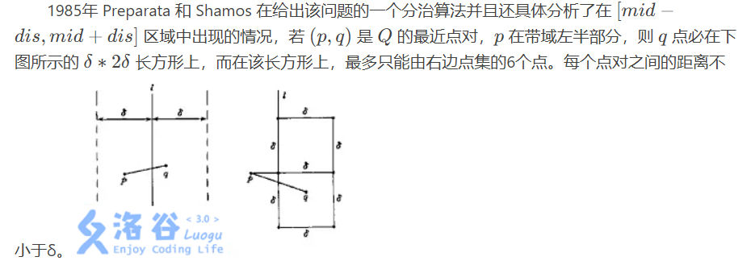

所以我们按照纵坐标排序，对于区间遍历每个点，统计与这个点纵坐标差不超过dis的点去更新答案，显然最多进行6 * n次

总复杂度$O(nlogn)$ 。
（可能会有精度问题）

```cpp
#include<bits/stdc++.h>
using namespace std;
struct point
{
    double x,y;
}p[200010];
int n,temp[200010];
bool cmp(const point &A,const point &B)
{
    if(A.x==B.x)
        return A.y<B.y;
    else
        return A.x<B.x;
}
bool cmps(const int &a,const int &b)
{
    return p[a].y<p[b].y;
}
double distance(int i,int j)
{
    return sqrt((p[i].x-p[j].x)*(p[i].x-p[j].x)+(p[i].y-p[j].y)*(p[i].y-p[j].y));
}
double merge(int left,int right)
{
    double dis=2<<20;
    if(left==right)
        return dis;
    if(left+1==right)
        return distance(left,right);
    int mid=(left+right)>>1;
    double d1=merge(left,mid);
    double d2=merge(mid+1,right);
    dis=min(d1,d2);
    int k=0;
    for(int i=left;i<=right;i++)
        if(fabs(p[i].x-p[mid].x)<=dis)
            temp[k++]=i;
    sort(temp,temp+k,cmps);
    for(int i=0;i<k;i++)
        for(int j=i+1;j<k&&p[temp[j]].y-p[temp[i]].y<dis;j++)
            dis=min(dis,distance(temp[i],temp[j]));
    return dis; 
}
int main()
{
    int n;
    cin>>n;
    for(int i=0;i<n;i++)
        scanf("%lf %lf",&p[i].x,&p[i].y);
    sort(p,p+n,cmp);
    printf("%.4lf\n",merge(0,n-1));
    return 0;
}
```

## 单调栈

单调栈是一种内部元素具有单调性的栈，可以解决“以某个值为最值的最大区间“等问题

洛谷P3467 [POI2008] PLA-Postering
给定若干的按顺序紧密排列的矩形长高h,d，求至少用多少个不重叠自定义长高的矩形不超出的覆盖这些矩形

若两个高相等的矩形中间都比这两个矩形大或相等，则可以减少一个贡献，所以维护单调不递减的栈计算答案。如果栈顶等于当前元素，则减少一个贡献。

```cpp
#include"bits/stdc++.h"
#define endl '\n'
using ll=long long;
using namespace std;
constexpr int N=1e5+10,inf=0X3F3F3F3F;
constexpr ll INF=0X3F3F3F3F3F3F3F3F;
void solve(){
    int n;
    cin>>n;
    int d,h;
    stack<int>s;
    int cnt=0;
    for(int i=1;i<=n;i++){
        cin>>d>>h;
        while(s.size()&&s.top()>h){
            s.pop();
        }
        if(s.size()&&s.top()==h){
            cnt++;
        }
        s.push(h);
    }
    cout<<n-cnt<<endl;
}
signed main(){
    cin.tie(nullptr)->sync_with_stdio(0);
//	int t;cin>>t;while(t--)
    solve();
    return 0;
}
```

### 维护数组往左第一个大于的下标

```cpp
vector<int> lst(n, -1);
vector<int> a(n);
stack<int> st;
for (int i = 0; i < n; i++) {
  while (st.size() and a[st.top()] <= a[i])
	st.pop();
  if (st.size())
	lst[i] = st.top();
  st.push(i);
}
```

### 求网格图里有多少个矩形

给定二维网格图，`*` 代表障碍，问只用 `.` 能构成多少个矩形

解析：
单独考虑第 $i$ 行，对于 $j$ 列维护向上最多有几个连续的 `.` （即向上延申多少），记为 $d_j$ 。维护左侧最近的 **小于**  $d_j$ 的位置，记为 $l_j$ 。维护右侧最近的 **小于等于** $d_j$ 的位置，记为 $r_j$ 。那么这个位置造成的贡献为 $(j-l_j)(r_j-j)d_j$ 。

时间复杂度 $O(nm)$ 。

```cpp
#include "bits/stdc++.h"
#define endl '\n'
// #define TESTS

using namespace std;
using ll = long long;

constexpr int N = 1e5 + 10;
constexpr int inf = 0X3F3F3F3F;
constexpr ll INF = 0X3F3F3F3F3F3F3F3F;

void solve() {
  int n, m;
  cin >> n >> m;
  vector<vector<char>> a(n + 1, vector<char>(m + 1));
  for (int i = 1; i <= n; i++) {
    for (int j = 1; j <= m; j++) {
      cin >> a[i][j];
    }
  }

  vector d(n + 1, vector<int>(m + 1));
  for (int i = 1; i <= n; i++) {
    for (int j = 1; j <= m; j++) {
      if (a[i][j] == '*')
        d[i][j] = 0;
      else
        d[i][j] = d[i - 1][j] + 1;
    }
  }

  ll ans = 0;
  for (int i = 1; i <= n; i++) {
    vector<int> l(m + 1), r(m + 2);
    stack<int> st;
    for (int j = 1; j <= m; j++) {
      while (!st.empty() and d[i][st.top()] >= d[i][j])
        st.pop();
      l[j] = st.empty() ? 0 : st.top();
      st.push(j);
    }
    while (!st.empty())
      st.pop();
    for (int j = m; j >= 1; j--) {
      while (!st.empty() and d[i][st.top()] > d[i][j])
        st.pop();
      r[j] = st.empty() ? m + 1 : st.top();
      st.push(j);
    }
    for (int j = 1; j <= m; j++) {
      int x = j - l[j], y = r[j] - j;
      int h = d[i][j];
      ans += ll(h) * x * y;
    }
  }
  cout << ans << endl;
}

signed main() {
  cin.tie(nullptr)->sync_with_stdio(false);
  int _ = 1;
#ifdef TESTS
  cin >> _;
#endif
  while (_--)
    solve();
  return 0;
}
```

### 求网格图里有多少个面积小于等于k的矩形

有上题的结论后，
设 $x=j-l_j \ , y=r_j-j$ ，不妨假设 $x\le y$ 。
考虑 固定高度 $h=h_j(上题的d_j)$  ，矩形宽度为 $w$ 的方案数 $f(h,w)$ ，有

$$
f(h,w)= \begin{cases} w & ,w \in [1,x] \\ x & ,w \in [x+1,y] \\ x+y-w & ,w \in [y+1,x+y] \\ 0 & ,w > x+y \end{cases}
$$

将其差分后，记为 $f'$ ，有 

$$
f'(h,w)= \begin{cases} 1 & ,w \in [1,x] \\ 0 & ,w \in [x+1,y] \\ -1 & ,w \in [y+1,x+y] \\ 0 & ,w > x+y \end{cases}
$$

那么再次差分，就可以 $O(m)$ 维护 $f'$ 从而维护 $f$ 。

因为对于 $h_j$ 而言，显然 高度小于 $h_j$ 的仍有相同的贡献，即有 $f(h,w) \gets f(h,w)+f(h+1,w)$ 。 

最后将 $h\times w \le k$ 的统计答案即可。

时间复杂度 $O(nm)$ 。

```cpp
#include "bits/stdc++.h"
#define endl '\n'
// #define TESTS

using namespace std;
using ll = long long;

constexpr int N = 1e5 + 10;
constexpr int inf = 0X3F3F3F3F;
constexpr ll INF = 0X3F3F3F3F3F3F3F3F;

void solve() {
  int n, m, k;
  cin >> n >> m >> k;
  vector<vector<char>> a(n + 1, vector<char>(m + 1));
  for (int i = 1; i <= n; i++) {
    for (int j = 1; j <= m; j++) {
      cin >> a[i][j];
    }
  }

  vector d(n + 1, vector<int>(m + 1));
  for (int i = 1; i <= n; i++) {
    for (int j = 1; j <= m; j++) {
      if (a[i][j] == '#')
        d[i][j] = 0;
      else
        d[i][j] = d[i - 1][j] + 1;
    }
  }

  vector b(n + 4, vector<int>(m + 4));
  for (int i = 1; i <= n; i++) {
    vector<int> l(m + 1), r(m + 2);
    stack<int> st;
    for (int j = 1; j <= m; j++) {
      while (!st.empty() and d[i][st.top()] >= d[i][j])
        st.pop();
      l[j] = st.empty() ? 0 : st.top();
      st.push(j);
    }
    while (!st.empty())
      st.pop();
    for (int j = m; j >= 1; j--) {
      while (!st.empty() and d[i][st.top()] > d[i][j])
        st.pop();
      r[j] = st.empty() ? m + 1 : st.top();
      st.push(j);
    }
    for (int j = 1; j <= m; j++) {
      int x = j - l[j], y = r[j] - j;
      int h = d[i][j];
      if (x > y)
        swap(x, y);
      b[h][1]++, b[h][x + 1]--;
      b[h][y + 1]--, b[h][x + y + 1]++;
    }
  }

  ll ans = 0;
  for (int i = n; i >= 1; i--) {
    for (int j = 1; j <= m; j++)
      b[i][j] += b[i][j - 1];
    for (int j = 1; j <= m; j++)
      b[i][j] += b[i][j - 1];
    for (int j = 1; j <= m; j++) {
      b[i][j] += b[i + 1][j];
      if (i * j <= k)
        ans += b[i][j];
    }
  }
  cout << ans << endl;
}

signed main() {
  cin.tie(nullptr)->sync_with_stdio(false);
  int _ = 1;
#ifdef TESTS
  cin >> _;
#endif
  while (_--)
    solve();
  return 0;
}
```

## 单调队列

单调队列是一种内部元素具有单调性的队列，可以解决求“区间最值”等问题。

洛谷P1886 滑动窗口 /【模板】单调队列
有一个长为 n 的序列 a，以及一个大小为 k 的窗口。现在这个从左边开始向右滑动，每次滑动一个单位，求出每次滑动后窗口中的最大值和最小值。

单调队列维护区间最值，队头为所求。队友不在队列的时候脱队首。

```cpp
#include"bits/stdc++.h"
#define endl '\n'
using ll=long long;
using namespace std;
constexpr int N=1e5+10,inf=0X3F3F3F3F;
constexpr ll INF=0X3F3F3F3F3F3F3F3F;
void solve(){
    int n,k;
    cin>>n>>k;
    vector<int>a(n+1);
    deque<int>q1,q2;
    for(int i=1;i<=n;i++)
        cin>>a[i];
    for(int i=1;i<k;i++){
        while(q1.size()&&a[q1.back()]>a[i]){
            // cout<<q1.back()<<endl;
            q1.pop_back();
        }
        q1.push_back(i);
        while(q2.size()&&a[q2.back()]<a[i])
            q2.pop_back();
        q2.push_back(i);
    }
    vector<int>b,c;
    for(int i=k;i<=n;i++){
        while(q1.size()&&a[q1.back()]>a[i])//队列内单调不减1 1 2，队头区间最小
            q1.pop_back();
        q1.push_back(i);
        while(q2.size()&&a[q2.back()]<a[i])//队列内单调不增3 3 2，队头区间最大
            q2.pop_back();
        q2.push_back(i);
        while(q1.size()&&q1.front()<=i-k)
            q1.pop_front();
        while(q2.size()&&q2.front()<=i-k)
            q2.pop_front();
        b.push_back(q1.front());
        c.push_back(q2.front());
    }
    for(auto x:b)
        cout<<a[x]<<' ';
    cout<<endl;
    for(auto x:c)
        cout<<a[x]<<' ';
    cout<<endl;
}
signed main(){
    cin.tie(nullptr)->sync_with_stdio(0);
//	int t;cin>>t;while(t--)
    solve();
    return 0;
}
```

## 二分

### 二分符合条件的第一个数

```cpp
int l=0,r=inf;
while(l<r){
	int mid=l+r>>1;
	if(check(mid))
		r=mid;
	else
		l=mid+1;
}//将r设置为上界+1，l为此值代表都不合法
```

### 二分符合条件的最后一个数

```cpp
int l=0,r=inf;
while(l<r){
	int mid=l+r+1>>1;
	if(check(mid))
		l=mid;
	else
		r=mid-1;
}//将l设置为下界-1，l为此值代表都不合法
```

### 二分找无序序列的中位数

序列为1-index，定义中位数为排序后第 $\lfloor(n+1)/2 \rfloor$ 个数。

```cpp
vector<int>a(n+1);
int l=0,r=inf;
auto check=[&](int x){
	int cnt=0;
	for(int i=1;i<=n;i++){
		if(a[i]<x)
			cnt--;
		else
			cnt++;
	}
	return cnt>0;
};
while(l<r){
	int mid=l+r+1>>1;
	if(check(mid))
		l=mid;
	else
		r=mid-1;
}
```

### wqs二分

wqs二分用来解决**恰好选k个**的问题。通过二分斜率把恰好k个转换成没有限制的问题。

n个物品，选k个物品，最大化收益。可以知道，每次多选一个物品，额外的收益是递减的，也就是最大收益有凸性。

wqs 二分就是利用了凸包斜率单调的性质，**类似**线性规划的求出斜率切在哪个点，直到切到横坐标为k的点且答案最大为止。

wqs二分的核心是证明原问题有凹凸性。

wqs是二分一个斜率m，使得切线正好切得x=k的点，实质上是二分偏移量。

例题：

给你一个无向带权连通图，每条边是黑色或白色。让你求一棵最小权的恰好有need条白色边的生成树。（0白1黑）
数据保证有解。

解析：

使用wqs二分同时使用计算最小生成树。代码选择求最优的x最靠左的点，此时选择的点会小于k，但是ans本质一样，再还原成真正的答案。并且需要优先选黑边来让最后的x尽量靠左，否则答案不对。
注意：如果两条边边权相同，应优先规定好选白色还是黑色。

```cpp
#include"bits/stdc++.h"
#define endl '\n'
using ll=long long;
using namespace std;
constexpr int N=1e5+10;
constexpr int inf=0X3F3F3F3F;
constexpr ll INF=0X3F3F3F3F3F3F3F3F;

struct dsu{
    vector<int>p;
    dsu(int _n):p(_n){
        iota(p.begin(),p.end(),0);
    }
    void init(int n){
        p.resize(n);
        iota(p.begin(),p.end(),0);
    }
    int find(int x){
        return p[x]==x?x:p[x]=find(p[x]);
    }
    bool same(int u,int v){
        return find(u)==find(v);
    }
    bool merge(int u,int v){
        int x=find(u),y=find(v);
        if(x==y)
            return false;
        p[y]=x;
        return true;
    }
};

void solve(){
    int n,m,k;
    cin>>n>>m>>k;
    vector<array<int,3>>edges[2];
    for(int i=0;i<m;i++){
        int u,v,w,c;
        cin>>u>>v>>w>>c;
        edges[c].push_back({w,u,v});
    }
    ranges::sort(edges[0]);
    ranges::sort(edges[1]);
    
    dsu d(n);
    ll ans=0;
    auto check=[&](int x){
        d.init(n);
        ans=0;
        int i=0,j=0,l0=edges[0].size(),l1=edges[1].size();
        int cnt=0;
        while(i<l0&&j<l1){
            auto [w0,u0,v0]=edges[0][i];
            auto [w1,u1,v1]=edges[1][j];
            if(d.same(u0,v0)){
                i++;
                continue;
            }
            if(d.same(u1,v1)){
                j++;
                continue;
            }
            if(w0-x<w1){
                d.merge(u0,v0);
                i++;
                cnt++;
                ans+=w0-x;
            }else{
                d.merge(u1,v1);
                j++;
                ans+=w1;
            }
        }
        for(;i<l0;i++){
            auto [w,u,v]=edges[0][i];
            if(d.same(u,v))
                continue;
            cnt++;
            ans+=w-x;
            d.merge(u,v);
        }
        for(;j<l1;j++){
            auto [w,u,v]=edges[1][j];
            if(d.same(u,v))
                continue;
            ans+=w;
            d.merge(u,v);
        }
        return cnt<=k;
    };
    int l=-100,r=100;
    while(l<r){
        int mid=l+r+1>>1;
        if(check(mid))
            l=mid;
        else
            r=mid-1;
    }
    check(l);
    ans+=k*l;
    cout<<ans<<endl;
}
signed main(){
    cin.tie(nullptr)->sync_with_stdio(false);
    solve();
    return 0;
}
```

## 三分

三分必须保证最多有一个峰（谷），而且（以单峰为例）左边必须单调递增，右边必须单调递减，不能出现最高点左边有两个位置函数值相等的情况。

### 整数

单峰函数求最小

```cpp
ll l=0,r=1'000'000'000;
while(r-l>2){
    ll mid1=l+(r-l)/3;
    ll mid2=r-(r-l)/3;
    if(f(mid1)<f(mid2))
        r=mid2;
    else
        l=mid1;
}
// ll ans=2*INF;
// for(int i=l;i<=r;i++)
//     ans=min(ans,f(i));
```

```cpp
int le=-1e9,ri=1e9;
while(le<ri){
	int mid=le+ri>>1;
	if(f(mid)<f(mid+1))
		ri=mid;
	else
		le=mid+1;
}
//cout<<f(le)<<endl;
```

单峰函数求最大

```cpp
ll l=0,r=1'000'000'000;
while(r-l>2){
}
```

### 浮点数

```cpp
while (r - l > eps) {//求极小值
  mid = (l + r) / 2;
  lmid = mid - eps;
  rmid = mid + eps;
  if (f(lmid) < f(rmid))
    r = mid;
  else
    l = mid;
}
```

## 快速幕模板

```cpp
ll qpow(ll a,ll b,ll p){
    ll res=1;
    a%=p;
    for(;b;b>>=1){
		if(b&1)
			res=res*a%p;
		a=a*a%p;
	}
    return res;
}
```

## 龟速乘模板

```cpp
ll mul(ll a,ll b,ll p){
    ll res=0;
    a%=p;
    for(;b;b>>=1){
		if(b&1)
			res=(res+a)%p;
		a=(a+a)%p;
	}
    return res;
}
```

## 快速乘（O1）

可以处理相乘ll的乘法
```cpp
ll mul(ll x,ll y,ll p){
	ll z=(long double)x/p*y;
	ll res=(ull)x*y-(ull)z*p;
	return (res+p)%p;
}
```
不能处理相乘爆ll的乘法
```cpp
ll mul(ll x, ll y, ll P){
    ll L=x*(y>>25)%P*(1<<25)%P;
    ll R=x*(y&((1<<25)-1))%P;
    return (L+R)%P;
}
```

## 前缀和与差分

### 二维前缀和

#### 原理

求区域(x1,y1)到(x2,y2)的和,为
`sum=s[x2][y2]-s[x1-1][y2]-s[x2][y1-1]+s[x1-1][y1-1]`

#### 构建

`s[i][j]=s[i-1][j]+s[i][j-1]-s[i-1][j-1]+a[i][j]`

### 二维差分

差分相当于前缀和的逆运算,改变下标为i的差分数组的值会影响到i之后(包括i)所有数组的值.查询需要遍历差分数组求前缀和,即为原数组

- 定义新数组求前缀和,求出原数组
`a[i][j]=a[i-1][j]+a[i][j-1]-a[i-1][j-1]+b[i][j]`
- 改变差分数组求前缀和,求出原数组
`b[i][j]+=b[i-1][j]+b[i][j-1]-b[i-1][j-1]`

#### 建立与修改

建立就相当于只包括一个点的修改;
以下为**修改**代码
```cpp
void insert(int x1,int y1,int x2,int y2,int c){
	b[x1][y1]+=c;
	b[x2+1][y1]-=c;
	b[x1][y2+1]-=c;
	b[x2+1][y2+1]+=c;
}
```
**建立**操作:
`insert(i,j,i,j,a[i][j])`

### 三维前缀和

```cpp
for(int i=1;i<=n;i++){
    for(int j=1;j<=n;j++){
        for(int k=1;k<=n;k++){
            s[i][j][k]=s[i-1][j][k]+s[i][j-1][k]+s[i][j][k-1] \
            -s[i][j-1][k-1]-s[i-1][j][k-1]-s[i-1][j-1][k] \
            +s[i-1][j-1][k-1] \
            +a[i][j][k];
        }
    }
}
```

# 排序

## 归并排序

```cpp
for(int i=mid+1,j=l,k=l;i<=r;i++){
	while(j<=mid&&a[j].x<a[i].x){
		tmp[k++]=a[j];
		j++;
	}
	tmp[k++]=a[i];
	if(i==r){
		while(j<=mid){
			tmp[k++]=a[j];
			j++;
		}
	}
}
for(int i=l;i<=r;i++)
	a[i]=tmp[i];
```

## 归并排序求逆序对

```cpp
constexpr int N=2e6+10,mod=1e9+7;
int a[N],b[N],ans=0;//a[N]排序数组，b[N]辅助数组 ans=逆序对数
void magesort(int l,int r){
    if(l==r) return;
    int mid=(l+r)/2;
    magesort(l,mid);
    magesort(mid+1,r);
    int i=l,j=mid+1,k=l;
    for( ;i<=mid&&j<=r; ){
        if(a[i]>a[j])    b[k]=a[j],    j++, ans+=mid-i+1;
        else    b[k]=a[i],i++;
        k++;
    }
    while(i<=mid) b[k++]=a[i++];
    while(j<=r)    b[k++]=a[j++];
    for(int op=l;op<=r;op++) a[op]=b[op],b[op]=0;
}

```

# 字符串

## 杂

## 子序列查找

```cpp
int n,nex[N][26];//n字符串长度 nex[i][j] 从i开始第一个字符j出现的位置
string s;
void init(){
    for(int i=n+1;i>=1;i--){
        for(int j=0;j<=25;j++){
            if(i==n+1) nex[i][j]=n+1;
            else nex[i][j]=nex[i+1][j];
        }
        nex[i][s[i]-'A']=i;
    }
}
int find(int x,string ss){//找到字符串s中从第x个位置开始，出现的第一个子序列ss出现的位置
    int first=1;
    for(auto i:ss){
        if(first) x=nex[x][i-'A'];
        else    x=nex[x+1][i-'A'];
        first=0;
        if(x==n+1) return x;
    }
    return x;
}

```

## 最小表示法

时间复杂度 $O(n)$ 

### 模板（字符串）

```cpp
// smallest_cyclic_string
string min_cyclic_string(string s) {
  s += s;
  int n = s.size();
  int i = 0, ans = 0;
  while (i < n / 2) {
    ans = i;
    int j = i + 1, k = i;
    while (j < n && s[k] <= s[j]) {
      if (s[k] < s[j])
        k = i;
      else
        k++;
      j++;
    }
    while (i <= k) i += j - k;
  }
  return s.substr(ans, n / 2);
}
```

### 序列最小表示法

```cpp
vector<int> getmin(vector<int>s){
	int si=s.size();
	for(int i=0;i<si;i++){
		s.push_back(s[i]);
	}
	int i=0,j=1,k=0;
	while(i<si&&j<si){
		for(k=0;k<si-1&&s[i+k]==s[j+k];k++);
		s[i+k]>s[j+k]?i=i+k+1 : j=j+k+1;
		if(i==j) j++;
	}
	vector<int>op;
	for(int v=min(i,j);v<min(i,j)+si;v++){
		op.push_back(s[v]);
	}
	return op;
}
```

## kmp算法

给定一个长度为 $n$ 的字符串 $s$，其 **前缀函数** 被定义为一个长度为 $n$ 的数组 $\pi$。
其中 $\pi[i]$ 的定义是：

1.  如果子串 $s[0\dots i]$ 有一对相等的真前缀与真后缀：$s[0\dots k-1]$ 和 $s[i - (k - 1) \dots i]$，那么 $\pi[i]$ 就是这个相等的真前缀（或者真后缀，因为它们相等）的长度，也就是 $\pi[i]=k$；
2.  如果不止有一对相等的，那么 $\pi[i]$ 就是其中最长的那一对的长度；
3.  如果没有相等的，那么 $\pi[i]=0$。

简单来说 $\pi[i]$ 就是，子串 $s[0\dots i]$ 最长的相等的真前缀与真后缀的长度。

用数学语言描述如下：

$$
\pi[i] = \max_{k = 0 \dots i}\{k: s[0 \dots k - 1] = s[i - (k - 1) \dots i]\}
$$

特别地，规定 $\pi[0]=0$。

```cpp
vector<int> getpi(string &s){//0index
    int n=s.size();
    vector<int>pi(n);
    for(int i=1;i<n;i++){
        int j=pi[i-1];
        while(j>0&&s[i]!=s[j])
            j=pi[j-1];
        if(s[i]==s[j])
            j++;
        pi[i]=j;
    }
    return pi;//0index
}
```

在字符串中查找子串：Knuth–Morris–Pratt 算法

该算法由 Knuth、Pratt 和 Morris 在 1977 年共同发布。

该任务是前缀函数的一个典型应用。

给定一个文本 $t$ 和一个字符串 $s$，我们尝试找到并展示 $s$ 在 $t$ 中的所有出现（occurrence）。

为了简便起见，我们用 $n$ 表示字符串 $s$ 的长度，用 $m$ 表示文本 $t$ 的长度。

我们构造一个字符串 $s + \# + t$，其中 $\#$ 为一个既不出现在 $s$ 中也不出现在 $t$ 中的分隔符。接下来计算该字符串的前缀函数。现在考虑该前缀函数除去最开始 $n + 1$ 个值（即属于字符串 $s$ 和分隔符的函数值）后其余函数值的意义。根据定义，$\pi[i]$ 为右端点在 $i$ 且同时为一个前缀的最长真子串的长度，具体到我们的这种情况下，其值为与 $s$ 的前缀相同且右端点位于 $i$ 的最长子串的长度。由于分隔符的存在，该长度不可能超过 $n$。而如果等式 $\pi[i] = n$ 成立，则意味着 $s$ 完整出现在该位置（即其右端点位于位置 $i$）。注意该位置的下标是对字符串 $s + \# + t$ 而言的。

因此如果在某一位置 $i$ 有 $\pi[i] = n$ 成立，则字符串 $s$ 在字符串 $t$ 的 $i - (n - 1) - (n + 1) = i - 2n$ 处出现。

正如在前缀函数的计算中已经提到的那样，如果我们知道前缀函数的值永远不超过一特定值，那么我们不需要存储整个字符串以及整个前缀函数，而只需要二者开头的一部分。在我们这种情况下这意味着只需要存储字符串 $s + \#$ 以及相应的前缀函数值即可。我们可以一次读入字符串 $t$ 的一个字符并计算当前位置的前缀函数值。

因此 Knuth–Morris–Pratt 算法（简称 KMP 算法）用 $O(n + m)$ 的时间以及 $O(n)$ 的内存解决了该问题。

```cpp
vector<int> find_occurrences(string text, string pattern) {
  string cur = pattern + '#' + text;
  int sz1 = text.size(), sz2 = pattern.size();
  vector<int> v;
  vector<int> lps = prefix_function(cur);
  for (int i = sz2 + 1; i <= sz1 + sz2; i++) {
	if (lps[i] == sz2) v.push_back(i - 2 * sz2);
  }
  return v;
}
```

实例
[KMP字符串匹配【模板】](https://ac.nowcoder.com/acm/problem/232778)
给出两个只含大写英文字母的字符串 s1s_1s1 和 s2s_2s2，若 s1s1s1 的区间[l,r][l,r][l,r]子串与 s2s_2s2 完全相同，则称s2s_2s2在 s1s_1s1 中出现了，其出现位置为lll。
现在请你求出 s2s_2s2在 s1s_1s1 中所有出现的位置。
定义一个字符串 sss 的 border 为 sss 的一个**非**sss**本身**的子串ttt，满足 ttt 既是 sss 的前缀，又是 sss 的后缀。
对于 s2s_2s2，你还需要求出对于其每个前缀 s′s's′ 的最长 border t′t't′ 的长度。  
```cpp
#include<bits/stdc++.h>
using namespace std;
#define ll long long
#define ull unsigned ll
#define endl '\n'
constexpr ll mod=1e9+7,N=1e6+10;
constexpr ull P=31;
void solve();

int main(){
	ios::sync_with_stdio(0),cin.tie(0),cout.tie(0);
//	int t=1;cin>>t;while(t--)
	solve();
	return 0;
}

string s,p;
int nx[N];

void gnx(string p,int len){//传入0index返回1index
	nx[0]=nx[1]=0;
	for(int i=1;i<len;i++){
		int j=nx[i];
		while(j&&p[i]!=p[j])
			j=nx[j];
		if(p[i]==p[j])
			nx[i+1]=j+1;
		else
			nx[i+1]=0;
	}
}

void solve(){
	cin>>s>>p;
	int pl=p.size(),sl=s.size();
	gnx(p,pl);
	int j=0;
	for(int i=0;i<sl;i++){
		while(j&&s[i]!=p[j])
			j=nx[j];
		if(s[i]==p[j])
			j++;
		if(j==pl){
			cout<<i-pl+2<<endl;
		}
	}
	for(int i=0;i<pl;i++)
		cout<<nx[i+1]<<' ';
}
```

### 求s1后缀和s2前缀最大相同长度

时间复杂度 $O(n)$ 

```cpp
vector<int> prefix_function(string s) {//0index
    int n = (int)s.length();
    vector<int> pi(n);
    for (int i = 1; i < n; i++) {
        int j = pi[i - 1];
        while (j > 0 && s[i] != s[j]) j = pi[j - 1];
        if (s[i] == s[j]) j++;
        pi[i] = j;
    }
    return pi;//0index
}
int func(string s1,string s2){//传入s1 s2 0index
    vector<int>p1=prefix_function(s2);
    int j=0;
    for(int i=0;i<s1.size();i++){
        while(j>0&&s1[i]!=s2[j])
            j=p1[j-1];
        if(s1[i]==s2[j])
            j++;
        if(j==s2.size())//s2与s1的子串相同
            return -1;
    }
    return j;
}
```


### 求解每个前缀子串不重叠的公共前后缀数量

求一个 num 数组一一对于字符串 S 的前 i 个字符构成的子串，既是它的后缀同时又是它的前缀，并且该后缀与该前缀不重叠，将这种字符串的数量记作 num[i]。

例如 S 为 aaaaa，则 num[4]=2。这是因为S的前 4 个字符为 aaaa，其中 a 和 aa 都满足性质‘既是后缀又是前缀’，同时保证这个后缀与这个前缀不重叠。而 aaa 虽然满足性质‘既是后缀又是前缀’，但遗憾的是这个后缀与这个前缀重叠了，所以不能计算在内。同理，num[1]=0,num[2]=num[3]=1,num[5]=2。”

求num数组。

特别地，为了避免大量的输出，你不需要输出 num[i] 分别是多少，你只需要输出所有 (num[i]+1) 的乘积，对 1e9+7 取模的结果即可。

```cpp
#include"bits/stdc++.h"
#define endl '\n'
using ll=long long;
using namespace std;
constexpr int N=1e5+10,inf=0X3F3F3F3F,mod=1e9+7;
constexpr ll INF=0X3F3F3F3F3F3F3F3F;
void solve(){
    string s;
    cin>>s;
    int n=s.size();
    vector<int>pi(n+1),num(n+1);
    s=' '+s;
    num[1]=1;
    for(int i=2,j=0;i<=n;i++){//1index的next数组
        while(j&&s[i]!=s[j+1])
            j=pi[j];
        j+=(s[i]==s[j+1]);
        pi[i]=j;
        num[i]=num[j]+1;//统计当前为i的公共前后缀数量
    }
    ll ans=1;
    for(int i=2,j=0;i<=n;i++){
        while(j&&s[i]!=s[j+1])
            j=pi[j];
        j+=(s[i]==s[j+1]);
        while(j*2>i)
            j=pi[j];//如果找到公共前后缀长度j的满足条件，则比j短的也满足
        //那么i点对应的不重叠的公共前后缀数量是num[j]
        ans=ans*(num[j]+1)%mod;
    }
    cout<<ans<<endl;
}
signed main(){
    cin.tie(nullptr)->sync_with_stdio(false);
	int t;cin>>t;while(t--)
    solve();
    return 0;
}
```

## Z函数（扩展kmp）

对于一个长度为 $n$ 的字符串 $s$，定义函数 $z[i]$ 表示 $s$ 和 $s[i,n-1]$（即以 $s[i]$ 开头的后缀）的最长公共前缀（LCP）的长度，则 $z$ 被称为 $s$ 的 **Z 函数**。特别地，$z[0] = 0$。

国外一般将计算该数组的算法称为 **Z Algorithm**，而国内则称其为 **扩展 KMP**。

### 模板

时间复杂度 $O(n)$ 

```cpp
vector<int>zfunc(const string &s){//求出Z函数,(0-index)
    int n=s.size();
    vector<int>z(n);
    for(int i=1,l=0,r=0;i<n;i++){
        if(i<=r&&z[i-l]<r-i+1)
            z[i]=z[i-l];
        else{
            z[i]=max(0,r-i+1);
            while(i+z[i]<n&&s[z[i]]==s[i+z[i]])
                z[i]++;
        }
        if(i+z[i]-1>r)
            l=i,r=i+z[i]-1;
    }
    return z;
}
```

### 匹配所有子串

为了避免混淆，我们将 $t$ 称作 **文本**，将 $p$ 称作 **模式**。所给出的问题是：寻找在文本 $t$ 中模式 $p$ 的所有出现（occurrence）。

为了解决该问题，我们构造一个新的字符串 $s = p + \diamond + t$，也即我们将 $p$ 和 $t$ 连接在一起，但是在中间放置了一个分割字符 $\diamond$（我们将如此选取 $\diamond$ 使得其必定不出现在 $p$ 和 $t$ 中）。

首先计算 $s$ 的 Z 函数。接下来，对于在区间 $[0,|t| - 1]$ 中的任意 $i$，我们考虑以 $t[i]$ 为开头的后缀在 $s$ 中的 Z 函数值 $k = z[i + |p| + 1]$。如果 $k = |p|$，那么我们知道有一个 $p$ 的出现位于 $t$ 的第 $i$ 个位置，否则没有 $p$ 的出现位于 $t$ 的第 $i$ 个位置。

其时间复杂度（同时也是其空间复杂度）为 $O(|t| + |p|)$。

例题：给定一行模式串p，给定多行文本串，每次输出三个数，第几个文本串，文本串被匹配的左端点，文本串被匹配的右端点

```cpp
#include"bits/stdc++.h"
#define endl '\n'
using ll=long long;
using namespace std;
constexpr int N=1e5+10,inf=0X3F3F3F3F;
constexpr ll INF=0X3F3F3F3F3F3F3F3F;
vector<int>zfunc(string &s){//求出Z函数,(0-index)
    int n=s.size();
    vector<int>z(n);
    for(int i=1,l=0,r=0;i<n;i++){
        if(i<=r&&z[i-l]<r-i+1)
            z[i]=z[i-l];
        else{
            z[i]=max(0,r-i+1);
            while(i+z[i]<n&&s[z[i]]==s[i+z[i]])
                z[i]++;
        }
        if(i+z[i]-1>r)
            l=i,r=i+z[i]-1;
    }
    return z;
}
void solve(){
    string t,p;
    getline(cin,p);
    // string cur;
    int tot=0;
    while(getline(cin,t)){
        tot++;
        string s=p+'_'+t;
        vector<int>z=zfunc(s);
        for(int i=0;i<t.size();i++){
            if(z[i+p.size()+1]==p.size()){
                // tot++;
                cout<<tot<<' '<<i+1<<' '<<i+p.size()<<endl;
            }
        }

    }
    //     t+=cur;
    // cout<<t<<endl;
    
}
signed main(){
    cin.tie(nullptr)->sync_with_stdio(0);
//	int t;cin>>t;while(t--)
    solve();
    return 0;
}
```

### 字符串整周期

给定一个长度为 $n$ 的字符串 $s$，找到其最短的整周期，即寻找一个最短的字符串 $t$，使得 $s$ 可以被若干个 $t$ 拼接而成的字符串表示。

考虑计算 $s$ 的 Z 函数，则其整周期的长度为最小的 $n$ 的因数 $i$，满足 $i+z[i]=n$。

```cpp
#include"bits/stdc++.h"
#define endl '\n'
using ll=long long;
using namespace std;
constexpr int N=1e5+10,inf=0X3F3F3F3F;
constexpr ll INF=0X3F3F3F3F3F3F3F3F;
vector<int>zfunc(string &s){//求出Z函数,(0-index)
    int n=s.size();
    vector<int>z(n);
    for(int i=1,l=0,r=0;i<n;i++){
        if(i<=r&&z[i-l]<r-i+1)
            z[i]=z[i-l];
        else{
            z[i]=max(0,r-i+1);
            while(i+z[i]<n&&s[z[i]]==s[i+z[i]])
                z[i]++;
        }
        if(i+z[i]-1>r)
            l=i,r=i+z[i]-1;
    }
    return z;
}
void solve(){
    string s;
    cin>>s;
    int n=s.size();
    vector<int>z=zfunc(s);
    int ans=n;
    // cout<<z[3]<<endl;
    for(int i=1;i<=n/i;i++){
        if(n%i==0){
            if(i+z[i]==n)
                ans=min(ans,i);
            if(n/i+z[n/i]==n)
                ans=min(ans,n/i);
        }
    }
    cout<<ans<<endl;
}
signed main(){
    cin.tie(nullptr)->sync_with_stdio(0);
//	int t;cin>>t;while(t--)
    solve();
    return 0;
}
```

## manacher算法

给定字符串s求子回文串的长度
```cpp
vector<int> manacher(string s){//会生成形如&.A.B.A.!的t串，给出p,p[i]-1为回文串长度
    string t="&.";
    for(auto c:s){
        t+=c;
        t+='.';
    }
    t+='!';
    int n=t.size();
    vector<int>p(n);
    int r=0,c=0;
    for(int i=1;i<n-1;i++){
        if(i<r)
            p[i]=min(p[c*2-i],p[c]+c-i);
        else
            p[i]=1;
        while(t[i-p[i]]==t[i+p[i]])
            p[i]++;
        if(p[i]+i>r){
            c=i;
            r=p[i]+i;
        }
    }
    return p;
}
```

##  Lyndon 分解

Lyndon 串：对于字符串 $s$，如果 $s$ 的字典序严格小于 $s$ 的所有后缀的字典序，我们称 $s$ 是简单串，或者 **Lyndon 串**。举一些例子，`a`,`b`,`ab`,`aab`,`abb`,`ababb`,`abcd` 都是 Lyndon 串。当且仅当 $s$ 的字典序严格小于它的所有非平凡的（非平凡：非空且不同于自身）循环同构串时，$s$ 才是 Lyndon 串。

Lyndon 分解：串 $s$ 的 Lyndon 分解记为 $s=w_1w_2\cdots w_k$，其中所有 $w_i$ 为简单串，并且他们的字典序按照非严格单减排序，即 $w_1\ge w_2\ge\cdots\ge w_k$。可以发现，这样的分解存在且唯一。

### Duval算法（Lyndon 分解）

时间复杂度 $O(n)$ 

```cpp
vector<string> duval(const string &s){//(0-index)
    int n=s.size(),i=0;
    vector<string>tmp;
    while(i<n){
        int j=i+1,k=i;
        while(j<n&&s[k]<=s[j]){
            if(s[k]<s[j])
                k=i;
            else
                k++;
            j++;
        }
        while(i<=k){
            tmp.push_back(s.substr(i,j-k));
            i+=j-k;
        }
    }
    return tmp;
}
```

### 最小表示法

时间复杂度 $O(n)$ 

```cpp
string min_cyclic_string(string s){//0-index
    s+=s;
    int n=s.size();
    int i=0,ans=0;
    while(i<n/2){
        ans=i;
        int j=i+1,k=i;
        while(j<n&&s[k]<=s[j]){
            if(s[k]<s[j])
                k = i;
            else
                k++;
            j++;
        }
        while(i<=k)
            i+=j-k;
    }
    return s.substr(ans,n/2);
}
```

## 字符串哈希

千万不要对0进行哈希（s[i]-'a'），对char类型哈希即可。对零哈希无法分辨：a，aa，aaa等等，有a哈希值就会永远是0。

### 科学哈希

详见[一种比较科学的字符串哈希实现方法](https://zhuanlan.zhihu.com/p/784510655)


```cpp
using ULL = unsigned long long;
const int maxn = 1e6 + 5;
static const ULL mod = (1ull << 61) - 1;
ULL power[maxn];
mt19937_64 rnd(chrono::steady_clock::now().time_since_epoch().count());
uniform_int_distribution<ULL> dist(mod / 2, mod - 1);
const ULL base = dist(rnd);

static inline ULL add(ULL a, ULL b){
    a += b;
    if (a >= mod) a -= mod;
    return a;
}

static inline ULL mul(ULL a, ULL b){
    __uint128_t c = __uint128_t(a) * b;
    return add(c >> 61, c & mod);
}

ULL merge(ULL h1, ULL h2, int len2){
    return add(mul(h1, power[len2]), h2);
}

void init(){
    power[0] = 1;
    for(int i = 1; i < maxn; i++)
        power[i] = mul(power[i - 1], base);
}

ULL query(const vector<ULL> &s, int l, int r){
    return add(s[r], mod - mul(s[l - 1], power[r - l + 1]));
}

vector<ULL> build(const string &s){
    int sz = s.size();
    vector<ULL> hashed(sz + 1);
    for (int i = 0; i < sz; i++){
        hashed[i + 1] = add(mul(hashed[i], base), s[i]);
    }
    return hashed;
}

template <typename T>
vector<ULL> build(const vector<T> &s){
    int sz = s.size();
    vector<ULL> hashed(sz + 1);
    for (int i = 0; i < sz; i++){
        hashed[i + 1] = add(mul(hashed[i], base), s[i]);
    }
    return hashed;
}

int lcp(const vector<ULL> &a, int l1, int r1, const vector<ULL> &b, int l2, int r2){
    int len = min(r1 - l1 + 1, r2 - l2 + 1);
    int l = 0, r = len;
    while(l < r){
        int mid = (l + r + 1) / 2;
        if (query(a, l1, l1 + mid - 1) == query(b, l2, l2 + mid - 1)) l = mid;
        else r = mid - 1;
    }
    return r;
}
```


### 自然溢出哈希

[白兔的字符串](https://ac.nowcoder.com/acm/problem/15253)
 链接：[https://ac.nowcoder.com/acm/problem/15253](https://ac.nowcoder.com/acm/problem/15253)
来源：牛客网
白兔有一个字符串T。白云有若干个字符串S1,S2..Sn。 
白兔想知道，对于白云的每一个字符串，它有多少个子串是和T循环同构的。 
提示：对于一个字符串a，每次把a的第一个字符移动到最后一个，如果操作若干次后能够得到字符串b，则a和b循环同构。 
所有字符都是小写英文字母
```cpp
#include<bits/stdc++.h>
using namespace std;
#define ll long long
#define ull unsigned ll
#define endl '\n'
constexpr ll mod=1e9+7,N=1e6+10,P=31;
void solve();

int main(){
    ios::sync_with_stdio(0),cin.tie(0),cout.tie(0);
//    int t=1;cin>>t;while(t--)
    solve();
    return 0;
}
ull p[N],h[N];
ull find(int l,int r){
    return h[r]-h[l-1]*p[r-l+1];
}
unordered_map<ull,int>r;
void solve(){
    p[0]=1;
    for(int i=1;i<=1e6;i++)
        p[i]=p[i-1]*P;

    string s;
    cin>>s;
    string ss=' '+s+s;
    int l1=2*s.size();
    for(int i=1;i<=l1;i++)
        h[i]=h[i-1]*P+ss[i];
    l1/=2;
    for(int i=1;i<=l1;i++)
        r[find(i,i+l1-1)]++;

    int n;
    cin>>n;
    while(n--){
        int co=0;
        cin>>s;
        int l2=s.size();
        ss=' '+s;
        for(int i=1;i<=l2;i++)
            h[i]=h[i-1]*P+ss[i];    
        for(int i=1;i<=l2-l1+1;i++)
            if(r[find(i,i+l1-1)])
                co++;
        cout<<co<<endl;
    }
}
```

### 双哈希

```cpp
typedef array<int,2> hx;
constexpr ll mod1=1e9+7,mod2=99999989;
hx operator+(hx a,hx b){
	hx c={a[0]+b[0],a[1]+b[1]};
	if(c[0]>=mod1)
		c[0]-=mod1;
	if(c[1]>=mod2)
		c[1]-=mod2;
	return c;
}
hx operator-(hx a,hx b){
	hx c={a[0]-b[0],a[1]-b[1]};
	if(c[0]<0)
		c[0]+=mod1;
	if(c[1]<0)
		c[1]+=mod2;
	return c;
}
hx operator*(hx a,hx b){
	return {int(1ll*a[0]*b[0]%mod1),int(1ll*a[1]*b[1]%mod2)};
}
hx operator*(hx a,int b){
    return {int(1ll*a[0]*b%mod1),int(1ll*a[1]*b%mod2)};
}
hx base={131,233},pw[N];
hx get(int l,int r,hx *s){
    return s[r]-s[l-1]*pw[r-l+1];
}
hx get(int l,int r,vector<hx> &s){
    return s[r]-s[l-1]*pw[r-l+1];
}
vector<hx> makev(string &s){
    vector<hx>v(s.size()+1);
    for(int i=0;i<s.size();i++)
        v[i+1]=v[i]*base+hx{s[i],s[i]};
    return v;
}
hx make(string &s){
    hx v={0,0};
    for(auto c:s)
        v=v*base+hx{c,c};
    return v;
}
void init(){
	pw[0]={1,1};
	for(int i=1;i<N;i++)
		pw[i]=pw[i-1]*base;
}
```
[P3370 【模板】字符串哈希](https://www.luogu.com.cn/problem/P3370)
如题，给定 _N_ 个字符串（第 _i_ 个字符串长度为_Mi_，字符串内包含数字、大小写字母，大小写敏感），请求出 _N_ 个字符串中共有多少个不同的字符串。
```cpp
#include"bits/stdc++.h"
#define ll long long
#define endl '\n'
using namespace std;
constexpr int N=1e3+10;

typedef array<int,2> hx;
constexpr ll mod1=1e9+7,mod2=99999989;
hx operator+(hx a,hx b){
	hx c={a[0]+b[0],a[1]+b[1]};
	if(c[0]>=mod1)
		c[0]-=mod1;
	if(c[1]>=mod2)
		c[1]-=mod2;
	return c;
}
hx operator-(hx a,hx b){
	hx c={a[0]-b[0],a[1]-b[1]};
	if(c[0]<0)
		c[0]+=mod1;
	if(c[1]<0)
		c[1]+=mod2;
	return c;
}
hx operator*(hx a,hx b){
	return {int(1ll*a[0]*b[0]%mod1),int(1ll*a[1]*b[1]%mod2)};
}
hx operator*(hx a,int b){
    return {int(1ll*a[0]*b%mod1),int(1ll*a[1]*b%mod2)};
}
hx base={131,233},pw[N];
hx get(int l,int r,hx s[]){
    return s[r]-s[l-1]*pw[r-l+1];
}

signed main(){
	cin.tie(nullptr)->sync_with_stdio(0);
    pw[0]={1,1};
    for(int i=1;i<N;i++)
        pw[i]=pw[i-1]*base;
	int n;
    cin>>n;
    set<hx>se;
    while(n--){
        string s;
        cin>>s;
        int sz=s.size();
        s=' '+s;
        hx t={0,0};
        for(int i=1;i<=sz;i++)
            t=t*base+hx({s[i],s[i]});
        se.insert(t);
    }
    cout<<se.size();
	return 0;
}
```

### 二维哈希

```cpp
// #include"bits/stdc++.h"
#define ll long long
#define ull unsigned ll
#define endl '\n'
using namespace std;
constexpr int N=1e3+10,inf=0X3F3F3F3F,base1=131,base2=233;
constexpr ll INF=0X3F3F3F3F3F3F3F3F;
char mp[N][N];
ull h[N][N],p1[N],p2[N];
ull gethash(int x1,int y1,int x2,int y2){
    return h[x2][y2]-h[x2][y1-1]*p1[y2-y1+1]\
    -h[x1-1][y2]*p2[x2-x1+1]\
    +h[x1-1][y1-1]*p1[y2-y1+1]*p2[x2-x1+1];
}
void init(int n,int m){
    p1[0]=p2[0]=1;
    for(int i=1;i<=max(n,m);i++){
        p1[i]=p1[i-1]*base1;
        p2[i]=p2[i-1]*base2;
    }
    for(int i=1;i<=n;i++){
        for(int j=1;j<=m;j++){
            h[i][j]=h[i][j-1]*base1+mp[i][j];
        }
    }
    for(int i=1;i<=n;i++){
        for(int j=1;j<=m;j++){
            h[i][j]+=h[i-1][j]*base2;
        }
    }
}
```

## Trie树

### 字典树

问题陈述
对于字符串 $x$ 和 $y$ ，请按如下方式定义 $f(x, y)$ ：

- $f(x, y)$ 是 $x$ 和 $y$ 的最长公共前缀的长度。

您将得到由小写英文字母组成的 $N$ 字符串 $(S_1, \ldots, S_N)$ 。求以下表达式的值：$\displaystyle \sum_{i=1}^{N-1}\sum_{j=i+1}^N f(S_i,S_j)$ .
```cpp
#include"bits/stdc++.h"
#define ll long long
#define endl '\n'
using namespace std;
constexpr int N=3e5+10,inf=0X3F3F3F3F;
constexpr ll INF=0X3F3F3F3F3F3F3F3F;
struct node{
    bool repeat;
    int son[26];
    int num;
    bool isend;
}t[N];
int cnt=1;
void insert(string s){
    int now=0;
    for(int i=0;i<s.size();i++){
        int v=s[i]-'a';
        if(t[now].son[v]==0)
            t[now].son[v]=cnt++;
        now=t[now].son[v];
        t[now].num++;
        if(i==s.size()-1)
            t[now].isend=true;
    }
}
int find(string s){
    ll tot=0;
    int now=0;
    for(int i=0;i<s.size();i++){
        int v=s[i]-'a';
        if(t[now].son[v]==0)
            break;
        now=t[now].son[v];
        tot+=t[now].num-1;
    }
    return tot;
}
void solve(){
    int n;
    cin>>n;
    vector<string>s(n+1);
    ll ans=0;
    for(int i=1;i<=n;i++){
        cin>>s[i];
        insert(s[i]);
        ans+=find(s[i]);
    }
    cout<<ans<<endl;
}
signed main(){
    cin.tie(nullptr)->sync_with_stdio(0);
//  int t;cin>>t;while(t--)
    solve();
    return 0;
}
```

### 利用01tire求最大异或和

在a1~an中，求任意两个数的最大异或（构建前缀和数组转换就好）
```cpp
#include <bits/stdc++.h>
using namespace std;
const int N = 3e6 + 10;
int a[N];
int tr[N][2], id;
void insert(int x)
{
    int p = 0; //根节点
    for (int i = 30; i >= 0; i--)//将a[i]的二进制数建树
    {
        int u = x >> i & 1;
        if (!tr[p][u])
            tr[p][u] = ++id;//如果插入中发现没有该子节点,开出这条路
        p = tr[p][u];//指针指向下一层
    }
}
int sh(int x)
{
    int res = 0;//返回十进制数，二进制下为1则需要×2+1，否则x2
    int p = 0;
    for (int i = 30; i >= 0; i--)///从最大位开始找
    {
        int u = x >> i & 1;
        if (tr[p][!u])//存在与x对应位不同的数二进制下为1
        {
            res = res * 2 + 1;
            p = tr[p][!u];
        }
        else
        {
            res = res * 2;
            p = tr[p][u];
        }
    }
    return res;
}
int main()
{
    int n;
    cin >> n;
    for (int i = 1; i <= n; i++)
    {
        cin >> a[i];
        insert(a[i]);//建树
    }
    int res = 0;
    for (int i = 1; i <= n; i++)
        res = max(res, sh(a[i]));//sh(a[i])查找的是a[i]值的最大异或值
    cout << res;
    return 0;
}
```

### 01trie 插入 删除 查询 清空

```cpp
const int N = 3e6 + 10; // 总节点数,开n*(log(maxai)+1)
int tr[N][2], idx;      // Trie数组和当前可用节点索引
int cnt[N];             // 记录每个节点的访问次数
int a[N];               // 存储输入数组

// 插入数字到Trie中
void insert(int x) {
    int p = 0; // 根节点
    for (int i = 30; i >= 0; i--) {
        int u = x >> i & 1;
        if (!tr[p][u]) 
            tr[p][u] = ++idx; // 开辟新节点
        p = tr[p][u];
        cnt[p]++; // 增加访问计数
    }
}

// 从Trie中删除数字
void remove(int x) {
    int p = 0;
    for (int i = 30; i >= 0; i--) {
        int u = x >> i & 1;
        p = tr[p][u];
        cnt[p]--; // 减少访问计数
    }
}

// 查询与x异或最大的值
int query(int x) {
    int res = 0, p = 0;
    for (int i = 30; i >= 0; i--) {
        int u = x >> i & 1;
        // 优先选择相反的位，且该路径上有数字
        if (tr[p][!u] && cnt[tr[p][!u]] > 0) { 
            res += 1 << i;
            p = tr[p][!u];
        } else {
            p = tr[p][u];
        }
    }
    return res;
}

void clear() {
    // 重置所有已使用的节点
    for(int i = 0; i <= idx; i++) {
        tr[i][0] = tr[i][1] = 0;
        cnt[i] = 0;
    }
    idx = 0; // 重置节点计数器
}
```

### 查询有多少个01串与当前串有同的前缀

将01串存入到字典树中，并且记录在当前节点终止的数量(end)和经过当前节点有多少串(sum)。

查询时，边查询边计入终止贡献(end)，如果走完输出当前贡献加(sum-end)，即多记录当前串是字典树中存储的串的前缀子串的数量。没有走完直接输出贡献，即多出sum有别的分支无法计入贡献。

例题

P2922 [USACO08DEC] Secret Message G

题目描述

贝茜正在领导奶牛们逃跑．为了联络，奶牛们互相发送秘密信息．

信息是二进制的，共有 $M$（$1 \le M \le 50000$）条，反间谍能力很强的约翰已经部分拦截了这些信息，知道了第  $i$ 条二进制信息的前 $b_i$（$1 \le b_i \le 10000$）位，他同时知道，奶牛使用 $N$（$1 \le N \le 50000$）条暗号．但是，他仅仅知道第 $j$ 条暗号的前 $c_j$（$1 \le c_j \le 10000$）位。

对于每条暗号 $j$，他想知道有多少截得的信息能够和它匹配。也就是说，有多少信息和这条暗号有着相同的前缀。当然，这个前缀长度必须等于暗号和那条信息长度的较小者。

在输入文件中，位的总数（即 $\sum b_i + \sum c_i$）不会超过 $500000$。

输入格式

Line $1$: Two integers: $M$ and $N$.

Lines $2 \ldots M+1$: Line $i+1$ describes intercepted code $i$ with an integer $b_i$ followed by $b_i$ space-separated `0`'s and `1`'s.

Lines $M+2 \ldots M+N+1$: Line $M+j+1$ describes codeword $j$ with an integer $c_j$ followed by $c_j$ space-separated `0`'s and `1`'s.

输出格式

Lines $1 \ldots N$: Line $j$: The number of messages that the $j$-th codeword could match.


```cpp
#include"bits/stdc++.h"
#define endl '\n'
using ll=long long;
using namespace std;
constexpr int N=5e5+10,inf=0X3F3F3F3F;
constexpr ll INF=0X3F3F3F3F3F3F3F3F;

int tot,ch[N][2],sum[N],ed[N];
vector<int>tob[N],toc[N];
void insert(int i){//b_index
    int now=0;
    for(auto u:tob[i]){
        if(!ch[now][u])
            ch[now][u]=++tot;
        now=ch[now][u];
        sum[now]++;//经过当前节点数量
    }
    ed[now]++;//终止当前节点数量
}
int query(int j){//c_index
    int now=0,res=0;
    for(auto u:toc[j]){
        if(!ch[now][u]){
            return res;
        }
        now=ch[now][u];
        res+=ed[now];
    }
    return res+sum[now]-ed[now];
}

void solve(){
    int m,n;
    cin>>m>>n;
    for(int i=0;i<m;i++){
        int k;
        cin>>k;
        while(k--){
            int u;
            cin>>u;
            tob[i].push_back(u);
        }
        insert(i);
    }
    for(int i=0;i<n;i++){
        int k;
        cin>>k;
        while(k--){
            int u;
            cin>>u;
            toc[i].push_back(u);
        }
        cout<<query(i)<<endl;
    }
}
signed main(){
    cin.tie(nullptr)->sync_with_stdio(false);
//	int t;cin>>t;while(t--)
    solve();
    return 0;
}
```

## AC自动机

AC 自动机是 **以 Trie 的结构为基础**，结合 **KMP 的思想** 建立的自动机，用于解决多模式匹配等任务。（在一个文本串中寻找多个模式串的出现）

AC 自动机本质上是 Trie 上的自动机。

时间复杂度：定义 $|s_i|$ 是模板串的长度，$|S|$ 是文本串的长度，$|\Sigma|$ 是字符集的大小（常数，一般为 26）。如果连了 trie 图，时间复杂度就是 $O(\sum|s_i|+n|\Sigma|+|S|)$，其中 $n$ 是 AC 自动机中结点的数目，并且最大可以达到 $O(\sum|s_i|)$。如果不连 trie 图，并且在构建 fail 指针的时候避免遍历到空儿子，时间复杂度就是 $O(\sum|s_i|+|S|)$。

### 模板

- 先insert所有模式串
- 然后build
- 再query匹配串
- 最后topo

```cpp
struct ac{
    struct node{
        int son[26];
        int fail,ind,ans;
    };//son[i]是当前节点通过i字母链接的下一个节点,fail是最长后缀的指向的节点,ind为对应第几个模式串,ans为topu时记录答案
    queue<int>q;
    int tot;//tot是当前字典树的节点标号
    vector<int>in,cnt,rev;//in入度数组,cnt为每个模式串对应匹配成功次数,rev是反映射
    vector<node>tr;//字典树(图)
    ac(int n){//传入所有模式串长度之和
        tot=1;
        tr.resize(n);
        in.resize(n);
        cnt.resize(n);
        rev.resize(n);
    };
    void insert(string &s,int num){//s是模式串(0-index),num是第几个模式串
        int u=1;
        for(auto c:s){
            int v=c-'a';
            if(!tr[u].son[v]){
                tot++;
                tr[u].son[v]=tot;
            }
            u=tr[u].son[v];
        }
        if(!tr[u].ind)
            tr[u].ind=num;
        rev[num]=tr[u].ind;
    };
    void build(){
        for(int i=0;i<26;i++)
            tr[0].son[i]=1;
        q.push(1);
        tr[1].fail=0;
        while(!q.empty()){
            int u=q.front();
            q.pop();
            int nfail=tr[u].fail;
            for(int i=0;i<26;i++){
                int v=tr[u].son[i];
                if(!v){
                    tr[u].son[i]=tr[nfail].son[i];
                    continue;
                }
                tr[v].fail=tr[nfail].son[i];
                in[tr[nfail].son[i]]++;
                q.push(v);
            }
        }
    };
    void query(string &t){//t是文本串(0-index)
        int u=1;
        for(auto c:t){
            int v=c-'a';
            u=tr[u].son[v];
            tr[u].ans++;
        }
    };
    void topo(){
        for(int i=1;i<=tot;i++)
            if(!in[i])
                q.push(i);
        while(!q.empty()){
            int u=q.front();
            q.pop();
            cnt[tr[u].ind]=tr[u].ans;
            int v=tr[u].fail;
            tr[v].ans+=tr[u].ans;
            in[v]--;
            if(!in[v])
                q.push(v);
        }
    };
    int ans(int ind){//返回第ind模式串的匹配成功次数(1-index)
        return cnt[rev[ind]];
    };
};
```

### 例题 多模式串匹配

给你一个文本串 $S$ 和 $n$ 个模式串 $T_{1 \sim n}$，请你分别求出每个模式串 $T_i$ 在 $S$ 中出现的次数。

```cpp
// Code by rickyxrc | https://www.luogu.com.cn/record/115706921
#include <bits/stdc++.h>
#define maxn 8000001
using namespace std;
char s[maxn];
int n, cnt, vis[maxn], rev[maxn], indeg[maxn], ans;

struct trie_node {
  int son[27];
  int fail;
  int flag;
  int ans;

  void init() {
    memset(son, 0, sizeof(son));
    fail = flag = 0;
  }
} trie[maxn];

queue<int> q;

void init() {
  for (int i = 0; i <= cnt; i++) trie[i].init();
  for (int i = 1; i <= n; i++) vis[i] = 0;
  cnt = 1;
  ans = 0;
}

void insert(char *s, int num) {
  int u = 1, len = strlen(s);
  for (int i = 0; i < len; i++) {
    int v = s[i] - 'a';
    if (!trie[u].son[v]) trie[u].son[v] = ++cnt;
    u = trie[u].son[v];
  }
  if (!trie[u].flag) trie[u].flag = num;
  rev[num] = trie[u].flag;
  return;
}

void getfail(void) {
  for (int i = 0; i < 26; i++) trie[0].son[i] = 1;
  q.push(1);
  trie[1].fail = 0;
  while (!q.empty()) {
    int u = q.front();
    q.pop();
    int Fail = trie[u].fail;
    for (int i = 0; i < 26; i++) {
      int v = trie[u].son[i];
      if (!v) {
        trie[u].son[i] = trie[Fail].son[i];
        continue;
      }
      trie[v].fail = trie[Fail].son[i];
      indeg[trie[Fail].son[i]]++;
      q.push(v);
    }
  }
}

void topu() {
  for (int i = 1; i <= cnt; i++)
    if (!indeg[i]) q.push(i);
  while (!q.empty()) {
    int fr = q.front();
    q.pop();
    vis[trie[fr].flag] = trie[fr].ans;
    int u = trie[fr].fail;
    trie[u].ans += trie[fr].ans;
    if (!(--indeg[u])) q.push(u);
  }
}

void query(char *s) {
  int u = 1, len = strlen(s);
  for (int i = 0; i < len; i++) u = trie[u].son[s[i] - 'a'], trie[u].ans++;
}

int main() {
  scanf("%d", &n);
  init();
  for (int i = 1; i <= n; i++) scanf("%s", s), insert(s, i);
  getfail();
  scanf("%s", s);
  query(s);
  topu();
  for (int i = 1; i <= n; i++) cout << vis[rev[i]] << std::endl;
  return 0;
}
```

```cpp
#include"bits/stdc++.h"
#define endl '\n'
using ll=long long;
using namespace std;
constexpr int N=2e5+10,inf=0X3F3F3F3F;
constexpr ll INF=0X3F3F3F3F3F3F3F3F;
struct ac{//N是所有模式串长度之和
    struct node{
        int son[26];
        int fail,ind,ans;
    }tr[N];//son[i]是当前节点通过i字母链接的下一个节点,fail是最长后缀的指向的节点,ind为对应第几个模式串,ans为topu时记录答案
    queue<int>q;
    int tot;//tot是当前字典树的节点标号
    int in[N],cnt[N],rev[N];//in入度数组,cnt为每个模式串对应匹配成功次数,rev是反映射
    // node tr[N*26];//字典树(图)
    ac(){
        tot=1;
    };
    void insert(string &s,int num){//s是模式串(0-index),num是第几个模式串
        int u=1;
        for(auto c:s){
            int v=c-'a';
            if(!tr[u].son[v]){
                tot++;
                tr[u].son[v]=tot;
            }
            u=tr[u].son[v];
        }
        if(!tr[u].ind)
            tr[u].ind=num;
        rev[num]=tr[u].ind;
    };
    void build(){
        for(int i=0;i<26;i++)
            tr[0].son[i]=1;
        q.push(1);
        tr[1].fail=0;
        while(!q.empty()){
            int u=q.front();
            q.pop();
            int nfail=tr[u].fail;
            for(int i=0;i<26;i++){
                int v=tr[u].son[i];
                if(!v){
                    tr[u].son[i]=tr[nfail].son[i];
                    continue;
                }
                tr[v].fail=tr[nfail].son[i];
                in[tr[nfail].son[i]]++;
                q.push(v);
            }
        }
    };
    void query(string &t){//t是文本串(0-index)
        int u=1;
        for(auto c:t){
            int v=c-'a';
            u=tr[u].son[v];
            tr[u].ans++;
        }
    };
    void topo(){
        for(int i=1;i<=tot;i++)
            if(!in[i])
                q.push(i);
        while(!q.empty()){
            int u=q.front();
            q.pop();
            cnt[tr[u].ind]=tr[u].ans;
            int v=tr[u].fail;
            tr[v].ans+=tr[u].ans;
            in[v]--;
            if(!in[v])
                q.push(v);
        }
    }
    int ans(int ind){
        return cnt[rev[ind]];
    };
}cur;
void solve(){
    int n;
    cin>>n;
    for(int i=1;i<=n;i++){
        string s;
        cin>>s;
        cur.insert(s,i);
    }
    cur.build();
    string t;
    cin>>t;
    cur.query(t);
    cur.topo();
    for(int i=1;i<=n;i++)
        cout<<cur.ans(i)<<endl;
}
signed main(){
    cin.tie(nullptr)->sync_with_stdio(0);
//	int t;cin>>t;while(t--)
    solve();
    return 0;
}
```

### 求若干个字符串是否在长度为L的字符串中全部出现的方案数

给定 $N$ 个小写英文字符串 $S_1, S_2, \ldots, S_N$ 以及一个整数 $L$。

求长度为 $L$ 的小写英文字符串中，将 $S_1, S_2, \ldots, S_N$ 都作为子串包含在内的字符串数量，结果对 $998244353$ 取模。

解析：建立ac自动机即trie树上的自动机，定义dpi,s,j为确定第i个字符使得已经被包含的集合为s当前节点是ac自动机上标号为j的节点。进行dp转移即可。
时间复杂度$O(2^NLM26)$，M为字符串S_i长度的总和 。

```cpp
#include "bits/stdc++.h"
#define endl '\n'
// #define TESTS

using namespace std;
using ll = long long;

constexpr int mod = 998244353;

int N, L;
int tr[210][26], id;
int exist[210];
void insert(string &s, int x) {
  int p = 0;
  for (int i = 0; i < s.size(); i++) {
    int c = s[i] - 'a';
    if (tr[p][c] == 0)
      tr[p][c] = ++id;
    p = tr[p][c];
  }
  exist[p] |= 1 << (x - 1);
}
int fail[210];
void build() {
  queue<int> q;
  for (int c = 0; c < 26; c++)
    if (tr[0][c])
      q.push(tr[0][c]);
  while (!q.empty()) {
    auto u = q.front();
    q.pop();
    for (int c = 0; c < 26; c++) {
      int v = tr[u][c];
      if (v) {
        fail[v] = tr[fail[u]][c];
        exist[v] |= exist[fail[v]];
        q.push(v);
      } else {
        tr[u][c] = tr[fail[u]][c];
      }
    }
  }
}
int dp[104][1 << 8][210];
string s[9];
void solve() {
  cin >> N >> L;
  for (int i = 1; i <= N; i++) {
    cin >> s[i];
    insert(s[i], i);
  }
  build();
  dp[0][0][0] = 1;
  for (int i = 0; i < L; i++) {
    for (int c = 0; c < 26; c++) {
      for (int msk = 0; msk < 1 << N; msk++) {
        for (int j = 0; j <= id; j++) {
          int nj = tr[j][c];
          int nmsk = msk | exist[tr[j][c]];
          (dp[i + 1][nmsk][nj] += dp[i][msk][j]) %= mod;
        }
      }
    }
  }

  int ans = 0;
  for (int j = 0; j <= id; j++) {
    (ans += dp[L][(1 << N) - 1][j]) %= mod;
  }
  cout << ans << endl;
}

signed main() {
  cin.tie(nullptr)->sync_with_stdio(false);
  int _ = 1;
#ifdef TESTS
  cin >> _;
#endif
  while (_--)
    solve();
  return 0;
}
```


## 回文自动机

求**本质不同回文子串个数**和**回文子串出现次数**

### 模板

```cpp
struct pam{//初始化时最多有(字符串长度+2)个节点,_n应该传(字符串长度+2)
    int sz,tot,last;
    vector<int>cnt,len,fail;//len存回文子串长度,cnt存回文子串出现次数
    vector<array<int,26>>ch;
    vector<char>s;

    pam(int _n){
        cnt.resize(_n);
        len.resize(_n);
        fail.resize(_n);
        ch.resize(_n);
        s.resize(_n);
    }

    void clear(){//初始化
        sz=-1;
        last=tot=0;
        s[tot]='_';
        node(0);//偶数回文串根
        node(-1);//奇数回文串根
        fail[0]=1;
    }

    int node(int l){//新建长度为l的节点
        sz++;
        fill(ch[sz].begin(),ch[sz].end(),0);
        len[sz]=l;
        fail[sz]=cnt[sz]=0;
        return sz;
    }

    int getfail(int x){//找后缀回文
        while(s[tot-len[x]-1]!=s[tot])
            x=fail[x];
        return x;
    }

    void insert(char c){//建树
        int i=c-'a';
        tot++;
        s[tot]=c;
        int now=getfail(last);
        if(!ch[now][i]){
            int x=node(len[now]+2);
            fail[x]=ch[getfail(fail[now])][i];
            ch[now][i]=x;
        }
        last=ch[now][i];
        cnt[last]++;
    }

    void solve(){
        ll ans=0;
        for(int i=sz;i>=0;i--)
            cnt[fail[i]]+=cnt[i];
        //do something
    }
};
```

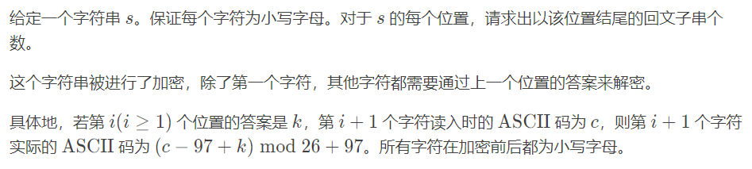

```cpp
#include"bits/stdc++.h"
#define endl '\n'
using ll=long long;
using namespace std;
constexpr int N=5e5+10,inf=0X3F3F3F3F,mod=1e9+7;
constexpr ll INF=0X3F3F3F3F3F3F3F3F;
struct pam{//初始化时最多有（字符串长度+2）个节点
    int sz,tot,last;
    // int cnt[N],ch[N][26],len[N],fail[N];
    // char s[N];
    vector<int>cnt,len,fail;
    vector<array<int,26>>ch;
    vector<char>s;

    pam(int _n){
        cnt.resize(_n);
        len.resize(_n);
        fail.resize(_n);
        ch.resize(_n);
        s.resize(_n);
    }

    void clear(){//初始化
        sz=-1;
        last=tot=0;
        s[tot]='_';
        node(0);
        node(-1);
        fail[0]=1;
    }

    int node(int l){//新建长度为l的节点
        sz++;
        fill(ch[sz].begin(),ch[sz].end(),0);
        len[sz]=l;
        fail[sz]=cnt[sz]=0;
        return sz;
    }

    int getfail(int x){//找后缀回文
        while(s[tot-len[x]-1]!=s[tot])
            x=fail[x];
        return x;
    }

    void insert(char c){//建树
        int i=c-'a';
        tot++;
        s[tot]=c;
        int now=getfail(last);
        if(!ch[now][i]){
            int x=node(len[now]+2);
            fail[x]=ch[getfail(fail[now])][i];
            ch[now][i]=x;
        }
        last=ch[now][i];
        cnt[last]=cnt[fail[last]]+1;
    }

    void solve(){
        ll ans=0;
        for(int i=sz;i>=0;i--)
            cnt[fail[i]]+=cnt[i];
        //do something
    }
};
void solve(){
    string s;
    cin>>s;
    int n=s.size();
    s=' '+s;
    pam sb(s.size()+1);
    sb.clear();
    int k=0;
    sb.insert(s[1]);
    k=sb.cnt[sb.last];
    cout<<k<<' ';
    for(int i=2;i<=n;i++){
        char c=(s[i]-97+k)%26+97;
        sb.insert(c);
        k=sb.cnt[sb.last];
        cout<<k<<' ';
    }
}
signed main(){
    cin.tie(nullptr)->sync_with_stdio(0);
//	int t;cin>>t;while(t--)
    solve();
    return 0;
}
```

## 后缀数组

后缀数组（Suffix Array）主要关系到两个数组：$sa$ 和 $rk$。

其中，$sa[i]$ 表示将所有后缀排序后第 $i$ 小的后缀的编号，也是所说的后缀数组，后文也称编号数组 $sa$；

$rk[i]$ 表示后缀 $i$ 的排名，是重要的辅助数组，后文也称排名数组 $rk$。

这两个数组满足性质：$sa[rk[i]]=rk[sa[i]]=i$。

```cpp
struct suffixarray{
    int n;
    vector<int>sa,rk,ht;//0-index，ht[0]=0,ht[i]=lcp(sa[i],sa[i-1])
    suffixarray(const string &s){
        n=s.size();
        sa.resize(n);
        ht.resize(n);
        rk.resize(n);
        iota(sa.begin(),sa.end(),0);
        sort(sa.begin(),sa.end(),[&](int a,int b){
            return s[a]<s[b];
        });
        rk[sa[0]]=0;
        for(int i=1;i<n;i++)
            rk[sa[i]]=rk[sa[i-1]]+(s[sa[i]]!=s[sa[i-1]]);
        int k=1;
        vector<int>tmp,cnt(n);
        tmp.reserve(n);
        while(rk[sa[n-1]]<n-1){
            tmp.clear();
            for(int i=0;i<k;i++)
                tmp.push_back(n-k+i);
            for(auto i:sa)
                if(i>=k)
                    tmp.push_back(i-k);
            fill(cnt.begin(),cnt.end(),0);
            for(int i=0;i<n;i++)
                ++cnt[rk[i]];
            for(int i=1;i<n;i++)
                cnt[i]+=cnt[i-1];
            for(int i=n-1;i>=0;i--)
                sa[--cnt[rk[tmp[i]]]]=tmp[i];
            swap(rk,tmp);
            rk[sa[0]]=0;
            for(int i=1;i<n;i++)
                rk[sa[i]]=rk[sa[i-1]]+
                    (tmp[sa[i-1]]<tmp[sa[i]]||
                    sa[i-1]+k==n||
                    tmp[sa[i-1]+k]<tmp[sa[i]+k]);
            k*=2;
        }
        for(int i=0,j=0;i<n;i++){
            if(rk[i]==0){
                j=0;
            }else{
                for(j-=j>0;i+j<n&&sa[rk[i]-1]+j<n&&s[i+j]==s[sa[rk[i]-1]+j];)
                    j++;
                ht[rk[i]]=j;
            }
        }
    }
};
```

### 构建

时间复杂度 $O(nlogn)$ 

1-index，构建出sa数组和rk数组

```cpp
#include <algorithm>
#include <cstdio>
#include <cstring>
#include <iostream>

using namespace std;

const int N = 1000010;

char s[N];
int n;
int m, p, rk[N * 2], oldrk[N], sa[N * 2], id[N], cnt[N];

int main() {
  scanf("%s", s + 1);
  n = strlen(s + 1);
  m = 128;

  for (int i = 1; i <= n; i++) cnt[rk[i] = s[i]]++;
  for (int i = 1; i <= m; i++) cnt[i] += cnt[i - 1];
  for (int i = n; i >= 1; i--) sa[cnt[rk[i]]--] = i;

  for (int w = 1;; w <<= 1, m = p) {  // m = p 即为值域优化
    int cur = 0;
    for (int i = n - w + 1; i <= n; i++) id[++cur] = i;
    for (int i = 1; i <= n; i++)
      if (sa[i] > w) id[++cur] = sa[i] - w;

    memset(cnt, 0, sizeof(cnt));
    for (int i = 1; i <= n; i++) cnt[rk[i]]++;
    for (int i = 1; i <= m; i++) cnt[i] += cnt[i - 1];
    for (int i = n; i >= 1; i--) sa[cnt[rk[id[i]]]--] = id[i];

    p = 0;
    memcpy(oldrk, rk, sizeof(oldrk));
    for (int i = 1; i <= n; i++) {
      if (oldrk[sa[i]] == oldrk[sa[i - 1]] &&
          oldrk[sa[i] + w] == oldrk[sa[i - 1] + w])
        rk[sa[i]] = p;
      else
        rk[sa[i]] = ++p;
    }

    if (p == n) break;  // p = n 时无需再排序
  }

  for (int i = 1; i <= n; i++) printf("%d ", sa[i]);

  return 0;
}
```

jiangly模板0-index

```cpp
struct SuffixArray {
	int n;
    //sa[i]：排名第i的后缀的开始下标
    //rk[i]：开始下标为i的后缀的排名
    //lc[i]：height数组
    std::vector<int> sa, rk, lc;
    SuffixArray(const std::string &s) {
    	n = s.length();
        sa.resize(n);
        lc.resize(n - 1);
        rk.resize(n);
        //从0开始递增赋值
        std::iota(sa.begin(), sa.end(), 0);
        //长度为1的情况，直接根据字符串大小对sa排序
        std::sort(sa.begin(), sa.end(), [&](int a, int b) {return s[a] < s[b];});
        //由sa算出rk数组
        rk[sa[0]] = 0;
        for (int i = 1; i < n; ++i)//如果sa[i]!=sa[i-1]，sa[i]必然比sa[i-1]大，
            //这时候排名要比前一个多1
            rk[sa[i]] = rk[sa[i - 1]] + (s[sa[i]] != s[sa[i - 1]]);
        int k = 1;
        std::vector<int> tmp, cnt(n);
        tmp.reserve(n);
        //当rk[sa[n-1]]==n-1的时候代表排序完成
        //或者当前长度已经全都不相同了，就没必要继续了
        while (rk[sa[n - 1]] < n - 1) {
            tmp.clear();
            //优化了对第二关键字的计数排序，tmp[i]记录的是排名为i的[[长度为2k的后缀]的第二关键字起始位置]
            for (int i = 0; i < k; ++i)
                tmp.push_back(n - k + i);
            for (auto i : sa)
                if (i >= k)
                    tmp.push_back(i - k);
            std::fill(cnt.begin(), cnt.end(), 0);
            //对第一关键字计数排序，tmp靠后的在sa中也靠后
            for (int i = 0; i < n; ++i)
                ++cnt[rk[i]];
            for (int i = 1; i < n; ++i)
                cnt[i] += cnt[i - 1];
            for (int i = n - 1; i >= 0; --i)
                sa[--cnt[rk[tmp[i]]]] = tmp[i];
            std::swap(rk, tmp);
            //根据sa求出rk，上面详解过这里
            rk[sa[0]] = 0;
            for (int i = 1; i < n; ++i)
                rk[sa[i]] = rk[sa[i - 1]] + (tmp[sa[i - 1]] < tmp[sa[i]] || sa[i - 
1] + k == n || tmp[sa[i - 1] + k] < tmp[sa[i] + k]);
            //倍增
            k *= 2;
        }
        //这里求height数组
        for (int i = 0, j = 0; i < n; ++i) {
            if (rk[i] == 0) {
                j = 0;
            } else {
                for (j -= j > 0; i + j < n && sa[rk[i] - 1] + j < n && s[i + j] == 
s[sa[rk[i] - 1] + j]; )
                    ++j;
                lc[rk[i] - 1] = j;
            }
        }
    }
};
```

### 寻找最小的循环移动位置

将字符串 $S$ 复制一份变成 $SS$ 就转化成了后缀排序问题。

例题：给定字符串，字符串循环同构串按字典序排序后每个输出最后一个字符

```cpp
#include"bits/stdc++.h"
#define endl '\n'
using ll=long long;
using namespace std;
constexpr int N=1e5+10,inf=0X3F3F3F3F;
constexpr ll INF=0X3F3F3F3F3F3F3F3F;
struct SuffixArray {
	int n;
    //sa[i]：排名第i的后缀的开始下标
    //rk[i]：开始下标为i的后缀的排名
    //lc[i]：height数组
    std::vector<int> sa, rk, lc;
    SuffixArray(const std::string &s) {
    	n = s.length();
        sa.resize(n);
        lc.resize(n - 1);
        rk.resize(n);
        //从0开始递增赋值
        std::iota(sa.begin(), sa.end(), 0);
        //长度为1的情况，直接根据字符串大小对sa排序
        std::sort(sa.begin(), sa.end(), [&](int a, int b) {return s[a] < s[b];});
        //由sa算出rk数组
        rk[sa[0]] = 0;
        for (int i = 1; i < n; ++i)//如果sa[i]!=sa[i-1]，sa[i]必然比sa[i-1]大，
            //这时候排名要比前一个多1
            rk[sa[i]] = rk[sa[i - 1]] + (s[sa[i]] != s[sa[i - 1]]);
        int k = 1;
        std::vector<int> tmp, cnt(n);
        tmp.reserve(n);
        //当rk[sa[n-1]]==n-1的时候代表排序完成
        //或者当前长度已经全都不相同了，就没必要继续了
        while (rk[sa[n - 1]] < n - 1) {
            tmp.clear();
            //优化了对第二关键字的计数排序，tmp[i]记录的是排名为i的[[长度为2k的后缀]的第二关键字起始位置]
            for (int i = 0; i < k; ++i)
                tmp.push_back(n - k + i);
            for (auto i : sa)
                if (i >= k)
                    tmp.push_back(i - k);
            std::fill(cnt.begin(), cnt.end(), 0);
            //对第一关键字计数排序，tmp靠后的在sa中也靠后
            for (int i = 0; i < n; ++i)
                ++cnt[rk[i]];
            for (int i = 1; i < n; ++i)
                cnt[i] += cnt[i - 1];
            for (int i = n - 1; i >= 0; --i)
                sa[--cnt[rk[tmp[i]]]] = tmp[i];
            std::swap(rk, tmp);
            //根据sa求出rk，上面详解过这里
            rk[sa[0]] = 0;
            for (int i = 1; i < n; ++i)
                rk[sa[i]] = rk[sa[i - 1]] + (tmp[sa[i - 1]] < tmp[sa[i]] || sa[i - 
1] + k == n || tmp[sa[i - 1] + k] < tmp[sa[i] + k]);
            //倍增
            k *= 2;
        }
        //这里求height数组
        for (int i = 0, j = 0; i < n; ++i) {
            if (rk[i] == 0) {
                j = 0;
            } else {
                for (j -= j > 0; i + j < n && sa[rk[i] - 1] + j < n && s[i + j] == 
s[sa[rk[i] - 1] + j]; )
                    ++j;
                lc[rk[i] - 1] = j;
            }
        }
    }
};
signed main(){
    cin.tie(nullptr)->sync_with_stdio(0);
    string s;
    cin>>s;
    int n=s.size();
    s+=s;//倍增
    SuffixArray x(s);
    for(int i=0;i<2*n;i++){//按后缀排序顺序
        if(x.sa[i]<n){//如果开头是前一半，说明是合法串
            cout<<s[x.sa[i]+n-1];
        }
    }
    return 0;
}
```

### 从字符串首尾取字符最小化字典序

暴力做法就是每次最坏 $O(n)$ 地判断当前应该取首还是尾（即比较取首得到的字符串与取尾得到的反串的大小），只需优化这一判断过程即可。

由于需要在原串后缀与反串后缀构成的集合内比较大小，可以将反串拼接在原串后，并在中间加上一个没出现过的字符（如 `#`，代码中可以直接使用空字符），求后缀数组，即可 $O(1)$ 完成这一判断。

```cpp
#include"bits/stdc++.h"
#define endl '\n'
using ll=long long;
using namespace std;
constexpr int N=1e5+10,inf=0X3F3F3F3F;
constexpr ll INF=0X3F3F3F3F3F3F3F3F;
struct SuffixArray {
	int n;
    //sa[i]：排名第i的后缀的开始下标
    //rk[i]：开始下标为i的后缀的排名
    //lc[i]：height数组
    std::vector<int> sa, rk, lc;
    SuffixArray(const std::string &s) {
    	n = s.length();
        sa.resize(n);
        lc.resize(n - 1);
        rk.resize(n);
        //从0开始递增赋值
        std::iota(sa.begin(), sa.end(), 0);
        //长度为1的情况，直接根据字符串大小对sa排序
        std::sort(sa.begin(), sa.end(), [&](int a, int b) {return s[a] < s[b];});
        //由sa算出rk数组
        rk[sa[0]] = 0;
        for (int i = 1; i < n; ++i)//如果sa[i]!=sa[i-1]，sa[i]必然比sa[i-1]大，
            //这时候排名要比前一个多1
            rk[sa[i]] = rk[sa[i - 1]] + (s[sa[i]] != s[sa[i - 1]]);
        int k = 1;
        std::vector<int> tmp, cnt(n);
        tmp.reserve(n);
        //当rk[sa[n-1]]==n-1的时候代表排序完成
        //或者当前长度已经全都不相同了，就没必要继续了
        while (rk[sa[n - 1]] < n - 1) {
            tmp.clear();
            //优化了对第二关键字的计数排序，tmp[i]记录的是排名为i的[[长度为2k的后缀]的第二关键字起始位置]
            for (int i = 0; i < k; ++i)
                tmp.push_back(n - k + i);
            for (auto i : sa)
                if (i >= k)
                    tmp.push_back(i - k);
            std::fill(cnt.begin(), cnt.end(), 0);
            //对第一关键字计数排序，tmp靠后的在sa中也靠后
            for (int i = 0; i < n; ++i)
                ++cnt[rk[i]];
            for (int i = 1; i < n; ++i)
                cnt[i] += cnt[i - 1];
            for (int i = n - 1; i >= 0; --i)
                sa[--cnt[rk[tmp[i]]]] = tmp[i];
            std::swap(rk, tmp);
            //根据sa求出rk，上面详解过这里
            rk[sa[0]] = 0;
            for (int i = 1; i < n; ++i)
                rk[sa[i]] = rk[sa[i - 1]] + (tmp[sa[i - 1]] < tmp[sa[i]] || sa[i - 
1] + k == n || tmp[sa[i - 1] + k] < tmp[sa[i] + k]);
            //倍增
            k *= 2;
        }
        //这里求height数组
        for (int i = 0, j = 0; i < n; ++i) {
            if (rk[i] == 0) {
                j = 0;
            } else {
                for (j -= j > 0; i + j < n && sa[rk[i] - 1] + j < n && s[i + j] == 
s[sa[rk[i] - 1] + j]; )
                    ++j;
                lc[rk[i] - 1] = j;
            }
        }
    }
};
signed main(){
    cin.tie(nullptr)->sync_with_stdio(0);
    int n=6;
    cin>>n;
    string s;
    for(int i=0;i<n;i++){
        char c;
        cin>>c;
        s+=c;
    }
    string s1=s;
    reverse(s1.begin(),s1.end());
    string t=s+' '+s1;//构建字符串，原串加空白加反串
    SuffixArray x(t);
    string ans;
    for(int i=0,j=n+1,sp=0;sp<n;sp++){
        if(x.rk[i]<x.rk[j]){//比较放入首还是尾
            ans+=s[i];//首
            i++;
        }else{
            ans+=s[2*n-j];//尾
            j++;
        }
    }
    for(int i=0;i<ans.size();i++){
        cout<<ans[i];
        if(i%80==79)
            cout<<endl;
    }
    return 0;
}
```

### height数组

#### LCP（最长公共前缀）

两个字符串 $S$ 和 $T$ 的 LCP 就是最大的 $x$($x\le \min(|S|, |T|)$) 使得 $S_i=T_i\ (\forall\ 1\le i\le x)$。

下文中以 $lcp(i,j)$ 表示后缀 $i$ 和后缀 $j$ 的最长公共前缀（的长度）。

#### height 数组的定义

$height[i]=lcp(sa[i],sa[i-1])$，即第 $i$ 名的后缀与它前一名的后缀的最长公共前缀。

$height[1]$ 可以视作 $0$。

#### O(n) 求 height 数组需要的一个引理

$height[rk[i]]\ge height[rk[i-1]]-1$

### O(n) 求 height 数组的代码实现

利用上面这个引理暴力求即可：

```cpp
for (i = 1, k = 0; i <= n; ++i) {
  if (rk[i] == 0) continue;
  if (k) --k;
  while (s[i + k] == s[sa[rk[i] - 1] + k]) ++k;
  height[rk[i]] = k;
}
```

### 两子串最长公共前缀

$lcp(sa[i],sa[j])=\min\{height[i+1..j]\}$

感性理解：如果 $height$ 一直大于某个数，前这么多位就一直没变过；反之，由于后缀已经排好序了，不可能变了之后变回来。

严格证明可以参考[\[2004\] 后缀数组 by. 许智磊][1]。

有了这个定理，求两子串最长公共前缀就转化为了 [RMQ 问题](../topic/rmq.md)。

### 比较一个字符串的两个子串的大小关系

假设需要比较的是 $A=S[a..b]$ 和 $B=S[c..d]$ 的大小关系。

若 $lcp(a, c)\ge\min(|A|, |B|)$，$A<B\iff |A|<|B|$。

否则，$A<B\iff rk[a]< rk[c]$。

### 不同子串的数目

子串就是后缀的前缀，所以可以枚举每个后缀，计算前缀总数，再减掉重复。

「前缀总数」其实就是子串个数，为 $n(n+1)/2$。

如果按后缀排序的顺序枚举后缀，每次新增的子串就是除了与上一个后缀的 LCP 剩下的前缀。这些前缀一定是新增的，否则会破坏 $lcp(sa[i],sa[j])=\min\{height[i+1..j]\}$ 的性质。只有这些前缀是新增的，因为 LCP 部分在枚举上一个前缀时计算过了。

所以答案为：

$\frac{n(n+1)}{2}-\sum\limits_{i=2}^nheight[i]$

```cpp
#include"bits/stdc++.h"
#define endl '\n'
using ll=long long;
using namespace std;
constexpr int N=1e5+10,inf=0X3F3F3F3F;
constexpr ll INF=0X3F3F3F3F3F3F3F3F;
struct suffixarray{
    int n;
    vector<int>sa,rk,ht;
    suffixarray(const string &s){
        n=s.size();
        sa.resize(n);
        ht.resize(n);
        rk.resize(n);
        iota(sa.begin(),sa.end(),0);
        sort(sa.begin(),sa.end(),[&](int a,int b){
            return s[a]<s[b];
        });
        rk[sa[0]]=0;
        for(int i=1;i<n;i++)
            rk[sa[i]]=rk[sa[i-1]]+(s[sa[i]]!=s[sa[i-1]]);
        int k=1;
        vector<int>tmp,cnt(n);
        tmp.reserve(n);
        while(rk[sa[n-1]]<n-1){
            tmp.clear();
            for(int i=0;i<k;i++)
                tmp.push_back(n-k+i);
            for(auto i:sa)
                if(i>=k)
                    tmp.push_back(i-k);
            fill(cnt.begin(),cnt.end(),0);
            for(int i=0;i<n;i++)
                ++cnt[rk[i]];
            for(int i=1;i<n;i++)
                cnt[i]+=cnt[i-1];
            for(int i=n-1;i>=0;i--)
                sa[--cnt[rk[tmp[i]]]]=tmp[i];
            swap(rk,tmp);
            rk[sa[0]]=0;
            for(int i=1;i<n;i++)
                rk[sa[i]]=rk[sa[i-1]]+
                    (tmp[sa[i-1]]<tmp[sa[i]]||
                    sa[i-1]+k==n||
                    tmp[sa[i-1]+k]<tmp[sa[i]+k]);
            k*=2;
        }
        for(int i=0,j=0;i<n;i++){
            if(rk[i]==0){
                j=0;
            }else{
                for(j-=j>0;i+j<n&&sa[rk[i]-1]+j<n&&s[i+j]==s[sa[rk[i]-1]+j];)
                    j++;
                ht[rk[i]]=j;
            }
        }
    }
};
void solve(){
    int n;
    cin>>n;
    string s;
    cin>>s;
    suffixarray o(s);
    ll ans=n*(n+1ll)/2;
    ll sum=0;
    auto &ht=o.ht;
    for(int i=1;i<n;i++)
        sum+=ht[i];
    cout<<ans-sum<<endl;
}
signed main(){
    cin.tie(nullptr)->sync_with_stdio(0);
//	int t;cin>>t;while(t--)
    solve();
    return 0;
}
```

### 出现至少 k 次的子串的最大长度

例题：[「USACO06DEC」Milk Patterns](https://www.luogu.com.cn/problem/P2852)。

农夫 John 发现他的奶牛产奶的质量一直在变动。经过细致的调查，他发现：虽然他不能预见明天产奶的质量，但连续的若干天的质量有很多重叠。我们称之为一个“模式”。 John 的牛奶按质量可以被赋予一个 $0$ 到 $1000000$ 之间的数。并且 John 记录了 $N$（$1 \le N \le 2 \times 10 ^ 4$）天的牛奶质量值。他想知道最长的出现了至少 $K$（$2 \le K \le N$）次的模式的长度。比如 `1 2 3 2 3 2 3 1` 中 `2 3 2 3` 出现了两次。当 $K = 2$ 时，这个长度为 $4$。

出现至少 $k$ 次意味着后缀排序后有至少连续 $k$ 个后缀以这个子串作为公共前缀。所以，求出每相邻 $k-1$ 个 $height$ 的最小值，再求这些最小值的最大值就是答案。可以使用单调队列 $O(n)$ 解决，但使用其它方式也足以 AC。

```cpp
#include <cstring>
#include <iostream>
#include <set>

using namespace std;

const int N = 40010;

int n, k, a[N], sa[N], rk[N], oldrk[N], id[N], px[N], cnt[1000010], ht[N], ans;
multiset<int> t;  // multiset 是最好写的实现方式

bool cmp(int x, int y, int w) {
  return oldrk[x] == oldrk[y] && oldrk[x + w] == oldrk[y + w];
}

int main() {
  cin.tie(nullptr)->sync_with_stdio(false);
  int i, j, w, p, m = 1000000;

  cin >> n >> k;
  --k;

  for (i = 1; i <= n; ++i) cin >> a[i];  // 求后缀数组
  for (i = 1; i <= n; ++i) ++cnt[rk[i] = a[i]];
  for (i = 1; i <= m; ++i) cnt[i] += cnt[i - 1];
  for (i = n; i >= 1; --i) sa[cnt[rk[i]]--] = i;

  for (w = 1; w < n; w <<= 1, m = p) {
    for (p = 0, i = n; i > n - w; --i) id[++p] = i;
    for (i = 1; i <= n; ++i)
      if (sa[i] > w) id[++p] = sa[i] - w;
    memset(cnt, 0, sizeof(cnt));
    for (i = 1; i <= n; ++i) ++cnt[px[i] = rk[id[i]]];
    for (i = 1; i <= m; ++i) cnt[i] += cnt[i - 1];
    for (i = n; i >= 1; --i) sa[cnt[px[i]]--] = id[i];
    memcpy(oldrk, rk, sizeof(rk));
    for (p = 0, i = 1; i <= n; ++i)
      rk[sa[i]] = cmp(sa[i], sa[i - 1], w) ? p : ++p;
  }

  for (i = 1, j = 0; i <= n; ++i) {  // 求 height
    if (j) --j;
    while (a[i + j] == a[sa[rk[i] - 1] + j]) ++j;
    ht[rk[i]] = j;
  }

  for (i = 1; i <= n; ++i) {  // 求所有最小值的最大值
    t.insert(ht[i]);
    if (i > k) t.erase(t.find(ht[i - k]));
    ans = max(ans, *t.begin());
  }

  cout << ans;

  return 0;
}
```

### 是否有某字符串在文本串中至少不重叠地出现了两次

可以二分目标串的长度 $|s|$，将 $h$ 数组划分成若干个连续 LCP 大于等于 $|s|$ 的段，利用 RMQ 对每个段求其中出现的数中最大和最小的下标，若这两个下标的距离满足条件，则一定有长度为 $|s|$ 的字符串不重叠地出现了两次。

### 连续的若干个相同子串

我们可以枚举连续串的长度 $|s|$，按照 $|s|$ 对整个串进行分块，对相邻两块的块首进行 LCP 与 LCS 查询，具体可见[\[2009\] 后缀数组——处理字符串的有力工具][2]。

例题：[「NOI2016」优秀的拆分](https://loj.ac/p/2083)。

## 后缀自动机

### 模板

```cpp
struct SAM {//0-index
  static constexpr int M = 26;
  int lst;
  struct Node {
    int len, link, endpos;
    array<int, M> next;
    Node() : len{}, link{}, next{}, endpos{-1} {};
  };
  vector<Node> t;
  int newNode() {
    t.emplace_back();
    return t.size() - 1;
  };
  void init() {
    t.assign(1, Node());
    t[0].len = 0, t[0].link = -1;
    lst = 0;
  };
  SAM() { init(); };
  void extend(int c, int i) {
    int cur = newNode();
    // 这里endpos代表节点的对应原字符串最小的位置
    t[cur].endpos = i;
    t[cur].len = t[lst].len + 1;
    int p = lst;
    while (p != -1 and !t[p].next[c]) {
      t[p].next[c] = cur;
      p = t[p].link;
    }
    if (p == -1) {
      t[cur].link = 0;
    } else {
      int q = t[p].next[c];
      if (t[p].len + 1 == t[q].len) {
        t[cur].link = q;
      } else {
        int cln = newNode();
        t[cln] = t[q];
        t[cln].len = t[p].len + 1;
        while (p != -1 and t[p].next[c] == q) {
          t[p].next[c] = cln;
          p = t[p].link;
        }
        t[cur].link = t[q].link = cln;
      }
    }
    lst = cur;
  };
  void extend(char c, int i) { extend(int(c - 'a'), i); };
  int size() { return t.size(); };
  int len(int p) { return t[p].len; };
  int link(int p) { return t[p].link; };
  auto next(int p) { return t[p].next; };
  int next(int p, int c) { return t[p].next[c]; };
  int endpos(int p) { return t[p].endpos; };
};
```

```cpp
struct SAM {
	//edited by piaoyun from some other's code 
	//必须#define int long long 
 
	static const int MAXN=1000010,MAXS=28;
 
    int tot=1,last=1,link[MAXN << 1],ch[MAXN << 1][MAXS],len[MAXN << 1],endpos[MAXN << 1];
	//总点数tot，点的index属于[1-tot]，空串/根为1 
	//last为上一次插入的点
	//link为点的parent树父节点 / 最长 出现位置与自己不同 的后缀
	//ch[n][s] 指节点n末尾加字符s所转移到的点
	//len指该节点的串的 最长长度，注意到 最短长度 等于 len[link[n]] + 1 即父节点最长 + 1
	//endpos[n] 参考get_endpos()的注释 
	void clear(){
        for(int i = 0; i <= tot; i++){
            link[i] = len[i] = endpos[i] = 0;
            for(int k = 0; k < MAXS; k++) ch[i][k] = 0;
        }
        tot=1;last=1;
    }
 
    //延长一个字符，通常为[1-26] 
    void extend(int w){
        int p=++tot,x=last,r,q;
        endpos[p]=1;
        for(len[last=p]=len[x]+1; x&&!ch[x][w]; x=link[x]) ch[x][w]=p;
        if(!x)link[p]=1;
        else if(len[x]+1==len[q=ch[x][w]]) link[p]=q;
        else {
            link[r=++tot]=link[q];
            memcpy(ch[r],ch[q],sizeof ch[r]);
            len[r]=len[x]+1;
            link[p]=link[q]=r;
            for(; x&&ch[x][w]==q; x=link[x])ch[x][w]=r;
        }
    }
 
    //*注意vector占用的空间 
    vector<int> p[MAXN << 1]; //建立parent树，以便从上到下dfs 
    void dfs(int u){
    	int v;
    	for(int i=0;i<p[u].size();i++){
        	v=p[u][i];
        	dfs(v);
        	endpos[u]+=endpos[v];
   		}
	}
 
    //注意！在使用该方法前，endpos[]代表每个点作为“终结点”的次数
	//使用该方法后，endpos[]指在串中出现总次数，即原数组的子树求和
    void get_endpos(){
    	for(int i = 1;i <= tot; i++) p[i].clear();
    	for(int i = 2;i <= tot; i++){
        	p[link[i]].push_back(i); //建立parent树，以便从上到下dfs 
   		}
   		dfs(1);
   		for(int i = 1;i <= tot; i++) p[i].clear();
	}
 
 
    //*在您不确定是否有抄写错误时再使用该方法 
    //*必须在输入任何数据前自检，此前的数据会被清空 
    static const int STC = 998244353;
    void self_test(){
		clear();
		for(int i = 1;i <= 1000; i++) extend(i * i % 26 + 1);
		int tmp = 107 * last + 301 * tot;
		for(int i = 1;i <= tot; i++){
			tmp = (tmp * 33 + link[i] * 101 + len[i] * 97) % STC;
			for(int k = 1; k < MAXS; k++) tmp = (tmp + k * ch[i][k]) % STC;
		}
		assert("stage 1" && tmp == 393281314); // stage1 : 检查建树是否正确
		tmp = 0;
		get_endpos();
		for(int i = 1;i <= tot; i++) tmp = (tmp * 33 + endpos[i]) % STC;
		assert("stage 2" && tmp == 178417668); // stage2 : 检查endpos计算是否正确，如果您修改了endpos[]的含义则会报错
		cout<<"Self Test Passed.Remember to delete this function's use."<<endl;
		clear();
	}
 
	//调试时可调用 
	void debug_print(){
		for(int i = 1;i <= tot; i++){
			cout<<"node:"<<i<<" father:"<<link[i]<<" endpos:"<<endpos[i]<<" len:"<<len[i]<<endl;
		}
	} 
 
	ll solve(){
		//在这里输入你自己的解题逻辑
		ll ans = 0;
		get_endpos();
		for(int i = 1;i <= tot; i++) if(endpos[i] >= 2) ans = max(ans,(ll)endpos[i] * len[i]);
		return ans;
	}
}sam;
```

### 求字符串的第k小子串

t为1代表相同字符串记作多次 ，为0记作1次。

先在DAG上求f数组，表示此点有多少个子串（求不同路径的个数，注意记忆化），g数组表示此点为结尾有多少子串（即endpos，根节点设置为0，代表不记录空串）。

然后转换成类似Trie树求第k小的，搜索一遍

```cpp
#include"bits/stdc++.h"
#define endl '\n'
#define int ll
using ll=long long;
using namespace std;
constexpr int N=1e5+10,inf=0X3F3F3F3F;
constexpr ll INF=0X3F3F3F3F3F3F3F3F;

struct SAM {
	//edited by piaoyun from some other's code 
	//必须#define int long long 
 
	static const int MAXN=1000010,MAXS=28;
 
    int tot=1,last=1,link[MAXN << 1],ch[MAXN << 1][MAXS],len[MAXN << 1],endpos[MAXN << 1];
    int g[MAXN<<1],f[MAXN<<1];
	//总点数tot，点的index属于[1-tot]，空串/根为1 
	//last为上一次插入的点
	//link为点的parent树父节点 / 最长 出现位置与自己不同 的后缀
	//ch[n][s] 指节点n末尾加字符s所转移到的点
	//len指该节点的串的 最长长度，注意到 最短长度 等于 len[link[n]] + 1 即父节点最长 + 1
	//endpos[n] 参考get_endpos()的注释 
	void clear(){
        for(int i = 0; i <= tot; i++){
            link[i] = len[i] = endpos[i] = 0;
            for(int k = 0; k < MAXS; k++) ch[i][k] = 0;
        }
        tot=1;last=1;
    }
 
    //延长一个字符，通常为[1-26] 
    void extend(int w){
        int p=++tot,x=last,r,q;
        endpos[p]=1;
        for(len[last=p]=len[x]+1; x&&!ch[x][w]; x=link[x]) ch[x][w]=p;
        if(!x)link[p]=1;
        else if(len[x]+1==len[q=ch[x][w]]) link[p]=q;
        else {
            link[r=++tot]=link[q];
            memcpy(ch[r],ch[q],sizeof ch[r]);
            len[r]=len[x]+1;
            link[p]=link[q]=r;
            for(; x&&ch[x][w]==q; x=link[x])ch[x][w]=r;
        }
    }
 
    //*注意vector占用的空间 
    vector<int> p[MAXN << 1]; //建立parent树，以便从上到下dfs 
    void dfs(int u){
    	int v;
    	for(int i=0;i<p[u].size();i++){
        	v=p[u][i];
        	dfs(v);
        	endpos[u]+=endpos[v];
   		}
	}
 
    //注意！在使用该方法前，endpos[]代表每个点作为“终结点”的次数
	//使用该方法后，endpos[]指在串中出现总次数，即原数组的子树求和
    void get_endpos(){
    	for(int i = 1;i <= tot; i++) p[i].clear();
    	for(int i = 2;i <= tot; i++){
        	p[link[i]].push_back(i); //建立parent树，以便从上到下dfs 
   		}
   		dfs(1);
   		for(int i = 1;i <= tot; i++) p[i].clear();
	}
 
 
    //*在您不确定是否有抄写错误时再使用该方法 
    //*必须在输入任何数据前自检，此前的数据会被清空 
    static const int STC = 998244353;
    void self_test(){
		clear();
		for(int i = 1;i <= 1000; i++) extend(i * i % 26 + 1);
		int tmp = 107 * last + 301 * tot;
		for(int i = 1;i <= tot; i++){
			tmp = (tmp * 33 + link[i] * 101 + len[i] * 97) % STC;
			for(int k = 1; k < MAXS; k++) tmp = (tmp + k * ch[i][k]) % STC;
		}
		assert("stage 1" && tmp == 393281314); // stage1 : 检查建树是否正确
		tmp = 0;
		get_endpos();
		for(int i = 1;i <= tot; i++) tmp = (tmp * 33 + endpos[i]) % STC;
		assert("stage 2" && tmp == 178417668); // stage2 : 检查endpos计算是否正确，如果您修改了endpos[]的含义则会报错
		cout<<"Self Test Passed.Remember to delete this function's use."<<endl;
		clear();
	}
 
	//调试时可调用 
	void debug_print(){
		for(int i = 1;i <= tot; i++){
			cout<<"node:"<<i<<" father:"<<link[i]<<" endpos:"<<endpos[i]<<" len:"<<len[i]<<endl;
		}
	} 
    
    int vis[MAXN<<1];
    void calc(int u){
        f[u]=g[u];
        vis[u]=1;
        for(int c=1;c<=26;c++){
            int v=ch[u][c];
            if(v==0)
                continue;
            if(!vis[v])
                calc(ch[u][c]);
            f[u]+=f[v];
        }
        // cout<<"node:"<<u<<' '<<"sum:"<<f[u]<<endl;
    }

    string ans;
    void get(int u,int k){
	    //此节点数量大于等于k，说明已经找到对应字符串，输出答案
        if(g[u]>=k){
            cout<<ans<<endl;
            return;
        }
        //减去此节点为结尾造成的贡献
        k-=g[u];
        //按字典序大小遍历
        for(int c=1;c<=26;c++){
            int v=ch[u][c];
            if(!v)
                continue;
            //f大于等于k，说明在字符串数量够，继续搜索
            if(f[v]>=k){
                ans+=char(c+'a'-1);
                get(v,k);
                break;
            }
            //字符串数量不够k，减去贡献
            k-=f[v];
        }
    }

	void solve(int t,int k){
		//在这里输入你自己的解题逻辑
        if(t)
            get_endpos();
        g[1]=0;
		for(int i=2;i<=tot;i++){
            if(t)
                g[i]=endpos[i];
            else
                g[i]=1;
            // cout<<"node:"<<i<<' '<<"sumsubtree:"<<g[i]<<' '<<endl;
        }
        calc(1);
        // for(int i=tot;i>=1;i--){
        //     for(int j=1;j<=26;j++){
        //         f[i]+=f[ch[i][j]];
        //     }
        // }
        get(1,k);
        if(ans.empty())
            cout<<-1<<endl;
	}
}sam;

void solve(){
    string s;
    int t,k;
    cin>>s;
    cin>>t>>k;
    for(auto c:s)
        sam.extend(c-'a'+1);
    // sam.debug_print();
    sam.solve(t,k);
    // cout<<"end"<<endl;
}
signed main(){
    cin.tie(nullptr)->sync_with_stdio(false);
//	int t;cin>>t;while(t--)
    solve();
    return 0;
}
```

# 数据结构

## 笛卡尔树

笛卡尔树是 $(k, w)$ 键值对构成的树，$k$ 满足二叉搜索树的性质（即二叉树，且左儿子小于父亲，右儿子大于父亲），$w$ 满足堆的性质。

通常将数组的下标作为 $k$，依据单调栈去建树，维护一个单调栈作为从根一直走右儿子到叶子的链，当前节点作为栈顶的右儿子 或 栈顶作为当前节点的左儿子 去构建整棵笛卡尔树。

注：以下标为 $k$，可以发现笛卡尔树每个节点的子树的 $k$ 是一段连续的区间。

### 模板

```cpp
vector<int> ls(n, -1), rs(n, -1), a(n);

int rt = 0;
stack<int> stk;
for (int i = 0; i < n; i++) {
	while (stk.size() && a[stk.top()] > a[i]) {
		ls[i] = stk.top();
		stk.pop();
	}
	if (stk.size())
		rs[stk.top()] = i;
	else
		rt = i;
	stk.push(i);
}
```


## 可持久化01trie

### 模板

```cpp
constexpr int BITCNT=30;
struct trie{//1index
    int cnt,node,rt[N],ch[N*(BITCNT+2)][2],sz[N*(BITCNT+2)];
    void insert(int old,int now,int val){//上个版本的根，此版本根，值
        for(int i=BITCNT-1,u,v;i>=0;i--){
            sz[now]=sz[old]+1;
            u=val>>i&1,v=u^1;
            if(!ch[now][u])
                ch[now][u]=++cnt;
            ch[now][v]=ch[old][v];
            now=ch[now][u];
            old=ch[old][u];
        }
        sz[now]=sz[old]+1;
    }
    void insert(int val){//插入当前值
        rt[++node]=++cnt;
        int old=rt[node-1],now=rt[node];
        for(int i=BITCNT-1,u,v;i>=0;i--){
            u=val>>i&1,v=u^1;
            ch[now][u]=++cnt;
            ch[now][v]=ch[old][v];
            now=ch[now][u],old=ch[old][u];
            sz[now]=sz[old]+1;
        }
    }
    int query(int old,int now,int val){//查询区间[l,r]与val的最大异或，应old=rt[l-1],now=rt[r];
        int res=0;
        for(int i=BITCNT-1,u,v;i>=0;i--){
            u=val>>i&1,v=u^1;
            if(sz[ch[now][v]]>sz[ch[old][v]]){
                now=ch[now][v],old=ch[old][v];
                res+=1<<i;
            }else{
                now=ch[now][u],old=ch[old][u];
            }
        }
        return res;
    }
}tr;
```

示例：本题查询时需要查询 [ l-1 , r-1 ] 区间的与val和当前所有值异或和的最大异或值，防止越界先插入0，改为查询 [ l , r ] 区间。

```cpp
#include"bits/stdc++.h"
#define endl '\n'
using ll=long long;
using namespace std;
constexpr int N=6e5+10,inf=0X3F3F3F3F;
constexpr ll INF=0X3F3F3F3F3F3F3F3F;

constexpr int BITCNT=30;
struct trie{//1index
    int cnt,node,rt[N],ch[N*(BITCNT+2)][2],sz[N*(BITCNT+2)];
    void insert(int old,int now,int val){//上个版本的根，此版本根，值
        for(int i=BITCNT-1,u,v;i>=0;i--){
            sz[now]=sz[old]+1;
            u=val>>i&1,v=u^1;
            if(!ch[now][u])
                ch[now][u]=++cnt;
            ch[now][v]=ch[old][v];
            now=ch[now][u];
            old=ch[old][u];
        }
        sz[now]=sz[old]+1;
    }
    void insert(int val){//插入当前值
        rt[++node]=++cnt;
        int old=rt[node-1],now=rt[node];
        for(int i=BITCNT-1,u,v;i>=0;i--){
            u=val>>i&1,v=u^1;
            ch[now][u]=++cnt;
            ch[now][v]=ch[old][v];
            now=ch[now][u],old=ch[old][u];
            sz[now]=sz[old]+1;
        }
    }
    int query(int old,int now,int val){//查询区间[l,r]与val的最大异或，应old=rt[l-1],now=rt[r];
        int res=0;
        for(int i=BITCNT-1,u,v;i>=0;i--){
            u=val>>i&1,v=u^1;
            if(sz[ch[now][v]]>sz[ch[old][v]]){
                now=ch[now][v],old=ch[old][v];
                res+=1<<i;
            }else{
                now=ch[now][u],old=ch[old][u];
            }
        }
        return res;
    }
}tr;

void solve(){
    int n,m,pre=0;
    cin>>n>>m;
    tr.insert(0);
    for(int i=1,val;i<=n;i++){
        cin>>val;
        pre=pre^val;
        tr.insert(pre);
    }
    while(m--){
        char op;
        cin>>op;
        if(op=='A'){
            int val;
            cin>>val;
            pre=pre^val;
            tr.insert(pre);
        }else{
            int l,r,val;
            cin>>l>>r>>val;
            cout<<tr.query(tr.rt[l-1],tr.rt[r],pre^val)<<endl;
        }
    }
}
signed main(){
    cin.tie(nullptr)->sync_with_stdio(false);
//	int t;cin>>t;while(t--)
    solve();
    return 0;
}
```

### C风格模板

```cpp
constexpr int BITCNT=30;
int cnt,node,rt[N],ch[N*(BITCNT+2)][2],sz[N*(BITCNT+2)];
void insert(int val){//插入当前值
    rt[++node]=++cnt;
    int old=rt[node-1],now=rt[node];
    for(int i=BITCNT-1,u,v;i>=0;i--){
        u=val>>i&1,v=u^1;
        ch[now][u]=++cnt;
        ch[now][v]=ch[old][v];
        now=ch[now][u],old=ch[old][u];
        sz[now]=sz[old]+1;
    }
}
int query(int old,int now,int val){//查询区间[l,r]与val的最大异或，应old=rt[l-1],now=rt[r];
    int res=0;
    for(int i=BITCNT-1,u,v;i>=0;i--){
        u=val>>i&1,v=u^1;
        if(sz[ch[now][v]]>sz[ch[old][v]]){
            now=ch[now][v],old=ch[old][v];
            res+=1<<i;
        }else{
            now=ch[now][u],old=ch[old][u];
        }
    }
    return res;
}
```

示例
本题查询时需要查询 [ l-1 , r-1 ] 区间的与val和当前所有值异或和的最大异或值，防止越界先插入0，改为查询 [ l , r ] 区间。

```cpp
#include"bits/stdc++.h"
#define endl '\n'
using ll=long long;
using namespace std;
constexpr int N=6e5+10,inf=0X3F3F3F3F;
constexpr ll INF=0X3F3F3F3F3F3F3F3F;

constexpr int BITCNT=30;
int cnt,node,rt[N],ch[N*(BITCNT+2)][2],sz[N*(BITCNT+2)];
void insert(int val){//插入当前值
    rt[++node]=++cnt;
    int old=rt[node-1],now=rt[node];
    for(int i=BITCNT-1,u,v;i>=0;i--){
        u=val>>i&1,v=u^1;
        ch[now][u]=++cnt;
        ch[now][v]=ch[old][v];
        now=ch[now][u],old=ch[old][u];
        sz[now]=sz[old]+1;
    }
}
int query(int old,int now,int val){//查询区间[l,r]与val的最大异或，应old=rt[l-1],now=rt[r];
    int res=0;
    for(int i=BITCNT-1,u,v;i>=0;i--){
        u=val>>i&1,v=u^1;
        if(sz[ch[now][v]]>sz[ch[old][v]]){
            now=ch[now][v],old=ch[old][v];
            res+=1<<i;
        }else{
            now=ch[now][u],old=ch[old][u];
        }
    }
    return res;
}

void solve(){
    int n,m,pre=0;
    cin>>n>>m;
    insert(0);
    for(int i=1,val;i<=n;i++){
        cin>>val;
        pre=pre^val;
        insert(pre);
    }
    while(m--){
        char op;
        cin>>op;
        if(op=='A'){
            int val;
            cin>>val;
            pre=pre^val;
            insert(pre);
        }else{
            int l,r,val;
            cin>>l>>r>>val;
            cout<<query(rt[l-1],rt[r],pre^val)<<endl;
        }
    }
}
signed main(){
    cin.tie(nullptr)->sync_with_stdio(false);
//	int t;cin>>t;while(t--)
    solve();
    return 0;
}
```

## 二叉堆

### 对顶堆
由两个堆组成（一个大根堆，一个小根堆），用来维护动态插入的数组的第i小数，i可以单调不降或单调不升。
如果需要维护动态插入动态删除的数组，可以把堆变成set来维护

示例：给定一个长度为 N 的非负整数序列 A，对于前奇数项求中位数。
```cpp
void solve(){
    int n;
    cin>>n;
    priority_queue<int,vector<int>,greater<int>>q2;
    priority_queue<int>q1;
    for(int i=1;i<=n;i++){
        int x;
        cin>>x;
        if(q1.size()<=i/2)
            q1.push(x);
        else
            q2.push(x);
        while(q1.size()&&q2.size()&&q1.top()>q2.top()){
            q2.push(q1.top());
            q1.pop();
            q1.push(q2.top());
            q2.pop();
        }
        if(i&1)
            cout<<q1.top()<<endl;
    }
}
```

### 对顶set

```cpp
template <typename T> // 选用int || long long
struct Mid_set
{
	multiset<T, greater<T>> st1; //小于中位数的数的集合
	multiset<T> st2; //大于等于中位数的集合 
	//   st2.size ≥ st1.size();
	ll sum1 = 0, sum2 = 0;
	void split()
	{
		while (st1.size() < st2.size())
		{
			T now = *st2.begin();
			sum2 -= now;
			sum1 += now;
			st1.insert(now);
			st2.erase(st2.begin());
		}
		while (st1.size() > st2.size())
		{
			T now = *st1.begin();
			st2.insert(now);
			sum1 -= now;
			sum2 += now;
			st1.erase(st1.begin());
		}
	}
	void insert(T x)
	{
		st2.insert(x);
		sum2 += x;
		split();
	}
	void erase(T x)
	{
		if (st1.contains(x))
		{
			st1.extract(x);
			sum1 -= x;
		}
		else
		{
			st2.extract(x);
			sum2 -= x;
		}
		split();
	}
	bool empty()
	{
		return st2.empty();
	}
	T query()//返回中位数
	{
		if (st1.size() == st2.size())
		{
			return *st1.begin();//偶数个数，返回较小的
		}
		return *st2.begin();//有奇数个数
	}
	ll become_mid() // 通过±1,将所有数变相同所需最少操作数
	{
		T mid = query();
		int s1 = st1.size(), s2 = st2.size();
		ll ans = 1ll * s1 * mid - sum1 + sum2 - 1ll * s2 * mid;
		return ans;
	}
};
```

### 两个序列找前n小和的n个元素

有两个长度为 $N$ 的**单调不降**序列 $A,B$，在 $A,B$ 中各取一个数相加可以得到 $N^2$ 个和，求这 $N^2$ 个和中最小的 $N$ 个。

解析：
首先，把A和B两个序列分别从小到大排序，变成两个有序队列。这样，从A和B中各任取一个数相加得到N2个和，可以把这些和看成形成了n个有序表/队列：

A[1]+B[1] <= A[1]+B[2] <= … <= A[1]+B[N]

A[2]+B[1] <= A[2]+B[2] <= … <= A[2]+B[N]

……

A[N]+B[1] <= A[N]+B[2] <= … <= A[N]+B[N]

接下来，就相当于要将这N个有序队列进行合并排序：

首先，将这N个队列中的第一个元素放入一个堆中；

然后；每次取出堆中的最小值。若这个最小值来自于第k个队列，那么，就将第k个队列的下一个元素放入堆中。

```cpp
void solve(){
    int n;
    cin>>n;
    vector<int>a(n+1),b(n+1);
    for(int i=1;i<=n;i++)
        cin>>a[i];
    for(int i=1;i<=n;i++)
        cin>>b[i];
    sort(a.begin()+1,a.end());
    sort(b.begin()+1,b.end());

    // auto check=[&](int x){
    //     int res=0;
    //     for(int i=1,j=n;i<=n;i++){
    //         while(j>=1&&b[j]+a[i]>x)
    //             j--;
    //         res+=j;
    //     }
    //     return res>=n;
    // };
    // int l=2,r=2e9;
    // while(l<r){
    //     int mid=l+r>>1;
    //     if(check(mid))
    //         r=mid;
    //     else
    //         l=mid+1;
    // }

    // vector<int>ans;
    // for(int i=1,j=n;i<=n;i++){
    //     while(j>=1&&b[j]+a[i]>l)
    //         j--;
    //     for(int k=1;k<=j;k++)
    //         ans.push_back(a[i]+b[k]);
    // }

    // sort(ans.begin(),ans.end());
    // for(int i=0;i<n;i++)
    //     cout<<ans[i]<<' ';
//上面为二分做法
    // vector<int>ans;
    // for(int i=1;i<=n;i++){
    //     for(int j=1;i*j<=n;j++){
    //         ans.push_back(a[i]+b[j]);
    //     }
    // }
    // sort(ans.begin(),ans.end());
    // for(int i=0;i<n;i++)
    //     cout<<ans[i]<<' ';
/*
	小于等于a[i]+b[j]的有i*j个（i固定j逐渐减小，然后i减小重复）
	当i*j>n时，必然不是前n小和
*/
    priority_queue<array<int,2>,vector<array<int,2>>,greater<array<int,2>>>q;

    vector<int>c(n+1,1);
    for(int i=1;i<=n;i++)
        q.push({a[i]+b[c[i]++],i});
    
    vector<int>ans;
    while(ans.size()<n){
        auto [val,ind]=q.top();
        q.pop();
        ans.push_back(val);
        q.push({a[ind]+b[c[ind]++],ind});
    }
    for(auto val:ans)
        cout<<val<<' ';
}
```

## 线段树

### jiangly 懒标记

```cpp
/**   懒标记线段树（LazySegmentTree）
 *    2023-03-03: https://atcoder.jp/contests/joi2023yo2/submissions/39363123
 *    2023-03-12: https://codeforces.com/contest/1804/submission/197106837
 *    2023-07-17: https://ac.nowcoder.com/acm/contest/view-submission?submissionId=62804432
 *    2023-11-12: https://qoj.ac/submission/249505
 *    2024-08-14:  https://ac.nowcoder.com/acm/contest/view-submission?submissionId=70980889&returnHomeType=1&uid=329687984
**/
template<class Info, class Tag>
struct LazySegmentTree {
    int n;
    std::vector<Info> info;
    std::vector<Tag> tag;
    LazySegmentTree() : n(0) {}
    LazySegmentTree(int n_, Info v_ = Info()) {
        init(n_, v_);
    }
    template<class T>
    LazySegmentTree(std::vector<T> init_) {
        init(init_);
    }
    void init(int n_, Info v_ = Info()) {
        init(std::vector(n_, v_));
    }
    template<class T>
    void init(std::vector<T> init_) {
        n = init_.size();
        info.assign(4 << std::__lg(n), Info());
        tag.assign(4 << std::__lg(n), Tag());
        std::function<void(int, int, int)> build = [&](int p, int l, int r) {
            if (r - l == 1) {
                info[p] = init_[l];
                return;
            }
            int m = (l + r) / 2;
            build(2 * p, l, m);
            build(2 * p + 1, m, r);
            pull(p);
        };
        build(1, 0, n);
    }
    void pull(int p) {
        info[p] = info[2 * p] + info[2 * p + 1];
    }
    void apply(int p, const Tag &v) {
        info[p].apply(v);
        tag[p].apply(v);
    }
    void push(int p) {
        apply(2 * p, tag[p]);
        apply(2 * p + 1, tag[p]);
        tag[p] = Tag();
    }
    void modify(int p, int l, int r, int x, const Info &v) {
        if (r - l == 1) {
            info[p] = v;
            return;
        }
        int m = (l + r) / 2;
        push(p);
        if (x < m) {
            modify(2 * p, l, m, x, v);
        } else {
            modify(2 * p + 1, m, r, x, v);
        }
        pull(p);
    }
    void modify(int p, const Info &v) {
        modify(1, 0, n, p, v);
    }
    Info rangeQuery(int p, int l, int r, int x, int y) {
        if (l >= y || r <= x) {
            return Info();
        }
        if (l >= x && r <= y) {
            return info[p];
        }
        int m = (l + r) / 2;
        push(p);
        return rangeQuery(2 * p, l, m, x, y) + rangeQuery(2 * p + 1, m, r, x, y);
    }
    Info rangeQuery(int l, int r) {
        return rangeQuery(1, 0, n, l, r);
    }
    void rangeApply(int p, int l, int r, int x, int y, const Tag &v) {
        if (l >= y || r <= x) {
            return;
        }
        if (l >= x && r <= y) {
            apply(p, v);
            return;
        }
        int m = (l + r) / 2;
        push(p);
        rangeApply(2 * p, l, m, x, y, v);
        rangeApply(2 * p + 1, m, r, x, y, v);
        pull(p);
    }
    void rangeApply(int l, int r, const Tag &v) {
        return rangeApply(1, 0, n, l, r, v);
    }
    void half(int p, int l, int r) {
        if (info[p].act == 0) {
            return;
        }
        if ((info[p].min + 1) / 2 == (info[p].max + 1) / 2) {
            apply(p, {-(info[p].min + 1) / 2});
            return;
        }
        int m = (l + r) / 2;
        push(p);
        half(2 * p, l, m);
        half(2 * p + 1, m, r);
        pull(p);
    }
    void half() {
        half(1, 0, n);
    }
    
    template<class F>
    int findFirst(int p, int l, int r, int x, int y, F &&pred) {
        if (l >= y || r <= x) {
            return -1;
        }
        if (l >= x && r <= y && !pred(info[p])) {
            return -1;
        }
        if (r - l == 1) {
            return l;
        }
        int m = (l + r) / 2;
        push(p);
        int res = findFirst(2 * p, l, m, x, y, pred);
        if (res == -1) {
            res = findFirst(2 * p + 1, m, r, x, y, pred);
        }
        return res;
    }
    template<class F>
    int findFirst(int l, int r, F &&pred) {
        return findFirst(1, 0, n, l, r, pred);
    }
    template<class F>
    int findLast(int p, int l, int r, int x, int y, F &&pred) {
        if (l >= y || r <= x) {
            return -1;
        }
        if (l >= x && r <= y && !pred(info[p])) {
            return -1;
        }
        if (r - l == 1) {
            return l;
        }
        int m = (l + r) / 2;
        push(p);
        int res = findLast(2 * p + 1, m, r, x, y, pred);
        if (res == -1) {
            res = findLast(2 * p, l, m, x, y, pred);
        }
        return res;
    }
    template<class F>
    int findLast(int l, int r, F &&pred) {
        return findLast(1, 0, n, l, r, pred);
    }
    
    void maintainL(int p, int l, int r, int pre) {
        if (info[p].difl > 0 && info[p].maxlowl < pre) {
            return;
        }
        if (r - l == 1) {
            info[p].max = info[p].maxlowl;
            info[p].maxl = info[p].maxr = l;
            info[p].maxlowl = info[p].maxlowr = -inf;
            return;
        }
        int m = (l + r) / 2;
        push(p);
        maintainL(2 * p, l, m, pre);
        pre = std::max(pre, info[2 * p].max);
        maintainL(2 * p + 1, m, r, pre);
        pull(p);
    }
    void maintainL() {
        maintainL(1, 0, n, -1);
    }
    void maintainR(int p, int l, int r, int suf) {
        if (info[p].difr > 0 && info[p].maxlowr < suf) {
            return;
        }
        if (r - l == 1) {
            info[p].max = info[p].maxlowl;
            info[p].maxl = info[p].maxr = l;
            info[p].maxlowl = info[p].maxlowr = -inf;
            return;
        }
        int m = (l + r) / 2;
        push(p);
        maintainR(2 * p + 1, m, r, suf);
        suf = std::max(suf, info[2 * p + 1].max);
        maintainR(2 * p, l, m, suf);
        pull(p);
    }
    void maintainR() {
        maintainR(1, 0, n, -1);
    }
};

struct Tag {
    int x = 0;
    void apply(const Tag &t) & {
        x = std::max(x, t.x);
    }
};

struct Info {
    int x = 0;
    void apply(const Tag &t) & {
        x = std::max(x, t.x);
    }
};

Info operator+(const Info &a, const Info &b) {
    return {std::max(a.x, b.x)};
}

```

### 模板

```cpp
#define ls p<<1
#define rs p<<1|1
struct node{
    int l,r;

}tr[N<<2];
node merge(node a,node b){
    node res;

    return res;
}
void pushup(int p){
    
}
void pushdown(int p){
    
}
void build(int l,int r,int p=1){
    tr[p].l=l,tr[p].r=r;
    if(l==r){

        return;
    }
    int mid=l+r>>1;
    build(l,mid,ls);
    build(mid+1,r,rs);
    pushup(p);
}
void update(int l,int r,int c,int p=1){
    if(l<=tr[p].l&&tr[p].r<=r){
        
        return;
    }
    pushdown(p);
    int mid=tr[p].l+tr[p].r>>1;
    if(l<=mid)
        update(l,r,c,ls);
    if(mid<r)
        update(l,r,c,rs);
    pushup(p);
}
node query(int l,int r,int p=1){
    if(l<=tr[p].l&&tr[p].r<=r)
        return tr[p];
    pushdown(p);
    int mid=tr[p].l+tr[p].r>>1;
    if(l>mid)
        return query(l,r,rs);
    else if(mid>=r)
        return query(l,r,ls);
    else
        return merge(query(l,r,ls),query(l,r,rs));
}
#undef ls
#undef rs
```

### 模板类（单点赋值）

```cpp
template<class Info>
struct SegmentTree{//1index
#define ls p<<1
#define rs p<<1|1
    int n;
    vector<Info>info;
    SegmentTree(){}
    SegmentTree(int n_,Info v_=Info()){
        init(vector<Info>(n_,v_));
    }
    SegmentTree(const vector<Info> &init_){
        init(init_);
    }
    void init(const vector<Info> &init_){
        n=int(init_.size())-1;
        assert(n>=1);
        info.assign((n<<2)+1,Info());
        function<void(int,int,int)> build=[&](int l,int r,int p){
            if(l==r){
                info[p]=init_[l];
                return;
            }
            int m=l+r>>1;
            build(l,m,ls);
            build(m+1,r,rs);
            pull(p);
        };
        build(1,n,1);
    }
    void pull(int p){
        info[p]=info[ls]+info[rs];
    }
    void modify(int x,const Info &v,int l,int r,int p=1){
        if(l==r){
            info[p]=v;
            return;
        }
        int m=l+r>>1;
        if(x<=m)
            modify(x,v,l,m,ls);
        else
            modify(x,v,m+1,r,rs);
        pull(p);
    }
    void modify(int x,const Info &v){
        modify(x,v,1,n);
    }
    Info query(int ql,int qr,int l,int r,int p=1){
        if(ql>r||qr<l)
            return Info();
        if(ql<=l&&r<=qr)
            return info[p];
        int m=l+r>>1;
        return query(ql,qr,l,m,ls)+query(ql,qr,m+1,r,rs);
    }
    Info query(int ql,int qr){
        return query(ql,qr,1,n);
    }
#undef ls
#undef rs
};
struct Info{//需要初始化
    
};
Info operator+(const Info &a,const Info &b){
    Info o;
    
    return o;
}
```

```cpp
template<class Info>
struct SegmentTree{//0index,[l,r)
#define ls p<<1
#define rs p<<1|1
    int n;
    vector<Info>info;
    SegmentTree(){}
    SegmentTree(int n_,Info v_=Info()){
        init(vector<Info>(n_,v_));
    }
    SegmentTree(const vector<Info> &init_){
        init(init_);
    }
    void init(const vector<Info> &init_){
        n=init_.size();
        info.assign(4<<__lg(n),Info());
        function<void(int,int,int)> build=[&](int l,int r,int p){
            if(r-l==1){
                info[p]=init_[l];
                return;
            }
            int m=l+r>>1;
            build(l,m,ls);
            build(m,r,rs);
            pull(p);
        };
        build(0,n,1);
    }
    void pull(int p){
        info[p]=info[ls]+info[rs];
    }
    void modify(int x,const Info &v,int l,int r,int p=1){
        if(r-l==1){
            info[p]=v;
            return;
        }
        int m=l+r>>1;
        if(x<m)
            modify(x,v,l,m,ls);
        else
            modify(x,v,m,r,rs);
        pull(p);
    }
    void modify(int x,const Info &v){
        modify(x,v,0,n);
    }
    Info query(int ql,int qr,int l,int r,int p=1){//[l,r)
        if(ql>=r||qr<=l)
            return Info();
        if(ql<=l&&r<=qr)
            return info[p];
        int m=l+r>>1;
        return query(ql,qr,l,m,ls)+query(ql,qr,m,r,rs);
    }
    Info query(int ql,int qr){//[l,r)
        return query(ql,qr,0,n);
    }
#undef ls
#undef rs
};
struct Info{//需要初始化

};
Info operator+(const Info &a,const Info &b){
    Info o;

    return o;
}
```

示例

```cpp
#include"bits/stdc++.h"
#define endl '\n'
using ll=long long;
using namespace std;
constexpr int N=2e5+10,inf=0X3F3F3F3F;
constexpr ll INF=0X3F3F3F3F3F3F3F3F;


template<class Info>
struct SegmentTree{//1index
#define ls p<<1
#define rs p<<1|1
    int n;
    vector<Info>info;
    SegmentTree(){}
    SegmentTree(int n_,Info v_=Info()){
        init(vector<Info>(n_,v_));
    }
    SegmentTree(const vector<Info> &init_){
        init(init_);
    }
    void init(const vector<Info> &init_){
        n=int(init_.size())-1;
        assert(n>=1);
        info.assign((n<<2)+1,Info());
        function<void(int,int,int)> build=[&](int l,int r,int p){
            if(l==r){
                info[p]=init_[l];
                // cerr<<l<<' '<<info[p].mn1<<endl;
                return;
            }
            int m=l+r>>1;
            build(l,m,ls);
            build(m+1,r,rs);
            pull(p);
        };
        build(1,n,1);
    }
    void pull(int p){
        info[p]=info[ls]+info[rs];
    }
    void modify(int x,const Info &v,int l,int r,int p=1){
        if(l==r){
            info[p]=v;
            return;
        }
        int m=l+r>>1;
        if(x<=m)
            modify(x,v,l,m,ls);
        else
            modify(x,v,m+1,r,rs);
        pull(p);
    }
    void modify(int x,const Info &v){
        modify(x,v,1,n);
    }
    Info query(int ql,int qr,int l,int r,int p=1){
        if(ql>r||qr<l)
            return Info();
        assert(ql<=qr);
        assert(l<=r);
        if(ql<=l&&r<=qr)
            return info[p];
        int m=l+r>>1;
        return query(ql,qr,l,m,ls)+query(ql,qr,m+1,r,rs);
    }
    Info query(int ql,int qr){
        return query(ql,qr,1,n);
    }
#undef ls
#undef rs
};
struct Info{
    int mn1=inf,mx1=-inf,mn2=inf,mx2=-inf,ans1=0,ans2=0;
};
Info operator+(const Info &a,const Info &b){
    Info o;
    o.mn1=min(a.mn1,b.mn1);
    o.mx1=max(a.mx1,b.mx1);
    o.mn2=min(a.mn2,b.mn2);
    o.mx2=max(a.mx2,b.mx2);
    o.ans1=max(max(a.ans1,b.ans1),b.mx1-a.mn1);
    o.ans2=max(max(a.ans2,b.ans2),a.mx2-b.mn2);
    return o;
}
void solve(){
    int n,q;
    cin>>n>>q;
    // vector<int>a(n+1);
    vector<Info>init(n+1);
    for(int i=1;i<=n;i++){
        // cin>>a[i];
        int a;
        cin>>a;
        init[i]={a-i,a-i,a+i,a+i};
    }
    SegmentTree t(init);
    // cerr<<t.info[1].ans1<<' '<<t.info[1].ans2<<endl;
    // cerr<<(t.query(1,n).ans1)<<' '<<(t.query(1,n).ans2)<<endl;
    cout<<max((t.query(1,n).ans1),(t.query(1,n).ans2))<<endl;
    while(q--){
        int x,y;
        cin>>x>>y;
        Info c={y-x,y-x,y+x,y+x};
        t.modify(x,c);
        cout<<max(t.query(1,n).ans1,t.query(1,n).ans2)<<endl;
    }
    
}
signed main(){
    cin.tie(nullptr)->sync_with_stdio(false);
	int t;cin>>t;while(t--)
    solve();
    return 0;
}
```

### 模板类（懒标记线段树）

```cpp
template<class Info,class Tag>
struct LazySegmentTree{//1index
#define ls p<<1
#define rs p<<1|1
    int n;
    vector<Info>info;
    vector<Tag>tag;
    LazySegmentTree(){}
    LazySegmentTree(int n_,Info v_=Info()){
        init(vector<Info>(n_,v_));
    }
    LazySegmentTree(const vector<Info> &init_){
        init(init_);
    }
    void init(const vector<Info> &init_){
        n=int(init_.size())-1;
        assert(n>=1);
        info.assign((n<<2)+1,Info());
        tag.assign((n<<2)+1,Tag());
        function<void(int,int,int)> build=[&](int l,int r,int p){
            if(l==r){
                info[p]=init_[l];
                return;
            }
            int m=(l+r)>>1;
            build(l,m,ls);
            build(m+1,r,rs);
            pull(p);
        };
        build(1,n,1);
    }
    void pull(int p){
        info[p]=info[ls]+info[rs];
    }
    void apply(int p,const Tag &v){
        info[p].apply(v);
        tag[p].apply(v);
    }
    void push(int p){
        apply(ls,tag[p]);
        apply(rs,tag[p]);
        tag[p]=Tag();
    }
    void modify(int x,const Info &v,int l,int r,int p=1){
        if(l==r){
            info[p]=v;
            return;
        }
        push(p);
        int m=(l+r)>>1;
        if(x<=m)
            modify(x,v,l,m,ls);
        else
            modify(x,v,m+1,r,rs);
        pull(p);
    }
    void modify(int x,const Info &v){
        modify(x,v,1,n);
    }
    void update(int ql,int qr,const Tag &v,int l,int r,int p=1){
        if(ql>r||qr<l)
            return;
        if(ql<=l&&r<=qr){
            apply(p,v);
            return;
        }
        push(p);
        int m=(l+r)>>1;
        update(ql,qr,v,l,m,ls);
        update(ql,qr,v,m+1,r,rs);
        pull(p);
    }
    void update(int ql,int qr,const Tag &v){
        update(ql,qr,v,1,n);
    }
    Info query(int ql,int qr,int l,int r,int p=1){
        if(ql>r||qr<l)
            return Info();
        if(ql<=l&&r<=qr)
            return info[p];
        push(p);
        int m=(l+r)>>1;
        return query(ql,qr,l,m,ls)+query(ql,qr,m+1,r,rs);
    }
    Info query(int ql,int qr){
        return query(ql,qr,1,n);
    }
    template<class F>
    int findfirst(int ql,int qr,F &&pred,int l,int r,int p=1){
        if(ql>r||qr<l)
            return 0;
        if(ql<=l&&r<=qr&&!pred(info[p]))
            return 0;
        if(l==r)
            return l;
        push(p);
        int m=(l+r)>>1;
        int res=findfirst(ql,qr,pred,l,m,ls);
        if(!res)
            res=findfirst(ql,qr,pred,m+1,r,rs);
        return res;
    }
    template<class F>
    int findfirst(int ql,int qr,F &&pred){
        return findfirst(ql,qr,pred,1,n,1);
    }
    template<class F>
    int findlast(int ql,int qr,F &&pred,int l,int r,int p=1){
        if(ql>r||qr<l)
            return 0;
        if(ql<=l&&r<=qr&&!pred(info[p]))
            return 0;
        if(l==r)
            return l;
        push(p);
        int m=(l+r)>>1;
        int res=findlast(ql,qr,pred,m+1,r,rs);
        if(!res)
            res=findlast(ql,qr,pred,l,m,ls);
        return res;
    }
    template<class F>
    int findlast(int ql,int qr,F &&pred){
        return findlast(ql,qr,pred,1,n,1);
    }
#undef ls
#undef rs
};
struct Tag{//需要初始化

    void apply(const Tag &t)&{
        
    }
};
struct Info{//需要初始化

    void apply(const Tag &t)&{
        
    }
};
Info operator+(const Info &a,const Info &b){
    Info o;

    return o;
}
```

查询queryfirst示例：（查询第一个等于最大值的下标）
```cpp
int k=seg.findfirst(1,n,[&](const Info &info){
	return info.mx==seg.info[1].mx;
});
cout<<k<<endl;
```

示例（区间加，区间求和）

```cpp
#include"bits/stdc++.h"
#define endl '\n'
#define int ll
using ll=long long;
using namespace std;
constexpr int N=2e3+4;

template<class Info,class Tag>
struct LazySegmentTree{//1index
#define ls p<<1
#define rs p<<1|1
    int n;
    vector<Info>info;
    vector<Tag>tag;
    LazySegmentTree(){}
    LazySegmentTree(int n_,Info v_=Info()){
        init(vector<Info>(n_,v_));
    }
    LazySegmentTree(const vector<Info> &init_){
        init(init_);
    }
    void init(const vector<Info> &init_){
        n=int(init_.size())-1;
        assert(n>=1);
        info.assign((n<<2)+1,Info());
        tag.assign((n<<2)+1,Tag());
        function<void(int,int,int)> build=[&](int l,int r,int p){
            if(l==r){
                info[p]=init_[l];
                return;
            }
            int m=l+r>>1;
            build(l,m,ls);
            build(m+1,r,rs);
            pull(p);
        };
        build(1,n,1);
    }
    void pull(int p){
        info[p]=info[ls]+info[rs];
    }
    void apply(int p,const Tag &v){
        info[p].apply(v);
        tag[p].apply(v);
    }
    void push(int p){
        apply(ls,tag[p]);
        apply(rs,tag[p]);
        tag[p]=Tag();
    }
    void modify(int x,const Info &v,int l,int r,int p=1){
        if(l==r){
            info[p]=v;
            return;
        }
        push(p);
        int m=l+r>>1;
        if(x<=m)
            modify(x,v,l,m,ls);
        else
            modify(x,v,m+1,r,rs);
        pull(p);
    }
    void modify(int x,const Info &v){
        modify(x,v,1,n);
    }
    void update(int ql,int qr,const Tag &v,int l,int r,int p=1){
        if(ql>r||qr<l)
            return;
        if(ql<=l&&r<=qr){
            apply(p,v);
            return;
        }
        push(p);
        int m=l+r>>1;
        update(ql,qr,v,l,m,ls);
        update(ql,qr,v,m+1,r,rs);
        pull(p);
    }
    void update(int ql,int qr,const Tag &v){
        update(ql,qr,v,1,n);
    }
    Info query(int ql,int qr,int l,int r,int p=1){
        if(ql>r||qr<l)
            return Info();
        if(ql<=l&&r<=qr)
            return info[p];
        push(p);
        int m=l+r>>1;
        return query(ql,qr,l,m,ls)+query(ql,qr,m+1,r,rs);
    }
    Info query(int ql,int qr){
        return query(ql,qr,1,n);
    }
#undef ls
#undef rs
};
struct Tag{//需要初始化
    ll x=0;
    void apply(const Tag &t)&{
        x+=t.x;
    }
};
struct Info{//需要初始化
    ll sum=0;
    int len=0;
    void apply(const Tag &t)&{
        sum+=len*t.x;
    }
};
Info operator+(const Info &a,const Info &b){
    Info o;
    o.len=a.len+b.len;
    o.sum=a.sum+b.sum;
    return o;
}
void solve(){
    int n,q;
    cin>>n>>q;
    vector<Info>init(n+1);
    for(int i=1;i<=n;i++){
        int a;
        cin>>a;
        init[i]={a,1};
    }
    LazySegmentTree<Info,Tag>T(init);
    while(q--){
        int op;
        cin>>op;
        if(op==1){
            int x,y,k;
            cin>>x>>y>>k;
            T.update(x,y,Tag(k));
        }else{
            int x,y;
            cin>>x>>y;
            cout<<T.query(x,y).sum<<endl;
        }
    }
}
signed main(){
    cin.tie(nullptr)->sync_with_stdio(false);
    solve();
    return 0;
}
```

### 维护静态数组区间mex

先定义前缀mex数组。
将前缀mex数组用线段树维护。
我们知道mex是不出现的数的最小值，询问区间【L，R】需要消除1~L-1的影响。将询问离线，遍历l从1到n，那么去维护不出现的数最小值即可，每次删除al，跟al取最小。注意特判跟al相同的情况，额外维护下一个ai。

```cpp
#include"bits/stdc++.h"
#define endl '\n'
using ll=long long;
using namespace std;
constexpr int N=1e5+10;
constexpr int inf=0X3F3F3F3F;
constexpr ll INF=0X3F3F3F3F3F3F3F3F;

template<class Info,class Tag>
struct LazySegmentTree{//1index
#define ls p<<1
#define rs p<<1|1
    int n;
    vector<Info>info;
    vector<Tag>tag;
    LazySegmentTree(){}
    LazySegmentTree(int n_,Info v_=Info()){
        init(vector<Info>(n_,v_));
    }
    LazySegmentTree(const vector<Info> &init_){
        init(init_);
    }
    void init(const vector<Info> &init_){
        n=int(init_.size())-1;
        assert(n>=1);
        info.assign((n<<2)+1,Info());
        tag.assign((n<<2)+1,Tag());
        function<void(int,int,int)> build=[&](int l,int r,int p){
            if(l==r){
                info[p]=init_[l];
                return;
            }
            int m=(l+r)>>1;
            build(l,m,ls);
            build(m+1,r,rs);
            pull(p);
        };
        build(1,n,1);
    }
    void pull(int p){
        info[p]=info[ls]+info[rs];
    }
    void apply(int p,const Tag &v){
        info[p].apply(v);
        tag[p].apply(v);
    }
    void push(int p){
        apply(ls,tag[p]);
        apply(rs,tag[p]);
        tag[p]=Tag();
    }
    void modify(int x,const Info &v,int l,int r,int p=1){
        if(l==r){
            info[p]=v;
            return;
        }
        push(p);
        int m=(l+r)>>1;
        if(x<=m)
            modify(x,v,l,m,ls);
        else
            modify(x,v,m+1,r,rs);
        pull(p);
    }
    void modify(int x,const Info &v){
        modify(x,v,1,n);
    }
    void update(int ql,int qr,const Tag &v,int l,int r,int p=1){
        if(ql>r||qr<l)
            return;
        if(ql<=l&&r<=qr){
            apply(p,v);
            return;
        }
        push(p);
        int m=(l+r)>>1;
        update(ql,qr,v,l,m,ls);
        update(ql,qr,v,m+1,r,rs);
        pull(p);
    }
    void update(int ql,int qr,const Tag &v){
        update(ql,qr,v,1,n);
    }
    Info query(int ql,int qr,int l,int r,int p=1){
        if(ql>r||qr<l)
            return Info();
        if(ql<=l&&r<=qr)
            return info[p];
        push(p);
        int m=(l+r)>>1;
        return query(ql,qr,l,m,ls)+query(ql,qr,m+1,r,rs);
    }
    Info query(int ql,int qr){
        return query(ql,qr,1,n);
    }
    template<class F>
    int findfirst(int ql,int qr,F &&pred,int l,int r,int p=1){
        if(ql>r||qr<l)
            return 0;
        if(ql<=l&&r<=qr&&!pred(info[p]))
            return 0;
        if(l==r)
            return l;
        push(p);
        int m=(l+r)>>1;
        int res=findfirst(ql,qr,pred,l,m,ls);
        if(!res)
            res=findfirst(ql,qr,pred,m+1,r,rs);
        return res;
    }
    template<class F>
    int findfirst(int ql,int qr,F &&pred){
        return findfirst(ql,qr,pred,1,n,1);
    }
    template<class F>
    int findlast(int ql,int qr,F &&pred,int l,int r,int p=1){
        if(ql>r||qr<l)
            return 0;
        if(ql<=l&&r<=qr&&!pred(info[p]))
            return 0;
        if(l==r)
            return l;
        push(p);
        int m=(l+r)>>1;
        int res=findlast(ql,qr,pred,m+1,r,rs);
        if(!res)
            res=findlast(ql,qr,pred,l,m,ls);
        return res;
    }
    template<class F>
    int findlast(int ql,int qr,F &&pred){
        return findlast(ql,qr,pred,1,n,1);
    }
#undef ls
#undef rs
};
struct Tag{//需要初始化
	int x=inf;
    void apply(const Tag &t)&{
		x=min(x,t.x);
    }
};
struct Info{//需要初始化
	int mn=inf;
    void apply(const Tag &t)&{
        mn=min(mn,t.x);
    }
};
Info operator+(const Info &a,const Info &b){
    Info o;
	o.mn=min(a.mn,b.mn);
    return o;
}

void solve(){
	int n,m;
	cin>>n>>m;
	vector<int>a(n+1);
	for(int i=1;i<=n;i++){
		cin>>a[i];
		if(a[i]>n){
			//需要设置成大于 最大可能的mex 的数
			//如果mex定义为未出现的最小正整数，设置为n+2.
			a[i]=n+1;
		}
	}

	//premex初始化为空集的mex，如果mex定义为未出现的最小正整数，则初值为1。
	//nxt是等于ai的下一个位置
	//如果mex定义为未出现的最小正整数，lst,vis数组开n+3大小。
	vector<int>premex(n+1),nxt(n+2,n+1),lst(n+2,0),vis(n+2,0);
	for(int i=n;i>=1;i--){
		if(lst[a[i]])
			nxt[i]=lst[a[i]];
		lst[a[i]]=i;
	}

	//mex初始化为空集的mex，如果mex定义为未出现的最小正整数，则初值为1。
	int mex=0;
	for(int i=1;i<=n;i++){
		vis[a[i]]=1;
		while(vis[mex])
			mex++;
		premex[i]=mex;
	}

	vector<Info>init(n+1);
	for(int i=1;i<=n;i++)
		init[i].mn=premex[i];
	LazySegmentTree<Info,Tag>seg(init);

	//L->[R,index]
	vector qr(n+1,vector<array<int,2>>());
	for(int i=1;i<=m;i++){
		int l,r;
		cin>>l>>r;
		qr[l].push_back({r,i});
	}

	vector<int>ans(m+1);
	for(int l=1;l<=n;l++){
		for(auto[r,id]:qr[l]){
			ans[id]=seg.query(r,r).mn;
		}
		seg.update(l,nxt[l]-1,Tag(a[l]));
	}

	for(int i=1;i<=m;i++){
		cout<<ans[i]<<endl;
	}
}
signed main(){
	cin.tie(nullptr)->sync_with_stdio(false);
	// int _=1;cin>>_;while(_--)
	solve();
	return 0;
}
```

### 维护静态数组区间最大字段和

注意区间是否可以为空

```cpp
#include"bits/stdc++.h"
#define endl '\n'
using ll=long long;
using namespace std;
constexpr int N=1e5+10,inf=0X3F3F3F3F;
constexpr ll INF=0X3F3F3F3F3F3F3F3F;

int a[N];
#define ls p<<1
#define rs p<<1|1
struct node{
    int l,r;
    ll lmxsum,rmxsum,mxsum;
    ll sum;
}tr[N<<2];
node merge(node a,node b){
    node o;
    o.l=a.l;
    o.r=b.r;
    o.sum=a.sum+b.sum;
    o.lmxsum=max(a.lmxsum,a.sum+b.lmxsum);
    o.rmxsum=max(b.rmxsum,a.rmxsum+b.sum);
    o.mxsum=max({a.mxsum,b.mxsum,a.rmxsum+b.lmxsum});
    return o;
}
void pushup(int p){
    tr[p]=merge(tr[ls],tr[rs]);
}
void build(int l,int r,int p=1){
    auto &o=tr[p];
    tr[p].l=l,tr[p].r=r;
    if(l==r){
        //可以未空时这里和0取max
        o.lmxsum=o.rmxsum=o.mxsum=a[l];
        //o.lmxsum=o.rmxsum=o.mxsum=max(a[l],0ll);
        o.sum=a[l];
        return;
    }
    int mid=l+r>>1;
    build(l,mid,ls);
    build(mid+1,r,rs);
    pushup(p);
}
node query(int l,int r,int p=1){
    if(l<=tr[p].l&&tr[p].r<=r)
        return tr[p];
    int mid=tr[p].l+tr[p].r>>1;
    if(l>mid)
        return query(l,r,rs);
    else if(mid>=r)
        return query(l,r,ls);
    else
        return merge(query(l,r,ls),query(l,r,rs));
}
#undef ls
#undef rs

void solve(){
    int n;
    cin>>n;
    for(int i=1;i<=n;i++)
        cin>>a[i];
    build(1,n);
    int q;
    cin>>q;
    while(q--){
        int l,r;
        cin>>l>>r;
        cout<<query(l,r).mxsum<<endl;
    }
}
signed main(){
    cin.tie(nullptr)->sync_with_stdio(false);
    solve();
    return 0;
}
```

### 扫描线维护矩形并

以下是维护面积并

若维护周长并（轮廓周长）：用扫描线沿x轴y轴各扫一遍。每次变化的长度是要计算的贡献。这个贡献与区间面积并线段树维护的区间和大于0的长度类似（可以看做扫描线当前位置 所有矩形并 被扫到的长度），当前维护的长度减去之前维护的长度就是贡献。
注意同一个位置要把+1操作排前面，否则贡献会算错。

```cpp
#include"bits/stdc++.h"
#define endl '\n'
#define int ll
using ll=long long;
using namespace std;
constexpr int N=4e5+10,inf=0X3F3F3F3F;
constexpr ll INF=0X3F3F3F3F3F3F3F3F;
int len[N<<2],cover[N<<2],times[N<<2];
//len是管辖的长度
//cover是覆盖的长度
//times是覆盖的次数
int a[N][4];
int y[N<<1],sz;
void build(int p,int l,int r){
    if(l<r){
        int mid=l+r>>1;
        build(p<<1,l,mid);
        build(p<<1|1,mid+1,r);
    }
    //线段树每个点管辖一段长度，叶子节点管辖【i，i+1】的y的差
    len[p]=y[r+1]-y[l];
}
void update(int p,int ql,int qr,int c,int l,int r){
    if(ql<=l&&r<=qr){
        times[p]+=c;
    }else{
        int mid=l+r>>1;
        if(ql<=mid)
            update(p<<1,ql,qr,c,l,mid);
        if(mid<qr)
            update(p<<1|1,ql,qr,c,mid+1,r);
    }
    if(times[p]>0)
        cover[p]=len[p];
    else
        cover[p]=cover[p<<1]+cover[p<<1|1];
}
void solve(){
    int n;
    cin>>n;
    vector<array<int,4>>tmp;
    for(int i=1;i<=n;i++){
        cin>>a[i][0]>>a[i][1]>>a[i][2]>>a[i][3];
        y[++sz]=a[i][1];
        y[++sz]=a[i][3];
    }

    //将纵坐标离散化
    sort(y+1,y+1+sz);
    // sz=unique(y,y+sz)-y;
    int s=1;
    for(int i=2;i<=sz;i++)
        if(y[i]!=y[s])
            y[++s]=y[i];
    y[s+1]=y[s];
    sz=s;

    build(1,1,sz);
    for(int i=1;i<=n;i++){
        int l=lower_bound(y+1,y+sz+1,a[i][1])-y;
        int r=lower_bound(y+1,y+sz+1,a[i][3])-y;
        tmp.push_back({a[i][0],l,r-1,1});
        tmp.push_back({a[i][2],l,r-1,-1});
    }
    sort(tmp.begin(),tmp.end());
    int lst=0;
    ll ans=0;
    for(auto [x,yl,yr,add]:tmp){
        ans+=1ll*cover[1]*(x-lst);//cover1是总的覆盖长度
        lst=x;
        update(1,yl,yr,add,1,sz);
    }
    cout<<ans<<endl;
}
signed main(){
    cin.tie(nullptr)->sync_with_stdio(false);
//	int t;cin>>t;while(t--)
    solve();
    return 0;
}
```

### 区间加+查询区间和（标记永久化）

懒更新不再下发，只挂载到某个范围，上下级的标记之间互不影响。
标记永久化可以减少空间占用，但是应用方面窄。区间增加和区间和查询具有可叠加性，可以标记永久化。
范围重置，查询最大值最小值，修改和查询没有可叠加性，不可使用标记永久化

```cpp
#include"bits/stdc++.h"
#define endl '\n'
using ll=long long;
using namespace std;
constexpr int N=1e5+10,inf=0X3F3F3F3F;
constexpr ll INF=0X3F3F3F3F3F3F3F3F;

#define ls p<<1
#define rs p<<1|1
ll sum[N<<2],tag[N<<2],a[N];
void build(int l,int r,int p){
    if(l==r){
        sum[p]=a[l];
        return;
    }
    int mid=l+r>>1;
    build(l,mid,ls);
    build(mid+1,r,rs);
    sum[p]=sum[ls]+sum[rs];
}
void update(int l,int r,ll c,int L,int R,int p){
    int x=max(l,L),y=min(r,R);
    sum[p]+=c*(y-x+1);
    if(l<=L&&R<=r){
        tag[p]+=c;
        return;
    }
    int mid=L+R>>1;
    if(l<=mid)
        update(l,r,c,L,mid,ls);
    if(mid<r)
        update(l,r,c,mid+1,R,rs);
}
ll query(int l,int r,ll add,int L,int R,int p){
    if(l<=L&&R<=r)
        return sum[p]+(R-L+1)*add;
    add+=tag[p];
    int mid=L+R>>1;
    ll res=0;
    if(l<=mid)
        res+=query(l,r,add,L,mid,ls);
    if(mid<r)
        res+=query(l,r,add,mid+1,R,rs);
    return res;
}
#undef ls
#undef rs

void solve(){
    int n,m;
    cin>>n>>m;
    for(int i=1;i<=n;i++)
        cin>>a[i];
    build(1,n,1);
    while(m--){
        int op,l,r;
        ll c;
        cin>>op;
        if(op==1){
            cin>>l>>r>>c;
            update(l,r,c,1,n,1);
        }else{
            cin>>l>>r;
            cout<<query(l,r,0,1,n,1)<<endl;
        }
    }
}
signed main(){
    cin.tie(nullptr)->sync_with_stdio(false);
//	int t;cin>>t;while(t--)
    solve();
    return 0;
}
```

### 区间开方+查询区间和

```cpp
#include"bits/stdc++.h"
#define endl '\n'
using ll=long long;
using namespace std;
constexpr int N=1e5+10,inf=0X3F3F3F3F;
constexpr ll INF=0X3F3F3F3F3F3F3F3F;

#define ls p<<1
#define rs p<<1|1
ll a[N];
struct node{
    int l,r;
    ll sum;
    bool tag;
}tr[N<<2];
ll sqr(ll x){
    ll y=sqrt(x);
    while((y+1)*(y+1)<=x)
        y++;
    while(y*y>x)
        y--;
    return y;
}
void pushup(int p){
    tr[p].sum=tr[ls].sum+tr[rs].sum;
    tr[p].tag=tr[ls].tag&tr[rs].tag;
}
void build(int l,int r,int p=1){
    tr[p].l=l,tr[p].r=r;
    if(l==r){
        tr[p].sum=a[l];
        return;
    }
    int mid=l+r>>1;
    build(l,mid,ls);
    build(mid+1,r,rs);
    pushup(p);
}
void update(int l,int r,int p=1){
    if(tr[p].tag==true)
        return;
    if(tr[p].l==tr[p].r){
        tr[p].sum=sqr(tr[p].sum);
        if(tr[p].sum==1)
            tr[p].tag=true;
        return;
    }
    int mid=tr[p].l+tr[p].r>>1;
    if(l<=mid)
        update(l,r,ls);
    if(mid<r)
        update(l,r,rs);
    pushup(p);
}
ll query(int l,int r,int p=1){
    if(l<=tr[p].l&&tr[p].r<=r)
        return tr[p].sum;
    int mid=tr[p].l+tr[p].r>>1;
    ll res=0;
    if(l<=mid)
        res+=query(l,r,ls);
    if(mid<r)
        res+=query(l,r,rs);
    return res;
}
#undef ls
#undef rs

void solve(){
    int n;
    cin>>n;
    for(int i=1;i<=n;i++)
        cin>>a[i];
    build(1,n);
    int q;
    cin>>q;
    while(q--){
        int op,l,r;
        cin>>op>>l>>r;
        if(l>r)
            swap(l,r);
        if(op==0)
            update(l,r);
        else
            cout<<query(l,r)<<endl;
        // for(int i=1;i<=n;i++)
        //     cout<<query(i,i)<<" \n"[i==n];
    }
}
signed main(){
    cin.tie(nullptr)->sync_with_stdio(false);
//	int t;cin>>t;while(t--)
    solve();
    return 0;
}
```

### 区间加+区间查询平均数+区间查询方差 （实数）

```cpp
#include"bits/stdc++.h"
#define endl '\n'
using ll=long long;
using namespace std;
constexpr int N=1e5+10,inf=0X3F3F3F3F;
constexpr ll INF=0X3F3F3F3F3F3F3F3F;

#define ls p<<1
#define rs p<<1|1
double a[N];
struct node{
    int l,r;
    double num1,num2;//num1为每个数平方的和，num2为每个数的和
    double tag;//懒标记
    node(){
        l=r=num1=num2=tag=0;
    };
}tr[N<<2];
node merge(node a,node b){
    node res=a;
    res.r=b.r;
    res.num1+=b.num1;
    res.num2+=b.num2;
    return res;
}
void pushup(int p){
    // tr[p]=merge(tr[ls],tr[rs]);
    tr[p].num1=tr[ls].num1+tr[rs].num1;
    tr[p].num2=tr[ls].num2+tr[rs].num2;
}
void func(int p,double k){
    tr[p].num1+=tr[p].num2*k*2+(tr[p].r-tr[p].l+1)*k*k;
    tr[p].num2+=(tr[p].r-tr[p].l+1)*k;
    // cerr<<tr[p].num1<<' '<<tr[p].num2<<endl;
    tr[p].tag+=k;
}
void pushdown(int p){
    func(ls,tr[p].tag);
    func(rs,tr[p].tag);
    tr[p].tag=0;
}
void build(int l,int r,int p=1){
    tr[p].l=l,tr[p].r=r;
    if(l==r){
        tr[p].num1=a[l]*a[l];
        tr[p].num2=a[l];
        return;
    }
    int mid=l+r>>1;
    build(l,mid,ls);
    build(mid+1,r,rs);
    pushup(p);
}
void update(int l,int r,double k,int p=1){
    if(l<=tr[p].l&&tr[p].r<=r){
        // cerr<<l<<' '<<r<<' '<<tr[p].num1<<' '<<tr[p].num2<<endl;
        func(p,k);
        // cerr<<tr[p].num1<<' '<<tr[p].num2<<endl;
        return;
    }
    pushdown(p);
    int mid=tr[p].l+tr[p].r>>1;
    if(l<=mid)
        update(l,r,k,ls);
    if(mid<r)
        update(l,r,k,rs);
    pushup(p);
}
node query(int l,int r,int p=1){
    if(l<=tr[p].l&&tr[p].r<=r)
        return tr[p];
    pushdown(p);
    int mid=tr[p].l+tr[p].r>>1;
    if(l>mid)
        return query(l,r,rs);
    else if(mid>=r)
        return query(l,r,ls);
    else
        return merge(query(l,r,ls),query(l,r,rs));
}
#undef ls
#undef rs

void solve(){
    int n,m;
    cin>>n>>m;
    for(int i=1;i<=n;i++)
        cin>>a[i];
    build(1,n);
    cout<<fixed<<setprecision(4);
    while(m--){
        int op;
        cin>>op;
        if(op==1){//区间加某个数
            int x,y;
            cin>>x>>y;
            double k;
            cin>>k;
            update(x,y,k);
            // cerr<<x<<' '<<y<<' '<<query(x,y).num2<<endl;
        }else if(op==2){//查询区间平均数
            int x,y;
            cin>>x>>y;
            auto res=query(x,y);
            // cerr<<res.l<<' '<<res.r<<' '<<res.num2<<endl;
            cout<<res.num2/(res.r-res.l+1)<<endl;
        }else{//查询区间方差
            int x,y;
            cin>>x>>y;
            auto res=query(x,y);
            int n=res.r-res.l+1;
            auto num1=res.num1,num2=res.num2;
            double A=num2/n;
            double ans=num1/n-2*A/n*num2+A*A;
            // cerr<<res.l<<' '<<res.r<<' '<<res.num1<<' '<<res.num2<<' '<<A<<endl;
            cout<<ans<<endl;
        }
    }
}
signed main(){
    cin.tie(nullptr)->sync_with_stdio(false);
//	int t;cin>>t;while(t--)
    solve();
    return 0;
}
```

### 区间取反+查询区间和（数组值只有01）

```cpp
#define ls p<<1
#define rs p<<1|1
bool a[N];
struct node{
    int sum;
    bool tag;
    int l,r;
}tr[N<<2];
void pushup(int p){
    tr[p].sum=tr[p<<1].sum+tr[p<<1|1].sum;
}
void pushdown(int p){
    if(tr[p].tag){
        tr[ls].sum=tr[ls].r-tr[ls].l+1-tr[ls].sum;
        tr[rs].sum=tr[rs].r-tr[rs].l+1-tr[rs].sum;
        tr[ls].tag^=1;
        tr[rs].tag^=1;
        tr[p].tag=0;
    }
}
void build(int l,int r,int p=1){
    tr[p].l=l,tr[p].r=r;
    if(l==r){
        tr[p].sum=a[l];
        return;
    }
    int mid=l+r>>1;
    build(l,mid,p<<1);
    build(mid+1,r,p<<1|1);
    pushup(p);
}
int query(int l,int r,int p=1){
    if(l<=tr[p].l&&tr[p].r<=r)
        return tr[p].sum;
    pushdown(p);
    int mid=tr[p].l+tr[p].r>>1;
    int res=0;
    if(l<=mid)
        res+=query(l,r,p<<1);
    if(mid<r)
        res+=query(l,r,p<<1|1);
    return res;
}
void update(int l,int r,int p=1){
    if(l<=tr[p].l&&tr[p].r<=r){
        tr[p].tag^=1;
        tr[p].sum=tr[p].r-tr[p].l+1-tr[p].sum;
        return;
    }
    pushdown(p);
    int mid=tr[p].l+tr[p].r>>1;
    if(l<=mid)
        update(l,r,p<<1);
    if(mid<r)
        update(l,r,p<<1|1);
    pushup(p);
}
#undef ls
#undef rs
```


- 给定 $n$ 个数的序列 $a$。$m$ 次操作，操作有两种：
   1. 求 $\displaystyle\sum_{i=l}^r a_i$。
   2. 把 $a_l\sim a_r$ 异或上 $x$。
- $1\le n\le 10^5$，$1\le m\le 5\times 10^4$，$0\le a_i\le 10^6$，$1\le x\le 10^6$。
解析：开20个线段树对每位分别考虑。如果x此位为1，那么相当于区间取反，此位为0则相当于不操作

```cpp
#include"bits/stdc++.h"
#define endl '\n'
using ll=long long;
using namespace std;
constexpr int N=1e5+10,inf=0X3F3F3F3F;
constexpr ll INF=0X3F3F3F3F3F3F3F3F;

struct seg{
    #define ls p<<1
    #define rs p<<1|1
    bool a[N];
    struct node{
        int sum;
        bool tag;
        int l,r;
    }tr[N<<2];
    void pushup(int p){
        tr[p].sum=tr[p<<1].sum+tr[p<<1|1].sum;
    }
    void pushdown(int p){
        if(tr[p].tag){
            tr[ls].sum=tr[ls].r-tr[ls].l+1-tr[ls].sum;
            tr[rs].sum=tr[rs].r-tr[rs].l+1-tr[rs].sum;
            tr[ls].tag^=1;
            tr[rs].tag^=1;
            tr[p].tag=0;
        }
    }
    void build(int l,int r,int p=1){
        tr[p].l=l,tr[p].r=r;
        if(l==r){
            tr[p].sum=a[l];
            return;
        }
        int mid=l+r>>1;
        build(l,mid,p<<1);
        build(mid+1,r,p<<1|1);
        pushup(p);
    }
    int query(int l,int r,int p=1){
        if(l<=tr[p].l&&tr[p].r<=r)
            return tr[p].sum;
        pushdown(p);
        int mid=tr[p].l+tr[p].r>>1;
        int res=0;
        if(l<=mid)
            res+=query(l,r,p<<1);
        if(mid<r)
            res+=query(l,r,p<<1|1);
        return res;
    }
    void update(int l,int r,int p=1){
        if(l<=tr[p].l&&tr[p].r<=r){
            tr[p].tag^=1;
            tr[p].sum=tr[p].r-tr[p].l+1-tr[p].sum;
            return;
        }
        pushdown(p);
        int mid=tr[p].l+tr[p].r>>1;
        if(l<=mid)
            update(l,r,p<<1);
        if(mid<r)
            update(l,r,p<<1|1);
        pushup(p);
    }
    #undef ls
    #undef rs
}t[20];

void solve(){
    int n;
    cin>>n;
    vector<int>a(n+1);
    for(int i=1;i<=n;i++){
        cin>>a[i];
        for(int bt=0;bt<20;bt++)
            t[bt].a[i]=a[i]>>bt&1;
    }
    for(int bt=0;bt<20;bt++)
        t[bt].build(1,n);
    int m;
    cin>>m;
    while(m--){
        int op;
        cin>>op;
        if(op==1){
            int l,r;
            cin>>l>>r;
            ll ans=0;
            for(int bt=0;bt<20;bt++){
                ans+=(1ll<<bt)*t[bt].query(l,r);
            }
            cout<<ans<<endl;
        }else{
            int l,r,x;
            cin>>l>>r>>x;
            for(int bt=0;bt<20;bt++){
                if(x>>bt&1)
                    t[bt].update(l,r);
            }
        }
    }
}
signed main(){
    cin.tie(nullptr)->sync_with_stdio(0);
	// int t;cin>>t;while(t--)
    solve();
    return 0;
}
```

### 区间加+区间乘+查询区间和


如题，已知一个数列，你需要进行下面三种操作：

- 将某区间每一个数乘上 $x$；
- 将某区间每一个数加上 $x$；
- 求出某区间每一个数的和。


第一行包含三个整数 $n,q,m$，分别表示该数列数字的个数、操作的总个数和模数。

第二行包含 $n$ 个用空格分隔的整数，其中第 $i$ 个数字表示数列第 $i$ 项的初始值。

接下来 $q$ 行每行包含若干个整数，表示一个操作，具体如下：

操作 $1$： 格式：`1 x y k`  含义：将区间 $[x,y]$ 内每个数乘上 $k$

操作 $2$： 格式：`2 x y k`  含义：将区间 $[x,y]$ 内每个数加上 $k$

操作 $3$： 格式：`3 x y`  含义：输出区间 $[x,y]$ 内每个数的和对 $m$ 取模所得的结果


```cpp
#include"bits/stdc++.h"
#define endl '\n'
using ll=long long;
using namespace std;
constexpr int N=1e5+10,inf=0X3F3F3F3F;
constexpr ll INF=0X3F3F3F3F3F3F3F3F;

int mod;
#define seg
#ifdef seg
    #define ls p<<1
    #define rs p<<1|1
int a[N];
struct node{
    ll sum,tagp,tagt;
    int l,r;
}tr[N<<2];

void pushup(int p){
    tr[p].sum=(tr[p<<1].sum+tr[p<<1|1].sum)%mod;
}

void pushdown(int p){
    tr[ls].sum=(tr[ls].sum*tr[p].tagt%mod+tr[p].tagp*(tr[ls].r-tr[ls].l+1)%mod)%mod;
    tr[rs].sum=(tr[rs].sum*tr[p].tagt%mod+tr[p].tagp*(tr[rs].r-tr[rs].l+1)%mod)%mod;

    tr[ls].tagt=tr[ls].tagt*tr[p].tagt%mod;
    tr[rs].tagt=tr[rs].tagt*tr[p].tagt%mod;

    tr[ls].tagp=(tr[ls].tagp*tr[p].tagt%mod+tr[p].tagp)%mod;
    tr[rs].tagp=(tr[rs].tagp*tr[p].tagt%mod+tr[p].tagp)%mod;

    tr[p].tagt=1;
    tr[p].tagp=0;
}

void build(int l,int r,int p=1){
    tr[p].l=l,tr[p].r=r;
    tr[p].tagp=0,tr[p].tagt=1;
    if(l==r){
        tr[p].sum=a[l];
        return;
    }
    int mid=l+r>>1;
    build(l,mid,p<<1);
    build(mid+1,r,p<<1|1);
    pushup(p);
}

ll query(int l,int r,int p=1){
    if(l<=tr[p].l&&tr[p].r<=r)
       return tr[p].sum;
    pushdown(p);
    int mid=tr[p].l+tr[p].r>>1;
    ll res=0;
    if(l<=mid)
        res+=query(l,r,p<<1);
    if(mid<r)
        res+=query(l,r,p<<1|1);
    return res;
}

void update(int op,int l,int r,ll c,int p=1){
    if(l<=tr[p].l&&tr[p].r<=r){
        if(op==2){
            tr[p].tagp=(tr[p].tagp+c)%mod;
            tr[p].sum=(tr[p].sum+c%mod*(tr[p].r-tr[p].l+1)%mod)%mod;
        }else{
            tr[p].tagp=tr[p].tagp*(c%mod)%mod;
            tr[p].tagt=tr[p].tagt*(c%mod)%mod;
            tr[p].sum=(tr[p].sum*(c%mod))%mod;
        }
        return;
    }
    pushdown(p);
    int mid=tr[p].l+tr[p].r>>1;
    if(l<=mid)
        update(op,l,r,c,p<<1);
    if(mid<r)
        update(op,l,r,c,p<<1|1);
    pushup(p);
}
#endif

void solve(){
    int n,q,m;
    cin>>n>>q>>m;
    mod=m;
    for(int i=1;i<=n;i++)
        cin>>a[i];
    build(1,n);
    while(q--){
        int op;
        cin>>op;
        if(op<3){
            int x,y;
            ll k;
            cin>>x>>y>>k;
            update(op,x,y,k);
        }else{
            int x,y;
            cin>>x>>y;
            cout<<query(x,y)%m<<endl;
        }
        // for(int i=1;i<=n;i++)
        //     cerr<<query(i,i)<<' ';
        // cerr<<endl;
    }
}
signed main(){
    cin.tie(nullptr)->sync_with_stdio(0);
//	int t;cin>>t;while(t--)
    solve();
    return 0;
}
```

### 区间修改+区间查询区间和

```cpp
int a[N];
struct node{
    ll sum,tag;
    int l,r;
}tr[N<<2];

void pushup(int p){
    tr[p].sum=tr[p<<1].sum+tr[p<<1|1].sum;
}

void pushdown(int p){
    if(tr[p].tag){
        tr[p<<1].tag+=tr[p].tag;
        tr[p<<1|1].tag+=tr[p].tag;
        tr[p<<1].sum+=tr[p].tag*(tr[p<<1].r-tr[p<<1].l+1);
        tr[p<<1|1].sum+=tr[p].tag*(tr[p<<1|1].r-tr[p<<1|1].l+1);
        tr[p].tag=0;
    }
}

void build(int l,int r,int p=1){
    tr[p].l=l,tr[p].r=r;
    if(l==r){
        tr[p].sum=a[l];
        return;
    }
    int mid=l+r>>1;
    build(l,mid,p<<1);
    build(mid+1,r,p<<1|1);
    pushup(p);
}

ll query(int l,int r,int p=1){
    if(l<=tr[p].l&&tr[p].r<=r)
       return tr[p].sum;
    pushdown(p);
    int mid=tr[p].l+tr[p].r>>1;
    ll res=0;
    if(l<=mid)
        res+=query(l,r,p<<1);
    if(mid<r)
        res+=query(l,r,p<<1|1);
    return res;
}

void update(int l,int r,int c,int p=1){
    if(l<=tr[p].l&&tr[p].r<=r){
        tr[p].tag+=c;
        tr[p].sum+=1ll*c*(tr[p].r-tr[p].l+1);
        return;
    }
    pushdown(p);
    int mid=tr[p].l+tr[p].r>>1;
    if(l<=mid)
        update(l,r,c,p<<1);
    if(mid<r)
        update(l,r,c,p<<1|1);
    pushup(p);
}
```


### 单点修改+区间查询最大相同颜色段长度

```cpp
#include"bits/stdc++.h"
#define endl '\n'
using ll=long long;
using namespace std;
constexpr int N=1e5+10;
constexpr int inf=0X3F3F3F3F;
constexpr ll INF=0X3F3F3F3F3F3F3F3F;

template<class Info>
struct SegmentTree{//1index
#define ls p<<1
#define rs p<<1|1
    int n;
    vector<Info>info;
    SegmentTree(){}
    SegmentTree(int n_,Info v_=Info()){
        init(vector<Info>(n_,v_));
    }
    SegmentTree(const vector<Info> &init_){
        init(init_);
    }
    void init(const vector<Info> &init_){
        n=int(init_.size())-1;
        assert(n>=1);
        info.assign((n<<2)+1,Info());
        function<void(int,int,int)> build=[&](int l,int r,int p){
            if(l==r){
                info[p]=init_[l];
                return;
            }
            int m=l+r>>1;
            build(l,m,ls);
            build(m+1,r,rs);
            pull(p);
        };
        build(1,n,1);
    }
    void pull(int p){
        info[p]=info[ls]+info[rs];
    }
    void modify(int x,const Info &v,int l,int r,int p=1){
        if(l==r){
            info[p]=v;
            return;
        }
        int m=l+r>>1;
        if(x<=m)
            modify(x,v,l,m,ls);
        else
            modify(x,v,m+1,r,rs);
        pull(p);
    }
    void modify(int x,const Info &v){
        modify(x,v,1,n);
    }
    Info query(int ql,int qr,int l,int r,int p=1){
        if(ql>r||qr<l)
            return Info();
        if(ql<=l&&r<=qr)
            return info[p];
        int m=l+r>>1;
        return query(ql,qr,l,m,ls)+query(ql,qr,m+1,r,rs);
    }
    Info query(int ql,int qr){
        return query(ql,qr,1,n);
    }
#undef ls
#undef rs
};
struct Info{//需要初始化
    int mx=0,len=0;
    int lmx=0,rmx=0;
    char lc='.',rc='.';
};
Info operator+(const Info &a,const Info &b){
    Info o;
    o.lc=a.lc;
    o.rc=b.rc;
    o.len=a.len+b.len;
    if(a.lmx==a.len&&a.rc==b.lc)
        o.lmx=a.len+b.lmx;
    else
        o.lmx=a.lmx;
    if(b.rmx==b.len&&a.rc==b.lc)
        o.rmx=a.rmx+b.len;
    else
        o.rmx=b.rmx;
    o.mx=max({a.mx,b.mx,o.lmx,o.rmx});
    if(a.rc==b.lc)
        o.mx=max({o.mx,a.rmx+b.lmx});
    return o;
}

void solve(){
    int n,q;
    cin>>n>>q;
    vector<char>s(n+1);
    vector<Info>init(n+1);
    for(int i=1;i<=n;i++){
        cin>>s[i];
        init[i]={1,1,1,1,s[i],s[i]};
    }
    SegmentTree tr(init);
    while(q--){
        int op;
        cin>>op;
        if(op==1){
            int i;
            char x;
            cin>>i>>x;
            tr.modify(i,{1,1,1,1,x,x});
        }else{
            int l,r;
            cin>>l>>r;
            cout<<tr.query(l,r).mx<<endl;
        }
    }
}
signed main(){
    cin.tie(nullptr)->sync_with_stdio(false);
    // int _=1;cin>>_;while(_--)
    solve();
    return 0;
}
```

### 单点修改+区间查询最大值

```cpp
struct node{
    ll mx,tag;
    int l,r;
}tr[N<<2];

void pushup(int p){
    tr[p].mx=max(tr[p<<1].mx,tr[p<<1|1].mx);
}

void build(int l,int r,int p=1){
    tr[p].l=l,tr[p].r=r;
    if(l==r){
        tr[p].mx=-INF;
        return;
    }
    int mid=(l+r)>>1;
    build(l,mid,p<<1);
    build(mid+1,r,p<<1|1);
    pushup(p);
}

ll query(int l,int r,int p=1){
    if(l<=tr[p].l&&tr[p].r<=r)
        return tr[p].mx;
    int mid=(tr[p].l+tr[p].r)>>1;
    ll res=-INF;
    if(l<=mid)
        res=max(res,query(l,r,p<<1));
    if(mid<r)
        res=max(res,query(l,r,p<<1|1));
    return res;
}

void update(int l,int r,ll c,int p=1){
    if(l<=tr[p].l&&tr[p].r<=r){
        tr[p].mx=max(tr[p].mx,c);
        return;
    }
    int mid=(tr[p].l+tr[p].r)>>1;
    if(l<=mid)
        update(l,r,c,p<<1);
    if(mid<r)
        update(l,r,c,p<<1|1);
    pushup(p);
}
```

### 权值线段树+线段树合并

```cpp
struct tree{
    int l,r;
    int val;
}tr[N<<2];
int idx;
void pushup(int p){
    tr[p].val=tr[tr[p].l].val+tr[tr[p].r].val;
}
void add(int l,int r,int pos,int &p){
    if(p==0)
        p=++idx;
    if(l==r){
        tr[p].val++;
        return;
    }
    int mid=l+r>>1;
    if(pos<=mid)
        add(l,mid,pos,tr[p].l);
    else
        add(mid+1,r,pos,tr[p].r);
    pushup(p);
}
int merge(int l,int r,int pl,int pr){
    if(!pl||!pr)
        return pl+pr;
    if(l==r){
        tr[pl].val+=tr[pr].val;
        return pl;
    }
    int mid=l+r>>1;
    tr[pl].l=merge(l,mid,tr[pl].l,tr[pr].l);
    tr[pl].r=merge(mid+1,r,tr[pl].r,tr[pr].r);
    pushup(pl);
    return pl;
}
int query(int l,int r,int k,int p){//求第k小的数是什么
    if(l==r)
        return l;
    int mid=l+r>>1;
    if(tr[tr[p].l].val>=k)
        return query(l,mid,k,tr[p].l);
    else
        return query(mid+1,r,k-tr[tr[p].l].val,tr[p].r);
}
```

### 线段树分治

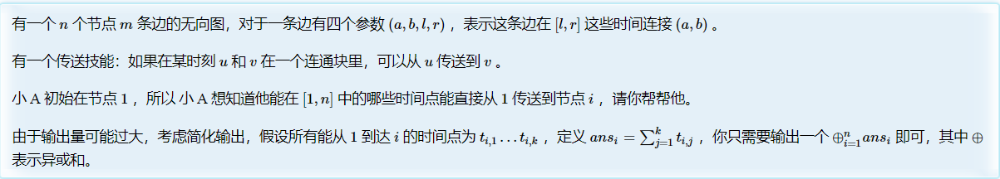
```cpp
#pragma GCC optimize("O3")
#pragma G++ optimize("O3")
#pragma GCC optimize("Ofast")
#pragma GCC optimize("Ofast,unroll-loops")
#include"bits/stdc++.h"
#define ll long long
#define endl '\n'
using namespace std;
constexpr int N=6e5+10,inf=0X3F3F3F3F;
constexpr ll INF=0X3F3F3F3F3F3F3F3F;

ll tag[N];
vector<int>p,siz,op;
void init(int n){
    p.resize(n+1);
    siz.resize(n+1);
    iota(p.begin(),p.end(),0);
    fill(siz.begin(),siz.end(),1);
}
int find(int x){
    return p[x]==x?x:find(p[x]);
}
bool same(int u,int v){
    return find(u)==find(v);
}
bool merge(int u,int v){
    int x=find(u),y=find(v);
    if(x==y)
        return false;
    if(siz[x]<siz[y])
        swap(x,y);
    siz[x]+=siz[y];
    tag[y]-=tag[x];
    p[y]=x;
    op.push_back(y);
    return true;
}
void rollback(int tmp){
    if(tmp>op.size()||tmp<0)
        return;
    while(op.size()>tmp){
        int y=op.back(),x=p[y];
        op.pop_back();
        siz[x]-=siz[y];
        tag[y]+=tag[x];
        p[y]=y;
    }
}

struct node{
    int l,r;
    vector<pair<int,int>>vec;
    // node():l(0),r(0){};
}tr[N<<2];
#define ls p<<1
#define rs p<<1|1
void build(int l,int r,int p=1){
    tr[p].l=l,tr[p].r=r;
    if(l==r){
        return;
    }
    int mid=l+r>>1;
    build(l,mid,ls);
    build(mid+1,r,rs);
}
void update(int x,int y,int l,int r,int p=1){
    if(l<=tr[p].l&&tr[p].r<=r){
        tr[p].vec.push_back({x,y});
        return;
    }
    int mid=tr[p].l+tr[p].r>>1;
    if(l<=mid)
        update(x,y,l,r,ls);
    if(mid<r)
        update(x,y,l,r,rs);

}
void calc(int l,int r,int p=1){
    int tmp=op.size();
    for(auto [x,y]:tr[p].vec)
        merge(x,y);
    if(l==r){
        tag[find(1)]+=l;
        rollback(tmp);
        return;
    }
    int mid=l+r>>1;
    calc(l,mid,ls);
    calc(mid+1,r,rs);
    rollback(tmp);
}
#undef ls
#undef rs

void solve(){
    init(N);
    int n,m;
    cin>>n>>m;
    build(1,n);
    for(int i=1;i<=m;i++){
        int a,b,l,r;
        cin>>a>>b>>l>>r;
        update(a,b,l,r);
    }
    calc(1,n);
    ll ans=0;
    for(int i=1;i<=n;i++)
        ans^=tag[i];
    cout<<ans<<endl;
}
signed main(){
    // freopen("input.in","r",stdin);
    // freopen("output.out","w",stdout);
    cin.tie(nullptr)->sync_with_stdio(0);
//	int t;cin>>t;while(t--)
    solve();
    return 0;
}
```

## 区间最值操作线段树

### 模板

区间取max

```cpp
constexpr int BIT = 30;
constexpr int MX = 1 << BIT;
#define ls p << 1
#define rs p << 1 | 1
struct node {
  int l, r;
  int min1, min2, min1cnt;
  int tag;
  //extra
  
} tr[N << 2];
int a[N];
node merge(node a, node b) {
  node res;
  res.l = a.l, res.r = b.r;
  if (a.min1 == b.min1) {
    res.min1 = a.min1;
    res.min1cnt = a.min1cnt + b.min1cnt;
    res.min2 = min(a.min2, b.min2);
  } else if (a.min1 < b.min1) {
    res.min1 = a.min1;
    res.min1cnt = a.min1cnt;
    res.min2 = min(a.min2, b.min1);
  } else {
    res.min1 = b.min1;
    res.min1cnt = b.min1cnt;
    res.min2 = min(b.min2, a.min1);
  }
  res.tag = MX;
  //extra

  return res;
}
void pushup(int p) { tr[p] = merge(tr[ls], tr[rs]); }
void pushtag(int p, int tag) {
  if (tr[p].min1 >= tag)
    return;
  //extra

  tr[p].min1 = tr[p].tag = tag;
}
void pushdown(int p) {
  if (tr[p].tag == MX)
    return;
  pushtag(ls, tr[p].tag);
  pushtag(rs, tr[p].tag);
  tr[p].tag = MX;
  return;
}
void build(int l, int r, int p = 1) {
  tr[p].l = l, tr[p].r = r;
  if (l == r) {
    tr[p].min1 = a[l];
    tr[p].min1cnt = 1;
    tr[p].min2 = MX;
    tr[p].tag = MX;
    //extra

    return;
  }
  int mid = l + r >> 1;
  build(l, mid, ls);
  build(mid + 1, r, rs);
  pushup(p);
}
void update(int l, int r, int c, int p = 1) {
  if (tr[p].min1 >= c)
    return;
  if (l <= tr[p].l && tr[p].r <= r and tr[p].min2 > c) {
    pushtag(p, c);
    return;
  }
  pushdown(p);
  int mid = tr[p].l + tr[p].r >> 1;
  if (l <= mid)
    update(l, r, c, ls);
  if (mid < r)
    update(l, r, c, rs);
  pushup(p);
}
node query(int l, int r, int p = 1) {
  if (l <= tr[p].l && tr[p].r <= r)
    return tr[p];
  pushdown(p);
  int mid = tr[p].l + tr[p].r >> 1;
  if (l > mid)
    return query(l, r, rs);
  else if (mid >= r)
    return query(l, r, ls);
  else
    return merge(query(l, r, ls), query(l, r, rs));
}
#undef ls
#undef rs
```

## 李超线段树

李超线段树可以维护 给定若干条线段 ，询问这些线段与 x=k 直线相交的最值 类似的问题。

### 给定若干条线段 ，询问这些线段与 x=k 直线相交的最大值

将任务转化为
- 给定一次函数，定义域为 $[l,r]$ 。
- 给定 $k$ ，求定义域包含 $k$ 的所有一次函数中，在 $x=k$ 处取值最大的那个，如果有多个函数取值相同，选编号最小的。

注意，当线段垂直x轴时，插入定义域为 $[x1,x1]$ ，$f(x)=0 \cdot x + max(y1,y2)$ 。

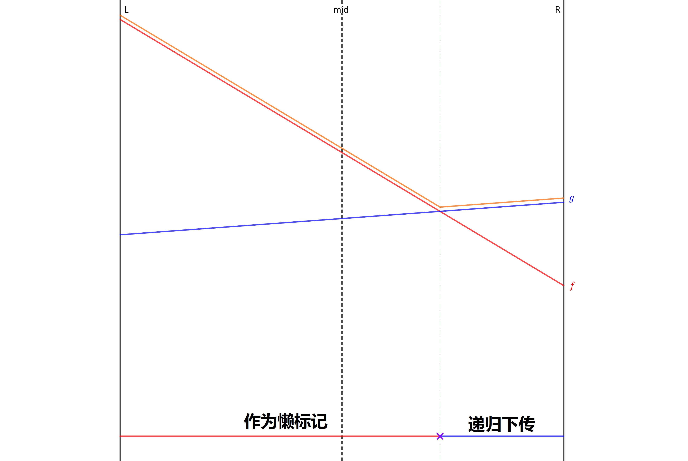

维护懒标记为当前区间对应的线段编号。
记原区间维护的线段为 $f$，新更新的线段为 $g$ ，可以发现，进行更新时，由于两个线段的交点只有一个，所以将区间分为左区间和右区间后，必然至少有一个区间 一个线段是完全优于另一个线段的。那么将分成长度相当的两个区间，最多只有一个区间需要递归更新懒标记。
所以，更新操作的时间复杂度是 $O(log^2)$ 。

查询时间复杂度与正常线段树相当。

```cpp
#include"bits/stdc++.h"
#define endl '\n'
#define fi first
#define se second

using namespace std;
using ll=long long;
using db=double;
using pdi=pair<double,int>;

constexpr int N=(1e5+10)*4;
constexpr int mod1=39989,mod2=1e9;
constexpr double eps=1e-9;

//维护直线的斜率 、截距
struct line{
    double k,b;
}lines[N];

//线段树懒标记 题目输入的线段数量
int tag[N],cnt;


void add(int x1,int y1,int x2,int y2){
    cnt++;
    if(x1==x2)
        lines[cnt].k=0,lines[cnt].b=max(y1,y2);
    else
        lines[cnt].k=1.0*(y1-y2)/(x1-x2),lines[cnt].b=y1-lines[cnt].k*x1;
}

//计算id线段对应的函数值
db calc(int id,int x){
    auto &[k,b]=lines[id];
    return k*x+b;
}

//比大小，大于返回1，小于返回-1，相等为0
int cmp(db x,db y){
    if(x-y>eps)
        return 1;
    if(y-x>eps)
        return -1;
    return 0;
}

//递归更新懒标记
void update_tag(int p,int sl,int sr,int i){
    int &j=tag[p],mid=(sl+sr)/2;

    int bmid=cmp(calc(i,mid),calc(j,mid));
    if(bmid==1 or (bmid==0 and i<j))
        swap(i,j);
    
    int bl=cmp(calc(i,sl),calc(j,sl));
    int br=cmp(calc(i,sr),calc(j,sr));
    if(bl==1 or (bl==0 and i<j))
        update_tag(p*2,sl,mid,i);
    if(br==1 or (br==0 and i<j))
        update_tag(p*2+1,mid+1,sr,i);
}

void update(int p,int sl,int sr,int l,int r,int i){
    if(l<=sl&&sr<=r){
        update_tag(p,sl,sr,i);
        return;
    }
    int mid=(sl+sr)/2;
    if(l<=mid)
        update(p*2,sl,mid,l,r,i);
    if(mid<r)
        update(p*2+1,mid+1,sr,l,r,i);
}

pdi pmax(pdi x,pdi y){
    int res=cmp(x.fi,y.fi);
    if(res==1)
        return x;
    if(res==-1)
        return y;
    return x.se<y.se ? x : y;
}

pdi query(int p,int sl,int sr,int x){
    if(x<sl or sr<x)
        return make_pair(0,0);

    int mid=(sl+sr)/2;
    db res=calc(tag[p],x);
    if(sl==sr)
        return make_pair(res,tag[p]);
    return pmax( make_pair(res,tag[p]) , 
        pmax(query(p*2,sl,mid,x),query(p*2+1,mid+1,sr,x)) );
}

void solve(){
    int n;
    cin>>n;
    int lastans=0;
    while(n--){
        int op;
        cin>>op;
        if(op==1){
            int x1,y1,x2,y2;
            cin>>x1>>y1>>x2>>y2;
            x1=(x1+lastans-1)%mod1+1;
            y1=(y1+lastans-1)%mod2+1;
            x2=(x2+lastans-1)%mod1+1;
            y2=(y2+lastans-1)%mod2+1;
            if(x1>x2){
                swap(x1,x2);
                swap(y1,y2);
            }
            add(x1,y1,x2,y2);
            update(1,1,mod1,x1,x2,cnt);
        }else{
            int x;
            cin>>x;
            x=(x+lastans-1)%mod1+1;
            lastans=query(1,1,mod1,x).se;
            cout<<lastans<<endl;
        }
    }
}
signed main(){
    cin.tie(nullptr)->sync_with_stdio(false);
    // int _=1;cin>>_;while(_--)
    solve();
    return 0;
}
```

## 权值线段树

权值线段树必然需要动态开点，总空间为$O(mlogn)$ m是询问次数，n是值域大小。

### 单点修改+区间查询最大值（数组）

```cpp
#include"bits/stdc++.h"
#define endl '\n'
using ll=long long;
using namespace std;
constexpr int N=1e5+10,inf=0X3F3F3F3F;
constexpr ll INF=0X3F3F3F3F3F3F3F3F;

int ls[N<<5],rs[N<<5],mx[N<<5],rt[N];
int cnt;
void update(int &p,int pos,int c,int l,int r){
    if(!p)
        p=++cnt;
    if(l==r){
        mx[p]=max(mx[p],c);
        return;
    }
    int mid=l+r>>1;
    if(pos<=mid)
        update(ls[p],pos,c,l,mid);
    else
        update(rs[p],pos,c,mid+1,r);
    mx[p]=max(mx[ls[p]],mx[rs[p]]);
}
int query(int p,int ql,int qr,int l,int r){
    if(!p||(ql<=l&&r<=qr))
        return mx[p];
    int mid=l+r>>1;
    int res=0;
    if(ql<=mid)
        res=max(res,query(ls[p],ql,qr,l,mid));
    if(mid<qr)
        res=max(res,query(rs[p],ql,qr,mid+1,r));
    return res;
}
constexpr int U=1e5;
void solve(){
    int n,m;
    cin>>n>>m;
    int ans=0;
    for(int i=1;i<=m;i++){
        int u,v,k,dp;
        cin>>u>>v>>k;
        dp=query(rt[u],0,k-1,0,U)+1;
        update(rt[v],k,dp,0,U);
        ans=max(ans,dp);
    }
    cout<<ans<<endl;
}
signed main(){
    cin.tie(nullptr)->sync_with_stdio(false);
//	int t;cin>>t;while(t--)
    solve();
    return 0;
}
```

### 单点修改+区间查询（结构体）

```cpp
struct tree{
    int l,r;//l,r为左右儿子对应节点
    int val;//维护区间和
}tr[N<<4];
int idx;
void pushup(int p){
    tr[p].val=tr[tr[p].l].val+tr[tr[p].r].val;
}
void update(int l,int r,int pos,int c,int &p){//update(down,up,pos,c,root)
    if(p==0)
        p=++idx;
    if(l==r){
        tr[p].val+=c;
        return;
    }
    int mid=l+r>>1;
    if(pos<=mid)
        update(l,mid,pos,c,tr[p].l);
    else
        update(mid+1,r,pos,c,tr[p].r);
    pushup(p);
}
int query(int l,int r,int L,int R,int p){//query(down,up,ql,qr,root)
    if(!p)
        return 0;
    if(L<=l&&r<=R)
        return tr[p].val;
    int mid=l+r>>1;
    int res=0;
    if(mid>=L)
        res+=query(l,mid,L,R,tr[p].l);
    if(mid<R)
        res+=query(mid+1,r,L,R,tr[p].r);
    return res;
}
```

逆序对

```cpp
#include"bits/stdc++.h"
#define endl '\n'
using ll=long long;
using namespace std;
constexpr int N=5e5+10,inf=0X3F3F3F3F;
constexpr ll INF=0X3F3F3F3F3F3F3F3F;
// #define int ll
struct tree{
    int l,r;//l,r为左右儿子对应节点
    int val;//维护区间和
}tr[N<<4];
int idx;
void pushup(int p){
    tr[p].val=tr[tr[p].l].val+tr[tr[p].r].val;
}
void update(int l,int r,int pos,int c,int &p){//update(down,up,pos,c,root)
    if(p==0)
        p=++idx;
    if(l==r){
        tr[p].val+=c;
        return;
    }
    int mid=l+r>>1;
    if(pos<=mid)
        update(l,mid,pos,c,tr[p].l);
    else
        update(mid+1,r,pos,c,tr[p].r);
    pushup(p);
}
int query(int l,int r,int L,int R,int p){//query(down,up,ql,qr,root)
    if(!p)
        return 0;
    if(L<=l&&r<=R)
        return tr[p].val;
    int mid=l+r>>1;
    int res=0;
    if(mid>=L)
        res+=query(l,mid,L,R,tr[p].l);
    if(mid<R)
        res+=query(mid+1,r,L,R,tr[p].r);
    return res;
}

void solve(){
    int n;
    cin>>n;
    vector<int>a(n+1);
    for(int i=1;i<=n;i++)
        cin>>a[i];
    int root=0;
    ll ans=0;
    for(int i=n;i>=1;i--){
        ans+=query(-inf,inf,-inf,a[i]-1,root);
        update(-inf,inf,a[i],1,root);
    }
    cout<<ans<<endl;    
}
signed main(){
    cin.tie(nullptr)->sync_with_stdio(0);
	// int t;cin>>t;while(t--)
    solve();
    return 0;
}
```

## 可持久化线段树

单点修改可持久化线段树
空间 $O(n*4+n*(\lfloor logn\rfloor +1))$ 。n是数组大小。前者是0版本整个线段树所需要的空间，后者是每次新增版本所添加的节点占用的空间。

区间修改可持久化线段树
空间 $O(n*4+n*logn+mlogn)$ 。懒标记可能占用更多的空间，所以空间开大。

### 求覆盖一个点的前k小区间和（强制在线）

题目描述

最近实验室正在为其管理的超级计算机编制一套任务管理系统，而你被安排完成其中的查询部分。  

超级计算机中的任务用三元组 $(s_i, e_i, p_i)$ 描述，$(s_i, e_i, p_i)$ 表示任务从第 $s_i$ 秒开始，在第 $e_i$ 秒后结束（第 $s_i$ 秒和 $e_i$ 秒任务也在运行），其优先级为 $p_i$。同一时间可能有多个任务同时执行，它们的优先级可能相同，也可能不同。  

调度系统会经常向查询系统询问，第 $x_i$ 秒正在运行的任务中，优先级最小的 $k_i$ 个任务（即将任务按照优先级从小到大排序后取前 $k_i$ 个）的优先级之和是多少。  

特别的，如果 $k_i$ 大于第 $x_i$ 秒正在运行的任务总数，则直接回答第 $x_i$ 秒正在运行的任务优先级之和。上述所有参数均为整数，时间的范围在 $[1, n]$ 之间。

输入格式

输入文件第一行包含两个空格分开的正整数 $m$ 和 $n$，分别表示任务总数和时间范围。  

接下来 $m$ 行，每行包含三个空格分开的正整数 $s_i,e_i,p_i$（$s_i \le e_i$），描述一个任务。  

接下来 $n$ 行，每行包含四个空格分开的整数 $x_i,a_i,b_i,c_i$，描述一次查询。  

**本题强制在线**。查询的参数 $k_i$ 需要由公式 $k_i = 1 +(a_i \times \text{pre}+b_i) \bmod c_i$ 计算得到。其中 $\text{pre}$ 表示上一次查询的结果，定义初始 $\text{pre} = 1$ 。

输出格式

输出共 $n$ 行，每行一个整数，表示查询结果。

题解：转换成差分，在主席树上维护。

```cpp
#include"bits/stdc++.h"
#define endl '\n'
using ll=long long;
using namespace std;
constexpr int N=2e5+10,inf=0X3F3F3F3F;
constexpr ll INF=0X3F3F3F3F3F3F3F3F;

//可持久化权值线段树
int ls[N*34],rs[N*34],cnt[N*34];//cnt记录当前节点出现了几次
ll sum[N*34];//sum记录pos*cnt的和
int node,rt[N];
void update(int lst,int &now,int pos,int c,int l,int r){
    now=++node;
    ls[now]=ls[lst],rs[now]=rs[lst];
    cnt[now]=cnt[lst],sum[now]=sum[lst];
    cnt[now]+=c,sum[now]+=1ll*c*pos;
    if(l==r)
        return;
    int mid=l+r>>1;
    if(pos<=mid)
        update(ls[lst],ls[now],pos,c,l,mid);
    else
        update(rs[lst],rs[now],pos,c,mid+1,r);
}
ll query(int now,int k,int l,int r){//查询版本前k小的和
    if(l==r)
        return sum[now]/cnt[now]*k;//防止数量大于k
    int mid=l+r>>1;
    ll lcnt=cnt[ls[now]];
    if(lcnt>=k)
        return query(ls[now],k,l,mid);
    else
        return query(rs[now],k-lcnt,mid+1,r)+sum[ls[now]];
        //查右子树时加上左子树的所有贡献
}

vector<int>st[N],ed[N];
constexpr int U=1e7;
void solve(){
    int m,n;
    cin>>m>>n;
    for(int i=1,x,y,k;i<=m;i++){
        cin>>x>>y>>k;//区间左右端点 优先级
        st[x].push_back(k);
        ed[y+1].push_back(k);
        //差分上计算贡献
    }
    for(int i=1;i<=n;i++){
        rt[i]=rt[i-1];
        for(auto x:st[i])
            update(rt[i],rt[i],x,1,1,U);
        for(auto x:ed[i])
            update(rt[i],rt[i],x,-1,1,U);
    }
    ll pre=1;
    for(int q=0,x,a,b,c;q<n;q++){
        cin>>x>>a>>b>>c;
        int k=1+(a*pre+b)%c;
        // cerr<<k<<endl;
        if(k>cnt[rt[x]])//k可能大于x点上的任务数量
            pre=sum[rt[x]];
        else
            pre=query(rt[x],k,1,U);//求x版本前k小的和
        cout<<pre<<endl;
    }
}
signed main(){
    cin.tie(nullptr)->sync_with_stdio(false);
//	int t;cin>>t;while(t--)
    solve();
    return 0;
}
```

### 静态区间k小 和 静态区间小于等于k的个数（权值线段树）

清空cnt赋值0即可

```cpp
#include"bits/stdc++.h"
#define endl '\n'
using ll=long long;
using namespace std;
constexpr int N=2e5+10,inf=0X3F3F3F3F;
constexpr ll INF=0X3F3F3F3F3F3F3F3F;

int ls[N*34],rs[N*34];
ll sum[N*34];
int cnt,a[N],rt[N];
void pushup(int now){
    sum[now]=sum[ls[now]]+sum[rs[now]];
}
// int build(int l,int r){
//     int now=++cnt;
//     if(l==r){
//         sum[now]=a[l];
//         return now;
//     }
//     int mid=l+r>>1;
//     ls[now]=build(l,mid);
//     rs[now]=build(mid+1,r);
//     pushup(now);
//     return now;
// }
int update(int lst,int pos,ll c,int l,int r){//arr[pos]+=c lst [l:r]=[Down,Up]
    int now=++cnt;
    ls[now]=ls[lst],rs[now]=rs[lst];
    if(l==r){
        sum[now]=sum[lst]+c;
        return now;
    }
    int mid=l+r>>1;
    if(pos<=mid)
        ls[now]=update(ls[now],pos,c,l,mid);
    else
        rs[now]=update(rs[now],pos,c,mid+1,r);
    pushup(now);
    return now;
}
int qkth(int lst,int now,int kth,int l,int r){//查询第k小数 lst now kth [l:r]
    if(l==r)
        return l;
    int lsize=sum[ls[now]]-sum[ls[lst]];
    int mid=l+r>>1;
    if(lsize>=kth)
        return qkth(ls[lst],ls[now],kth,l,mid);
    else
        return qkth(rs[lst],rs[now],kth-lsize,mid+1,r);
}
int qleq(int lst,int now,int k,int l,int r){//查询小于等于k的数有多少个
    if(l==r)
        return sum[now]-sum[lst];
    int mid=l+r>>1;
    int lsum=sum[ls[now]]-sum[ls[lst]];
    int res=0;
    if(k<=mid)
        res+=qleq(ls[lst],ls[now],k,l,mid);
    else{
        res+=lsum;
        res+=qleq(rs[lst],rs[now],k,mid+1,r);
    }
    return res;
}
constexpr int D=0,U=1e9;

void solve(){
    int n,m;
    cin>>n>>m;
    for(int i=1,val;i<=n;i++){
        cin>>val;
        rt[i]=update(rt[i-1],val,1,D,U);
    }
    while(m--){
        int l,r,k;
        cin>>l>>r>>k;
        cout<<qkth(rt[l-1],rt[r],k,D,U)<<endl;
    }
}
signed main(){
    cin.tie(nullptr)->sync_with_stdio(false);
//	int t;cin>>t;while(t--)
    solve();
    return 0;
}
```

### 可持久化数组（单点查询+单点修改）

题目描述

如题，你需要维护这样的一个长度为 $N$ 的数组，支持如下几种操作

1. 在某个历史版本上修改某一个位置上的值

2. 访问某个历史版本上的某一位置的值

此外，每进行一次操作（**对于操作2，即为生成一个完全一样的版本，不作任何改动**），就会生成一个新的版本。版本编号即为当前操作的编号（从1开始编号，版本0表示初始状态数组）

```cpp
#include"bits/stdc++.h"
#define endl '\n'
using ll=long long;
using namespace std;
constexpr int N=1e6+10,inf=0X3F3F3F3F;//4e6+1e6*20
constexpr ll INF=0X3F3F3F3F3F3F3F3F;
struct node{
    int ls,rs;
    int val;
}tr[N*30];
int cnt,rt[N],a[N];
int build(int L,int R){
    int now=++cnt;
    if(L==R){
        tr[now].val=a[L];
        return now;
    }
    int mid=L+R>>1;
    tr[now].ls=build(L,mid);
    tr[now].rs=build(mid+1,R);
    return now;
}
int update(int lst,int pos,int c,int L,int R){
    int now=++cnt;
    tr[now]=tr[lst];
    if(L==R){
        tr[now].val=c;
        return now;
    }
    int mid=L+R>>1;
    if(pos<=mid)
        tr[now].ls=update(tr[lst].ls,pos,c,L,mid);
    else
        tr[now].rs=update(tr[lst].rs,pos,c,mid+1,R);
    return now;
}
int query(int now,int pos,int L,int R){
    if(L==R)
        return tr[now].val;
    int mid=L+R>>1;
    if(pos<=mid)
        return query(tr[now].ls,pos,L,mid);
    else
        return query(tr[now].rs,pos,mid+1,R);
}
void solve(){
    int n,m;
    cin>>n>>m;
    for(int i=1;i<=n;i++)
        cin>>a[i];
    rt[0]=build(1,n);
    for(int i=1,ver,op,x,y;i<=m;i++){
        cin>>ver>>op;
        if(op==1){
            cin>>x>>y;
            // cerr<<ver<<op<<x<<y<<endl;
            rt[i]=update(rt[ver],x,y,1,n);//在ver版本上将x位置修改成y
        }else{
            cin>>x;
            rt[i]=rt[ver];
            cout<<query(rt[i],x,1,n)<<endl;//查询ver版本x位置的值
        }
    }
}
signed main(){
    cin.tie(nullptr)->sync_with_stdio(false);
//	int t;cin>>t;while(t--)
    solve();
    return 0;
}
```

### 查询静态区间第k小（离散化+单点修改+区间查询）

```cpp
#include"bits/stdc++.h"
#define endl '\n'
using ll=long long;
using namespace std;
constexpr int N=2e5+10,inf=0X3F3F3F3F;
constexpr ll INF=0X3F3F3F3F3F3F3F3F;

struct node{
    int ls,rs,sum;
}tr[N*30];
#define ls(x) tr[x].ls
#define rs(x) tr[x].rs
#define sum(x) tr[x].sum
int rt[N],cnt;
int build(int l,int r){
    int now=++cnt;
    if(l==r)
        return now;
    int mid=l+r>>1;
    ls(now)=build(l,mid);
    rs(now)=build(mid+1,r);
    return now;
}
int insert(int lst,int x,int l,int r){
    int now=++cnt;
    tr[now]=tr[lst];
    sum(now)++;
    if(l==r)
        return now;
    int mid=l+r>>1;
    if(x<=mid)
        ls(now)=insert(ls(lst),x,l,mid);
    else
        rs(now)=insert(rs(lst),x,mid+1,r);
    return now;
}
int query(int lst,int now,int kth,int l,int r){
    if(l==r)
        return l;
    int lsz=sum(ls(now))-sum(ls(lst));
    int mid=l+r>>1;
    if(lsz>=kth)
        return query(ls(lst),ls(now),kth,l,mid);
    else
        return query(rs(lst),rs(now),kth-lsz,mid+1,r);
}
void solve(){
    int n,m;
    cin>>n>>m;
    vector<int>a(n+1),b(n+1);
    for(int i=1;i<=n;i++){
        cin>>a[i];
        b[i]=a[i];
    }
    sort(b.begin()+1,b.end());
    b.erase(unique(b.begin()+1,b.end()),b.end());
    int szb=b.size()-1;
    rt[0]=build(1,szb);
    for(int i=1;i<=n;i++){
        int kth=lower_bound(b.begin()+1,b.end(),a[i])-b.begin();
        rt[i]=insert(rt[i-1],kth,1,szb);
    }
    while(m--){
        int l,r,kth;
        cin>>l>>r>>kth;
        cout<<b[query(rt[l-1],rt[r],kth,1,szb)]<<endl;
    }
}
signed main(){
    cin.tie(nullptr)->sync_with_stdio(false);
//	int t;cin>>t;while(t--)
    solve();
    return 0;
}
```

### 可持久化数组（区间修改+区间查询历史版本+修改版本）（非标记永久化）

一个长度为 $N$ 的数组 $\{A\}$，$4$ 种操作 ：

- `C l r d`：区间 $[l,r]$ 中的数都加 $d$ ，同时当前的时间戳加 $1$。

- `Q l r`：查询当前时间戳区间 $[l,r]$ 中所有数的和 。

- `H l r t`：查询时间戳 $t$ 区间 $[l,r]$ 的和 。

- `B t`：将当前时间戳置为 $t$ 。

　　所有操作均合法 。

ps：刚开始时时间戳为 $0$

```cpp
#include"bits/stdc++.h"
#define endl '\n'
using ll=long long;
using namespace std;
constexpr int N=1e5+10,inf=0X3F3F3F3F;
constexpr ll INF=0X3F3F3F3F3F3F3F3F;

struct node{
    int ls,rs;
    ll tag,sum;
}tr[N*100];
#define ls(x) tr[x].ls
#define rs(x) tr[x].rs
#define tag(x) tr[x].tag
#define sum(x) tr[x].sum
int cnt,a[N],rt[N];
int clone(int q){
    int p=++cnt;
    tr[p]=tr[q];
    return p;
}
void lazy(int p,ll val,int len){
    sum(p)+=val*len;
    tag(p)+=val;
}
void pushup(int p){
    sum(p)=sum(ls(p))+sum(rs(p));
}
void pushdown(int p,int ln,int rn){
    if(tag(p)){
        ls(p)=clone(ls(p));
        rs(p)=clone(rs(p));
        lazy(ls(p),tag(p),ln);
        lazy(rs(p),tag(p),rn);
        tag(p)=0;
    }
}
int build(int l,int r){
    int p=++cnt;
    if(l==r){
        sum(p)=a[l];
        return p;
    }
    int mid=l+r>>1;
    ls(p)=build(l,mid);
    rs(p)=build(mid+1,r);
    pushup(p);
    return p;
}
int update(int q,int l,int r,ll c,int L,int R){//上个版本，询问区间，值，线段树区间
    int p=clone(q);
    if(l<=L&&R<=r){
        lazy(p,c,R-L+1);
        return p;
    }
    int mid=L+R>>1;
    pushdown(p,mid-L+1,R-mid);
    if(l<=mid)
        ls(p)=update(ls(p),l,r,c,L,mid);
    if(mid<r)
        rs(p)=update(rs(p),l,r,c,mid+1,R);
    pushup(p);
    return p;
}
ll query(int p,int l,int r,int L,int R){//询问版本，询问区间，线段树区间
    if(l<=L&&R<=r)
        return sum(p);
    int mid=L+R>>1;
    pushdown(p,mid-L+1,R-mid);
    ll res=0;
    if(l<=mid)
        res+=query(ls(p),l,r,L,mid);
    if(mid<r)
        res+=query(rs(p),l,r,mid+1,R);
    return res;
}

void solve(){
    int n,m;
    cin>>n>>m;
    for(int i=1;i<=n;i++)
        cin>>a[i];
    int t=0;
    rt[t]=build(1,n);
    while(m--){
        char op;
        cin>>op;
        if(op=='C'){
            int l,r,d;
            cin>>l>>r>>d;
            rt[t+1]=update(rt[t],l,r,d,1,n);
            t++;
        }else if(op=='Q'){
            int l,r;
            cin>>l>>r;
            cout<<query(rt[t],l,r,1,n)<<endl;
        }else if(op=='H'){
            int l,r,x;
            cin>>l>>r>>x;
            cout<<query(rt[x],l,r,1,n)<<endl;
        }else{
            int x;
            cin>>x;
            t=x;
        }
    }
}
signed main(){
    cin.tie(nullptr)->sync_with_stdio(false);
//	int t;cin>>t;while(t--)
    solve();
    return 0;
}
```

### 可持久化数组（区间修改+区间查询历史版本+修改版本）（标记永久化）

标记永久化减少空间占用。
总空间 $O(n*4+nlogn)$ 。懒标记不再新增节点，查询不占用空间。

```cpp
#include"bits/stdc++.h"
#define endl '\n'
// #define int ll
using ll=long long;
using namespace std;
constexpr int N=1e5+10,inf=0X3F3F3F3F;
constexpr ll INF=0X3F3F3F3F3F3F3F3F;

int ls[N*25],rs[N*25];
ll tag[N*25],sum[N*25];
int cnt,a[N],rt[N];
int clone(int q){
    int p=++cnt;
    ls[p]=ls[q];
    rs[p]=rs[q];
    tag[p]=tag[q];
    sum[p]=sum[q];
    return p;
}
int build(int l,int r){
    int p=++cnt;
    tag[p]=0;
    if(l==r){
        sum[p]=a[l];
        return p;
    }
    int mid=l+r>>1;
    ls[p]=build(l,mid);
    rs[p]=build(mid+1,r);
    sum[p]=sum[ls[p]]+sum[rs[p]];
    return p;
}
int update(int q,int l,int r,ll c,int L,int R){//上个版本，询问区间，值，线段树区间
    int p=clone(q);
    int x=max(l,L),y=min(r,R);
    sum[p]+=c*(y-x+1);//并非真实累加和，不考虑上方的任务，只考虑当前范围和往下走的，累加和变成什么
    if(l<=L&&R<=r){
        tag[p]+=c;//不是懒标记信息，变成标记信息
        return p;
    }
    int mid=L+R>>1;
    if(l<=mid)
        ls[p]=update(ls[p],l,r,c,L,mid);
    if(mid<r)
        rs[p]=update(rs[p],l,r,c,mid+1,R);
    return p;
}
ll query(int p,int l,int r,ll add,int L,int R){//询问版本，询问区间，线段树区间
    if(l<=L&&R<=r)
        return sum[p]+add*(R-L+1);
    add+=tag[p];
    int mid=L+R>>1;
    ll res=0;
    if(l<=mid)
        res+=query(ls[p],l,r,add,L,mid);
    if(mid<r)
        res+=query(rs[p],l,r,add,mid+1,R);
    return res;
}

void solve(){
    int n,m;
    while(cin>>n>>m){
        cnt=0;
        // cin>>n>>m;
        for(int i=1;i<=n;i++)
            cin>>a[i];
        int t=0;
        rt[t]=build(1,n);
        while(m--){
            char op;
            cin>>op;
            if(op=='C'){
                int l,r,d;
                cin>>l>>r>>d;
                rt[t+1]=update(rt[t],l,r,d,1,n);
                t++;
            }else if(op=='Q'){
                int l,r;
                cin>>l>>r;
                cout<<query(rt[t],l,r,0,1,n)<<endl;
            }else if(op=='H'){
                int l,r,x;
                cin>>l>>r>>x;
                cout<<query(rt[x],l,r,0,1,n)<<endl;
            }else{
                int x;
                cin>>x;
                t=x;
            }
        }
        cout<<endl;
    }
}
signed main(){
    cin.tie(nullptr)->sync_with_stdio(false);
//	int t;cin>>t;while(t--)
    solve();
    return 0;
}
```

### 查询静态区间第k小

```cpp
constexpr int N=2e5+10,M=1e6+10;
struct node{
    int sum=0;
    int l=0,r=0;
}tr[M*30];
#define ls(x) (tr[x].l)
#define rs(x) (tr[x].r)
#define sum(x) tr[x].sum
int tot=1;
int root[N],a[N],n,m;
void pushup(int x){
    sum(x)=sum(ls(x))+sum(rs(x));
}
void update(int last,int now,int pos,int k,int l,int r){
    //过去的节点 现在的节点 修改的位置，k ，当前节点表示的区间[l,r]
    if(l==r){
        sum(now)=sum(last)+k;
    }else{
        ls(now)=ls(last);
        rs(now)=rs(last);
        int mid=(l+r-1)/2;
        if(pos<=mid){
            ls(now)=++tot;
            update(ls(last),ls(now),pos,k,l,mid);
        }else{
            rs(now)=++tot;
            update(rs(last),rs(now),pos,k,mid+1,r);
        }
        pushup(now);
    }
}
constexpr int up=1e9+5,down=-1e9-5;
void update(int last,int now,int pos,int k){
    update(last,now,pos,k,down,up);
}
int kth(int last,int now,int k,int l,int r){
    if(l==r)
        return l;
    int mid=(l+r-1)/2;
    int val=sum(ls(now))-sum(ls(last));
    if(val>=k)
        return kth(ls(last),ls(now),k,l,mid);
    else
        return kth(rs(last),rs(now),k-val,mid+1,r);
}
int kth(int last,int now,int k){//root[l-1],root[r],k查询[l,r]区间的第k小
    return kth(last,now,k,down,up);
}


void solve(){
    int n,m;
    cin>>n>>m;
    for(int i=1;i<=n;i++){
        cin>>a[i];
        root[i]=++tot;
        update(root[i-1],root[i],a[i],1);
    }
    while(m--){
        int l,r,k;
        cin>>l>>r>>k;
        cout<<kth(root[l-1],root[r],k)<<endl;
    }
}
```

### 静态区间查询小于等于k的数量与大于k的数量

```cpp
constexpr int N=2e5+10,M=1e6+10;
struct node{
    int sum=0;
    int l=0,r=0;
}tr[M*30];
#define ls(x) (tr[x].l)
#define rs(x) (tr[x].r)
#define sum(x) tr[x].sum
int tot=1;
int root[N],a[N],n,m;
void pushup(int x){
    sum(x)=sum(ls(x))+sum(rs(x));
}
void update(int last,int now,int pos,int k,int l,int r){
    //过去的节点 现在的节点 修改的位置，k ，当前节点表示的区间[l,r]
    if(l==r){
        sum(now)=sum(last)+k;
    }else{
        ls(now)=ls(last);
        rs(now)=rs(last);
        int mid=(l+r-1)/2;
        if(pos<=mid){
            ls(now)=++tot;
            update(ls(last),ls(now),pos,k,l,mid);
        }else{
            rs(now)=++tot;
            update(rs(last),rs(now),pos,k,mid+1,r);
        }
        pushup(now);
    }
}
constexpr int up=1e9+5,down=-1e9-5;
void update(int last,int now,int pos,int k){
    update(last,now,pos,k,down,up);
}
int kth(int last,int now,int k,int l,int r){
    if(l==r)
        return l;
    int mid=(l+r-1)/2;
    int val=sum(ls(now))-sum(ls(last));
    if(val>=k)
        return kth(ls(last),ls(now),k,l,mid);
    else
        return kth(rs(last),rs(now),k-val,mid+1,r);
}
int kth(int last,int now,int k){//root[l-1],root[r],k,查询[l,r]区间的第k小
    return kth(last,now,k,down,up);
}
int query(int last,int now,int k,int l,int r){
    if(l==r)
        return sum(now)-sum(last);
    int mid=(l+r-1)/2;
    int val=sum(ls(now))-sum(ls(last));
    int res=0;
    if(k<=mid)
        res+=query(ls(last),ls(now),k,l,mid);
    else{
        res+=val;
        res+=query(rs(last),rs(now),k,mid+1,r);
    }
    return res;
}
int upperk(int l,int r,int k){//l,r,k,查询[l,r]区间的大于k的数量
    return r-l+1-query(root[l-1],root[r],k,down,up);
}
int lesseqk(int l,int r,int k){//l,r,k,查询[l,r]区间的小于等于k的数量
    return query(root[l-1],root[r],k,down,up);
}
```

### 查询a<=l<=b ,c<=r<=d的数组区间lr的中位数

偶数时中位数是靠后的那一个。
a<=b<=c<=d
思路是二分答案，小于标记-1，大于等于标记1，求b+1~c-1的区间和 加 a~b最大后缀和 加 c~d最大前缀和 的值大于等于0的最大值。（若中位数定义偶数是靠前的一个，那么改成二分大于0的最大值）

空间多开点，比较玄学。

```cpp
#include"bits/stdc++.h"
#define endl '\n'
using ll=long long;
using namespace std;
constexpr int N=2e5+10,inf=0X3F3F3F3F;
constexpr ll INF=0X3F3F3F3F3F3F3F3F;

int n;
int node,ls[N*40],rs[N*40],rt[N];
struct cry{
    int lmx,rmx,sum;
}mx[N*40];
cry merge(cry a,cry b){
    cry r;
    r.lmx=max(a.lmx,a.sum+b.lmx);
    r.rmx=max(b.rmx,a.rmx+b.sum);
    r.sum=a.sum+b.sum;
    return r;
}
void build(int &now,int l,int r){
    now=++node;
    mx[now].lmx=mx[now].sum=mx[now].rmx=r-l+1;
    if(l==r)
        return;
    int mid=l+r>>1;
    build(ls[now],l,mid);
    build(rs[now],mid+1,r);
}
void update(int lst,int &now,int pos,int l,int r){
    now=++node;
    ls[now]=ls[lst],rs[now]=rs[lst];
    mx[now]=mx[lst];
    if(l==r){
        mx[now].lmx=mx[now].rmx=mx[now].sum=-1;
        return;
    }
    int mid=l+r>>1;
    if(pos<=mid)
        update(ls[lst],ls[now],pos,l,mid);
    else
        update(rs[lst],rs[now],pos,mid+1,r);
    mx[now]=merge(mx[ls[now]],mx[rs[now]]);
}
cry query(int now,int ql,int qr,int l,int r){
    if(ql<=l&&r<=qr)
        return mx[now];
    int mid=l+r>>1;
    if(ql>mid)
        return query(rs[now],ql,qr,mid+1,r);
    else if(mid>=qr)
        return query(ls[now],ql,qr,l,mid);
    else
        return merge(query(ls[now],ql,qr,l,mid),query(rs[now],ql,qr,mid+1,r));
}
bool check(int k,int a,int b,int c,int d){
    int res=0;
    if(b==c)
        res-=query(rt[k],b,c,1,n).sum;
    else if(b+1<=c-1)
        res+=query(rt[k],b,c,1,n).sum;
    res+=query(rt[k],a,b,1,n).rmx;
    res+=query(rt[k],c,d,1,n).lmx;
    return res>=0;
}

void solve(){
    node=0;
    cin>>n;
    vector<int>a(n+1),id(n+1);
    iota(id.begin(),id.end(),0);
    for(int i=1;i<=n;i++)
        cin>>a[i];

    sort(id.begin()+1,id.end(),[&](int i,int j){
        return a[i]<a[j];
    });
    build(rt[1],1,n);
    for(int i=2;i<=n;i++)
        update(rt[i-1],rt[i],id[i-1],1,n);

    int q;
    cin>>q;
    while(q--){
        int A,B,C,D;
        cin>>A>>B>>C>>D;

        int l=1,r=n;
        while(l<r){
            int mid=l+r+1>>1;
            if(check(mid,A,B,C,D))
                l=mid;
            else
                r=mid-1;
        }

        int ans=a[id[l]];
        cout<<ans<<endl;
    }
}
signed main(){
    cin.tie(nullptr)->sync_with_stdio(false);
	int t;cin>>t;while(t--)
    solve();
    return 0;
}
```

## 树套树

### 动态区间k小（树状数组套可持久化线段树）

给定一个含有 n 个数的序列 a1​,a2​…an​，需要支持两种操作：

- `Q l r k` 表示查询下标在区间 [l,r] 中的第 k 小的数
- `C x y` 表示将 ax​ 改为 y

解析：静态区间最小可以想到用主席树做。但是对不支持修改，因为修改过后后续版本都必须改变。
考虑每个用树状数组去维护，第i颗线段树维护的是原来可持久化线段树【i-lowbit（i）+1，i】版本的所有线段树合并之后的线段树。第i颗线段树内部节点维护的是【i-lowbit（i）+1，i】版本线段树同样位置节点的权值和。
每次修改依据树状数组对log颗线段树修改，查询对log个线段树查询。
故使用树状数组+可持久化线段树+离散化进行维护。

时间复杂度$O(nlog^2 n)$ 

```cpp
#include"bits/stdc++.h"
#define endl '\n'
using ll=long long;
using namespace std;
constexpr int N=2e5+10,inf=0X3F3F3F3F;
constexpr ll INF=0X3F3F3F3F3F3F3F3F;

int ls[N*100],rs[N*100],sum[N*100];
int tmpl[60],tmpr[60],cntl,cntr;
int cnt,a[N],rt[N],b[N];
int n,m,tot;
void update(int &p,int pos,int val,int l,int r){
    if(!p)
        p=++cnt;
    if(l==r){
        sum[p]+=val;
        return;
    }
    int mid=l+r>>1;
    if(pos<=mid)
        update(ls[p],pos,val,l,mid);
    else
        update(rs[p],pos,val,mid+1,r);
    sum[p]=sum[ls[p]]+sum[rs[p]];
}
int query(int kth,int l,int r){
    if(l==r)
        return b[l];
    int siz=0,mid=l+r>>1;
    for(int i=1;i<=cntr;i++)
        siz+=sum[ls[tmpr[i]]];
    for(int i=1;i<=cntl;i++)
        siz-=sum[ls[tmpl[i]]];
    if(siz>=kth){
        for(int i=1;i<=cntr;i++)
            tmpr[i]=ls[tmpr[i]];
        for(int i=1;i<=cntl;i++)
            tmpl[i]=ls[tmpl[i]];
        return query(kth,l,mid);
    }else{
        for(int i=1;i<=cntr;i++)
            tmpr[i]=rs[tmpr[i]];
        for(int i=1;i<=cntl;i++)
            tmpl[i]=rs[tmpl[i]];
        return query(kth-siz,mid+1,r);
    }
}
int q1(int l,int r,int k){
    cntl=cntr=0;
    for(int i=r;i;i-=i&-i)
        tmpr[++cntr]=rt[i];
    for(int i=l-1;i;i-=i&-i)
        tmpl[++cntl]=rt[i];
    return query(k,1,tot);
}
int find(int x){
    return lower_bound(b+1,b+1+tot,x)-b;
}
void update(int pos,int val){
    int x=find(a[pos]);
    for(int i=pos;i<=n;i+=i&-i)
        update(rt[i],x,val,1,tot);
}
struct tmp{
    char op;
    int a,b,c;
}t[N];
void solve(){
    cin>>n>>m;
    for(int i=1;i<=n;i++){
        cin>>a[i];
        b[++tot]=a[i];
    }
    for(int i=1;i<=m;i++){
        cin>>t[i].op;
        if(t[i].op=='Q')
            cin>>t[i].a>>t[i].b>>t[i].c;
        else{
            cin>>t[i].a>>t[i].b;
            b[++tot]=t[i].b;
        }
    }

    sort(b+1,b+tot+1);
    tot=unique(b+1,b+tot+1)-b-1;

    for(int i=1;i<=n;i++)
        update(i,1);

    for(int i=1;i<=m;i++){
        auto &[op,x,y,z]=t[i];
        if(op=='Q'){
            cout<<q1(x,y,z)<<endl;
        }else{
            update(x,-1);
            a[x]=y;
            update(x,1);
        }
    }
}
signed main(){
    cin.tie(nullptr)->sync_with_stdio(false);
//	int t;cin>>t;while(t--)
    solve();
    return 0;
}
```

## 并查集

1.将两个集合合并
2.询问两个元素是否在一个集合当中

### 路径压缩并查集

```cpp
struct dsu{
    vector<int>p;
    dsu(int _n):p(_n+1){
        iota(p.begin(),p.end(),0);
    }
    void init(int n){
        p.resize(n+1);
        iota(p.begin(),p.end(),0);
    }
    int find(int x){
        return p[x]==x?x:p[x]=find(p[x]);
    }
    bool same(int u,int v){
        return find(u)==find(v);
    }
    bool merge(int u,int v){
        int x=find(u),y=find(v);
        if(x==y)
            return false;
        p[y]=x;
        return true;
    }
};
```

### 启发式合并并查集

```cpp
struct dsu{
    vector<int>p,siz;
    dsu(int _n):p(_n+1),siz(_n+1){
        iota(p.begin(),p.end(),0);
        fill(siz.begin(),siz.end(),1);
    }
    void init(int n){
        p.resize(n+1);
        siz.resize(n+1);
        iota(p.begin(),p.end(),0);
        fill(siz.begin(),siz.end(),1);
    }
    int find(int x){
        return p[x]==x?x:find(p[x]);
    }
    bool same(int u,int v){
        return find(u)==find(v);
    }
    bool merge(int u,int v){
        int x=find(u),y=find(v);
        if(x==y)
            return false;
        if(siz[x]<siz[y])
            swap(x,y);
        siz[x]+=siz[y];
        p[y]=x;
        return true;
    }
    int size(int x){
        return siz[find(x)];
    }

};
```

### 可撤销并查集

```cpp
struct rollingdsu{
    vector<int>p,siz,op;
    rollingdsu(int _n):p(_n+1),siz(_n+1){
        iota(p.begin(),p.end(),0);
        fill(siz.begin(),siz.end(),1);
    }
    void init(int n){
        p.resize(n+1);
        siz.resize(n+1);
        iota(p.begin(),p.end(),0);
        fill(siz.begin(),siz.end(),1);
    }
    int find(int x){
        return p[x]==x?x:find(p[x]);
    }
    bool same(int u,int v){
        return find(u)==find(v);
    }
    bool merge(int u,int v){
        int x=find(u),y=find(v);
        if(x==y)
            return false;
        if(siz[x]<siz[y])
            swap(x,y);
        siz[x]+=siz[y];
        p[y]=x;
		op.push_back(y);
        return true;
    }
    void rollback(int tmp){
        if(tmp>op.size()||tmp<0)
            return;
        while(op.size()>tmp){
            int y=op.back(),x=p[y];
            op.pop_back();
            siz[x]-=siz[y];
            p[y]=y;
        }
    }
};
```

### 按秩合并

```cpp
void union(int x,int y)
{
    x=find(x);							//寻找 x的代表元
    y=find(y);							//寻找 y的代表元
    if(x==y) return ;					//如果 x和 y的代表元一致，说明他们共属同一集合，则不需要合并，直接返回；否则，执行下面的逻辑
    if(rank[x]>rank[y]) pre[y]=x;		//如果 x的高度大于 y，则令 y的上级为 x
    else								//否则
    {
        if(rank[x]==rank[y]) rank[y]++;	//如果 x的高度和 y的高度相同，则令 y的高度加1
        pre[x]=y;						//让 x的上级为 y
    }
}
```

## ST 表

st表利用倍增思想维护区间信息，预处理 $O(nlogn)$ 询问每次 $O(1)$ 。

以区间最值为例
$f_{i,j}$ 维护的是区间 $[i,i+2^j-1]$ 的区间最值。$lg$ 数组维护数的二进制下位数个数。
查询区间 $[l,r]$ 时，记 $k=lg[r-l+1]$ ，则答案在$\{ f_{l,k} , f_{r-2^k+1,k} \}$ 中取到。

```cpp
constexpr int logN=20;
int lg[N],f[N][logN],a[N];
void init(int n){
    lg[0]=-1,lg[1]=0;
    for(int i=2;i<N;i++)
        lg[i]=lg[i/2]+1;
    for(int i=1;i<=n;i++)
        f[i][0]=a[i];//[i,i]<-a[i]
    for(int j=1;j<logN;j++)
        for(int i=1;i+(1<<j)-1<=n;i++)
            f[i][j]=max(f[i][j-1],f[i+(1<<(j-1))][j-1]);
}
int query(int l,int r){
    int k=lg[r-l+1];
    return max(f[l][k],f[r-(1<<k)+1][k]);
}
```

```cpp
template<typename T>
class st {
    using functype = function<T(const T &, const T &)>;

    vector<vector<T>>ST;
    static T func(const T &x, const T &y) {
        return max(x, y);
    }
    functype op;

public:
    st(const vector<T> &v, functype _func = func) :op(_func) {
        int len = v.size(), l1 = __lg(len) + 1;
        ST.assign(len, vector<T>(l1, {}));
        for (int i = 0;i < len;i++)
            ST[i][0] = v[i];
        for (int j = 1;j < l1;j++) {
            int pj = (1 << (j - 1));
            for (int i = 0;i + pj < len;i++) {
                ST[i][j] = op(ST[i][j - 1], ST[i + (1 << (j - 1))][j - 1]);
            }
        }
    }

    T query(int l, int r) {
        int q = __lg(r - l + 1);
        return op(ST[l][q], ST[r - (1 << q) + 1][q]);
    }
};
```
最小值示例
```cpp
int n;
cin >> n;
vector<int>a(n + 1);
iota(a.begin(), a.end(), 0);
st<int> rmq(a, [](auto a, auto b) {
		return min(a, b);
	});
cout << rmq.query(4, 5);
```

### 头插（尾插）st表

普通st表只能维护静态数组。可以注意到，i位置维护的值只受大于等于i位置的值的影响。所以我们可以进行头部插入值，然后log维护f数组。同理，也可以维护尾部插入的数组。

下面以尾部插入为例：

定义 $f_{i,j}$ 维护区间 $[i-2^j+1,i]$ 区间的最值，可以写出以下代码

```cpp
constexpr int logN=18;
int lg[N],f[N][logN];
void init(){
    lg[0]=-1,lg[1]=0;
    for(int i=2;i<N;i++)
        lg[i]=lg[i/2]+1;
}
void insert(int i,int val){
    f[i][0]=val;
    for(int j=1;i-(1<<j)+1>=1;j++)
        f[i][j]=max(f[i][j-1],f[i-(1<<(j-1))][j-1]);
}
int query(int l,int r){
    int k=lg[r-l+1];
    return max(f[r][k],f[l+(1<<k)-1][k]);
}
```

## 树状数组

### 模板

```cpp
struct fenwick{//只能维护[0,_n)
    int _n;
    vector<int>v;
    fenwick(){};
    fenwick(int n){
        _n=n;
        v.resize(_n);
    };
    void init(int n){
        _n=n;
        v.resize(_n);
        v.assign(_n,0);
    }
    int lowbit(int x){return ((x)&(-x));};
    void add(int x,int c){
        for(int i=x+1;i<=_n;i+=lowbit(i))
            v[i-1]+=c;
    };
    int sum(int x){
        int res=0;
        for(int i=x+1;i;i-=lowbit(i))
            res+=v[i-1];
        return res;
    };
    int sum(int l,int r){//[l,r]
        return l>r?0:sum(r)-sum(l-1);
    }
};
```

### 树状数组求逆序对数

[P1908 逆序对](https://www.luogu.com.cn/problem/P1908)
给定序列，求逆序对个数
```cpp
#include"bits/stdc++.h"
#define TY09
#define ll long long
#define endl '\n'
using namespace std;
#define int ll
constexpr int N=5e5+10;
// struct fenwick{
    int tr[N];
    int lowbit(int x){
        return ((x)&(-x));
    }
    void update(int x,int c){
        while(x<=N){
            tr[x]+=c;
            x+=lowbit(x);
        }
    }
    int sum(int x){
        int res=0;
        while(x>0){
            res+=tr[x];
            x-=lowbit(x);
        }
        return res;
    }
    void init(int n,auto a){
        for(int i=1;i<=n;i++){
            update(i,a[i]);
        }
    }
// }t;
void IMSB(){
	int n;
    cin>>n;
    vector<int>a(n+1);
    for(int i=1;i<=n;i++)
        cin>>a[i];
    vector<int>b=a;
    sort(b.begin()+1,b.end());
    for(int i=1;i<=n;i++)
        a[i]=lower_bound(b.begin()+1,b.end(),a[i])-b.begin();
    int cnt=0;
    for(int i=n;i;i--){
        update(a[i],1);
        cnt+=sum(a[i]-1);
    }
    cout<<cnt<<endl;
}
signed main(){
	ios::sync_with_stdio(0),cin.tie(nullptr),cout.tie(nullptr);
	// int t;cin>>t;while(t--)
		IMSB();
	return 0;
}
```

### 树状数组求区间最值

```cpp
int tr[N],a[N];
int n;
int lowbit(int x){
    return (x)&(-x);
}
void update(int x,int c){
    while(x<=n){
        tr[x]=c;
        for(int i=1;i<lowbit(x);i<<=1)
            tr[x]=max(tr[x],tr[x-i]);
        x+=lowbit(x);
    }
}
int ask(int l,int r){
    int res=0;
    while(r>=l){
        res=max(res,a[r]);
        r--;
        while(r-l>=lowbit(r)){
            res=max(res,tr[r]);
            r-=lowbit(r);
        }
    }
    return res;
}
```

### 二维树状数组 单点加+查询子矩阵和

```cpp
void add(int x, int y, int v) {
  for (int i = x; i <= n; i += lowbit(i)) {
    for (int j = y; j <= m; j += lowbit(j)) {
      // 注意这里必须得建循环变量，不能像一维数组一样直接 while (x <= n) 了
      c[i][j] += v;
    }
  }
}
int sum(int x, int y) {
  int res = 0;
  for (int i = x; i > 0; i -= lowbit(i)) {
    for (int j = y; j > 0; j -= lowbit(j)) {
      res += c[i][j];
    }
  }
  return res;
}

int ask(int x1, int y1, int x2, int y2) {
  // 查询子矩阵和
  return sum(x2, y2) - sum(x2, y1 - 1) - sum(x1 - 1, y2) + sum(x1 - 1, y1 - 1);
}
```

### 二维树状数组 子矩阵加+求子矩阵和

```cpp
using ll = long long;
ll t1[N][N], t2[N][N], t3[N][N], t4[N][N];

void add(ll x, ll y, ll z) {
  for (int X = x; X <= n; X += lowbit(X))
    for (int Y = y; Y <= m; Y += lowbit(Y)) {
      t1[X][Y] += z;
      t2[X][Y] += z * x;  // 注意是 z * x 而不是 z * X，后面同理
      t3[X][Y] += z * y;
      t4[X][Y] += z * x * y;
    }
}

void range_add(ll xa, ll ya, ll xb, ll yb,
               ll z) {  //(xa, ya) 到 (xb, yb) 子矩阵
  add(xa, ya, z);
  add(xa, yb + 1, -z);
  add(xb + 1, ya, -z);
  add(xb + 1, yb + 1, z);
}

ll ask(ll x, ll y) {
  ll res = 0;
  for (int i = x; i; i -= lowbit(i))
    for (int j = y; j; j -= lowbit(j))
      res += (x + 1) * (y + 1) * t1[i][j] - (y + 1) * t2[i][j] -
             (x + 1) * t3[i][j] + t4[i][j];
  return res;
}

ll range_ask(ll xa, ll ya, ll xb, ll yb) {
  return ask(xb, yb) - ask(xb, ya - 1) - ask(xa - 1, yb) + ask(xa - 1, ya - 1);
}
```

## 莫队

### 普通莫队

n为数组大小，m为询问大小，如果答案能从 $O(1)$ 从 $[l,r]$ 扩展到 $[l+1,r] ,[l,r-1],[l-1,r],[l,r+1]$ ，则 $O(n\sqrt n)$ 时间复杂度求出答案。

离线后排序，顺序处理每个询问，暴力从上一个区间的答案转移到下一个区间答案（一步一步移动即可）。

对于区间 $[l,r]$ , 以 $l$ 所在块的编号为第一关键字，$r$ 为第二关键字从小到大排序。

n与m同阶，块大小取 $\sqrt n$ ；m<n，块大小取 $\frac{n}{\sqrt m}$ 。

循环顺序不要更改 l++,r--,l--,r++;


例题：
小B 有一个长为 $n$ 的整数序列 $a$，值域为 $[1,k]$。  
他一共有 $m$ 个询问，每个询问给定一个区间 $[l,r]$，求：  
$$\sum\limits_{i=1}^k c_i^2$$

其中 $c_i$ 表示数字 $i$ 在 $[l,r]$ 中的出现次数。  
小B请你帮助他回答询问。

```cpp
#include"bits/stdc++.h"
#define endl '\n'
using ll=long long;
using namespace std;
constexpr int N=1e5+10,inf=0X3F3F3F3F;
constexpr ll INF=0X3F3F3F3F3F3F3F3F;

ll res,cnt[N],ans[N],a[N];

int sz;
struct query{
    int l,r,id;
    bool operator<(const query &o)const{
        if(l/sz!=o.l/sz)
            return l<o.l;
        return (l/sz)&1?r<o.r:r>o.r;
    }
}q[N];
void add(int x){
    res+=2*cnt[x]+1;
    cnt[x]++;
}
void del(int x){
    res-=2*cnt[x]-1;
    cnt[x]--;
}

void solve(){
    int n,m,k;
    cin>>n>>m>>k;
    for(int i=1;i<=n;i++){
        cin>>a[i];
    }
    for(int i=1;i<=m;i++){
        cin>>q[i].l>>q[i].r;
        q[i].id=i;
    }

    sz=sqrt(n);
    sort(q+1,q+1+m);

    for(int i=1,l=1,r=0;i<=m;i++){
        while(l<q[i].l)
            del(a[l++]);
        while(r>q[i].r)
            del(a[r--]);
        while(l>q[i].l)
            add(a[--l]);
        while(r<q[i].r)
            add(a[++r]);
        ans[q[i].id]=res;
    }

    for(int i=1;i<=m;i++)
        cout<<ans[i]<<endl;
}
signed main(){
    cin.tie(nullptr)->sync_with_stdio(false);
//	int t;cin>>t;while(t--)
    solve();
    return 0;
}
```
### 回滚莫队

有的题目在进行区间转移时，增加的时候可以计算答案，但是删除的时候无法计算答案；或者删除的时候可以计算，增加时不行。这时候就可以用回滚莫队，只在增加（删除）的时候计算答案，删除（增加）的时候不记录答案

n与m同阶，块大小取 $\sqrt n$ ；m<n，块大小取 $\frac{n}{\sqrt m}$ 。
排序方法与普通莫队相同，但注意不要使用奇偶性优化。

过程：
- 对原序列进行分块，对询问按以左端点所属块编号升序为第一关键字，右端点升序为第二关键字的方式排序。
- 按顺序处理询问：
    - 如果询问左端点所属块 B 和上一个询问左端点所属块的不同，那么将莫队区间的左端点初始化为 B 的右端点加 1, 将莫队区间的右端点初始化为 B 的右端点；
    - 如果询问的左右端点所属的块相同，那么直接扫描区间回答询问；
    - 如果询问的左右端点所属的块不同：
        - 如果询问的右端点大于莫队区间的右端点，那么不断扩展右端点直至莫队区间的右端点等于询问的右端点；
        - 不断扩展莫队区间的左端点直至莫队区间的左端点等于询问的左端点；
        - 回答询问；
        - 撤销莫队区间左端点的改动，使莫队区间的左端点回滚到 B 的右端点加 1。

可以证明时间复杂队为 $O(n\sqrt m)$。

例题：给你一个长度为n的数组 A 和 m 个询问 （1<=n,m<=1e5)，每次询问一个区间 [l,r] 内重要度最大的数字，要求 **输出其重要度**。一个数字 x 重要度的定义为 x 乘上 x 在区间内出现的次数。

```cpp
#include"bits/stdc++.h"
#define endl '\n'
using ll=long long;
using namespace std;
constexpr int N=1e5+10,inf=0X3F3F3F3F;
constexpr ll INF=0X3F3F3F3F3F3F3F3F;

ll ans[N];
int cnt[N],cnt1[N],a[N],b[N];

int pos[N];//key是第几个块
int sz,tot;//块的大小 总共有几个块
struct query{
    int l,r,ind;
    bool operator<(const query &o)const{
        return pos[l]^pos[o.l]?l<o.l:r<o.r;
    };
}Q[N];
void add(int x,ll &res){//增加函数，只在增加的时候计算答案
    cnt[x]++;
    res=max(res,1ll*cnt[x]*b[x]);
}
void del(int x){//删除函数
    cnt[x]--;
}
ll calc(int l,int r){//暴力计算答案
    ll ans1=0;
    for(int i=l;i<=r;i++)
        cnt1[a[i]]++;
    for(int i=l;i<=r;i++)
        ans1=max(ans1,1ll*cnt1[a[i]]*b[a[i]]);
    for(int i=l;i<=r;i++)//暴力清空
        cnt1[a[i]]=0;
    return ans1;
}

void solve(){
    //输入 莫队初始化
    int n,m;
    cin>>n>>m;
    sz=sqrt(n);
    for(int i=1;i<=n;i++){
        cin>>a[i];
        pos[i]=(i-1)/sz+1;
        b[i]=a[i];
    }
    for(int i=1;i<=m;i++){
        cin>>Q[i].l>>Q[i].r;
        Q[i].ind=i;
    }
    sort(Q+1,Q+1+m);

    //离散化
    sort(b+1,b+1+n);
    int blen=unique(b+1,b+1+n)-(b+1);
    for(int i=1;i<=n;i++)
        a[i]=lower_bound(b+1,b+1+blen,a[i])-b;
    
    //莫队过程
    for(int i=1,j=1;i<=pos[n];i++){
        int R=min(i*sz,n),l=R+1,r=R;
        ll lstres=0;
        for(int i=1;i<=n;i++)//暴力清空
            cnt[a[i]]=0;
        for(;j<=m&&pos[Q[j].l]==i;j++){
            auto [ql,qr,id]=Q[j];
            if(pos[ql]==pos[qr]){//在一个块内暴力计算
                ans[id]=calc(ql,qr);
                continue;
            }       
            while(r<qr)//扩展右端点，保留贡献
                add(a[++r],lstres);
            ll res=lstres;//从保留的贡献开始计算答案       
            while(l>ql)//扩展左端点，不保留贡献
                add(a[--l],res);
            ans[id]=res;//记录答案
            while(l<=R)//回滚
                del(a[l++]);
        }
    }
    
    for(int i=1;i<=m;i++)
        cout<<ans[i]<<endl;
}
signed main(){
    cin.tie(nullptr)->sync_with_stdio(false);
//	int t;cin>>t;while(t--)
    solve();
    return 0;
}
```

```cpp
#include"bits/stdc++.h"
#define endl '\n'
using ll=long long;
using namespace std;
constexpr int N=1e5+10,inf=0X3F3F3F3F;
constexpr ll INF=0X3F3F3F3F3F3F3F3F;

int pos[N],L[N],R[N];//key是第几个块 第key块的左端点 第key块的右端点
int sz,tot;//块的大小 总共有几个块
struct query{
    int l,r,ind;
    bool operator<(const query &o)const{
        if(pos[l]!=pos[o.l])
            return pos[l]<pos[o.l];
        return r<o.r;
    };
}Q[N];

ll ans[N];
int cnt[N],cnt1[N],a[N],b[N];

void add(int x,ll &res){//增加函数，只在增加的时候计算答案
    cnt[x]++;
    res=max(res,1ll*cnt[x]*b[x]);
}
void del(int x){//删除函数
    cnt[x]--;
}

void solve(){
    //输入
    int n,m;
    cin>>n>>m;
    for(int i=1;i<=n;i++){
        cin>>a[i];
        b[i]=a[i];
    }
    for(int i=1;i<=m;i++){
        cin>>Q[i].l>>Q[i].r;
        Q[i].ind=i;
    }

    //莫队初始化
    int sz=sqrt(n);
    tot=n/sz;
    for(int i=1;i<=tot;i++){
        L[i]=(i-1)*sz+1;
        R[i]=i*sz;
    }
    if(R[tot]<n){
        tot++;
        L[tot]=(tot-1)*sz+1;
        R[tot]=n;
    }
    for(int i=1;i<=tot;i++){
        for(int j=L[i];j<=R[i];j++)
            pos[j]=i;
    }
    sort(Q+1,Q+1+m);

    //离散化
    sort(b+1,b+1+n);
    int blen=unique(b+1,b+1+n)-(b+1);
    for(int i=1;i<=n;i++)
        a[i]=lower_bound(b+1,b+1+blen,a[i])-b;
    
    //莫队过程
    int l=1,r=0,lstb=0,l1=1;
    ll res=0,tmp=0;
    for(int i=1;i<=m;i++){
        auto [ql,qr,ind]=Q[i];

        //询问左右端点在同一个块中，暴力计算
        if(pos[ql]==pos[qr]){
            for(int i=ql;i<=qr;i++)
                cnt1[a[i]]++;
            for(int i=ql;i<=qr;i++)
                ans[ind]=max(ans[ind],1ll*cnt1[a[i]]*b[a[i]]);
            for(int i=ql;i<=qr;i++)//暴力清空
                cnt1[a[i]]=0;
            continue;
        }

        //访问到新的块，初始化莫队区间
        if(pos[ql]!=lstb){//暴力把[1,n]的会影响的全部清空
            for(int i=1;i<=n;i++)
                cnt[a[i]]=0;
            r=R[pos[ql]],l=R[pos[ql]]+1;
            res=0;
            lstb=pos[ql];
        }

        //扩展右端点
        while(r<qr)
            add(a[++r],res);
        l1=l;
        tmp=res;
        
        //扩展左端点，扩展左端点后需要回滚删除
        while(l1>ql)
            add(a[--l1],tmp);
        ans[ind]=tmp;

        //回滚删除
        while(l1<l)
            del(a[l1++]);
    }
    
    for(int i=1;i<=m;i++)
        cout<<ans[i]<<endl;
}
signed main(){
    cin.tie(nullptr)->sync_with_stdio(false);
//	int t;cin>>t;while(t--)
    solve();
    return 0;
}
```

### 带修莫队

带修莫队块大小开 $n^{(2/3)}$ 。时间复杂度 $O(n^{5/3})$ 。
需要添加一维时间轴，来对应应用和撤销修改。

---

题目大意：给你一个序列，M 个操作，有两种操作：

修改序列上某一位的数字
询问区间 $[l,r]$ 中数字的种类数（多个相同的数字只算一个）

---

```cpp
#include"bits/stdc++.h"  // 包含几乎所有标准库
#define endl '\n'        // 定义换行符别名
using ll=long long;      // 定义长整型别名
using namespace std;     // 使用标准命名空间
constexpr int N=1e6+10,inf=0X3F3F3F3F;  // 定义常量：数组最大长度和无穷大整数
constexpr ll INF=0X3F3F3F3F3F3F3F3F;    // 定义长整型无穷大

int mp[N];  // 哈希表，记录元素出现次数
struct qry{  // 查询结构体
    int ind,l,r,t;  // ind:查询编号，l,r:查询区间，t:时间戳(修改次数)
};
struct opr{  //修改操作结构体
    int pos,val;  // pos:修改位置，val:修改后的值
};
void solve(){
    int n,m;
    cin>>n>>m;  // 输入数组长度和操作总数
    int sz=pow(n,2.0/3);  // 计算块大小，三维莫队块大小为n^(2/3)
    vector<int>a(n+1);  // 原数组
    for(int i=1;i<=n;i++)  // 输入数组元素
        cin>>a[i];

    vector<qry>q(1);  // 查询数组，下标从1开始
    vector<opr>o(1);  // 修改操作数组，下标从1开始
    int qcnt=0,ocnt=0;  // 查询计数器和修改计数器
    while(m--){  // 处理所有操作
        char op;
        int x,y;
        cin>>op>>x>>y;
        if(op=='Q'){  // 查询操作
            qcnt++;
            q.push_back({qcnt,x,y,ocnt});  // 记录查询信息
        }else{  // 修改操作
            ocnt++;
            o.push_back({x,y});  // 记录修改信息
        }
        // cerr<<op<<' '<<x<<y<<endl;  // 调试用输出
    }

    // 对查询进行排序
    sort(q.begin()+1,q.end(),[&](auto a,auto b){
        if(a.l/sz!=b.l/sz){  // 按左端点所在块排序
            return a.l<b.l;
        }else if(a.r/sz!=b.r/sz){  // 左端点块相同，按右端点所在块排序
            return a.r<b.r;
        }else{  // 左右端点块都相同，按时间戳排序
            return a.t<b.t;
        }
    });

    int cnt=0;  // 当前区间不同元素的数量
    auto add=[&](int x){  // 添加元素到当前区间
        if(mp[x]==0)  // 如果元素首次出现
            cnt++;    // 不同元素数量+1
        mp[x]++;      // 增加元素计数
    };
    auto del=[&](int x){  // 从当前区间删除元素
        mp[x]--;          // 减少元素计数
        if(mp[x]==0)      // 如果元素计数变为0
            cnt--;        // 不同元素数量-1
    };

    vector<int>ans(qcnt+1);  // 存储查询结果
    int L=1,R=0,T=0;  // 当前区间左右端点和当前时间戳
    for(int i=1;i<=qcnt;i++){  // 处理每个查询
        auto [id,l,r,t]=q[i];  // 解构查询信息
        
        // 调整当前区间左右端点，使其与查询区间匹配
        while(L<l) del(a[L++]);  // 收缩左边界
        while(R>r) del(a[R--]);  // 收缩右边界
        while(L>l) add(a[--L]);  // 扩展左边界
        while(R<r) add(a[++R]);  // 扩展右边界
        
        // 调整时间戳，应用修改操作
        while(T<t){  // 当前时间小于查询时间，需要应用更多修改
            T++;
            if(L<=o[T].pos&&o[T].pos<=R){  // 如果修改位置在当前区间内
                add(o[T].val);             // 添加新值
                del(a[o[T].pos]);          // 删除旧值
            }
            swap(o[T].val,a[o[T].pos]);    // 执行修改(交换值)
        }
        while(T>t){  // 当前时间大于查询时间，需要撤销修改
            if(L<=o[T].pos&&o[T].pos<=R){  // 如果修改位置在当前区间内
                add(o[T].val);             // 添加旧值(当前值的旧版本)
                del(a[o[T].pos]);          // 删除新值(当前值的新版本)
            }
            swap(o[T].val,a[o[T].pos]);    // 撤销修改(交换回去)
            T--;
        }
        ans[id]=cnt;  // 记录当前查询结果
    }

    for(int i=1;i<=qcnt;i++)  // 输出所有查询结果
        cout<<ans[i]<<endl;
}
signed main(){
    cin.tie(nullptr)->sync_with_stdio(false);  // 优化输入输出
    solve();  // 调用主处理函数
    return 0;
}

```


## splay树

[https://www.luogu.com.cn/problem/P3369](https://www.luogu.com.cn/problem/P3369)
> 【模板】普通平衡树

题目描述


您需要写一种数据结构（可参考题目标题），来维护一些数，其中需要提供以下操作：

1. 插入一个数 $x$。
2. 删除一个数 $x$（若有多个相同的数，应只删除一个）。
3. 定义**排名**为比当前数小的数的个数 $+1$。查询 $x$ 的排名。
4. 查询数据结构中排名为 $x$ 的数。
5. 求 $x$ 的前驱（前驱定义为小于 $x$，且最大的数）。
6. 求 $x$ 的后继（后继定义为大于 $x$，且最小的数）。

对于操作 3,5,6，**不保证**当前数据结构中存在数 $x$。
输入格式


第一行为 $n$，表示操作的个数,下面 $n$ 行每行有两个数 $\text{opt}$ 和 $x$，$\text{opt}$ 表示操作的序号（ $1 \leq \text{opt} \leq 6$）
输出格式


对于操作 $3,4,5,6$ 每行输出一个数，表示对应答案。
```cpp
#include"bits/stdc++.h"
#define ll long long
#define endl '\n'
using namespace std;
constexpr int N=1e5+10,inf=(1<<30)+1;
constexpr ll INF=0X3F3F3F3F3F3F3F3F;

#define ls(x) tr[x].s[0]
#define rs(x) tr[x].s[1]
struct node{
    int s[2];//儿子
    int p;//父亲
    int v;//权值
    int sz;//子树大小
    int cnt;//出现次数
    void init(int p1,int v1){
        p=p1;
        v=v1;
        sz=cnt=1;
    }
}tr[N];
int root,tot;//根，节点个数
void pushup(int x){//上传
    tr[x].sz=tr[ls(x)].sz+tr[rs(x)].sz+tr[x].cnt;
}
void rotate(int x){//旋转
    int y=tr[x].p,z=tr[y].p;
    int k=(tr[y].s[1]==x);//y的右儿子是x

    tr[z].s[tr[z].s[1]==y]=x;//z是x的父亲，x是z的儿子
    tr[x].p=z;

    tr[y].s[k]=tr[x].s[k^1];//y的儿是x的异儿,x的异儿的父是y
    tr[tr[x].s[k^1]].p=y;

    tr[x].s[k^1]=y;//x的异儿是y,y的父是x
    tr[y].p=x;

    pushup(y);//自底向上push
    pushup(x);
}
void splay(int x,int k){//伸展，x节点为k节点的儿子
    while(tr[x].p!=k){//折线转xx,直线转yx
        int y=tr[x].p,z=tr[y].p;
        if(z!=k){
            if((ls(y)==x)^(ls(z)==y))
                rotate(x);
            else
                rotate(y);
        }
        rotate(x);
    }
    if(!k)//k=0时,x转到根
        root=x;
}
void insert(int v){//插入
    int x=root,p=0;
    while(x&&tr[x].v!=v){//x走到空节点或走到目标点结束
        p=x;
        x=tr[x].s[v>tr[x].v];
    }
    if(x)//目标点
        tr[x].cnt++;
    else{//空节点
        x=++tot;
        tr[p].s[v>tr[p].v]=x;
        tr[x].init(p,v);
    }
    splay(x,0);
}
void find(int v){//找到v并且转到根
    int x=root;
    while(tr[x].s[v>tr[x].v]&&v!=tr[x].v)
        x=tr[x].s[v>tr[x].v];
    splay(x,0);
}
int getpre(int v){//找到前驱
    find(v);
    int x=root;
    if(tr[x].v<v)
        return x;
    x=ls(x);
    while(rs(x))
        x=rs(x);
    splay(x,0);
    return x;
}
int getsuc(int v){//找到后继
    find(v);
    int x=root;
    if(tr[x].v>v)
        return x;
    x=rs(x);
    while(ls(x))
        x=ls(x);
    splay(x,0);
    return x;
}
void del(int v){//删除
    int pre=getpre(v);
    int suc=getsuc(v);
    splay(pre,0);
    splay(suc,pre);
    int del=tr[suc].s[0];
    if(tr[del].cnt>1){
        tr[del].cnt--;
        splay(del,0);
    }else{
        tr[suc].s[0]=0;
        splay(suc,0);
    }
}
int getrank(int v){//排名
    insert(v);
    int res=tr[tr[root].s[0]].sz;
    del(v);
    return res;
}
int getval(int k){//数值
    int x=root;
    while(true){
        if(k<=tr[ls(x)].sz)
            x=ls(x);
        else if(k<=tr[ls(x)].sz+tr[x].cnt)
            break;
        else{
            k-=tr[ls(x)].sz+tr[x].cnt;
            x=rs(x);
        }
    }
    splay(x,0);
    return tr[x].v;
}

void solve(){
    insert(-inf),insert(inf);//哨兵
    int n;
    cin>>n;
    for(int i=0;i<n;i++){
        int op,x;
        cin>>op>>x;
        if(op==1)
            insert(x);
        else if(op==2)
            del(x);
        else if(op==3)
            cout<<getrank(x)<<endl;
        else if(op==4)
            cout<<getval(x+1)<<endl;
        else if(op==5)
            cout<<tr[getpre(x)].v<<endl;
        else if(op==6)
            cout<<tr[getsuc(x)].v<<endl;
    }
}
signed main(){
    cin.tie(nullptr)->sync_with_stdio(0);
//  int t;cin>>t;while(t--)
    solve();
    return 0;
}
```

## 树上启发式合并

```cpp
vector<int>g[N];
int siz[N],son[N];//清零时需要把son数组重新赋值为0（多测）
void dfs0(int u,int p){//维护重儿子
    siz[u]=1;
    son[u]=0;//多测清零
    for(auto v:g[u]){
        if(v==p)
            continue;
        dfs0(v,u);
        siz[u]+=siz[v];
        if(siz[son[u]]<siz[v])
            son[u]=v;
    }
}
void dfs1(int u,int p,bool keep){//dsu on tree
    for(auto v:g[u]){
        if(v==p||v==son[u])
            continue;
        dfs1(v,u,false);
    }
    if(son[u])
        dfs1(son[u],u,true);

    for(auto v:g[u]){
        if(v==p||v==son[u])
            continue;

		/*计算轻儿子的贡献、暴力合并*/
    }
    
	/*继承重儿子的贡献，计算当前节点的贡献，合并当前节点*/
    if(keep==false){
        
		/*删除轻儿子所在子树*/
	}
}
```
 给一棵根为 $1$ 的有根树，点 $i$具有一个权值$A_i$。
定义一个点对的值$f(u,v)=max(A_u,A_v)×|A_u−A_v|$。
你需要对于每个节点 $i$ ，计算 $ans_i=∑_{u∈subtree(i),v∈subtree(i)}f(u,v)$，其中 $subtree(i)$ 表示 $i$ 的子树。
请你输出$⊕(ans_i\ mod\ 2^{64})$ ，其中$⊕$表示 XOR。  
```cpp
#include"bits/stdc++.h"
#define ll long long
#define endl '\n'
using namespace std;
constexpr int N=5e5+10,inf=0X3F3F3F3F;
constexpr ll INF=0X3F3F3F3F3F3F3F3F;
#define ull unsigned ll
vector<int>g[N];
ull s[N],t[N],a[N];
int siz[N],son[N];
struct fenwick{
    ull tr[1000010];
    int lowbit(int x){
        return ((x)&(-x));
    }
    void update(int x,ull c){
        while(x<1000010){
            tr[x]+=c;
            x+=lowbit(x);
        }
    }
    ull sum(int x){
        ull res=0;
        while(x>0){
            res+=tr[x];
            x-=lowbit(x);
        }
        return res;
    }
}tc,tkk;

void dfs0(int u,int p){
    s[u]=a[u];
    siz[u]=1;
    for(auto v:g[u]){
        if(v==p)
            continue;
        dfs0(v,u);
        s[u]+=s[v];
        siz[u]+=siz[v];
        if(siz[son[u]]<siz[v])
            son[u]=v;
    }
}

void change(int u,int p,int val){
    tc.update(a[u],val);
    tkk.update(a[u],val*a[u]*a[u]);
    for(auto v:g[u]){
        if(v==p)
            continue;
        change(v,u,val);
    }
}
void calc(int u,int p,int rt){
    t[rt]+=2ull*(tc.sum(a[u]))*a[u]*a[u]+2ull*(tkk.sum(1000001)-tkk.sum(a[u]));
    for(auto v:g[u]){
        if(v==p)
            continue;
        calc(v,u,rt);
    }
}
void dfs1(int u,int p,bool keep){
    for(auto v:g[u]){
        if(v==p||v==son[u])
            continue;
        dfs1(v,u,false);
    }
    if(son[u])
        dfs1(son[u],u,true);

    for(auto v:g[u]){
        if(v==p||v==son[u])
            continue;
        t[u]+=t[v];
        calc(v,u,u);
        change(v,u,1);
    }

    t[u]+=t[son[u]];
    t[u]+=2ull*(tc.sum(a[u]))*a[u]*a[u]+a[u]*a[u]+2ull*(tkk.sum(1000001)-tkk.sum(a[u]));
    tc.update(a[u],1);
    tkk.update(a[u],a[u]*a[u]);

    if(keep==false)
        change(u,p,-1);
}
void solve(){
    int n;
    cin>>n;
    for(int i=1;i<n;i++){
        int u,v;
        cin>>u>>v;
        g[u].push_back(v);
        g[v].push_back(u);
    }
    for(int i=1;i<=n;i++)
        cin>>a[i];

    dfs0(1,0);
    dfs1(1,0,false);

    ull res=0;
    for(int i=1;i<=n;i++)
        res^=(t[i]-s[i]*s[i]);
    cout<<res<<endl;
}
signed main(){
    cin.tie(nullptr)->sync_with_stdio(0);
//	int t;cin>>t;while(t--)
    solve();
    return 0;
}
```


# 数学

# 计算几何

### 给定若干条直线，求下凸包

给定若干条直线后，排除掉 直线上所有点都有比它低的直线 这样不优的直线。那么我们得到这样的序列后，就可以通过二分求出某个自变量对于的在所有直线上最优的函数值。

```cpp
//放入所有线段，第一项为斜率，第二项为截距，保证斜率为负。
vector<pair<int, long long>> lines;
for (int i = 0; i < m; i ++) {
	if (dis1[us[i]] != inf && dis2[vs[i]] != inf) {
		lines.emplace_back(-ts[i], dis1[us[i]] + dis2[vs[i]] + ws[i]);
	}
}

//斜率从小到大排序，与x轴平行的直线斜率最大。
sort(lines.rbegin(), lines.rend());

//放入上界，斜率最大的直线。
vector<pair<int, long long>> convex_hull;
convex_hull.emplace_back(0, dis1[n - 1]);

//倒数第一是斜率最小的直线，倒数第二是斜率第二小的直线，跟当前直线（斜率小于前二者）
//分别记为l2,l1,l。如果l1与l2的交点在l与l2的交点的右边，则说明l2不优，需要去除
for (auto [k, y]: lines) {
	while (convex_hull.size() > 1) {
		auto [k1, y1] = convex_hull[convex_hull.size() - 2];
		auto [k2, y2] = convex_hull[convex_hull.size() - 1];
		if ((__int128_t)1 * (y1 - y2) * (k2 - k) <= (__int128_t)1 * (y2 - y) * (k1 - k2)) convex_hull.pop_back();
		else break;
	}
	convex_hull.emplace_back(k, y);
}

int l = convex_hull.size();

auto f = [&] (int i, int t) -> long long {
	if (i < 0 || i >= l) return inf;
	return 1ll * t * convex_hull[i].first + convex_hull[i].second;
};

int q;
cin >> q;

while (q --) {
	int time;
	cin >> time;

	//二分去判断最优解（实际上是三分）
	int left = 0, right = l - 2;
	while (left <= right) {
		int mid = (left + right) / 2;
		if (f(mid, time) >= f(mid + 1, time)) left = mid + 1;
		else right = mid - 1;
	}

	cout << f(left, time) << '\n';
}
```

### 计算函数图象的曲线长度

要求 函数 $f(x)$ 在区间 $[l,r]$ 的曲线长度，即求 $\int_{l}^{r}\sqrt{1+f'(x)^2}dx$ 

## 切比雪夫距离

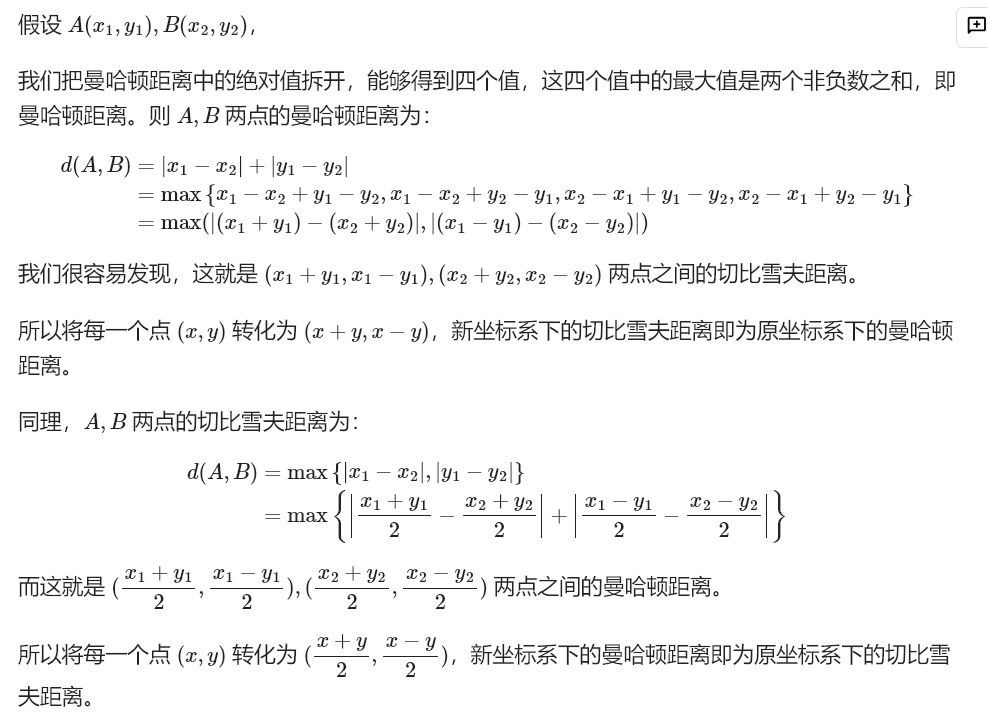

## 求垂直平分线一般式方程

$Ax+By+C=0$ 

```cpp
array<ll,3> get(ll x1,ll y1,ll x2,ll y2){//传入两点坐标，返回系数
    ll A=2*(x2-x1),B=2*(y2-y1),C=x1*x1-x2*x2+y1*y1-y2*y2;
    ll g=gcd(gcd(A,B),C);
    A/=g,B/=g,C/=g;
    if(A==0 and B<0){
        A=-A;
        B=-B;
        C=-C;
    }else if(A<0){
        A=-A;
        B=-B;
        C=-C;
    }
    return {A,B,C};
}
```

## 给定三个点求解圆心和半径

圆的一般方程为
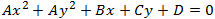
需要注意，如果三个点共线，那么这三个点肯定无法形成圆，这一问题可通过上式的A来判定，A=0说明三点共线
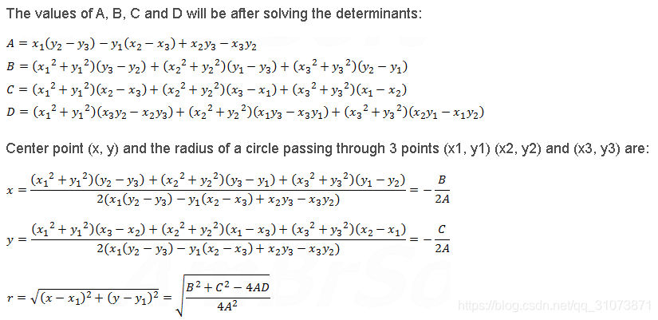

```cpp
	long double x1=x[i],x2=x[j],x3=x[k];
	long double y1=y[i],y2=y[j],y3=y[k];
	long double A=x1*(y2-y3)-y1*(x2-x3)+x2*y3-x3*y2,
	B=(x1*x1+y1*y1)*(y3-y2)+(x2*x2+y2*y2)*(y1-y3)+(x3*x3+y3*y3)*(y2-y1),
	C=(x1*x1+y1*y1)*(x2-x3)+(x2*x2+y2*y2)*(x3-x1)+(x3*x3+y3*y3)*(x1-x2),
	D=(x1*x1+y1*y1)*(x3*y2-x2*y3)+(x2*x2+y2*y2)*(x1*y3-x3*y1)+(x3*x3+y3*y3)*(x2*y1-x1*y2);
	if(abs(A)<=eps)
		continue;
	long double ox=-B/(2*A),oy=-C/(2*A),r=sqrtl((powl(B,2)+powl(C,2)-4*A*D)/(4*powl(A,2)));
```

# 动态规划

## 只允许合并的换根dp

通常的换根dp既允许将子树的信息合并到父树上，也允许从父树中拆除子树的信息。
若信息只允许合并不允许拆除，也可以进行换根dp。

对于当前点u和父亲p和儿子v而言，将u为根的子树转换为v为根的子树，u会拆去v的信息，v会合并 u拆除v信息后的信息。

注意到，u将原除v外所有儿子的信息合并，再合并上p来的方向上的信息，再合并节点本身的信息，即是新u子树的信息。那么新v子树的信息就是原v子树的信息合并上新u子树的信息。
（注意考虑边权的影响）。

这样做的难点在于如何快速合并除v以外所有儿子子树的信息，以及如何获得p来的方向的信息。前者可以通过前缀和以及后缀和来解决，将v的 最长真前缀 和 最长真后缀 合并。后者与p新子树的信息相同，深搜时可以信息传递。

于是便解决的只允许合并的换根dp，可以证明时间复杂度仍与普通的换根dp相同。

### 例题

给定一棵具有$n$个顶点的带边权树，以及$k$个特殊顶点$c_1, c_2, \dots, c_k$，你需要选择某个顶点$x$和一个参数$d$，并使得$\sum_{i=1}^k \frac{\text{dis}(x, c_i)}{d}$最小化，且对于所有的$i$都有$d \mid \text{dis}(x, c_i)$。这里$\text{dis}(x, c_i)$表示顶点$x$与顶点$c_i$之间的距离。

解析：对于点x而言，求出所有特殊点的距离和 它们的最大公约数即可，d选择最大公约数即可。

我们可以维护每个特殊点到根的距离和，然后进行换根dp，即可以维护以所有点为根的特殊点的距离和。

实际上，我们可以用类似的方法计算$\gcd\{\text{dis}(x, c_i)\}$。我们可以计算从$x$到其子树中特殊顶点的所有距离的最大公约数，并使用类似的方法来计算答案。

我们唯一要做的是维护集合$S = \{a_1, a_2, \ldots, a_m\}$的最大公约数。我们需要支持合并两个集合以及给集合中的所有元素加上某个整数$w$。 

我们通过维护两个整数来表示集合的最大公约数： $f = a_1$，$g = \gcd\{a_2 - a_1, a_3 - a_1, \ldots, a_m - a_1\}$。

那么给所有元素加上$w$时，我们可以将$(f, g)$变为$(f + w, g)$，合并两个集合$(f_1, g_1)$和$(f_2, g_2)$会得到$(f_1, \gcd\{g_1, g_2, f_2 - f_1\})$。 

可以发现信息只能合并，不能拆分，那么使用上述技巧即可。

(原题要求输出答案的2倍。)

```cpp
#include "bits/stdc++.h"
#define endl '\n'

using namespace std;
using ll = long long;

constexpr int N = 5e5 + 10;
constexpr int inf = 0X3F3F3F3F;
constexpr ll INF = 0X3F3F3F3F3F3F3F3F;

vector<pair<int, int>> adj[N];
struct Node {
  int cnt;
  ll sd, f, g;
  Node() : cnt(0), sd(0), f(0), g(0) {};
  Node(int cnt, ll sd, ll f, ll g) : cnt(cnt), sd(sd), f(f), g(g) {};
  Node operator+(ll w) {
    if (!cnt)
      return Node();
    return Node(cnt, sd + cnt * w, f + w, g);
  }
  Node operator+(Node o) {
    if (!cnt and !o.cnt)
      return Node();
    if (!cnt)
      return o;
    if (!o.cnt)
      return *this;
    return Node(cnt + o.cnt, sd + o.sd, f, gcd(gcd(g, o.g), o.f - f));
  };
  Node operator+=(Node o) { return (*this) = (*this) + o; };
} dp[N];

int key[N];
ll ans = INF;

void dfs0(int u, int p) {
  dp[u].cnt = key[u];
  for (auto [v, w] : adj[u]) {
    if (v == p)
      continue;
    dfs0(v, u);
    dp[u] += (dp[v] + w);
  }
}

void dfs1(int u, int p, Node dpp) {
  {
    auto [cnt, sd, f, g] = dp[u];
    // assert(cnt == k);
    ans = min(ans, sd / gcd(f, g));
  }

  vector<pair<int, int>> nadj;
  for (auto [v, w] : adj[u]) {
    if (v == p) {
      dpp = dpp + w;
      continue;
    }
    nadj.emplace_back(v, w);
  }
  int k = nadj.size();
  vector<Node> pre(k), suf(k);
  for (int i = 0; i < k; i++) {
    auto [v, w] = nadj[i];
    if (i != 0)
      pre[i] = pre[i - 1] + (dp[v] + w);
    else
      pre[i] = dp[v] + w;
  }
  for (int i = k - 1; i >= 0; i--) {
    auto [v, w] = nadj[i];
    if (i != k - 1)
      suf[i] = suf[i + 1] + (dp[v] + w);
    else
      suf[i] = dp[v] + w;
  }

  auto tdpu = dp[u];
  for (int i = 0; i < k; i++) {
    auto [v, w] = nadj[i];
    auto tdpv = dp[v];

    Node ndpu{key[u], 0, 0, 0};
    ndpu += dpp;
    if (i != 0)
      ndpu += pre[i - 1];
    if (i + 1 < k)
      ndpu += suf[i + 1];
    dp[v] += ndpu + w;
    dp[u] = ndpu;
    dfs1(v, u, dp[u]);
    dp[u] = tdpu;
    dp[v] = tdpv;
  }
}

signed main() {

  cin.tie(nullptr)->sync_with_stdio(false);
  int n, k;
  cin >> n >> k;
  for (int i = 0; i < k; i++) {
    int u;
    cin >> u;
    u--;
    key[u] = true;
  }
  for (int i = 1; i < n; i++) {
    int u, v, w;
    cin >> u >> v >> w;
    u--, v--;
    adj[u].emplace_back(v, w);
    adj[v].emplace_back(u, w);
  }
  if (k == 1) {
    cout << 0 << endl;
    return;
  }
  dfs0(0, -1);
  dfs1(0, -1, Node());
  cout << ans * 2 << endl;

  return 0;
}
```

另一种写法：
dpin记录子树内部的信息，dpout记录从父亲来的方向子树的信息

例题：给定无根树，可以删除一条边后加上一条边，操作后需要仍是一棵树，问操作后每个点是否能作为重心

解析：考虑以x为根。如果x所有儿子子树大小都小于等于n/2，说明可以；否则只有需要在大于n/2的儿子子树（这样的子树最多一个）中选择它其中 最大的 不超过n/2的 子树大小，如果两者相减小于等于n/2，说明可以（断开后合并到x上），否则不可以。

那么维护子树信息只需要维护子树大小 子树超过n/2大小的儿子子树大小 子树小于等于n/2 最大儿子子树大小。 发现容易合并到父亲上，而且兄弟之间也可以合并。故使用换根dp。

```cpp
#include "bits/stdc++.h"
#define endl '\n'

using namespace std;
using ll = long long;

constexpr int N = 4e5 + 10;

int n;
struct Node {
  int siz, mxup, mxlow;
  Node() : siz(0), mxup(-1), mxlow(-1) {};
  Node(int siz, int mxup, int mxlow) : siz(siz), mxup(mxup), mxlow(mxlow) {};
  
  //儿子合并到父亲上 兄弟之间合并
  Node operator+(const Node &oth) {
    Node res = *this;
    res.siz += oth.siz;
    res.mxlow = max(res.mxlow, oth.mxlow);
    if (oth.siz <= n / 2)
      res.mxlow = max(res.mxlow, oth.siz);
    if (oth.siz > n / 2) {
      res.mxup = oth.siz;
      res.mxlow = oth.mxlow;
    }
    return res;
  };
  
  //兄弟合并之后 与 父节点方向的子树 合并
  Node operator*(const Node &oth) {
    Node res = *this;
    res.siz += oth.siz;
    res.mxlow = max(res.mxlow, oth.mxlow);
    res.mxup = -1;
    return res;
  };
  void print() { cerr << siz << ' ' << mxup << ' ' << mxlow << endl; };
} dpIn[N], dpOut[N];
vector<int> g[N];
void dfsIn(int u, int p = -1) {
  dpIn[u].siz = dpOut[u].siz = 1;
  for (auto v : g[u]) {
    if (v == p)
      continue;
    dfsIn(v, u);
    dpIn[u] = dpIn[u] + dpIn[v];
  }
}
int ans[N];
void dfsOut(int u, int p = -1) {
  {
    if (dpIn[u].mxup == -1 and dpOut[u].mxup == -1)
      ans[u] = 1;
    else if (dpIn[u].mxup != -1 and dpIn[u].mxup - dpIn[u].mxlow <= n / 2)
      ans[u] = 1;
    else if (dpOut[u].mxup != -1 and dpOut[u].mxup - dpOut[u].mxlow <= n / 2)
      ans[u] = 1;
  }
  vector<int> ng;
  vector<Node> pre, suf;
  for (auto v : g[u]) {
    if (v == p)
      continue;
    ng.push_back(v);
    pre.push_back(dpIn[v]);
  }
  suf.assign(pre.begin(), pre.end());
  int k = ng.size();
  if (k)
    pre[0] = Node() + pre[0];
  for (int i = 1; i < k; i++)
    pre[i] = pre[i - 1] + pre[i];
  if (k)
    suf[k - 1] = Node() + suf[k - 1];
  for (int i = k - 2; i >= 0; i--)
    suf[i] = suf[i + 1] + suf[i];

  for (int i = 0; i < k; i++) {
    auto v = ng[i];
    dpOut[v] = dpOut[u];
    if (i - 1 >= 0)
      dpOut[v] = dpOut[v] * pre[i - 1];
    if (i + 1 < k)
      dpOut[v] = dpOut[v] * suf[i + 1];
    dpOut[v] = Node(1, -1, -1) + dpOut[v];
    dfsOut(v, u);
  }
}

signed main() {
  cin.tie(nullptr)->sync_with_stdio(false);

  cin >> n;
  for (int i = 1; i < n; i++) {
    int u, v;
    cin >> u >> v;
    g[u].push_back(v);
    g[v].push_back(u);
  }
  dfsIn(1);
  dfsOut(1);
  for (int i = 1; i <= n; i++)
    cout << ans[i] << ' ';
  cout << endl;

  return 0;
}
```

## 区间背包查询

给定 n 个物品，每个物品有权重 w 和价值v，q次询问，询问区间 l,r中选择一些物品，总权重不超过c的最大价值。

n<=2e4,q<=2e5
w, c<=500
v<=1e9

解析：令 K等于最大的c。
首先想到01背包，01背包合并一次是O(K)的。若利用线段树维护每个区间的01背包，在查询时合并，可以做到O((N+Q)KlogN)。时间复杂度过大，若能优化成O(NKlogN)级别的，足以通过此题。

使用分治思想，依然将数组分成NlogN个区间，将区间【l，r】分为【l，m】【m+1，r】m为(l+r)/2。可以发现询问的区间【ql，qr】，必然可以找到一个【l，r】使得l<=ql<=m < qr<=r，除非区间长度为1。那么对每个左区间维护后缀的01背包，每个右区间维护前缀的01背包，即可在合并一次背包的情况下找到对应的答案。时间复杂度O(NKlogN+QK)。

```cpp
#include "bits/stdc++.h"
#define endl '\n'

using namespace std;
using ll = long long;
constexpr int K = 500;

signed main() {
  cin.tie(nullptr)->sync_with_stdio(false);

  int n;
  cin >> n;
  vector<int> w(n + 1), v(n + 1);
  for (int i = 1; i <= n; i++)
    cin >> w[i] >> v[i];

  int q;
  cin >> q;
  vector<int> qid(q);
  iota(qid.begin(), qid.end(), 1);
  vector<array<int, 3>> qry(q + 1);
  for (int i = 1; i <= q; i++) {
    int l, r, c;
    cin >> l >> r >> c;
    qry[i] = {l, r, c};
  }

  vector<ll> ans(q + 1);
  vector dp(n + 1, vector<ll>(K + 1));
  auto udp = [&](auto &&udp, vector<ll> &dp, vector<ll> &ndp, int i) -> void {
    ndp = dp;
    for (int j = w[i]; j <= K; j++) {
      ndp[j] = max(ndp[j], dp[j - w[i]] + v[i]);
    }
  };
  auto f = [&](auto &&f, int l, int r, vector<int> qid) -> void {
    if (l == r) {
      for (auto i : qid) {
        auto [nl, nr, nc] = qry[i];
        ans[i] = (w[l] <= nc) ? v[l] : 0;
      }
      return;
    }
    vector<ll> dp0(K + 1);
    int m = (l + r) / 2;
    udp(udp, dp0, dp[m], m);
    for (int i = m - 1; i >= l; i--)
      udp(udp, dp[i + 1], dp[i], i);
    udp(udp, dp0, dp[m + 1], m + 1);
    for (int i = m + 2; i <= r; i++)
      udp(udp, dp[i - 1], dp[i], i);

    vector<int> qidl, qidr;
    for (auto i : qid) {
      auto [nl, nr, nc] = qry[i];
      if (nr <= m) {
        qidl.push_back(i);
      } else if (nl > m) {
        qidr.push_back(i);
      } else {
        for (int j = 0; j <= nc; j++) {
          ans[i] = max(ans[i], dp[nl][j] + dp[nr][nc - j]);
        }
      }
    }
    f(f, l, m, qidl);
    f(f, m + 1, r, qidr);
  };
  f(f, 1, n, qid);
  for (int i = 1; i <= q; i++)
    cout << ans[i] << endl;

  return 0;
}
```

## 线段树加矩阵维护单点修改的动态规划

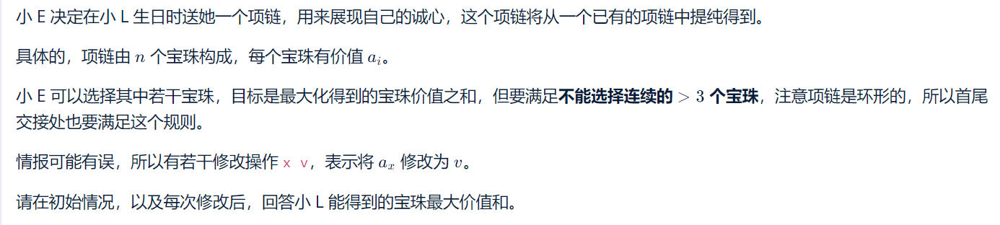

```cpp
#include"bits/stdc++.h"
#define endl '\n'

using ll=long long;
using namespace std;

constexpr int N=2e5+10;
constexpr int inf=0X3F3F3F3F;
constexpr ll INF=0X3F3F3F3F3F3F3F3F;

struct mat{
    int x=4,y=4;
    ll v[4][4]={};
    mat(){};
    mat(int _x,int _y):x(_x),y(_y){};
    void zero(){
        for(int i=0;i<x;i++)
            for(int j=0;j<y;j++)
                v[i][j]=0;
    };
    void ones(){
        for(int i=0;i<x;i++)
            v[i][i]=1;
    };
    mat operator*(const mat &o)const{
        mat res(x,o.y);
        int a=x,b=y,c=o.y;
        for(int i=0;i<a;i++)
            for(int j=0;j<c;j++)
                for(int k=0;k<b;k++)
                    if(v[i][k]!=-INF&&o.v[k][j]!=-INF)
                        res.v[i][j]=max(res.v[i][j],v[i][k]+o.v[k][j]);
        return res;
    }
    void show(){
        for(int i=0;i<x;i++){
            for(int j=0;j<y;j++){
                cerr<<v[i][j]<<' ';
            }
            cerr<<endl;
        }
    }
};

mat qpow(mat a,ll b){
    mat res(a.x,a.y);
    res.ones();
    for(;b;b>>=1){
        if(b&1)
            res=res*a;
        a=a*a;
    }
    return res;
}

mat a[N];

#define ls p<<1
#define rs p<<1|1
struct node{
    int l,r;
    mat mt;
}tr[N<<2];
void pushup(int p){
    tr[p].mt=tr[ls].mt*tr[rs].mt;
}
void build(int l,int r,int p=1){
    tr[p].l=l,tr[p].r=r;
    if(l==r){
        tr[p].mt=a[l];
        return;
    }
    int mid=l+r>>1;
    build(l,mid,ls);
    build(mid+1,r,rs);
    pushup(p);
}
void update(int x,mat c,int p=1){
    if(tr[p].l==tr[p].r){
        tr[p].mt=c;
        return;
    }
    int mid=tr[p].l+tr[p].r>>1;
    if(x<=mid)
        update(x,c,ls);
    if(mid<x)
        update(x,c,rs);
    pushup(p);
}
mat query(int l,int r,int p=1){
    if(l<=tr[p].l&&tr[p].r<=r)
        return tr[p].mt;
    int mid=tr[p].l+tr[p].r>>1;
    if(l>mid)
        return query(l,r,rs);
    else if(mid>=r)
        return query(l,r,ls);
    else
        return query(l,r,ls)*query(l,r,rs);
}
#undef ls
#undef rs

mat b[5][5];

void solve(){
    int n,q;
    cin>>n>>q;
    vector<int>arr(n+1);
    for(int i=1;i<=n;i++){
        cin>>arr[i];
    }
    auto get=[&](int x)->mat{
        mat r(4,4);
        for(int i=0;i<4;i++){
            for(int j=0;j<4;j++)
                r.v[i][j]=-INF;
        }
        for(int i=0;i<4;i++)
            r.v[i][0]=0;
        for(int i=0;i<3;i++)
            r.v[i][i+1]=x;
        return r;
    };
    auto calc=[&]()->ll{
        mat d(1,4);
        ll ans=0;
        if(n==4){
            ll sum=0;
            int mn=inf;
            for(int i=1;i<=4;i++){
                mn=min(mn,arr[i]);
                sum+=arr[i];
            }
            return sum-mn;    
        }
        mat res=query(5,n);

        mat nd=d*b[2][4]*res;
        for(int j=0;j<4;j++)
            ans=max(ans,nd.v[0][j]);

        nd=d*b[3][4]*res*b[1][1];
        for(int j=0;j<4;j++)
            ans=max(ans,nd.v[0][j]);
        
        nd=d*b[4][4]*res*b[1][2];
        for(int j=0;j<4;j++)
            ans=max(ans,nd.v[0][j]);

        nd=d*res*b[1][3];
        for(int j=0;j<4;j++)
            ans=max(ans,nd.v[0][j]);
        
        return ans;
    };

    for(int i=1;i<=n;i++){
        a[i]=get(arr[i]);
        if(i<=4)
            b[i][i]=a[i];
    }
    for(int len=2;len<=4;len++){
        for(int i=1;i+len-1<=4;i++){
            int j=i+len-1;
            b[i][j]=b[i][j-1]*b[j][j];
        }
    }

    build(1,n);
    cout<<calc()<<endl;
    while(q--){
        int x,v;
        cin>>x>>v;
        arr[x]=v;
        mat now=get(v);
        update(x,now);
        if(x<=4){
            b[x][x]=now;
            for(int len=2;len<=4;len++){
                for(int i=1;i+len-1<=4;i++){
                    int j=i+len-1;
                    b[i][j]=b[i][j-1]*b[j][j];
                }
            }
        }
        cout<<calc()<<endl;
    }
}

signed main(){
    cin.tie(nullptr)->sync_with_stdio(false);
    int _=1;cin>>_;while(_--)
    solve();
    return 0;
}
```


## 整除关系的状态转移

若先前的数是当前数的约数，枚举约数即可转移。若先前的数是当前数的倍数，那可以在先前处理出先前的数的所有约数该转移的答案，在当前访问对应答案即可。

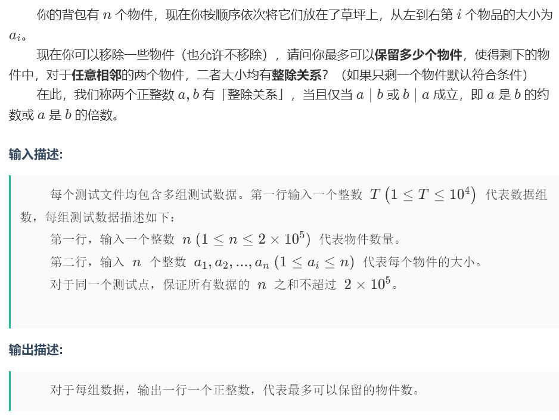
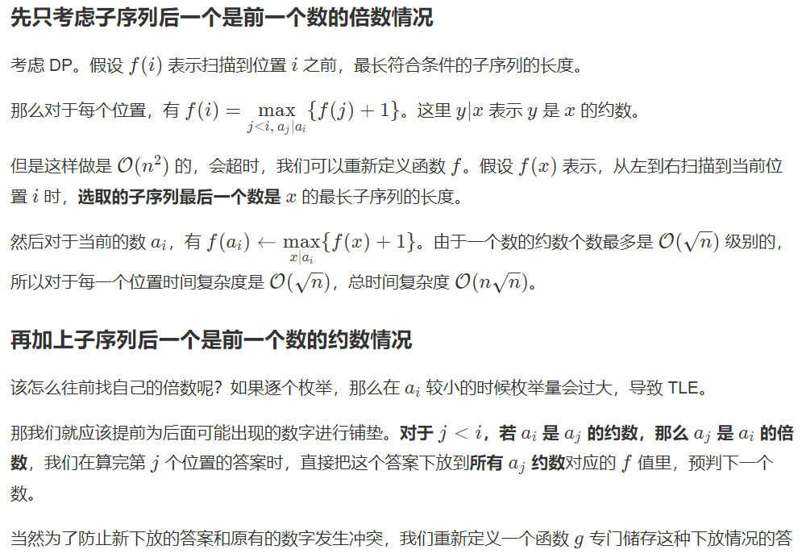
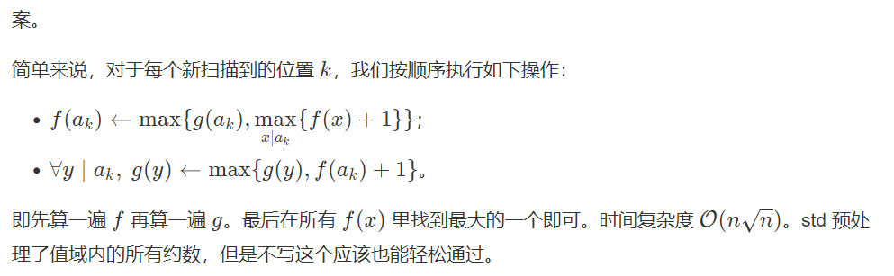
```cpp
const int N = 200010;
int n, a[N], f[N], g[N], t, ans;
vector <int> d[N]; 

void init(){
	for(int i = 1; i < N; i++)
		for(int j = i; j < N; j += i)
			d[j].push_back(i);
}

void solve(){
	cin >> n;
	for(int i = 1; i <= n; i++)
		cin >> a[i];
	ans = 0;
	for(int i = 1; i <= n; i++) 
		f[i] = g[i] = 0;
	for(int i = 1, mx; i <= n; i++){
		mx = 0;
		for(int j : d[a[i]]) 
			mx = max(mx, f[j] + 1);
		f[a[i]] = max(g[a[i]], mx);
		for(int j : d[a[i]])
			g[j] = max(g[j], f[a[i]] + 1); 
	}
	for(int i = 1; i <= n; i++) 
		ans = max(ans, f[i]);
	cout << ans << endl;
}

```

## 高维前缀和 sosdp

高维前缀和一般解决这类问题：

> 对于所有的$i,0≤i≤2^n−1$ ，求解 $\sum_{j \subset i}a_j$  。

显然，这类问题可以直接枚举子集求解，但复杂度为$O(3^n)$ 。如果我们施展高维前缀和的话，复杂度可以到 $O(n\times 2^n)$。

说起来很高级，其实代码就三行：

```cpp
for(int j = 0; j < n; j++) 
    for(int i = 0; i < 1 << n; i++)
        if(i >> j & 1) f[i] += f[i ^ (1 << j)];
```

- 子集

那这跟子集有啥关系？在二进制表示中，发现当i⊂j

时，其实这存在一个偏序关系，对于每一位都是这样。而我们求出的前缀和就是满足这个偏序关系的。  
回到开始那个问题，初始化f[i]=ai，直接求高维前缀和，那么最终得到的f

就是答案数组了。

- 超集

理解了子集过后，我们将二进制中的每一个1

当作0对待，0当作1

对待求出来的就是超集了~相当于从另一个角出发来求前缀和。  
求超集代码如下：

```cpp
for(int j = 0; j < n; j++) 
    for(int i = 0; i < 1 << n; i++)
        if(!(i >> j & 1)) f[i] += f[i ^ (1 << j)];
```

### 求树上lcm为x的路径数

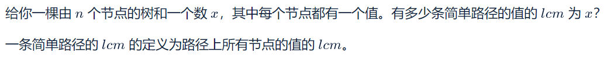
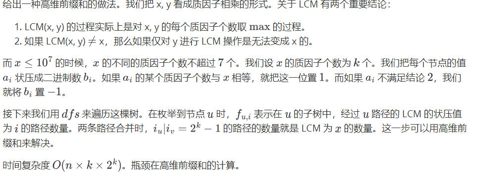


```cpp
#include"bits/stdc++.h"
#define endl '\n'
using ll=long long;
using namespace std;
constexpr int N=1e5+10;
constexpr int inf=0X3F3F3F3F;
constexpr ll INF=0X3F3F3F3F3F3F3F3F;

void solve(){
    int n,x;
    cin>>n>>x;  
    vector g(n+1,vector<int>());
    for(int i=1;i<n;i++){
        int u,v;
        cin>>u>>v;
        g[u].push_back(v);
        g[v].push_back(u);
    }
    vector<int>a(n+1);
    for(int i=1;i<=n;i++)
        cin>>a[i];
    
    map<int,int>cnt;
    int nx=x;
    for(int i=2;i<=nx;i++){
        while(nx%i==0){
            cnt[i]++;
            nx/=i;
        }
    }

    for(int i=1;i<=n;i++){
        auto &c=a[i];
        int msk=0,bit=0;
        bool fl=false;
        for(auto [base,power]:cnt){
            int power_a=0;
            while(c%base==0){
                c/=base;
                power_a++;
            }
            if(power_a==power)
                msk|=1<<bit;
            else if(power_a>power)
                fl=true;
            bit++;
        }
        if(c!=1||fl)
            c=-1;
        else
            c=msk;
        // cerr<<c<<endl;
    }

    ll ans=0;
    int k=cnt.size(),mx=(1<<k)-1;
    vector dp(n+1,vector<int>(1<<k));
    function<void(int,int)>dfs=[&](int u,int p){
        for(auto v:g[u]){
            if(v==p)
                continue;
            dfs(v,u);
        }
        if(a[u]==-1)
            return;
        if(a[u]==mx)
            ans++;
        dp[u][a[u]]=1;
        for(auto v:g[u]){
            if(v==p)
                continue;
            auto sum=dp[u];
            for(int i=0;i<k;i++){
                for(int s=0;s<1<<k;s++){
                    if(!(s>>i&1))
                        sum[s]+=sum[s^(1<<i)];
                }
            }

            for(int s=0;s<1<<k;s++){
                ans+=1ll*sum[(s)^mx]*dp[v][s];
                dp[u][s|a[u]]+=dp[v][s];
            }
        }
    };
    dfs(1,0);
    cout<<ans<<endl;
}
signed main(){
    cin.tie(nullptr)->sync_with_stdio(false);
    int _=1;cin>>_;while(_--)
    solve();
    return 0;
}
```

## 快速幂优化循环卷积

在比特超市有 $n$ 种商品，依次编号为 $1$ 到 $n$，购买一件第 $i$ 种商品的价格为 $i$ 元，其价值为 $v_i$。由于备货充足，每种商品都可以购买任意非负整数件。

小Q计划购买恰好 $k$ ($1\leq k\leq 10^9$) 件商品，并计算出了 $f_0,f_1,f_2,\dots,f_{n-1}$，其中 $f_i$ 表示购买 $k$ 件商品且商品价格之和对 $n$ 取模的余数恰好为 $i$ 的所有方案中商品价值之和的最大可能值。

一天过去之后，健忘的小Q忘记了昨天做的购物计划中到底要买多少件物品，请写一个程序根据小Q的回忆找到 $k$ 的值。

**Input**

第一行包含一个正整数 $n$ ($1\leq n\leq 1\,000$)，表示商品的种类数。

第二行包含 $n$ 个整数 $v_1,v_2,\dots,v_n$ ($1\leq |v_i|\leq 10^9$)，依次表示每种商品的价值。

第三行包含 $n$ 个整数 $f_0,f_1,\dots,f_{n-1}$ ($-10^{18}\leq f_i\leq 10^{18}$)，表示小Q回忆出来的 $f$ 的每一项的值。

**Output**

输出一行一个整数 $k$ ($1\leq k\leq 10^9$)，即 $k$ 的取值，若有多个合法的 $k$，输出任意一个。如果小Q回忆有误，即在 $[1,10^9]$ 内找不到对应的 $k$，请输出"\-1"。

---

题解：

令每件商品的价值最大值为 t，那么选取 k 件商品的价值最大值不超过 k × t；另一方面，
我们总可以把 t 对应的商品重复选取 k 次来得到 k × t，因此数组 f 的最大值一定对应 k × t，
于是我们得到了 k 的唯一可能取值：即两个数组最大值的商。
得到 k 的唯一可能取值后，使用快速幂求出 v 数组的循环卷积的 k 次幂，判断是否等于 f
数组即可。
时间复杂度 O(n2 log k)。

---

```cpp
#include"bits/stdc++.h"
#define endl '\n'
using ll=long long;
using namespace std;
constexpr int N=1e5+10,inf=0X3F3F3F3F;
constexpr ll INF=0X3F3F3F3F3F3F3F3F;
void solve(){
    int n;
    cin>>n;
    vector<ll>v(n),f(n);
    for(int i=0;i<n;i++)
        cin>>v[i];
    for(int i=0;i<n;i++)
        cin>>f[i];

    ll k=*max_element(f.begin(),f.end())/(*max_element(v.begin(),v.end()));

    vector<ll>dp(n);
    for(int i=0;i<n;i++)
        dp[i]=v[(i-1+n)%n];//表示只选1件商品的f数组的初始值
    
    //若a数组是计算了选k1次的f数组，b数组是计算了选k2次的f数组，
    //以下就是计算k1+k2次的f数组
    auto mul=[&](const vector<ll> &a,const vector<ll> &b)->vector<ll>{
        vector<ll>r(n,-INF);
        for(int i=0;i<n;i++){
            for(int j=0;j<n;j++){
                int k=(i-j+n)%n;
                if(a[j]==-INF||b[k]==-INF)
                    continue;
                r[i]=max(r[i],a[j]+b[k]);
            }
        }
        return r;
    };

    //快速幂优化计算过程
    auto qpow=[&](int x)->vector<ll>{
        //r数组是计算了0次的f数组，0位置置0来继承dp数组的贡献
        //r与dp第一次相乘，得到的肯定是dp本身
        vector<ll>r(n,-INF);
        r[0]=0;
        for(;x;x>>=1){
            if(x&1)
                r=mul(r,dp);
            dp=mul(dp,dp);
        }
        return r;
    };

    if(k<1||k>(1'000'000'000)||(qpow(k)!=f))
        cout<<-1<<endl;
    else
        cout<<k<<endl;
}
signed main(){
    cin.tie(nullptr)->sync_with_stdio(false);
//	int t;cin>>t;while(t--)
    solve();
    return 0;
}
```

## 质数根号分治


---

在给定n(n<=1000)个正整数数ai(ai<=1000)，问最大能选定多少个数能相互互质。

---

数字1可以全选，数组中去除1后得到的答案再加上1的个数。
数组再去重，相同的数不可能选多个。

将剩下的数改成质因子分解形式。
设 V=sqrt(1000)=31（31是第11个质数），大于 31 的质因子最多出现一个。

那么我们可以将只含前11个质数质因子的整数进行状压dp，状态2进制下表示出现不出现第几个质因子。值为当前状态的最大总和。

将有大于31质数质因子的数存储起来，以这个质因子为键，值为{状态，数的值}；再做个分组背包，同样的质因子为同一组，每组最多选一个数，去更新原来的dp数组。

进行状压dp时（只含前11个质数质因子），遍历数组，当前的数得到的**状态**能影响状态的超集。
所以把状态更改成表示1位置可以出现或不出现0位置不能出现对应质因子。最后全一的状态就是最终答案。

---

**解释状压过程**

这段代码是动态规划中状态转移的核心逻辑，使用了位运算来处理状态间的关系。我来详细解释其工作原理。

这段代码的作用是：**对于当前处理的元素`x`，更新所有包含`x`质因子掩码`msk`的状态，使得这些状态的值尽可能大**。这是典型的子集动态规划优化技巧。

- `nmsk`：当前遍历的状态掩码，代表一个质因子集合
- `msk`：当前元素`x`的质因子掩码（只包含≤V的质因子）
- `dp`：动态规划数组，`dp[nmsk]`表示质因子集合为`nmsk`时的最大和
- `ndp`：临时数组，存储更新后的状态值

逐行解释
```cpp
for (int nmsk = 1; nmsk < N; nmsk++) {
    if ((nmsk & msk) == msk) {
        ndp[nmsk] = std::max(ndp[nmsk], dp[nmsk ^ msk] + x);
    }
}
```

1. **外层循环遍历所有可能的状态**：
   - `nmsk`从1到`N-1`，每个`nmsk`的二进制位表示一个质因子集合
   - 例如，若`nmsk`的第i位为1，表示该状态包含第i个质因子

2. **条件判断`(nmsk & msk) == msk`**：
   - 检查当前状态`nmsk`是否包含`msk`中的所有质因子
   - 位运算`nmsk & msk`返回同时存在于`nmsk`和`msk`中的质因子
   - 若结果等于`msk`，说明`nmsk`是`msk`的超集（即包含`msk`的所有质因子）

3. **状态转移方程**：
   - `ndp[nmsk] = std::max(ndp[nmsk], dp[nmsk ^ msk] + x)`
   - `nmsk ^ msk`：移除`nmsk`中`msk`包含的质因子，得到补集状态
   - `dp[nmsk ^ msk] + x`：选择当前元素`x`后，状态从`nmsk ^ msk`转移到`nmsk`，总和增加`x`
   - 通过取最大值确保状态最优

直观示例
假设：
- `msk = 0b011`（包含第1和第2个质因子）
- 当前处理的状态`nmsk = 0b111`（包含所有三个质因子）
- 条件判断：`0b111 & 0b011 == 0b011`，满足条件
- 状态转移：`ndp[0b111] = max(ndp[0b111], dp[0b100] + x)`
  - 即尝试从不含第1、2质因子的状态`0b100`转移过来

这种位运算优化的核心思想是：
- **子集枚举**：通过`nmsk`遍历所有可能包含当前质因子集合的状态
- **无后效性**：动态规划要求每个状态只被更新一次，通过`ndp`临时数组确保本轮更新不影响后续状态
- **状态压缩**：用位掩码表示质因子集合，将复杂度从指数级降到O(N·2^k)（k为质因子数量）

通过这种方式，代码高效地处理了质因子之间的约束关系，确保每个元素只被考虑一次，同时利用位运算加速状态转移。

```cpp
#include"bits/stdc++.h"
#define endl '\n'
using ll=long long;
using namespace std;
constexpr int N=1e5+10,inf=0X3F3F3F3F,V=31,M=1<<11;
constexpr ll INF=0X3F3F3F3F3F3F3F3F;


vector<int> pri;
int minp[1004];
void pre(int n) {
for (int i = 2; i <= n; ++i) {
    if (!minp[i]) {
        pri.push_back(i);
        minp[i]=i;
    }
    for (int pri_j : pri) {
        if (i * pri_j > n)
            break;
        minp[i * pri_j] = pri_j;
        if (i % pri_j == 0) {
            break;
        }
    }
}
}
void solve(){
    pre(1000);
    unordered_map<int,int>ump;
    for(int i=0;pri[i]<=V;i++)
        ump[pri[i]]=i;
    int n;
    cin>>n;
    int cnt=0;
    vector<int>a(n),b;
    for(int i=0;i<n;i++){
        cin>>a[i];
        if(a[i]==1)
            cnt++;
        else
            b.push_back(a[i]);
    }
    ranges::sort(b);
    b.erase(unique(b.begin(),b.end()),b.end());
    
    array<int,M>dp{};
    map<int,vector<array<int,2>> >mp;
    for(auto x:b){
        int maxp=0,msk=0;
        for(int y=x;y>1;){
            int p=minp[y];
            if(p>V)
                maxp=p;
            else
                msk|=1<<ump[p];
            while(y%p==0)
                y/=p;
        }
        if(maxp){
            mp[maxp].push_back({msk,x});
            continue;
        }
        auto ndp=dp;
        for(int i=1;i<M;i++){
            if((i&msk)==msk)
                ndp[i]=max(ndp[i],dp[i^msk]+x);
        }
        dp.swap(ndp);
    }

    for(auto it:mp){
        auto [maxp,v]=it;
        auto ndp=dp;
        for(auto [msk,x]:v){
            for(int i=1;i<M;i++){
                if((i&msk)==msk)
                    ndp[i]=max(ndp[i],dp[i^msk]+x);
            }
        }
        dp.swap(ndp);
    }

    cout<<cnt+dp.back()<<endl;
}
signed main(){
    cin.tie(nullptr)->sync_with_stdio(false);
//	int t;cin>>t;while(t--)
    solve();
    return 0;
}
```


## 树上背包

树上的背包问题，简单来说就是背包问题与树形 DP 的结合。

**例题** [洛谷 P2014 CTSC1997 选课](https://www.luogu.com.cn/problem/P2014)"

---

现在有 $n$ 门课程，第 $i$ 门课程的学分为 $a_i$，每门课程有零门或一门先修课，有先修课的课程需要先学完其先修课，才能学习该课程。

一位学生要学习 $m$ 门课程，求其能获得的最多学分数。

$n,m \leq 300$

---

每门课最多只有一门先修课的特点，与有根树中一个点最多只有一个父亲结点的特点类似。

因此可以想到根据这一性质建树，从而所有课程组成了一个森林的结构。为了方便起见，我们可以新增一门 $0$ 学分的课程（设这个课程的编号为 $0$），作为所有无先修课课程的先修课，这样我们就将森林变成了一棵以 $0$ 号课程为根的树。

我们设 $f(u,i,j)$ 表示以 $u$ 号点为根的子树中，已经遍历了 $u$ 号点的前 $i$ 棵子树，选了 $j$ 门课程的最大学分。

转移的过程结合了树形 DP 和 背包 DP 的特点，我们枚举 $u$ 点的每个子结点 $v$，同时枚举以 $v$ 为根的子树选了几门课程，将子树的结果合并到 $u$ 上。

记点 $x$ 的儿子个数为 $s_x$，以 $x$ 为根的子树大小为 ${siz_x}$，可以写出下面的状态转移方程：

$$
f(u,i,j)=\max_{v,k \leq j,k \leq {siz_v}} f(u,i-1,j-k)+f(v,s_v,k)
$$

注意上面状态转移方程中的几个限制条件，这些限制条件确保了一些无意义的状态不会被访问到。

$f$ 的第二维可以很轻松地用滚动数组的方式省略掉，注意这时需要倒序枚举 $j$ 的值。

可以证明，该做法的时间复杂度为 $O(nm)$。

```cpp
#include"bits/stdc++.h"
#define endl '\n'
using ll=long long;
using namespace std;
constexpr int N=3e2+10;

//dp[u][i]表示u子树中选了i门课程能获得学分的最大值
int n,m,s[N],dp[N][N];
vector<int>g[N];

int dfs(int u,int p){
    int sizu=1;
    dp[u][1]=s[u];
    for(auto v:g[u]){
        if(v==p)
            continue;
        int sizv=dfs(v,u);
        //注意下面两重循环的上界和下界
        //将0节点也设置成需要选择的课程，所以总共需要选m+1个课程
        //只考虑合并过的子树
        for(int i=min(sizu,m+1);i>=1;i--){
            for(int j=1;j<=sizv&&i+j<=m+1;j++){
                dp[u][i+j]=max(dp[u][i+j],dp[u][i]+dp[v][j]);
            }
        }
        sizu+=sizv;
    }
    return sizu;
}
void solve(){
    cin>>n>>m;
    for(int i=1,k;i<=n;i++){
        cin>>k>>s[i];
        g[k].push_back(i);
    }
    dfs(0,0);
    cout<<dp[0][m+1]<<endl;
}
signed main(){
    cin.tie(nullptr)->sync_with_stdio(false);
    solve();
    return 0;
}
```

## 数位dp

```cpp
//从0到n-1是高位数字到地位数字，r根据题目信息而定（可能需要多个参数），lim是当前是否受上界限制，zero是是否有前导零。
//pos表示pos之前的位全部考虑到，当前考虑第pos位
ll dfs(int pos,int r,bool lim,bool zero){
    //搜索完成退出
    if(pos==n)
        return r==0;
    
    //非上界前缀，非前导零，记忆化
    if(!lim&&!zero&&dp[pos][r]!=-1)
        return dp[pos][r];
    
    //当前位数字的上界
    int up=lim?s[pos]-'0':9;

    //计算答案，深搜
    ll res=0;
    for(int i=0;i<=up;i++){
        res+=dfs(pos+1,(r+i)%d,lim&(i==s[pos]-'0'),zero&(i==0));
        res%=mod;
    }

    //记忆化
    if(!lim&&!zero)
        return dp[pos][r]=res;
    
    //返回结果
    return res;
}
```
如果一个正整数的二进制表示中，0 的数目不小于 1 的数目，那么它就被称为「圆数」。
例如，9 的二进制表示为 1001，其中有 2 个 0 与 2 个 1。因此，9 是一个「圆数」。
请你计算，区间 [l,r] 中有多少个「圆数」。
```cpp
#include"bits/stdc++.h"
#define ll long long
#define endl '\n'
using namespace std;
constexpr int N=1e5+10,inf=0X3F3F3F3F;
constexpr ll INF=0X3F3F3F3F3F3F3F3F;
int a[32];
int f[32][100];
int dfs(bool lim,bool lead,int pos,int cur){
    if(pos==-1)
        return cur>=30;
    if(!lim&&!lead&&f[pos][cur]!=-1)
        return  f[pos][cur];

    int res=0;
    int up=(lim==1)?a[pos]:1;
    for(int i=0;i<=up;i++){
        res+=dfs(lim&(a[pos]==i),lead&(i==0),pos-1,cur+(i==0?(lead?0:1):-1));
    }
    if(!lim&&!lead)
        return f[pos][cur]=res;
    return res;
}
int trans(int x){
    int k=0;
    while(x){
        a[k]=x%2;
        x/=2;
        k++;
    }
    return dfs(1,1,k-1,30);
}
void solve(){
    int l,r;
    cin>>l>>r;
    // for(int i=0;i<32;i++)
    //     for(int j=0;j<100;j++)
    //         f[i][j]=-1;
    memset(f,-1,sizeof f);
    cout<<trans(r)-trans(l-1)<<endl;
}
signed main(){
    cin.tie(nullptr)->sync_with_stdio(0);
//	int t;cin>>t;while(t--)
    solve();
    return 0;
}
```

## 状压dp 二分图完全匹配

```cpp
int dp[1<<22];constexpr int mod=1e9+7//
void solve(){
    int n; cin>>n;
    vector<vector<int>>a(n+3,vector<int>(n+3));
    for(int i=1;i<=n;i++)for(int j=1;j<=n;j++)   cin>>a[i][j]; //表示i，j连边
    dp[0]=1;//0个点匹配的方案数是1
    for(int i=0;i<(1<<n);i++){//枚举
        int x= __builtin_popcount(i);//已经匹配的数量 x+1为下一个要匹配的点
        for(int j=1;j<=n;j++){//枚举要进行匹配的点
            if(a[x+1][j]&&( i & ( 1<<( j-1 ) ) ) ==0){ //x+1与j可以匹配并且都未匹配过
                dp[ i | 1<<(j-1) ]=( dp[i] + dp[ i | 1<<(j-1) ])%mod;
                //原状态为i，新匹配点为x+1与j，则(1<<(j-1))被匹配，转移到状态 (i | 1<<(j-1))
            }
        }
    }
    cout<<dp[(1<<n)-1]<<endl;//  (1<<n)-1 代表所有点都匹配
}
```

## 排列取两区间使两区间并size=max-min（lis）

```cpp
#include <bits/stdc++.h>
using namespace std;
const int N = 6000;
int n, a[N], rk[N];
void solved() {
    int ans = 0;
    for (int s = 1; s <= n; ++s) {
        int kuai = 1;
        ans++;
        for (int add = s + 1; add <= n; ++add) {
            int pr = a[rk[add] - 1];
            int bk = a[rk[add] + 1];
            if (pr >= s && pr < add && bk >= s && bk < add) {
                kuai--;
            }
            else if (!((pr >= s && pr < add) || (bk >= s && bk < add))) {
                kuai++;
            }
            if (kuai <= 2) ans++;
        }
    }
    printf("%d\n", ans);
}
int main() {
    int T;
    scanf("%d", &T);
    while(T--) {
        scanf("%d", &n);
        a[n + 1] = n + 1;
        rk[n + 1] = n + 1;
        for (int i = 1; i <= n; ++i) {
            scanf("%d", &a[i]);
            rk[a[i]] = i;
        }
        if (n == 1) {
            puts("0");
            continue;
        }
        solved();
    }
}
```

## 最长公共子序列

### 朴素

朴素做法复杂度$O(nm)$
```cpp
for(int i=1;i<=n;i++){
        for(int j=1;j<=m;j++){
            if(a[i]==b[j]){
                dp[i][j]=dp[i-1][j-1]+1;
            }else{
                dp[i][j]=max(dp[i-1][j],dp[i][j-1]);
            }
        }
    }
```

### 变式

[P1439 【模板】最长公共子序列](https://www.luogu.com.cn/problem/P1439)
题意
给定两个长度为n的排列，求两个排列的最长公共子序列。
解法
将a数组映射成1到n，以映射规则重构b数组，即为求新数组的最长上升子序列
```cpp
// #define TY09
#include"bits/stdc++.h"
#define ll long long
#define endl '\n'
using namespace std;
constexpr int N=1e5+10,inf=0X3F3F3F3F;
void IMSB(){
    int n;
    cin>>n;
    vector<int>a(n+1),f(n+1),c(n+1);
    for(int i=1;i<=n;i++){
        cin>>a[i];
        f[a[i]]=i;
    }
    for(int i=1;i<=n;i++){
        int x;
        cin>>x;
        c[i]=f[x];
    }
    vector<int>d;
    d.push_back(c[1]);
    for(int i=2;i<=n;i++){
        if(c[i]>d.back())
            d.push_back(c[i]);
        else
            *lower_bound(d.begin(),d.end(),c[i])=c[i];
    }
    cout<<d.size();
}
signed main(){
    cin.tie(nullptr)->sync_with_stdio(0);
    // int t;cin>>t;while(t--)
        IMSB();
    return 0;
}
/* It's time to go home although where I don't know. */
```

## 二进制拆分优化多重背包

[P1776 宝物筛选](https://www.luogu.com.cn/problem/P1776)
小 FF 对洞穴里的宝物进行了整理，他发现每样宝物都有一件或者多件。他粗略估算了下每样宝物的价值，之后开始了宝物筛选工作：小 FF 有一个最大载重为 _W_ 的采集车，洞穴里总共有 _n_ 种宝物，每种宝物的价值为 _vi_，重量为 _wi_，每种宝物有 _mi_ 件。小 FF 希望在采集车不超载的前提下，选择一些宝物装进采集车，使得它们的价值和最大。
```cpp
// #define TY09
#include"bits/stdc++.h"
#define ll long long
#define endl '\n'
using namespace std;
#define int ll
constexpr int N=1e5+10,inf=0X3F3F3F3F;
void IMSB(){
    int n,W;
    cin>>n>>W;
    vector<int>v(n+1),w(n+1),m(n+1);
    for(int i=1;i<=n;i++)
        cin>>v[i]>>w[i]>>m[i];
    vector<int>vv,ww;
    for(int i=1;i<=n;i++){
        for(int j=1;j<=m[i];j<<=1){
            m[i]-=j;
            vv.push_back(j*v[i]);
            ww.push_back(j*w[i]);
        }
        if(m[i]){
            vv.push_back(m[i]*v[i]);
            ww.push_back(m[i]*w[i]);
        }
    }
    int nn=vv.size();
    vector<int>dp(W+1);
    for(int i=0;i<nn;i++){
        for(int j=W;j-ww[i]>=0;j--){
            dp[j]=max(dp[j],dp[j-ww[i]]+vv[i]);
        }
    }
    cout<<dp[W]<<endl;
}
signed main(){
    cin.tie(nullptr)->sync_with_stdio(0);
    // int t;cin>>t;while(t--)
        IMSB();
    return 0;
}
/* It's time to go home although where I don't know. */
```

# 图论

## 树哈希

树哈希是判断有根树同构的一种算法。设计一种哈希方式，把树的形态映射成一个哈希值。

例题：给定一棵以点 $1$ 为根的树，你需要输出这棵树中最多能选出多少个互不同构的子树。

```cpp
#include "bits/stdc++.h"
#define endl '\n'
// #define TESTS

using namespace std;
using ll = long long;
using ull = unsigned long long;
const ull mask =
    mt19937_64(chrono::steady_clock::now().time_since_epoch().count())();
constexpr int N = 1e6 + 10;
ull shift(int x) {
  x ^= mask;
  x ^= x << 13;
  x ^= x >> 7;
  x ^= x << 17;
  x ^= mask;
  return x;
}

vector<int> g[N];
set<ull> s;
ull dfs(int u, int p) {
  ull res = 0;
  for (int v : g[u]) {
    if (v == p)
      continue;
    res += shift(dfs(v, u));
  }
  s.insert(res);
  return res;
}

signed main() {
  cin.tie(nullptr)->sync_with_stdio(false);

  int n;
  cin >> n;
  for (int i = 1; i < n; i++) {
    int u, v;
    cin >> u >> v;
    g[u].push_back(v);
    g[v].push_back(u);
  }
  dfs(1, 0);
  cout << s.size() << endl;

  return 0;
}
```

### 无根树同构

这道题所说的同构是指无根树的，而上面所介绍的方法是针对有根树的。因此只有当根一样时，同构的两棵无根树哈希值才相同。由于数据范围较小，我们可以暴力求出以每个点为根时的哈希值，排序后比较。

如果数据范围较大，我们也可以使用换根 DP，遍历树两遍，求出以每个点为根时的哈希值。我们还可以利用上面的多重集哈希函数：把以每个结点为根时的哈希值都存进多重集，再把多重集的哈希值算出来，进行比较（做法一）。

还可以通过找重心的方式来优化复杂度。一棵树的重心最多只有两个，只需把以它（们）为根时的哈希值求出来即可。接下来，既可以分别比较这些哈希值（做法二），也可以在有一个重心时取它的哈希值作为整棵树的哈希值，有两个时则取其中较小（大）的。

```cpp
#include <iostream>
#include <map>
#include <random>
#include <vector>

using ull = unsigned long long;

constexpr int N = 60, M = 998244353;
const ull mask = std::mt19937_64(time(nullptr))();

ull shift(ull x) {
  x ^= mask;
  x ^= x << 13;
  x ^= x >> 7;
  x ^= x << 17;
  x ^= mask;
  return x;
}

std::vector<int> edge[N];
ull sub[N], root[N];
std::map<ull, int> trees;

void getSub(int x) {
  sub[x] = 1;
  for (int i : edge[x]) {
    getSub(i);
    sub[x] += shift(sub[i]);
  }
}

void getRoot(int x) {
  for (int i : edge[x]) {
    root[i] = sub[i] + shift(root[x] - shift(sub[i]));
    getRoot(i);
  }
}

using std::cin;
using std::cout;

int main() {
  cin.tie(nullptr)->sync_with_stdio(false);
  int m;
  cin >> m;
  for (int t = 1; t <= m; t++) {
    int n, rt = 0;
    cin >> n;
    for (int i = 1; i <= n; i++) {
      int fa;
      cin >> fa;
      if (fa) {
        edge[fa].push_back(i);
      } else {
        rt = i;
      }
    }
    getSub(rt);
    root[rt] = sub[rt];
    getRoot(rt);
    ull hash = 1;
    for (int i = 1; i <= n; i++) {
      hash += shift(root[i]);
    }
    if (!trees.count(hash)) {
      trees[hash] = t;
    }
    cout << trees[hash] << '\n';
    for (int i = 1; i <= n; i++) {
      edge[i].clear();
    }
  }
}
```

## 链式前向星

```cpp
int nxt[N << 1], head[N], to[N << 1], cnt;
void add(int u, int v) {
  nxt[++cnt] = head[u];
  head[u] = cnt;
  to[cnt] = v;
}
/*
nxt和to大小为边的数量(无向边数量乘2)，head大小为点的数量
节点从1开始编号，cnt和head数组初始化为0;
遍历u的出边:
for(int _=head[u];_;_=nxt[_]){
  int v=to[_];
}
若节点从0开始编号，则需要把head数组和cnt初始化为-1;
遍历u的出边:
for(int _=head[u];~_;_=nxt[_]){
  int v=to[_];
}
*/
```

## 有向图找环

```cpp
struct graph{
    int n;
    vector<vector<int>>g;
    vector<int>col;
    graph(int n){
        n=n;
        g.resize(n);
        col.resize(n);
    }
    void addedge(int u,int v){
        g[u].push_back(v);
    }
    bool dfs(int u){//是否有环
        if(col[u]!=0)
            return false;
        col[u]=1;
        bool r=false;
        for(auto v:g[u]){
            if(col[v]==2)
                continue;
            if(col[v]==1)
                r=true;
            else
                r|=dfs(v);
        }
        col[u]=2;
        return r;
    }
};
```

## 瓶颈生成树

定义

无向图 $G$ 的瓶颈生成树是这样的一个生成树，它的最大的边权值在 $G$ 的所有生成树中最小。

性质

**最小生成树是瓶颈生成树的充分不必要条件。** 即最小生成树一定是瓶颈生成树，而瓶颈生成树不一定是最小生成树。

关于最小生成树一定是瓶颈生成树这一命题，可以运用反证法证明：我们设最小生成树中的最大边权为 $w$，如果最小生成树不是瓶颈生成树的话，则瓶颈生成树的所有边权都小于 $w$，我们只需删去原最小生成树中的最长边，用瓶颈生成树中的一条边来连接删去边后形成的两棵树，得到的新生成树一定比原最小生成树的权值和还要小，这样就产生了矛盾。


## 最小瓶颈路

定义

无向图 $G$ 中 x 到 y 的最小瓶颈路是这样的一类简单路径，满足这条路径上的最大的边权在所有 x 到 y 的简单路径中是最小的。

性质

根据最小生成树定义，x 到 y 的最小瓶颈路上的最大边权等于最小生成树上 x 到 y 路径上的最大边权。虽然最小生成树不唯一，但是每种最小生成树 x 到 y 路径的最大边权相同且为最小值。也就是说，每种最小生成树上的 x 到 y 的路径均为最小瓶颈路。


应用

由于最小瓶颈路不唯一，一般情况下会询问最小瓶颈路上的最大边权。

也就是说，我们需要求最小生成树链上的 max。

倍增、树剖都可以解决，这里不再展开。


## Kruskal重构树

定义

在跑 Kruskal 的过程中我们会从小到大加入若干条边。现在我们仍然按照这个顺序。

首先新建 $n$ 个集合，每个集合恰有一个节点，点权为 $0$。

每一次加边会合并两个集合，我们可以新建一个点，点权为加入边的边权，同时将两个集合的根节点分别设为新建点的左儿子和右儿子。然后我们将两个集合和新建点合并成一个集合。将新建点设为根。

不难发现，在进行 $n-1$ 轮之后我们得到了一棵恰有 $n$ 个叶子的二叉树，同时每个非叶子节点恰好有两个儿子。这棵树就叫 Kruskal 重构树。

举个例子：

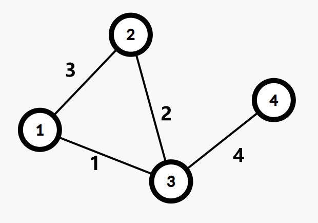

这张图的 Kruskal 重构树如下：

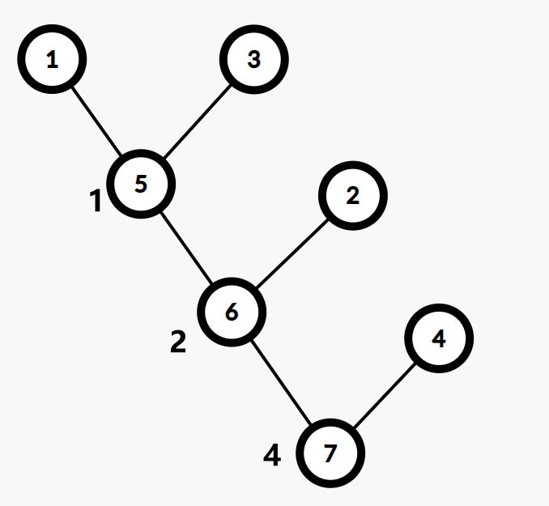

性质

不难发现，原图中两个点之间的所有简单路径上最大边权的最小值 = 最小生成树上两个点之间的简单路径上的最大值 = Kruskal 重构树上两点之间的 LCA 的权值。

也就是说，到点 $x$ 的简单路径上最大边权的最小值 $\leq val$ 的所有点 $y$ 均在 Kruskal 重构树上的某一棵子树内，且恰好为该子树的所有叶子节点。

我们在 Kruskal 重构树上找到 $x$ 到根的路径上权值 $\leq val$ 的最浅的节点。显然这就是所有满足条件的节点所在的子树的根节点。

如果需要求原图中两个点之间的所有简单路径上最小边权的最大值，则在跑 Kruskal 的过程中按边权大到小的顺序加边。

```cpp
template<typename T>
struct kruskaltree {
    int n;
    vector<vector<int>>adj;
    vector<tuple<T, int, int>>E;
    vector<int>pa, fa, dep, son, siz, top, tmp;
    vector<T>val;
    kruskaltree(int _n) :n(_n) {};
    void addedge(int u, int v, int w) {
        E.emplace_back(w, u, v);
    };
    int find(int x) {
        return x == pa[x] ? x : pa[x] = find(pa[x]);
    };
    void dfs0(int u, int p) {
        siz[u] = 1, dep[u] = dep[p] + 1;
        fa[u] = p;
        for (auto v : adj[u]) {
            dfs0(v, u);
            siz[u] += siz[v];
            if (siz[son[u]] < siz[v])
                son[u] = v;
        }
    };
    void dfs1(int u, int t) {
        top[u] = t;
        if (!son[u])
            return;
        dfs1(son[u], t);
        for (auto v : adj[u]) {
            if (v == son[u])
                continue;
            dfs1(v, v);
        }
    };
    int lca(int u, int v) {
        while (top[u] != top[v]) {
            if (dep[top[u]] < dep[top[v]])
                swap(u, v);
            u = fa[top[u]];
        }
        return dep[u] < dep[v] ? u : v;
    }
    void work() {
        pa.resize(n + 1);
        iota(pa.begin(), pa.end(), 0);
        sort(E.begin(), E.end());
        for (int i = 0;i < E.size();i++) {
            auto [w, u, v] = E[i];
            int x = find(u), y = find(v);
            if (x == y)
                continue;
            pa[y] = x;
            tmp.emplace_back(i);
        }

        pa.resize(n << 1), adj.resize(n << 1);
        val.resize(n << 1);
        iota(pa.begin(), pa.end(), 0);
        int node = n;
        for (auto i : tmp) {
            auto [w, u, v] = E[i];
            int x = find(u), y = find(v);
            node++;
            adj[node].emplace_back(x);
            adj[node].emplace_back(y);
            val[node] = w;
            pa[x] = pa[y] = node;
        }

        dep.resize(n << 1), top.resize(n << 1);
        son.resize(n << 1), siz.resize(n << 1);
        fa.resize(n << 1);
        for (int i = 1;i < 2 * n;i++) {
            if (i == pa[i]) {
                dfs0(i, 0);
                dfs1(i, i);
            }
        }
    };
    T dist(int u, int v) {
        return val[lca(u, v)];
    };
};
```

示例：`kruskaltree<int> kt(n);`

例题：
有n点m边的无向图，每个点点权为ai，边权为此边链接两点的点权和。每次询问选定若干条边，使得区间【l，r】的所有点联通，最小化选定若干条边的最大边权。

解析：若使i，j联通，最小的若干条边最大边权是最小瓶颈路问题。考虑构建ans数组，含义是i和i+1点最小瓶颈路的最大边权。那么【l，r】的询问就转化成【l，r-1】上ans数组的最大值。可以用kruskal重构树维护最小瓶颈路的最大边权。

```cpp
#include"bits/stdc++.h"
#define endl '\n'
#define debug(x) cerr<<#x<<' '<<x<<endl
using ll = long long;
using namespace std;
constexpr int N = 2e5 + 10, inf = 0X3F3F3F3F;
constexpr ll INF = 0X3F3F3F3F3F3F3F3F;

template<typename T>
class st {
    using functype = function<T(const T &, const T &)>;

    vector<vector<T>>ST;
    static T func(const T &x, const T &y) {
        return max(x, y);
    }
    functype op;

public:
    st(const vector<T> &v, functype _func = func) :op(_func) {
        int len = v.size(), l1 = __lg(len) + 1;
        ST.assign(len, vector<T>(l1, {}));
        for (int i = 0;i < len;i++)
            ST[i][0] = v[i];
        for (int j = 1;j < l1;j++) {
            int pj = (1 << (j - 1));
            for (int i = 0;i + pj < len;i++) {
                ST[i][j] = op(ST[i][j - 1], ST[i + (1 << (j - 1))][j - 1]);
            }
        }
    }

    T query(int l, int r) {
        int q = __lg(r - l + 1);
        return op(ST[l][q], ST[r - (1 << q) + 1][q]);
    }
};

struct dsu {
    vector<int>p;
    dsu(int _n) :p(_n + 1) {
        iota(p.begin(), p.end(), 0);
    }
    void init(int n) {
        p.resize(n + 1);
        iota(p.begin(), p.end(), 0);
    }
    int find(int x) {
        return p[x] == x ? x : p[x] = find(p[x]);
    }
    bool same(int u, int v) {
        return find(u) == find(v);
    }
    bool merge(int u, int v) {
        int x = find(u), y = find(v);
        if (x == y)
            return false;
        p[y] = x;
        return true;
    }
};

template<typename T>
struct kruskaltree {
    int n;
    vector<vector<int>>adj;
    vector<tuple<T, int, int>>E;
    vector<int>pa, fa, dep, son, siz, top, tmp;
    vector<T>val;
    kruskaltree(int _n) :n(_n) {};
    void addedge(int u, int v, int w) {
        E.emplace_back(w, u, v);
    };
    int find(int x) {
        return x == pa[x] ? x : pa[x] = find(pa[x]);
    };
    void dfs0(int u, int p) {
        siz[u] = 1, dep[u] = dep[p] + 1;
        fa[u] = p;
        for (auto v : adj[u]) {
            dfs0(v, u);
            siz[u] += siz[v];
            if (siz[son[u]] < siz[v])
                son[u] = v;
        }
    };
    void dfs1(int u, int t) {
        top[u] = t;
        if (!son[u])
            return;
        dfs1(son[u], t);
        for (auto v : adj[u]) {
            if (v == son[u])
                continue;
            dfs1(v, v);
        }
    };
    int lca(int u, int v) {
        while (top[u] != top[v]) {
            if (dep[top[u]] < dep[top[v]])
                swap(u, v);
            u = fa[top[u]];
        }
        return dep[u] < dep[v] ? u : v;
    }
    void work() {
        pa.resize(n + 1);
        iota(pa.begin(), pa.end(), 0);
        sort(E.begin(), E.end());
        for (int i = 0;i < E.size();i++) {
            auto [w, u, v] = E[i];
            int x = find(u), y = find(v);
            if (x == y)
                continue;
            pa[y] = x;
            tmp.emplace_back(i);
        }

        pa.resize(n << 1), adj.resize(n << 1);
        val.resize(n << 1);
        iota(pa.begin(), pa.end(), 0);
        int node = n;
        for (auto i : tmp) {
            auto [w, u, v] = E[i];
            int x = find(u), y = find(v);
            node++;
            adj[node].emplace_back(x);
            adj[node].emplace_back(y);
            val[node] = w;
            pa[x] = pa[y] = node;
        }

        dep.resize(n << 1), top.resize(n << 1);
        son.resize(n << 1), siz.resize(n << 1);
        fa.resize(n << 1);
        for (int i = 1;i < 2 * n;i++) {
            if (i == pa[i]) {
                dfs0(i, 0);
                dfs1(i, i);
            }
        }
    };
    T dist(int u, int v) {
        return val[lca(u, v)];
    };
};

void solve() {
    int n, m, q;
    cin >> n >> m >> q;
    vector<int>a(n + 1);
    for (int i = 1;i <= n;i++) {
        cin >> a[i];
    }
    kruskaltree<int> kt(n);
    dsu d(n);
    for (int i = 1;i <= m;i++) {
        int u, v;
        cin >> u >> v;
        kt.addedge(u, v, a[u] + a[v]);
        d.merge(u, v);
    }
    kt.work();
    vector<int>b(n);
    for (int i = 1;i < n;i++) {
        if (d.same(i, i + 1))
            b[i] = kt.dist(i, i + 1);
        else
            b[i] = INT32_MAX;
    }
    st rmq(b);
    while (q--) {
        int l, r;
        cin >> l >> r;
        if (l == r) {
            cout << 0 << endl;
            continue;
        }
        int ans = rmq.query(l, r - 1);
        cout << (ans == INT32_MAX ? -1 : ans) << endl;
    }
}
signed main() {
    cin.tie(nullptr)->sync_with_stdio(false);
    //	int t;cin>>t;while(t--)
    solve();
    return 0;
}
```

## 重链剖分

树链剖分用于将树分割成若干条链的形式，以维护树上路径的信息。

树链剖分可以把树划分成若干个dfs序连续的链（区间），用维护区间信息的数据结构来维护树上路径的信息

```cpp
int tot,top[N],dep[N],son[N],dfn[N],sz[N],fa[N];
vector<int>g[N];
void dfs0(int u,int p){
    dep[u]=dep[p]+1,sz[u]=1,fa[u]=p;
    for(auto v:g[u]){
        if(v==p)
            continue;
        dfs0(v,u);
        sz[u]+=sz[v];
        if(sz[son[u]]<sz[v])
            son[u]=v;
    }
}
void dfs1(int u,int r){
    dfn[u]=++tot;
    top[u]=r;
    if(!son[u])
        return;
    dfs1(son[u],r);
    for(auto v:g[u]){
        if(v==fa[u]||v==son[u])
            continue;
        dfs1(v,v);
    }
}
ds q(int u,int v){//DS是维护的数据结构
    ds res;
    while(top[u]!=top[v]){
        if(dep[top[u]]<dep[top[v]])
            swap(u,v);
        // res=merge(res,query(dfn[top[u]],dfn[u]));//维护信息实例
        u=fa[top[u]];
    }
    if(dfn[u]>dfn[v])
        swap(u,v);
    // res=merge(res,query(dfn[u],dfn[v]));//维护信息实例
    return res;
}
```

例题

一树上有 n 个节点，编号分别为 1 到 n，每个节点都有一个权值 w。我们将以下面的形式来要求你对这棵树完成一些操作：

    CHANGE u t ：把节点 u 权值改为 t；
    QMAX u v ：询问点 u 到点 v 路径上的节点的最大权值；
    QSUM u v ：询问点 u 到点 v 路径上的节点的权值和。

注意：从点 u 到点 v 路径上的节点包括 u 和 v 本身。

```cpp
#include"bits/stdc++.h"
#define endl '\n'
using ll=long long;
using namespace std;
constexpr int N=1e5+10,inf=0X3F3F3F3F;
constexpr ll INF=0X3F3F3F3F3F3F3F3F;

#define ls p<<1
#define rs p<<1|1
struct node{
    int l,r;
    ll mx,sum;
    node(){
        l=r=sum=0;
        mx=-INF;
    };
}tr[N<<2];
void pushup(int p){
    tr[p].sum=tr[ls].sum+tr[rs].sum;
    tr[p].mx=max(tr[ls].mx,tr[rs].mx);
}
node merge(node a,node b){
    node res;
    res.l=a.l,res.r=b.r;
    res.sum=a.sum+b.sum;
    res.mx=max(a.mx,b.mx);
    return res;
}
void build(int l,int r,int p=1){
    tr[p].l=l,tr[p].r=r;
    if(l==r){
        tr[p].sum=0;
        tr[p].mx=-INF;
        return;
    }
    int mid=l+r>>1;
    build(l,mid,ls);
    build(mid+1,r,rs);
    pushup(p);
}
void update(int x,int c,int p=1){
    if(tr[p].l==tr[p].r){
        tr[p].sum=tr[p].mx=c;
        return;
    }
    int mid=tr[p].l+tr[p].r>>1;
    if(x<=mid)
        update(x,c,ls);
    else
        update(x,c,rs);
    pushup(p);
}
node query(int l,int r,int p=1){
    if(l<=tr[p].l&&tr[p].r<=r)
        return tr[p];
    int mid=tr[p].l+tr[p].r>>1;
    if(l>mid)
        return query(l,r,rs);
    else if(mid>=r)
        return query(l,r,ls);
    else
        return merge(query(l,r,ls),query(l,r,rs));
}
#undef ls
#undef rs

int tot,top[N],dep[N],son[N],dfn[N],sz[N],fa[N];
vector<int>g[N];
void dfs0(int u,int p){
    dep[u]=dep[p]+1,sz[u]=1,fa[u]=p;
    for(auto v:g[u]){
        if(v==p)
            continue;
        dfs0(v,u);
        sz[u]+=sz[v];
        if(sz[son[u]]<sz[v])
            son[u]=v;
    }
}
void dfs1(int u,int r){
    dfn[u]=++tot;
    top[u]=r;
    if(!son[u])
        return;
    dfs1(son[u],r);
    for(auto v:g[u]){
        if(v==fa[u]||v==son[u])
            continue;
        dfs1(v,v);
    }
}

node q(int u,int v){
    node res;
    while(top[u]!=top[v]){
        if(dep[top[u]]<dep[top[v]])
            swap(u,v);
        res=merge(res,query(dfn[top[u]],dfn[u]));
        // cerr<<top[u]<<' '<<u<<' '<<query(dfn[top[u]],dfn[u]).sum<<endl;
        u=fa[top[u]];
    }
    if(dfn[u]>dfn[v])
        swap(u,v);
    res=merge(res,query(dfn[u],dfn[v]));
    // cerr<<u<<' '<<v<<' '<<query(dfn[u],dfn[v]).sum<<endl;
    return res;
}

void solve(){
    int n;
    cin>>n;
    build(1,n);
    for(int i=1;i<n;i++){
        int u,v;
        cin>>u>>v;
        g[u].push_back(v);
        g[v].push_back(u);
    }
    dfs0(1,0);
    dfs1(1,1);
    for(int i=1,w;i<=n;i++){
        cin>>w;
        update(dfn[i],w);
        // cerr<<"i: "<<i<<" dfn "<<dfn[i]<<endl;
    }
    // cerr<<query(2,3).sum<<endl;
    int m;
    cin>>m;
    while(m--){
        string s;
        int x,y;
        cin>>s>>x>>y;
        if(s=="QMAX"){
            cout<<q(x,y).mx<<endl;
        }else if(s=="QSUM"){
            cout<<q(x,y).sum<<endl;
        }else{
            update(dfn[x],y);
        }
    }
}
signed main(){
    cin.tie(nullptr)->sync_with_stdio(0);
//	int t;cin>>t;while(t--)
    solve();
    return 0;
}
```

### 应用：结合重链只有顶端可能会是轻儿子 的性质

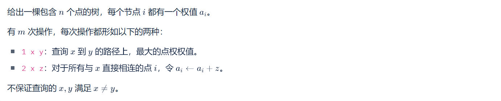

对于第二个操作，将父亲和重儿子直接添加Z，并在x处打上标记。那么只有遇到轻儿子的时候需要加上父亲处标记的贡献。在查询向上跳重链途中，将重链顶端（作为轻儿子）加上其父亲标记的贡献即可。

```cpp
#include"bits/stdc++.h"
#define endl '\n'
using ll=long long;
using namespace std;
constexpr int N=1e5+10;
constexpr int inf=0X3F3F3F3F;
constexpr ll INF=0X3F3F3F3F3F3F3F3F;

int a[N],tag[N];

#define ls p<<1
#define rs p<<1|1
struct node{
    int l,r;
    int mx;
}tr[N<<2];
void pushup(int p){
    tr[p].mx=max(tr[ls].mx,tr[rs].mx);
}
void build(int l,int r,int p=1){
    tr[p].l=l,tr[p].r=r;
    if(l==r){
        tr[p].mx=0;
        return;
    }
    int mid=l+r>>1;
    build(l,mid,ls);
    build(mid+1,r,rs);
    pushup(p);
}
void update(int l,int r,int c,int p=1){
    if(l<=tr[p].l&&tr[p].r<=r){
        tr[p].mx+=c;
        return;
    }
    int mid=tr[p].l+tr[p].r>>1;
    if(l<=mid)
        update(l,r,c,ls);
    if(mid<r)
        update(l,r,c,rs);
    pushup(p);
}
int query(int l,int r,int p=1){
    if(l<=tr[p].l&&tr[p].r<=r)
        return tr[p].mx;
    int mid=tr[p].l+tr[p].r>>1;
    int res=0;
    if(l<=mid)
        res=max(res,query(l,r,ls));
    if(mid<r)
        res=max(res,query(l,r,rs));
    return res;
}
#undef ls
#undef rs

int tot,top[N],dep[N],son[N],dfn[N],sz[N],fa[N];
vector<int>g[N];
void dfs0(int u,int p){
    dep[u]=dep[p]+1,sz[u]=1,fa[u]=p;
    for(auto v:g[u]){
        if(v==p)
            continue;
        dfs0(v,u);
        sz[u]+=sz[v];
        if(sz[son[u]]<sz[v])
            son[u]=v;
    }
}
void dfs1(int u,int r){
    dfn[u]=++tot;
    update(dfn[u],dfn[u],a[u]);
    top[u]=r;
    if(!son[u])
        return;
    dfs1(son[u],r);
    for(auto v:g[u]){
        if(v==fa[u]||v==son[u])
            continue;
        dfs1(v,v);
    }
}
int q(int u,int v){//DS是维护的数据结构
    int res(0);
    while(top[u]!=top[v]){
        if(dep[top[u]]<dep[top[v]])
            swap(u,v);
        // res=merge(res,query(dfn[top[u]],dfn[u]));//维护信息实例
        res=max(res,query(dfn[top[u]],dfn[u]));
        res=max(res,query(dfn[top[u]],dfn[top[u]])+tag[fa[top[u]]]);
        u=fa[top[u]];
    }
    if(dfn[u]>dfn[v])
        swap(u,v);
    // res=merge(res,query(dfn[u],dfn[v]));//维护信息实例
    res=max(res,query(dfn[u],dfn[v]));
    if(u==top[u])
        res=max(res,query(dfn[u],dfn[u])+tag[fa[u]]);
    return res;
}

void solve(){
    int n,m;
    cin>>n>>m;
    build(1,n);
    for(int i=1;i<=n;i++)
        cin>>a[i];
    for(int i=1;i<n;i++){
        int u,v;
        cin>>u>>v;
        g[u].push_back(v);
        g[v].push_back(u);
    }
    dfs0(1,0);
    dfs1(1,1);

    while(m--){
        int op;
        cin>>op;
        if(op==1){
            int x,y;
            cin>>x>>y;
            cout<<q(x,y)<<endl;
        }else{
            int x,z;
            cin>>x>>z;
            if(x!=1)
                update(dfn[fa[x]],dfn[fa[x]],z);
            if(son[x])
                update(dfn[son[x]],dfn[son[x]],z);
            tag[x]+=z;
        }
    }
    
    tot=0;
    for(int i=0;i<=n;i++){
        son[i]=tag[i]=0;
        g[i].clear();
    }
}
signed main(){
    cin.tie(nullptr)->sync_with_stdio(false);
    int _=1;cin>>_;while(_--)
    solve();
    return 0;
}
```

## 换根dp

树形dp的本质是后序遍历把儿子子树的贡献加到父亲上。换根dp则需要去除儿子子树在父亲子树中的贡献后将父亲子树贡献累加的儿子子树上，即换根。

那么我们需要两个函数，`link(u,v)` 将v子树贡献合并到u子树上，`cut(u,v)` 将v子树贡献从u子树中删除。

```cpp
vector<int>g[N];
void link(int u,int v){//v子树贡献合并到u子树上
    
}
void cut(int u,int v){//删除u子树中v子树的贡献
    
}
void dfs0(int u,int p){//树形dp
    for(auto v:g[u]){
        if(v==p)
            continue;
        dfs0(v,u);
        link(u,v);//合并贡献
    }
}
void dfs1(int u,int p){//换根dp
    for(auto v:g[u]){
        if(v==p)
            continue;
        cut(u,v);
        link(v,u);//换根

        dfs1(v,u);

        cut(v,u);
        link(u,v);//回溯
    }
}
```

例题

智乃有一颗由 $n$ 个节点组成的无根树。每一个节点都有一个颜色属性，要么是白色，要么是黑色。  
定义一颗黑白树的权值，为所有起点为黑色，终点为白色的简单路径长度之和，路径长度指的是简单路径中边的数目。  
现在智乃想知道，如果切断第 $i$ 条边，产生的两棵黑白树的权值分别是多少？  
注意这 $n-1$ 个询问互相独立，不会真的将树上的边切除。

```cpp
#include"bits/stdc++.h"
#define endl '\n'
using ll=long long;
using namespace std;
constexpr int N=1e5+10,inf=0X3F3F3F3F;
constexpr ll INF=0X3F3F3F3F3F3F3F3F;

#define debug(x) cerr<<#x<<' '<<x<<endl;
vector<array<int,2>>g[N];
bool a[N];
ll f[N],sum[N][2],cnt[N][2],ans[N][2],t[N];
/*
f统计子树答案
sum统计子树黑/白节点到当前节点路径和
cnt统计子树黑/白节点数目
*/
void link(int u,int v){
    f[u]+=f[v];
    for(int x=0;x<2;x++)
        f[u]+=sum[u][x]*cnt[v][x^1]+sum[v][x]*cnt[u][x^1]+cnt[u][x]*cnt[v][x^1];
    sum[u][1]+=sum[v][1]+cnt[v][1];
    sum[u][0]+=sum[v][0]+cnt[v][0];
    cnt[u][1]+=cnt[v][1];
    cnt[u][0]+=cnt[v][0];
}
void cut(int u,int v){
    cnt[u][1]-=cnt[v][1];
    cnt[u][0]-=cnt[v][0];
    sum[u][1]-=sum[v][1]+cnt[v][1];
    sum[u][0]-=sum[v][0]+cnt[v][0];
    for(int x=0;x<2;x++)
        f[u]-=sum[u][x]*cnt[v][x^1]+sum[v][x]*cnt[u][x^1]+cnt[u][x]*cnt[v][x^1];
    f[u]-=f[v];
}
void dfs0(int u,int p){
    cnt[u][a[u]]=1;
    for(auto [v,id]:g[u]){
        if(v==p)
            continue;
        dfs0(v,u);
        link(u,v);
    }
}
void dfs1(int u,int p){
    for(auto [v,id]:g[u]){
        if(v==p)
            continue;
        ans[id][t[id]==v]=f[v];
        cut(u,v);
        link(v,u);
        ans[id][t[id]!=v]=f[u];
        dfs1(v,u);
        cut(v,u);
        link(u,v);
    }
}
void solve(){
    int n;
    cin>>n;
    for(int i=1;i<=n;i++){
        char c;
        cin>>c;
        a[i]=(c=='b');
    }
    for(int i=1;i<n;i++){
        int u,v;
        cin>>u>>v;
        t[i]=v;
        g[u].push_back({v,i});
        g[v].push_back({u,i});
    }
    dfs0(1,0);
    dfs1(1,0);
    for(int i=1;i<n;i++)
        cout<<ans[i][0]<<' '<<ans[i][1]<<endl;
}
signed main(){
    cin.tie(nullptr)->sync_with_stdio(0);
//	int t;cin>>t;while(t--)
    solve();
    return 0;
}
```

## 欧拉图

定义

-   **欧拉回路**：通过图中每条边恰好一次的回路
-   **欧拉通路**：通过图中每条边恰好一次的通路
-   **欧拉图**：具有欧拉回路的图
-   **半欧拉图**：具有欧拉通路但不具有欧拉回路的图

性质

欧拉图中所有顶点的度数都是偶数。

若 $G$ 是欧拉图，则它为若干个环的并，且每条边被包含在奇数个环内。

### 判别法

1.  无向图是欧拉图当且仅当：
    -   非零度顶点是连通的
    -   顶点的度数都是偶数
2.  无向图是半欧拉图当且仅当：
    -   非零度顶点是连通的
    -   恰有 2 个奇度顶点
3.  有向图是欧拉图当且仅当：
    -   非零度顶点是强连通的
    -   每个顶点的入度和出度相等
4.  有向图是半欧拉图当且仅当：
    -   非零度顶点是弱连通的
    -   至多一个顶点的出度与入度之差为 1
    -   至多一个顶点的入度与出度之差为 1
    -   其他顶点的入度和出度相等

### 求欧拉回路

```cpp
vector<int>ans;//存储的是倒过来路径
vector<array<int,2>>g[N];//to,ind
int vis[N],tot,ind[N];//边的数量，无向边要乘二,ind记录遍历到g【u】的下标位置
void add(int u,int v){
    g[u].push_back({v,tot});
    g[v].push_back({u,tot++});
}
void dfs(int u){
    for(;ind[u]<g[u].size();ind[u]++){
        auto &[v,i]=g[u][ind[u]];
        if(vis[i])
            continue;
        vis[i]=1;
        dfs(v);
        //ans.push_back(i);//记录边
    }
    // ans.push_back(u);//记录点
}
```

Hierholzer 算法
也称逐步插入回路法。

过程

算法流程为从一条回路开始，每次任取一条目前回路中的点，将其替换为一条简单回路，以此寻找到一条欧拉回路。如果从路开始的话，就可以寻找到一条欧拉路。

实现

Hierholzer 算法的暴力实现如下：

$$
\begin{array}{ll}
1 &  \textbf{Input. } \text{The edges of the graph } e , \text{ where each element in } e \text{ is } (u, v) \\
2 &  \textbf{Output. } \text{The vertex of the Euler Road of the input graph}.\\
3 &  \textbf{Method. } \\
4 &  \textbf{Function } \text{Hierholzer } (v) \\
5 &  \qquad circle \gets \text{Find a Circle in } e \text{ Begin with } v \\
6 &  \qquad \textbf{if } circle=\varnothing \\
7 &  \qquad\qquad \textbf{return } v \\
8 &  \qquad e \gets e-circle \\
9 &  \qquad \textbf{for} \text{ each } v \in circle \\
10&  \qquad\qquad v \gets \text{Hierholzer}(v) \\
11&  \qquad \textbf{return } circle \\
12&  \textbf{Endfunction}\\
13&  \textbf{return } \text{Hierholzer}(\text{any vertex})
\end{array}
$$

性质

这个算法的时间复杂度约为 $O(nm+m^2)$。实际上还有复杂度更低的实现方法，就是将找回路的 DFS 和 Hierholzer 算法的递归合并，边找回路边使用 Hierholzer 算法。

如果需要输出字典序最小的欧拉路或欧拉回路的话，因为需要将边排序，时间复杂度是 $\Theta(n+m\log m)$（计数排序或者基数排序可以优化至 $\Theta(n+m)$）。如果不需要排序，时间复杂度是 $\Theta(n+m)$。

## 最近公共祖先lca

### 模板（树剖）

```cpp
struct tree{
    int n;
    vector<vector<int>>g;
    vector<int>fa,dep,son,sz,top;
    tree(){};
    tree(int _n):n(_n){}
    void init(int n){
        this->n=n;
        g.resize(n);
        fa.resize(n);
        dep.resize(n);
        son.resize(n);
        sz.resize(n);
        top.resize(n);
    }
    void addedge(int u,int v){
        g[u].emplace_back(v);
        g[v].emplace_back(u);
    }
    void build(int s){
        dfs1(s,s);
        dfs2(s,s);
    }
    void dfs1(int u,int p){
        fa[u]=p;
        dep[u]=dep[p]+1;
        sz[u]=1;
        for (auto v:g[u]){
            if (v==p)
                continue;
            dfs1(v,u);
            sz[u]+=sz[v];
            if (sz[son[u]]<sz[v])
                son[u]=v;
        }
    }
    void dfs2(int u,int t){
        top[u]=t;
        if (!son[u])
            return;
            dfs2(son[u],t);
        for (auto v : g[u]){
            if (v==fa[u]||v==son[u])
                continue;
            dfs2(v,v);
        }
    }
    int lca(int u,int v){
        while(top[u]!=top[v]){
            if(dep[top[u]]<dep[top[v]])
                swap(u,v);
            u=fa[top[u]];
        }
        return dep[u]<dep[v]?u:v;
    }
};
```

### 树链剖分求lca

[【模板】最近公共祖先](https://www.luogu.com.cn/problem/P3379)
```cpp
int idx;
vector<int>g[N];
int fa[N],dep[N],son[N],sz[N],top[N];
void dfs1(int u,int p){
    ++idx;
    fa[u]=p;
    dep[u]=dep[p]+1;
    sz[u]=1;
    for (auto v:g[u]){
        if (v==p)
            continue;
        dfs1(v,u);
        sz[u]+=sz[v];
        if (sz[son[u]]<sz[v])
            son[u]=v;
    }
}
void dfs2(int u,int t){
    top[u]=t;
    if (!son[u])
        return;
        dfs2(son[u],t);
    for (auto v : g[u]){
        if (v==fa[u]||v==son[u])
            continue;
        dfs2(v,v);
    }
}
int lca(int u,int v){
    while(top[u]!=top[v]){
        if(dep[top[u]]<dep[top[v]])
            swap(u,v);
        u=fa[top[u]];
    }
    return dep[u]<dep[v]?u:v;
}
```

先 `dfs1(root,0)` 再 `dfs2(root,root)`

---


### 倍增法求lca

```cpp
struct binaryListing_lca{
	vector<int> g[N];
	int d[N]={},fa[N][32]={};
	void dfs(int u,int pa){
		d[u]=d[pa]+1;
		fa[u][0]=pa;
		for(int i=1;(1<<i)<=d[u];i++)
			fa[u][i]=fa[fa[u][i-1]][i-1];
		for(auto v:g[u])
			if(v!=pa)
				dfs(v,u);
	};
	int lca(int x,int y){
		if(d[x]<d[y])
			swap(x,y);
		for(int i=30;~i;i--)
			if(d[x]-(1<<i)>=d[y])
				x=fa[x][i];
		if(x==y)
			return x;
		for(int i=30;~i;i--)
			if(fa[x][i]!=fa[y][i]){
				x=fa[x][i];
				y=fa[y][i];
			}
		return fa[x][0];
	};
	int dist(int x,int y){
		return d[x]+d[y]-2*d[lca(x,y)];	
	};
};
```


[P3379 【模板】最近公共祖先（LCA）](https://www.luogu.com.cn/problem/P3379)
如题，给定一棵有根多叉树，请求出指定两个点直接最近的公共祖先。
输入格式
第一行包含三个正整数 _N_,_M_,_S_，分别表示树的结点个数、询问的个数和树根结点的序号。
接下来 _N_−1 行每行包含两个正整数 _x_,_y_，表示 _x_ 结点和_y_ 结点之间有一条直接连接的边（数据保证可以构成树）。
接下来 _M_ 行每行包含两个正整数 _a_,_b_，表示询问 _a_ 结点和 _b_ 结点的最近公共祖先。
输出格式
输出包含 _M_ 行，每行包含一个正整数，依次为每一个询问的结果。

```cpp
#include<bits/stdc++.h>
#define endl '\n'
#define ll long long
using namespace std;
const int N=5e5+10;
struct binaryListing_lca{
	vector<int> g[N];
	int d[N]={},fa[N][32]={};
	void dfs(int u,int pa){
		d[u]=d[pa]+1;
		fa[u][0]=pa;
		for(int i=1;(1<<i)<=d[u];i++)
			fa[u][i]=fa[fa[u][i-1]][i-1];
		for(auto v:g[u])
			if(v!=pa)
				dfs(v,u);
	};
	int lca(int x,int y){
		if(d[x]<d[y])
			swap(x,y);
		for(int i=30;~i;i--)
			if(d[x]-(1<<i)>=d[y])
				x=fa[x][i];
		if(x==y)
			return x;
		for(int i=30;~i;i--)
			if(fa[x][i]!=fa[y][i]){
				x=fa[x][i];
				y=fa[y][i];
			}
		return fa[x][0];
	};
	int dist(int x,int y){
		return d[x]+d[y]-2*d[lca(x,y)];	
	};
}lca;
void IMSB(){
	int n,m,s;
	cin>>n>>m>>s;
	for(int i=1;i<n;i++){
		int u,v;
		cin>>u>>v;
		lca.g[u].push_back(v);
		lca.g[v].push_back(u);
	}
	lca.dfs(s,0);
	while(m--){
		int a,b;
		cin>>a>>b;
		cout<<lca.lca(a,b)<<endl;
	}
}
signed main(){
	ios::sync_with_stdio(0),cin.tie(nullptr),cout.tie(nullptr);
//	int t;cin>>t;while(t--)
	IMSB();
	return 0;
}
```

### tarjan求lca

[https://www.luogu.com.cn/problem/P3379](https://www.luogu.com.cn/problem/P3379)
题目描述
如题，给定一棵有根多叉树，请求出指定两个点直接最近的公共祖先。
输入格式
第一行包含三个正整数 $N,M,S$，分别表示树的结点个数、询问的个数和树根结点的序号。
接下来 $N-1$ 行每行包含两个正整数 $x, y$，表示 $x$ 结点和 $y$ 结点之间有一条直接连接的边（数据保证可以构成树）。
接下来 $M$ 行每行包含两个正整数 $a, b$，表示询问 $a$ 结点和 $b$ 结点的最近公共祖先。
输出格式
输出包含 $M$ 行，每行包含一个正整数，依次为每一个询问的结果。
```cpp
// #define TY09
#include"bits/stdc++.h"
#define ll long long
#define endl '\n'
using namespace std;
constexpr int N=500000+10,inf=0X3F3F3F3F,mod=1000000007;
vector<int>g[N];
vector<array<int,2>>qry[N];
int fa[N];
bool vis[N];
int ans[N];
int find(int x){
	return fa[x]==x?x:fa[x]=find(fa[x]);
}
void tarjan(int u){
	vis[u]=1;
	for(auto v:g[u]){
		if(!vis[v]){
			tarjan(v);
			fa[v]=u;
		}
	}
	for(auto [v,ind]:qry[u]){
		if(vis[v]){
			ans[ind]=find(v);
		}
	}
}
void IMSB(){
	int n,m,s;
	cin>>n>>m>>s;
	for(int i=1;i<=n;i++)
		fa[i]=i;
	for(int i=1;i<n;i++){
		int u,v;
		cin>>u>>v;
		g[u].push_back(v);
		g[v].push_back(u);
	}
	for(int i=1;i<=m;i++){
		int u,v;
		cin>>u>>v;
		qry[u].push_back({v,i});
		qry[v].push_back({u,i});
	}
	tarjan(s);
	for(int i=1;i<=m;i++){
		cout<<ans[i]<<endl;
	}
}
signed main(){
	cin.tie(nullptr)->sync_with_stdio(0);
//	int t;cin>>t;while(t--)
	IMSB();
	return 0;
}
/* It's time to go home although where I don't know. */
```

### 欧拉序求lca

对一棵树进行 DFS，无论是第一次访问还是回溯，每次到达一个结点时都将编号记录下来，可以得到一个长度为 $2n-1$ 的序列，这个序列被称作这棵树的欧拉序列。

在下文中，把结点 $u$ 在欧拉序列中第一次出现的位置编号记为 $dfn(u)$（也称作节点 $u$ 的欧拉序），把欧拉序列本身记作 $E[1..2n-1]$。

有了欧拉序列，LCA 问题可以在线性时间内转化为 RMQ 问题，即 $pos(LCA(u, v))=\min\{pos(k)|k\in E[pos(u)..pos(v)]\}$。

这个等式不难理解：从 $u$ 走到 $v$ 的过程中一定会经过 $LCA(u,v)$，但不会经过 $LCA(u,v)$ 的祖先。因此，从 $u$ 走到 $v$ 的过程中经过的欧拉序最小的结点就是 $LCA(u, v)$。

使用 ST 表求解，预处理时间复杂度 $O(nlogn)$ 询问时间复杂度 $O(1)$ 。

```cpp
#include"bits/stdc++.h"
#define endl '\n'
using ll=long long;
using namespace std;
constexpr int N=5e5+10,inf=0X3F3F3F3F;
constexpr ll INF=0X3F3F3F3F3F3F3F3F;

int lg[N<<1],st[N<<1][20];
int tot,dfn[N<<1],dep[N],er[N<<1];//dfn存节点第一次出现位置，er存欧拉序列
vector<int>g[N];
void dfs(int u,int p){
    dfn[u]=++tot;
    er[tot]=u;
    dep[u]=dep[p]+1;
    for(auto v:g[u]){
        if(v==p)
            continue;
        dfs(v,u);
        er[++tot]=u;
    }
}
void init(){
    lg[0]=-1;
    for(int i=1;i<=tot;i++)
        lg[i]=lg[i/2]+1;
    for(int i=1;i<=tot;i++)
        st[i][0]=er[i];
    for(int j=1;j<20;j++){
        for(int i=1;i+(1<<j)-1<=tot;i++){
            int x=st[i][j-1],y=st[i+(1<<(j-1))][j-1];
            st[i][j]=dep[x]<dep[y]?x:y;
        }
    }
}
int lca(int u,int v){
    if(dfn[u]>dfn[v])
        swap(u,v);
    int l=dfn[u],r=dfn[v],k=lg[r-l+1];
    int x=st[l][k],y=st[r-(1<<k)+1][k];
    return dep[x]<dep[y]?x:y;
}

void solve(){
    int n,m,s;
    cin>>n>>m>>s;
    for(int i=1;i<n;i++){
        int u,v;
        cin>>u>>v;
        g[u].push_back(v);
        g[v].push_back(u);
    }
    dfs(s,0);
    init();
    while(m--){
        int u,v;
        cin>>u>>v;
        cout<<lca(u,v)<<endl;
    }
}
signed main(){
    cin.tie(nullptr)->sync_with_stdio(0);
//	int t;cin>>t;while(t--)
    solve();
    return 0;
}
```

## 虚树

### 构造：二次排序 + LCA 连边

```cpp
vector<int>vg[N];
vector<int>h,a;
set<int>s;
bool cmp(int x,int y){
    return dfn[x]<dfn[y];
}
void build(){//建立虚树
    a.clear();
    sort(h.begin(),h.end(),cmp);
    a.push_back(h[0]);
    for(int i=1;i<h.size();i++){
        a.push_back(h[i]);
        a.push_back(lca(h[i],h[i-1]));
    }
    sort(a.begin(),a.end(),cmp);
    a.erase(unique(a.begin(),a.end()),a.end());
    for(int i=1,p;i<a.size();i++){
        p=lca(a[i],a[i-1]);
        vg[p].push_back(a[i]);
        vg[a[i]].push_back(p);
    }
}
```

因为多个节点的 LCA 可能是同一个，所以我们不能多次将它加入虚树。

非常直观的一个方法是：

-   将关键点按 DFS 序排序；
-   遍历一遍，任意两个相邻的关键点求一下 LCA，并且判重；
-   然后根据原树中的祖先后代关系建树。

具体实现上，在 **关键点序列** 上，枚举 **相邻的两个数**，两两求得 LCA 并且加入序列 $A$ 中。

因为 DFS 序的性质，此时的序列 $A$ 已经包含了 **虚树中的所有点**，但是可能有重复。

所以我们把序列 $A$ 按照 DFS 序 **从小到大排序并去重**。

最后，在序列 $A$ 上，枚举 **相邻** 的两个 **点编号**  $x,y$，求得它们的 LCA 并且连接 $\operatorname{LCA}(x,y),y$，虚树就构造完成了。

为什么连接 $\operatorname{LCA}(x,y)$ 和 $y$ 可以做到不重不漏呢？

因为至少要两个实点才能够召唤出来一个虚点，再加上一个根节点，所以虚树的点数就是实点数量的两倍。

时间复杂度 $O(m\log n)$，其中 $m$ 为关键点数，$n$ 为总点数。

### 例题

#### P2495 [SDOI2011] 消耗战

##### 题目描述

在一场战争中，战场由 $n$ 个岛屿和 $n-1$ 个桥梁组成，保证每两个岛屿间有且仅有一条路径可达。现在，我军已经侦查到敌军的总部在编号为 $1$ 的岛屿，而且他们已经没有足够多的能源维系战斗，我军胜利在望。已知在其他 $k$ 个岛屿上有丰富能源，为了防止敌军获取能源，我军的任务是炸毁一些桥梁，使得敌军不能到达任何能源丰富的岛屿。由于不同桥梁的材质和结构不同，所以炸毁不同的桥梁有不同的代价，我军希望在满足目标的同时使得总代价最小。  

侦查部门还发现，敌军有一台神秘机器。即使我军切断所有能源之后，他们也可以用那台机器。机器产生的效果不仅仅会修复所有我军炸毁的桥梁，而且会重新随机资源分布（但可以保证的是，资源不会分布到 $1$ 号岛屿上）。不过侦查部门还发现了这台机器只能够使用 $m$ 次，所以我们只需要把每次任务完成即可。

##### 输入格式

第一行一个整数 $n$，表示岛屿数量。  

接下来 $n-1$ 行，每行三个整数 $u,v,w$ ，表示 $u$ 号岛屿和 $v$ 号岛屿由一条代价为 $w$ 的桥梁直接相连。  

第 $n+1$ 行，一个整数 $m$ ，代表敌方机器能使用的次数。  

接下来 $m$ 行，第 $i$ 行一个整数 $k_i$ ，代表第 $i$ 次后，有 $k_i$ 个岛屿资源丰富。接下来 $k_i$ 个整数 $h_1,h_2,..., h_{k_i}$ ，表示资源丰富岛屿的编号。

##### 输出格式

输出共 $m$ 行，表示每次任务的最小代价。

##### 输入输出样例 #1

###### 输入 #1

```
10
1 5 13
1 9 6
2 1 19
2 4 8
2 3 91
5 6 8
7 5 4
7 8 31
10 7 9
3
2 10 6
4 5 7 8 3
3 9 4 6
```

###### 输出 #1

```
12
32
22
```


- 对于 $10\%$ 的数据，$n\leq 10, m\leq 5$ 。  
- 对于 $20\%$ 的数据，$n\leq 100, m\leq 100, 1\leq k_i\leq 10$ 。  
- 对于 $40\%$ 的数据，$n\leq 1000, 1\leq k_i\leq 15$ 。  
- 对于 $100\%$ 的数据，$2\leq n \leq 2.5\times 10^5, 1\leq m\leq 5\times 10^5, \sum k_i \leq 5\times 10^5, 1\leq k_i< n, h_i\neq 1, 1\leq u,v\leq n, 1\leq w\leq 10^5$ 。

### 题解

每次建虚树跑dp

```cpp
#include"bits/stdc++.h"
#define endl '\n'
using ll=long long;
using namespace std;
constexpr int N=3e5+10,inf=0X3F3F3F3F;
constexpr ll INF=0X3F3F3F3F3F3F3F3F;

vector<array<int,2>>g[N];
int d[N],fa[N][32],md[N][32],dfn[N],idx;
void dfs0(int u,int pa){
    d[u]=d[pa]+1;
    fa[u][0]=pa;
    dfn[u]=++idx;
    for(int i=1;(1<<i)<=d[u];i++){
        fa[u][i]=fa[fa[u][i-1]][i-1];
        md[u][i]=min(md[u][i-1],md[fa[u][i-1]][i-1]);
    }
    for(auto [v,w]:g[u])
        if(v!=pa){
            md[v][0]=w;
            dfs0(v,u);
        }
};
int lca(int x,int y){
    if(d[x]<d[y])
        swap(x,y);
    for(int i=30;~i;i--)
        if(d[x]-(1<<i)>=d[y])
            x=fa[x][i];
    if(x==y)
        return x;
    for(int i=30;~i;i--)
        if(fa[x][i]!=fa[y][i]){
            x=fa[x][i];
            y=fa[y][i];
        }
    return fa[x][0];
};
int muv(int x,int y){//求两点路径上最小边权（xy不互为祖宗时未验证）
    int res=inf;
    if(d[x]<d[y])
        swap(x,y);
    for(int i=30;~i;i--)
        if(d[x]-(1<<i)>=d[y]){
            res=min(res,md[x][i]);
            x=fa[x][i];
        }
    if(x==y)
        return res;
    for(int i=30;~i;i--){
        if(fa[x][i]!=fa[y][i]){
            res=min(res,md[x][i]);
            res=min(res,md[y][i]);
            x=fa[x][i];
            y=fa[y][i];
        }
    }
    res=min({res,md[x][0],md[y][0]});
    return res;
}
vector<int>vg[N];
vector<int>h,a;
set<int>s;
bool cmp(int x,int y){
    return dfn[x]<dfn[y];
}
void build(){//建立虚树
    a.clear();
    sort(h.begin(),h.end(),cmp);
    a.push_back(h[0]);
    for(int i=1;i<h.size();i++){
        a.push_back(h[i]);
        a.push_back(lca(h[i],h[i-1]));
    }
    sort(a.begin(),a.end(),cmp);
    a.erase(unique(a.begin(),a.end()),a.end());
    for(int i=1,p;i<a.size();i++){
        p=lca(a[i],a[i-1]);
        vg[p].push_back(a[i]);
        vg[a[i]].push_back(p);
    }
}

ll dp[N];
ll dfs(int u,int p){
    dp[u]=0;
    for(auto v:vg[u]){
        if(v==p)
            continue;
        dfs(v,u);
        if(s.count(v)){//是关键点，删除最小边权
            dp[u]+=muv(u,v);
        }
        else{//不是关键点，最优转移
            dp[u]+=min(dp[v],1ll*muv(u,v));
        }
    }
    vg[u].clear();//删除虚树中的点
    return dp[u];
}
void solve(){
    memset(md,0x3f,sizeof md);
    int n;
    cin>>n;
    for(int i=1;i<n;i++){
        int u,v,w;
        cin>>u>>v>>w;
        g[u].push_back({v,w});
        g[v].push_back({u,w});
    }
    dfs0(1,0);
    int m;
    cin>>m;
    for(int t=0;t<m;t++){
        int k;
        cin>>k;
        h.clear();
        s.clear();
        h.push_back(1);
        for(int i=0,u;i<k;i++){
            cin>>u;
            h.push_back(u);
            s.insert(u);
        }
        build();
        cout<<dfs(1,0)<<endl;
    }
}
signed main(){
    cin.tie(nullptr)->sync_with_stdio(0);
//	int t;cin>>t;while(t--)
    solve();
    return 0;
}
```

## 有向无环图（DAG）的最小路径覆盖

**定义**：在一个有向图中，找出最少的路径，使得这些路径经过了所有的点。

最小路径覆盖分为**最小不相交路径覆盖**和**最小可相交路径覆盖**。

**最小不相交路径覆盖**：每一条路径经过的顶点各不相同。如图，其最小路径覆盖数为3。即1->3>4，2，5。

**最小可相交路径覆盖**：每一条路径经过的顶点可以相同。如果其最小路径覆盖数为2。即1->3->4，2->3>5。

特别的，每个点自己也可以称为是路径覆盖，只不过路径的长度是0。

注：如果要覆盖所有的边，则将边化成点重新建边

### DAG的最小不相交路径覆盖

**算法**：把原图的每个点V拆成Vx

和Vy两个点，如果有一条有向边A->B，那么就加边Ax−>By

。这样就得到了一个二分图。那么最小路径覆盖=原图的结点数-新图的最大匹配数。

**证明**：一开始每个点都是独立的为一条路径，总共有n条不相交路径。我们每次在二分图里找一条匹配边就相当于把两条路径合成了一条路径，也就相当于路径数减少了1。所以找到了几条匹配边，路径数就减少了多少。所以有最小路径覆盖=原图的结点数-新图的最大匹配数。

因为路径之间不能有公共点，所以加的边之间也不能有公共点，这就是匹配的定义。

### DAG的最小可相交路径覆盖

**算法**：先用floyd求出原图的传递闭包，即如果a到b有路径，那么就加边a->b。然后就转化成了最小不相交路径覆盖问题。

**证明**：为了连通两个点，某条路径可能经过其它路径的中间点。比如1->3->4，2->4->5。但是如果两个点a和b是连通的，只不过中间需要经过其它的点，那么可以在这两个点之间加边，那么a就可以直达b，不必经过中点的，那么就转化成了最小不相交路径覆盖。

## 二分图

二分图是什么？节点由两个集合组成，且两个集合内部没有边的图。

换言之，存在一种方案，将节点划分成满足以上性质的两个集合。

- 如果两个集合中的点分别染成黑色和白色，可以发现二分图中的每一条边都一定是连接一个黑色点和一个白色点。
- 二分图不存在长度为奇数的环
### 判定

我们可以使用 DFS 或 BFS 来遍历这张图。如果发现了奇环，那么就不是二分图，否则是。

### 二分图最大匹配

给定一个二分图G ，即分左右两部分，各部分之间的点没有边连接，要求选出一些边，使得这些边没有公共顶点，且边的数量最大。

#### 增广路算法 Augmenting Path Algorithm

时间复杂度 $O(|V||E|)$  。
左右点集可以序号相同

```cpp
struct augment_path {
  vector<vector<int>> g;
  vector<int> pa;  // 匹配
  vector<int> pb;
  vector<int> vis;  // 访问
  int n, m;         // 两个点集中的顶点数量
  int dfn;          // 时间戳记
  int res;          // 匹配数

  augment_path(int _n, int _m) : n(_n), m(_m) {
    assert(0 <= n && 0 <= m);
    pa = vector<int>(n, -1);
    pb = vector<int>(m, -1);
    vis = vector<int>(n);
    g.resize(n);
    res = 0;
    dfn = 0;
  }

  void add(int from, int to) {
    assert(0 <= from && from < n && 0 <= to && to < m);
    g[from].push_back(to);
  }

  bool dfs(int v) {
    vis[v] = dfn;
    for (int u : g[v]) {
      if (pb[u] == -1) {
        pb[u] = v;
        pa[v] = u;
        return true;
      }
    }
    for (int u : g[v]) {
      if (vis[pb[u]] != dfn && dfs(pb[u])) {
        pa[v] = u;
        pb[u] = v;
        return true;
      }
    }
    return false;
  }

  int solve() {
    while (true) {
      dfn++;
      int cnt = 0;
      for (int i = 0; i < n; i++) {
        if (pa[i] == -1 && dfs(i)) {
          cnt++;
        }
      }
      if (cnt == 0) {
        break;
      }
      res += cnt;
    }
    return res;
  }
};
```

#### Hopcroft–Karp 算法

时间复杂度 $O(|V|^{\frac{1}{2}}|E|)$  。
左右点集可以序号相同，可以存在不被连边的节点。

```cpp
struct HopcroftKarp {
    vector<vector<int>> adj;  // 邻接表：左部节点 -> 右部节点列表
    vector<int> pair_u;        // pair_u[u]：左部节点 u 匹配的右部节点（-1 表示未匹配）
    vector<int> pair_v;        // pair_v[v]：右部节点 v 匹配的左部节点（-1 表示未匹配）
    vector<int> dist;          // BFS 分层时记录左部节点的距离
    int n, m;                  // n：左部节点数，m：右部节点数

    // 构造函数：初始化左右部节点数
    HopcroftKarp(int _n = 0, int _m = 0) : n(_n), m(_m) {
        init(_n, _m);
    }

    // 初始化函数：重置所有数据结构（方便多组测试数据复用）
    void init(int _n, int _m) {
        n = _n;
        m = _m;
        adj.assign(n, vector<int>());
        pair_u.assign(n, -1);
        pair_v.assign(m, -1);
        dist.resize(n);
    }

    // 添加边：u 是左部节点，v 是右部节点（均为 0-based）
    void addEdge(int u, int v) {
        adj[u].push_back(v);
    }

    // BFS 分层：寻找所有可能的增广路起点
    bool bfs() {
        queue<int> q;
        fill(dist.begin(), dist.end(), -1);

        // 将所有未匹配的左部节点加入队列
        for (int u = 0; u < n; ++u) {
            if (pair_u[u] == -1) {
                dist[u] = 0;
                q.push(u);
            }
        }

        bool found = false;
        while (!q.empty()) {
            int u = q.front();
            q.pop();

            for (int v : adj[u]) {
                if (pair_v[v] == -1) {
                    found = true;  // 找到未匹配的右部节点，存在增广路
                } else if (dist[pair_v[v]] == -1) {
                    dist[pair_v[v]] = dist[u] + 1;
                    q.push(pair_v[v]);
                }
            }
        }
        return found;
    }

    // DFS 多路增广：基于 BFS 分层结果寻找增广路
    bool dfs(int u) {
        for (int v : adj[u]) {
            if (pair_v[v] == -1 || (dist[pair_v[v]] == dist[u] + 1 && dfs(pair_v[v]))) {
                pair_u[u] = v;
                pair_v[v] = u;
                return true;
            }
        }
        dist[u] = -1;  // 标记为不可用，避免重复访问
        return false;
    }

    // 主算法：返回最大匹配数
    int maxMatching() {
        int res = 0;
        while (bfs()) {
            for (int u = 0; u < n; ++u) {
                if (pair_u[u] == -1) {
                    if (dfs(u)) {
                        res++;
                    }
                }
            }
        }
        return res;
    }
};
```

#### 转为网络最大流模型

二分图最大匹配可以转换成网络流模型。

将源点连上左边所有点，右边所有点连上汇点，容量皆为1。原来的每条边从左往右连边，容量也皆为 1，最大流即最大匹配。


### 二分图最小点覆盖（König 定理

最小点覆盖：选最少的点，满足每条边至少有一个端点被选。

二分图中，最小点覆盖 = 最大匹配。

### 二分图最大独立集

最大独立集：选最多的点，满足两两之间没有边相连。

因为在最小点覆盖中，任意一条边都被至少选了一个顶点，所以对于其点集的补集，任意一条边都被至多选了一个顶点，所以不存在边连接两个点集中的点，且该点集最大。因此二分图中，最大独立集  最小点覆盖。

## 菊花图

检查整个图所有极大连通子图是不是菊花图，可以考虑使用并查集，对每个连通块记录点的个数，边的
个数和度数为1的点的个数，对于一个连通块，如果边的个数比点的个数少一个，且度数为1的点的个
数和连通块的点的个数差值不大于1，就说明这个子图是菊花图。

## 树

### 树上前缀和

设 $\textit{sum}_i$ 表示结点 $i$ 到根节点的权值总和。  
然后：
-   若是点权，$x,y$ 路径上的和为 $\textit{sum}_x + \textit{sum}_y - \textit{sum}_\textit{lca} - \textit{sum}_{\textit{fa}_\textit{lca}}$。
-   若是边权，$x,y$ 路径上的和为 $\textit{sum}_x + \textit{sum}_y - 2\cdot\textit{sum}_{lca}$。

### dfn序

可以把一个节点的子树转换成连续的区间

```cpp
int L[N],R[N],tot;
vector<int>g[N];
void dfs(int u,int p){
    L[u]=++tot;
    for(auto v:g[u]){
        if(v==p)
            continue;
        dfs(v,u);
    }
    R[u]=tot;
}
```


### 判断一个排列是否dfs序

排列（1-index）。排列 $p$  的 $p_1$ 需要等于根节点，然后对于 $1\leq i < n \ , \  lca(p_i,p_{i+1})=fa(p_{i+1})$ 。

[例题](https://codeforces.com/contest/2002/problem/D2)

你有一个由$n$个顶点组成的树。这些顶点从$1$到$n$编号，根是顶点$1$。你还被给定了一个$p_1, p_2, \ldots, p_n$的排列，其中$[1,2,\ldots,n]$。

你需要回答$q$个查询。对于每个查询，你被给定两个整数$x$和$y$；你需要交换$p_x$和$p_y$，并确定$p_1, p_2, \ldots, p_n$是否是给定树的有效的DFS顺序。

请注意，交换操作在查询中是**持久的**。
请注意，DFS顺序不是唯一的。

```cpp
#include"bits/stdc++.h"
#define ll long long
#define endl '\n'
using namespace std;
constexpr int N=3e5+10,inf=0X3F3F3F3F;
constexpr ll INF=0X3F3F3F3F3F3F3F3F;

int idx;
vector<int>g[N];
int fa[N],dep[N],son[N],sz[N],top[N];
void dfs1(int u,int p){
    ++idx;
    fa[u]=p;
    dep[u]=dep[p]+1;
    sz[u]=1;
    for (auto v:g[u]){
        if (v==p)
            continue;
        dfs1(v,u);
        sz[u]+=sz[v];
        if (sz[son[u]]<sz[v])
            son[u]=v;
    }
}
void dfs2(int u,int t){
    top[u]=t;
    if (!son[u])
        return;
        dfs2(son[u],t);
    for (auto v : g[u]){
        if (v==fa[u]||v==son[u])
            continue;
        dfs2(v,v);
    }
}
int lca(int u,int v){
    while(top[u]!=top[v]){
        if(dep[top[u]]<dep[top[v]])
            swap(u,v);
        u=fa[top[u]];
    }
    return dep[u]<dep[v]?u:v;
}
void solve(){
    int n,q;
    cin>>n>>q;
    vector<int>p(n+1),tp(n+1);
    for(int i=2;i<=n;i++){
        cin>>fa[i];
        g[fa[i]].push_back(i);
    }
    for(int i=1;i<=n;i++){
        cin>>p[i];
        tp[p[i]]=i;
    }

    dfs1(1,0);
    dfs2(1,1);

    int tot=0;
    tot+=(p[1]!=1);
    for(int i=1;i<n;i++){
        if(lca(p[i],p[i+1])==fa[p[i+1]])
            ;
        else
            tot++;
    }

    auto calc=[&](int x,int &c){
        if(x<n&&x>0)
            if(lca(p[x],p[x+1])==fa[p[x+1]])
                ;
            else
                c++;
        if(x==1)
            c+=(p[1]!=1);
    };

    while(q--){
        int x,y;
        cin>>x>>y;
        int c1=0,c2=0;

        set<int>s;
        s.insert(x);
        s.insert(x-1);
        s.insert(y);
        s.insert(y-1);
        // calc(x,c1),calc(x-1,c1);
        // calc(y,c1),calc(y-1,c1);
        for(auto i:s)
            calc(i,c1);

        swap(tp[p[x]],tp[p[y]]);
        swap(p[x],p[y]);

        for(auto i:s)
            calc(i,c2);

        tot+=c2-c1;
        if(!tot)
            cout<<"YES"<<endl;
        else
            cout<<"NO"<<endl;
    }

    idx=0;
    for(int i=0;i<=n;i++){
        g[i].clear();
        fa[i]=dep[i]=son[i]=sz[i]=top[i]=0;
    }
}
signed main(){
    cin.tie(nullptr)->sync_with_stdio(0);
	int t;cin>>t;while(t--)
    solve();
    return 0;
}
```

### **树的直径**

```cpp
int n,ans,s;
bool vis[N];
int h[N],e[N],ne[N],idx,w[N];
void add(int a,int b,int c){
    e[++idx]=b;w[idx]=c;
    ne[idx]=h[a];h[a]=idx;
}
int dfs(int u){
    vis[u]=1;
    int d1=0,d2=0;
    for (int i = h[u]; i!=-1 ; i=ne[i]) {
        int j=e[i];
        if (vis[j])continue;
        int d= dfs(j)+w[i];
        if (d>=d1)d2=d1,d1=d;
        else if (d>d2) d2=d;
    }
    ans= max(ans,d1+d2);
    return d1;
}
void GordenGhost() {
    cin>>n;
    memset(h,-1,sizeof h);
    for (int i = 1; i < n; ++i) {
        int a,b,c=1;
        cin>>a>>b>>c;
        add(a,b,c);
        add(b,a,c);
    }
    dfs(1);
    cout<<ans<<endl;
}
```

---

### **树的重心**

#### 定义

如果在树中选择某个节点并删除，这棵树将分为若干棵子树，统计子树节点数并记录最大值。取遍树上所有节点，使此最大值取到最小的节点被称为整个树的重心。
（这里以及下文中的「子树」若无特殊说明都是指无根树的子树，即包括「向上」的那棵子树，并且不包括整棵树自身。）

#### 性质


- 树的重心如果不唯一，则至多有两个，且这两个重心相邻。
- 以树的重心为根时，所有子树的大小都不超过整棵树大小的一半。
- 树中所有点到某个点的距离和中，到重心的距离和是最小的；如果有两个重心，那么到它们的距离和一样。
- 把两棵树通过一条边相连得到一棵新的树，那么新的树的重心在连接原来两棵树的重心的路径上。
- 在一棵树上添加或删除一个叶子，那么它的重心最多只移动一条边的距离。
```cpp
//默认1index
int siz[N],//子树节点数，即子树大小
	weight[N],//所有儿子子树大小的最大值
	centroid[2],//存树的重心（节点编号）
	n;//树大小
vector<int>g[N];//存树
void getcentriod(int u,int p){
	siz[u]=1;
	weight[u]=0;
	for(auto v:g[u]){
		if(v==p)
			continue;
		getcentriod(v,u);
		siz[u]+=siz[v];
		weight[u]=max(weight[u],siz[v]);
	}
	if(max(weight[u],n-siz[u])<=n/2)
		centroid[centroid[0]!=0]=u;
}
```

例题：求每个子树的重心

本题中子树无特殊说明指的是有根树意义下且包含整颗树本身的「向下」的子树。

根据第四条性质，对于一棵以点 u 为根的子树，其重心一定在所有以 u 的直接子节点为根的子树的重心到点 u 的路径上。

类似于上文提到的 DFS 求重心方法，对于每棵以节点 [u] 为根的子树，先求出所有以其直接子节点为根的子树的重心（叶子节点的重心是其本身），然后向上判断路径上的节点是不是重心即可。

时间复杂度为 O(n) 可以求出所有子树的重心。

```cpp
#include <iostream>
#include <vector>
using namespace std;

constexpr int N = 3e5 + 5;

int n, q;  // 点数，询问数
int fa[N];
vector<int> son[N];
int siz[N],     // 子树大小
    ans[N],     // 以节点 u 为根的子树重心是 ans[u]
    weight[N];  // 节点重量

void dfs(int u) {
  siz[u] = 1, ans[u] = u;
  for (int v : son[u]) {
    dfs(v);
    siz[u] += siz[v];
    weight[u] = max(weight[u], siz[v]);
  }
  for (int v : son[u]) {
    int p = ans[v];
    while (p != u) {
      if (max(weight[p], siz[u] - siz[p]) <= siz[u] / 2) {
        ans[u] = p;
        break;
      } else
        p = fa[p];
    }
  }
}

signed main() {
  ios::sync_with_stdio(false);
  cin >> n >> q;
  for (int v = 2; v <= n; v++) cin >> fa[v], son[fa[v]].push_back(v);
  dfs(1);
  while (q--) {
    int u;
    cin >> u;
    cout << ans[u] << '\n';
  }
  return 0;
}
```


---


## Tarjan

### 保留桥

```cpp
vector<int>g[N];
int low[N],num[N],scc[N],siz[N];
int dfn,sc;
stack<int>st;
void tarjan(int u,int fa){//tarjan缩点,low为能返回到最远祖先，num为dfs序
	st.push(u);
	low[u]=num[u]=++dfn;
	for(auto v:g[u]){
        if(v==fa)
            continue;
		if(!num[v]){
			tarjan(v,u);
            low[u]=min(low[v],low[u]);
        }
		else if(!scc[v]){
			low[u]=min(num[v],low[u]);
        }
	}
	if(num[u]<=low[u]){
        sc++;
		while(1){
			int v=st.top();
			scc[v]=sc;//v与u在同一个强连通分量
            siz[sc]++;
			st.pop();
			if(u==v)
				break;
		}
	}
}

```

### 求强连通分量

```cpp
vector<int>g[N];
int low[N],num[N],scc[N],siz[N];
int dfn,sc;
stack<int>st;
void tarjan(int u,int fa){//tarjan缩点,low为能返回到最远祖先，num为dfs序
	st.push(u);
	low[u]=num[u]=++dfn;
	for(auto v:g[u]){
        if(v==fa)
            continue;
		if(!num[v]){
			tarjan(v,u);
            low[u]=min(low[v],low[u]);
        }
		else if(!scc[v]){
			low[u]=min(num[v],low[u]);
        }
	}
	if(num[u]==low[u]){
        sc++;
		while(1){
			int v=st.top();
			scc[v]=sc;//v与u在同一个强连通分量
            siz[sc]++;
			st.pop();
			if(u==v)
				break;
		}
	}
}

```

## （无向图的连通性）求割点

[P3388 【模板】割点（割顶）](https://www.luogu.com.cn/problem/P3388)
给出一个 _n_ 个点，_m_ 条边的无向图，求图的割点。
注：如需要求割边，只需把21行改成`if(low[v]>num[u]&&u!=s)`
```cpp
// #define TY09
#include"bits/stdc++.h"
#define ll long long
#define endl '\n'
using namespace std;
constexpr int N=2e4+10,inf=0X3F3F3F3F;
int dfn;
vector<int>g[N];
int num[N],low[N],p[N];
set<int>iscut;
void dfs(int u,int fa,int s){
    num[u]=low[u]=++dfn;
    int son=0;
    for(auto v:g[u]){
        if(v==fa)
            continue;
        if(!num[v]){
            son++;
            dfs(v,u,s);
            low[u]=min(low[u],low[v]);
            if(low[v]>=num[u]&&u!=s)
                iscut.insert(u);
        }else if(num[v]<num[u]){
            low[u]=min(low[u],num[v]);
        }
    }
    if(u==s&&son>=2)
        iscut.insert(u);
}
int find(int x){
    return p[x]==x?x:p[x]=find(p[x]);
}
void IMSB(){
    int n,m;
    cin>>n>>m;
    for(int i=1;i<=n;i++)
        p[i]=i;
    for(int i=0;i<m;i++){
        int u,v;
        cin>>u>>v;
        g[u].emplace_back(v);
        g[v].emplace_back(u);
        p[find(u)]=find(v);
    }
    for(int i=1;i<=n;i++){
        if(find(i)==i){
            dfs(i,-1,i);
        }
    }
    cout<<iscut.size()<<endl;
    for(auto x:iscut)
        cout<<x<<' ';
    // dfs(1,0);
}
signed main(){
    cin.tie(nullptr)->sync_with_stdio(0);
    // int t;cin>>t;while(t--)
        IMSB();
    return 0;
}
/* It's time to go home although where I don't know. */
```

## （有向图的连通性）tarjan

[https://www.luogu.com.cn/problem/P3387](https://www.luogu.com.cn/problem/P3387)
给定一个 n个点 m 条边有向图，每个点有一个权值，求一条路径，使路径经过的点权值之和最大。你只需要求出这个权值和。
允许多次经过一条边或者一个点，但是，重复经过的点，权值只计算一次。

```cpp
// #define TY09
#include"bits/stdc++.h"
#define ll long long
#define endl '\n'
using namespace std;
constexpr int N=10010,inf=0X3F3F3F3F;
vector<int>g1[N],g2[N];
int low[N],num[N],scc[N],a[N],b[N],dp[N],vis[N];
int dfn;
stack<int>st;
void tarjan(int u){//tarjan缩点,low为能返回到最远祖先，num为dfs序
	st.push(u);
	low[u]=num[u]=++dfn;
	for(auto v:g1[u]){
		if(!num[v])
			tarjan(v);
		if(!num[v]||!scc[v])
			low[u]=min(low[v],low[u]);
	}
	if(num[u]==low[u]){
		while(1){
			int v=st.top();
			st.pop();
			scc[v]=u;//v与u在同一个强连通分量
			if(u==v)
				break;
		}
	}
}
void IMSB(){
	int n,m;
	cin>>n>>m;
	vector<array<int,2>>e;
	for(int i=1;i<=n;i++)
		cin>>a[i];
	for(int i=1;i<=m;i++){
		int u,v;
		cin>>u>>v;
		g1[u].push_back(v);
		e.push_back({u,v});
	}
	
	for(int i=1;i<=n;i++)
		if(!num[i])
			tarjan(i);
	for(int i=1;i<=n;i++)
		b[scc[i]]+=a[i];
	
	vector<int>in(n+1);
	for(auto [u,v]:e){
		int x=scc[u],y=scc[v];
		if(x!=y){
			g2[x].push_back(y);
			in[y]++;
		}
	}//tarjan缩点建图
	queue<int>q;
	for(int i=1;i<=n;i++)
		if(scc[i]==i&&!in[i]){
			q.push(i);
			dp[i]=b[i];
		}
	while(!q.empty()){
		int u=q.front();
		q.pop();
		for(auto v:g2[u]){
			dp[v]=max(dp[v],b[v]+dp[u]);
			in[v]--;
			if(!in[v])
				q.push(v);
		}
	}//拓扑排序保证无后效性进行dp
	int ans=0;
	for(int i=1;i<=n;i++)
		ans=max(ans,dp[i]);
	cout<<ans<<endl;
}
signed main(){
	cin.tie(nullptr)->sync_with_stdio(0);
//	int t;cin>>t;while(t--)
	IMSB();
	return 0;
}
/* It's time to go home although where I don't know. */
```

## 最小生成树

一般情况使用Kruskal算法，常数较小

### Prim

基于点每次取最小边权的最小生成树算法
时间复杂度 $O((n+m)\ log\ n)$ 常数比Kruskal大

堆优化
```cpp
const int N = 1e5+5,inf = 0x3f3f3f3f;
struct edge{int v,w;};
int ans,n,m,cnt;
vector<edge>e[N];
vector<int>d(N),vis(N);
priority_queue<pair<int,int>>q;
bool prim(int s){
    for (int i = 0; i <= n; ++i) d[i]=inf;
    d[s]=0;q.push({0,s});
    while (q.size()){
        int u=q.top().second;q.pop();
        if (vis[u])continue;
        ans+=d[u];cnt++;vis[u]=1;
        for (auto ed : e[u]){
            int v=ed.v,w=ed.w;
            if (d[v]>w){
                d[v]=w;
                q.push({-d[v],v});
            }
        }
    }
    return cnt==n;
}
```
暴力
稠密图 邻接矩阵
```cpp
int prim(){
    int ans=0;
    vector<int>d(cnt+1,inf),vis(cnt+1);
    d[1]=0;
    for(int i=1;i<=cnt;i++){
        int t=0;
        for(int j=1;j<=cnt;j++){
            if((t==0||d[j]<d[t])&&!vis[j]){
                t=j;
            }
        }
        vis[t]=1;
        ans+=d[t];
        for(int j=1;j<=cnt;j++){
            if(d[j]>g[t][j])
                d[j]=g[t][j];
        }
    }
    return ans;
}
```

### Kruskal

根据边权排序后贪心的最小生成树算法
复杂度 $O( m\ log\ m)$ 

```cpp
struct edge{int u,v,w;
bool operator<(const edge &t)const
{return w<t.w;}
}e[N];
int fa[N],ans,cnt,n,m;
int findB(int x){
    return fa[x]==x?x:fa[x]= findB(fa[x]);
}
bool kruskal(){
    sort(e,e+m);
    for (int i = 1; i <= n; ++i) fa[i]=i;
    for (int i = 0; i < m; ++i) {
        int x= findB(e[i].u);
        int y= findB(e[i].v);
        if (x!=y){
            ans+=e[i].w;
            fa[x]=y;
            cnt++;
        }
    }
    return cnt==n-1;
}
```

### Boruvka算法

是前两种算法的结合，用于求解无向图的最小生成森林

为了描述该算法，我们需要引入一些定义：

1.  定义 $E'$ 为我们当前找到的最小生成森林的边。在算法执行过程中，我们逐步向 $E'$ 加边，定义 **连通块** 表示一个点集 $V'\subseteq V$，且这个点集中的任意两个点 $u$，$v$ 在 $E'$ 中的边构成的子图上是连通的（互相可达）。
2.  定义一个连通块的 **最小边** 为它连向其它连通块的边中权值最小的那一条。

初始时，$E'=\varnothing$，每个点各自是一个连通块：

1.  计算每个点分别属于哪个连通块。将每个连通块都设为「没有最小边」。
2.  遍历每条边 $(u, v)$，如果 $u$ 和 $v$ 不在同一个连通块，就用这条边的边权分别更新 $u$ 和 $v$ 所在连通块的最小边。
3.  如果所有连通块都没有最小边，退出程序，此时的 $E'$ 就是原图最小生成森林的边集。否则，将每个有最小边的连通块的最小边加入 $E'$，返回第一步。

```cpp
#include"bits/stdc++.h"
#define endl '\n'
using ll = long long;
using namespace std;
constexpr int N = 1e5 + 10, inf = 0X3F3F3F3F;
constexpr ll INF = 0X3F3F3F3F3F3F3F3F;

struct edge {
    int u, v, w;
};

struct graph {//0index、1index均可
    bool ok;//是否正确生成最小生成树森林
    int n, m, remain;//原图节点数 原图边数 剩余未放入生成树森林的节点数
    ll totweight;//生成树森林的总边权
    vector<edge>edges;//原图边集
    vector<int>pa, minid;//并查集祖先数组 每个连通分量最小边的下标
    vector<bool>used;//此边是否使用过

    graph(int n, int m) :n(n), m(m), remain(n), totweight(0), ok(true) {};

    int find(int x) {//路径压缩并查集
        return x == pa[x] ? x : pa[x] = find(pa[x]);
    };

    void addedge(int u, int v, int w) {
        edges.push_back({ u,v,w });
    };

    vector<edge> boruvka() {
        pa.resize(n + 1);
        iota(pa.begin(), pa.end(), 0);
        used.assign(m + 1, false);
        minid.assign(n + 1, -1);
        vector<edge>res;

        while (remain > 1 && ok) {
            ok = false;
            minid.assign(n + 1, -1);

            //寻找每个连通分量的最小边
            for (int i = 0;i < m;i++) {
                auto [u, v, w] = edges[i];
                int x = find(u), y = find(v);
                if (x == y)
                    continue;
                if (minid[x] == -1 || edges[minid[x]].w > w)
                    minid[x] = i;
                if (minid[y] == -1 || edges[minid[y]].w > w)
                    minid[y] = i;
            }

            //添加找到的最小边
            for (auto id : minid) {
                if (id != -1 && !used[id]) {
                    auto [u, v, w] = edges[id];
                    used[id] = ok = true;
                    remain--;
                    res.push_back({u, v, w});
                    pa[find(u)] = find(v);
                    totweight += w;
                }
            }
        }

        ok &= remain == 1;
        return res;
    };
};

void solve() {
    int n, m;
    cin >> n >> m;
    graph g(n, m);
    for (int i = 0;i < m;i++) {
        int u, v, w;
        cin >> u >> v >> w;
        g.addedge(u, v, w);
    }
    g.boruvka();
    if (g.ok)
        cout << g.totweight << endl;
    else
        cout << "orz" << endl;
}
signed main() {
    cin.tie(nullptr)->sync_with_stdio(false);
    //	int t;cin>>t;while(t--)
    solve();
    return 0;
}
```

## Floyd

```cpp
for (k = 1; k <= n; k++) {
  for (x = 1; x <= n; x++) {
    for (y = 1; y <= n; y++) {
      f[x][y] = min(f[x][y], f[x][k] + f[k][y]);
    }
  }
}
```

## Dijkstra

### 求单源最短路

无负边权值单源最短路，复杂度$O(mlog_2n)$
```cpp
struct edge {
  int v, w;
};

struct node {
  int dis, u;

  bool operator>(const node& a) const { return dis > a.dis; }
};

vector<edge> e[maxn];
int dis[maxn], vis[maxn];
priority_queue<node, vector<node>, greater<node> > q;

void dijkstra(int n, int s) {
  memset(dis, 63, sizeof(dis));
  dis[s] = 0;
  q.push({0, s});
  while (!q.empty()) {
    int u = q.top().u;
    q.pop();
    if (vis[u]) continue;
    vis[u] = 1;
    for (auto ed : e[u]) {
      int v = ed.v, w = ed.w;
      if (dis[v] > dis[u] + w) {
        dis[v] = dis[u] + w;
        q.push({dis[v], v});
      }
    }
  }
}
```

### 次短路

[https://www.luogu.com.cn/problem/P2865](https://www.luogu.com.cn/problem/P2865)
给定正边权无向图，求1到n的次短路
```cpp
#include"bits/stdc++.h"
#define ll long long
#define endl '\n'
using namespace std;
// #define int ll
constexpr int N=510,inf=0X3F3F3F3F;
void IMSB(){
	int n,m;
    cin>>n>>m;
    vector<array<int,2>>g[n+1];
    for(int i=0;i<m;i++){
        int u,v,w;
        cin>>u>>v>>w;
        g[u].push_back({v,w});
        g[v].push_back({u,w});
    }
    priority_queue<array<int,2>,vector<array<int,2>>,greater<array<int,2>>>q;
    q.push({0,1});
    vector<int>dist1(n+1,inf),dist2(n+1,inf);//dist1存最小，dist2存次小
    dist1[1]=0;
    while(!q.empty()){
        int u=q.top()[1],dit=q.top()[0];
        q.pop();
        for(auto [v,w]:g[u]){
            int t=dit+w;
            if(t<dist1[v]){//当前小于最小，更新最小次小
                dist2[v]=dist1[v];
                dist1[v]=t;
                q.push({dist1[v],v});
            }
            else if(t<dist2[v]&&dist1[v]<t){//当前小于次小大于最小，更新次小
                dist2[v]=t;
                q.push({dist2[v],v});
            }
        }
    }
    cout<<dist2[n]<<endl;
}
signed main(){
#ifdef ty09
    freopen("in.txt","r",stdin);
#endif
	cin.tie(nullptr)->sync_with_stdio(0);
//	int t;cin>>t;while(t--)
	IMSB();
	return 0;
}
/* It's time to go home although where I don't know. */
```

## 拓扑排序

### kahn

```cpp
int in[100010];
bool toposort(int n){
    queue<int>q;
    vector<int>r;
    for(int i=1;i<=n;i++)
        if(!in[i])
            q.push(i);
    while(!q.empty()){
        int u=q.front();
        q.pop();
        r.push_back(u);
        for(auto v:g[u]){
            in[v]--;
            if(!in[v]){
                q.push(v);
            }
        }
    }
    if(r.size()==n){
        for(auto i:r)//输出拓扑序
            cout<<i<<' ';
        return 1;
    }
    else
        return 0;//为0说明有环
}
```

### dfs

例题[https://ac.nowcoder.com/acm/problem/233502](https://ac.nowcoder.com/acm/problem/233502)
题意n点m边输出拓扑序，无法进行拓扑排序输出-1.（此题行末不能有空格）
```cpp
// #define TY09
#include"bits/stdc++.h"
#define ll long long
#define endl '\n'
using namespace std;
constexpr int N=2e5+10,inf=0X3F3F3F3F;
vector<int>g[N];
stack<int>top;//拓扑排序结果放入栈中，倒序存储
int vis[N];
bool cycle;//为真代表存在环
void dfs(int u){//有向图
	if(cycle)
		return;
	vis[u]=-1;//代表起点
	for(auto v:g[u]){
		if(!vis[v])
			dfs(v);
		if(vis[v]==-1){//有环
			cycle=true;
			return;
		}
	}
	vis[u]=1;
	top.push(u);
}
void IMSB(){
	int n,m;
	cin>>n>>m;
	vector<int>in(n+1);
	for(int i=0;i<m;i++){
		int u,v;
		cin>>u>>v;
		g[u].push_back(v);
		in[v]++;
	}
	for(int i=1;i<=n;i++){
		if(!in[i])
			dfs(i);
	}
	if(cycle){
		cout<<-1<<endl;
	}else{
		while(top.size()>1){
			cout<<top.top()<<' ';
			top.pop();
		}
		while(!top.empty()){
			cout<<top.top();
			top.pop();
		}
	}
}
signed main(){
	cin.tie(nullptr)->sync_with_stdio(0);
//	int t;cin>>t;while(t--)
	IMSB();
	return 0;
}
/* It's time to go home although where I don't know. */
```

## 2-SAT

[https://www.luogu.com.cn/problem/P4782](https://www.luogu.com.cn/problem/P4782)
有 n个布尔变量 x1∼xn，另有 mm 个需要满足的条件，每个条件的形式都是 「xi 为 true / false 或 xj 为 true / false」。比如 「x1 为真或 x3 为假」、「x7 为假或 x2 为假」。
2-SAT 问题的目标是给每个变量赋值使得所有条件得到满足。
```cpp
// #define TY09
#include"bits/stdc++.h"
#define ll long long
#define endl '\n'
using namespace std;
constexpr int N=2000010,inf=0X3F3F3F3F;
vector<int>g[N];
int low[N],num[N],scc[N];
int dfn,n,m,cnt;
stack<int>st;
void tarjan(int u){//tarjan缩点,low为能返回到最远祖先，num为dfs序
	st.push(u);
	low[u]=num[u]=++dfn;
	for(auto v:g[u]){
		if(!num[v])
			tarjan(v);
		if(!num[v]||!scc[v])
			low[u]=min(low[v],low[u]);
	}
	if(num[u]==low[u]){
		cnt++;
		while(1){
			int v=st.top();
			st.pop();
			scc[v]=cnt;//v与u在同一个强连通分量
			if(u==v)
				break;
		}
	}
}
bool two_sat(){
	for(int i=1;i<=2*n;i++){
		if(!num[i])
			tarjan(i);
	}//tarjan求scc
	for(int i=1;i<=n;i++){
		if(scc[i]==scc[i+n])//非i与i在同一个scc说明没有可行解
			return false;
	}
	return true;
}
void IMSB(){
	cin>>n>>m;
	for(int i=1;i<=m;i++){
		int x1,a,x2,b;
		cin>>x1>>a>>x2>>b;
		int na=a^1,nb=b^1;
		g[x1+na*n].push_back(x2+b*n);
		g[x2+nb*n].push_back(x1+a*n);//对于矛盾的条件如A，B矛盾，则A->(-B),B->(-A)，建图即可
	}//输出可行解应该建反图进行拓扑排序，但是scc存的即为拓扑序，所以不需要
	if(two_sat()){
		cout<<"POSSIBLE"<<endl;
		for(int i=1;i<=n;i++)
			cout<<(scc[i+n]<scc[i])<<' ';
		cout<<endl;
	}else
		cout<<"IMPOSSIBLE"<<endl;
}
signed main(){
	cin.tie(nullptr)->sync_with_stdio(0);
//	int t;cin>>t;while(t--)
	IMSB();
	return 0;
}
/* It's time to go home although where I don't know. */
```

## 传递闭包

### bitset优化 Floyd求传递闭包

复杂度近似$O(n^2)$
[https://www.luogu.com.cn/problem/B3611](https://www.luogu.com.cn/problem/B3611)
给定有向图的邻接矩阵，求有向图的传递闭包
```cpp
#include"bits/stdc++.h"
#define ll long long
#define endl '\n'
using namespace std;
constexpr int N=1e3+10,inf=0X3F3F3F3F;
bitset<N>dp[N];
void IMSB(){
	int n;
    cin>>n;
    for(int i=0;i<n;i++){
        for(int j=0;j<n;j++){
            bool f;
            cin>>f;
            dp[i][j]=f;
        }
    }
    for(int k=0;k<n;k++){
        for(int i=0;i<n;i++){
            if(dp[i][k])
                dp[i]|=dp[k];
        }
    }/*等价于
    for(int k=0;k<n;k++)
        for(int i=0;i<n;i++)
            if(dp[i][k])
                for(int j=0;j<n;j++)
                    if(dp[k][j])
                        dp[i][j]=1;
    */
    for(int i=0;i<n;i++){
        for(int j=0;j<n;j++){
            cout<<dp[i][j]<<' ';
        }
        cout<<endl;
    }
}
signed main(){
#ifdef ty09
    freopen("in.txt","r",stdin);
#endif
	cin.tie(nullptr)->sync_with_stdio(0);
//	int t;cin>>t;while(t--)
	IMSB();
	return 0;
}
/* It's time to go home although where I don't know. */
```

## k短路

### A-star算法

 给定一个有n个结点，m条边的有向图，求从s到t的所有不同路径中的第k短路径的长度。  
```cpp
#include <algorithm>
#include <cstdio>
#include <cstring>
#include <queue>
using namespace std;
const int maxn = 5010;
const int maxm = 400010;
const int inf = 2e9;
int n, m, s, t, k, u, v, ww, H[maxn], cnt[maxn];
int cur, h[maxn], nxt[maxm], p[maxm], w[maxm];
int cur1, h1[maxn], nxt1[maxm], p1[maxm], w1[maxm];
bool tf[maxn];

void add_edge(int x, int y, double z) {
  cur++;
  nxt[cur] = h[x];
  h[x] = cur;
  p[cur] = y;
  w[cur] = z;
}

void add_edge1(int x, int y, double z) {
  cur1++;
  nxt1[cur1] = h1[x];
  h1[x] = cur1;
  p1[cur1] = y;
  w1[cur1] = z;
}

struct node {
  int x, v;

  bool operator<(node a) const { return v + H[x] > a.v + H[a.x]; }
};

priority_queue<node> q;

struct node2 {
  int x, v;

  bool operator<(node2 a) const { return v > a.v; }
} x;

priority_queue<node2> Q;

int main() {
  scanf("%d%d%d%d%d", &n, &m, &s, &t, &k);
  while (m--) {
    scanf("%d%d%d", &u, &v, &ww);
    add_edge(u, v, ww);
    add_edge1(v, u, ww);
  }
  for (int i = 1; i <= n; i++) H[i] = inf;
  Q.push({t, 0});
  while (!Q.empty()) {
    x = Q.top();
    Q.pop();
    if (tf[x.x]) continue;
    tf[x.x] = true;
    H[x.x] = x.v;
    for (int j = h1[x.x]; j; j = nxt1[j]) Q.push({p1[j], x.v + w1[j]});
  }
  q.push({s, 0});
  while (!q.empty()) {
    node x = q.top();
    q.pop();
    cnt[x.x]++;
    if (x.x == t && cnt[x.x] == k) {
      printf("%d\n", x.v);
      return 0;
    }
    if (cnt[x.x] > k) continue;
    for (int j = h[x.x]; j; j = nxt[j]) q.push({p[j], x.v + w[j]});
  }
  printf("-1\n");
  return 0;
}
```

## SPFA

可以处理负边权的单源最短路，最坏复杂度O(nm)
```cpp
vector<array<int,2>>g[N];
int cnt[N],dis[N],vis[N];
queue<int>q;
bool spfa(int n,int s){
	memset(dis,0x3f,sizeof dis);
	q.push(s);
	dis[s]=0;
	vis[s]=1;
	while(!q.empty()){
		int u=q.front();
		q.pop();
		vis[u]=0;
		for(auto [v,w]:g[u]){
			if(dis[v]>dis[u]+w){
				dis[v]=dis[u]+w;
				cnt[v]=cnt[u]+1;
				if(cnt[v]>n)
					return false;
				if(!vis[v]){
					q.push(v);
					vis[v]=1;
				}
			}
		}
	}
	return true;
}
```

## 差分约束

[https://www.luogu.com.cn/problem/P5960](https://www.luogu.com.cn/problem/P5960)
有n个数，有m个形如xi<=xj+c的形式的方程，询问是否有一组任意解
```cpp
// #define TY09
#include"bits/stdc++.h"
#define ll long long
#define endl '\n'
using namespace std;
constexpr int N=10010,inf=0X3F3F3F3F,mod=1000000007;
vector<array<int,2>>g[N];
int cnt[N],dis[N],vis[N];
queue<int>q;
bool spfa(int n,int s){
	memset(dis,0x3f,sizeof dis);
	q.push(s);
	dis[s]=0;
	vis[s]=1;
	while(!q.empty()){
		int u=q.front();
		q.pop();
		vis[u]=0;
		for(auto [v,w]:g[u]){
			if(dis[v]>dis[u]+w){
				dis[v]=dis[u]+w;
				cnt[v]=cnt[u]+1;
				if(cnt[v]>n)
					return false;
				if(!vis[v]){
					q.push(v);
					vis[v]=1;
				}
			}
		}
	}
	return true;
}
void IMSB(){
	int n,m;
	cin>>n>>m;
	for(int i=1;i<=n;i++){
		g[0].push_back({i,0});
	}
	for(int i=0;i<m;i++){
		int a,b,c;
		cin>>a>>b>>c;
		g[b].push_back({a,c});
	}
	if(spfa(n,0)){
		for(int i=1;i<=n;i++)
			cout<<dis[i]<<' ';
		cout<<endl;
	}else{
		cout<<"NO"<<endl;
	}
}
signed main(){
	cin.tie(nullptr)->sync_with_stdio(0);
//	int t;cin>>t;while(t--)
	IMSB();
	return 0;
}
/* It's time to go home although where I don't know. */
```

## Joshson

无负环全源最短路，时间复杂度O(nmlogn)
[https://www.luogu.com.cn/problem/P5905](https://www.luogu.com.cn/problem/P5905)
 给定一个包含 n 个结点和 m 条带权边的有向图，求所有点对间的最短路径长度，一条路径的长度定义为这条路径上所有边的权值和。
若图中存在负环，输出仅一行 $-1$。
若图中不存在负环：
输出 $n$ 行：令 $dis_{i,j}$ 为从 $i$到 $j$ 的最短路，在第 $i$ 行输出 $\sum\limits_{j=1}^n j\times dis_{i,j}$，注意这个结果可能超过 int 存储范围。
如果不存在从 $i$ 到 $j$ 的路径，则 $dis_{i,j}=10^9$；如果 $i=j$，则 $dis_{i,j}=0$。
```cpp
// #define TY09
#include"bits/stdc++.h"
#define ll long long
#define endl '\n'
using namespace std;
constexpr ll N=3010,inf=1000000000,mod=1000000007;
vector<array<int,2>>g[N];
ll h[N],dis[N];
int cnt[N];
bool vis[N];
queue<int>q;
bool spfa(int n,int s){
	for(int i=1;i<=n;i++)
		h[i]=inf;
	q.push(s);
	h[s]=0;
	vis[s]=1;
	while(!q.empty()){
		int u=q.front();
		q.pop();
		vis[u]=0;
		for(auto [v,w]:g[u]){
			if(h[v]>h[u]+w){
				h[v]=h[u]+w;
				cnt[v]=cnt[u]+1;
				if(cnt[v]>n)
					return false;
				if(!vis[v]){
					q.push(v);
					vis[v]=1;
				}
			}
		}
	}
	return true;
}
priority_queue<array<ll,2>,vector<array<ll,2>>,greater<array<ll,2>>>pq;
void dijkstra(int n,int s){
	for(int i=1;i<=n;i++){
		dis[i]=inf;
		vis[i]=0;
	}
	pq.push({0,s});
	dis[s]=0;
	while(!pq.empty()){
		int u=pq.top()[1];
		pq.pop();
		if(vis[u])
			continue;
		vis[u]=1;
		for(auto [v,w]:g[u]){
			if(dis[v]>dis[u]+w){
				dis[v]=dis[u]+w;
				pq.push({dis[v],v});
			}
		}
	}
}
void IMSB(){
	int n,m;
	cin>>n>>m;
	for(int i=0;i<m;i++){
		int u,v,w;
		cin>>u>>v>>w;
		g[u].push_back({v,w});
	}
	for(int i=1;i<=n;i++){
		g[0].push_back({i,0});
	}
	if(!spfa(n,0)){
		cout<<-1<<endl;
		return;
	}
	for(int i=1;i<=n;i++){
		for(auto &e:g[i]){
			int u=i,v=e[0],&w=e[1];
			w=w+h[u]-h[v];
		}
	}
	for(int i=1;i<=n;i++){
		dijkstra(n,i);
		ll ans=0;
		for(int j=1;j<=n;j++){
			if(dis[j]==inf)
				ans+=j*inf;
			else
				ans+=j*(dis[j]+h[j]-h[i]);
		}
		cout<<ans<<endl;
	}
}
signed main(){
	cin.tie(nullptr)->sync_with_stdio(0);
//	int t;cin>>t;while(t--)
	IMSB();
	return 0;
}
/* It's time to go home although where I don't know. */
```

## 网络流

### 概念

### 结论

- 二分图最大匹配问题可以归约为最大流问题 \[1\]。
- Kőnig 定理：二分图中，最小点覆盖中的顶点数量等于最大匹配中的边数量。
- 图 $G=(V,E)$ 中，最小点覆盖与最大独立集的大小之和等于顶点数目。 图 $G=(V,E)$ 中，点集 $C\subseteq V$ 是点覆盖，当且仅当它的补集 $V\setminus C$  是独立集。 
- 有向无环图 $G=(V,E)$ 的最小路径覆盖与相应的二分图 $G'=(V^\text{in},V^\text{out},E')$ 的最大匹配的大小之和等于顶点数量。【2】
- 最大流最小割定理：对于任意网络 $G = (V, E)$，其上的最大流 $f$ 和最小割 $\{S, T\}$ 总是满足 $|f| = ||S, T||$。

\[1\]：添加两个顶点分别作为源点和汇点。从源点出发，向每个左部点连接一条边；从每个右部点出发，向汇点连接一条边；并为二分图中的每条无向边，都连接一条从左部点指向右部点的边。所有边的容量都是 1 。这样得到的有向图中的每个网络流，都和二分图中的一组匹配一一对应，且网络流的容量就是相应的匹配的大小。因此，求解二分图最大匹配，就相当于求解相应的有向图中的最大流
【2】：对于有向无环图 $G=(V,E)$，可以二分图 $G'=(V^\text{in},V^\text{out},E')$ 如下：
-   为每个顶点 $v\in V$，分别建立一个入点 $v^\text{in}$ 和一个出点 $v^\text{out}$。设全体入点和出点的集合分别为 $V^\text{in}$ 和 $V^\text{out}$。它们分别成为新图的左部和右部。
-   为每条有向边 $(u,v)\in E$，建立无向边 $(u^\text{out},v^\text{in})$。全体无向边的集合就是 $E'$。

### 最大流

#### 模板dinic

时间复杂度 $O(n^2m)$ 。

```cpp
template<class T>
struct MaxFlow {
	struct _Edge {
		int to;
		T cap;
		_Edge(int to, T cap) : to(to), cap(cap) {}
	};
	
	int n;
	std::vector<_Edge> e;
	std::vector<std::vector<int>> g;
	std::vector<int> cur, h;
	
	MaxFlow() {}
	MaxFlow(int n) {
		init(n);
	}
	
	void init(int n) {
		this->n = n;
		e.clear();
		g.assign(n, {});
		cur.resize(n);
		h.resize(n);
	}
	
	bool bfs(int s, int t) {
		h.assign(n, -1);
		std::queue<int> que;
		h[s] = 0;
		que.push(s);
		while (!que.empty()) {
			const int u = que.front();
			que.pop();
			for (int i : g[u]) {
				auto [v, c] = e[i];
				if (c > 0 && h[v] == -1) {
					h[v] = h[u] + 1;
					if (v == t) {
						return true;
					}
					que.push(v);
				}
			}
		}
		return false;
	}
	
	T dfs(int u, int t, T f) {
		if (u == t) {
			return f;
		}
		auto r = f;
		for (int &i = cur[u]; i < int(g[u].size()); ++i) {
			const int j = g[u][i];
			auto [v, c] = e[j];
			if (c > 0 && h[v] == h[u] + 1) {
				auto a = dfs(v, t, std::min(r, c));
				e[j].cap -= a;
				e[j ^ 1].cap += a;
				r -= a;
				if (r == 0) {
					return f;
				}
			}
		}
		return f - r;
	}
	void addEdge(int u, int v, T c) {
		g[u].push_back(e.size());
		e.emplace_back(v, c);
		g[v].push_back(e.size());
		e.emplace_back(u, 0);
	}
	T flow(int s, int t) {
		T ans = 0;
		while (bfs(s, t)) {
			cur.assign(n, 0);
			ans += dfs(s, t, std::numeric_limits<T>::max());
		}
		return ans;
	}
	
	std::vector<bool> minCut() {
		std::vector<bool> c(n);
		for (int i = 0; i < n; i++) {
			c[i] = (h[i] != -1);
		}
		return c;
	}
	
	struct Edge {
		int from;
		int to;
		T cap;
		T flow;
	};
	std::vector<Edge> edges() {
		std::vector<Edge> a;
		for (int i = 0; i < e.size(); i += 2) {
			Edge x;
			x.from = e[i + 1].to;
			x.to = e[i].to;
			x.cap = e[i].cap + e[i + 1].cap;
			x.flow = e[i + 1].cap;
			a.push_back(x);
		}
		return a;
	}
};
```

#### Edmonds-Karp

【模板】网络最大流[https://www.luogu.com.cn/problem/P3376](https://www.luogu.com.cn/problem/P3376)
题目描述
如题，给出一个网络图，以及其源点和汇点，求出其网络最大流。
输入格式
第一行包含四个正整数 $n,m,s,t$，分别表示点的个数、有向边的个数、源点序号、汇点序号。
接下来 $m$ 行每行包含三个正整数 $u_i,v_i,w_i$，表示第 $i$ 条有向边从 $u_i$ 出发，到达 $v_i$，边权为 $w_i$（即该边最大流量为 $w_i$）。
输出格式
一行，包含一个正整数，即为该网络的最大流。
```cpp
// #define TY09
#include"bits/stdc++.h"
#define ll long long
#define endl '\n'
using namespace std;
constexpr int N=200+10,inf=0X3F3F3F3F,mod=1000000007,M=5000+10;
struct{
	int v;
	ll w;
	int nxt;
}e[2*M];
int h[N],idx=1;
ll mf[N],pre[N];
void add(int u,int v,ll w){
	e[++idx]={v,w,h[u]};
	h[u]=idx;
}
bool bfs(int s,int t){
	memset(mf,0,sizeof mf);
	queue<int>q;
	q.push(s);
	mf[s]=inf;
	while(!q.empty()){
		int u=q.front();
		q.pop();
		for(int i=h[u];i;i=e[i].nxt){
			int v=e[i].v;
			if(mf[v]==0&&e[i].w){
				mf[v]=min(mf[u],e[i].w);
				q.push(v);
				pre[v]=i;
				if(v==t)
					return true;
			}
		}
	}
	return false;
}
ll EK(int s,int t){
	ll flow=0;
	while(bfs(s,t)){
		flow+=mf[t];
		int v=t;
		while(v!=s){
			int i=pre[v];
			e[i].w-=mf[t];
			e[i^1].w+=mf[t];
			v=e[i^1].v;
		}
	}
	return flow;
}
void IMSB(){
	int n,m,s,t;
	cin>>n>>m>>s>>t;
	for(int i=1;i<=m;i++){
		int u,v;
		ll w;
		cin>>u>>v>>w;
		add(u,v,w);
		add(v,u,0);
	}
	cout<<EK(s,t)<<endl;
}
signed main(){
	cin.tie(nullptr)->sync_with_stdio(0);
//	int t;cin>>t;while(t--)
	IMSB();
	return 0;
}
/* It's time to go home although where I don't know. */
```

#### Dinic

【模板】网络最大流[https://www.luogu.com.cn/problem/P3376](https://www.luogu.com.cn/problem/P3376)
题目描述
如题，给出一个网络图，以及其源点和汇点，求出其网络最大流。
输入格式
第一行包含四个正整数 $n,m,s,t$，分别表示点的个数、有向边的个数、源点序号、汇点序号。
接下来 $m$ 行每行包含三个正整数 $u_i,v_i,w_i$，表示第 $i$ 条有向边从 $u_i$ 出发，到达 $v_i$，边权为 $w_i$（即该边最大流量为 $w_i$）。
输出格式
一行，包含一个正整数，即为该网络的最大流。
```cpp
// #define TY09
#include"bits/stdc++.h"
#define ll long long
#define endl '\n'
using namespace std;
constexpr int N=200+10,inf=0X3F3F3F3F,mod=1000000007,M=5000+10;
struct edge{
	int v;
	ll w;
	int nxt;
}e[2*M];
int h[N],idx=1,cur[N],d[N];
int S,T;
void add(int u,int v,ll w){
	e[++idx]={v,w,h[u]};
	h[u]=idx;
}
bool bfs(){
	memset(d,0,sizeof d);
	queue<int>q;
	q.push(S);
	d[S]=1;
	while(!q.empty()){
		int u=q.front();
		q.pop();
		for(int i=h[u];i;i=e[i].nxt){
			int v=e[i].v;
			if(d[v]==0&&e[i].w){
				d[v]=d[u]+1;
				q.push(v);
				if(v==T)
					return true;
			}
		}
	}
	return false;
}
ll dfs(int u,ll mf){
	if(u==T)
		return mf;
	ll sum=0;
	for(int i=cur[u];i;i=e[i].nxt){
		cur[u]=i;
		int v=e[i].v;
		if(d[v]==d[u]+1&&e[i].w){
			ll f=dfs(v,min(mf,e[i].w));
			e[i].w-=f;
			e[i^1].w+=f;
			sum+=f;
			mf-=f;
			if(mf==0)
				break;
		}
	}
	if(sum==0)
		d[u]=0;
	return sum;
}
ll dinic(){
	ll flow=0;
	while(bfs()){
		memcpy(cur,h,sizeof h);
		flow+=dfs(S,inf);
	}
	return flow;
}
void IMSB(){
	int n,m;
	cin>>n>>m>>S>>T;
	for(int i=1;i<=m;i++){
		int u,v;
		ll w;
		cin>>u>>v>>w;
		add(u,v,w);
		add(v,u,0);
	}
	cout<<dinic()<<endl;
}
signed main(){
	cin.tie(nullptr)->sync_with_stdio(0);
//	int t;cin>>t;while(t--)
	IMSB();
	return 0;
}
/* It's time to go home although where I don't know. */
```

#### ISAP

【模板】网络最大流[https://www.luogu.com.cn/problem/P3376](https://www.luogu.com.cn/problem/P3376)
题目描述
如题，给出一个网络图，以及其源点和汇点，求出其网络最大流。
输入格式
第一行包含四个正整数 $n,m,s,t$，分别表示点的个数、有向边的个数、源点序号、汇点序号。
接下来 $m$ 行每行包含三个正整数 $u_i,v_i,w_i$，表示第 $i$ 条有向边从 $u_i$ 出发，到达 $v_i$，边权为 $w_i$（即该边最大流量为 $w_i$）。
输出格式
一行，包含一个正整数，即为该网络的最大流。
```cpp
// #define TY09
#include"bits/stdc++.h"
#define ll long long
#define endl '\n'
using namespace std;
constexpr int N=200+10,inf=0X3F3F3F3F,mod=1000000007,M=5000+10;
struct edge{
	int v;
	ll w;
	int nxt;
}e[2*M];
int h[N],idx=1;
int cur[N],dep[N],gap[N],pre[N];
int n,m,s,t;
void add(int u,int v,ll w){
	e[++idx]={v,w,h[u]};
	h[u]=idx;
}
bool bfs(){
	memset(dep,0,sizeof dep);
	memset(gap,0,sizeof gap);
	queue<int>q;
	q.push(t);
	dep[t]=1;
	while(!q.empty()){
		int u=q.front();
		q.pop();
		gap[dep[u]]++;
		for(int i=h[u];i;i=e[i].nxt){
			int v=e[i].v;
			if(dep[v]==0&&e[i^1].w){
				dep[v]=dep[u]+1;
				q.push(v);
				if(v==t)
					return true;
			}
		}
	}
	return false;
}
ll Augment(){
	int v=t,flow=inf;
	while(v!=s){
		int i=pre[v];
		if(e[i].w<flow)
			flow=e[i].w;
		v=e[i^1].v;
	}
	v=t;
	while(v!=s){
		int i=pre[v];
		e[i].w-=flow;
		e[i^1].w+=flow;
		v=e[i^1].v;
	}
	return flow;
}
ll ISAP(){
	bfs();
	ll flow=0;
	int u=s;
	memcpy(cur,h,sizeof h);
	while(dep[s]<=n){
		if(u==t){
			flow+=Augment();
			u=s;
		}
		bool ok=0;
		for(int i=h[u];i;i=e[i].nxt){
			int v=e[i].v;
			if(e[i].w&&dep[v]+1==dep[u]){
				ok=1;
				pre[v]=i;
				cur[u]=i;
				u=v;
				break;
			}
		}
		if(!ok){
			if(!--gap[dep[u]])
				break;
			int mindep=n+10;
			for(int i=h[u];i;i=e[i].nxt){
				int v=e[i].v;
				if(dep[v]<mindep&&e[i].w)
					mindep=dep[v];
			}
			dep[u]=mindep+1;
			gap[dep[u]]++;
			cur[u]=h[u];
			if(u!=s)
				u=e[pre[u]^1].v;
		}
	}
	return flow;
}
void IMSB(){
	cin>>n>>m>>s>>t;
	for(int i=1;i<=m;i++){
		int u,v;
		ll w;
		cin>>u>>v>>w;
		add(u,v,w);
		add(v,u,0);
	}
	cout<<ISAP()<<endl;
}
signed main(){
	cin.tie(nullptr)->sync_with_stdio(0);
//	int t;cin>>t;while(t--)
	IMSB();
	return 0;
}
/* It's time to go home although where I don't know. */
```

### 费用流

#### 模板

```cpp
/**   费用流（MinCostFlow 新版）
 *    2023-11-09: https://qoj.ac/submission/244680
**/
template<class T>
struct MinCostFlow {
    struct _Edge {
        int to;
        T cap;
        T cost;
        _Edge(int to_, T cap_, T cost_) : to(to_), cap(cap_), cost(cost_) {}
    };
    int n;
    std::vector<_Edge> e;
    std::vector<std::vector<int>> g;
    std::vector<T> h, dis;
    std::vector<int> pre;
    bool dijkstra(int s, int t) {
        dis.assign(n, std::numeric_limits<T>::max());
        pre.assign(n, -1);
        std::priority_queue<std::pair<T, int>, std::vector<std::pair<T, int>>, std::greater<std::pair<T, int>>> que;
        dis[s] = 0;
        que.emplace(0, s);
        while (!que.empty()) {
            T d = que.top().first;
            int u = que.top().second;
            que.pop();
            if (dis[u] != d) {
                continue;
            }
            for (int i : g[u]) {
                int v = e[i].to;
                T cap = e[i].cap;
                T cost = e[i].cost;
                if (cap > 0 && dis[v] > d + h[u] - h[v] + cost) {
                    dis[v] = d + h[u] - h[v] + cost;
                    pre[v] = i;
                    que.emplace(dis[v], v);
                }
            }
        }
        return dis[t] != std::numeric_limits<T>::max();
    }
    MinCostFlow() {}
    MinCostFlow(int n_) {
        init(n_);
    }
    void init(int n_) {
        n = n_;
        e.clear();
        g.assign(n, {});
    }
    void addEdge(int u, int v, T cap, T cost) {
        g[u].push_back(e.size());
        e.emplace_back(v, cap, cost);
        g[v].push_back(e.size());
        e.emplace_back(u, 0, -cost);
    }
    std::pair<T, T> flow(int s, int t) {
        T flow = 0;
        T cost = 0;
        h.assign(n, 0);
        while (dijkstra(s, t)) {
            for (int i = 0; i < n; ++i) {
                h[i] += dis[i];
            }
            T aug = std::numeric_limits<int>::max();
            for (int i = t; i != s; i = e[pre[i] ^ 1].to) {
                aug = std::min(aug, e[pre[i]].cap);
            }
            for (int i = t; i != s; i = e[pre[i] ^ 1].to) {
                e[pre[i]].cap -= aug;
                e[pre[i] ^ 1].cap += aug;
            }
            flow += aug;
            cost += aug * h[t];
        }
        return std::make_pair(flow, cost);
    }
    struct Edge {
        int from;
        int to;
        T cap;
        T cost;
        T flow;
    };
    std::vector<Edge> edges() {
        std::vector<Edge> a;
        for (int i = 0; i < e.size(); i += 2) {
            Edge x;
            x.from = e[i + 1].to;
            x.to = e[i].to;
            x.cap = e[i].cap + e[i + 1].cap;
            x.cost = e[i].cost;
            x.flow = e[i + 1].cap;
            a.push_back(x);
        }
        return a;
    }
};
```

# 杂项

## 妙妙小结论

- $a-b \le a\ xor\ b \le a+b$
- 如果 $p<x$ 且 $p,x>0$  ，则 $x \bmod p <\frac{x}{2}$  。故一个数取模最多只会有 $log$ 次，区间取模只需要维护最大值判断是否大于模数，暴力对每个数取模即可。
- 基于随机数据，对于一个左端点 $l$ ，所有 $[l,r]$ 区间中具有不同的(区间最大值，区间最小值)对儿的种类只有 $O(log⁡n)$ 种
- 对于一个左端点 $l$ ，所有 $[l,r]$ 区间中具有不同的区间 $gcd$ 的种类只有$O(log⁡n)$ 种
- 对于一个长度为 n 的字符串，长度为 d 的前缀是循环节当且仅当长度为 n − d 的前后缀相等（末尾可以不完整出现，如abcabca，循环节长度可以是3），可以用kmp的next数组快速计算，前缀i的循环节是i-next【i】。
- 与其求某个最大值恰好等于特定值的概率，求最大值 **小于等于** 该特定值的概率会更容易
- 一个排列（或值各不相同的数组），交换两个位置会改变逆序对总和的奇偶性。
- $n^2=2\binom{n}{2}+(n,1)$  $n^3=6\binom{n}{3}+6\binom{n}{2}+\binom{n}{1}$ 。可以把求方案数多次方的形式改成求组合数去递推，类似的n的k次方，可以化成k个组合数相加的式子，使用待定系数法求各项系数。
- 对于给定的 $y,z$，说有满足 $x \oplus y \leq z$ 的 $x$ 至多形成 $log$ 个互不重叠的连续区间。
- 对于求 $y$ 和 $x \oplus y$ 的关系，考虑 $x$ 二进制下最高位 1 若 $y$ 此位为 1，则 $y > x\oplus y$ 否则 $y < x\oplus y$ 。

## 整数除法取整问题（正数负数、上下取整）

```cpp
template<typename T>
T floorDiv(T a, T b) {
    return a / b - (((a < 0) ^ (b < 0)) && a % b != 0);
}

template<typename T>
T ceilDiv(T a, T b) {
    return a / b + (!((a < 0) ^ (b < 0)) && a % b != 0);
}

template<typename T>
T roundDiv(T a, T b) {
    return a / b + (abs(a % b) * 2 >= abs(b) ? ((a < 0) ^ (b < 0) ? -1 : 1) : 0);
}
```

## 固定y和z，求满足 x异或y 小于 z的所有x。

对于给定的 $y,z$，说有满足 $x \oplus y < z$ 的 $x$ 至多形成 $log$ 个互不重叠的连续区间。
若要求小于等于，则加一后求解。若要求大于等于，则求出 小于等于上界的 再除去 小于当前的 区间集合。

```cpp
// 求出 x xor y < z 的x所有取值范围
vector<array<int, 2>> getXorLess(int y, int z) {
  vector<array<int, 2>> seg;
  if (z == 0 or y < 0)
    return seg;
  constexpr int BIT = 10;
  for (int i = BIT - 1, x = 0; i >= 0; i--) {
    if (z >> i & 1) {
      if (y >> i & 1) {
        seg.push_back({x | (1 << i), x | ((1 << (i + 1)) - 1)});
      } else {
        seg.push_back({x, x | ((1 << i) - 1)});
        x |= 1 << i;
      }
    } else {
      x |= y & (1 << i);
    }
  }
  return seg;
}
```

```cpp
// 求出 x xor y <= z 的x所有取值范围
vector<array<int, 2>> getXorLessEqual(int y, int z) {
  vector<array<int, 2>> seg;
  if (z < 0 or y < 0)
    return seg;
  constexpr int BIT = 10;
  int x = 0;
  for (int i = BIT - 1; i >= 0; i--) {
    if (z >> i & 1) {
      if (y >> i & 1) {
        seg.push_back({x | (1 << i), x | ((1 << (i + 1)) - 1)});
      } else {
        seg.push_back({x, x | ((1 << i) - 1)});
        x |= 1 << i;
      }
    } else {
      x |= y & (1 << i);
    }
  }
  assert((x ^ y) == z);
  seg.push_back({x, x});
  return seg;
}
```

## 约瑟夫环

n 个人标号 0,1,...,n−1。逆时针站一圈，从 0 号开始，每一次从当前的人逆时针数 k 个，然后让这个人出局。问最后剩下的人是谁。

线性：O(n)
```cpp
int josephus(int n, int k) {
  int res = 0;
  for (int i = 1; i <= n; ++i) res = (res + k) % i;
  return res;
}
```
对数：O(klogn)
```cpp
int josephus(int n, int k) {
  if (n == 1) return 0;
  if (k == 1) return n - 1;
  if (k > n) return (josephus(n - 1, k) + k) % n;  // 线性算法
  int res = josephus(n - n / k, k);
  res -= n % k;
  if (res < 0)
    res += n;  // mod n
  else
    res += res / (k - 1);  // 还原位置
  return res;
}
```

## 随机数

unsigned int :
`mt19937 rnd(chrono::steady_clock::now().time_since_epoch().count());`

unsigned long long :
`mt19937_64 rnd(chrono::steady_clock::now().time_since_epoch().count());`

在区间内均匀的产生随机数

```cpp
int randint(int l, int r) { return uniform_int_distribution{l, r}(rnd); }
```

注意是非负整数，而且数据范围超出unsigned int 时要使用mt19937_64生成器。

## 判断添加一个线段后是否 从每个线段都不相交 变成 存在相交的线段 （可以完全包含）

若不存在相交关系，则每个线段区间所包含的线段端点数都是**偶数**个，否则说明存在相交。

那么可以进行异或哈希，每次单点赋值随机值，查询区间异或和是否为0。

例题：

在一个圆上等间隔地标有 $N$ 个点，顺时针编号为 $1,2,\dots,N$。

现在给你 $Q$ 个询问，请依次处理。

- 画一条连接第 $A_i$ 个点和第 $B_i$ 个点的线段。如果该线段与之前已经画过的任意一条线段相交，则不画这条线段。

这里保证 $2Q$ 个整数 $A_1,\ldots,A_Q,B_1,\ldots,B_Q$ 两两不同。

对于每个询问，回答该线段是否被画出。

解析：把N和1断开，就变成上述的模型，按照上述解法求解即可。

```cpp
#include "bits/stdc++.h"
#define endl '\n'

using namespace std;
using ll = long long;

constexpr int N = 1e6 + 10;

mt19937_64 rnd(chrono::steady_clock::now().time_since_epoch().count());

int lowbit(int x) { return x & -x; }
ll fw[N];
void insert(int x, ll c) {
  for (; x <= N; x += lowbit(x))
    fw[x] ^= c;
}
ll query(ll x) {
  ll r = 0;
  for (; x; x -= lowbit(x))
    r ^= fw[x];
  return r;
}

signed main() {
  cin.tie(nullptr)->sync_with_stdio(false);

  int n, q;
  cin >> n >> q;
  while (q--) {
    int x = rnd();
    int l, r;
    cin >> l >> r;
    if (query(r) == query(l - 1)) {
      cout << "Yes" << endl;
      insert(l, x);
      insert(r, x);
    } else {
      cout << "No" << endl;
    }
  }

  return 0;
}
```

## 对只有相离和包含关系的区间建树

```cpp
  vector<array<int, 2>> seg;
  seg.push_back({1, n});
  for (int i = 0; i < m; i++) {
    int l, r;
    cin >> l >> r;
    seg.push_back({l, r});
  }

  sort(seg.begin(), seg.end(), [&](auto a, auto b) {
    if (a[0] != b[0])
      return a[0] < b[0];
    return a[1] > b[1];
  });
  seg.erase(unique(seg.begin(), seg.end()), seg.end());

  int k = seg.size();
  vector<int> fa(k, -1);
  stack<int> st;
  for (int i = 0; i < k; i++) {
    auto [l, r] = seg[i];
    while (st.size() and seg[st.top()][1] < r)
      st.pop();
    if (st.size()) {
      fa[i] = st.top();
    }
    st.push(i);
  }
```

## 求 0~x 的异或和

```cpp
ll s_xor(ll x){
    ll y=x/4*4;
    ll r=0;
    for(ll i=y;i<=x;i++)
        r^=i;
    return r;
}
```

## 珂朵莉树（颜色段均摊 ）

### 简介

珂朵莉树（Chtholly Tree），又名老司机树 ODT（Old Driver Tree）。起源自 [CF896C](https://codeforces.com/problemset/problem/896/C)。

这个名称指代的是一种「使用平衡树（`std::set`、`std::map` 等）或链表（`std::list`、手写链表等）维护颜色段均摊」的技巧，而不是一种特定的数据结构。其核心思想是将值相同的一段区间合并成一个结点处理。相较于传统的线段树等数据结构，对于含有区间覆盖的操作的问题，珂朵莉树可以更加方便地维护每个被覆盖区间的值。

### 实现（std::set）

#### 结点类型

```cpp
struct Node_t {
  int l, r;
  mutable int v;

  Node_t(const int &il, const int &ir, const int &iv) : l(il), r(ir), v(iv) {}

  bool operator<(const Node_t &o) const { return l < o.l; }
};
```

其中，`int v` 是你自己指定的附加数据。

**`mutable` 关键字的含义是什么？**
`mutable` 的意思是「可变的」，让我们可以在后面的操作中修改 `v` 的值。在 C++ 中，mutable 是为了突破 const 的限制而设置的。被 mutable 修饰的变量（mutable 只能用于修饰类中的非静态数据成员），将永远处于可变的状态，即使在一个 const 函数中。
这意味着，我们可以直接修改已经插入 `set` 的元素的 `v` 值，而不用将该元素取出后重新加入 `set`。

#### 结点存储

我们希望维护所有结点，使得这些结点所代表的区间左端点单调增加且两两不交，最好可以保证所有区间的并是一个极大的连续范围。此处以 `std::set` 为例，用一个 `set<Node_t> odt;` 维护所有结点。

初始化时，向珂朵莉树中插入一个极长区间（如题目要求维护位置 $1$ 到 $n$ 的信息，插入区间 $[1,n+1]$）。

#### split 操作

`split` 操作是珂朵莉树的核心。它接受一个位置 $x$，将原本包含点 $x$ 的区间（设为 $[l, r]$）分裂为两个区间 $[l, x)$ 和 $[x, r]$，并返回指向后者的迭代器。

参考代码如下：

```cpp
auto split(int x) {
  auto it = odt.lower_bound(Node_t(x, 0, 0));
  if (it != odt.end() && it->l == x) return it;
  --it;
  int l = it->l, r = it->r, v = it->v;
  odt.erase(it);
  odt.insert(Node_t(l, x - 1, v));
  return odt.insert(Node_t(x, r, v)).first;
}
```

在不支持使用 `auto` 进行返回类型推导的编译器上，可以将函数的返回类型改为 `set<Node_t>::iterator`。

#### assign 操作

另外一个重要的操作：`assign`。用于对一段区间进行赋值。设将要对区间 $[l,r]$ 赋值为 $v$。

首先，将区间 $[l, r]$ 截取出来。依次调用 `split(r + 1), split(l)`，将此两者返回的迭代器记作 $itr, itl$，那么 $[itl, itr)$ 这个迭代器范围就指向了珂朵莉树中 $[l,r]$ 包含的所有区间。

然后，将原有的信息删除。`std::set` 有成员方法 `erase`，签名如同 `iterator erase( const_iterator first, const_iterator last );`，可以移除范围 `[first; last)` 中的元素。于是我们调用 `odt.erase(itl, itr);` 以删除原有的信息。

最后，插入区间 $[l,r]$ 的新值。调用 `odt.insert(Node_t(l, r, v))` 即可。

参考代码如下：

```cpp
void assign(int l, int r, int v) {
  auto itr = split(r + 1), itl = split(l);
  odt.erase(itl, itr);
  odt.insert(Node_t(l, r, v));
}
```

**为什么需要先 `split(r + 1)` 再 `split(l)`？**
    1.  `std::set::erase` 方法将使指向被擦除元素的引用和迭代器失效。而其他引用和迭代器不受影响。
    2.  `std::set::insert` 方法不会使任何迭代器或引用失效。
    3.  `split` 操作会将区间拆开。调用 `split(r + 1)` 之后 $r + 1$ 会成为两个新区间中右边区间的左端点，此时 `split` 左区间，必然不会访问到 $r + 1$ 为左端点的那个区间，也就不会将其拆开，删去 $r + 1$ 为左端点的区间，使迭代器失效。反之，先 `split(l)`，再 `split(r + 1)`，可能会把 $l$ 为左端点的区间删去，使迭代器失效。

#### perform 操作

将珂朵莉树上的一段区间提取出来并进行操作。与 `assign` 操作类似，只不过是将删除区间改为遍历区间。

参考代码如下：

```cpp
void perform(int l, int r) {
  auto itr = split(r + 1), itl = split(l);
  for (; itl != itr; ++itl) {
    // Perform Operations here
  }
}
```

注意不应该滥用这样的提取操作，可能使得时间复杂度错误。见下文「复杂度分析」一栏。

### 实现（std::map）

相较于 `std::set` 的实现，`std::map` 的实现的 `split` 操作写法更简单。除此之外，其余操作与 `std::set` 并无二异。

#### 结点存储

由于珂朵莉树存储的区间是连续的，我们不一定要记下右端点是什么。不妨使用一个 `map<int, int> mp;` 存储所有区间，其键维护左端点，其值维护其对应的左端点到下一个左端点之前的值。

初始化时，如题目要求维护位置 $1$ 到 $n$ 的信息，则调用 `mp[1] = -1, mp[n + 1] = -1` 表示将 $[1,n+1)$ 即 $[1, n]$ 都设为特殊值 $-1$，$[n+1, +\infty)$ 这个区间当作哨兵使用，也可以对它进行初始化。

#### split 操作

参考代码：（第一份）

```cpp
void split(int x) {
  auto it = prev(mp.upper_bound(x));  // 找到左端点小于等于 x 的区间。
  mp[x] = it->second;  // 设立新的区间，并将上一个区间储存的值复制给本区间。
}
```

参考代码：（第二份）

```cpp
auto split(int pos) {
  auto it = prev(mp.upper_bound(pos));  // 找到左端点小于等于 x 的区间。
  return mp.insert(it, make_pair(pos, it->second));
  // 设立新的区间，并将上一个区间储存的值复制给本区间。
}
```

这里使用了 `std::map::insert` 的重载 `iterator insert( const_iterator pos, const value_type& value );`，其插入 `value` 到尽可能接近正好在 `pos` 之前的位置。如果插入恰好发生在正好在 `pos` 之前的位置，那么复杂度是均摊常数，否则复杂度与容器大小成对数。

#### assign 操作

对于 assign 操作，我们需要把 $[l,r−1]$ 内所有区间左端点删除，再建立新的区间。

```cpp
void assign(int l, int r, int v) {  // 注意，这里的r是区间右端点+1
  split(l);
  split(r);
  auto it = mp.find(l);
  while (it->first != r) {
    it = mp.erase(it);
  }
  mp[l] = v;
}
```

#### perform 操作

```cpp
void perform(int l, int r) {  // 注意，这里的r是区间右端点+1
  split(l);
  split(r);
  auto it = mp.find(l);
  while (it->first != r) {
    // Perform Operations here
    it = next(it);
  }
}
```

### 复杂度分析

#### perform 以后立即对同一区间调用 assign

此时观察发现，两次 `split` 操作至多增加两个区间；一次 `assign` 将删除范围内的所有区间并增加一个区间，同时遍历所删除的区间。所以，我们所遍历的区间与所删除的区间数量成线性，而每次操作都只会增加 $O(1)$ 个区间，所以我们操作的区间数量关于操作次数（包括初始化）成线性，时间复杂度为均摊 $O(m\log n)$，其中 $m$ 为操作次数，$n$ 为珂朵莉树中最大区间个数（可以认为 $n\leq m$）。

#### perform 以后不进行 assign

如果允许特殊构造数据，这样一定是能被卡掉的，只需要使珂朵莉树中有足够多的不同区间并反复遍历，就能使珂朵莉树的复杂度达到甚至高于平方级别。

如果要保证复杂度正确，必须保证数据随机。详见 [Codeforces 上关于珂朵莉树的复杂度的证明](http://codeforces.com/blog/entry/56135?#comment-398940)。更详细的严格证明见 [珂朵莉树的复杂度分析](https://zhuanlan.zhihu.com/p/102786071)。证明的结论是：用 `std::set` 实现的珂朵莉树的复杂度为 $O(n \log \log n)$，而用链表实现的复杂度为 $O(n \log n)$。


## 二进制集合操作

一个数的二进制表示可以看作是一个集合（$0$ 表示不在集合中，$1$ 表示在集合中）。比如集合 $\{1,3,4,8\}$，可以表示成 $(100011010)_2$。而对应的位运算也就可以看作是对集合进行的操作。

| 操作   |    集合表示     |         位运算语句          |
| ------ | :-------------: | :-------------------------: |
| 交集   |   $a \cap b$    |           `a & b`           |
| 并集   |   $a \cup b$    |   <code>a &#124; b</code>   |
| 补集   |    $\bar{a}$    | `~a` （全集为二进制都是 1） |
| 差集   | $a \setminus b$ |         `a & (~b)`          |
| 对称差 | $a\triangle b$  |           `a ^ b`           |

### 模 2 的幂

一个数对 $2$ 的非负整数次幂取模，等价于取二进制下一个数的后若干位，等价于和 $mod-1$ 进行与操作。

```cpp
int modPowerOfTwo(int x, int mod) { return x & (mod - 1); }
```

于是可以知道，$2$ 的非负整数次幂对它本身取模，结果为 $0$，即如果 $n$ 是 $2$ 的非负整数次幂，$n$ 和 $n-1$ 的与操作结果为 $0$。

事实上，对于一个正整数 $n$，$n-1$ 会将 $n$ 的最低 $1$ 位置零，并将后续位数全部置 $1$。因此，$n$ 和 $n-1$ 的与操作等价于删掉 $n$ 的最低 $1$ 位。

借此可以判断一个数是不是 $2$ 的非负整数次幂。当且仅当 $n$ 的二进制表示只有一个 $1$ 时，$n$ 为 $2$ 的非负整数次幂。

```cpp
bool isPowerOfTwo(int n) { return n > 0 && (n & (n - 1)) == 0; }
```


### 子集遍历

遍历一个二进制数表示的集合的全部子集，等价于枚举二进制数对应掩码的所有子掩码。

掩码是一串二进制码，用于和源码进行与运算，得到屏蔽源码的若干输入位后的新操作数。

掩码对于源码可以起到遮罩的作用，掩码中的 $1$ 位意味着源码的相应位得到保留，掩码中的 $0$ 位意味着源码的相应位进行置 $0$ 操作。将掩码的若干 $1$ 位改为 $0$ 位可以得到掩码的子掩码，掩码本身也是自己的子掩码。

给定一个掩码 $m$，希望有效迭代 $m$ 的所有子掩码 $s$，可以考虑基于位运算技巧的实现。

```cpp
// 降序遍历 m 的非空子集
int s = m;
while (s > 0) {
  // s 是 m 的一个非空子集
  s = (s - 1) & m;
}
```

或者使用更紧凑的 for 语句：

```cpp
// 降序遍历 m 的非空子集
for (int s = m; s; s = (s - 1) & m)
// s 是 m 的一个非空子集
```

这两段代码都不会处理等于 $0$ 的子掩码，要想处理等于 $0$ 的子掩码可以使用其他办法，例如：

```cpp
// 降序遍历 m 的子集
for (int s = m;; s = (s - 1) & m) {
  // s 是 m 的一个子集
  if (s == 0) break;
}
```

接下来证明，上面的代码访问了所有 $m$ 的子掩码，没有重复，并且按降序排列。

假设有一个当前位掩码 $s$，并且想继续访问下一个位掩码。在掩码 $s$ 中减去 $1$，等价于删除掩码 $s$ 中最右边的设置位，并将其右边的所有位变为 $1$。

为了使 $s-1$ 变为新的子掩码，需要删除掩码 $m$ 中未包含的所有额外的 $1$ 位，可以使用位运算 $(s-1)\&m$ 来进行此移除。

这两步操作等价于切割掩码 $s-1$，以确定算术上可以取到的最大值，即按降序排列的 $s$ 之后的下一个子掩码。

因此，该算法按降序生成该掩码的所有子掩码，每次迭代仅执行两个操作。

特殊情况是 $s=0$。在执行 $s-1$ 之后得到 $-1$，其中所有位都为 $1$。在 $(s-1)\&m$ 操作之后将得到新的 $s$ 等于 $m$。因此，如果循环不以 $s=0$ 结束，算法的循环将无法终止。

使用 $\text{popcount}(m)$ 表示 $m$ 二进制中 $1$ 的个数，用这种方法可以在 $O(2^{\text{popcount}(m)})$ 的时间复杂度内遍历集合 $m$ 的子集。

### 遍历所有掩码的子掩码

在使用状压 DP 的问题中，有时会希望对于每个掩码，遍历掩码的所有子掩码：

```cpp
for (int m = 0; m < (1 << n); ++m)
  // 降序遍历 m 的非空子集
  for (int s = m; s; s = (s - 1) & m)
// s 是 m 的一个非空子集
```

这样做可以遍历大小为 $n$ 的集合的每个子集的子集。

该操作的时间复杂度为 $O(3^n)$，$n$ 为掩码总共的位数，即集合中元素的总数。

## 最长公共子序列

时间复杂度 $O(nlogn) -> O(n^2logn)$ 。相同的数出现越多，时间复杂度越大。

```cpp
#include<bits/stdc++.h>
using namespace std;
const int N = 1e6+20, M = 1e6+10, mod = 1e9+7, inf = 1e9+1000;
typedef long long ll;

struct node
{
    int c;
    int num;
} u[N];

int i,j,k = 0,n,m,x,y = 0,T = 0,ans = 0,big = 0,cas  = 0,num = 0,len = 0;
bool flag = 0;

bool cmp(node a,node b)
{
    if (a.c==b.c) return a.num>b.num;
    return a.c<b.c;
}

vector <int> p;
int a[N],b[N],c[N];
int lena,lenb,dp[N];

int main()
{
    scanf("%d%d",&lena,&lenb);
    for(int i=0;i<lena;i++) scanf("%d",&a[i]);
    for(int i=0;i<lenb;i++) scanf("%d",&b[i]);
    for (i=0;i<lenb;i++)
    {
         u[i].c=b[i];
         u[i].num=i;
    }
    sort(u,u+lenb,cmp);//对b串排序
    for (i=0;i<lenb;i++)//排序后存入字符串c中，便于使用lower_bound
    {
        c[i]=u[i].c;
    }
    c[lenb]=1e9+10;
     for (i=0;i<lena;i++)//计算A中每个元素在B中的序号
     {
         k=lower_bound(c,c+lenb,a[i])-c;
         while (k<lenb && a[i]==c[k])
         {
             p.push_back(u[k].num);
            k++;
         }
     }
    if(p.size()==0) {
        printf("1\n");
        return 0;
    }
     n=p.size();
    dp[1] = p[0] ;   dp[0] = -inf ;
    for( i = ans = 1 ; i < n ; i++)
    {
        int l = 0 , r = ans ;
        while( l <= r )
        {
           int  mid = ( l + r ) >> 1 ;
            if( dp[mid] >= p[i] ) r = mid - 1 ;
            else l = mid + 1 ;
        }
        if( r == ans ) ans++,dp[r+1] = p[i] ;
        else if( dp[r+1] > p[i] ) dp[r+1] = p[i] ;
    }
    printf("%d\n",ans+1);
    return 0;
}
```

## 位运算相关函数

`__builtin` 系列函数在后面加上 `ll` 就可以支持 `unsigned long long` 了。

**这些函数时间复杂度都是 O(1) 的。**

- `int __builtin_ffs(unsigned x)` 返回 `x` 的最低的 `1` 位，下标从 1 开始。如传入 `0` 则返回 `0`。
- `int __builtin_clz(unsigned x)` 返回 `x` 从最高位开始的前导 `0` 数量。若传入 `0` 则返回未定义。
- `int __builtin_ctz(unsigned x)` 返回 `x` 从最低位开始连续的 `0` 个数。若传入 `0` 则返回未定义。除非传入 `0`，否则 `__builtin_ctz(x)+1=__builtin_ffs(x)`。
- `int __builtin_popcount(unsigned x)` 返回 `x` 中 `1` 的出现次数。
- `int __builtin_parity(unsigned x)` 返回 `x` 中 `1` 的出现次数的奇偶，等价于 `__builtin_popcount(x)&1`，但比它快。

## C++ 运算符优先级总表

来自 [C++ 运算符优先级 - cppreference](https://zh.cppreference.com/w/cpp/language/operator_precedence) ，有修改。


|        运算符         |     描述     |                             例子                             |      可重载性      |                 |     |                  |     |
| :----------------: | :--------: | :--------------------------------------------------------: | :------------: | --------------- | --- | ---------------- | --- |
|      **第一级别**      |            |                                                            |                |                 |     |                  |     |
|        `::`        |   作用域解析符   |                     `Class::age = 2;`                      |      不可重载      |                 |     |                  |     |
|      **第二级别**      |            |                                                            |                |                 |     |                  |     |
|        `++`        |   后自增运算符   |         `for (int i = 0; i < 10; i++) cout << i;`          |      可重载       |                 |     |                  |     |
|        `--`        |   后自减运算符   |         `for (int i = 10; i > 0; i--) cout << i;`          |      可重载       |                 |     |                  |     |
|  `type()  type{}`  |   强制类型转换   |             `unsigned int a = unsigned(3.14);`             |      可重载       |                 |     |                  |     |
|        `()`        |    函数调用    |                       `isdigit('1')`                       |      可重载       |                 |     |                  |     |
|        `[]`        |   数组数据获取   |                      `array[4] = 2;`                       |      可重载       |                 |     |                  |     |
|        `.`         |  对象型成员调用   |                      `obj.age = 34;`                       |      不可重载      |                 |     |                  |     |
|        `->`        |  指针型成员调用   |                      `ptr->age = 34;`                      |      可重载       |                 |     |                  |     |
| **第三级别** （从右向左结合）  |            |                                                            |                |                 |     |                  |     |
|        `++`        |   前自增运算符   |           `for (i = 0; i < 10; ++i) cout << i;`            |      可重载       |                 |     |                  |     |
|        `--`        |   前自减运算符   |           `for (i = 10; i > 0; --i) cout << i;`            |      可重载       |                 |     |                  |     |
|        `+`         |     正号     |                       `int i = +1;`                        |      可重载       |                 |     |                  |     |
|        `-`         |     负号     |                       `int i = -1;`                        |      可重载       |                 |     |                  |     |
|        `!`         |    逻辑取反    |                       `if (!done) …`                       |      可重载       |                 |     |                  |     |
|        `~`         |    按位取反    |                     `flags = ~flags;`                      |      可重载       |                 |     |                  |     |
|      `(type)`      | C 风格强制类型转换 |                 `int i = (int) floatNum;`                  |      可重载       |                 |     |                  |     |
|        `*`         |    指针取值    |                   `int data = *intPtr;`                    |      可重载       |                 |     |                  |     |
|        `&`         |    值取指针    |                   `int *intPtr = &data;`                   |      可重载       |                 |     |                  |     |
|      `sizeof`      |   返回类型内存   |  `int size = sizeof floatNum; int size = sizeof(float);`   |      不可重载      |                 |     |                  |     |
|       `new`        |  动态元素内存分配  | `long *pVar = new long; MyClass *ptr = new MyClass(args);` |      可重载       |                 |     |                  |     |
|      `new []`      |  动态数组内存分配  |                `long *array = new long[n];`                |      可重载       |                 |     |                  |     |
|      `delete`      |  动态析构元素内存  |                       `delete pVar;`                       |      可重载       |                 |     |                  |     |
|    `delete []`     |  动态析构数组内存  |                     `delete [] array;`                     |      可重载       |                 |     |                  |     |
|      **第四级别**      |            |                                                            |                |                 |     |                  |     |
|        `.*`        |  类对象成员引用   |                      `obj.*var = 24;`                      |      不可重载      |                 |     |                  |     |
|       `->*`        |  类指针成员引用   |                     `ptr->*var = 24;`                      |      可重载       |                 |     |                  |     |
|      **第五级别**      |            |                                                            |                |                 |     |                  |     |
|        `*`         |     乘法     |                      `int i = 2 * 4;`                      |      可重载       |                 |     |                  |     |
|        `/`         |     除法     |                  `float f = 10.0 / 3.0;`                   |      可重载       |                 |     |                  |     |
|        `%`         |  取余数（模运算）  |                     `int rem = 4 % 3;`                     |      可重载       |                 |     |                  |     |
|      **第六级别**      |            |                                                            |                |                 |     |                  |     |
|        `+`         |     加法     |                      `int i = 2 + 3;`                      |      可重载       |                 |     |                  |     |
|        `-`         |     减法     |                      `int i = 5 - 1;`                      |      可重载       |                 |     |                  |     |
|      **第七级别**      |            |                                                            |                |                 |     |                  |     |
|        `<<`        |    位左移     |                   `int flags = 33 << 1;`                   |      可重载       |                 |     |                  |     |
|        `>>`        |    位右移     |                   `int flags = 33 >> 1;`                   |      可重载       |                 |     |                  |     |
|      **第八级别**      |            |                                                            |                |                 |     |                  |     |
|       `<=>`        |  三路比较运算符   |                 `if ((i <=> 42) < 0) ...`                  |      可重载       |                 |     |                  |     |
|      **第九级别**      |            |                                                            |                |                 |     |                  |     |
|        `<`         |     小于     |                     `if (i < 42) ...`                      |      可重载       |                 |     |                  |     |
|        `<=`        |    小于等于    |                     `if (i <= 42) ...`                     |      可重载       |                 |     |                  |     |
|        `>`         |     大于     |                     `if (i > 42) ...`                      |      可重载       |                 |     |                  |     |
|        `>=`        |    大于等于    |                     `if (i >= 42) ...`                     |      可重载       |                 |     |                  |     |
|      **第十级别**      |            |                                                            |                |                 |     |                  |     |
|        `==`        |     等于     |                     `if (i == 42) ...`                     |      可重载       |                 |     |                  |     |
|        `!=`        |    不等于     |                     `if (i != 42) ...`                     |      可重载       |                 |     |                  |     |
|     **第十一级别**      |            |                                                            |                |                 |     |                  |     |
|        `&`         |    位与运算    |                   `flags = flags & 42;`                    |      可重载       |                 |     |                  |     |
|     **第十二级别**      |            |                                                            |                |                 |     |                  |     |
|        `^`         |   位异或运算    |                   `flags = flags ^ 42;`                    |      可重载       |                 |     |                  |     |
|     **第十三级别**      |            |                                                            |                |                 |     |                  |     |
|         `          |     `      |                            位或运算                            | `flags = flags | 42;`            | 可重载 |                  |     |
|     **第十四级别**      |            |                                                            |                |                 |     |                  |     |
|        `&&`        |   逻辑与运算    |            `if (conditionA && conditionB) ...`             |      可重载       |                 |     |                  |     |
|     **第十五级别**      |            |                                                            |                |                 |     |                  |     |
|         `          |            |                             `                              |     逻辑或运算      | `if (conditionA |     | conditionB) ...` | 可重载 |
| **第十六级别** （从右向左结合） |            |                                                            |                |                 |     |                  |     |
|       `? :`        |   条件运算符    |                  `int i = a > b ? a : b;`                  |      不可重载      |                 |     |                  |     |
|      `throw`       |    异常抛出    |                 `throw EClass("Message");`                 |      不可重载      |                 |     |                  |     |
|        `=`         |     赋值     |                        `int a = b;`                        |      可重载       |                 |     |                  |     |
|        `+=`        |   加赋值运算    |                         `a += 3;`                          |      可重载       |                 |     |                  |     |
|        `-=`        |   减赋值运算    |                         `b -= 4;`                          |      可重载       |                 |     |                  |     |
|        `*=`        |   乘赋值运算    |                         `a *= 5;`                          |      可重载       |                 |     |                  |     |
|        `/=`        |   除赋值运算    |                         `a /= 2;`                          |      可重载       |                 |     |                  |     |
|        `%=`        |   模赋值运算    |                         `a %= 3;`                          |      可重载       |                 |     |                  |     |
|       `<<=`        |  位左移赋值运算   |                       `flags <<= 2;`                       |      可重载       |                 |     |                  |     |
|       `>>=`        |  位右移赋值运算   |                       `flags >>= 2;`                       |      可重载       |                 |     |                  |     |
|        `&=`        |   位与赋值运算   |                   `flags &= new_flags;`                    |      可重载       |                 |     |                  |     |
|        `^=`        |  位异或赋值运算   |                   `flags ^= new_flags;`                    |      可重载       |                 |     |                  |     |
|         `          |     =`     |                           位或赋值运算                           |     `flags     | = new_flags;`   | 可重载 |                  |     |
|     **第十七级别**      |            |                                                            |                |                 |     |                  |     |
|        `,`         |   逗号分隔符    |         `for (i = 0, j = 0; i < 10; i++, j++) ...`         |      可重载       |                 |     |                  |     |

需要注意的是，表中并未列出 `const_cast`、`static_cast`、`dynamic_cast`、`reinterpret_cast`、`typeid`、`sizeof...`、`noexcept` 及 `alignof` 等运算符，因为它们的使用形式与函数调用相同，不会出现歧义。

## 针对数组中每个值有多种可能的数组mex计算

对于区间 $[l,r]$ ，区间mex可以被视作 $0\leq i< mex$ ，0~i都出现在区间内。故每个前缀的数都出现会造成1的贡献。

针对数组中数存在变化，统计$\sum^n_{k=0}[0到k都出现的次数]$ 即为答案。

如果是区间问题，也可以通过预处理n方统计答案。


---例题
https://codeforces.com/contest/2084/problem/E

给定一个长度为 $n$ 的排列 $a$（其中缺失元素用 $-1$ 表示）。定义排列的值为其所有非空子区间 MEX$^{\text{†}}$ 的总和。请计算所有通过填充 $a$ 中缺失元素得到的有效排列的值的总和，结果对 $10^9 + 7$ 取模。

$^{\text{†}}$集合的 MEX 是指未出现在该集合中的最小非负整数。

注：
1. 排列指包含 $0$ 至 $n-1$ 所有整数的数组，如 $[1,0,2]$ 有效，而 $[0,1,1]$（重复）或 $[0,2,3]$（$n=3$ 时超出范围）无效。
2. 子区间是指通过删除原序列首尾若干元素得到的连续子序列。

---题解

我们将 $\operatorname{mex}([a_i, a_{i + 1}, \ldots, a_j])$ 转化为 $\sum\limits_{k = 0}^{n - 1} [\text{从 0 到}\ k\ \text{的数都出现在}\ [i, j]\text{中}]$。

设 $a$ 中出现 $t$ 个 $-1$。由于 $a$ 必须是一个排列，对于从 $0$ 到 $k$ 的每个数，如果它在 $a$ 中出现过，那么它一定出现在 $[i, j]$ 中。对于这样一组 $(i, j, k)$，设 $[i, j]$ 包含 $c_1$ 个 $-1$，且在 $0 \sim k$ 中未在 $a$ 中出现的元素个数为 $c_2$。其贡献为：

$$
\binom{c_1}{c_2} \cdot c_2! \cdot (t - c_2)!
$$

至于优化，考虑枚举 $k$ 和 $c_1$。我们需要快速找出有多少区间 $[i, j]$ 满足：

- $[i, j]$ 中恰好有 $c_1$ 个 $-1$；
- 对于从 $0$ 到 $k$ 的每个数，如果它在 $a$ 中出现，其位置必须在 $[i, j]$ 内。

设 $d_{i, j}$ 为满足 $c_1 = i$ 且 $k = j$ 这些条件的区间数量。我们枚举每个区间 $[i, j]$，设 $[i, j]$ 中 $-1$ 的数量为 $x$，在 $a$ 中出现但位置不在 $[i, j]$ 内的数的最小数量为 $y$（如果不存在这样的数，则 $y = n$）。这个区间对 $d$ 的贡献是 $d_{x, 0}, d_{x, 1}, \ldots, d_{x, y - 1}$ 都加 $1$。

**时间复杂度**：每个测试用例为 $O(n^2)$。 

```cpp
#include"bits/stdc++.h"
#define endl '\n'
using ll=long long;
using namespace std;
constexpr int N=5000+4,inf=0X3F3F3F3F;
constexpr ll INF=0X3F3F3F3F3F3F3F3F,mod=1e9+7;
ll fact[N],c[N][N];
void solve(){
    int n;
    cin>>n;
    vector<int>a(n+1),vis(n+1),b(n+1);
    for(int i=1;i<=n;i++){
        cin>>a[i];
        if(a[i]!=-1)
            vis[a[i]]=1;
        b[i]=b[i-1]+(a[i]==-1);
    }
    // for(int i=0;i<=n;i++){
    //     for(int j=0;j<=n;j++)
    //         d[i][j]=0;
    // }
    vector d(n+1,vector<int>(n+1,0));
    for(int i=1,m1=n;i<=n;i++){
        int m2=n;
        for(int j=n;j>=i;j--){
            int x=b[j]-b[i-1],y=min(m1,m2);
            d[x][0]++,d[x][y]--;
            if(a[j]!=-1)
                m2=min(m2,a[j]);
        }
        if(a[i]!=-1)
            m1=min(m1,a[i]);
    }
    for(int i=0;i<=n;i++){
        for(int j=1;j<=n;j++){
            d[i][j]+=d[i][j-1];
        }
    }
    ll ans=0;
    for(int i=0,cnt=0;i<n;i++){
        cnt+=(!vis[i]);
        for(int j=cnt;j<=b[n];j++){
            ans=(ans+c[j][cnt]*fact[cnt]%mod*fact[b[n]-cnt]%mod*d[j][i])%mod;
        }
    }
    cout<<ans<<endl;
}
signed main(){
    cin.tie(nullptr)->sync_with_stdio(false);
    fact[0]=1;
    for(int i=1;i<N;i++)
        fact[i]=fact[i-1]*i%mod;
    for(int i=0;i<N;i++){
        c[i][0]=c[i][i]=1;
        for(int j=1;j<i;j++)
            c[i][j]=(c[i-1][j-1]+c[i-1][j])%mod;
    }
	int t;cin>>t;while(t--)
    solve();
    return 0;
}
```

## 判断值域【L,R】有至少k个倍数的正整数有多少个

即求 $\lfloor\frac{R}{x}\rfloor-\lfloor\frac{L-1}{x}\rfloor\geq k,x\in[1,R]$ 满足式子的x个数

考虑数论分块，划定区间 $[l,r]$ 使得 $\lfloor\frac{L-1}{x}\rfloor$ 为固定的值，求解 $\lfloor\frac{R}{x}\rfloor\geq k+\lfloor\frac{L-1}{x}\rfloor,x\in[l,r]$ 的在区间 $[l,r]$ 满足的个数。最后要加上 $[L,R]$ 区间的贡献。

时间复杂度 $O(\sqrt n)$ 

```cpp
void solve(){
    ll L,R,k;
    cin>>L>>R>>k;
    ll ans=0;
    for(ll l=1,r=0;l<=L-1;l=r+1){
        r=(L-1)/((L-1)/l);
        ll C=k+(L-1)/l;
        ll nr=R/C;
        ans+=max(0ll,min(nr,r)-l+1);
    }
    ll nr=R/k;
    ans+=max(0ll,nr-L+1);
    cout<<ans<<endl;
}
```

## 判断树上节点集合是否能用一条路径完全包含

集合大小为1或2肯定合法。
把点集抽象成一颗新的树，新树的叶子节点如果大于2就不行，否则就可以。但是不用真的构建新树，在dfs途中判断子树是否存在点集中的点，如果子树不存在而当前节点存在于点集中，那么当前点就是新树的叶子节点。

例题：树上每个节点都有颜色，问每种颜色的点集被包含的路径有多少个（单个节点不算路径）。

解析：颜色数为0是所有路径，颜色数为1需要把这个点当作根两两子树结合判断答案。
剩下的情况就转换成上面的模型，一个新树节点叶子 贡献是（树节点数减去 新树根节点 包含当前颜色的儿子原子树大小）乘以新树叶子的原子树大小；两个新树叶子 贡献是 两个子树大小乘积；三个及以上不能用一条路径包含。

```cpp
#include"bits/stdc++.h"
#define endl '\n'
#define debug(x) cerr<<#x<<' '<<x<<endl
using ll=long long;
using namespace std;
constexpr int N=1e6+10,inf=0X3F3F3F3F;
constexpr ll INF=0X3F3F3F3F3F3F3F3F;

vector<int>g[N];
int fa[N],sz[N];
int n,a[N],b[N],c[N],cnt[N],tmp[N][2];
//c是遍历当前每个颜色的数量，cnt是新树叶子数，tmp存每种颜色的两个新树叶子节点
bool ok[N];//看是否合法
ll ans[N],cnt1[N];//ans计算颜色数为1的答案，cnt1记录只有一个新树叶子非叶子那端的大小贡献
void dfs(int u,int p){
    sz[u]=1,fa[u]=p;
    int col=a[u];
    c[col]++;
    int lst=c[col],soncol=0;
    for(auto v:g[u]){
        if(v==p)
            continue;
        dfs(v,u);
        sz[u]+=sz[v];
        if(lst!=c[col]&&!soncol)
            soncol=v;//相同颜色的子树是谁
        if(lst==1&&soncol!=v)//非叶子那端，子树没用相同颜色的加入贡献
            cnt1[col]+=sz[v];
    }
    if(lst==1)//非叶子那端，记录贡献
        cnt1[col]+=n-sz[u]+1;
    if(lst==c[col]&&ok[col]){
        cnt[col]++;
        if(cnt[col]>2){//叶子数大于2不合法
            ok[col]=false;
            return;
        }
        tmp[col][tmp[col][0]!=0]=u;//存叶子节点是谁
    }
}

void solve(){
    cin>>n;
    for(int i=1;i<=n;i++)
        ok[i]=true;
    for(int i=1;i<=n;i++){
        cin>>a[i];
        b[a[i]]++;
    }
    for(int i=1,u,v;i<n;i++){
        cin>>u>>v;
        g[u].push_back(v);
        g[v].push_back(u);
    }

    dfs(1,0);
    for(int i=1;i<=n;i++){
        if(b[a[i]]==1){//颜色数为一的答案
            ll res=1;
            for(auto j:g[i]){
                if(j==fa[i]){
                    ans[a[i]]+=res*(n-sz[i]);
                    res+=n-sz[i];
                }else{
                    ans[a[i]]+=res*sz[j];
                    res+=sz[j];
                }
            }
        }
    }
    for(int i=1;i<=n;i++){
        if(b[i]==0){//颜色数为0 的答案
            cout<<n*(n-1ll)/2<<endl;
        }else if(b[i]==1){//颜色数为1的答案
            // cout<<"col==1";
            cout<<ans[i]<<endl;

        }else{
            if(!ok[i])//不合法
                cout<<0<<endl;
            else if(cnt[i]==1){//非叶子那端 乘以 叶子那端
                // debug(cnt1[i]);
                cout<<cnt1[i]*sz[tmp[i][0]]<<endl;
            }
            else//两个叶子子树大小相乘
                cout<<1ll*sz[tmp[i][0]]*sz[tmp[i][1]]<<endl;
        }
    }
}
signed main(){
    cin.tie(nullptr)->sync_with_stdio(false);
//	int t;cin>>t;while(t--)
    solve();
    return 0;
}
```

## 维护静态区间中位数

1、查询静态区间的中位数时间复杂度可以做到 $O(logn)$ ，使用主席树查询区间k小。

2、定义中位数为0index的排好序的数组 $a_{n/2}$ ，下取整。
中位数可以使用二分得到，小于当前数的标记为-1（在排好序中的数组中，x左边的数就可以视为小于x，即使两个数相等），大于等于当前数的标记为1（即排好序后数组当前位置和后缀），找到最大的满足标记总和大于等于0的值即为中位数。

在每个数上挂载一个线段树，维护原数组【1，n】区间的标记数组（小于记-1，大于等于记1），使用可持久化线段树优化空间。单次查询可以做到2log的复杂度。

以上复杂度不如方法1，但是可以应对一些特殊的查询。
如：区间左端点在【a,b】范围内，区间右端点在【c,d】范围内，保证a<b<c<d，询问最大区间中位数。此时我们就可以使用第二种方法，在线段树上额外维护区间总和，区间最大前缀和，区间最大后缀和，就可以应对查询。
详见以下代码：

```cpp
#include"bits/stdc++.h"
#define endl '\n'
using ll=long long;
using namespace std;
constexpr int N=2e4+10,inf=0X3F3F3F3F;
constexpr ll INF=0X3F3F3F3F3F3F3F3F;

int n;
int node,ls[N*20],rs[N*20],rt[N];
struct cry{
    int lmx,rmx,sum;//最大前缀，最大后缀，总和
}mx[N*20];
cry merge(cry a,cry b){
    cry r;
    r.lmx=max(a.lmx,a.sum+b.lmx);
    r.rmx=max(b.rmx,a.rmx+b.sum);
    r.sum=a.sum+b.sum;
    return r;
}
void build(int &now,int l,int r){
    now=++node;
    mx[now].lmx=mx[now].sum=mx[now].rmx=r-l+1;
    if(l==r)
        return;
    int mid=l+r>>1;
    build(ls[now],l,mid);
    build(rs[now],mid+1,r);
}
void update(int lst,int &now,int pos,int l,int r){
    now=++node;
    ls[now]=ls[lst],rs[now]=rs[lst];
    mx[now]=mx[lst];
    if(l==r){
        mx[now].lmx=mx[now].rmx=mx[now].sum=-1;
        return;
    }
    int mid=l+r>>1;
    if(pos<=mid)
        update(ls[lst],ls[now],pos,l,mid);
    else
        update(rs[lst],rs[now],pos,mid+1,r);
    mx[now]=merge(mx[ls[now]],mx[rs[now]]);
}
cry query(int now,int ql,int qr,int l,int r){
    if(ql<=l&&r<=qr)
        return mx[now];
    int mid=l+r>>1;
    if(ql>mid)
        return query(rs[now],ql,qr,mid+1,r);
    else if(mid>=qr)
        return query(ls[now],ql,qr,l,mid);
    else
        return merge(query(ls[now],ql,qr,l,mid),query(rs[now],ql,qr,mid+1,r));
}
bool check(int k,int a,int b,int c,int d){//k是a数组第k小的数的k
    int res=0;
    if(b+1<=c-1)//[b+1,c-1]区间贡献固定，为区间总和
        res+=query(rt[k],b+1,c-1,1,n).sum;
    res+=query(rt[k],a,b,1,n).rmx;//[a,b]区间最大后缀和
    res+=query(rt[k],c,d,1,n).lmx;//[c,d]区间最大前缀和
    return res>=0;
}
void solve(){
    cin>>n;
    vector<int>a(n+1),id(n+1);
    iota(id.begin(),id.end(),0);
    for(int i=1;i<=n;i++)
        cin>>a[i];//输入数组元素

    sort(id.begin()+1,id.end(),[&](int i,int j){//id标记第i小所在原数组的位置
        return a[i]<a[j];
    });
    build(rt[1],1,n);
    for(int i=2;i<=n;i++)
        update(rt[i-1],rt[i],id[i-1],1,n);//建可持久化线段树
    
    int x=0,q;
    cin>>q;
    while(q--){
        int tmp[4];
        for(int i=0;i<4;i++){
            cin>>tmp[i];
            tmp[i]=(tmp[i]+x)%n+1;//题目强制在线，所做的处理
        }
        sort(tmp,tmp+4);//{a,b,c,d}
        int l=1,r=n;
        while(l<r){
            int mid=l+r+1>>1;
            if(check(mid,tmp[0],tmp[1],tmp[2],tmp[3]))
                l=mid;
            else
                r=mid-1;
        }
        x=a[id[l]];
        cout<<x<<endl;//输出最大满足条件中位数
    }
}
signed main(){
    cin.tie(nullptr)->sync_with_stdio(false);
//	int t;cin>>t;while(t--)
    solve();
    return 0;
}
```

## 数组区间【l,r】中是否有某数

使用`map<int,vector<int>>` ，第一维是值，第二维是这个值出现的位置。在值对应的vector上二分大于等于l的第一个数，看是否小于等于r即可

```cpp
int n;
cin>>n;
vector<int>a(n+1);
// map<int,vector<int>>mp;
unordered_map<int,vector<int>>mp;//降低常数
for(int i=1;i<=n;i++){
	cin>>a[i];
	mp[a[i]].push_back(i);
}

//val [l,r]
auto check=[&](int x,int l,int r)->bool{
	if(l>r)
		return false;
	auto &v=mp[x];
	auto it=lower_bound(v.begin(),v.end(),l);
	return (it!=v.end()&&(*it)<=r);
};
```

## 确定值域【l,r】是否有m的倍数

$\lfloor\frac{x}{m}\rfloor$ 可以确定 $[1,x]$ 中有几个m的倍数。$\lfloor\frac{r}{m}\rfloor-\lfloor\frac{l-1}{m}\rfloor$ 可以确定区间又几个m的倍数来确定是否有m的倍数。

以上方法放到64位整型范围外，使用int128则常数太大，会被卡。

如果区间长度len较小（在64位整型之内），可以考虑以下方法：
找到区间左端点对m的余数，如果这个数小于区间长度，则说明有m的倍数。当然此时L大概率是递推得来、每次对m取模的。

```cpp
	int dlt=(m-L)%m;
if(dlt<len)
	return true;
```

## 可重集的子集和无法表示的最小正整数

记录ans表示为目前不能被S中若干元素求和表示的最小正整数。当S为空时，ans=1 。如果向S中加入一个元素a，a在【1，ans】范围内，那么ans会变成ans+a，否则不会有变化。

可以设计如下算法。设上一次加入元素之前的ans为lst，则查询lst+1到ans之间的所有元素。如果存在元素，则代表范围可以被扩大，只需将这些元素加入S中，并且更新lst和ans；如果不存在，则表示范围已经最大，此时ans即为最大范围。（记录lst防止同一个数被重复加入集合中）。

每次加入数后，ans至少大于原来ans的两倍。所以一次查询复杂度为 $O(log(max\{a_i\}))$ 。

静态使用前缀和维护权值和即可。动态可以考虑用树状数组等数据结构维护。询问区间用主席树维护

## 数组随机打乱后逆序对的期望个数

考虑数组中的任意两个元素对结果的贡献。假设两个元素是 $x,y$ ，则 $x$ 在 $y$ 前的概率等于 y 在 x 前的概率。于是，**只要这两个元素数值不同，产生逆序对的概率就是 $\frac{1}{2}$ ，也就是期望产生 $\frac{1}{2}$ 个逆序对** 。而如果这两个元素相同，那么无论如何无法产生逆序对。

所以一个数组打乱后的逆序对个数的期望，等于数组中不同元素对的个数除以 $2$ 。

若求不同元素对的个数难以计算，可以计算出总共的元素对个数减去相同的元素对个数

## 判断多个数模一个数是否相等

记被模数为mod。先排序，然后每个位置后一个数减前一个数，存到新数组。如果新数组的gcd是mod的倍数，则合法。时间复杂度 $O(nlog)$ 。

证明：每个数若mod同余，则都可以表示成  $k*mod+d=a_i$  , 则排序后相减后可以表示为 $k^{1} * mod$ 若gcd是mod的倍数，则显然成立。

更高级的用法：对新数组每一个后缀求gcd，则可以查找原数组每个后缀是否都是某个mod的同余。

## 能否在序列中选择c个正数让它们减1重复s次操作

本题等价于知道每种物品数量，需要拿走s次c个不同物品，问能否做到。

结论：物品数量大于s的只能提供s的贡献，否则能提供物品数量的贡献。若总和大于等于c * s，则可以。

可以利用平衡树在线 或 离散化加树状数组离线。

例题：维护一个长度为 n 的序列，一开始都是 0，支持以下两种操作：

1. `U k a` 将序列中第 k 个数修改为 a。
2. `Z c s` 在这个序列上，每次选出 c 个正数，并将它们都减去 1，询问能否进行 s 次操作。

每次询问独立，即每次询问不会对序列进行修改。

```cpp
#include"bits/stdc++.h"
#define endl '\n'
#define int ll
using ll=long long;
using namespace std;
constexpr int N=1e5+10,inf=0X3F3F3F3F;
constexpr ll INF=0X3F3F3F3F3F3F3F3F;

struct fenwick{//只能维护[0,_n)
    int _n;
    vector<int>v;
    fenwick(){};
    fenwick(int n){
        _n=n;
        v.resize(_n);
    };
    void init(int n){
        _n=n;
        v.resize(_n);
        v.assign(_n,0);
    }
    int lowbit(int x){return ((x)&(-x));};
    void add(int x,int c){
        for(int i=x+1;i<=_n;i+=lowbit(i))
            v[i-1]+=c;
    };
    int sum(int x){
        int res=0;
        for(int i=x+1;i;i-=lowbit(i))
            res+=v[i-1];
        return res;
    };
    int sum(int l,int r){//[l,r]
        return l>r?0:sum(r)-sum(l-1);
    }
};

struct qr{
    char op;
    int x,y;
};

void solve(){
    int n,m;
    cin>>n>>m;
    vector<int>f,a(n+1);
    vector<qr>q(m+1);
    for(int i=1;i<=m;i++){
        cin>>q[i].op>>q[i].x>>q[i].y;
        // if(q[i].op=='U')
        f.push_back(q[i].y);
    }
    // sort(f.begin(),f.end());
    ranges::sort(f);
    auto [b,e]=ranges::unique(f);
    f.erase(b,e);//离散化询问
    fenwick fcnt(m+1),fsum(m+1);
    for(auto &[op,x,y]:q|views::drop(1)){
        // cerr<<op<<' '<<x<<' '<<y<<endl;
        if(op=='U'){
            int i=ranges::lower_bound(f,a[x])-f.begin();//0index
            fcnt.add(i,-1);//数量
            fsum.add(i,-a[x]);//数量和
            int j=ranges::lower_bound(f,y)-f.begin();
            fcnt.add(j,1);
            fsum.add(j,y);
            a[x]=y;
        }else{
            auto i=ranges::lower_bound(f,y)-f.begin();
            cout<<(fsum.sum(0,i)+fcnt.sum(i+1,m)*y<x*y?"NIE":"TAK")<<endl;
        }
    }
}
signed main(){
    cin.tie(nullptr)->sync_with_stdio(0);
//	int t;cin>>t;while(t--)
    solve();
    return 0;
}
```

## 使用set作为判断线段是否相交

```cpp
struct seg{
    int l,r;
    bool operator<(const seg &o)const{
        return r<o.l;
    }
    seg(int l,int r):l(l),r(r){}
};
```

重载之后，存放到set里（set里面会存储若干个不相交的线段），相交的线段会被认为相等，可以使用find查找某个线段是否与set里的元素相交。

## 随机化题目

题意

构造等差数列 $a_0+kx$ 使得数组中的值尽可能的出现在等差数列当中，要求公差大于 1

题解

分情况讨论：

如果k=2，那么要么取走所有奇数，要么取走所有偶数。答案一定不小于$\frac{N}{2}​$ 

如果 $k \neq 2$ ，首先因为知道k=2的时候答案已经不小于 $\frac{N}{2}$ ​，所以如果 $k \neq 2$ ，则答案必须严格大于$\frac{N}{2}​$ ​才有意义

则如果真实答案的 k≠2，随机从N中取两个数，成功的概率无限接近1/4，随机10次，找到正确答案的概率仍然有94.4%，所以可以随机100次，成功率可达到99.999999999999999999%，失败概率相当于随机一个long long类型的数，它的值是0。

所以每次随机取两个不同的数，假设他们的差是ddd，如果这两个数在正确答案的集合中，则答案一定为ddd的一个**质因子**（只用统计质数就行，比如统计过2和3，就不用统计6，因为6肯定不如2或者3）

关于是否需要用map统计每一个余数，实际上是不需要的，因为假设$k \neq 2$ ，那么正确答案将成为所有余数中的绝对众数，正确答案几乎不可能被这样引入，引入一个log的复杂度并不会使得成功率有效提升，换句话说还不如多尝试log次随机测试。

时间复杂度 $O(T\cdot (\sqrt{V}+NlnV))$ ，T取100比较合适

```cpp
#include"bits/stdc++.h"
#define endl '\n'
using ll=long long;
using namespace std;
constexpr int N=1e5+10,inf=0X3F3F3F3F;
constexpr ll INF=0X3F3F3F3F3F3F3F3F;

class RandomNumberGenerator{
public:
    RandomNumberGenerator():gen(std::random_device{}()){};
    int generate(int l, int r){
        std::uniform_int_distribution<> dis(l, r);
        return dis(gen);
    };
private:
    std::mt19937 gen;
}rng;

void solve(){
    int n;
    cin>>n;
    vector<int>a(n);
    for(int i=0;i<n;i++)
        cin>>a[i];
    if(n==1){
        cout<<a[0]<<' '<<2<<endl;
        return;
    }
    int T=100,ans=0,p=a[0],k=2;
    while(T--){
        int i=rng.generate(0,n-1),j=rng.generate(0,n-1);
        while(i==j)
            j=rng.generate(0,n-1);
        int D=abs(a[i]-a[j]);
        for(int d=2;d*d<=D;d++){
            if(D%d==0){
                while(D%d==0)
                    D/=d;
                int cnt=0;
                for(auto x:a)
                    cnt+=((a[i]-x)%d==0);
                if(cnt>ans){
                    ans=cnt;
                    p=a[i]%d;
                    k=d;
                }
            }
        }
        if(D>1){
            int cnt=0;
            for(auto x:a)
                cnt+=((a[i]-x)%D==0);
            if(cnt>ans){
                ans=cnt;
                p=a[i]%D;
                k=D;
            }
        }
    }
    cout<<p<<' '<<k<<endl;
}
signed main(){
    cin.tie(nullptr)->sync_with_stdio(0);
//	int t;cin>>t;while(t--)
    solve();
    return 0;
}
```

## 生成值域在【l，r】中的随机数

```cpp
class RandomNumberGenerator{
public:
    RandomNumberGenerator():gen(std::random_device{}()){};
    int generate(int l, int r){
        std::uniform_int_distribution<> dis(l, r);
        return dis(gen);
    };
private:
    std::mt19937 gen;
};
```

## 最大子矩阵问题

最大子矩形问题：在一个给定的矩形网格中有一些障碍点，要找出网格内部不包含任何障碍点，且边界与坐标轴平行的最大子矩形。
**约定：** 为了叙述方便，设整个矩形的大小为n×m，其中障碍点个数为s。
### 算法1 

时间复杂度 $O(s^2)$ ，空间复杂度 $O(s)$。

将点按照横坐标排序，正向扫描，对于每个点作为左边界，枚举右边的点作为右边界，同时更新上下边界。反向扫描，每个点作为右边界，枚举左边的点作为左边界，同时更新上下边界。特判左右边界为整个矩形边界。

洛谷P1578 奶牛浴场
L * W的牛场，有n头牛，要求一个最大的不包含牛的矩形场地。

```cpp
#include"bits/stdc++.h"
#define endl '\n'
using ll=long long;
using namespace std;
struct po{
    int x,y;
};
void solve(){
    int L,W;
    cin>>L>>W;
    int n;
    cin>>n;
    vector<po>a(n+5);
    for(int i=1;i<=n;i++){
        cin>>a[i].x>>a[i].y;
    }

    //增加边界四个点
    a[n+1].x=0,a[n+1].y=0;
    a[n+2].x=0,a[n+2].y=W;
    a[n+3].x=L,a[n+3].y=0;
    a[n+4].x=L,a[n+4].y=W;
    n+=4;

    int res=0;

    sort(a.begin()+1,a.end(),[&](auto u,auto v){
        return u.y<v.y;
    });//按纵坐标排序
    for(int i=1;i<n;i++)//特判左右边界与整个矩形左右边界重合
        res=max(res,(a[i+1].y-a[i].y)*L);
    
    sort(a.begin()+1,a.end(),[&](auto u,auto v){
        return u.x<v.x;
    });//按横坐标排序
    for(int i=1;i<=n;i++){//固定左边界枚举右边界，更新上下边界
        int d=0,u=W;
        for(int j=i+1;j<=n;j++){
            res=max(res,(a[j].x-a[i].x)*(u-d));
            if(a[i].y==a[j].y)
                break;
            if(a[j].y<a[i].y)
                d=max(d,a[j].y);
            else
                u=min(u,a[j].y);
        }
    }
    for(int i=n;i>=1;i--){//固定右边界枚举左边界，更新上下边界
        int d=0,u=W;
        for(int j=i-1;j>=1;j--){
            res=max(res,(a[i].x-a[j].x)*(u-d));
            if(a[i].y==a[j].y)
                break;
            if(a[j].y<a[i].y)
                d=max(d,a[j].y);
            else
                u=min(u,a[j].y);
        }
    }

    cout<<res<<endl;
}
signed main(){
    cin.tie(nullptr)->sync_with_stdio(0);
    solve();
    return 0;
}
```

### 算法2（悬线法）

时间复杂度 $O(nm)$ ，空间复杂度 $O(nm)$。

每个非障碍点向下找到下边界，用二维数组记录，用二维数组记录每个点的左边界和右边界，最后扫描矩阵中每个点得到答案。

洛谷 P4147 玉蟾宫
n * m矩阵，每个格子写着F或R，找出最大只包含F的子矩阵，输出面积乘3

```cpp
#include"bits/stdc++.h"
#define endl '\n'
using ll=long long;
using namespace std;
constexpr int N=1e3+10;
int h[N][N],l[N][N],r[N][N];
char a[N][N];
void solve(){
    int n,m;
    cin>>n>>m;
    for(int i=1;i<=n;i++){
        for(int j=1;j<=m;j++){
            cin>>a[i][j];
            h[i][j]=1;
            r[i][j]=l[i][j]=j;
        }
        for(int j=2;j<=m;j++){
            if(a[i][j]=='F'&&a[i][j-1]=='F')
                l[i][j]=l[i][j-1];//更新左边界
        }
        for(int j=m-1;j>=1;j--){
            if(a[i][j]=='F'&&a[i][j+1]=='F')
                r[i][j]=r[i][j+1];//更新右边界
        }
    }
    int ans=0;
    for(int i=1;i<=n;i++){
        for(int j=1;j<=m;j++){
            if(i>1&&a[i][j]=='F'){
                if(a[i-1][j]=='F'){
                    h[i][j]=h[i-1][j]+1;//更新每个非障碍点的高
                    l[i][j]=max(l[i][j],l[i-1][j]);//更新左边界
                    r[i][j]=min(r[i][j],r[i-1][j]);//更新右边界
                }
                ans=max(ans,(r[i][j]-l[i][j]+1)*h[i][j]);//更新答案
            }
        }
    }
    cout<<ans*3<<endl;
}
signed main(){
    cin.tie(nullptr)->sync_with_stdio(0);
    solve();
    return 0;
}
```
## 求0~x(闭区间) 的异或和O(log)

时间复杂度log

```cpp
ll f(ll x){
    ll r=0;
    for(int bt=0;bt<=60;bt++){
        ll y=(x)%(1ll<<(bt+1)),z=x/(1ll<<(bt+1));
        z*=(1ll<<bt);
        ll s=z;
        if(y>=(1ll<<bt))
            s+=y-(1ll<<bt)+1;
        r+=((s)&1?(1ll<<bt):0);
    }
    return r;
}
```

## 约瑟夫环

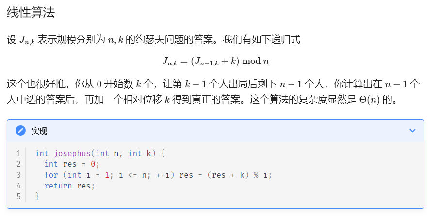

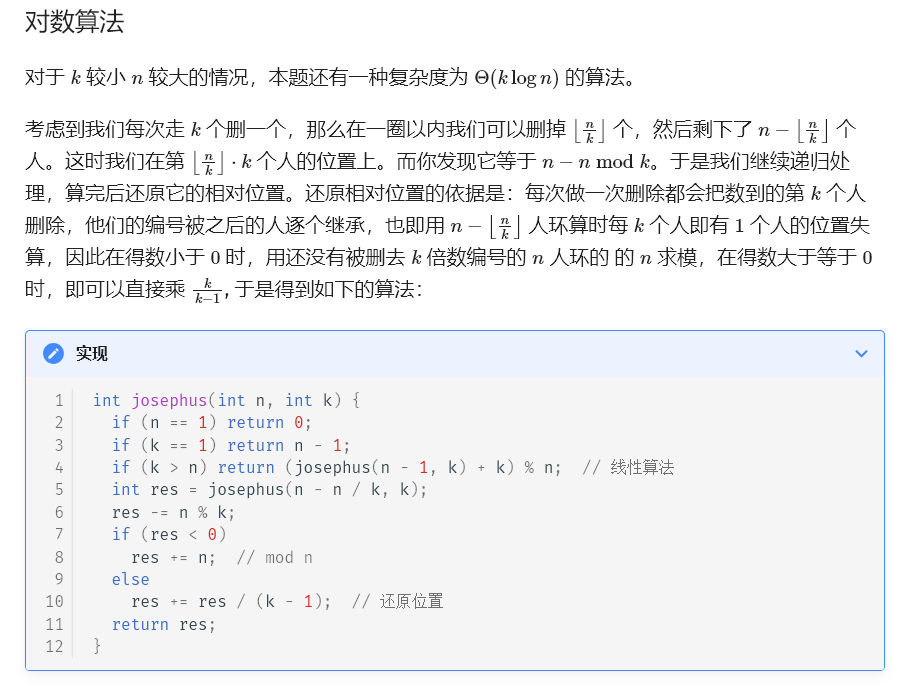

 ## 前n项平方的和

$1^2+2^2+3^2+...+n^2 =n*(n+1)*(2*n+1)/6$ 

## 一种O(值域)时间预处理O(1)时间求最大公约数的算法

```cpp
namespace quickgcd{
    vector<int>prime,not_prime;
    vector<array<int,3>>fact;
    vector<vector<int>>f;

    void init(const int M){//传入值域最大值
        fact.resize(M+1);
        fact.assign(M+1,{0,0,0});
        not_prime.resize(M+1);

        fact[1][0]=fact[1][1]=fact[1][2]=1;
        for(int i=2;i<=M;i++){
            if(!not_prime[i]){
                prime.push_back(i);
                fact[i][0]=fact[i][1]=1;
                fact[i][2]=i;
            }
            for(int j:prime){
                if(i*j>M)
                    break;

                fact[i*j][0]=fact[i][0]*j;
                fact[i*j][1]=fact[i][1];
                fact[i*j][2]=fact[i][2];
                sort(fact[i*j].begin(),fact[i*j].end());

                not_prime[i*j]=true;
                if(i%j==0)
                    break;
            }
        }

        int S=sqrt(M)+1;//在1e8值域内sqrt很安全的向下取整
        f.resize(S+1,vector<int>(S+1));
        for(int i=1;i<=S;i++){
            f[0][i]=f[i][0]=i;
            for(int j=1;j<=S;j++){
                f[i][j]=f[j%i][i];
            }
        }
    }

    int gcd(int x,int y){
        int res=1,tmp=f[fact[x][0]][y%fact[x][0]];
        res*=tmp;
        y/=tmp;

        tmp=f[fact[x][1]][y%fact[x][1]];
        res*=tmp;
        y/=tmp;

        tmp=(not_prime[fact[x][2]] ?\
            f[fact[x][2]][y%fact[x][2]] :\
            (y%fact[x][2] ? 1 : fact[x][2]));
        res*=tmp;
        y/=tmp;

        return res;
    }
};
```
例题
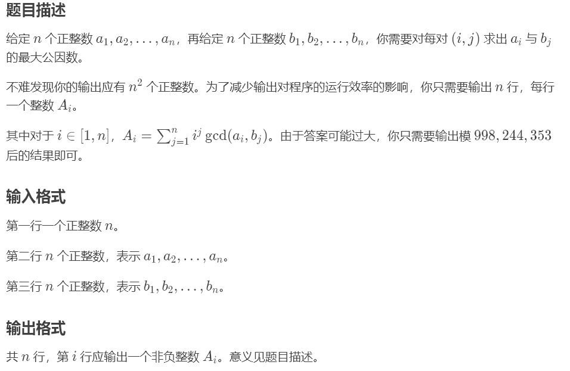
```cpp
#include"bits/stdc++.h"
#define ll long long
#define endl '\n'
using namespace std;
constexpr int N=1e5+10,inf=0X3F3F3F3F,mod=998244353;
constexpr ll INF=0X3F3F3F3F3F3F3F3F;

namespace quickgcd{
    vector<int>prime,not_prime;
    vector<array<int,3>>fact;
    vector<vector<int>>f;

    void init(const int M){//传入值域最大值
        fact.resize(M+1);
        fact.assign(M+1,{0,0,0});
        not_prime.resize(M+1);

        fact[1][0]=fact[1][1]=fact[1][2]=1;
        for(int i=2;i<=M;i++){
            if(!not_prime[i]){
                prime.push_back(i);
                fact[i][0]=fact[i][1]=1;
                fact[i][2]=i;
            }
            for(int j:prime){
                if(i*j>M)
                    break;

                fact[i*j][0]=fact[i][0]*j;
                fact[i*j][1]=fact[i][1];
                fact[i*j][2]=fact[i][2];
                sort(fact[i*j].begin(),fact[i*j].end());

                not_prime[i*j]=true;
                if(i%j==0)
                    break;
            }
        }

        int S=sqrt(M)+1;//在1e8值域内sqrt很安全的向下取整
        f.resize(S+1,vector<int>(S+1));
        for(int i=1;i<=S;i++){
            f[0][i]=f[i][0]=i;
            for(int j=1;j<=S;j++){
                f[i][j]=f[j%i][i];
            }
        }
    }

    int gcd(int x,int y){
        if(x>y)
            swap(x,y);
        if(x==0)
            return y;
        
        int res=1,tmp=f[fact[x][0]][y%fact[x][0]];
        res*=tmp;
        y/=tmp;

        tmp=f[fact[x][1]][y%fact[x][1]];
        res*=tmp;
        y/=tmp;

        tmp=(not_prime[fact[x][2]] ?\
            f[fact[x][2]][y%fact[x][2]] :\
            (y%fact[x][2] ? 1 : fact[x][2]));
        res*=tmp;
        y/=tmp;

        return res;
    }
};

void solve(){
    quickgcd::init(1000000);
    int n;
    cin>>n;
    vector<int>a(n+1),b(n+1);
    for(int i=1;i<=n;i++)
        cin>>a[i];
    for(int j=1;j<=n;j++)
        cin>>b[j];
    
    for(int i=1;i<=n;i++){
        int cur=1,res=0;
        for(int j=1;j<=n;j++){
            cur=1ll*cur*i%mod;
            res=(res+1ll*cur*quickgcd::gcd(a[i],b[j]))%mod;
        }
        cout<<res<<endl;
    }
}

signed main(){
    cin.tie(nullptr)->sync_with_stdio(0);
//	int t;cin>>t;while(t--)
    solve();
    return 0;
}
```

## 求lcm小于等于n的[1,n]所有点对

$\sum_{i=1}^{n}\sum_{j=1}^{n}[lcm(i,j)\le n]=O(nlog^2n)$
求$lcm(i,j)\le n$的$(i,j)$点对且$(1\le i,j\le n)$的复杂度如上
```cpp
vector<int>fact[N];
vector<array<int,2>>pairfact[N];
for(int i=1;i<N;i++){
    for(int k=i;k<N;k+=i){
        fact[k].push_back(i);
    }
}
for(int k=1;k<N;k++){
    for(auto i:fact[k]){
        for(auto j:fact[k]){
            if(i<=j&&lcm(i,j)==k){
                pairfact[k].push_back({i,j});
            }
        }
    }
}
```
证明
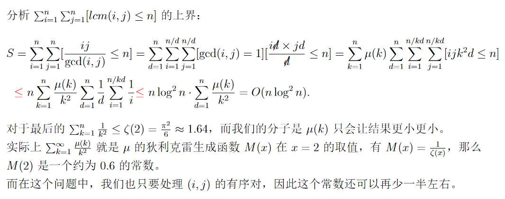

## 统计一个数二进制下1的个数（超快

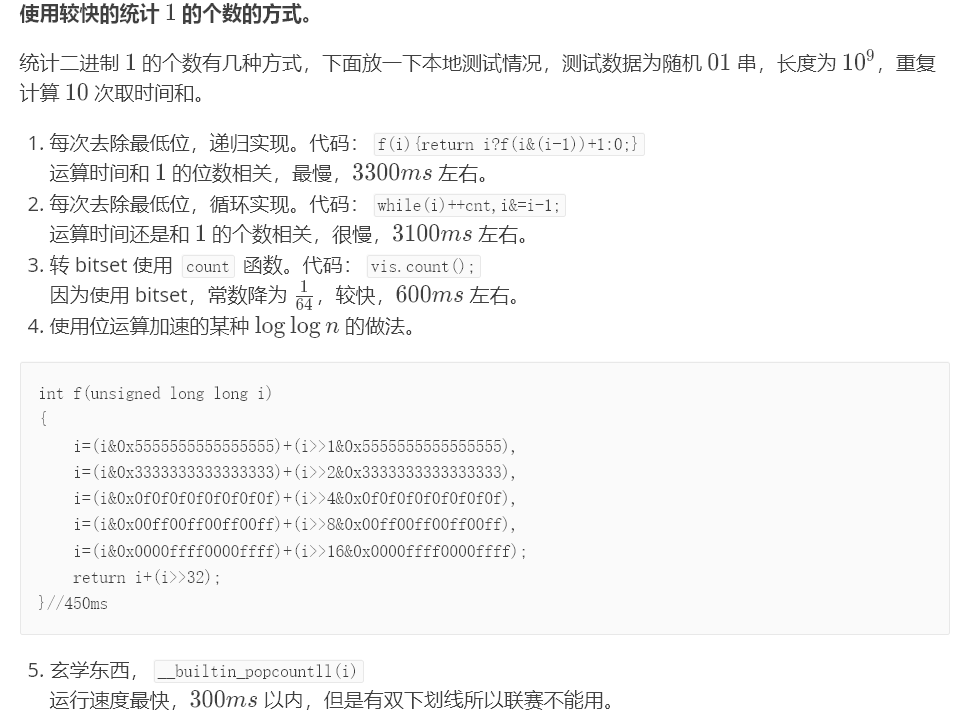
```cpp
int f(unsigned long long i)
{
	i=(i&0x5555555555555555)+(i>>1&0x5555555555555555),
	i=(i&0x3333333333333333)+(i>>2&0x3333333333333333),
	i=(i&0x0f0f0f0f0f0f0f0f)+(i>>4&0x0f0f0f0f0f0f0f0f),
	i=(i&0x00ff00ff00ff00ff)+(i>>8&0x00ff00ff00ff00ff),
	i=(i&0x0000ffff0000ffff)+(i>>16&0x0000ffff0000ffff);
	return i+(i>>32);
}//450ms
```

## 输入输出优化

普通优化
```cpp
int read() {
  int x = 0, w = 1;
  char ch = 0;
  while (ch < '0' || ch > '9') {  // ch 不是数字时
    if (ch == '-') w = -1;        // 判断是否为负
    ch = getchar();               // 继续读入
  }
  while (ch >= '0' && ch <= '9') {  // ch 是数字时
    x = x * 10 + (ch - '0');  // 将新读入的数字「加」在 x 的后面
    // x 是 int 类型，char 类型的 ch 和 '0' 会被自动转为其对应的
    // ASCII 码，相当于将 ch 转化为对应数字
    // 此处也可以使用 (x<<3)+(x<<1) 的写法来代替 x*10
    ch = getchar();  // 继续读入
  }
  return x * w;  // 数字 * 正负号 = 实际数值
}
void write(int x) {
  if (x < 0) {  // 判负 + 输出负号 + 变原数为正数
    x = -x;
    putchar('-');
  }
  if (x > 9) write(x / 10);  // 递归，将除最后一位外的其他部分放到递归中输出
  putchar(x % 10 + '0');  // 已经输出（递归）完 x 末位前的所有数字，输出末位
}

```

```cpp
// #define DEBUG 1  // 调试开关
struct IO {
#define MAXSIZE (1 << 20)
#define isdigit(x) (x >= '0' && x <= '9')
  char buf[MAXSIZE], *p1, *p2;
  char pbuf[MAXSIZE], *pp;
#if DEBUG
#else
  IO() : p1(buf), p2(buf), pp(pbuf) {}

  ~IO() { fwrite(pbuf, 1, pp - pbuf, stdout); }
#endif
  char gc() {
#if DEBUG  // 调试，可显示字符
    return getchar();
#endif
    if (p1 == p2) p2 = (p1 = buf) + fread(buf, 1, MAXSIZE, stdin);
    return p1 == p2 ? ' ' : *p1++;
  }

  bool blank(char ch) {
    return ch == ' ' || ch == '\n' || ch == '\r' || ch == '\t';
  }

  template <class T>
  void read(T &x) {
    double tmp = 1;
    bool sign = 0;
    x = 0;
    char ch = gc();
    for (; !isdigit(ch); ch = gc())
      if (ch == '-') sign = 1;
    for (; isdigit(ch); ch = gc()) x = x * 10 + (ch - '0');
    if (ch == '.')
      for (ch = gc(); isdigit(ch); ch = gc())
        tmp /= 10.0, x += tmp * (ch - '0');
    if (sign) x = -x;
  }

  void read(char *s) {
    char ch = gc();
    for (; blank(ch); ch = gc());
    for (; !blank(ch); ch = gc()) *s++ = ch;
    *s = 0;
  }

  void read(char &c) { for (c = gc(); blank(c); c = gc()); }

  void push(const char &c) {
#if DEBUG  // 调试，可显示字符
    putchar(c);
#else
    if (pp - pbuf == MAXSIZE) fwrite(pbuf, 1, MAXSIZE, stdout), pp = pbuf;
    *pp++ = c;
#endif
  }

  template <class T>
  void write(T x) {
    if (x < 0) x = -x, push('-');  // 负数输出
    static T sta[35];
    T top = 0;
    do {
      sta[top++] = x % 10, x /= 10;
    } while (x);
    while (top) push(sta[--top] + '0');
  }

  template <class T>
  void write(T x, char lastChar) {
    write(x), push(lastChar);
  }
} io;
```

## cdq分治

 给定一个序列，每个点有 $a_i,b_i,c_i$ 三个属性，试求：这个序列里有多少对点对 $(i,j)$ 满足$a_j\leq a_i$   且   $b_j\leq b_i$且$c_j\leq c_i$   且$i\neq j$。  
```cpp
#include"bits/stdc++.h"
#define ll long long
#define endl '\n'
using namespace std;
constexpr int N=1e5+10,inf=0X3F3F3F3F,K=2e5+10;
constexpr ll INF=0X3F3F3F3F3F3F3F3F;

struct fenwick{
    vector<int>tr;
    fenwick(int _n):tr(_n,0){};
    int lowbit(int x){
        return ((x)&(-x));
    }
    void update(int x,int c){
        while(x<K){
            tr[x]+=c;
            x+=lowbit(x);
        }
    }
    int sum(int x){
        int res=0;
        while(x>0){
            res+=tr[x];
            x-=lowbit(x);
        }
        return res;
    }
}fw(K);

struct el{
    int a,b,c;
    int cnt,res;
    bool operator!=(el t){
        return !(t.a==a&&t.b==b&&t.c==c);
    }
}e[N],fe[N];

void CDQ(int l,int r){
    if(l==r)
        return;

    int mid=l+r>>1;
    CDQ(l,mid);
    CDQ(mid+1,r);

    sort(fe+l,fe+mid+1,[&](el i,el j){
        if(i.b!=j.b)
            return i.b<j.b;
        return i.c<j.c;
    });
    sort(fe+mid+1,fe+r+1,[&](el i,el j){
        if(i.b!=j.b)
            return i.b<j.b;
        return i.c<j.c;
    });

    int i=l,j=mid+1;
    while(j<=r){
        while(i<=mid&&fe[i].b<=fe[j].b){
            fw.update(fe[i].c,fe[i].cnt);
            i++;
        }
        fe[j].res+=fw.sum(fe[j].c);
        j++;
    }
    for(int k=l;k<i;k++)
        fw.update(fe[k].c,-fe[k].cnt);
}

void solve(){
    int n,k;
    cin>>n>>k;
    for(int i=1;i<=n;i++)
        cin>>e[i].a>>e[i].b>>e[i].c;
    
    sort(e+1,e+n+1,[&](el i,el j){
        if(i.a!=j.a)
            return i.a<j.a;
        if(i.b!=j.b)
            return i.b<j.b;
        return i.c<j.c;
    });

    int m=0,t=0;
    for(int i=1;i<=n;i++){
        t++;
        if(e[i]!=e[i+1]){
            m++;
            fe[m].a=e[i].a;
            fe[m].b=e[i].b;
            fe[m].c=e[i].c;
            fe[m].cnt=t;
            t=0;
        }
    }

    CDQ(1,m);

    vector<int>res(n);
    for(int i=1;i<=m;i++)
        res[fe[i].res+fe[i].cnt-1]+=fe[i].cnt;

    for(int i=0;i<n;i++)
        cout<<res[i]<<endl;
}
signed main(){
    cin.tie(nullptr)->sync_with_stdio(0);
//	int t;cin>>t;while(t--)
    solve();
    return 0;
}
```

例题2：给定一个长度为 $n$ 的序列 $a$。

同时这个序列还可能发生变化，每一种变化 $(x_i​,y_i​)$ 对应着 $a_{x_i}$​​ 可能变成 $y_i$​。

不会同时发生两种变化。

需要找出一个最长的子序列，使得这个子序列在任意一种变化下都是不降的。

只需要求出这个子序列的长度即可。

**注意：可以不发生任何变化。**

题解：by小粉兔

记 $f[i]$ 为以第 i 项结尾的子序列最长长度。

则有转移：$f[i]=max_{j<i}​(f[j])+1$，同时还要满足 $maxval_j​\leq a_i$​ 和 $a_j\leq minval_i$​。  
其中 $maxval_i$​ 表示第 i 项最大能变成的值，$minval_i$​ 表示第 i 项最小能变成的值。

按照项从小到大转移，形成了**天然的时间顺序**，同时还要满足两个偏序限制。

算上时间顺序，这是一个三维偏序问题，用 CDQ 分治 + 数据结构（我用了树状数组）就能解决。
```cpp
#include"bits/stdc++.h"
#define endl '\n'
using ll=long long;
using namespace std;
constexpr int N=1e5+10,inf=0X3F3F3F3F,U=1'000'00;
constexpr ll INF=0X3F3F3F3F3F3F3F3F;

int fw[N];
void ins(int x,int y){
    for(;x<=U;x+=x&-x)
        fw[x]=max(fw[x],y);
}
int qry(int x){
    int res=0;
    for(;x;x-=x&-x)
        res=max(res,fw[x]);
    return res;
}
void clr(int x){
    for(;x<=U;x+=x&-x)
        fw[x]=0;
}

int dp[N],a[N],mx[N],mn[N],pos[N];
bool cmp1(int i,int j){
    return mx[i]<mx[j];
}
bool cmp2(int i,int j){
    return a[i]<a[j];
}

void cdq(int l,int r){
    if(l==r){
        dp[l]=max(dp[l],1);
        return;
    }
    int mid=l+r>>1;
    cdq(l,mid);
    iota(pos+l,pos+r+1,l);
    sort(pos+l,pos+mid+1,cmp1);
    sort(pos+mid+1,pos+r+1,cmp2);
    for(int i=mid+1,j=l;i<=r;i++){
        while(j<=mid&&mx[pos[j]]<=a[pos[i]]){
            ins(a[pos[j]],dp[pos[j]]);
            j++;
        }
        dp[pos[i]]=max(dp[pos[i]],qry(mn[pos[i]])+1);
    }
    for(int i=l;i<=mid;i++)
        clr(a[i]);
    cdq(mid+1,r);
}

void solve(){
    int n,m;
    cin>>n>>m;
    for(int i=1;i<=n;i++){
        cin>>a[i];
        mx[i]=mn[i]=a[i];
    }
    for(int i=1;i<=m;i++){
        int x,y;
        cin>>x>>y;
        mx[x]=max(mx[x],y);
        mn[x]=min(mn[x],y);
    }
    cdq(1,n);
    int ans=0;
    for(int i=1;i<=n;i++)
        ans=max(ans,dp[i]);
    cout<<ans<<endl;
}
signed main(){
    cin.tie(nullptr)->sync_with_stdio(false);
//	int t;cin>>t;while(t--)
    solve();
    return 0;
}
```

例题3：
对于序列 $a$，它的逆序对数定义为集合  
$$\{(i,j)| i<j \wedge a_i > a_j \}$$
中的元素个数。  

现在给出 $1\sim n$ 的一个排列，按照某种顺序依次删除 $m$ 个元素，你的任务是在每次删除一个元素**之前**统计整个序列的逆序对数。

输入格式
第一行包含两个整数 $n$ 和 $m$，即初始元素的个数和删除的元素个数。  
以下 $n$ 行，每行包含一个 $1 \sim n$ 之间的正整数，即初始排列。  
接下来 $m$ 行，每行一个正整数，依次为每次删除的元素。

输出格式
输出包含 $m$ 行，依次为删除每个元素之前，逆序对的个数。

题解：
记time为时间顺序（删除看作倒着加入，记倒着加入时间），未删除记作0。val为值，pos为位置
即求三维偏序：$time_i<time_j,val_i>val_j,pos_i<pos_j$ 的贡献和 $time_i<time_j,val_i<val_j,pos_i>pos_j$的贡献，以时间为键值统计答案即可

```cpp
#include"bits/stdc++.h"
#define endl '\n'
using ll=long long;
using namespace std;
constexpr int N=2e5+10,inf=0X3F3F3F3F;
constexpr ll INF=0X3F3F3F3F3F3F3F3F;

int fw[N];
void add(int x,int y){
    for(;x<N;x+=x&-x)
        fw[x]+=y;
}
int sum(int x){
    int res=0;
    for(;x;x-=x&-x)
        res+=fw[x];
    return res;
}

struct cry{
    int time,val,pos;
    ll ans;
}f[N];
bool cmp1(cry a,cry b){
    return a.time<b.time;
}
bool cmp2(cry a,cry b){
    return a.pos<b.pos;
}

void cdq(int l,int r){
    if(l==r){
        return;
    }
    int mid=l+r>>1;
    cdq(l,mid),cdq(mid+1,r);
    sort(f+l,f+mid+1,cmp2);
    sort(f+mid+1,f+r+1,cmp2);

    int j=l;
    for(int i=mid+1;i<=r;i++){
        while(j<=mid&&f[j].pos<f[i].pos){
            add(f[j].val,1);
            j++;
        }
        f[i].ans+=sum(N-1)-sum(f[i].val);
    }
    for(int i=l;i<j;i++)
        add(f[i].val,-1);
    
    j=mid;
    for(int i=r;i>mid;i--){
        while(j>=l&&f[j].pos>f[i].pos){
            add(f[j].val,1);
            j--;
        }
        f[i].ans+=sum(f[i].val-1);
    }
    for(int i=mid;i>j;i--)
        add(f[i].val,-1);
}
ll ans[N];
void solve(){
    int n,m;
    cin>>n>>m;
    vector<int>a(n+1),pos(n+1);
    for(int i=1;i<=n;i++){
        cin>>a[i];
        f[i].pos=i;
        f[i].val=a[i];
        pos[a[i]]=i;
    }
    for(int i=1;i<=m;i++){
        int b;
        cin>>b;
        f[pos[b]].time=m-i+1;
    }
    sort(f+1,f+n+1,cmp1);
    cdq(1,n);
    for(int i=0;i<=n;i++)
        ans[f[i].time]+=f[i].ans;
    for(int i=1;i<=m;i++)
        ans[i]+=ans[i-1];
    for(int i=m;i>=1;i--)
        cout<<ans[i]<<endl;
}
signed main(){
    cin.tie(nullptr)->sync_with_stdio(false);
//	int t;cin>>t;while(t--)
    solve();
    return 0;
}
```

## 最大子段和


```cpp
for(int i=1;i<=n;i++){
    if(tmp<0)
        tmp=a[i];
    else
        tmp+=a[i];
    ans=max(ans,tmp);
}
```

## 编译优化

```cpp
#pragma GCC optimize("O3")
#pragma G++ optimize("O3")
#pragma GCC optimize("Ofast")
```

## 反悔贪心

[https://codeforces.com/problemset/problem/1974/G](https://codeforces.com/problemset/problem/1974/G)
接下来的 $m$个月里，查理将从没有钱开始，每个月努力工作赚 $x$英镑。对于第 $i$个月（ $1 \le i \le m$），将有一次机会支付 $c_i$英镑以获得一单位的幸福。每个月你不能购买超过一个单位的幸福。第 $i$个月赚的钱只能在之后的 $j$个月（ $j>i$）中消费。请帮助查理找到可达到的最大幸福单位数。

我们维护当前有的钱 sum 和一个大根堆，记录用了哪些 ci。
每次先试图获得当前月的幸福，sum←sum−ci，并把 ci 放入堆中。如果当前 sum<0，则需要进行反悔操作。我们希望剩下的钱尽可能多，而且每个月获得的幸福值都是一样的，所以我们只要从大根堆中取出最大的 cj，并 sum←sum+cj。容易发现只需要取出一个值就能保证 sum≥0。
在每个月的末尾，我们使 sum←sum+x。
最终堆的大小即为答案，总时间复杂度 O(mlog⁡m)，可以通过本题。
```cpp
#include"bits/stdc++.h"
#define ll long long
#define endl '\n'
using namespace std;
constexpr int N=1e5+10,inf=0X3F3F3F3F;
constexpr ll INF=0X3F3F3F3F3F3F3F3F;
void solve(){
    int m,x;
    cin>>m>>x;
    vector<int>c(m+1);
    for(int i=1;i<=m;i++)
        cin>>c[i];
    priority_queue<int>q;
    ll cur=0;
    for(int i=1;i<=m;i++){
        cur-=c[i];
        q.push(c[i]);
        if(cur<0){
            cur+=q.top();
            q.pop();
        }
        cur+=x;
    }
    cout<<q.size()<<endl;
}
signed main(){
    cin.tie(nullptr)->sync_with_stdio(0);
    int t;cin>>t;while(t--)
    solve();
    return 0;
}
```

## Zobrist哈希

Zobrist哈希（[Zobrist hashing](https://en.wikipedia.org/wiki/Zobrist_hashing)）是一种专门针对棋类游戏而提出来的编码方式，以其发明者 Albert L.Zobrist 的名字命名。
Zobrist 哈希通过一种特殊的置换表,也就是对棋盘上每一位置的各个可能状态赋予一个编码索引值，来实现在极低冲突率的前提下在一个整型数据上对棋盘进行编码。
其编码步骤描述如下:

1. 将棋盘分为最小单位(如果将9X9围棋盘分为81个交叉点)，求出每个单位上不同状态数(如围棋盘上的1个交叉点有3个状态)。
2. 为每个单位上的每种状态生成一个一定范围内(如64位整数)随机数。
3. 对于特定的棋局，将每个单位上的状态对应的随机数作异或运算，所得即为哈希值。

用Zobrist哈希为棋局状态编码至少具备两个优点:

1. 当随机数的范围足够大时，不同的棋局产生哈希冲突的概率非常小，在实际应用中通常可以忽略。
2. 在棋局进行过程中，不必每次重新开始计算棋局的哈希值，只需计算棋局状态发生改变的部分。

### 例题

[https://codeforces.com/contest/1977/problem/D](https://codeforces.com/contest/1977/problem/D)
你被给予一个由0和1组成的 $n \times m$矩阵。此外，你还有一个异或化器，可以用来翻转选定行中所有值（即将0替换为1，将1替换为0）。
如果矩阵中某一列恰好含有一个1，那么我们称该列为特殊列。你的任务是找出能够同时使最多多少列变得特殊的最大数量，并确定应该使用异或化器作用于哪些行以达到这个目标。
```cpp
#include"bits/stdc++.h"
#define ll long long
#define endl '\n'
using namespace std;
constexpr int N=1e5+10,inf=0X3F3F3F3F;
constexpr ll INF=0X3F3F3F3F3F3F3F3F;
mt19937_64 rnd(chrono::steady_clock::now().time_since_epoch().count());
void solve(){
    map<array<ll,2>,int>ans;
    int n,m;
    cin>>n>>m;
    vector mp(n+1,vector<int>(m+1));
    vector<ll>r1(n+1),r2(n+1);
    for(int i=1;i<=n;i++){
        r1[i]=rnd();
        r2[i]=rnd();
    }
    for(int i=1;i<=n;i++){
        for(int j=1;j<=m;j++){
            char c;
            cin>>c;
            mp[i][j]=c-'0';
        }
    }
    array<int,2> ind={0,0};
    int res=0;
    for(int j=1;j<=m;j++){
        ll sum1=0,sum2=0;
        for(int i=1;i<=n;i++){
            if(mp[i][j]){
                sum1^=r1[i];
                sum2^=r2[i];
            }
        }
        for(int i=1;i<=n;i++){
            sum1^=r1[i];
            sum2^=r2[i];
            ans[{sum1,sum2}]++;
            if(res<ans[{sum1,sum2}]){
                res=ans[{sum1,sum2}];
                ind={i,j};
            }
            sum1^=r1[i];
            sum2^=r2[i];
        }
    }
    cout<<res<<endl;
    for(int i=1;i<=n;i++){
        auto [x,y]=ind;
        if(i==x)
            cout<<(mp[i][y]^1);
        else
            cout<<(mp[i][y]);
    }
    cout<<endl;
}
signed main(){
    cin.tie(nullptr)->sync_with_stdio(0);
	int t;cin>>t;while(t--)
    solve();
    return 0;
}
```

### 利用异或哈希给线段打上标记

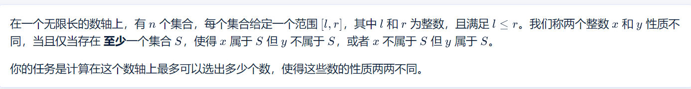

每个区间异或随机大数。不同的值就可以相互选。答案为值的种类数

```cpp
#include"bits/stdc++.h"
#define endl '\n'
using ll=long long;
using ull=unsigned long long;
using namespace std;
constexpr int N=1e5+10;
constexpr int inf=0X3F3F3F3F;
constexpr ll INF=0X3F3F3F3F3F3F3F3F;

mt19937_64 rnd(chrono::steady_clock::now().time_since_epoch().count());
void solve(){
    int n;
    cin>>n;
    map<int,ull>mp;
    for(int i=1;i<=n;i++){
        int l,r;
        cin>>l>>r;
        ull a=rnd();
        mp[l]^=a;
        mp[r+1]^=a;
    }

    ull pre=0;
    set<ull>s;
    s.insert(0);
    for(auto &[x,y]:mp){
        y^=pre;
        pre=y;
        s.insert(y);
    }
    cout<<s.size()<<endl;
}
signed main(){
    cin.tie(nullptr)->sync_with_stdio(false);
    int _=1;cin>>_;while(_--)
    solve();
    return 0;
}
```

## 离散化

把需要进行离散化的数放到一个数组里，排序完后lowbound的下标即为离散化所求。
需要注意的是，对区间端点进行离散化，容易出现[1,3][1,1],[3,3]失去中间点2的信息的情况。故离散化的数组加上l+1和l-1。
如
```cpp
// #define TY09
#include"bits/stdc++.h"
#define ll long long
#define endl '\n'
using namespace std;
const int inf = 0x3f3f3f3f;
void IMSB(){
	int n,k;
	cin>>n>>k;
	vector<int>a(n+1),b(n+1),w(n+1),p;
	p.push_back(0);
	for(int i=1;i<=n;++i){
		cin>>a[i]>>b[i]>>w[i];
		p.push_back(a[i]);
		p.push_back(a[i]+1);
		p.push_back(a[i]-1);
		p.push_back(b[i]);
	}
	sort(p.begin(),p.end());
	p.erase(unique(p.begin(),p.end()),p.end());
	int mx=0;
	for(int i=1;i<=n;i++){
		a[i]=lower_bound(p.begin()+1,p.end(),a[i])-p.begin();
		b[i]=lower_bound(p.begin()+1,p.end(),b[i])-p.begin();
		mx=max({mx,a[i],b[i]});
	}
	vector<int>rb(mx+2),cb(mx+2);
	for(int i=1;i<=n;i++){
		rb[a[i]]^=w[i];
		rb[b[i]+1]^=w[i];
		cb[a[i]]+=1;
		cb[b[i]+1]-=1;
	}
	int ans=-1;
	for(int i=1;i<=mx;i++){
		rb[i]^=rb[i-1];
		cb[i]+=cb[i-1];
		if(cb[i]>=k)
			ans=max(ans,rb[i]);
	}
	cout<<ans<<endl;
}
signed main(){
	cin.tie(nullptr)->sync_with_stdio(0);
//	int t;cin>>t;while(t--)
	IMSB();
	return 0;
}
```

## 最长上升子序列

### 非dp做法（只能求长度）

复杂度nlogn
```cpp
int n,a[N];
int lis(){
    vector<int>d;
    d.emplace_back(a[1]);
    for(int i=2;i<=n;i++){
        if(a[i]>d.back()){//此为严格上升，非严格改为>=
            d.emplace_back(a[i]);
        }else{
            *lower_bound(d.begin(),d.end(),a[i])=a[i];//此为严格上升，非严格改为upper_bound
        }
    }
    return d.size();
}
```

## 自动取模类

```cpp
template <typename T>
T inv(const T& x, const T& y) {
    assert(x != 0);
    T u = 0, v = 1, a = x, m = y, t;
    while (a != 0) {
        t = m / a;
        swap(a, m -= t * a);
        swap(u -= t * v, v);
    }
    assert(m == 1);
    return u;
}

template <typename T>
class Modular {
public:
    using Type = typename decay<decltype(T::value)>::type;

    constexpr Modular() : value() {}
    template <typename U> Modular(const U& x) { value = normalize(x); }

    template <typename U>
    static Type normalize(const U& x) {
        Type v = static_cast<Type>((-mod() <= x && x < mod()) ? x : x % mod());
        if (v < 0) v += mod();
        return v;
    }

    const Type& operator()() const { return value; }
    template <typename U> explicit operator U() const { return static_cast<U>(value); }
    constexpr static Type mod() { return T::value; }

    Modular& operator+=(const Modular& other) {
        if ((value += other.value) >= mod()) value -= mod();
        return *this;
    }
    Modular& operator-=(const Modular& other) {
        if ((value -= other.value) < 0) value += mod();
        return *this;
    }
    template <typename U> Modular& operator+=(const U& other) { return *this += Modular(other); }
    template <typename U> Modular& operator-=(const U& other) { return *this -= Modular(other); }
    Modular& operator++() { return *this += 1; }
    Modular& operator--() { return *this -= 1; }
    Modular operator++(int) {
        Modular result(*this);
        *this += 1;
        return result;
    }
    Modular operator--(int) {
        Modular result(*this);
        *this -= 1;
        return result;
    }
    Modular operator-() const { return Modular(-value); }

    template <typename U = T>
    typename enable_if<is_same<typename Modular<U>::Type, int>::value, Modular>::type& operator*=(const Modular& rhs) {
#ifdef _WIN32
        uint64_t x = static_cast<int64_t>(value) * static_cast<int64_t>(rhs.value);
        uint32_t xh = static_cast<uint32_t>(x >> 32), xl = static_cast<uint32_t>(x), d, m;
        asm(
            "divl %4; \n\t"
            : "=a"(d), "=d"(m)
            : "d"(xh), "a"(xl), "r"(mod()));
        value = m;
#else
        value = normalize(static_cast<int64_t>(value) * static_cast<int64_t>(rhs.value));
#endif
        return *this;
    }
    template <typename U = T>
    typename enable_if<is_same<typename Modular<U>::Type, long long>::value, Modular>::type& operator*=(const Modular& rhs) {
        long long q = static_cast<long long>(static_cast<long double>(value) * rhs.value / mod());
        value = normalize(value * rhs.value - q * mod());
        return *this;
    }
    template <typename U = T>
    typename enable_if<!is_integral<typename Modular<U>::Type>::value, Modular>::type& operator*=(const Modular& rhs) {
        value = normalize(value * rhs.value);
        return *this;
    }

    Modular& operator/=(const Modular& other) { return *this *= Modular(inv(other.value, mod())); }

    friend const Type& abs(const Modular& x) { return x.value; }
    template <typename U> friend bool operator==(const Modular<U>& lhs, const Modular<U>& rhs);
    template <typename U> friend bool operator<(const Modular<U>& lhs, const Modular<U>& rhs);
    template <typename V, typename U> friend V& operator>>(V& stream, Modular<U>& number);

private:
    Type value;
};

template <typename T> bool operator==(const Modular<T>& lhs, const Modular<T>& rhs) { return lhs.value == rhs.value; }
template <typename T, typename U> bool operator==(const Modular<T>& lhs, U rhs) { return lhs == Modular<T>(rhs); }
template <typename T, typename U> bool operator==(U lhs, const Modular<T>& rhs) { return Modular<T>(lhs) == rhs; }

template <typename T> bool operator!=(const Modular<T>& lhs, const Modular<T>& rhs) { return !(lhs == rhs); }
template <typename T, typename U> bool operator!=(const Modular<T>& lhs, U rhs) { return !(lhs == rhs); }
template <typename T, typename U> bool operator!=(U lhs, const Modular<T>& rhs) { return !(lhs == rhs); }

template <typename T> bool operator<(const Modular<T>& lhs, const Modular<T>& rhs) { return lhs.value < rhs.value; }

template <typename T> Modular<T> operator+(const Modular<T>& lhs, const Modular<T>& rhs) { return Modular<T>(lhs) += rhs; }
template <typename T, typename U> Modular<T> operator+(const Modular<T>& lhs, U rhs) { return Modular<T>(lhs) += rhs; }
template <typename T, typename U> Modular<T> operator+(U lhs, const Modular<T>& rhs) { return Modular<T>(lhs) += rhs; }

template <typename T> Modular<T> operator-(const Modular<T>& lhs, const Modular<T>& rhs) { return Modular<T>(lhs) -= rhs; }
template <typename T, typename U> Modular<T> operator-(const Modular<T>& lhs, U rhs) { return Modular<T>(lhs) -= rhs; }
template <typename T, typename U> Modular<T> operator-(U lhs, const Modular<T>& rhs) { return Modular<T>(lhs) -= rhs; }

template <typename T> Modular<T> operator*(const Modular<T>& lhs, const Modular<T>& rhs) { return Modular<T>(lhs) *= rhs; }
template <typename T, typename U> Modular<T> operator*(const Modular<T>& lhs, U rhs) { return Modular<T>(lhs) *= rhs; }
template <typename T, typename U> Modular<T> operator*(U lhs, const Modular<T>& rhs) { return Modular<T>(lhs) *= rhs; }

template <typename T> Modular<T> operator/(const Modular<T>& lhs, const Modular<T>& rhs) { return Modular<T>(lhs) /= rhs; }
template <typename T, typename U> Modular<T> operator/(const Modular<T>& lhs, U rhs) { return Modular<T>(lhs) /= rhs; }
template <typename T, typename U> Modular<T> operator/(U lhs, const Modular<T>& rhs) { return Modular<T>(lhs) /= rhs; }

template <typename T, typename U>
Modular<T> qpow(const Modular<T>& a, const U& b) {
    assert(b >= 0);
    Modular<T> x = a, res = 1;
    for (U p = b; p; x *= x, p >>= 1)
        if (p & 1) res *= x;
    return res;
}

template <typename T> bool IsZero(const Modular<T>& number) { return number() == 0; }
template <typename T> string to_string(const Modular<T>& number) { return to_string(number()); }

// U == std::ostream? but done this way because of fastoutput
template <typename U, typename T> U& operator<<(U& stream, const Modular<T>& number) { return stream << number(); }

// U == std::istream? but done this way because of fastinput
template <typename U, typename T>
U& operator>>(U& stream, Modular<T>& number) {
    typename common_type<typename Modular<T>::Type, long long>::type x;
    stream >> x;
    number.value = Modular<T>::normalize(x);
    return stream;
}

// using ModType = int;
// struct VarMod { static ModType value; };
// ModType VarMod::value;
// ModType& md = VarMod::value;// for mod can change
// using Mint = Modular<VarMod>;

constexpr int md = (int)1e9 + 7; 
using Mint = Modular<std::integral_constant<decay<decltype(md)>::type, md>>;

struct Fact {
    vector<Mint> fact, factinv;
    const int n;
    Fact(const int& _n) : n(_n), fact(_n + 1, Mint(1)), factinv(_n + 1) {
        for (int i = 1; i <= n; ++i) fact[i] = fact[i - 1] * i;
        factinv[n] = inv(fact[n](), md);
        for (int i = n; i; --i) factinv[i - 1] = factinv[i] * i;
    }
    Mint C(const int& n, const int& k) {
        if (n < 0 || k < 0 || n < k) return 0;
        return fact[n] * factinv[k] * factinv[n - k];
    }
    Mint A(const int& n, const int& k) {
        if (n < 0 || k < 0 || n < k) return 0;
        return fact[n] * factinv[n - k];
    }
};
```


```cpp
template<const int T>
struct ModInt {
    const static int mod = T;
    int x;
    ModInt(int x = 0) : x(x % mod) {}
    ModInt(long long x) : x(int(x % mod)) {} 
    int val() { return x; }
    ModInt operator + (const ModInt &a) const { int x0 = x + a.x; return ModInt(x0 < mod ? x0 : x0 - mod); }
    ModInt operator - (const ModInt &a) const { int x0 = x - a.x; return ModInt(x0 < 0 ? x0 + mod : x0); }
    ModInt operator * (const ModInt &a) const { return ModInt(1LL * x * a.x % mod); }
    ModInt operator / (const ModInt &a) const { return *this * a.inv(); }
    bool operator == (const ModInt &a) const { return x == a.x; };
    bool operator != (const ModInt &a) const { return x != a.x; };
    void operator += (const ModInt &a) { x += a.x; if (x >= mod) x -= mod; }
    void operator -= (const ModInt &a) { x -= a.x; if (x < 0) x += mod; }
    void operator *= (const ModInt &a) { x = 1LL * x * a.x % mod; }
    void operator /= (const ModInt &a) { *this = *this / a; }
    friend ModInt operator + (int y, const ModInt &a){ int x0 = y + a.x; return ModInt(x0 < mod ? x0 : x0 - mod); }
    friend ModInt operator - (int y, const ModInt &a){ int x0 = y - a.x; return ModInt(x0 < 0 ? x0 + mod : x0); }
    friend ModInt operator * (int y, const ModInt &a){ return ModInt(1LL * y * a.x % mod);}
    friend ModInt operator / (int y, const ModInt &a){ return ModInt(y) / a;}
    friend ostream &operator<<(ostream &os, const ModInt &a) { return os << a.x;}
    friend istream &operator>>(istream &is, ModInt &t){return is >> t.x;}
 
    ModInt pow(int64_t n) const {
        ModInt res(1), mul(x);
        while(n){
            if (n & 1) res *= mul;
            mul *= mul;
            n >>= 1;
        }
        return res;
    }
     
    ModInt inv() const {
        int a = x, b = mod, u = 1, v = 0;
        while (b) {
            int t = a / b;
            a -= t * b; swap(a, b);
            u -= t * v; swap(u, v);
        }
        if (u < 0) u += mod;
        return u;
    }
    
};
using mint = ModInt<mod>;
 
mint fact[N], invfact[N];
```

## int128

```cpp
__int128 read(){  
    __int128 x=0,f=1;  
    char ch=getchar();  
    while(ch>'9'||ch<'0'){  
        if(ch=='-')  
            f=-1;  
        ch=getchar();  
    }  
    while(ch>='0'&&ch<='9'){  
        x=x*10+ch-'0';  
        ch=getchar();  
    }  
    return x*f;  
}  
void write(__int128 x){  
    if(x<0){  
        putchar('-');  
        x=-x;  
    }  
    if(x>9)  
        write(x/10);  
    putchar(x%10+'0');  
}
```

## 高精度封装

```cpp
// filename:    bigint_tiny.h
// author:      baobaobear
// create date: 2021-02-10
// This library is compatible with C++03
// https://github.com/Baobaobear/MiniBigInteger
#pragma once

#include <algorithm>
#include <cstdio>
#include <string>
#include <vector>

struct BigIntTiny {
    int sign;
    std::vector<int> v;

    BigIntTiny() : sign(1) {}
    BigIntTiny(const std::string &s) { *this = s; }
    BigIntTiny(int v) {
        char buf[21];
        sprintf(buf, "%d", v);
        *this = buf;
    }
    void zip(int unzip) {
        if (unzip == 0) {
            for (int i = 0; i < (int)v.size(); i++)
                v[i] = get_pos(i * 4) + get_pos(i * 4 + 1) * 10 + get_pos(i * 4 + 2) * 100 + get_pos(i * 4 + 3) * 1000;
        } else
            for (int i = (v.resize(v.size() * 4), (int)v.size() - 1), a; i >= 0; i--)
                a = (i % 4 >= 2) ? v[i / 4] / 100 : v[i / 4] % 100, v[i] = (i & 1) ? a / 10 : a % 10;
        setsign(1, 1);
    }
    int get_pos(unsigned pos) const { return pos >= v.size() ? 0 : v[pos]; }
    BigIntTiny &setsign(int newsign, int rev) {
        for (int i = (int)v.size() - 1; i > 0 && v[i] == 0; i--)
            v.erase(v.begin() + i);
        sign = (v.size() == 0 || (v.size() == 1 && v[0] == 0)) ? 1 : (rev ? newsign * sign : newsign);
        return *this;
    }
    std::string to_str() const {
        BigIntTiny b = *this;
        std::string s;
        for (int i = (b.zip(1), 0); i < (int)b.v.size(); ++i)
            s += char(*(b.v.rbegin() + i) + '0');
        return (sign < 0 ? "-" : "") + (s.empty() ? std::string("0") : s);
    }
    bool absless(const BigIntTiny &b) const {
        if (v.size() != b.v.size()) return v.size() < b.v.size();
        for (int i = (int)v.size() - 1; i >= 0; i--)
            if (v[i] != b.v[i]) return v[i] < b.v[i];
        return false;
    }
    BigIntTiny operator-() const {
        BigIntTiny c = *this;
        c.sign = (v.size() > 1 || v[0]) ? -c.sign : 1;
        return c;
    }
    BigIntTiny &operator=(const std::string &s) {
        if (s[0] == '-')
            *this = s.substr(1);
        else {
            for (int i = (v.clear(), 0); i < (int)s.size(); ++i)
                v.push_back(*(s.rbegin() + i) - '0');
            zip(0);
        }
        return setsign(s[0] == '-' ? -1 : 1, sign = 1);
    }
    bool operator<(const BigIntTiny &b) const {
        return sign != b.sign ? sign < b.sign : (sign == 1 ? absless(b) : b.absless(*this));
    }
    bool operator==(const BigIntTiny &b) const { return v == b.v && sign == b.sign; }
    BigIntTiny &operator+=(const BigIntTiny &b) {
        if (sign != b.sign) return *this = (*this) - -b;
        v.resize(std::max(v.size(), b.v.size()) + 1);
        for (int i = 0, carry = 0; i < (int)b.v.size() || carry; i++) {
            carry += v[i] + b.get_pos(i);
            v[i] = carry % 10000, carry /= 10000;
        }
        return setsign(sign, 0);
    }
    BigIntTiny operator+(const BigIntTiny &b) const {
        BigIntTiny c = *this;
        return c += b;
    }
    void add_mul(const BigIntTiny &b, int mul) {
        v.resize(std::max(v.size(), b.v.size()) + 2);
        for (int i = 0, carry = 0; i < (int)b.v.size() || carry; i++) {
            carry += v[i] + b.get_pos(i) * mul;
            v[i] = carry % 10000, carry /= 10000;
        }
    }
    BigIntTiny operator-(const BigIntTiny &b) const {
        if (b.v.empty() || b.v.size() == 1 && b.v[0] == 0) return *this;
        if (sign != b.sign) return (*this) + -b;
        if (absless(b)) return -(b - *this);
        BigIntTiny c;
        for (int i = 0, borrow = 0; i < (int)v.size(); i++) {
            borrow += v[i] - b.get_pos(i);
            c.v.push_back(borrow);
            c.v.back() -= 10000 * (borrow >>= 31);
        }
        return c.setsign(sign, 0);
    }
    BigIntTiny operator*(const BigIntTiny &b) const {
        if (b < *this) return b * *this;
        BigIntTiny c, d = b;
        for (int i = 0; i < (int)v.size(); i++, d.v.insert(d.v.begin(), 0))
            c.add_mul(d, v[i]);
        return c.setsign(sign * b.sign, 0);
    }
    BigIntTiny operator/(const BigIntTiny &b) const {
        BigIntTiny c, d;
        BigIntTiny e=b;
        e.sign=1;

        d.v.resize(v.size());
        double db = 1.0 / (b.v.back() + (b.get_pos((unsigned)b.v.size() - 2) / 1e4) +
                           (b.get_pos((unsigned)b.v.size() - 3) + 1) / 1e8);
        for (int i = (int)v.size() - 1; i >= 0; i--) {
            c.v.insert(c.v.begin(), v[i]);
            int m = (int)((c.get_pos((int)e.v.size()) * 10000 + c.get_pos((int)e.v.size() - 1)) * db);
            c = c - e * m, c.setsign(c.sign, 0), d.v[i] += m;
            while (!(c < e))
                c = c - e, d.v[i] += 1;
        }
        return d.setsign(sign * b.sign, 0);
    }
    BigIntTiny operator%(const BigIntTiny &b) const { return *this - *this / b * b; }
    bool operator>(const BigIntTiny &b) const { return b < *this; }
    bool operator<=(const BigIntTiny &b) const { return !(b < *this); }
    bool operator>=(const BigIntTiny &b) const { return !(*this < b); }
    bool operator!=(const BigIntTiny &b) const { return !(*this == b); }
};
```
