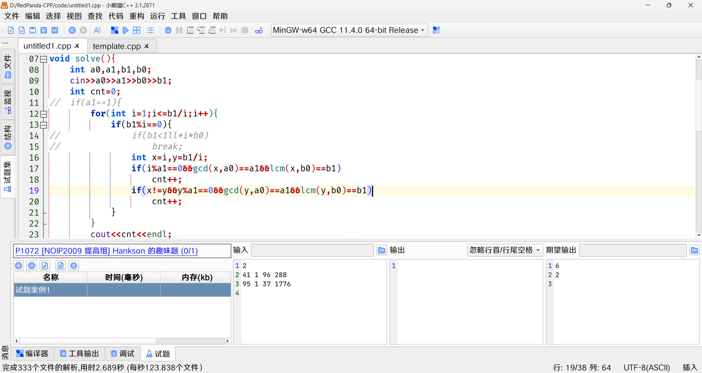
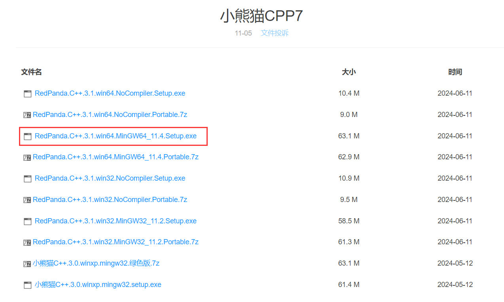
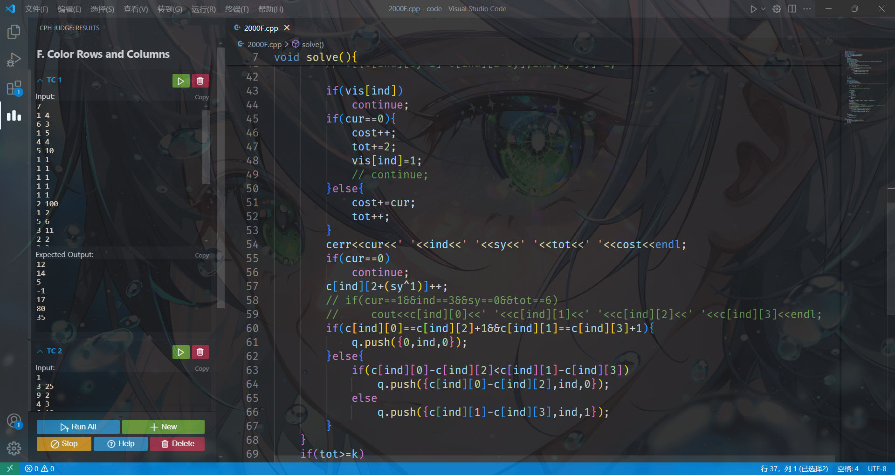
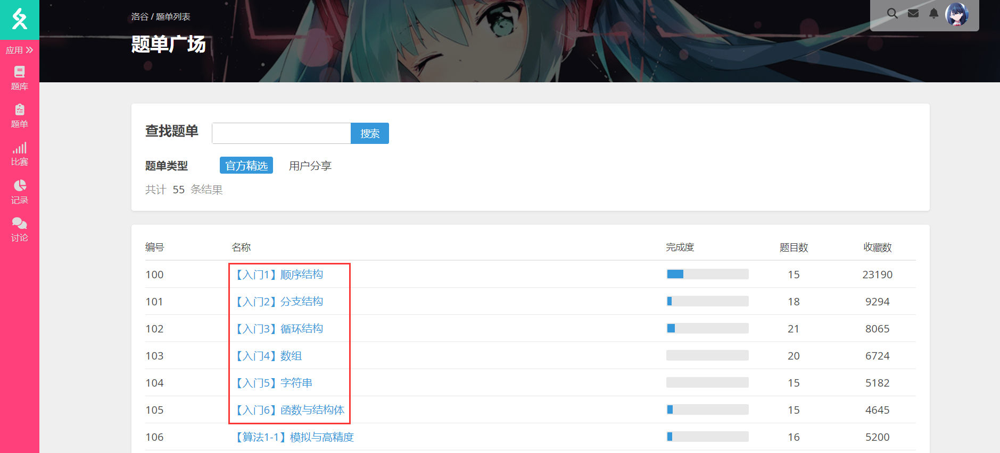

# 前言

千里之途，始于足下。想要打好算法竞赛，首先需要学好编程语言，所以本文会讲述如何以打算法竞赛为目的学好C语言。

# 挑选合适的代码编辑软件

算法竞赛所有的编程工作都在代码编辑软件上完成，所以有一个好用的代码编辑软件是十分必要的。

首要推荐 [小熊猫C++](http://royqh.net/redpandacpp/) 这是一款国人开发的免费代码编辑软件，在著名开源代码编辑软件DEV-C++的基础上开发而来，简单易用，功能完全，最重要的是无需自己动手配置环境，打开即用。

主要界面如下

下载如下图所示版本即可（后缀包含win64 MinGW64 Setup的版本)

---

次要推荐 [VSCODE](https://code.visualstudio.com/) 这款软件是微软公司推出的免费代码编辑工具，功能强大，拥趸众多。配置这个软件需要耗费一定的精力和时间，但是较为容易，网上有足够的教程，在此不再赘述。（喜欢折腾的同学可以搞搞）

主要界面如下（个人配置）

# 学好C语言基础（竞赛向）

算法竞赛并不会以各种刁钻的角度考察编程语言基础，这一点与受人诟病的C语言期末考试并不相同。所以我们只需要熟练运用基础语言知识即可。~~能做到竞赛的C语言要求，期末考试能考到90分以上也是了~~

自学能力较强的同学可以通过**菜鸟教程**加**做题**来学习，对自己自学能力不自信的可以通过**视频讲解**加**做题**来进行学习。

需要掌握以下语法内容
- 基础语法、数据类型、变量、常量、运算符
- 判断、循环
- 函数、数组、字符串、结构体

菜鸟教程：[链接](https://www.runoob.com/cprogramming/c-decision.html)
视频讲解推荐：[链接](https://www.bilibili.com/video/BV17s411N78s/)

---

学习编程语言，做题是重中之重。只有做题才能掌握熟练一个知识点，这点与义务教育是一样的。

根据洛谷给出的题单一道一道写下去即可。当然需要注册一个洛谷账号（笑）。

~~我不是洛谷入门的所以完成度低~~

洛谷：[链接](https://www.luogu.com.cn/)
